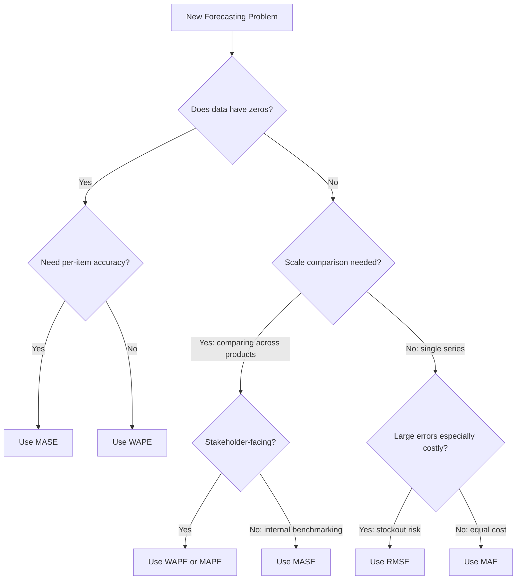
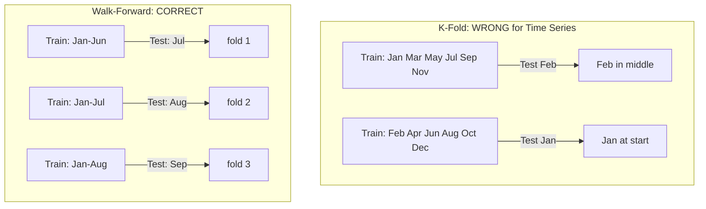
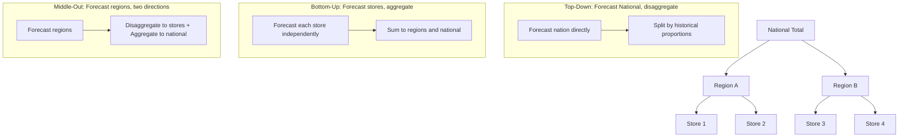
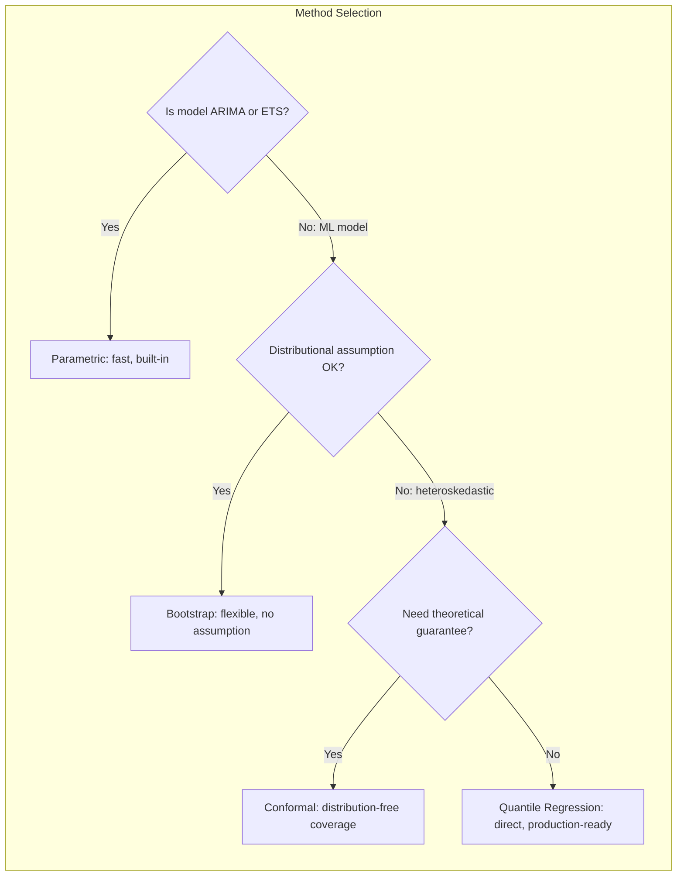

---
# Document Outline
- [Executive Summary](#executive-summary)
- [4.4 Practical Considerations](#44-practical-considerations-h)
  - [4.4.1 Evaluation Metrics](#441-evaluation-metrics-c)
    - [One-Liner & Intuition](#one-liner--intuition)
    - [The Metrics Zoo](#the-metrics-zoo)
    - [MAPE's Three Failure Modes](#mapes-three-failure-modes)
    - [WAPE: The Business Default](#wape-weighted-absolute-percentage-error)
    - [MASE: The Scale-Free Benchmark](#mase-mean-absolute-scaled-error)
    - [Metric Selection Decision Flowchart](#metric-selection-decision-flowchart)
    - [Python Implementation](#python-implementation-metrics)
  - [4.4.2 Cross-Validation for Time Series](#442-cross-validation-for-time-series-h)
    - [One-Liner & Intuition](#one-liner--intuition-1)
    - [Why K-Fold Fails for Time Series](#why-k-fold-fails-for-time-series)
    - [Walk-Forward Validation](#walk-forward-walk-forward-validation)
    - [Expanding vs Sliding Window](#expanding-vs-sliding-window)
    - [Multi-Step Horizon CV](#multi-step-horizon-cv)
    - [Python Implementation](#python-implementation-cv)
  - [4.4.3 Multiple Seasonalities](#443-multiple-seasonalities-m)
    - [One-Liner & Intuition](#one-liner--intuition-2)
    - [Why SARIMA Can't Handle Multiple Periods](#why-sarima-cant-handle-multiple-periods)
    - [Methods for Multiple Seasonalities](#methods-comparison)
    - [MSTL Deep Dive](#mstl-multiple-seasonal-trend-decomposition-using-loess)
    - [Fourier Terms Approach](#fourier-terms-approach)
    - [Python Implementation](#python-implementation-multiple-seasonalities)
  - [4.4.4 Hierarchical Forecasting](#444-hierarchical-forecasting-m)
    - [One-Liner & Intuition](#one-liner--intuition-3)
    - [The Coherence Problem](#the-coherence-problem)
    - [Three Core Approaches](#three-core-approaches)
    - [MinT Optimal Reconciliation](#mint-optimal-reconciliation)
    - [Python Implementation](#python-implementation-hierarchical)
- [4.5 Uncertainty Quantification](#45-uncertainty-quantification-m)
  - [4.5.1 Prediction Intervals](#451-prediction-intervals-m)
    - [One-Liner & Intuition](#one-liner--intuition-4)
    - [Why Point Forecasts Are Insufficient](#why-point-forecasts-are-insufficient)
    - [Method 1: Parametric Intervals](#method-1-parametric-intervals)
    - [Method 2: Bootstrap Intervals](#method-2-bootstrap-residual-resampling)
    - [Method 3: Quantile Regression](#method-3-quantile-regression)
    - [Method 4: Conformal Prediction](#method-4-conformal-prediction-l)
    - [Python Implementation](#python-implementation-intervals)
- [Company-Specific Angles](#company-specific-angles)
- [Interview Cheat Sheet](#interview-cheat-sheet)
- [Self-Test Questions](#self-test-questions)
- [Learning Objectives Checklist](#learning-objectives-checklist)

# Executive Summary

> [!CAUTION]
> **Mermaid Chart Syntax Rules**:
> 1. Use `graph` instead of `flowchart` (more compatible across renderers)
> 2. Avoid `<br/>` HTML tags in node labels (use colons or commas instead)
> 3. Avoid Unicode characters (use `phi_1` not `φ₁`)
> 4. Quote labels with special characters like `>`, `<`, or operators

This guide covers Practical Forecasting: how to evaluate models (MAE, RMSE, MAPE, WAPE, MASE) and the three ways MAPE will betray you; how to cross-validate time series correctly (walk-forward, expanding vs sliding window); how to handle multiple seasonalities (MSTL, TBATS, Fourier terms); hierarchical forecasting and reconciliation (top-down, bottom-up, MinT); and uncertainty quantification (parametric, bootstrap, quantile regression, and conformal prediction intervals). These topics separate competent practitioners from senior practitioners in interviews.

---

# 4.4 Practical Considerations [H]

> **Study Time**: 8 hours | **Priority**: [H] High (with [C] Critical subsection on metrics) | **Goal**: Know when to use each approach and avoid common production pitfalls

---

## 4.4.1 Evaluation Metrics [C]

### One-Liner & Intuition

> [!TIP]
> **If You Remember ONE Thing**: MAPE sounds great but fails at zeros, penalizes over-prediction, and ignores volume — know WAPE for business and MASE for benchmarking.

**One-Liner (≤15 words)**: *Choosing the wrong metric is the fastest way to "win" at the wrong thing.*

**Intuition (Everyday Analogy)**:
Imagine grading a student who gets 9/10 easy questions right and 1/10 hard questions wrong. MAE treats all questions equally. RMSE punishes the hard miss more. MAPE treats every question as equally important regardless of its point value. WAPE weights by the point value. The right answer depends on what "winning" means for the business.

**Why This Matters in Interviews**: Interviewers often ask "You got 5% MAPE — good or bad?" to test whether you understand the metric's hidden assumptions. The right answer is "it depends on whether the data has zeros, asymmetric costs, and what counts as the business unit."

---

### The Metrics Zoo

| Metric | Formula | Strengths | Weaknesses |
|--------|---------|-----------|------------|
| **MAE** | $\frac{1}{n}\sum\|y_t - \hat{y}_t\|$ | Robust to outliers, same units as data | Not scale-free, treats all errors equally |
| **RMSE** | $\sqrt{\frac{1}{n}\sum(y_t - \hat{y}_t)^2}$ | Penalizes large errors, differentiable | Sensitive to outliers, inflates with volume |
| **MAPE** | $\frac{100}{n}\sum\left\|\frac{y_t - \hat{y}_t}{y_t}\right\|$ | Percentage-based, interpretable | Fails at zeros, asymmetric, volume-blind |
| **SMAPE** | $\frac{200}{n}\sum\frac{\|y_t - \hat{y}_t\|}{\|y_t\| + \|\hat{y}_t\|}$ | Symmetric version of MAPE | Still awkward at zeros, confusing values |
| **WAPE** | $\frac{\sum\|y_t - \hat{y}_t\|}{\sum y_t} \times 100$ | Volume-weighted, robust to zeros | Hides per-item accuracy |
| **MASE** | $\frac{MAE}{MAE_{naive}}$ | Scale-free, handles zeros, uses naive benchmark | Less intuitive for business stakeholders |

> [!NOTE]
> **WAPE = Weighted MAPE = MAD/Mean ratio = 100 × (sum of abs errors / sum of actuals)**. All the same thing, different names across companies.

---

### MAPE's Three Failure Modes

> [!IMPORTANT]
> **Memorize these for any senior-level metrics discussion. They are the most common interview pitfall.**

**Failure Mode 1: Zeros in the denominator**

```
If y_t = 0 (store was closed), then MAPE = |0 - ŷ| / 0 = undefined.
Even y_t = 1 with ŷ = 5 gives MAPE = 400% — catastrophically distorted.
```

**Fix**: Use WAPE (aggregated) or MASE (scales to naive forecast baseline).

---

**Failure Mode 2: Asymmetric penalty**

MAPE is NOT symmetric. Consider actual = 100:
- **Over-predict by 50%** (ŷ = 150): MAPE = |100 - 150| / 100 = 50%
- **Under-predict by 50%** (ŷ = 50): MAPE = |100 - 50| / 100 = 50%

So far so good — but now consider:
- **Over-predict by 100%** (ŷ = 200): MAPE = 100%
- **Under-predict by 100%** (ŷ = 0): MAPE = 100%

The problem: you can *never* under-predict by more than 100% (bounded below by 0), but you can over-predict by 200%, 500%, 1000%... MAPE disproportionately penalizes over-prediction at large magnitudes, pushing models to be systematically downward-biased.

**Fix**: SMAPE partially corrects this; quantile regression directly optimizes for the actual cost asymmetry.

---

**Failure Mode 3: Volume-blindness**

5% MAPE on 10-unit SKU = 0.5 units error.
5% MAPE on 10,000-unit SKU = 500 units error.

A model achieving 5% MAPE on tiny items and 15% on high-volume items looks "worse" by MAPE but is probably *better* for the business (total inventory cost is lower).

**Fix**: WAPE naturally weights by volume. Report both overall MAPE and WAPE; they will diverge in the presence of volume imbalance.

---

### WAPE: Weighted Absolute Percentage Error

**Definition**: MAE divided by mean actual, expressed as a percentage.

$$WAPE = \frac{\sum_{t=1}^{n} |y_t - \hat{y}_t|}{\sum_{t=1}^{n} y_t} \times 100$$

**Why it works for business**:
- A 10-unit error on a 100-unit item gets 10× more weight than on a 10-unit item
- Zeros don't cause division by zero (summing over many items)
- Directly interpretable as "% of total demand that is incorrectly forecast"

**Interview framing**: "For reporting to inventory/supply chain teams, I prefer WAPE. It gives the right incentive: reduce errors where volume is high."

---

### MASE: Mean Absolute Scaled Error

**Definition**: MAE of your model divided by MAE of the seasonal naive baseline.

$$MASE = \frac{MAE}{\frac{1}{n-m}\sum_{t=m+1}^{n}|y_t - y_{t-m}|}$$

Where *m* = seasonal period (12 for monthly, 7 for weekly, 1 for non-seasonal).

**Interpretation**:
- **MASE < 1**: Your model beats the naive baseline → good
- **MASE = 1**: Same as naive → useless
- **MASE > 1**: Worse than naive → there is a problem

**Why it matters for interviews**: MASE is the official metric of the M-competition (M4, M5). Saying "I benchmarked against naive and reported MASE" signals rigor.

**When to use**: Any scale-free comparison across products, especially intermittent demand (where MAPE fails).

---

### Metric Selection Decision Flowchart



---

### Python Implementation: Metrics

```python
import numpy as np

def mae(actuals, forecasts):
    """Mean Absolute Error — robust, same units as data."""
    return np.mean(np.abs(actuals - forecasts))

def rmse(actuals, forecasts):
    """Root Mean Squared Error — penalizes large errors more."""
    return np.sqrt(np.mean((actuals - forecasts) ** 2))

def mape(actuals, forecasts, epsilon=1e-10):
    """MAPE — use only when no zeros in actuals. epsilon guards against zero-division."""
    return np.mean(np.abs((actuals - forecasts) / (actuals + epsilon))) * 100

def wape(actuals, forecasts):
    """Weighted Absolute Percentage Error — volume-weighted, robust to zeros.
    Also called MAD/Mean ratio. Preferred for supply chain reporting.
    """
    return np.sum(np.abs(actuals - forecasts)) / np.sum(actuals) * 100

def mase(actuals, forecasts, seasonality=1):
    """MASE — scale-free metric using seasonal naive as baseline.
    seasonality=1 for non-seasonal (naive), =12 for monthly, =7 for weekly.
    MASE < 1 means your model beats naive.
    """
    n = len(actuals)
    naive_errors = np.abs(actuals[seasonality:] - actuals[:-seasonality])
    naive_mae = np.mean(naive_errors)
    if naive_mae == 0:
        return np.nan  # perfectly predictable series
    return np.mean(np.abs(actuals - forecasts)) / naive_mae

def smape(actuals, forecasts):
    """Symmetric MAPE — less common, partially corrects MAPE asymmetry."""
    return np.mean(
        2 * np.abs(actuals - forecasts) / (np.abs(actuals) + np.abs(forecasts))
    ) * 100

# --- Evaluation report ---
def forecast_report(actuals, forecasts, seasonality=12):
    """Comprehensive report of all key metrics."""
    has_zeros = np.any(actuals == 0)
    print(f"Actuals range: {actuals.min():.1f} – {actuals.max():.1f}")
    print(f"Has zeros: {has_zeros} (MAPE {'unreliable' if has_zeros else 'OK'})")
    print(f"MAE:   {mae(actuals, forecasts):.4f}")
    print(f"RMSE:  {rmse(actuals, forecasts):.4f}")
    if not has_zeros:
        print(f"MAPE:  {mape(actuals, forecasts):.2f}%")
    print(f"WAPE:  {wape(actuals, forecasts):.2f}%  ← preferred for supply chain")
    print(f"MASE:  {mase(actuals, forecasts, seasonality):.4f}  ← <1 beats naive")
```

> [!TIP]
> **Interview Answer Template**: "For this problem, I'd use WAPE as the primary metric because [volume imbalance / data has zeros]. I'd also report MASE to benchmark against the seasonal naive baseline, and RMSE if large errors carry disproportionate inventory costs."

---

## 4.4.2 Cross-Validation for Time Series [H]

### One-Liner & Intuition

> [!TIP]
> **If You Remember ONE Thing**: k-fold randomly mixes past and future — you'd be training on tomorrow to predict yesterday. Walk-forward validation respects causality.

**One-Liner (≤15 words)**: *Time series CV must respect temporal order — future data can never inform past predictions.*

**Intuition (Everyday Analogy)**:
Imagine studying for a history exam by reading the answer key that includes questions from the actual test. You'd get a great "practice score" but fail the real exam. K-fold CV does exactly this to time series models — it leaks future observations into training.

---

### Why K-Fold Fails for Time Series



**What goes wrong with k-fold**:
1. **Data leakage**: Model trained on future months can "know" trends it shouldn't know
2. **Autocorrelation ignored**: Shuffling breaks the autocorrelation structure the model is trying to learn
3. **Optimistic estimates**: Validation score will be better than actual deployment performance

> [!WARNING]
> **Red Flag**: If a candidate says "I used 5-fold cross-validation for my time series model" without caveats, it's a strong signal they don't understand time series validation.

---

### Walk-Forward Validation

**Core principle**: Train on all data up to time T, predict T+1 through T+h, move forward one step, repeat.

```
Fold 1: Train [Jan...Jun]  → Test [Jul]
Fold 2: Train [Jan...Jul]  → Test [Aug]
Fold 3: Train [Jan...Aug]  → Test [Sep]
...
Fold k: Train [Jan...T-1]  → Test [T]
```

**Why it works**: Each fold simulates a real deployment scenario — you only know the past when making predictions.

---

### Expanding vs Sliding Window

| Dimension | Expanding Window | Sliding Window |
|-----------|-----------------|----------------|
| **Training set** | Grows with each fold (Jan–Feb, Jan–Mar, Jan–Apr...) | Fixed size (Jan–Mar, Feb–Apr, Mar–May...) |
| **Assumption** | More data always helps; underlying process stable | Recent data most relevant; older data may mislead |
| **When to prefer** | Most cases: long histories, stable patterns | Concept drift; non-stationary with changing behavior |
| **Downside** | Early folds have less data than production | Loses long-run patterns; may underfit |

> [!NOTE]
> **Rule of thumb**: Default to expanding window. Switch to sliding if you observe that model performance degrades when trained on the full history (older data is hurting rather than helping).


*■ = training data, ○ = test point, _ = dropped data*

---

### Multi-Step Horizon CV

When forecasting h-steps ahead, be careful about what you're evaluating:

```python
# 1-step-ahead CV (easy — you always have previous actuals)
for each fold:
    train on [1...t], predict t+1

# h-step-ahead CV (harder — need to decide: recursive or direct)
for each fold:
    train on [1...t], predict t+1, t+2, ..., t+h
```

**Two strategies for multi-step**:

| Strategy | Approach | Pros | Cons |
|----------|---------|------|------|
| **Recursive** | Predict t+1, feed as input to predict t+2, etc. | Simple, one model | Error accumulates with horizon |
| **Direct** | Train separate model for each horizon (1-step, 2-step, ... h-step) | No error accumulation | 7× more models for 7-day horizon |

---

### Python Implementation: CV

```python
from sklearn.model_selection import TimeSeriesSplit
import numpy as np

# --- Basic walk-forward CV ---
tscv = TimeSeriesSplit(n_splits=5)
scores = []

for fold_num, (train_idx, test_idx) in enumerate(tscv.split(X)):
    X_train, X_test = X.iloc[train_idx], X.iloc[test_idx]
    y_train, y_test = y.iloc[train_idx], y.iloc[test_idx]

    model.fit(X_train, y_train)
    preds = model.predict(X_test)
    score = wape(y_test.values, preds)
    scores.append(score)
    print(f"Fold {fold_num+1}: WAPE={score:.2f}%  (train={len(train_idx)}, test={len(test_idx)})")

print(f"Mean WAPE: {np.mean(scores):.2f}% ± {np.std(scores):.2f}%")


# --- Sliding window (fixed training size) ---
def sliding_window_cv(X, y, train_size=104, test_size=4, step=4):
    """
    Walk-forward CV with fixed sliding window.
    E.g.: train_size=104 weeks (2 years), test_size=4 weeks, step=4 weeks.
    """
    scores = []
    n = len(X)

    for start in range(0, n - train_size - test_size + 1, step):
        end_train = start + train_size
        end_test = end_train + test_size

        X_train, y_train = X.iloc[start:end_train], y.iloc[start:end_train]
        X_test, y_test = X.iloc[end_train:end_test], y.iloc[end_train:end_test]

        model.fit(X_train, y_train)
        preds = model.predict(X_test)
        scores.append(wape(y_test.values, preds))

    return scores


# --- Prophet's built-in CV (handles its own time structure) ---
from prophet.diagnostics import cross_validation, performance_metrics

df_cv = cross_validation(
    model=prophet_model,
    initial='730 days',   # 2 years training
    period='90 days',     # new fold every 90 days
    horizon='30 days'     # predict 30 days ahead
)
df_metrics = performance_metrics(df_cv)
print(df_metrics[['horizon', 'mae', 'rmse', 'mape']].head(10))
```

> [!TIP]
> **Interview Answer Template**: "I use walk-forward validation — training on all data up to a cutoff, testing on what follows. For production simulations, I use an expanding window to mimic real deployment. I'd never use k-fold for time series since it leaks future data into training."

---

## 4.4.3 Multiple Seasonalities [M]

### One-Liner & Intuition

> [!TIP]
> **If You Remember ONE Thing**: SARIMA handles ONE seasonal period. For daily + weekly + yearly patterns, use MSTL, Prophet, TBATS, or Fourier features.

**One-Liner (≤15 words)**: *Real-world data has daily, weekly, and yearly rhythms — SARIMA can only see one at a time.*

**Intuition (Everyday Analogy)**:
Electricity demand peaks every morning (daily), peaks more on weekdays (weekly), and peaks in summer/winter (yearly). SARIMA can model one clock at a time. MSTL and Fourier terms let you run multiple clocks simultaneously — each ticking at its own frequency.

---

### Why SARIMA Can't Handle Multiple Periods

SARIMA(p,d,q)(P,D,Q)**m** has exactly **one** seasonal period *m*.

For daily data with weekly (m=7) AND yearly (m=365) seasonality:
- Using SARIMA with m=7 → misses the yearly pattern entirely
- Using SARIMA with m=365 → 365 seasonal parameters, computationally intractable, massively overfits
- Can't specify both simultaneously in the standard formulation

> [!WARNING]
> **Red Flag Answer**: "I'd just use SARIMA with a long period." This signals the candidate doesn't understand the parameter explosion problem — SARIMA(1,0,0)(1,0,0)₃₆₅ already has 2 seasonal AR parameters but the seasonal differencing creates 365 lags.

---

### Methods Comparison

| Method | Handles Multiple Periods? | Scalable? | Interpretable? | When to Use |
|--------|--------------------------|-----------|----------------|-------------|
| **SARIMA** | No (one period only) | Yes | Yes | Single clear seasonality |
| **MSTL** | Yes (multiple via iteration) | Yes | Yes | Decomposition + any downstream model |
| **TBATS** | Yes (complex error structure) | Moderate | Low | Automatic, black-box OK |
| **Prophet** | Yes (via Fourier series) | Yes (local) | Yes | Business use, holidays, moderate scale |
| **Fourier Features + ML** | Yes (manual Fourier terms) | Yes (global) | Moderate | Many series, ML pipeline |

---

### MSTL: Multiple Seasonal-Trend Decomposition using LOESS

**What it does**: Extends STL to decompose a series into trend + multiple seasonal components, iterating until convergence.

**Algorithm sketch**:
1. Initialize seasonal components S₁, S₂ (daily, weekly) = 0
2. Subtract S₂ from original → decompose with STL for S₁
3. Subtract S₁ from original → decompose with STL for S₂
4. Iterate until convergence
5. Resulting: Y(t) = Trend + S_daily + S_weekly + S_yearly + Residual

**Use case**: Use MSTL for decomposition, then pass the residuals to any forecasting model (ARIMA, ETS, XGBoost), and add the seasonal components back.

```python
from statsforecast.models import MSTL

# MSTL with weekly (7) and yearly (365.25) seasonalities
model = MSTL(season_length=[7, 365])
model = model.fit(y=series.values)
components = model.model_  # trend, seasonality_7, seasonality_365
```

---

### Fourier Terms Approach

**Core idea**: Any periodic function can be approximated with sine/cosine waves at the right frequencies.

$$S(t) = \sum_{k=1}^{K} \left[ a_k \sin\left(\frac{2\pi k t}{P}\right) + b_k \cos\left(\frac{2\pi k t}{P}\right) \right]$$

- *P* = period (7 for weekly, 365.25 for yearly)
- *K* = number of harmonics (controls flexibility vs smoothness)
- Small K → smooth, slow-varying seasonality
- Large K → sharp, complex seasonality patterns

**Why Fourier terms work well for ML models**: They convert the periodic pattern into numeric features that any model (LightGBM, Ridge, etc.) can directly use.

---

### Python Implementation: Multiple Seasonalities

```python
import numpy as np
import pandas as pd
from statsmodels.tsa.statespace.sarimax import SARIMAX

# --- Approach 1: Fourier terms as exogenous features ---
def fourier_terms(dates, period, K):
    """Generate K pairs of sin/cos features for given period."""
    t = np.arange(len(dates))
    features = {}
    for k in range(1, K + 1):
        features[f'sin_{period}_{k}'] = np.sin(2 * np.pi * k * t / period)
        features[f'cos_{period}_{k}'] = np.cos(2 * np.pi * k * t / period)
    return pd.DataFrame(features, index=dates)

# Generate Fourier terms for weekly + yearly seasonality
dates = pd.date_range('2020-01-01', periods=730, freq='D')
weekly_fourier = fourier_terms(dates, period=7, K=3)     # 3 harmonics
yearly_fourier = fourier_terms(dates, period=365.25, K=5) # 5 harmonics
exog = pd.concat([weekly_fourier, yearly_fourier], axis=1)

# Pass as ARIMAX regressors (ARIMA with exogenous = Fourier features)
model = SARIMAX(y, exog=exog, order=(1, 0, 1))
result = model.fit(disp=False)


# --- Approach 2: Prophet with multiple seasonalities ---
from prophet import Prophet

m = Prophet(
    yearly_seasonality=True,   # default: Fourier terms with K=10
    weekly_seasonality=True,   # default: Fourier terms with K=3
    daily_seasonality=False    # set True if hourly data
)

# Add custom seasonality (e.g., monthly within-month patterns)
m.add_seasonality(
    name='monthly',
    period=30.5,
    fourier_order=3    # controls smoothness
)

m.fit(df)  # df has 'ds' and 'y' columns


# --- Approach 3: LightGBM with Fourier + lag features ---
import lightgbm as lgb

def build_features(df, date_col='date', target_col='sales'):
    """Build complete feature set including Fourier terms."""
    df = df.copy()
    df['t'] = np.arange(len(df))

    # Fourier terms
    for k in range(1, 4):
        df[f'sin_weekly_{k}'] = np.sin(2 * np.pi * k * df['t'] / 7)
        df[f'cos_weekly_{k}'] = np.cos(2 * np.pi * k * df['t'] / 7)
    for k in range(1, 6):
        df[f'sin_yearly_{k}'] = np.sin(2 * np.pi * k * df['t'] / 365.25)
        df[f'cos_yearly_{k}'] = np.cos(2 * np.pi * k * df['t'] / 365.25)

    # Lag features (prevent leakage with .shift(1))
    for lag in [7, 14, 28, 365]:
        df[f'lag_{lag}'] = df[target_col].shift(lag)

    # Rolling statistics (prevent leakage with .shift(1).rolling())
    df['rolling_mean_4w'] = df[target_col].shift(1).rolling(28).mean()
    df['rolling_std_4w'] = df[target_col].shift(1).rolling(28).std()

    return df.dropna()
```

> [!TIP]
> **Interview Answer Template**: "SARIMA handles only one seasonal period, so for data with daily and weekly seasonality I'd use MSTL decomposition to separate the components, or add Fourier terms as exogenous features. Prophet does this automatically. For large-scale ML pipelines, I generate sin/cos Fourier features and feed them to LightGBM."

---

## 4.4.4 Hierarchical Forecasting [M]

### One-Liner & Intuition

> [!TIP]
> **If You Remember ONE Thing**: Bottom-up is safe but slow; top-down is fast but coarse; reconciliation (MinT) gives the best of both by making all levels coherent.

**One-Liner (≤15 words)**: *Forecasts at different aggregation levels must add up — reconciliation ensures coherence.*

**Intuition (Everyday Analogy)**:
You forecast each store's sales independently: Store A = 100, Store B = 80, Store C = 120. Regional total should be 300. But your direct regional forecast says 280. Which is right? That inconsistency makes inventory planning impossible — you can't order 280 and stock 300. Hierarchical reconciliation resolves the conflict mathematically.

---

### The Coherence Problem

**Coherence constraint**: $\sum_{i \in children} \hat{y}_i = \hat{y}_{parent}$ must hold for all nodes.

**Why it matters for supply chain**:
- Procurement teams plan at category level
- Planners work at SKU level
- Finance uses region/channel level
- If forecasts don't add up, you get stock imbalances, phantom orders, and trust erosion

---

### Three Core Approaches



| Approach | How It Works | Best For | Risk |
|----------|-------------|----------|------|
| **Top-Down** | Forecast aggregate → disaggregate using historical proportions | Few series, stable proportions, slow computation budget | Ignores local patterns; poor for new stores |
| **Bottom-Up** | Forecast each leaf → sum up the hierarchy | Accurate local patterns, heterogeneous products | Noisy leaf-level forecasts can make aggregate worse |
| **Middle-Out** | Forecast middle level → push up and down | Natural business planning level (category, region) | Requires choosing the right middle level |

---

### MinT Optimal Reconciliation

**The problem with top-down/bottom-up**: Both are arbitrary projection choices. MinT (Minimum Trace) is the *optimal* reconciliation under a statistical criterion.

**What MinT does**: Given base forecasts at all levels, find the adjustment to each forecast that makes them coherent while minimizing total forecast variance.

**Formula intuition**:
$$\tilde{\mathbf{y}} = \mathbf{S}(\mathbf{S}^T \mathbf{W}^{-1}\mathbf{S})^{-1}\mathbf{S}^T\mathbf{W}^{-1}\hat{\mathbf{y}}$$

Where S = summing matrix (encodes hierarchy), W = covariance matrix of base forecast errors, ŷ = base (incoherent) forecasts.

**Practical note**: MinT requires estimating the error covariance matrix W, which needs enough history. With shrinkage (OLS or WLS), it works well even with moderate data.

---

### Python Implementation: Hierarchical

```python
# --- Using statsforecast + hierarchicalforecast ---
from hierarchicalforecast.core import HierarchicalReconciliation
from hierarchicalforecast.methods import BottomUp, TopDown, MinTrace

# Define hierarchy structure as a pandas DataFrame
# Columns: ['Country', 'Region', 'Store', 'unique_id']
# Y_df: actual values; Y_hat_df: base forecasts at all levels

reconcilers = [
    BottomUp(),
    TopDown(method='forecast_proportions'),
    MinTrace(method='mint_shrink')   # recommended default
]

hrec = HierarchicalReconciliation(reconcilers=reconcilers)
Y_rec_df = hrec.reconcile(
    Y_df=Y_df,
    Y_hat_df=Y_hat_df,
    S=S_df,    # summing matrix
    tags=tags  # level names
)

# --- Manual bottom-up example ---
import pandas as pd

def bottom_up_reconcile(store_forecasts: pd.DataFrame, hierarchy: dict) -> pd.DataFrame:
    """
    Simple bottom-up: sum store forecasts to regions and national.
    store_forecasts: DataFrame with store_id, date, forecast columns.
    hierarchy: {'StoreA': 'RegionNorth', 'StoreB': 'RegionNorth', ...}
    """
    store_forecasts['region'] = store_forecasts['store_id'].map(hierarchy)

    # Aggregate to region
    region_forecasts = (store_forecasts
                        .groupby(['region', 'date'])['forecast']
                        .sum()
                        .reset_index())

    # Aggregate to national
    national_forecast = (store_forecasts
                         .groupby('date')['forecast']
                         .sum()
                         .reset_index()
                         .assign(level='national'))

    return store_forecasts, region_forecasts, national_forecast
```

> [!TIP]
> **Interview Answer Template**: "For hierarchical forecasting, I'd default to bottom-up — aggregate store-level forecasts to region and national. If the question is about alignment and coherence across planning levels, I'd mention MinT reconciliation, which optimally adjusts all levels simultaneously. The key business requirement is that store-level forecasts must sum to the regional plan."

---

# 4.5 Uncertainty Quantification [M]

> **Study Time**: 2 hours | **Priority**: [M] Medium | **Goal**: Know why point forecasts are insufficient and 2+ methods for generating intervals

---

## 4.5.1 Prediction Intervals [M]

### One-Liner & Intuition

> [!TIP]
> **If You Remember ONE Thing**: A point forecast is just "my best guess" — prediction intervals tell you "how wide the cone of uncertainty is," which is what inventory planners actually need.

**One-Liner (≤15 words)**: *Safety stock, not point forecasts, drives inventory decisions — and safety stock requires uncertainty estimates.*

**Intuition (Everyday Analogy)**:
A weather forecast says "High of 72°F." But a picnic planner needs to know: could it be 62° or 82°? The range matters. In demand forecasting, an inventory planner needs the 90th percentile of demand to set safety stock — a point forecast tells them nothing about that.

---

### Why Point Forecasts Are Insufficient

| Business Decision | What They Actually Need | Why Point Forecast Fails |
|-------------------|------------------------|--------------------------|
| Safety stock level | 90th percentile of demand | Point forecast = 50th percentile only |
| Budget planning | Downside risk (10th percentile) | Can't assess worst-case from a mean |
| Supply contract | Confidence range for negotiation | Single number has no credibility signal |
| Anomaly detection | "Is this observation surprising?" | Need a reference band to judge |

**The key insight**: Most supply chain decisions are asymmetric. Running out of stock (stockout) is much more costly than having too much (overstock) for high-demand items. Setting the service level (e.g., 95%) requires knowing the distribution of forecast errors, not just the mean.

---

### Method 1: Parametric Intervals

**Assumption**: Forecast errors follow a known distribution (usually Normal).

$$\hat{y}_t \pm z_{\alpha/2} \cdot \hat{\sigma}$$

Where $\hat{\sigma}$ is the estimated forecast error standard deviation (from training residuals).

**How to get σ**:
- ARIMA: exact formula from model structure
- ETS: propagated through state-space equations
- ML models: need empirical or other methods below

**Pros**: Fast, easy to implement, closed-form
**Cons**: Assumes errors are Normal and IID — often wrong (heteroskedastic, skewed demand)

```python
from statsmodels.tsa.arima.model import ARIMA

model = ARIMA(y_train, order=(1, 1, 1))
result = model.fit()

# Forecast with parametric prediction intervals
forecast = result.get_forecast(steps=12)
pred_df = forecast.summary_frame(alpha=0.05)  # 95% intervals
# pred_df contains: mean, mean_se, mean_ci_lower, mean_ci_upper
```

---

### Method 2: Bootstrap Residual Resampling

**Idea**: Resample historical residuals to simulate possible futures. Does not assume distributional form.

**Algorithm**:
1. Fit model → get residuals $e_1, e_2, ..., e_T$
2. For each bootstrap iteration b = 1..B:
   - Randomly sample T residuals with replacement
   - Generate simulated path: $\hat{y}_{t+h}^{(b)} = \hat{y}_{t+h} + $ sampled residual chain
3. Take quantiles of the B simulated paths as prediction bounds

**Pros**: Distribution-free, works for complex models
**Cons**: Assumes residuals are IID (ignores autocorrelation); computationally expensive

```python
import numpy as np

def bootstrap_intervals(y_train, model, steps, n_boot=500, alpha=0.05):
    """
    Bootstrap prediction intervals via residual resampling.
    Works with any model that has .fit() and .predict() interface.
    """
    result = model.fit(y_train)
    point_forecast = result.predict(start=len(y_train), end=len(y_train) + steps - 1)
    residuals = y_train.values - result.fittedvalues.values

    boot_forecasts = []
    for _ in range(n_boot):
        # Resample residuals for the forecast horizon
        sampled_errors = np.random.choice(residuals, size=steps, replace=True)
        boot_forecasts.append(point_forecast + sampled_errors)

    boot_matrix = np.array(boot_forecasts)  # shape: (n_boot, steps)
    lower = np.quantile(boot_matrix, alpha / 2, axis=0)
    upper = np.quantile(boot_matrix, 1 - alpha / 2, axis=0)

    return point_forecast, lower, upper
```

---

### Method 3: Quantile Regression

**Idea**: Instead of modeling the mean, directly model specific quantiles of the target distribution.

**For LightGBM/XGBoost**: Use the `quantile` objective with the desired alpha.

$$q_\alpha = \underset{q}{\operatorname{argmin}} \sum_t \rho_\alpha(y_t - q)$$

Where $\rho_\alpha(u) = u(\alpha - \mathbb{1}[u < 0])$ is the pinball (quantile) loss.

**Pros**: Model directly outputs the percentile you want; handles heteroskedastic errors naturally; integrates cleanly into ML pipelines
**Cons**: Need to train separate models for each quantile; no guarantee of interval crossing avoidance

> [!NOTE]
> **Why this is the go-to for ML forecasting**: It requires no distributional assumptions. You train a model for the 10th percentile and a separate model for the 90th percentile. Each model is trained to minimize pinball loss.

```python
import lightgbm as lgb
import numpy as np

def train_quantile_models(X_train, y_train, quantiles=[0.1, 0.5, 0.9]):
    """
    Train separate LightGBM models for each quantile.
    Returns dict of {quantile: fitted_model}.
    """
    models = {}
    for q in quantiles:
        model = lgb.LGBMRegressor(
            objective='quantile',
            alpha=q,
            n_estimators=500,
            learning_rate=0.05,
            num_leaves=31
        )
        model.fit(
            X_train, y_train,
            eval_set=[(X_train, y_train)],
            callbacks=[lgb.early_stopping(50), lgb.log_evaluation(100)]
        )
        models[q] = model
    return models

def get_quantile_intervals(models, X_test):
    """Generate prediction intervals from quantile models."""
    lower = models[0.1].predict(X_test)
    median = models[0.5].predict(X_test)
    upper = models[0.9].predict(X_test)
    return lower, median, upper

# Training
models = train_quantile_models(X_train, y_train, quantiles=[0.1, 0.5, 0.9])
lower, median, upper = get_quantile_intervals(models, X_test)
```

---

### Method 4: Conformal Prediction [L]

**Why it matters (awareness level)**: Conformal prediction provides **distribution-free, finite-sample coverage guarantees** — a mathematical promise that the interval contains the true value at least (1-α)% of the time under minimal assumptions.

**Core idea (split conformal)**:
1. Split training data into fit set and calibration set
2. Fit model on fit set
3. Compute residuals on calibration set
4. The (1-α) quantile of those residuals is your interval half-width

**Key property**: Unlike parametric or bootstrap methods, coverage is *guaranteed* regardless of whether errors are Normal, IID, or otherwise well-behaved.

```python
import numpy as np

def split_conformal_intervals(X_train, y_train, X_test, base_model, alpha=0.1):
    """
    Split conformal prediction intervals.
    Guarantees coverage >= (1-alpha) under exchangeability (weak IID assumption).

    alpha=0.1 → 90% prediction intervals.
    """
    # Split train into fit and calibration
    split_idx = int(len(X_train) * 0.8)
    X_fit, X_calib = X_train[:split_idx], X_train[split_idx:]
    y_fit, y_calib = y_train[:split_idx], y_train[split_idx:]

    # Fit model on fit set
    base_model.fit(X_fit, y_fit)

    # Compute calibration residuals (nonconformity scores)
    calib_preds = base_model.predict(X_calib)
    residuals = np.abs(y_calib - calib_preds)

    # Find (1-alpha) quantile of residuals
    n = len(residuals)
    q_level = np.ceil((1 - alpha) * (n + 1)) / n
    q_hat = np.quantile(residuals, min(q_level, 1.0))

    # Apply to test predictions
    test_preds = base_model.predict(X_test)
    lower = test_preds - q_hat
    upper = test_preds + q_hat

    return lower, test_preds, upper

# --- Using MAPIE library (production-ready implementation) ---
from mapie.regression import MapieRegressor
from sklearn.linear_model import Ridge

base_model = Ridge()
mapie = MapieRegressor(base_model, method='base', cv='split')
mapie.fit(X_train, y_train)
y_pred, y_pis = mapie.predict(X_test, alpha=0.1)
# y_pis[:, 0, 0] = lower bound
# y_pis[:, 1, 0] = upper bound
```

> [!NOTE]
> **When to mention conformal in interviews**: Mention it when the interviewer asks "how would you guarantee coverage" or "how would you handle non-normal errors." It shows awareness of cutting-edge uncertainty quantification without requiring you to go deep unless asked.

---

### Comparison: All Interval Methods



| Method | Model Agnostic? | Distributional Assumption | Coverage Guarantee? | Production Complexity |
|--------|----------------|--------------------------|--------------------|-----------------------|
| Parametric | No (ARIMA/ETS) | Normal errors | Approximate | Low |
| Bootstrap | Yes | IID residuals | Approximate | Medium |
| Quantile Regression | Yes | None | None | Medium (3 models) |
| Conformal | Yes | Exchangeability only | **Yes (exact)** | Medium-High |

---

# Company-Specific Angles

## Amazon / AWS
- **Inventory Planning at Scale**: Amazon forecasts 100M+ ASINs. Questions focus on WAPE vs MAPE at scale, global LightGBM with quantile outputs, and CI/CD for model monitoring.
- **Hierarchical Demand**: Category → subcategory → ASIN hierarchy is a real interview topic; MinT reconciliation and coherence enforcement are relevant.
- **DeepAR + Prediction Intervals**: Amazon open-sourced DeepAR which outputs full predictive distributions — expect questions on why probabilistic forecasts matter for safety stock.

## Meta / Google
- **Metrics Framing**: These companies love "metrics design" questions. "You improved MAPE 5% but revenue didn't move — what happened?" (Volume-blind MAPE failure.)
- **Experiment Evaluation**: Walk-forward CV connects to A/B testing — why can't you do a standard A/B test for a forecasting model? Answer: sequential data, contamination from temporal correlation.
- **Uncertainty for Decision-Making**: Quantile regression intervals feeding into optimization problems (pricing, budget allocation).

## Supply Chain / Retail
- **Hierarchical Reconciliation**: Planners work at category level, procurement at SKU level. Coherence is a real operational requirement, not just theoretical.
- **Asymmetric Costs**: Overstock vs stockout have different costs — this directly motivates quantile regression at non-0.5 quantiles.
- **Multiple Seasonalities**: Retail has daily + weekly + promotional + holiday patterns. MSTL and Fourier features are industry standard.

---

# Interview Cheat Sheet

## The "Right" Answer Templates

| Question | Senior Answer |
|----------|---------------|
| "Your MAPE is 12%, is that good?" | "Depends: does data have zeros? Is 12% on high-volume or low-volume SKUs? I'd rather report WAPE and MASE alongside MAPE." |
| "How do you cross-validate a TS model?" | "Walk-forward validation — train on [Jan...T], test on T+1, expand window. Never k-fold." |
| "Your data has daily + weekly patterns. Approach?" | "SARIMA handles one seasonality; I'd use MSTL or Fourier terms. Prophet works well for moderate scale." |
| "You forecast 1000 stores and need national totals." | "Bottom-up: forecast each store, aggregate. For coherent hierarchical planning, consider MinT reconciliation." |
| "How do you add uncertainty to an XGBoost forecast?" | "Quantile regression: train separate models at 10th, 50th, 90th percentile using pinball loss." |

## Red Flags to Avoid

| Red Flag | What to Say Instead |
|----------|---------------------|
| "I use k-fold CV for my time series" | "I use walk-forward validation to respect temporal order" |
| "MAPE is my go-to metric" | "MAPE fails at zeros; I use WAPE for business reporting and MASE for benchmarking" |
| "For multiple seasonalities I'd increase the SARIMA period" | "SARIMA only handles one period; I'd use MSTL or Fourier features" |
| "Point forecasts are enough for inventory planning" | "Safety stock decisions require prediction intervals — I'd use quantile regression" |
| "Top-down is better than bottom-up" | "It depends on whether local patterns or aggregate patterns are more reliable; MinT reconciliation gives the best of both" |

## Key Numbers to Remember

| Fact | Value |
|------|-------|
| MASE < 1 | Your model beats naive baseline |
| MASE = 1 | Same as naive — start over |
| SARIMA handles | ONE seasonal period only |
| MinT: what it minimizes | Total forecast variance across hierarchy levels |
| Conformal prediction | Guaranteed (1-α) coverage under exchangeability |

---

# Self-Test Questions

### Metrics

<details>
<summary><strong>Q1: Your team is tracking MAPE = 8% but the supply chain director is unhappy with stockouts. What went wrong?</strong></summary>

**Answer**:
MAPE is volume-blind. An 8% MAPE on high-volume items (1000 units) = 80 unit error. An 8% MAPE on low-volume items (10 units) = 0.8 unit error. MAPE treats them equally.

If the model performs better (lower %) on small SKUs and worse on high-volume items, the aggregate MAPE looks fine but the business sees large errors on the items that matter most.

**Fix**: Report WAPE (volume-weighted) alongside MAPE. WAPE penalizes errors where volume is high — which aligns with business impact.

</details>

<details>
<summary><strong>Q2: MASE = 0.65 for your model. Is this good or bad?</strong></summary>

**Answer**:
Good. MASE < 1 means the model outperforms the seasonal naive baseline. Specifically, MASE = 0.65 means the average absolute error is 65% of what the naive "predict last year's value" benchmark would produce — a 35% improvement.

The seasonal naive is a strong benchmark: it automatically captures seasonality. Beating it by 35% is meaningful.

</details>

<details>
<summary><strong>Q3: Why does MAPE push models to be downward-biased?</strong></summary>

**Answer**:
MAPE is asymmetrically bounded: you can never under-predict by more than 100% (demand can't go below 0), but you can over-predict by 200%, 500%, or more. This asymmetry means over-predictions get larger MAPE penalties than under-predictions of the same magnitude.

A model minimizing MAPE will therefore learn to slightly under-predict to avoid the large MAPE penalties from large over-predictions. This shows up as systematic underbias in production, leading to chronic stockouts.

</details>

### Cross-Validation

<details>
<summary><strong>Q4: A colleague uses 5-fold CV and reports better accuracy than your walk-forward CV. Is their model actually better?</strong></summary>

**Answer**:
Not necessarily. K-fold CV for time series leaks future data into training — for example, training on March data to predict February performance. This inflates the validation score because the model has "seen" future information.

Walk-forward validation mirrors real deployment: you only know the past when predicting. It will typically show worse (more realistic) performance.

Their model might actually perform worse in production. I'd re-evaluate both models using walk-forward validation on the same holdout period.

</details>

<details>
<summary><strong>Q5: You want to forecast 4 weeks ahead. Should you use expanding or sliding window CV?</strong></summary>

**Answer**:
For a 4-week ahead forecast, I'd start with expanding window (default choice). As training data grows, the model sees more seasonality cycles and learns more robust patterns.

I'd switch to sliding window only if:
1. Model performance on recent validation folds degrades when full history is used (concept drift)
2. There's a clear structural break (e.g., COVID) making old data harmful
3. I'm modeling something highly non-stationary where recent patterns dominate

In practice, I'd try both and compare walk-forward metrics.

</details>

### Multiple Seasonalities

<details>
<summary><strong>Q6: Why can't you just use SARIMA(1,0,1)(1,0,1)₃₆₅ for daily data with yearly seasonality?</strong></summary>

**Answer**:
Three problems:

1. **Parameter explosion**: Seasonal AR of order 1 at lag 365 means the AR coefficient applies to a year ago — but SARIMA also implicitly includes all intermediate lags, creating 365+ parameters. Massively overfit for most datasets.

2. **Computational cost**: Fitting involves inverting large covariance matrices. With m=365, this is intractable without special approximations.

3. **Ignores weekly pattern**: The model still doesn't handle daily + weekly simultaneously. You'd need to also specify m=7, which SARIMA can't do in the standard formulation.

**Better approach**: MSTL for decomposition, or ARIMAX with Fourier terms as exogenous features (lets you independently specify harmonics for each period).

</details>

### Hierarchical Forecasting

<details>
<summary><strong>Q7: When does bottom-up fail compared to top-down?</strong></summary>

**Answer**:
Bottom-up fails when leaf-level series are too noisy to forecast reliably. For example:
- Very sparse/intermittent SKU data (many zeros at daily level, but weekly aggregation is smooth)
- New stores/products with very limited history
- Small sample sizes where individual series have high variance

In these cases, top-down (forecast the aggregate, which is smoother, and disaggregate) can outperform because the aggregate contains a cleaner signal.

**Rule of thumb**: Bottom-up when local patterns dominate; top-down when aggregate signal is stronger than local noise. MinT reconciliation combines both by weighting based on forecast error covariance.

</details>

### Prediction Intervals

<details>
<summary><strong>Q8: How do you generate 90th percentile forecasts for LightGBM?</strong></summary>

**Answer**:
Use quantile regression objective:

```python
model_p90 = lgb.LGBMRegressor(
    objective='quantile',
    alpha=0.9,       # alpha = desired quantile
    n_estimators=500
)
model_p90.fit(X_train, y_train)
p90_forecast = model_p90.predict(X_test)
```

This trains the model to minimize pinball loss at α=0.9, which directly outputs the 90th percentile of the conditional distribution.

For a complete interval (lower + upper), train three models at α=0.1, 0.5, 0.9 and use the 0.1 model for lower bound and 0.9 for upper bound.

</details>

<details>
<summary><strong>Q9: What's the difference between a prediction interval and a confidence interval?</strong></summary>

**Answer**:
- **Confidence interval**: Uncertainty about a population parameter (e.g., the true mean). Accounts for estimation uncertainty. Does NOT contain individual observations.
- **Prediction interval**: Range that contains the **next individual observation** with specified probability. Wider than CI because it includes both estimation uncertainty AND observation noise.

For forecasting, we always want **prediction intervals**. Saying "our 95% CI for sales is [$95, $105]" means we're 95% confident the TRUE MEAN is in that range — not that 95% of days will fall in that range. The prediction interval (which includes residual variance) is almost always wider.

</details>

### Senior AS Questions

<details>
<summary><strong>Q10: You've built a hierarchical forecasting system with MinT reconciliation. The product team wants to understand why store-level forecasts changed after reconciliation. How do you explain this?</strong></summary>

**Answer**:
"MinT reconciliation treats all level forecasts as independent estimates of the same underlying reality, then finds the coherent set of forecasts that minimizes total variance.

Think of it as a weighted average between your bottom-up signal (store-level model) and the top-down signal (the national model's implication for each store). Stores where the local model has high forecast error variance get 'pulled toward' the top-down signal more strongly.

For specific stores that changed significantly, I'd check: (a) their historical forecast error vs regional average — if their MASE is high, reconciliation is appropriately pulling them toward the smoother aggregate. This is usually a feature, not a bug, because it reduces inventory fragmentation. I'd show the before/after WAPE at each level to demonstrate the aggregate improvement."

</details>

<details>
<summary><strong>Q11: A senior leader asks: "Which single metric should we use to track our forecasting team's performance?" How do you respond?</strong></summary>

**Answer**:
"That's a question worth discussing carefully — different metrics optimize for different business outcomes, and choosing only one risks gaming.

That said, if forced to pick one: I'd recommend WAPE. It's volume-weighted, so errors on high-volume items count more. It handles zeros. It's expressed as a percentage so it's interpretable to business stakeholders. And it aligns incentives correctly — the team is rewarded for getting the big items right.

But I'd also track MASE alongside it as an internal sanity check: MASE < 1 tells us whether we're actually beating naive, which WAPE alone doesn't reveal. I'd never track MAPE as a primary metric for any business with SKUs that have zeros or high volume imbalance."

</details>

---

# Learning Objectives Checklist

### 4.4.1 Evaluation Metrics [C]

- [ ] Calculate MAE, RMSE, MAPE, SMAPE, WAPE, MASE by hand from a small example
- [ ] State the three MAPE failure modes: zeros, asymmetric penalty, volume-blind
- [ ] Explain why MAPE pushes models toward downward bias
- [ ] Define WAPE and explain when it's preferred over MAPE
- [ ] Interpret MASE: MASE < 1 = beats naive; MASE = 1 = no better than naive
- [ ] Choose appropriate metric given a specific business context (zeros, stockout costs, volume imbalance)
- [ ] Diagnose: "Good MAPE but business is unhappy" scenario
- [ ] Know MASE is the official M-competition metric

### 4.4.2 Cross-Validation for Time Series [H]

- [ ] Explain exactly why k-fold CV is wrong for time series (data leakage mechanism)
- [ ] Implement walk-forward validation in Python using TimeSeriesSplit
- [ ] Explain expanding vs sliding window and when to prefer each
- [ ] Handle multi-step horizon CV: recursive vs direct strategy
- [ ] Use Prophet's built-in cross_validation() function

### 4.4.3 Multiple Seasonalities [M]

- [ ] Name 3 examples of multiple seasonalities in real data
- [ ] Explain why SARIMA can't handle multiple periods (parameter explosion at large m)
- [ ] Name 4 approaches: MSTL, Prophet, TBATS, Fourier features + ML
- [ ] Explain MSTL: iterative STL for each seasonal component
- [ ] Explain Fourier terms: sin/cos at frequencies matching each period
- [ ] Know Prophet handles multiple seasonalities via add_seasonality()
- [ ] Know K in Fourier terms controls smoothness vs flexibility

### 4.4.4 Hierarchical Forecasting [M]

- [ ] Define coherence: forecasts at all levels must sum correctly
- [ ] Explain three approaches: top-down, bottom-up, middle-out
- [ ] State when top-down wins vs bottom-up (noisy leaves vs smooth aggregate)
- [ ] Know MinT reconciliation exists and minimizes total forecast variance
- [ ] Know the coherence constraint matters for supply chain planning

### 4.5.1 Prediction Intervals [M]

- [ ] Explain why point forecasts are insufficient for safety stock decisions
- [ ] Distinguish prediction interval (future observation) from confidence interval (parameter)
- [ ] Explain parametric intervals: assumes Normal errors, fast, ARIMA/ETS built-in
- [ ] Explain bootstrap intervals: distribution-free, resamples residuals
- [ ] Implement quantile regression in LightGBM: `objective='quantile', alpha=0.9`
- [ ] Explain conformal prediction: coverage guarantee under exchangeability
- [ ] Know when to use each method (ARIMA: parametric; ML: quantile regression; guarantee needed: conformal)

### General

- [ ] Answer: "MAPE is 12%, is that good?" without just saying yes/no
- [ ] Answer: "How would you cross-validate?" correctly (not k-fold)
- [ ] Answer: "Your data has weekly + yearly patterns, SARIMA can't handle that" with concrete alternatives
- [ ] Answer: "How do you add uncertainty to XGBoost?" with quantile regression answer
- [ ] Handle company-specific angles (Amazon hierarchical scale, Meta metrics design)

---

*Previous: [4.3 Modern Methods - Prophet, ML-Based, Neural Forecasters](./03_modern_methods.md)*

*Next: [4.6 AS-Critical Topics - Cold Start, Intermittent Demand, External Regressors, Ensembles, Monitoring](./05_as_critical_topics.md)*
