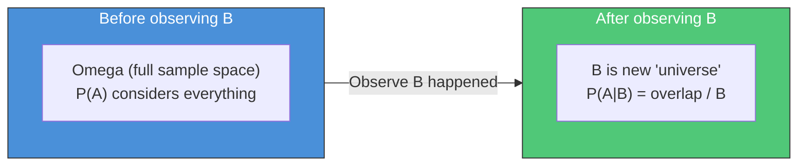
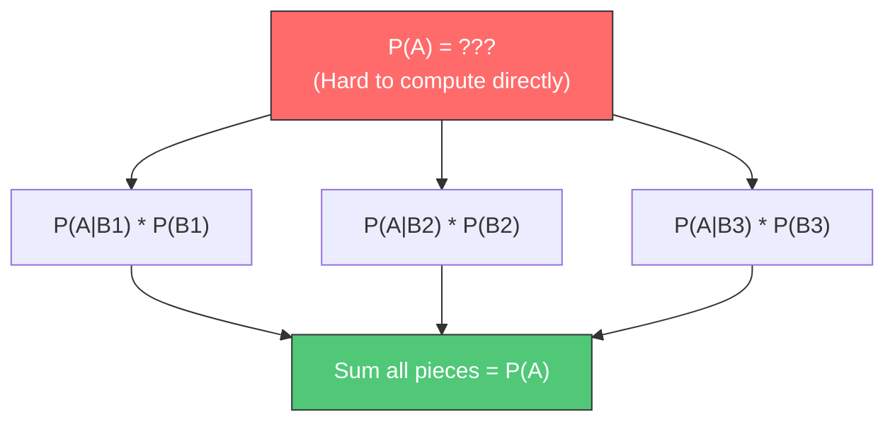
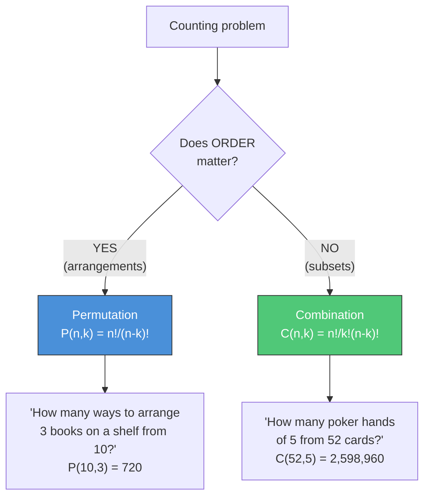
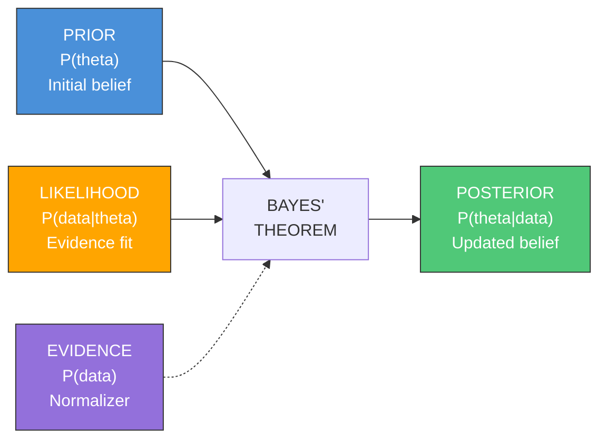
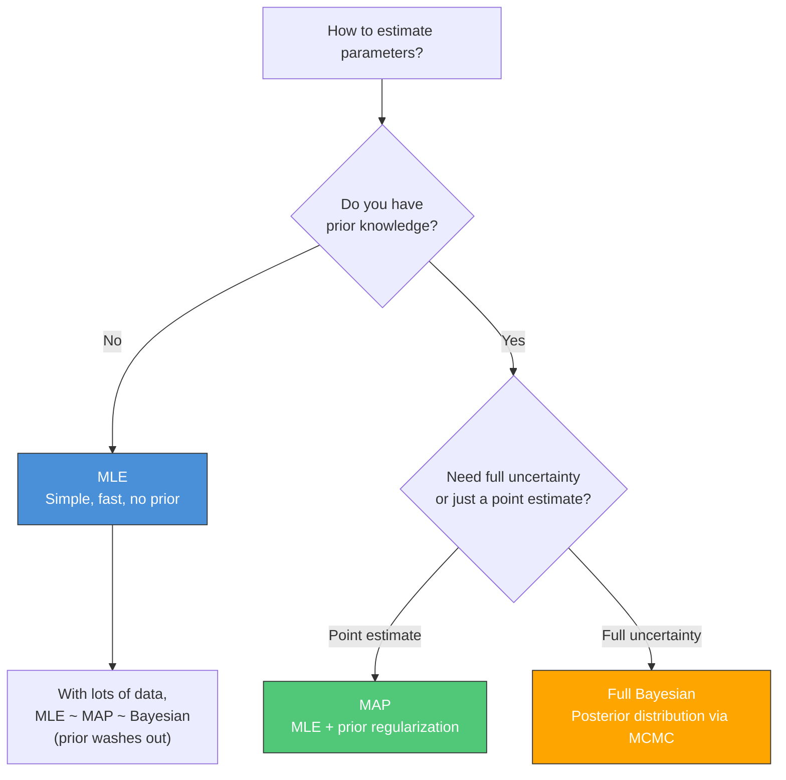
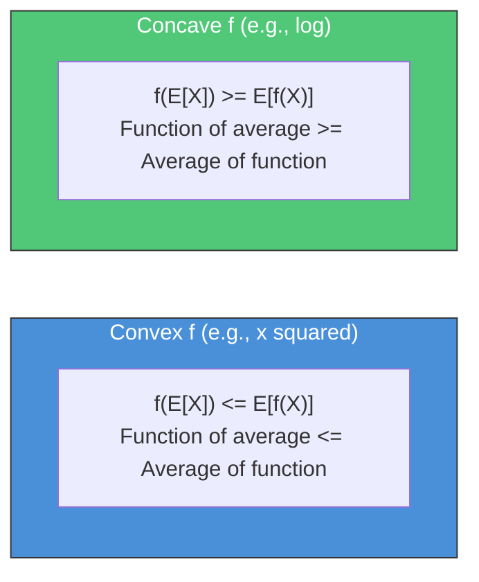
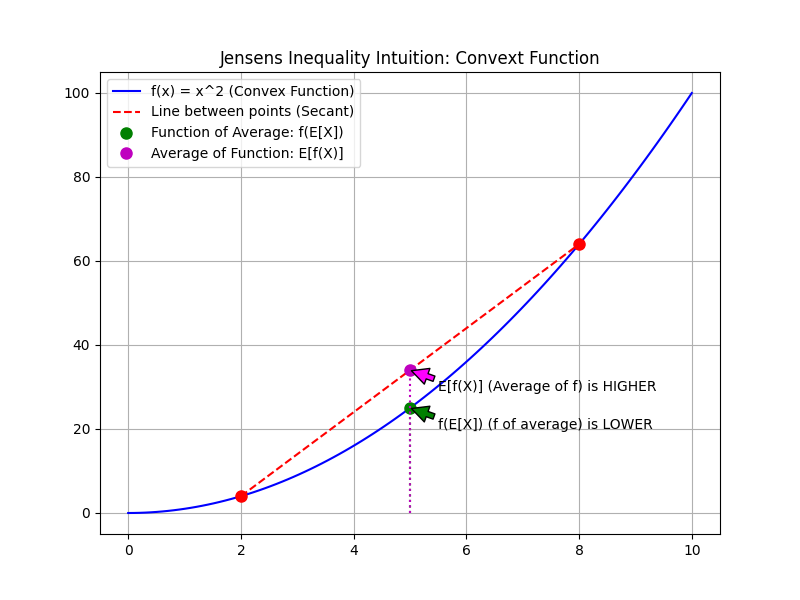
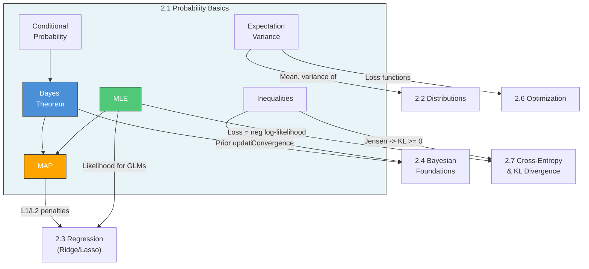

---
# Document Outline
- [Executive Summary](#executive-summary)
- [2.1.1 Foundations of Probability](#211-foundations-of-probability-h)
  - [Sample Spaces and Events](#sample-spaces-and-events)
  - [Axioms of Probability](#axioms-of-probability-kolmogorov)
  - [Conditional Probability and Independence](#conditional-probability-and-independence)
  - [Law of Total Probability](#law-of-total-probability)
  - [Chain Rule of Probability](#chain-rule-of-probability)
- [2.1.2 Combinatorics](#212-combinatorics-m)
  - [Permutations and Combinations](#permutations-and-combinations)
  - [Counting Principles](#counting-principles)
- [2.1.3 Random Variables and Expectations](#213-random-variables--expectations-h)
  - [Discrete vs Continuous Random Variables](#discrete-vs-continuous-random-variables)
  - [PMF, PDF, and CDF](#pmf-pdf-and-cdf)
  - [Expectation and Variance](#expectation-ex)
  - [Covariance and Correlation](#covariance-and-correlation)
  - [Moment Generating Functions](#moment-generating-functions-mgf)
- [2.1.4 Bayes' Theorem](#214-bayes-theorem-c)
  - [Intuition and Derivation](#intuition-updating-beliefs-with-evidence)
  - [Common Interview Applications](#common-interview-applications)
  - [Conjugate Priors](#conjugate-priors)
- [2.1.5 MLE vs MAP](#215-mle-vs-map-h)
  - [Maximum Likelihood Estimation](#maximum-likelihood-estimation-mle)
  - [Maximum A Posteriori](#maximum-a-posteriori-map)
  - [MLE vs MAP vs Full Bayesian](#mle-vs-map-vs-full-bayesian-when-to-use-each)
- [2.1.6 Probability Inequalities](#216-probability-inequalities-m)
  - [Markov's Inequality](#markovs-inequality)
  - [Chebyshev's Inequality](#chebyshevs-inequality)
  - [Jensen's Inequality](#jensens-inequality)
  - [Hoeffding's Inequality](#hoeffdings-inequality)
- [Connections Map](#connections-map)
- [Interview Cheat Sheet](#interview-cheat-sheet)
- [Learning Objectives Checklist](#learning-objectives-checklist)

# Executive Summary

This guide covers Section 2.1: Probability Basics — the foundation upon which all of statistics, machine learning, and Bayesian inference is built. Content is calibrated against Goodfellow et al. *Deep Learning* (Chapter 3) and structured for senior Applied Scientist interview preparation. Each topic progresses from intuition to formal definition to worked examples to Python code, with interview-specific guidance throughout.

> **Primary Reference**: Goodfellow, I., Bengio, Y., and Courville, A. *Deep Learning*. MIT Press, 2016.
> Chapter 3: Probability and Information Theory (pp. 53-76).

### Goodfellow Cross-Reference Map

Use this to read alongside your physical copy:

| This Guide | Goodfellow Section | Book Pages | What to Read |
|---|---|---|---|
| **2.1.1** Foundations | 3.1 Why Probability? | pp. 53-55 | Frequentist vs Bayesian perspectives |
| **2.1.1** Conditional Prob | 3.6 Conditional Probability | p. 62 | Brief but important definition |
| **2.1.1** Independence | 3.7 Independence, Conditional Independence | p. 62 | Conditional independence for structured models |
| **2.1.2** Combinatorics | — | — | Not covered in Goodfellow (see any probability textbook) |
| **2.1.3** Random Variables | 3.2 Random Variables | p. 55 | Formal definition |
| **2.1.3** PMF / PDF | 3.3 Probability Distributions | pp. 55-57 | PMF, PDF definitions and properties |
| **2.1.3** Expectation, Var | 3.4 Marginal Probability | p. 58 | Marginalization |
| **2.1.3** Expectation, Var | 3.5 Conditional Probability | p. 59 | Expectation definition |
| **2.1.3** Covariance | 3.10 Covariance and Correlation | pp. 65-66 | Covariance matrix, independence vs uncorrelated |
| **2.1.4** Bayes' Theorem | 3.12 Bayes' Rule | p. 67 | Concise statement with ML motivation |
| **2.1.5** MLE | 5.5 Maximum Likelihood Estimation | pp. 129-133 | MLE as minimizing KL divergence (key insight!) |
| **2.1.5** MAP | 5.6 Bayesian Statistics | pp. 133-137 | MAP estimation, prior as regularization |
| **2.1.6** Jensen's | — | — | Used implicitly; see 3.13 for related info-theory results |
| **2.1.3** MGF | — | — | Not covered in Goodfellow |

> [!TIP]
> **Reading strategy**: Don't read Goodfellow Chapter 3 linearly — it's a reference chapter. Instead, use the table above to read the specific section *after* you've studied each topic in this guide. Goodfellow's Chapter 5 (pp. 129-137) is especially important for MLE/MAP.

---

# 2.1 Probability Basics

> **Study Time**: 8-10 hours | **Priority**: [H] High | **Goal**: Rock-solid intuition — every statistics and ML concept builds on this.

---

## 2.1.1 Foundations of Probability **[H]**

> **Book**: Goodfellow Ch. 3.1 (pp. 53-55), 3.6-3.7 (p. 62) | Frequentist vs Bayesian, conditional probability, independence

### Sample Spaces and Events

**Definitions** (Goodfellow 3.1):

| Term | Symbol | Definition | Example (rolling a die) |
|------|--------|------------|------------------------|
| **Random experiment** | — | A process with uncertain outcome | Rolling a fair die |
| **Sample space** | $\Omega$ | Set of ALL possible outcomes | $\{1, 2, 3, 4, 5, 6\}$ |
| **Event** | $A, B, ...$ | A subset of the sample space | $A = \{2, 4, 6\}$ (rolling even) |
| **Elementary outcome** | $\omega$ | A single outcome | $\omega = 3$ |

**Set operations on events**:

| Operation | Notation | Meaning | Example |
|-----------|----------|---------|---------|
| Union | $A \cup B$ | A or B (or both) | Even OR > 4 = {2,4,5,6} |
| Intersection | $A \cap B$ | A and B | Even AND > 4 = {6} |
| Complement | $A^c$ | Not A | Not even = {1,3,5} |
| Mutual exclusion | $A \cap B = \emptyset$ | Cannot happen together | {1,2} and {3,4} |

> [!TIP]
> **Interview mindset**: Sample spaces are rarely asked directly, but they form the mental scaffolding for every probability question. When stuck on a probability problem, always start by writing down the sample space.

---

### Axioms of Probability (Kolmogorov)

The three axioms that define a valid probability measure $P$:

| Axiom | Statement | Intuition |
|-------|-----------|-----------|
| **1. Non-negativity** | $P(A) \geq 0$ for all events $A$ | Probabilities can't be negative |
| **2. Normalization** | $P(\Omega) = 1$ | Something must happen |
| **3. Additivity** | If $A \cap B = \emptyset$, then $P(A \cup B) = P(A) + P(B)$ | For mutually exclusive events, probabilities add |

**Everything else derives from these three axioms**:

| Derived Property | Formula | How It Follows |
|-----------------|---------|----------------|
| Complement rule | $P(A^c) = 1 - P(A)$ | From Axioms 2 + 3 |
| Impossible event | $P(\emptyset) = 0$ | $\Omega$ and $\emptyset$ are disjoint; $P(\Omega) + P(\emptyset) = P(\Omega)$ |
| Inclusion-exclusion | $P(A \cup B) = P(A) + P(B) - P(A \cap B)$ | Generalization of Axiom 3 |
| Monotonicity | If $A \subseteq B$ then $P(A) \leq P(B)$ | $B = A \cup (B \setminus A)$, apply Axiom 3 |

> [!NOTE]
> **Goodfellow's perspective** (3.1): Probability can be viewed as the *frequency of events* (frequentist) or as *degree of belief* (Bayesian). ML uses both: frequentist for confidence intervals/p-values, Bayesian for priors/posteriors. The axioms are the same regardless of interpretation.

---

### Conditional Probability and Independence

#### Conditional Probability

$$P(A \mid B) = \frac{P(A \cap B)}{P(B)}, \quad P(B) > 0$$

**Intuition**: Once we know $B$ happened, the sample space *shrinks* to $B$. We ask: what fraction of $B$ does $A$ also cover?



#### Independence

Two events $A$ and $B$ are **independent** if and only if:

$$P(A \cap B) = P(A) \cdot P(B)$$

Equivalently: $P(A \mid B) = P(A)$ — knowing $B$ doesn't change our belief about $A$.

> [!WARNING]
> **Independence vs. Mutual Exclusivity** — a classic interview trap:
>
> | Property | Mutual Exclusivity | Independence |
> |----------|-------------------|--------------|
> | Definition | $P(A \cap B) = 0$ | $P(A \cap B) = P(A)P(B)$ |
> | Meaning | They CANNOT co-occur | Knowing one tells nothing about the other |
> | Relationship | If $A,B$ are mutually exclusive and both have $P > 0$, they are **dependent** | Independent events CAN co-occur |
>
> **Why mutually exclusive implies dependent**: If $A$ happened, you *know* $B$ didn't. That's information — hence dependence.

#### Conditional Independence

$A$ and $B$ are **conditionally independent given $C$** if:

$$P(A \cap B \mid C) = P(A \mid C) \cdot P(B \mid C)$$

**Why this matters for ML** (Goodfellow 3.5): Naive Bayes assumes features are conditionally independent given the class label. This assumption is almost always wrong, yet the model often works surprisingly well.

> > [!NOTE]
> > **What does this mean in practice?**
> > 
> > **1. Structural Causal Models (Agenda 1.1.2):**
> > Conditional independence is the mathematical engine behind `d-separation` in causal graphs. When we say an observed confounder $Z$ "blocks a backdoor path" between $X$ and $Y$, we are literally asserting that $X$ and $Y$ are conditionally independent given $Z$: $P(X,Y|Z) = P(X|Z)P(Y|Z)$.
> > 
> > **2. Naive Bayes Classifiers (Agenda 5.1):**
> > The "naive" assumption is that all features are conditionally independent given the class label. This mathematically simplifies calculating the joint probability of 1000 words in an email from an impossibly massive joint distribution down to a simple product of 1000 individual word probabilities.
> >
> > **3. Markov Decision Processes (Agenda 9.2):**
> > In Reinforcement Learning, the Markov Property means the future state is conditionally independent of all past states, *given* the present state and action. This assumption makes RL mathematically tractable.

---

### Law of Total Probability

If $B_1, B_2, \ldots, B_n$ **partition** the sample space (mutually exclusive, collectively exhaustive):

$$P(A) = \sum_{i=1}^{n} P(A \mid B_i) \cdot P(B_i)$$

**Intuition**: Break a hard probability into easy conditional pieces.

> > [!NOTE]
> > **What does this mean in practice?**
> >
> > **1. The EM Algorithm & Mixture Models (Agenda 3.2.3):**
> > When working with latent (unobserved) variables, we use the Law of Total Probability to compute the marginal probability of the data we *can* see. In a Gaussian Mixture Model, the probability of observing a data point $x$ is the sum of its probabilities under each cluster, weighted by the probability of belonging to that cluster: $p(x) = \sum_{k=1}^K p(x \mid z=k)P(z=k)$. 
> >
> > **2. Hidden Markov Models (Agenda 9.1):**
> > The Forward Algorithm in HMMs uses this exact law to compute the total probability of an observed sequence by summing over all possible sequences of hidden states that could have generated it.



<details>
<summary><strong>Worked Example: Disease Testing</strong></summary>

**Setup**: A disease affects 1 in 1000 people. A test has 99% sensitivity (true positive rate) and 95% specificity (true negative rate).

*Recall the equations for these metrics:*
- **Sensitivity** = $\frac{TP}{TP + FN} = P(+ \mid D)$
- **Specificity** = $\frac{TN}{TN + FP} = P(- \mid D^c)$

**Question**: What is P(positive test)?

**Solution using Law of Total Probability**:

Partition on disease status: $D$ (disease) and $D^c$ (no disease).

$$P(+) = P(+ \mid D) \cdot P(D) + P(+ \mid D^c) \cdot P(D^c)$$

$$= 0.99 \times 0.001 + 0.05 \times 0.999$$

$$= 0.00099 + 0.04995 = 0.05094$$

**Insight**: About 5.1% of all people test positive, but most of them are *false positives* because the disease is rare!

</details>

---

### Chain Rule of Probability

For any events $A_1, A_2, \ldots, A_n$:

$$P(A_1 \cap A_2 \cap \cdots \cap A_n) = P(A_1) \cdot P(A_2 \mid A_1) \cdot P(A_3 \mid A_1 \cap A_2) \cdots P(A_n \mid A_1 \cap \cdots \cap A_{n-1})$$

**Intuition**: Build up a joint probability one piece at a time, each time conditioning on everything that came before.

<details>
<summary><strong>Derivation & Example</strong></summary>

The rule is derived by repeatedly applying the definition of conditional probability: $P(X \cap Y) = P(X) \cdot P(Y \mid X)$.

For 3 events ($A, B, C$):
1. Treat $(A \cap B)$ as a single event: $P((A \cap B) \cap C) = P(A \cap B) \cdot P(C \mid A \cap B)$
2. Expand $P(A \cap B)$: $P(A \cap B) = P(A) \cdot P(B \mid A)$
3. Combine them: $P(A \cap B \cap C) = P(A) \cdot P(B \mid A) \cdot P(C \mid A \cap B)$

**Real-world analogy**: Drawing three specific cards from a deck in order (e.g., Ace, then King, then Queen).
The probability of all three happening is:
- Probability of drawing the Ace first: $P(A_1)$
- Times the probability of drawing the King second, *given we already drew the Ace*: $P(A_2 \mid A_1)$
- Times the probability of drawing the Queen third, *given we already drew the Ace and King*: $P(A_3 \mid A_1 \cap A_2)$

</details>

**Why this matters for ML**: This is the foundation of autoregressive models.

> > [!NOTE]
> > **What does this mean in practice?**
> >
> > **1. Transformers and LLMs (Agenda 5.2):**
> > Generative language models like GPT do not predict an entire sentence at once, they predict exactly one word. Generating a whole sentence means calculating the joint probability of a sequence of words. By the Chain Rule, this complex joint distribution $P(w_1, w_2, \ldots, w_n)$ is factored completely into a sequence of single-word predictions, each conditioned on the previous words: $\prod_{t=1}^n P(w_t \mid w_{1 \dots t-1})$.
> >
> > **2. Autoregressive Time Series (Agenda 4.2.1):**
> > Models like ARIMA use the exact same factorization to predict the next timestamp conditioned strictly on the historical sequence.

Language models like GPT generate text by computing:

$$P(w_1, w_2, \ldots, w_n) = P(w_1) \cdot P(w_2 \mid w_1) \cdot P(w_3 \mid w_1, w_2) \cdots$$

> [!IMPORTANT]
> **The two chain rules you must know**:
>
> | Chain Rule | Formula | Used In |
> |-----------|---------|---------|
> | **Probability** | $P(A,B) = P(A)P(B \mid A)$ | Bayesian networks, autoregressive models |
> | **Calculus** | $\frac{dz}{dx} = \frac{dz}{dy} \cdot \frac{dy}{dx}$ | Backpropagation (Section 2.6) |

---

#### Interview Priority: Foundations

| What to Know | Priority | Why |
|---|---|---|
| Conditional probability formula and intuition | **Must know** | Used in every Bayes question |
| Independence vs mutual exclusivity | **Must know** | Classic trick question |
| Law of total probability | **Must know** | Foundation for Bayes' theorem |
| Chain rule of probability | **Must know** | Foundation for generative models |
| Kolmogorov axioms by name | Nice to have | Shows mathematical maturity |
| Conditional independence | **Should know** | Explains Naive Bayes assumption |

---

## 2.1.2 Combinatorics **[M]**

> **Book**: Not covered in Goodfellow. Use any standard probability textbook for practice problems.

> Lower priority for AS interviews, but essential for solving counting-based probability problems.

### Permutations and Combinations

| Concept | Formula | Question It Answers | Order Matters? |
|---------|---------|-------------------|----------------|
| **Permutation** | $P(n,k) = \frac{n!}{(n-k)!}$ | How many ways to **arrange** $k$ items from $n$? | Yes |
| **Combination** | $\binom{n}{k} = \frac{n!}{k!(n-k)!}$ | How many ways to **choose** $k$ items from $n$? | No |

**Decision rule**:



**Python**:
```python
from math import perm, comb, factorial

# Permutations: arrange 3 from 10
print(f"P(10,3) = {perm(10, 3)}")        # 720

# Combinations: choose 5 from 52
print(f"C(52,5) = {comb(52, 5)}")         # 2598960

# Relationship: P(n,k) = C(n,k) * k!
assert perm(10, 3) == comb(10, 3) * factorial(3)
```

### Counting Principles

| Principle | Rule | Example |
|-----------|------|---------|
| **Multiplication** | If task A has $m$ ways and task B has $n$ ways, total = $m \times n$ | 3 shirts × 4 pants = 12 outfits |
| **Addition** | If you can do task A OR task B (mutually exclusive), total = $m + n$ | Take bus (3 routes) or train (2 lines) = 5 options |
| **Inclusion-Exclusion** | $\|A \cup B\| = \|A\| + \|B\| - \|A \cap B\|$ | Students taking Math OR Physics, minus those in both |

<details>
<summary><strong>Worked Example: Birthday Problem</strong></summary>

**Question**: In a room of $n$ people, what is the probability that at least two share a birthday? (Assume 365 days, uniform distribution.)

**Solution via complementary counting**:
It is much easier to calculate the probability that **no one** shares a birthday, and then subtract that from 1.

$$P(\text{at least one match}) = 1 - P(\text{all different})$$

**Method 1: Sequential Probabilities (Chain Rule)**
Imagine people entering the room one by one. For all birthdays to be different:
- Person 1 has 365/365 options available.
- Person 2 has 364/365 options available (can't share with Person 1).
- Person 3 has 363/365 options available (can't share with 1 or 2).
- ...and so on for $n$ people.

$$P(\text{all different}) = \frac{365}{365} \times \frac{364}{365} \times \frac{363}{365} \times \cdots \times \frac{365 - n + 1}{365}$$

**Method 2: Combinatorics (Counting)**
Alternatively, we calculate this by counting total valid combinations and dividing by the total sample space:
- **Sample Space (Denominator)**: Each of the $n$ people can have their birthday on any of the 365 days. Total possible outcomes = $365^n$.
- **Favorable Outcomes (Numerator)**: We need to choose $n$ distinct days out of 365 and assign them to the $n$ people (order matters because each person is distinct). This is a permutation: $P(365, n) = \frac{365!}{(365-n)!}$.

$$P(\text{all different}) = \frac{\text{Favorable Outcomes}}{\text{Total Outcomes}} = \frac{P(365, n)}{365^n} = \frac{365!}{(365-n)! \cdot 365^n}$$

*(Note: Both methods are mathematically identical and yield the same result!)*

```python
import numpy as np

def birthday_probability(n_people):
    """Exact probability that at least 2 of n people share a birthday."""
    p_all_different = 1.0
    for i in range(n_people):
        p_all_different *= (365 - i) / 365
    return 1 - p_all_different

# Key thresholds
for n in [23, 50, 70]:
    print(f"n={n:2d}: P(match) = {birthday_probability(n):.4f}")
# n=23: P(match) = 0.5073  <-- just 23 people for >50%!
# n=50: P(match) = 0.9704
# n=70: P(match) = 0.9992
```

**Why this is surprising**: Our intuition compares each person to the 365 days (a 1 in 365 chance). But for a match to occur, we don't need a *specific* person to share a birthday with another *specific* person; we just need *any two people* to share one. Thus, we should be counting the number of possible **pairs** of people. 

If there are $n=23$ people, we can use the combinations formula "$n$ choose $k$" to find how many unique pairs ($k=2$) we can form:
$$\binom{23}{2} = \frac{23!}{2!(23-2)!} = \frac{23 \times 22}{2 \times 1} = 253 \text{ distinct pairs}$$

Since each of these 253 individual pairs has a 1/365 chance of sharing a birthday, having 253 "tickets to win" makes it much more intuitive that the overall probability of at least one match exceeds 50%.

</details>

---

#### Interview Priority: Combinatorics

| What to Know | Priority | Why |
|---|---|---|
| Permutation vs combination (when to use which) | **Should know** | Shows up in card/dice probability problems |
| Multiplication principle | **Should know** | Foundation of counting arguments |
| Birthday problem intuition | Nice to have | Classic "why is probability counterintuitive" example |
| Inclusion-exclusion for 2-3 sets | Nice to have | Occasionally useful |

---

## 2.1.3 Random Variables & Expectations **[H]**

> **Book**: Goodfellow Ch. 3.2-3.5 (pp. 55-61), 3.10 (pp. 65-66) | Random variables, PMF/PDF, expectation, covariance & correlation

> This is the language of ML. Models output random variables; loss functions are expectations.
>
> > [!NOTE]
> > **What does this mean in practice?**
> > 
> > **1. Models output random variables:**
> > In traditional software, a function returns a single deterministic value. In ML, a model $f(x)$ typically outputs a *probability distribution* (which parameterizes a random variable).
> > - **Classification:** A softmax layer outputs a Probability Mass Function (PMF) representing the probability of each class. The output isn't the string "Cat", it's $P(Y = \text{Cat} \mid X) = 0.9$.
> > - **Regression:** While it looks like we output a deterministic number, minimizing Mean Squared Error mathematically corresponds to outputting the mean $\mu$ of a Normal distribution (a PDF).
> > 
> > **2. Loss functions are expectations:**
> > The ultimate object of optimization in ML is *Risk*, which is precisely defined as the **expected value** of the loss function over the true data-generating distribution: $\mathbb{E}_{(x,y) \sim p_{\text{data}}}[L(f(x), y)]$.
> > Because we don't know the true distribution $p_{\text{data}}$, we approximate this expected value using the *empirical expectation* (the arithmetic mean) over our training sample: $\frac{1}{N} \sum_{i=1}^N L(f(x_i), y_i)$. Every time you compute the average loss over a batch, you are calculating an expected value!

### Discrete vs Continuous Random Variables

> [!NOTE] 
> **The Worst Name in Statistics**: A "random variable" is neither random, nor is it a variable! 
> 
> It is actually a **deterministic function**. It takes a physical, real-world outcome (like "the coin landed heads", or "the customer clicked the ad") and maps it to a number (like $1$). The *input* to the function is what's random (the outcome of the experiment); the *mapping* itself is perfectly deterministic.

Formally: A **random variable** $X$ is a function $X : \Omega \rightarrow \mathbb{R}$ that maps outcomes in the sample space $\Omega$ to real numbers (Goodfellow 3.2).

| Type | Values | Described By | Example |
|------|--------|-------------|---------|
| **Discrete** | Countable set | PMF: $P(X = x)$ | Coin flips, word counts, class labels |
| **Continuous** | Any real number in an interval | PDF: $f(x)$ | Temperature, height, neural network logits |

> [!WARNING]
> For continuous RVs, $P(X = x) = 0$ for any specific value $x$. Only intervals have nonzero probability: $P(a \leq X \leq b) = \int_a^b f(x)\,dx$. This is unintuitive but fundamental.

### PMF, PDF, and CDF

#### Probability Mass Function (PMF) — Discrete

$$P(X = x) = p(x), \quad \sum_x p(x) = 1, \quad p(x) \geq 0$$

#### Probability Density Function (PDF) — Continuous

$$f(x) \geq 0, \quad \int_{-\infty}^{\infty} f(x)\,dx = 1$$

> [!IMPORTANT]
> $f(x)$ is **not** a probability — it's a *density*. It can exceed 1 (e.g., Uniform(0, 0.5) has $f(x)=2$). Only $\int f(x)\,dx$ over an interval gives probability.

#### Cumulative Distribution Function (CDF) — Both

$$F(x) = P(X \leq x)$$

| Property | Formula |
|----------|---------|
| Non-decreasing | $x_1 < x_2 \Rightarrow F(x_1) \leq F(x_2)$ |
| Range | $\lim_{x\to-\infty} F(x) = 0, \quad \lim_{x\to\infty} F(x) = 1$ |
| Interval probability | $P(a < X \leq b) = F(b) - F(a)$ |
| For continuous RVs | $f(x) = F'(x)$ (PDF is the derivative of CDF) |

```python
import numpy as np
import matplotlib.pyplot as plt
from scipy import stats

fig, axes = plt.subplots(1, 3, figsize=(15, 4))

# --- Discrete: Binomial PMF ---
n, p = 10, 0.3
x_disc = np.arange(0, n + 1)
pmf = stats.binom.pmf(x_disc, n, p)
axes[0].bar(x_disc, pmf, color='#4a90d9', alpha=0.8)
axes[0].set_title('PMF: Binomial(n=10, p=0.3)')
axes[0].set_xlabel('k'); axes[0].set_ylabel('P(X = k)')

# --- Continuous: Normal PDF ---
x_cont = np.linspace(-4, 4, 200)
pdf = stats.norm.pdf(x_cont, 0, 1)
axes[1].plot(x_cont, pdf, color='#50c878', linewidth=2)
axes[1].fill_between(x_cont, pdf, alpha=0.3, color='#50c878')
axes[1].set_title('PDF: Normal(0, 1)')
axes[1].set_xlabel('x'); axes[1].set_ylabel('f(x)')

# --- CDF comparison ---
axes[2].step(x_disc, stats.binom.cdf(x_disc, n, p), where='mid',
             color='#4a90d9', linewidth=2, label='Binomial CDF')
axes[2].plot(x_cont, stats.norm.cdf(x_cont), color='#50c878',
             linewidth=2, label='Normal CDF')
axes[2].set_title('CDF Comparison')
axes[2].legend(); axes[2].set_xlabel('x'); axes[2].set_ylabel('F(x)')

plt.tight_layout()
plt.savefig('pmf_pdf_cdf.png', dpi=150, bbox_inches='tight')
plt.show()
```

---

### Expectation E[X]

**Definition** (Goodfellow 3.4):

| Type | Formula |
|------|---------|
| Discrete | $E[X] = \sum_x x \cdot P(X = x)$ |
| Continuous | $E[X] = \int_{-\infty}^{\infty} x \cdot f(x)\,dx$ |
| Function of RV | $E[g(X)] = \sum_x g(x) \cdot P(X = x)$ or $\int g(x) f(x)\,dx$ |

#### Properties of Expectation (Linearity)

| Property | Formula | Notes |
|----------|---------|-------|
| Linearity | $E[aX + b] = aE[X] + b$ | Always holds, no assumptions needed |
| Sum | $E[X + Y] = E[X] + E[Y]$ | Always holds, even if $X,Y$ are dependent |
| Product | $E[XY] = E[X] \cdot E[Y]$ | **Only if $X,Y$ are independent** |

> [!TIP]
> **Linearity of expectation is the most useful property in probability**. It requires NO independence assumption for sums. This makes seemingly hard problems easy — see the birthday problem or coupon collector.
>
> > [!NOTE]
> > **What does this mean in practice?**
> >
> > **1. A/B Testing (Agenda 1.2.1):**
> > Linearity guarantees that the expectation of a difference is the difference of expectations: $\mathbb{E}[\text{Treatment} - \text{Control}] = \mathbb{E}[\text{Treatment}] - \mathbb{E}[\text{Control}]$. This is why comparing the simple average of two groups gives an unbiased estimate of the Average Treatment Effect (ATE), even if the individual outcomes are highly correlated or confounded by unobserved factors (assuming rigorous randomization).
> >
> > **2. Stochastic Gradient Descent (Agenda 2.6.3):**
> > The true gradient of the loss is the expected gradient over the entire dataset. Because expectation is linear, the gradient of a sum is the sum of the gradients. Therefore, taking the average gradient over a small, randomly sampled mini-batch provides an *unbiased estimate* of the true full-batch gradient: $\mathbb{E}[\nabla L_{\text{batch}}] = \nabla L_{\text{full}}$. This simple mathematical property is literally why we can train massive neural networks without computing the gradient over billions of examples at every single step!

### Variance Var(X) and Standard Deviation

$$\text{Var}(X) = E[(X - E[X])^2] = E[X^2] - (E[X])^2$$

> [!NOTE] 
> **Intuition behind the formula**:
> 1. **$E[(X - E[X])^2]$ (The Definition)**: Variance measures "spread." We take every data point ($X$), find how far it is from the mean ($E[X]$), and square that distance so negative and positive differences don't cancel out (and to mathematically penalize large outliers more than small ones). Finally, we take the average (Expectation, $E[\cdot]$) of those squared distances.
> 2. **$E[X^2] - (E[X])^2$ (The Computational Form)**: This mathematically identical rearrangement says variance is the *mean of the squares* minus the *square of the mean*. It is often much faster to compute in code or on a whiteboard because you don't have to subtract the mean from every single data point before squaring!

$$\text{SD}(X) = \sigma = \sqrt{\text{Var}(X)}$$

| Property | Formula |
|----------|---------|
| Constant | $\text{Var}(c) = 0$ |
| Scaling | $\text{Var}(aX) = a^2 \text{Var}(X)$ |
| Shift | $\text{Var}(X + b) = \text{Var}(X)$ |
| Sum (independent) | $\text{Var}(X + Y) = \text{Var}(X) + \text{Var}(Y)$ |
| Sum (general) | $\text{Var}(X + Y) = \text{Var}(X) + \text{Var}(Y) + 2\text{Cov}(X,Y)$ |

> [!IMPORTANT]
> **Classic whiteboard ask**: "Show that $E[X^2] = \text{Var}(X) + (E[X])^2$."
>
> **Proof**: By definition, $\text{Var}(X) = E[X^2] - (E[X])^2$. Rearrange: $E[X^2] = \text{Var}(X) + (E[X])^2$. QED.

---

### Covariance and Correlation

#### Covariance

$$\text{Cov}(X, Y) = E[(X - E[X])(Y - E[Y])] = E[XY] - E[X]E[Y]$$

| Value | Meaning |
|-------|---------|
| $\text{Cov} > 0$ | $X$ and $Y$ tend to increase together |
| $\text{Cov} < 0$ | One increases when the other decreases |
| $\text{Cov} = 0$ | No *linear* relationship (but may still be dependent!) |

#### Correlation (Pearson)

$$\rho(X, Y) = \frac{\text{Cov}(X, Y)}{\sigma_X \sigma_Y}, \quad -1 \leq \rho \leq 1$$

**Correlation is the normalized covariance** — scale-free, ranges from -1 to +1.

> [!WARNING]
> **Correlation vs Causation** — the most important distinction in applied statistics:
>
> - **Correlation = linear association**. Ice cream sales and drownings are correlated (both increase in summer).
> - **Causation = one causes the other**. Summer heat causes both — ice cream doesn't cause drowning.
> - **Zero correlation does NOT mean independence**. $X \sim \text{Uniform}(-1,1)$, $Y = X^2$. Then $\text{Cov}(X,Y) = 0$ but $Y$ is completely determined by $X$.
>
> Goodfellow (3.10): "Covariance and dependence are related but distinct concepts... Two variables that are independent have zero covariance, but two variables that have zero covariance are not necessarily independent."
>
> > [!NOTE]
> > **What does this mean in practice?**
> >
> > **1. Causal Inference (Agenda 1.1):**
> > The distinction between correlation ($Cov(X,Y) \neq 0$) and causation (intervening on $X$ changes $Y$) is the entire motivation for the Causal Inference spike. 
> >
> > **2. Principal Component Analysis (Agenda 3.2.2):**
> > PCA computationally operates directly on the data's covariance matrix. By finding the eigenvectors of the covariance matrix, PCA extracts the orthogonal directions of maximum variance in the dataset.
> >
> > **3. Regression Diagnostics (Agenda 2.3.5):**
> > High covariance between two input features causes **multiple-collinearity**, which massively inflates the variance of coefficient estimates in linear regression (measured by Variance Inflation Factor, VIF).

---

### Moment Generating Functions (MGF)

$$M_X(t) = E[e^{tX}]$$

**Why they exist**: The $n$-th derivative of $M_X(t)$ evaluated at $t=0$ gives the $n$-th moment:

$$M_X^{(n)}(0) = E[X^n]$$

| Property | Formula | Use |
|----------|---------|-----|
| First moment | $M'(0) = E[X]$ | Mean |
| Second moment | $M''(0) = E[X^2]$ | Feeds into variance |
| Uniqueness | If $M_X(t) = M_Y(t)$ for all $t$, then $X$ and $Y$ have the same distribution | Proving distribution identities |
| Sum of independents | $M_{X+Y}(t) = M_X(t) \cdot M_Y(t)$ | Proving sum of Normals is Normal |

> [!NOTE]
> **Interview calibration**: MGFs are [L] priority for AS interviews. Know the definition and that they uniquely determine distributions. You'll almost never be asked to compute one. The important takeaway is the *concept* — they're a mathematical tool for proving things about moments and sums of random variables.

---

#### Interview Priority: Random Variables & Expectations

| What to Know | Priority | Why |
|---|---|---|
| PMF vs PDF distinction | **Must know** | Foundation for every distribution discussion |
| $E[X^2] = \text{Var}(X) + (E[X])^2$ | **Must know** | Classic whiteboard derivation |
| Linearity of expectation (no independence needed for sums) | **Must know** | Solves many "tricky" problems trivially |
| Correlation vs causation | **Must know** | Critical interview discussion topic |
| Zero correlation $\neq$ independence | **Must know** | Shows mathematical maturity |
| CDF properties and relationship to PDF | **Should know** | Used in quantile regression, p-values |
| Var(X+Y) with covariance term | **Should know** | Shows up in portfolio theory, A/B testing |
| MGF definition and purpose | Nice to have | Rarely asked directly |

---

## 2.1.4 Bayes' Theorem **[C]**

> **Book**: Goodfellow Ch. 3.12 (p. 67) | Bayes' rule statement and ML motivation

> The single most important formula in applied ML. If you learn one thing from probability, learn this.
> 
> > [!NOTE]
> > **What does this mean in practice?**
> >
> > **1. Bayesian Optimization (Agenda 3.5.1):**
> > Used for sequential hyperparameter tuning. The algorithm uses a surrogate model (like a Gaussian Process) which serves as the *Prior*. Each time it evaluates a new hyperparameter combination, it observes the validation loss (*Likelihood*) and uses Bayes' theorem to compute the *Posterior*—an updated belief about the objective function's shape, which informs exactly where to search next.
> >
> > **2. Spam Filters (Naive Bayes):**
> > The algorithm calculates the probability a message is spam by flipping the condition: $P(\text{Spam} \mid \text{Words}) \propto P(\text{Words} \mid \text{Spam}) \times P(\text{Spam})$.

### Intuition: Updating Beliefs with Evidence

$$P(\theta \mid \text{data}) = \frac{P(\text{data} \mid \theta) \cdot P(\theta)}{P(\text{data})}$$

| Term | Name | Role | Analogy |
|------|------|------|---------|
| $P(\theta)$ | **Prior** | What you believed before seeing data | Your initial hypothesis |
| $P(\text{data} \mid \theta)$ | **Likelihood** | How probable is the data if $\theta$ is true | Evidence compatibility |
| $P(\theta \mid \text{data})$ | **Posterior** | Updated belief after seeing data | Your refined hypothesis |
| $P(\text{data})$ | **Evidence** (marginal likelihood) | Normalizing constant | Makes probabilities sum to 1 |



> [!TIP]
> **The key insight**: Posterior $\propto$ Likelihood $\times$ Prior. You can often ignore the evidence $P(\text{data})$ because it's just a normalizing constant. This is exactly what MAP estimation does.

### Formula Derivation from Conditional Probability

Starting from the definition of conditional probability:

$$P(A \mid B) = \frac{P(A \cap B)}{P(B)} \quad \text{and} \quad P(B \mid A) = \frac{P(A \cap B)}{P(A)}$$

Both have $P(A \cap B)$ in the numerator. Solve for it from the second equation:

$$P(A \cap B) = P(B \mid A) \cdot P(A)$$

Substitute into the first:

$$P(A \mid B) = \frac{P(B \mid A) \cdot P(A)}{P(B)}$$

This is Bayes' theorem. The denominator $P(B)$ can be expanded via the Law of Total Probability:

$$P(B) = P(B \mid A) P(A) + P(B \mid A^c) P(A^c)$$

---

### Common Interview Applications

#### Application 1: Disease Testing (The Classic)

> **"A disease affects 1 in 1000 people. A test has 99% sensitivity and 95% specificity. If someone tests positive, what's the probability they have the disease?"**

| Given | Value |
|-------|-------|
| Prevalence $P(D)$ | 0.001 |
| Sensitivity $P(+ \mid D)$ | 0.99 |
| Specificity $P(- \mid D^c)$ | 0.95, so $P(+ \mid D^c)$ = 0.05 |

$$P(D \mid +) = \frac{P(+ \mid D) \cdot P(D)}{P(+ \mid D) \cdot P(D) + P(+ \mid D^c) \cdot P(D^c)}$$

$$= \frac{0.99 \times 0.001}{0.99 \times 0.001 + 0.05 \times 0.999} = \frac{0.00099}{0.05094} \approx 0.0194$$

**Only ~2%!** Despite the test being "99% accurate," a positive result gives less than 2% chance of actually having the disease.

> [!IMPORTANT]
> **Why this result is so low**: The prior probability (1/1000) is so small that the false positives from the healthy population overwhelm the true positives. This is the **base rate fallacy** — ignoring how common or rare the condition is.

```python
def bayes_disease_test(prevalence, sensitivity, specificity):
    """
    Compute P(Disease | Positive Test) using Bayes' theorem.
    
    Quick Test:
        >>> bayes_disease_test(0.001, 0.99, 0.95)
        0.019...
    """
    p_pos_given_disease = sensitivity
    p_pos_given_healthy = 1 - specificity
    p_disease = prevalence
    p_healthy = 1 - prevalence
    
    # Law of total probability for denominator
    p_positive = (p_pos_given_disease * p_disease + 
                  p_pos_given_healthy * p_healthy)
    
    # Bayes' theorem
    p_disease_given_pos = (p_pos_given_disease * p_disease) / p_positive
    return p_disease_given_pos

# The classic problem
result = bayes_disease_test(0.001, 0.99, 0.95)
print(f"P(Disease | Positive) = {result:.4f}")  # 0.0194

# Show how prevalence affects the result
print("\nEffect of prevalence on P(D|+):")
for prev in [0.001, 0.01, 0.05, 0.10, 0.50]:
    p = bayes_disease_test(prev, 0.99, 0.95)
    print(f"  Prevalence = {prev:.3f} -> P(D|+) = {p:.4f}")
```

#### Application 2: Spam Filtering

$P(\text{spam} \mid \text{word}) = \frac{P(\text{word} \mid \text{spam}) \cdot P(\text{spam})}{P(\text{word})}$

This is the foundation of **Naive Bayes classifiers**. For multiple words, the "naive" assumption of conditional independence gives:

$$P(\text{spam} \mid w_1, w_2, \ldots) \propto P(\text{spam}) \prod_i P(w_i \mid \text{spam})$$

#### Application 3: A/B Test Interpretation

**Frequentist**: "Given H0 (no difference), what's the probability of this data?" $\rightarrow$ p-value

**Bayesian**: "Given this data, what's the probability that variant B is better?" $\rightarrow$ posterior

$$P(\text{B better} \mid \text{data}) = \frac{P(\text{data} \mid \text{B better}) \cdot P(\text{B better})}{P(\text{data})}$$

The Bayesian approach directly answers the question stakeholders actually care about.

---

### Conjugate Priors

**Definition**: A prior distribution $P(\theta)$ is **conjugate** to a likelihood $P(x \mid \theta)$ if the posterior $P(\theta \mid x)$ belongs to the same family as the prior.

**Why conjugacy matters**: It gives **closed-form posteriors** — no need for MCMC or numerical approximation.

| Likelihood | Conjugate Prior | Posterior | Application |
|-----------|----------------|-----------|-------------|
| **Bernoulli/Binomial** | **Beta**($\alpha, \beta$) | **Beta**($\alpha + k, \beta + n - k$) | Click-through rates, conversion rates |
| **Normal** (known $\sigma^2$) | **Normal**($\mu_0, \sigma_0^2$) | **Normal**(weighted mean, updated variance) | Estimating means |
| **Poisson** | **Gamma**($\alpha, \beta$) | **Gamma**($\alpha + \sum x_i, \beta + n$) | Event rates |

#### Beta-Binomial Conjugacy (Most Important)

**Setup**: You observe $k$ successes in $n$ Bernoulli trials. Prior on $p$: $\text{Beta}(\alpha, \beta)$.

**Prior**: $P(p) \propto p^{\alpha-1}(1-p)^{\beta-1}$

**Likelihood**: $P(\text{data} \mid p) \propto p^k(1-p)^{n-k}$

**Posterior**: $P(p \mid \text{data}) \propto p^{\alpha+k-1}(1-p)^{\beta+n-k-1}$

$$\Rightarrow \text{Beta}(\alpha + k, \, \beta + n - k)$$

**Intuition**: $\alpha$ and $\beta$ are "pseudo-counts" — as if you had already seen $\alpha - 1$ successes and $\beta - 1$ failures before collecting data.

> > [!NOTE]
> > **What does this mean in practice?**
> >
> > **1. Thompson Sampling in Bandits (Agenda 1.2.7):**
> > This is the exact mathematical engine behind the most popular multi-armed bandit algorithm. Each "arm" (e.g., website variant) has an unknown conversion rate $p$. We represent our belief about $p$ as a Beta distribution. Every time a user clicks (success) or ignores (failure), we trivially update the Beta posterior in closed form using addition. To choose the next arm, we sample from each arm's Beta distribution. This organically balances exploration (highly uncertain arms have very wide distributions) and exploitation (arms with proven high conversion rates are picked more often).

```python
import numpy as np
from scipy import stats
import matplotlib.pyplot as plt

def bayesian_updating_demo():
    """
    Demonstrate Beta-Binomial conjugacy with sequential updating.
    
    Quick Test:
        Run function and observe posterior converging to true p=0.7
    """
    true_p = 0.7
    alpha_prior, beta_prior = 2, 2  # Weakly informative prior
    
    fig, axes = plt.subplots(2, 3, figsize=(15, 8))
    x = np.linspace(0, 1, 200)
    
    # Generate observations
    np.random.seed(42)
    observations = np.random.binomial(1, true_p, size=100)
    
    sample_sizes = [0, 1, 5, 10, 30, 100]
    
    for ax, n in zip(axes.flat, sample_sizes):
        if n == 0:
            alpha_post, beta_post = alpha_prior, beta_prior
            title = f"Prior: Beta({alpha_prior},{beta_prior})"
        else:
            k = observations[:n].sum()
            alpha_post = alpha_prior + k
            beta_post = beta_prior + n - k
            title = f"n={n}, k={k}\nBeta({alpha_post},{beta_post})"
        
        posterior = stats.beta.pdf(x, alpha_post, beta_post)
        ax.plot(x, posterior, 'b-', linewidth=2)
        ax.fill_between(x, posterior, alpha=0.3)
        ax.axvline(true_p, color='red', linestyle='--', label=f'True p={true_p}')
        ax.set_title(title, fontsize=10)
        ax.legend(fontsize=8)
    
    plt.suptitle('Bayesian Updating: Beta-Binomial Conjugacy', fontsize=14)
    plt.tight_layout()
    plt.savefig('bayesian_updating.png', dpi=150, bbox_inches='tight')
    plt.show()

bayesian_updating_demo()
```

> [!IMPORTANT]
> **Key properties of Beta-Binomial**:
> - **Posterior mean** = $\frac{\alpha + k}{\alpha + \beta + n}$ (weighted average of prior mean and sample proportion)
> - **As $n \to \infty$**: posterior concentrates around the true $p$ regardless of prior (data overwhelms the prior)
> - **Uninformative prior**: Beta(1,1) = Uniform(0,1) — "all values of $p$ are equally likely"

---

#### Interview Priority: Bayes' Theorem

| What to Know | Priority | Why |
|---|---|---|
| Bayes' formula and verbal explanation | **Must know** | Asked in nearly every AS interview |
| Disease testing problem (solve in 60 seconds) | **Must know** | The canonical Bayes problem |
| Prior, likelihood, posterior, evidence — name each | **Must know** | Vocabulary expected of AS candidates |
| Base rate fallacy intuition | **Must know** | Shows you understand why naive accuracy is misleading |
| Beta-Binomial conjugacy | **Should know** | Foundation of Bayesian A/B testing |
| Posterior $\propto$ Likelihood $\times$ Prior | **Should know** | Key simplification used in MAP and MCMC |
| Normal-Normal conjugacy | Nice to have | Less commonly asked |
| Connection to Naive Bayes classifier | **Should know** | Bridges probability theory to ML |

---

## 2.1.5 MLE vs MAP **[H]**

> **Book**: Goodfellow Ch. 5.5 (pp. 129-133) MLE, Ch. 5.6 (pp. 133-137) Bayesian/MAP estimation, Ch. 5.2.2 (p. 122) bias-variance of estimators

> Where probability meets optimization. This is how models learn parameters from data.

### Maximum Likelihood Estimation (MLE)

**Core idea**: Find the parameter value $\theta$ that makes the observed data MOST PROBABLE.

$$\hat{\theta}_{MLE} = \arg\max_\theta \; P(\text{data} \mid \theta) = \arg\max_\theta \; \prod_{i=1}^n P(x_i \mid \theta)$$

> [!IMPORTANT] 
> **The i.i.d. Assumption**
> Did you notice how the joint probability of the entire dataset $P(x_1, x_2, \dots x_n \mid \theta)$ suddenly turned into a multiplication of individual probabilities $\prod_{i=1}^n P(x_i \mid \theta)$? 
> 
> Mathematically, $P(A \cap B) = P(A) \cdot P(B)$ **only if $A$ and $B$ are independent**. By writing the likelihood as a product, we are explicitly assuming our data points are structurally "Independent and Identically Distributed" (i.i.d). 
> 
> **What this means in practice:** If this assumption is violated (e.g., in Time Series data where yesterday's temperature heavily influences today's temperature), standard MLE will fail to capture the true dynamics. This is why time series models require specialized forecasting architectures (like ARIMA) that explicitly model that dependence via the Chain Rule instead of a naive product!

#### The Log-Likelihood Trick

Products are numerically unstable and hard to differentiate. Taking the log converts products to sums:

$$\hat{\theta}_{MLE} = \arg\max_\theta \; \sum_{i=1}^n \log P(x_i \mid \theta)$$

> [!TIP]
> **Why log works**: $\log$ is a monotonically increasing function, so the maximum of $\log f(\theta)$ is at the same $\theta$ as the maximum of $f(\theta)$. This is used everywhere in ML optimization.
>
> > [!NOTE]
> > **What does this mean in practice?**
> > 
> > **1. Preventing Numerical Underflow (Agenda 2.8.1):**
> > Multiplying 10,000 probabilities (numbers between 0 and 1) will result in a number so infinitesimally small that computers round it to `0.0` (floating point underflow), destroying the gradient. Converting the product of probabilities into a sum of log-probabilities keeps the numbers in a safe numerical range while preserving the exact same argmax.
> >
> > **2. Cross-Entropy Loss (Agenda 2.7.2):**
> > Minimizing Cross-Entropy is mathematically identical to maximizing the Log-Likelihood of a multinomial/categorical distribution. This is why we use Log-Loss for classification rather than Mean Squared Error.
> >
> > **3. Mathematical Tractability for Gradients:**
> > To find the maximum likelihood algebraically (or via Gradient Descent), we need to take the derivative and set it to zero. Taking the derivative of a massive product of $N$ terms requires applying the Product Rule $N-1$ times, resulting in a horrifyingly complex algebraic mess. Because the derivative of a sum is just the sum of the derivatives ($\frac{d}{dx}[A + B] = \frac{d}{dx}A + \frac{d}{dx}B$), the log transforms an impossible differential calculus problem into trivial, independent calculations for each data point!

---

#### MLE Derivation: Bernoulli

**Problem**: Given $n$ coin flips with $k$ heads, find the MLE for $p$ (probability of heads).

**Likelihood**: $L(p) = p^k (1-p)^{n-k}$

**Log-likelihood**: $\ell(p) = k \log p + (n-k) \log(1-p)$

**Set derivative to zero**:

$$\frac{d\ell}{dp} = \frac{k}{p} - \frac{n-k}{1-p} = 0$$

$$k(1-p) = (n-k)p \implies k = np \implies \hat{p}_{MLE} = \frac{k}{n}$$

**Result**: The MLE for Bernoulli is simply the sample proportion. Intuitive!

> > [!NOTE]
> > **What does this mean in practice?**
> >
> > **1. Logistic Regression & Binary Neural Networks (Agenda 3.1.2):**
> > The standard **Binary Cross-Entropy (BCE)** loss function is derived entirely by writing out the negative log-likelihood of Bernoulli random variables. When you train a binary classifier, you are literally just doing Maximum Likelihood Estimation on a Bernoulli distribution!

---

#### MLE Derivation: Normal Distribution

**Problem**: Given observations $x_1, \ldots, x_n \sim N(\mu, \sigma^2)$, find MLEs for $\mu$ and $\sigma^2$.

**Log-likelihood**:

$$\ell(\mu, \sigma^2) = -\frac{n}{2}\log(2\pi) - \frac{n}{2}\log(\sigma^2) - \frac{1}{2\sigma^2}\sum_{i=1}^n(x_i - \mu)^2$$

<details>
<summary><strong>Full derivation (click to expand)</strong></summary>

**For $\mu$** — differentiate and set to zero:

$$\frac{\partial \ell}{\partial \mu} = \frac{1}{\sigma^2}\sum_{i=1}^n(x_i - \mu) = 0$$

$$\sum_{i=1}^n x_i - n\mu = 0 \implies \hat{\mu}_{MLE} = \frac{1}{n}\sum_{i=1}^n x_i = \bar{x}$$

**For $\sigma^2$** — differentiate and set to zero:

$$\frac{\partial \ell}{\partial \sigma^2} = -\frac{n}{2\sigma^2} + \frac{1}{2(\sigma^2)^2}\sum_{i=1}^n(x_i - \mu)^2 = 0$$

$$\hat{\sigma}^2_{MLE} = \frac{1}{n}\sum_{i=1}^n(x_i - \bar{x})^2$$

</details>

| Parameter | MLE | Notes |
|-----------|-----|-------|
| $\mu$ | $\bar{x} = \frac{1}{n}\sum x_i$ | Sample mean |
| $\sigma^2$ | $\frac{1}{n}\sum(x_i - \bar{x})^2$ | Biased! (divides by $n$, not $n-1$) |

> > [!NOTE]
> > **What does this mean in practice?**
> >
> > **1. Ordinary Least Squares & MSE (Agenda 2.3.4):**
> > When you train a linear regression or neural network using **Mean Squared Error (MSE)** as the loss function, you are mathematically performing Maximum Likelihood Estimation under the implicit assumption that the target variable's errors are Gaussian-distributed.

> [!WARNING]
> The MLE for $\sigma^2$ is **biased** — it uses $\frac{1}{n}$ instead of $\frac{1}{n-1}$. The unbiased estimator $s^2 = \frac{1}{n-1}\sum(x_i - \bar{x})^2$ is preferred in practice. This is a classic interview catch.

---

#### MLE Derivation: Poisson

**Problem**: Given counts $x_1, \ldots, x_n \sim \text{Poisson}(\lambda)$, find MLE for $\lambda$.

**Log-likelihood**: $\ell(\lambda) = \sum_{i=1}^n [x_i \log \lambda - \lambda - \log(x_i!)]$

**Set derivative to zero**: $\frac{d\ell}{d\lambda} = \frac{\sum x_i}{\lambda} - n = 0$

$$\hat{\lambda}_{MLE} = \frac{1}{n}\sum_{i=1}^n x_i = \bar{x}$$

The MLE for Poisson rate is also the sample mean. This is a consequence of exponential family properties.

---

#### Properties of MLE

| Property | Statement | Interview Importance |
|----------|-----------|---------------------|
| **Consistency** | $\hat{\theta}_{MLE} \xrightarrow{P} \theta_0$ as $n \to \infty$ | **High** — MLE converges to truth |
| **Asymptotic Normality** | $\sqrt{n}(\hat{\theta} - \theta_0) \xrightarrow{d} N(0, I(\theta_0)^{-1})$ | Moderate — enables confidence intervals |
| **Efficiency** | Achieves Cramer-Rao lower bound asymptotically | Low — theoretical result |
| **Invariance** | MLE of $g(\theta)$ is $g(\hat{\theta}_{MLE})$ | Moderate — convenient property |

---

### Maximum A Posteriori (MAP)

**Core idea**: Like MLE, but incorporates a **prior belief** about $\theta$.

$$\hat{\theta}_{MAP} = \arg\max_\theta \; P(\theta \mid \text{data}) = \arg\max_\theta \; P(\text{data} \mid \theta) \cdot P(\theta)$$

Taking logs:

$$\hat{\theta}_{MAP} = \arg\max_\theta \; \left[\sum_{i=1}^n \log P(x_i \mid \theta) + \log P(\theta)\right]$$

$$= \underbrace{\text{log-likelihood}}_{\text{MLE objective}} + \underbrace{\log P(\theta)}_{\text{regularization term}}$$

> [!IMPORTANT]
> **The critical insight**: MAP = MLE + regularization. The prior acts as a penalty on parameter values.

#### When MAP = MLE

If the prior is **uniform** (flat), then $\log P(\theta) = \text{constant}$, and MAP reduces to MLE. This means MLE implicitly assumes a uniform prior.

---

#### MAP with Gaussian Prior = L2 Regularization (Ridge) **[C]**

If $P(\theta) = N(0, \sigma_0^2)$, then:

$$\log P(\theta) = -\frac{\theta^2}{2\sigma_0^2} + \text{const}$$

So the MAP objective becomes:

$$\hat{\theta}_{MAP} = \arg\max_\theta \left[\sum_i \log P(x_i \mid \theta) - \frac{\lambda}{2}\|\theta\|_2^2\right]$$

where $\lambda = \frac{1}{\sigma_0^2}$. **This is exactly Ridge regression!**

#### MAP with Laplace Prior = L1 Regularization (Lasso) **[C]**

If $P(\theta) = \text{Laplace}(0, b)$, then:

$$\log P(\theta) = -\frac{|\theta|}{b} + \text{const}$$

So the MAP objective becomes:

$$\hat{\theta}_{MAP} = \arg\max_\theta \left[\sum_i \log P(x_i \mid \theta) - \lambda\|\theta\|_1\right]$$

**This is exactly Lasso regression!**

> > [!NOTE]
> > **What does this mean in practice?**
> >
> > **1. Regularization (Agenda 3.1.2):**
> > This is a profound mathematical equivalence. When you add an **L2 penalty (Ridge)** to your loss function to prevent overfitting, you are implicitly performing MAP estimation with a **Gaussian prior** (assuming weights should be normally distributed around zero).
> > 
> > Adding an **L1 penalty (Lasso)** is mathematically equivalent to doing MAP estimation with a **Laplace prior** (which has a sharp peak at zero, thereby enforcing sparsity). 
> >
> > **2. 'Weight Decay' in Neural Networks:**
> > Applying weight decay in AdamW or SGD is conceptually identical to enforcing this Gaussian prior on the network's weights.

| Prior Distribution | Regularization | Penalty Shape | Effect on Weights |
|-------------------|---------------|---------------|-------------------|
| **Gaussian** $N(0, \sigma^2)$ | **L2 (Ridge)** | Smooth, quadratic | Shrinks toward zero, never exactly zero |
| **Laplace** $(0, b)$ | **L1 (Lasso)** | Sharp, V-shaped | Drives some weights to exactly zero (sparsity) |
| **Uniform** (flat) | **None (MLE)** | No penalty | No shrinkage |

```python
import numpy as np
from scipy import stats
import matplotlib.pyplot as plt

def map_vs_mle_demo():
    """
    Demonstrate how MAP estimation with different priors
    corresponds to different regularization approaches.
    
    Quick Test:
        Run function; observe Gaussian prior creates smooth shrinkage,
        Laplace prior creates sparse solutions.
    """
    theta = np.linspace(-5, 5, 300)
    
    fig, axes = plt.subplots(1, 3, figsize=(15, 4))
    
    # Gaussian prior -> L2 penalty
    gaussian_prior = stats.norm.pdf(theta, 0, 1)
    axes[0].plot(theta, gaussian_prior, 'b-', linewidth=2)
    axes[0].fill_between(theta, gaussian_prior, alpha=0.3)
    axes[0].set_title('Gaussian Prior -> L2 (Ridge)')
    axes[0].set_xlabel('theta'); axes[0].set_ylabel('P(theta)')
    
    # Laplace prior -> L1 penalty
    laplace_prior = stats.laplace.pdf(theta, 0, 1)
    axes[1].plot(theta, laplace_prior, 'r-', linewidth=2)
    axes[1].fill_between(theta, laplace_prior, alpha=0.3, color='red')
    axes[1].set_title('Laplace Prior -> L1 (Lasso)')
    axes[1].set_xlabel('theta')
    
    # Overlay comparison
    axes[2].plot(theta, gaussian_prior, 'b-', linewidth=2, label='Gaussian (L2)')
    axes[2].plot(theta, laplace_prior, 'r-', linewidth=2, label='Laplace (L1)')
    axes[2].set_title('Comparison: L1 has sharp peak at 0')
    axes[2].legend()
    axes[2].set_xlabel('theta')
    
    plt.tight_layout()
    plt.savefig('map_regularization.png', dpi=150, bbox_inches='tight')
    plt.show()

map_vs_mle_demo()
```

---

### MLE vs MAP vs Full Bayesian: When to Use Each

| Approach | What It Computes | Output | When to Use |
|----------|-----------------|--------|-------------|
| **MLE** | $\arg\max_\theta P(D \mid \theta)$ | Single point estimate | Large data, no prior knowledge, need simplicity |
| **MAP** | $\arg\max_\theta P(\theta \mid D)$ | Single point estimate (regularized) | Moderate data, want regularization, have prior info |
| **Full Bayesian** | Full $P(\theta \mid D)$ | Entire distribution over $\theta$ | Need uncertainty quantification, small data, critical decisions |

> [!NOTE]
> **What is the practical difference?**
>
> **MAP (Maximum A Posteriori)** produces a **single, specific number** (a "point estimate"). 
> - *Example:* You want to predict if a coin is biased. You flip it 3 times and get 3 Heads. Your prior was that coins are fair ($p=0.5$). MAP balances the data and your prior, and spits out a single answer: "I estimate $p=0.75$."
> - **Pros:** Extremely fast to compute. You just take the derivative, set to zero, and get your answer. This allows you to train massive neural networks via Gradient Descent.
> - **Cons:** It gives you zero information about how *confident* it is in that $0.75$ number. 
> 
> **Full Bayesian Inference** does NOT output a single number. It outputs a **full probability distribution** (a PDF curve).
> - *Example:* Instead of saying "$p=0.75$", it returns an entire Beta distribution curve: "The most likely value is 0.75, but because I've only seen 3 flips, the true value could easily be anywhere between 0.4 and 0.95."
> - **Pros:** This is the Holy Grail of Machine Learning. It gives you perfect **Uncertainty Quantification**. You know exactly how much you don't know. 
> - **Cons:** Computing the denominator of Bayes' Theorem (the integral over all possible values of $\theta$) is usually mathematically impossible for complex models like Neural Networks. You have to rely on expensive approximation algorithms like MCMC (Markov Chain Monte Carlo), making it too slow for most massive datasets.



> [!IMPORTANT]
> **Key interview soundbite**: "MLE maximizes the likelihood. MAP maximizes the posterior, which is likelihood times prior. The prior acts as regularization — Gaussian prior gives L2 (Ridge), Laplace prior gives L1 (Lasso). With enough data, MLE and MAP converge because the likelihood dominates the prior."

---

#### Interview Priority: MLE vs MAP

| What to Know | Priority | Why |
|---|---|---|
| MLE = maximize likelihood; log trick | **Must know** | Foundation of parameter estimation |
| Derive MLE for Bernoulli on whiteboard | **Must know** | Classic interview problem |
| Derive MLE for Normal (mean and variance) | **Must know** | Shows you can do calculus under pressure |
| MAP = MLE + prior = MLE + regularization | **Must know** | The single most important connection in this section |
| Gaussian prior $\to$ L2; Laplace prior $\to$ L1 | **Must know** | Asked in almost every ML interview |
| MLE $\sigma^2$ is biased (divides by $n$, not $n-1$) | **Should know** | Shows attention to detail |
| MLE properties (consistency, efficiency) | **Should know** | Demonstrates theoretical depth |
| Full Bayesian vs MAP tradeoff | **Should know** | Shows mature understanding |
| MLE for Poisson | Nice to have | Less commonly asked |

---

## 2.1.6 Probability Inequalities **[M]**

> **Book**: Not directly covered in Goodfellow. Jensen's inequality is used implicitly throughout (Ch. 3.13, Ch. 19). See a dedicated probability text for formal treatments.

> Bounding tools that show up in convergence proofs, PAC learning, and sample complexity arguments.

### Markov's Inequality

For a **non-negative** random variable $X \geq 0$ and any $a > 0$:

$$P(X \geq a) \leq \frac{E[X]}{a}$$

**Intuition**: If the average is small, the probability of being very large must also be small.

**Example**: If the average income is \$50,000, then at most 1% of people earn $\geq$ \$5,000,000 (since $50000/5000000 = 0.01$).

> [!NOTE]
> **Why can't the right side be smaller?**
> Because there exists a "worst-case scenario" distribution where this inequality becomes an exact equality ($=$). 
> 
> Imagine a town where the average income is \$50,000. We want to know the maximum possible percentage of people who earn exactly \$5,000,000 or more. 
> - **The worst-case distribution** is one where 99% of the town makes exactly \$0, and the remaining 1% makes exactly \$5,000,000.
> - Let's calculate the average of that town: $E[X] = (0.99 \times 0) + (0.01 \times 5,000,000) = 50,000$.
> 
> In this extreme scenario, exactly 1% of people make $\geq$ \$5,000,000. If Markov's Inequality gave us a tighter bound (e.g., claiming "at most 0.5% make that much"), it would be mathematically disproven by this specific town! Because we know absolutely nothing about the variance or shape of the distribution—only its mean—Markov's Inequality must provide a bound conservative enough to accommodate this extreme worst-case scenario.

> [!NOTE]
> **Very loose bound** — its strength is that it requires almost no assumptions (just non-negativity). It's the foundation for tighter bounds below.

---

### Chebyshev's Inequality

For any random variable $X$ with finite mean $\mu$ and variance $\sigma^2$, and any $k > 0$:

$$P(|X - \mu| \geq k\sigma) \leq \frac{1}{k^2}$$

Alternatively: $P(|X - \mu| \geq t) \leq \frac{\sigma^2}{t^2}$

| $k$ (standard deviations) | Chebyshev bound | Normal (actual) |
|---|---|---|
| 1 | $\leq 100\%$ | 31.7% |
| 2 | $\leq 25\%$ | 4.6% |
| 3 | $\leq 11.1\%$ | 0.3% |

**Intuition**: The true probabilities (for Normal) are much smaller than Chebyshev's bounds — the bound is distribution-free but conservative.

**Derivation** (from Markov): Apply Markov's inequality to $(X - \mu)^2$:

$$P((X-\mu)^2 \geq t^2) \leq \frac{E[(X-\mu)^2]}{t^2} = \frac{\sigma^2}{t^2}$$

---

### Jensen's Inequality

For a **convex** function $f$ and any random variable $X$:

$$f(E[X]) \leq E[f(X)]$$

For a **concave** function $f$ (flip the inequality):

$$f(E[X]) \geq E[f(X)]$$



#### Why Jensen's Is Critical for ML

> > [!NOTE]
> > **What does this mean in practice?**
> >
> > **1. Variational Inference & EM (Agenda 3.2.3):**
> > In generative ML, calculating the exact probability of our data ($\log P(x)$) is mathematically impossible ("intractable"). 
> > 
> > *Why?* Imagine trying to calculate the probability of generating a specific image of a face. To do that perfectly, the math requires you to add up the probabilities of *every single possible combination* of hidden rules ("latent variables"): every possible hair color, mixed with every possible eye size, mixed with every possible lighting angle. There are trillions of combinations. The math simply crashes.
> > 
> > **The Jensen's Trick:** We can rewrite $\log P(x)$ as the "Log of an Expectation" (Log of an Average). Because $\log$ is a *concave* curve, Jensen's Inequality tells us that **Log of the Average $\ge$ Average of the Log**. 
> > 
> > By moving the $\log$ *inside* the expectation, we create the **Evidence Lower Bound (ELBO)**. 
> > - **True Log-Likelihood** = Log of Average (Math is impossible)
> > - **ELBO** = Average of Log (Math is easy!)
> > 
> > Because True $\ge$ ELBO, we simply tell our neural network to maximize the ELBO. Jensen's Inequality mathematically guarantees this will push the true log-likelihood up with it!
> >
> > **2. KL Divergence (Agenda 2.7.3):**
> > Why is the KL "distance" between two distributions, $P$ and $Q$, mathematically guaranteed to never be negative? 
> > 
> > The definition of KL Divergence relies on the function $-\log(x)$, which is a *convex* curve (bows downwards). Jensen's Inequality dictates that for convex curves, the **Average of the Function $\ge$ Function of the Average**. 
> > 
> > If you calculate the right side ("Function of the Average"), the math simplifies perfectly to $-\log(1)$, which is exactly **0**. Therefore, the KL Divergence (the left side) must be $\ge 0$.

| Application | How Jensen's Is Used |
|-------------|---------------------|
| **KL divergence $\geq 0$** | $\text{KL}(p\|q) = E_p[\log(p/q)] \geq \log(E_p[p/q]) = \log(1) = 0$ (concavity of log) |
| **EM algorithm** | The ELBO (Evidence Lower Bound) uses Jensen's to lower-bound the log-marginal likelihood |
| **Variance is non-negative** | $E[X^2] \geq (E[X])^2$ is Jensen's applied to $f(x) = x^2$ (convex) |

> [!TIP]
> **Function of Average vs. Average of Function**
> Let's look at the function $f(x) = x^2$ (a convex function).
> Imagine you have two numbers: 2 and 8. The average of those numbers ($E[X]$) is **5**.
> 
> 1. **Function of the Average ($f(E[X])$):**
>    First take the average (which is 5), then apply the function (square it). 
>    $5^2 = \mathbf{25}$
>
> 2. **Average of the Function ($E[f(X)]$):**
>    First apply the function to both numbers ($2^2 = 4$, and $8^2 = 64$). *Then* take the average of those results.
>    $(4 + 64) / 2 = \mathbf{34}$
> 
> Because the curve bows downward (convex), drawing a straight line between the two points on the curve (the average of the function, 34) will *always* sit higher than the curve itself at that midpoint (the function of the average, 25). That's Jensen's Inequality! 



| **Log-likelihood bounds** | Variational inference uses Jensen's to create tractable optimization objectives |

<details>
<summary><strong>Proof: KL Divergence is Non-Negative (using Jensen's)</strong></summary>

$$\text{KL}(p \| q) = \sum_x p(x) \log \frac{p(x)}{q(x)} = -\sum_x p(x) \log \frac{q(x)}{p(x)}$$

Since $-\log$ is convex, apply Jensen's inequality:

$$= -\sum_x p(x) \log \frac{q(x)}{p(x)} \geq -\log\left(\sum_x p(x) \cdot \frac{q(x)}{p(x)}\right) = -\log\left(\sum_x q(x)\right) = -\log(1) = 0$$

Therefore $\text{KL}(p \| q) \geq 0$, with equality iff $p = q$.

</details>

---

### Hoeffding's Inequality

For independent bounded random variables $X_1, \ldots, X_n$ with $a_i \leq X_i \leq b_i$, and sample mean $\bar{X} = \frac{1}{n}\sum X_i$:

$$P(|\bar{X} - E[\bar{X}]| \geq t) \leq 2\exp\left(-\frac{2n^2 t^2}{\sum_{i=1}^n(b_i - a_i)^2}\right)$$

**For iid bounded $[0, 1]$ variables**:

$$P(|\bar{X} - \mu| \geq t) \leq 2e^{-2nt^2}$$

**Why this matters for ML**:

> > [!NOTE]
> > **What does this mean in practice?**
> >
> > **1. PAC Learning Theory:**
> > "Probably Approximately Correct" (PAC) learning uses Hoeffding's bound to mathematically prove the sample complexity of model classes. It answers the question: "How many training examples $n$ do I need to guarantee that my model's test error is within $\epsilon$ of its training error, with probability $1-\delta$?"
> >
> > **2. Upper Confidence Bound (UCB) Bandits (Agenda 1.2.7):**
> > The UCB algorithm balances exploration and exploitation by picking the arm with the highest *upper bound* on its estimated reward. That specific upper bound ($\sqrt{\frac{2 \log t}{n}}$) is derived directly from Hoeffding's inequality, guaranteeing with high probability that the true reward is within the bound.

| Application | How It's Used |
|-------------|---------------|
| **PAC learning bounds** | Bounding sample complexity for learning algorithms |
| **A/B testing** | Bounding how far the sample proportion is from the true conversion rate |
| **Generalization bounds** | Bounding the gap between training and test error |
| **Concentration inequalities** | Foundation for uniform convergence results |

> [!TIP]
> **Interview-level understanding**: Know that Hoeffding gives exponentially tight bounds on how fast sample averages concentrate around their mean. The bound gets tighter with more samples ($n$) and for variables with smaller range. You don't need to memorize the exact formula.

---

#### Interview Priority: Probability Inequalities

| What to Know | Priority | Why |
|---|---|---|
| Jensen's inequality statement and convex/concave cases | **Must know** | Used in KL divergence, EM, variational inference |
| Jensen's $\Rightarrow$ KL $\geq$ 0 | **Should know** | Classic derivation, proves most important info-theory fact |
| Chebyshev's inequality | **Should know** | Foundation for discussing spread and outliers |
| Markov's inequality (concept) | Nice to have | Foundation for other inequalities |
| Hoeffding's (concept: exponential concentration) | Nice to have | Shows awareness of learning theory |

---

# Connections Map

How Section 2.1 concepts connect to the rest of the study plan:



---

# Interview Cheat Sheet

Quick-reference formulas and one-liners for Section 2.1:

| Topic | Formula / One-liner |
|-------|-------------------|
| **Conditional Probability** | $P(A \mid B) = P(A \cap B) / P(B)$ |
| **Independence** | $P(A \cap B) = P(A)P(B)$; mutually exclusive $\neq$ independent |
| **Total Probability** | $P(A) = \sum P(A \mid B_i)P(B_i)$ over partition |
| **Bayes' Theorem** | $P(\theta \mid D) \propto P(D \mid \theta) P(\theta)$ |
| **E[X] linearity** | $E[X+Y] = E[X]+E[Y]$ always; $E[XY] = E[X]E[Y]$ only if independent |
| **Variance** | $\text{Var}(X) = E[X^2] - (E[X])^2$ |
| **Cov shortcut** | $\text{Cov}(X,Y) = E[XY] - E[X]E[Y]$ |
| **MLE** | $\arg\max_\theta \sum \log P(x_i \mid \theta)$ |
| **MAP** | MLE + $\log P(\theta)$ = MLE + regularization |
| **Gaussian prior** | $\to$ L2 (Ridge); **Laplace prior** $\to$ L1 (Lasso) |
| **Bernoulli MLE** | $\hat{p} = k/n$ |
| **Normal MLE** | $\hat{\mu} = \bar{x}$, $\hat{\sigma}^2 = \frac{1}{n}\sum(x_i - \bar{x})^2$ (biased!) |
| **Jensen's** | Convex $f$: $f(E[X]) \leq E[f(X)]$; proves KL $\geq 0$ |
| **Beta-Binomial** | Prior Beta($\alpha,\beta$) + $k$ successes in $n$ $\implies$ Posterior Beta($\alpha+k, \beta+n-k$) |

---

# Learning Objectives Checklist

Based on the Section 2.1 Deliverables from the study plan:

- [ ] **Solve 10 conditional probability/Bayes problems without notes** — Use disease testing variants, card draw problems, and multi-step conditional reasoning
- [ ] **Derive MLE for Normal on whiteboard** — Must produce $\hat{\mu} = \bar{x}$ and $\hat{\sigma}^2 = \frac{1}{n}\sum(x_i - \bar{x})^2$
- [ ] **Derive MLE for Bernoulli on whiteboard** — Must produce $\hat{p} = k/n$ in under 2 minutes
- [ ] **Show MAP-regularization equivalence on whiteboard** — Gaussian prior $\to$ L2, Laplace prior $\to$ L1
- [ ] **Derive Beta-Binomial conjugacy** — Show that Beta prior + Binomial likelihood gives Beta posterior
- [ ] **Explain MLE vs MAP vs Full Bayesian** — When to use each, tradeoffs, convergence with large $n$
- [ ] **State and apply Jensen's inequality** — Including the KL $\geq 0$ proof

> [!TIP]
> **Self-test protocol**: After completing this section, close all notes and attempt each whiteboard derivation. Time yourself — in an interview, you'll have 3-5 minutes per derivation. If you can't do it from memory, revisit the specific sub-section.

---

# References

| Source | Coverage | How to Use |
|--------|----------|------------|
| **Goodfellow et al.** *Deep Learning*, Ch. 3 (pp. 53-76) | Probability foundations, random variables, common distributions, Bayes' rule | Read specific sections via the cross-reference map above; concise but authoritative |
| **Goodfellow et al.** *Deep Learning*, Ch. 5 (pp. 129-137) | MLE, MAP, Bayesian estimation | Essential reading for 2.1.5 — connects MLE to KL divergence minimization |
| **Goodfellow et al.** *Deep Learning*, Ch. 5.2.2 (p. 122) | Bias-Variance tradeoff | Context for why MLE variance estimator is biased |
