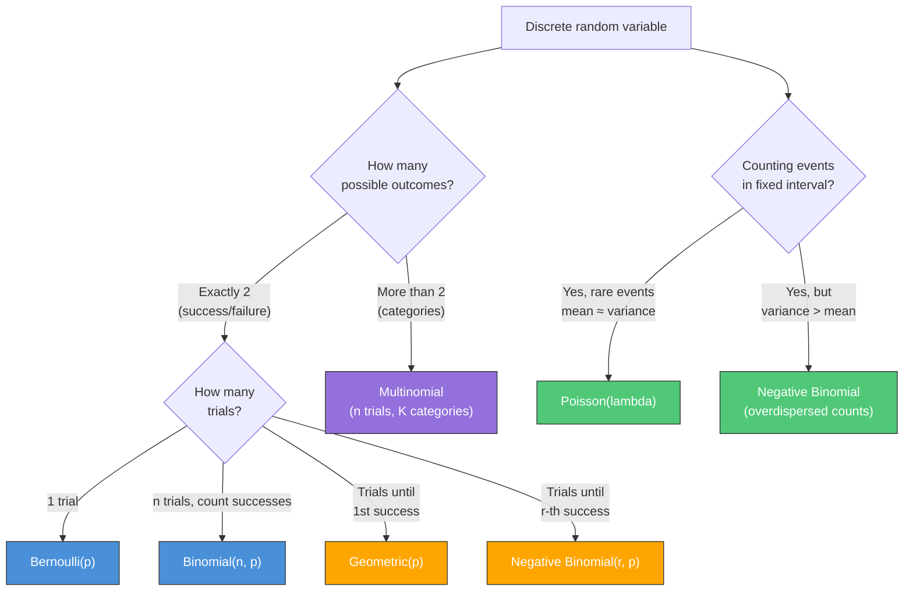
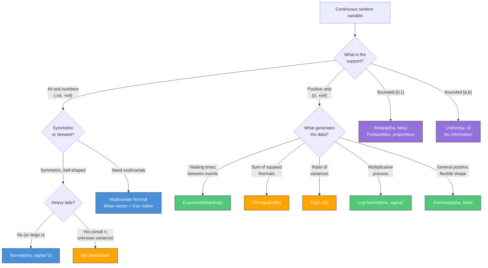
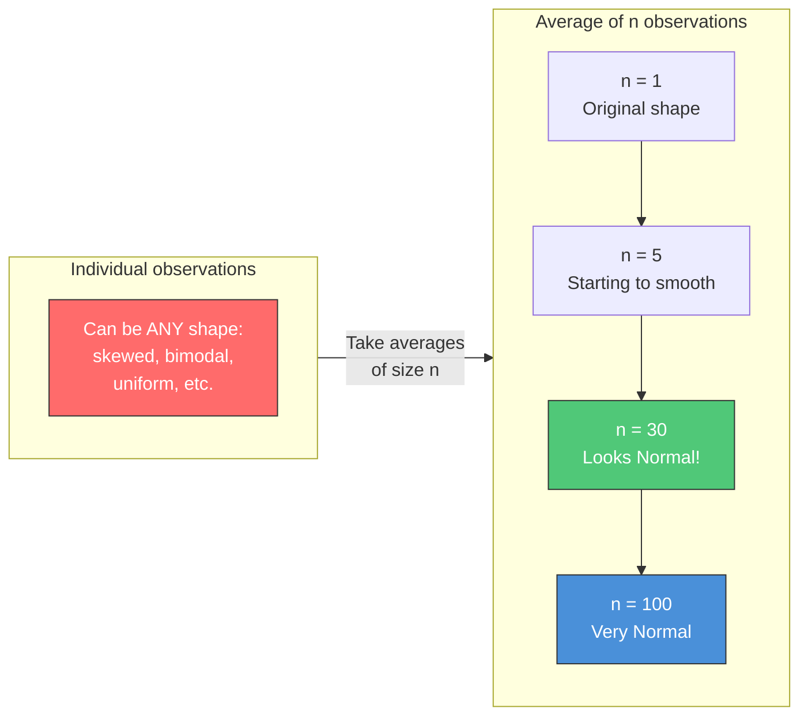
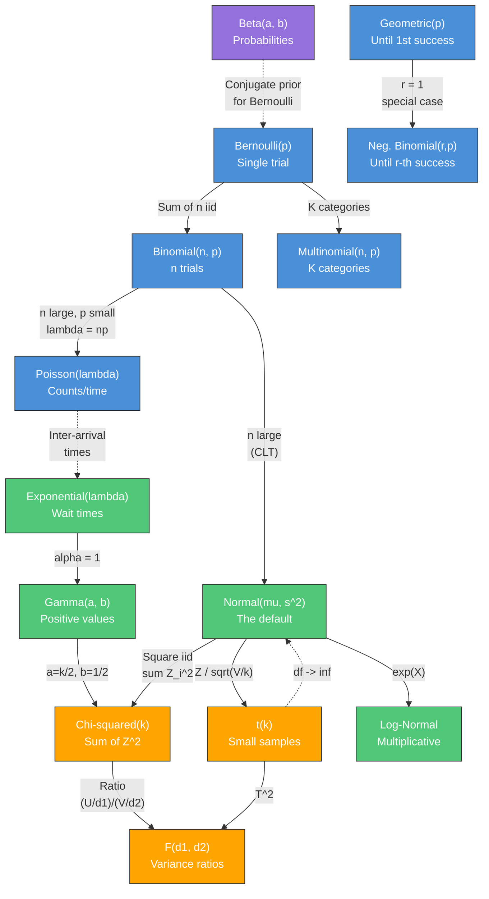
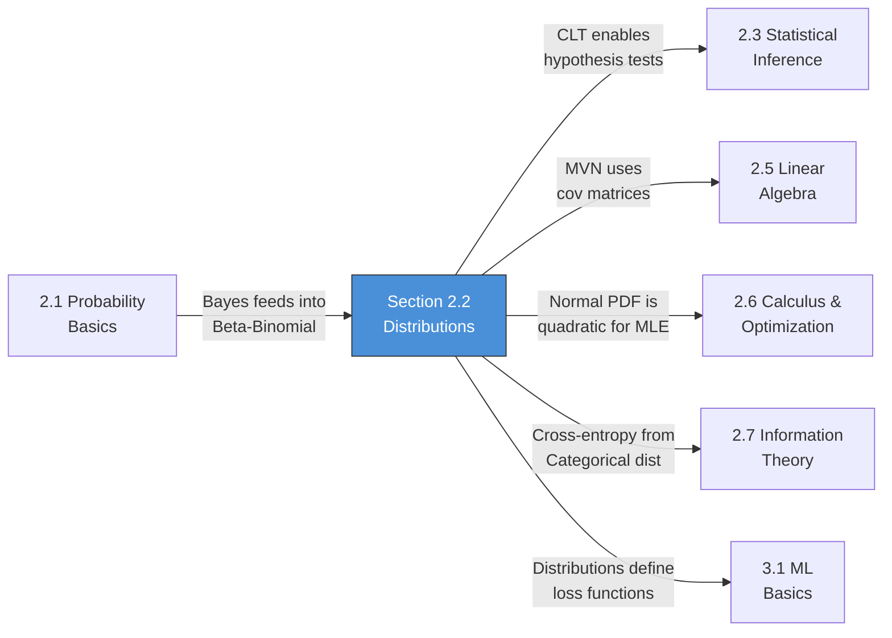

---
# Document Outline
- [Executive Summary](#executive-summary)
- [2.2.1 Discrete Distributions](#221-discrete-distributions-h)
  - [Bernoulli Distribution](#bernoulli-distribution)
  - [Binomial Distribution](#binomial-distribution)
  - [Poisson Distribution](#poisson-distribution)
  - [Geometric Distribution](#geometric-distribution)
  - [Negative Binomial Distribution](#negative-binomial-distribution)
  - [Multinomial Distribution](#multinomial-distribution)
  - [Which Discrete Distribution?](#which-discrete-distribution-decision-guide)
  - [Discrete Summary Table](#discrete-distributions-summary-table)
- [2.2.2 Continuous Distributions](#222-continuous-distributions-h)
  - [Normal (Gaussian)](#normal-gaussian-distribution)
  - [Exponential](#exponential-distribution)
  - [Uniform](#uniform-distribution)
  - [Log-Normal](#log-normal-distribution)
  - [Beta](#beta-distribution)
  - [Gamma](#gamma-distribution)
  - [Chi-Squared](#chi-squared-distribution)
  - [t-Distribution](#t-distribution)
  - [F-Distribution](#f-distribution)
  - [Dirac Delta](#dirac-delta-distribution)
  - [Multivariate Normal](#multivariate-normal-distribution)
  - [Which Continuous Distribution?](#which-continuous-distribution-decision-guide)
  - [Continuous Summary Table](#continuous-distributions-summary-table)
- [2.2.3 Key Theorems](#223-key-theorems-h)
  - [Central Limit Theorem](#central-limit-theorem-clt)
  - [Law of Large Numbers](#law-of-large-numbers)
  - [Delta Method](#delta-method)
- [2.2.4 Distribution Relationships](#224-distribution-relationships-m)
  - [Exponential Family](#exponential-family-unification)
  - [Relationship Diagram](#key-relationships-diagram)
- [Connections Map](#connections-map)
- [Interview Cheat Sheet](#interview-cheat-sheet)
- [Learning Objectives Checklist](#learning-objectives-checklist)

# Executive Summary

This guide covers Section 2.2: Distributions — the vocabulary of randomness. Every ML model assumes or outputs a probability distribution; knowing the shape, parameters, use cases, and relationships between distributions is essential for model selection, loss function design, and statistical testing. Content is calibrated against Goodfellow et al. *Deep Learning* (Chapter 3) and structured for senior Applied Scientist interview preparation. Each distribution progresses from definition to intuition to properties to Python visualization to ML connections.

> **Primary Reference**: Goodfellow, I., Bengio, Y., and Courville, A. *Deep Learning*. MIT Press, 2016.
> Chapter 3: Probability and Information Theory (pp. 53-76).

### Goodfellow Cross-Reference Map

Use this to read alongside your physical copy:

| This Guide | Goodfellow Section | Book Pages | What to Read |
|---|---|---|---|
| **2.2.1** Bernoulli/Multinomial | 3.9.1 Bernoulli | p. 63 | Bernoulli definition |
| **2.2.1** Multinomial | 3.9.2 Multinoulli (Categorical) | p. 63 | Single-trial multinomial |
| **2.2.2** Normal | 3.9.3 Gaussian Distribution | pp. 63-65 | Normal PDF, precision, CLT motivation |
| **2.2.2** Exponential/Laplace | 3.9.4 Exponential and Laplace | p. 65 | Sharp peak at 0, L1 connection |
| **2.2.2** Dirac delta | 3.9.5 Dirac Distribution | p. 65 | Empirical distribution definition |
| **2.2.2** Multivariate Normal | 3.9.3 Gaussian Distribution | pp. 63-65 | Covariance matrix, precision matrix |
| **2.2.3** CLT | 3.9.3 (motivation) | p. 64 | Why Normal is "default" — CLT justification |
| **2.2.4** Exponential family | — | — | Not covered directly; see Bishop Ch. 2 |
| **2.2.2** Sigmoid/Softplus | 3.10 Useful Properties | pp. 65-66 | Sigmoid, softplus, and their relationships |

> [!TIP]
> **Reading strategy**: Goodfellow Chapter 3.9 is a quick reference for key distributions — it's intentionally brief. Use this guide for depth and intuition, then glance at Goodfellow for the canonical definitions. For the testing distributions (Chi-squared, t, F), use any standard statistics textbook.

---

# 2.2 Distributions

> **Study Time**: 5-7 hours | **Priority**: [H] High | **Goal**: Know the shape, parameters, use cases, and relationships between distributions.

---

## 2.2.1 Discrete Distributions **[H]**

> **Book**: Goodfellow Ch. 3.9.1-3.9.2 (p. 63) | Bernoulli and Multinoulli (Categorical)

> Every classification model outputs a discrete distribution. Understanding these distributions means understanding what your model is actually predicting.

---

### Bernoulli Distribution

The simplest possible distribution: a single trial with two outcomes.

$$X \sim \text{Bernoulli}(p)$$

$$P(X = x) = p^x (1-p)^{1-x}, \quad x \in \{0, 1\}$$

| Property | Value |
|----------|-------|
| **Parameters** | $p \in [0, 1]$ (success probability) |
| **Support** | $\{0, 1\}$ |
| **Mean** | $E[X] = p$ |
| **Variance** | $\text{Var}(X) = p(1-p)$ |
| **Maximum variance** | At $p = 0.5$ (maximum uncertainty) |

> [!NOTE]
> **Variance intuition**: Variance $p(1-p)$ is maximized at $p=0.5$ and equals zero at $p=0$ or $p=1$. This is why A/B tests with 50/50 conversion rates need the largest sample sizes — you have maximum uncertainty about the outcome.

> > [!NOTE]
> > **Fundamental ML Connections**
> >
> > **1. Binary Classification Output (Agenda 3.1):**
> > Every binary classifier (logistic regression, neural network with sigmoid output) models the target as a Bernoulli random variable. The model predicts $\hat{p} = P(Y=1 \mid X)$, and the loss function (binary cross-entropy) is derived directly from the Bernoulli likelihood:
> > $$\mathcal{L} = -[y \log(\hat{p}) + (1-y) \log(1-\hat{p})]$$
> > This is literally the negative log of the Bernoulli PMF! Minimizing cross-entropy = maximizing Bernoulli likelihood.
> >
> > **2. Dropout Regularization (Agenda 3.3.2):**
> > Each neuron in dropout is independently "kept" with probability $p$ — a Bernoulli trial. The dropout mask for a layer of $n$ neurons is a vector of $n$ independent Bernoulli random variables.

---

### Binomial Distribution

The number of successes in $n$ independent Bernoulli trials.

$$X \sim \text{Binomial}(n, p)$$

$$P(X = k) = \binom{n}{k} p^k (1-p)^{n-k}, \quad k = 0, 1, \ldots, n$$

| Property | Value |
|----------|-------|
| **Parameters** | $n \in \mathbb{N}$ (trials), $p \in [0, 1]$ (success probability) |
| **Support** | $\{0, 1, 2, \ldots, n\}$ |
| **Mean** | $E[X] = np$ |
| **Variance** | $\text{Var}(X) = np(1-p)$ |
| **Connection** | Sum of $n$ i.i.d. Bernoulli$(p)$ |

> [!IMPORTANT]
> **Key relationship**: If $X_1, X_2, \ldots, X_n \sim \text{Bernoulli}(p)$ are i.i.d., then $\sum_{i=1}^n X_i \sim \text{Binomial}(n, p)$. This is your first example of a distribution arising from summing simpler ones — a pattern that repeats throughout this section.

<details>
<summary><strong>Worked Example: A/B Test Counts</strong></summary>

**Setup**: You run an A/B test with $n = 1000$ visitors. The current conversion rate is $p = 0.05$ (5%).

**Question**: What is the probability of observing exactly 60 conversions?

$$P(X = 60) = \binom{1000}{60} (0.05)^{60} (0.95)^{940}$$

```python
from scipy import stats

n, p = 1000, 0.05
# Exact probability of exactly 60 conversions
print(f"P(X=60) = {stats.binom.pmf(60, n, p):.6f}")  # 0.014...

# More useful: P(X >= 60) — "is 60 conversions unusually high?"
print(f"P(X>=60) = {1 - stats.binom.cdf(59, n, p):.4f}")  # ~0.095

# Normal approximation (CLT preview): works when np >= 5 and n(1-p) >= 5
mu, sigma = n*p, (n*p*(1-p))**0.5
print(f"Normal approx: mu={mu:.1f}, sigma={sigma:.2f}")   # mu=50, sigma=6.89
```

**Insight**: With $n=1000$ and $p=0.05$, the expected count is $np=50$ with $\sigma \approx 6.9$. Seeing 60 conversions is about 1.45 standard deviations above the mean — notable but not statistically significant at $\alpha = 0.05$ (it's within the 90% range).

</details>

> > [!NOTE]
> > **Fundamental ML Connections**
> >
> > **1. A/B Testing Sample Size (Agenda 1.2.1):**
> > The Binomial distribution is the exact model for "how many users convert out of $n$ visitors." The Normal approximation to the Binomial (valid when $np \geq 5$ and $n(1-p) \geq 5$) is what makes z-test based A/B testing possible. When you calculate the standard error $\text{SE} = \sqrt{p(1-p)/n}$, you are using the Binomial variance $np(1-p)$ divided by $n^2$.
> >
> > **2. Binomial Likelihood and Beta-Binomial Conjugacy (Section 2.1.4):**
> > In Bayesian A/B testing, the Binomial is the *likelihood* and the Beta distribution is the conjugate *prior*. After observing $k$ successes in $n$ trials, the posterior is $\text{Beta}(\alpha + k, \beta + n - k)$ — a closed-form update.

---

### Poisson Distribution

Models the count of events occurring in a fixed interval (time, area, volume) at a constant average rate.

$$X \sim \text{Poisson}(\lambda)$$

$$P(X = k) = \frac{\lambda^k e^{-\lambda}}{k!}, \quad k = 0, 1, 2, \ldots$$

| Property | Value |
|----------|-------|
| **Parameters** | $\lambda > 0$ (rate / expected count) |
| **Support** | $\{0, 1, 2, \ldots\}$ (unbounded) |
| **Mean** | $E[X] = \lambda$ |
| **Variance** | $\text{Var}(X) = \lambda$ |
| **Key property** | Mean = Variance (equidispersion) |

> [!NOTE]
> **Mean = Variance** is the defining fingerprint of a Poisson. If your count data has variance much larger than its mean, it is **overdispersed** and Negative Binomial is a better fit. This is one of the most common modeling mistakes in practice.

**Poisson as a limit of Binomial**: When $n$ is large and $p$ is small (but $\lambda = np$ is moderate):

$$\text{Binomial}(n, p) \approx \text{Poisson}(np)$$

**Rule of thumb**: Use this approximation when $n \geq 20$ and $p \leq 0.05$.

<details>
<summary><strong>Worked Example: Website Errors</strong></summary>

**Setup**: A server averages $\lambda = 3$ errors per hour.

**Question 1**: What is the probability of zero errors in the next hour?

$$P(X = 0) = \frac{3^0 e^{-3}}{0!} = e^{-3} \approx 0.0498$$

**Question 2**: What is the probability of more than 5 errors?

$$P(X > 5) = 1 - P(X \leq 5) = 1 - \sum_{k=0}^{5} \frac{3^k e^{-3}}{k!}$$

```python
from scipy import stats

lam = 3
print(f"P(X=0) = {stats.poisson.pmf(0, lam):.4f}")       # 0.0498
print(f"P(X>5)  = {1 - stats.poisson.cdf(5, lam):.4f}")   # 0.0839
```

</details>

> > [!NOTE]
> > **Fundamental ML Connections**
> >
> > **1. Poisson Regression / GLMs (Agenda 2.3.4):**
> > When modeling count data (page views, clicks, defect counts), Poisson regression uses a log link: $\log(\lambda) = X\beta$, ensuring non-negative predictions. This is a Generalized Linear Model (GLM) with the Poisson as the response distribution.
> >
> > **2. Poisson Loss for Count Prediction:**
> > Some gradient boosting implementations (XGBoost, LightGBM) offer a Poisson loss objective specifically for count data. This is the negative log-likelihood of the Poisson distribution.
> >
> > **3. Rare Event Modeling:**
> > Fraud detection, equipment failures, and medical adverse events are often modeled with Poisson processes because the events are rare and roughly independent.

---

### Geometric Distribution

Models the number of trials until the **first** success.

$$X \sim \text{Geometric}(p)$$

$$P(X = k) = (1-p)^{k-1} p, \quad k = 1, 2, 3, \ldots$$

| Property | Value |
|----------|-------|
| **Parameters** | $p \in (0, 1]$ (success probability) |
| **Support** | $\{1, 2, 3, \ldots\}$ |
| **Mean** | $E[X] = 1/p$ |
| **Variance** | $\text{Var}(X) = (1-p)/p^2$ |

> [!WARNING]
> **Convention alert**: Some textbooks define Geometric as the number of *failures* before the first success (support starts at 0). Always check which convention is being used. The formulas above use the "number of trials" convention (support starts at 1).

#### The Memoryless Property

$$P(X > s + t \mid X > s) = P(X > t)$$

**Intuition**: If you have already failed $s$ times, your expected remaining wait is the same as if you just started. The past gives you no information about the future.

> [!TIP]
> **The Geometric distribution is the ONLY discrete distribution with the memoryless property.** Its continuous counterpart is the Exponential distribution (Section 2.2.2), which is the only continuous memoryless distribution.

> > [!NOTE]
> > **Fundamental ML Connections**
> >
> > **1. Expected Exploration Rounds (Agenda 9.2):**
> > In reinforcement learning, if an agent has probability $p$ of succeeding at a task per attempt, the expected number of attempts until first success follows a Geometric distribution: $E[\text{attempts}] = 1/p$. This relates to the exploration-exploitation tradeoff.
> >
> > **2. Coupon Collector / Coverage Problems:**
> > "How many samples do I need to see every class at least once?" is a sum of Geometric random variables — directly relevant to class-balanced sampling strategies.

---

### Negative Binomial Distribution

Models the number of trials until the $r$-th success. Generalizes the Geometric ($r = 1$).

$$X \sim \text{NegBin}(r, p)$$

$$P(X = k) = \binom{k-1}{r-1} p^r (1-p)^{k-r}, \quad k = r, r+1, r+2, \ldots$$

| Property | Value |
|----------|-------|
| **Parameters** | $r > 0$ (successes needed), $p \in (0, 1]$ (success probability) |
| **Support** | $\{r, r+1, r+2, \ldots\}$ |
| **Mean** | $E[X] = r/p$ |
| **Variance** | $\text{Var}(X) = r(1-p)/p^2$ |

> [!NOTE]
> **When Poisson fails, use Negative Binomial.** Recall that Poisson constrains mean = variance. In practice, count data is almost always **overdispersed** (variance > mean). The Negative Binomial adds an extra parameter to decouple mean and variance, making it far more flexible for real-world count data.
>
> | Distribution | Variance vs Mean | Use When |
> |---|---|---|
> | Poisson | $\text{Var} = \mu$ | Counts are well-behaved (rare) |
> | Negative Binomial | $\text{Var} > \mu$ | Counts are overdispersed (common) |

> > [!NOTE]
> > **Fundamental ML Connection**
> >
> > **Overdispersed Count Models (Agenda 2.3.4):**
> > In practice (retail demand, click counts, hospital admissions), the Negative Binomial is often preferred over Poisson for regression because real count data almost always exhibits overdispersion. Many forecasting libraries (e.g., Amazon's DeepAR) use the Negative Binomial as their output distribution for exactly this reason.

---

### Multinomial Distribution


The multi-category extension of the Binomial. Models outcomes of $n$ trials, each falling into one of $K$ categories.

$$\mathbf{X} \sim \text{Multinomial}(n, \mathbf{p}) \quad \text{where } \mathbf{p} = (p_1, p_2, \ldots, p_K), \quad \sum_{k=1}^K p_k = 1$$

$$P(X_1 = x_1, \ldots, X_K = x_K) = \frac{n!}{x_1! x_2! \cdots x_K!} \prod_{k=1}^K p_k^{x_k}$$

| Property | Value |
|----------|-------|
| **Parameters** | $n$ (trials), $\mathbf{p}$ (probability vector, length $K$) |
| **Constraint** | $\sum_k x_k = n$ and $\sum_k p_k = 1$ |
| **Marginals** | Each $X_k \sim \text{Binomial}(n, p_k)$ |
| **Mean** | $E[X_k] = np_k$ |
| **Variance** | $\text{Var}(X_k) = np_k(1-p_k)$ |
| **Covariance** | $\text{Cov}(X_i, X_j) = -np_ip_j$ (negative — more of one means less of others) |

**Special cases**:
- $K = 2$: Multinomial reduces to **Binomial**
- $n = 1$: Single trial gives a **Categorical** distribution (Goodfellow calls this "Multinoulli")

> > [!NOTE]
> > **Fundamental ML Connections**
> >
> > **1. Multi-class Classification / Softmax (Agenda 3.1):**
> > A softmax layer outputs a probability vector $\mathbf{p} = (p_1, \ldots, p_K)$ where $\sum p_k = 1$. This parameterizes a Categorical distribution (Multinomial with $n=1$): $P(Y=k \mid X) = p_k$. The categorical cross-entropy loss is the negative log-likelihood of this distribution:
> > $$\mathcal{L} = -\sum_{k=1}^K y_k \log(p_k)$$
> >
> > **2. Topic Models / LDA (Agenda 3.2.3):**
> > In Latent Dirichlet Allocation, each document's word distribution is Multinomial, with the probability vector drawn from a Dirichlet prior (the multivariate generalization of the Beta distribution).

---

### Which Discrete Distribution? (Decision Guide)



---

### Discrete Distributions — Summary Table

| Distribution | PMF | Mean | Variance | Use Case |
|---|---|---|---|---|
| **Bernoulli**$(p)$ | $p^x(1-p)^{1-x}$ | $p$ | $p(1-p)$ | Single yes/no trial |
| **Binomial**$(n,p)$ | $\binom{n}{k}p^k(1-p)^{n-k}$ | $np$ | $np(1-p)$ | Count successes in $n$ trials |
| **Poisson**$(\lambda)$ | $\frac{\lambda^k e^{-\lambda}}{k!}$ | $\lambda$ | $\lambda$ | Event counts in interval |
| **Geometric**$(p)$ | $(1-p)^{k-1}p$ | $1/p$ | $(1-p)/p^2$ | Trials until first success |
| **Neg. Binomial**$(r,p)$ | $\binom{k-1}{r-1}p^r(1-p)^{k-r}$ | $r/p$ | $r(1-p)/p^2$ | Trials until $r$-th success |
| **Multinomial**$(n,\mathbf{p})$ | $\frac{n!}{\prod x_k!}\prod p_k^{x_k}$ | $np_k$ | $np_k(1-p_k)$ | $n$ trials, $K$ categories |

---

### Python: Visualizing Discrete Distributions


<details>
<summary>Python Code for Visualization</summary>

```python
import numpy as np
import matplotlib.pyplot as plt
from scipy import stats

fig, axes = plt.subplots(2, 3, figsize=(18, 10))
fig.suptitle('Discrete Distributions Gallery', fontsize=16, fontweight='bold')

# --- 1. Bernoulli ---
p = 0.3
x = [0, 1]
axes[0, 0].bar(x, [1-p, p], color=['#ff6b6b', '#4a90d9'], width=0.4, edgecolor='black')
axes[0, 0].set_title(f'Bernoulli(p={p})', fontsize=12)
axes[0, 0].set_xticks([0, 1])
axes[0, 0].set_xticklabels(['Failure (0)', 'Success (1)'])
axes[0, 0].set_ylabel('P(X = x)')
axes[0, 0].set_ylim(0, 1)

# --- 2. Binomial (varying n) ---
for n, color in [(10, '#4a90d9'), (20, '#50c878'), (50, '#ffa500')]:
    x_binom = np.arange(0, n + 1)
    axes[0, 1].bar(x_binom, stats.binom.pmf(x_binom, n, 0.3),
                   alpha=0.5, label=f'n={n}, p=0.3', color=color)
axes[0, 1].set_title('Binomial(n, p=0.3)', fontsize=12)
axes[0, 1].set_xlabel('k (successes)')
axes[0, 1].set_ylabel('P(X = k)')
axes[0, 1].legend()

# --- 3. Poisson (varying lambda) ---
for lam, color in [(1, '#4a90d9'), (4, '#50c878'), (10, '#ffa500')]:
    x_pois = np.arange(0, 25)
    axes[0, 2].bar(x_pois, stats.poisson.pmf(x_pois, lam),
                   alpha=0.5, label=f'lambda={lam}', color=color)
axes[0, 2].set_title('Poisson(lambda)', fontsize=12)
axes[0, 2].set_xlabel('k')
axes[0, 2].set_ylabel('P(X = k)')
axes[0, 2].legend()

# --- 4. Geometric ---
p_geo = 0.3
x_geo = np.arange(1, 16)
axes[1, 0].bar(x_geo, stats.geom.pmf(x_geo, p_geo), color='#9370db',
               alpha=0.8, edgecolor='black')
axes[1, 0].set_title(f'Geometric(p={p_geo})', fontsize=12)
axes[1, 0].set_xlabel('k (trials until success)')
axes[1, 0].set_ylabel('P(X = k)')
axes[1, 0].axvline(x=1/p_geo, color='red', linestyle='--', label=f'E[X]={1/p_geo:.1f}')
axes[1, 0].legend()

# --- 5. Negative Binomial (varying r) ---
for r, color in [(1, '#4a90d9'), (3, '#50c878'), (5, '#ffa500')]:
    x_nb = np.arange(r, r + 20)
    axes[1, 1].bar(x_nb, stats.nbinom.pmf(x_nb - r, r, 0.4),
                   alpha=0.5, label=f'r={r}, p=0.4', color=color)
axes[1, 1].set_title('Negative Binomial(r, p=0.4)', fontsize=12)
axes[1, 1].set_xlabel('k (trials until r-th success)')
axes[1, 1].set_ylabel('P(X = k)')
axes[1, 1].legend()

# --- 6. Poisson vs Binomial approximation ---
n_approx, p_approx = 100, 0.03
lam_approx = n_approx * p_approx
x_approx = np.arange(0, 15)
axes[1, 2].bar(x_approx - 0.15, stats.binom.pmf(x_approx, n_approx, p_approx),
               width=0.3, label=f'Binomial({n_approx}, {p_approx})', color='#4a90d9', alpha=0.8)
axes[1, 2].bar(x_approx + 0.15, stats.poisson.pmf(x_approx, lam_approx),
               width=0.3, label=f'Poisson({lam_approx})', color='#ff6b6b', alpha=0.8)
axes[1, 2].set_title('Poisson Approximation to Binomial', fontsize=12)
axes[1, 2].set_xlabel('k')
axes[1, 2].set_ylabel('P(X = k)')
axes[1, 2].legend()

plt.tight_layout()
plt.savefig('discrete_distributions_gallery.png', dpi=150, bbox_inches='tight')
plt.show()
```

</details>

---

### Real-World Phenomena: Discrete Distributions

To bridge theory and practice, the following visualizes simulated real-world datasets alongside the theoretical distributions that best model them.


<details>
<summary>Python Code for Visualization</summary>

```python
import numpy as np
import matplotlib.pyplot as plt
from scipy import stats

np.random.seed(42)
fig, axes = plt.subplots(2, 2, figsize=(16, 10))
fig.suptitle('Modeling Real-World Discrete Phenomena', fontsize=16, fontweight='bold')

# --- 1. Website Conversions (Binomial) ---
n_visitors = 100
true_cvr = 0.05
# Simulate 1000 days of website traffic (each day has 100 visitors)
daily_conversions = np.random.binomial(n=n_visitors, p=true_cvr, size=1000)
x_bin = np.arange(0, 15)
pmf_bin = stats.binom.pmf(x_bin, n=n_visitors, p=true_cvr)

axes[0, 0].hist(daily_conversions, bins=np.arange(-0.5, 15.5, 1), density=True, 
                color='#4a90d9', alpha=0.6, edgecolor='black', label='Observed Data (1000 days)')
axes[0, 0].plot(x_bin, pmf_bin, 'ro-', linewidth=2, label=f'Binomial fit (n=100, p=0.05)')
axes[0, 0].set_title('Daily Ad Conversions', fontsize=12)
axes[0, 0].set_xlabel('Number of Conversions per Day')
axes[0, 0].set_ylabel('Probability')
axes[0, 0].legend()

# --- 2. Customer Queue Arrivals (Poisson) ---
true_rate = 12 # 12 customers per hour
# Simulate arrivals per hour for 1000 hours
hourly_arrivals = np.random.poisson(lam=true_rate, size=1000)
x_pois = np.arange(0, 30)
pmf_pois = stats.poisson.pmf(x_pois, mu=true_rate)

axes[0, 1].hist(hourly_arrivals, bins=np.arange(-0.5, 30.5, 1), density=True,
                color='#50c878', alpha=0.6, edgecolor='black', label='Observed Arrivals (1000 hrs)')
axes[0, 1].plot(x_pois, pmf_pois, 'ro-', linewidth=2, label=f'Poisson fit ($\lambda$=12)')
axes[0, 1].set_title('Customer Arrivals at a Store', fontsize=12)
axes[0, 1].set_xlabel('Arrivals per Hour')
axes[0, 1].legend()

# --- 3. Impressions until Click (Geometric) ---
ctr = 0.1 # 10% Click-Through Rate
# Simulate how many impressions 1000 different users need before they click
impressions = np.random.geometric(p=ctr, size=1000)
x_geom = np.arange(1, 40)
pmf_geom = stats.geom.pmf(x_geom, p=ctr)

axes[1, 0].hist(impressions, bins=np.arange(0.5, 40.5, 1), density=True,
                color='#ffa500', alpha=0.6, edgecolor='black', label='Observed Impressions to Click')
axes[1, 0].plot(x_geom, pmf_geom, 'ro-', linewidth=2, label=f'Geometric fit (p=0.1)')
axes[1, 0].set_title('Ad Impressions Until First Click', fontsize=12)
axes[1, 0].set_xlabel('Number of Impressions')
axes[1, 0].legend()

# --- 4. Quality Control Failures (Negative Binomial) ---
# Inspect items until finding 3 defective ones (defect rate = 5%)
r_defects = 3
p_defect = 0.05
# Note: scipy's nbinom expects number of *successes* before r failures, or vice versa depending on definition.
# Here we model extra non-defective items inspected before finding 3 defects.
extra_items = np.random.negative_binomial(n=r_defects, p=p_defect, size=1000)
total_items = extra_items + r_defects
x_nb = np.arange(r_defects, 150)
pmf_nb = stats.nbinom.pmf(x_nb - r_defects, r_defects, p_defect)

axes[1, 1].hist(total_items, bins=np.arange(r_defects-0.5, 150.5, 5), density=True,
                color='#9370db', alpha=0.6, edgecolor='black', label='Observed Items Inspected')
axes[1, 1].plot(x_nb, pmf_nb, 'r-', linewidth=2, label=f'Neg. Binom fit (r=3, p=0.05)')
axes[1, 1].set_title('Items Inspected to Find 3 Defects', fontsize=12)
axes[1, 1].set_xlabel('Total Items Inspected')
axes[1, 1].legend()

plt.tight_layout()
plt.savefig('discrete_phenomena.png', dpi=150, bbox_inches='tight')
plt.show()
```

</details>

#### Why This Distribution and Not Others? (Discrete)

| Phenomenon | Appropriate Distribution | Why this one? | Why not others? |
|---|---|---|---|
| **Daily Ad Conversions** | **Binomial** | We have a known, fixed number of daily visitors ($n$) and each operates independently with a fixed conversion rate ($p$). We want the total count. | Not **Poisson**, because Poisson assumes no upper bound on counts, while we know the max conversions cannot exceed daily visitors. Not **Geometric**, because we care about total count, not waiting time. |
| **Server Errors per Hour** | **Poisson** | Events (errors) happen independently over a continuous interval, and we don't know the exact number of total "trials" (web requests), just a consistent average rate ($\lambda$). | Not **Binomial**, because $n$ (total server requests) is massive and unbounded, while $p$ (chance of error per request) is tiny. Poisson is the natural limit here. Not **Normal**, because counts cannot be negative and are discrete. |
| **Sales Calls Until a Deal** | **Geometric** | We repeatedly dial independent leads until we get the *first* "Yes". We want to know how long we'll be waiting/trying. | Not **Binomial**, because $n$ (total trials) is not fixed in advance; the number of trials is the random variable itself. |
| **Ads Shown Until 5 Clicks** | **Negative Binomial** | We need a specific number of *multiple* successes ($r=5$). It is the sum of $r$ independent Geometric wait times. | Not **Poisson**, because we are measuring *trials elapsed* rather than *counts within a fixed time*. Not **Geometric**, because Geometric strictly models waiting for only *one* success. |
| **User Device Mix (iOS/Android/Web)** | **Multinomial** | A single pool of $n$ users falls into exactly one of $K > 2$ categories. | Not **Binomial**, because Binomial only handles binary buckets (e.g., just iOS vs Non-iOS). Multinomial naturally scales to $K$ buckets. |


---

#### Interview Priority: Discrete Distributions

| What to Know | Priority | Why |
|---|---|---|
| Bernoulli PMF, mean, variance | **Must know** | Foundation of binary classification, cross-entropy loss |
| Binomial: sum of Bernoullis, Normal approximation | **Must know** | A/B testing, hypothesis testing |
| Poisson: mean = variance, when to use | **Must know** | Count data modeling, common interview question |
| Poisson as Binomial limit | **Should know** | Shows mathematical depth |
| Geometric: memoryless property | **Should know** | Conceptual understanding, connects to Exponential |
| Negative Binomial: overdispersion fix for Poisson | **Should know** | Real-world modeling insight |
| Multinomial: softmax connection | **Must know** | Multi-class classification foundation |
---

## 2.2.2 Continuous Distributions **[H]**

> **Book**: Goodfellow Ch. 3.9.3-3.9.5 (pp. 63-65) | Gaussian, Exponential, Laplace, Dirac

> Continuous distributions describe measurements, durations, and neural network outputs. Most ML loss functions and generative models are built on these.

---

### Normal (Gaussian) Distribution

The most important distribution in all of statistics and ML.

$$X \sim \mathcal{N}(\mu, \sigma^2)$$

$$f(x) = \frac{1}{\sigma\sqrt{2\pi}} \exp\left(-\frac{(x - \mu)^2}{2\sigma^2}\right)$$

| Property | Value |
|----------|-------|
| **Parameters** | $\mu \in \mathbb{R}$ (mean/location), $\sigma^2 > 0$ (variance/spread) |
| **Support** | $(-\infty, +\infty)$ |
| **Mean** | $E[X] = \mu$ |
| **Variance** | $\text{Var}(X) = \sigma^2$ |
| **Mode = Mean = Median** | Symmetric: all three are $\mu$ |

#### The 68-95-99.7 Rule

| Range | Probability | Practical Meaning |
|-------|-------------|-------------------|
| $\mu \pm 1\sigma$ | 68.27% | ~2/3 of data |
| $\mu \pm 2\sigma$ | 95.45% | ~19/20 of data |
| $\mu \pm 3\sigma$ | 99.73% | Almost all data |

#### Standard Normal and Z-scores

The **standard Normal** is $Z \sim \mathcal{N}(0, 1)$. Any Normal can be standardized:

$$Z = \frac{X - \mu}{\sigma}$$

**Z-scores** measure "how many standard deviations from the mean." This is the foundation of hypothesis testing: convert a test statistic to a Z-score, then look up the probability.

#### Sum of Normals is Normal

If $X \sim \mathcal{N}(\mu_1, \sigma_1^2)$ and $Y \sim \mathcal{N}(\mu_2, \sigma_2^2)$ are **independent**, then:

$$X + Y \sim \mathcal{N}(\mu_1 + \mu_2, \sigma_1^2 + \sigma_2^2)$$

> [!IMPORTANT]
> **Why the Normal is everywhere** (Goodfellow 3.9.3):
> 1. **CLT**: Sums of many independent random variables converge to Normal — regardless of the original distribution. This is why sample means, test statistics, and SGD gradients are approximately Normal.
> 2. **Maximum entropy**: Among all distributions with a given mean and variance, the Normal has the *maximum entropy* (maximum uncertainty). Using it means assuming "nothing beyond what we measured" — the least biased choice.
> 3. **Mathematical convenience**: The log of the Normal PDF is a quadratic — which makes MLE, MAP, and optimization easy.

<details>
<summary><strong>Worked Example: Feature Normalization</strong></summary>

**Why we normalize features**: If feature $X$ has mean $\mu = 1000$ and $\sigma = 500$, gradient descent will oscillate because the loss landscape is elongated. Z-scoring transforms it to $Z \sim \mathcal{N}(0, 1)$, making the landscape spherical.

```python
import numpy as np

# Raw feature with large scale
X = np.random.normal(loc=1000, scale=500, size=10000)
print(f"Before: mean={X.mean():.1f}, std={X.std():.1f}")

# Z-score normalization
Z = (X - X.mean()) / X.std()
print(f"After:  mean={Z.mean():.4f}, std={Z.std():.4f}")
# After: mean ~ 0.0000, std ~ 1.0000
```

</details>

> > [!NOTE]
> > **Fundamental ML Connections**
> >
> > **1. Weight Initialization (Agenda 3.3.1):**
> > Neural network weights are typically initialized from $\mathcal{N}(0, \sigma^2)$ where $\sigma$ depends on fan-in/fan-out (Xavier: $\sigma^2 = 2/(n_{in} + n_{out})$, He: $\sigma^2 = 2/n_{in}$). The Normal choice ensures weights start symmetrically around zero with controlled variance.
> >
> > **2. Gaussian Noise and VAEs (Agenda 5.2):**
> > Variational Autoencoders (VAEs) assume the latent space follows $\mathcal{N}(0, I)$. The "reparameterization trick" $z = \mu + \sigma \cdot \epsilon$ where $\epsilon \sim \mathcal{N}(0,1)$ enables backpropagation through stochastic layers.
> >
> > **3. MSE Loss = Normal Likelihood (Agenda 3.1):**
> > Minimizing Mean Squared Error is equivalent to maximizing the log-likelihood of a Normal distribution: $\text{MSE} = -\log \mathcal{N}(y \mid f(x), \sigma^2) + \text{const}$. This means when you use MSE loss, you are implicitly assuming your errors are Normally distributed.

---

### Exponential Distribution

Models the **waiting time** between events in a Poisson process.

$$X \sim \text{Exponential}(\lambda)$$

$$f(x) = \lambda e^{-\lambda x}, \quad x \geq 0$$

| Property | Value |
|----------|-------|
| **Parameters** | $\lambda > 0$ (rate) |
| **Support** | $[0, +\infty)$ |
| **Mean** | $E[X] = 1/\lambda$ |
| **Variance** | $\text{Var}(X) = 1/\lambda^2$ |
| **Memoryless** | $P(X > s + t \mid X > s) = P(X > t)$ |

> [!TIP]
> **Poisson-Exponential duality**: If events arrive at rate $\lambda$ per unit time (Poisson), then the time *between* consecutive events follows $\text{Exponential}(\lambda)$. They are two views of the same process:
>
> | Poisson | Exponential |
> |---------|-------------|
> | Counts events in fixed time | Measures time between events |
> | Discrete (counts) | Continuous (time) |
> | Parameter $\lambda$ = rate | Parameter $\lambda$ = same rate |
> | Mean = $\lambda$ events | Mean = $1/\lambda$ time |

> > [!NOTE]
> > **Fundamental ML Connections**
> >
> > **1. Survival Analysis (Agenda 9.3):**
> > The Exponential distribution is the simplest survival model: the "hazard rate" is constant $h(t) = \lambda$. This is the baseline for more flexible models like Weibull or Cox proportional hazards. When they say "the event has no memory," this is the Exponential assumption.
> >
> > **2. Laplace Distribution and L1 Regularization (Section 2.1.5):**
> > Goodfellow (3.9.4) discusses the Laplace distribution, which is a "double Exponential" (Exponential on both sides of 0). Using a Laplace prior in MAP estimation gives L1 (Lasso) regularization — producing sparse solutions.

---

### Uniform Distribution


Equal probability across an interval — the distribution of "no information."

$$X \sim \text{Uniform}(a, b)$$

$$f(x) = \frac{1}{b - a}, \quad a \leq x \leq b$$

| Property | Value |
|----------|-------|
| **Parameters** | $a, b \in \mathbb{R}$, $a < b$ (endpoints) |
| **Support** | $[a, b]$ |
| **Mean** | $E[X] = (a + b) / 2$ |
| **Variance** | $\text{Var}(X) = (b - a)^2 / 12$ |

> > [!NOTE]
> > **Fundamental ML Connections**
> >
> > **1. Random Initialization and Random Search:**
> > Uniform distributions are used for random hyperparameter search (sampling learning rates uniformly in log-space), random seeds, and random projections.
> >
> > **2. Uniform Prior = MLE (Section 2.1.5):**
> > A Uniform prior $P(\theta) = \text{const}$ contributes nothing to the MAP objective, so MAP with a Uniform prior reduces to MLE. This is the formal justification for "MLE assumes no prior knowledge."

---

### Log-Normal Distribution

If $\log(X) \sim \mathcal{N}(\mu, \sigma^2)$, then $X \sim \text{Log-Normal}(\mu, \sigma^2)$.

$$f(x) = \frac{1}{x\sigma\sqrt{2\pi}} \exp\left(-\frac{(\ln x - \mu)^2}{2\sigma^2}\right), \quad x > 0$$

| Property | Value |
|----------|-------|
| **Parameters** | $\mu \in \mathbb{R}$, $\sigma^2 > 0$ (of the underlying Normal) |
| **Support** | $(0, +\infty)$ |
| **Mean** | $E[X] = e^{\mu + \sigma^2/2}$ |
| **Variance** | $\text{Var}(X) = (e^{\sigma^2} - 1) e^{2\mu + \sigma^2}$ |
| **Shape** | Right-skewed, always positive |

> [!NOTE]
> **When to suspect Log-Normal**: If your data is strictly positive and right-skewed — and especially if a *multiplicative* process generates it (e.g., stock returns, income, city sizes, time-to-failure) — try taking the log. If $\log(X)$ looks Normal, your data is Log-Normal.

> > [!NOTE]
> > **Fundamental ML Connection**
> >
> > **Log-transforming Targets in Regression:**
> > When predicting right-skewed targets (house prices, salaries, response times), applying $\log(y)$ before fitting often improves model performance because the transformed target is closer to Normal — satisfying the implicit MSE/Normal assumption. Remember to exponentiate predictions back and that $E[e^Z] \neq e^{E[Z]}$ (Jensen's inequality from Section 2.1.6).

---

### Beta Distribution

The distribution over probabilities — values constrained to $[0, 1]$.

$$X \sim \text{Beta}(\alpha, \beta)$$

$$f(x) = \frac{x^{\alpha-1}(1-x)^{\beta-1}}{B(\alpha, \beta)}, \quad 0 \leq x \leq 1$$

where $B(\alpha, \beta) = \frac{\Gamma(\alpha)\Gamma(\beta)}{\Gamma(\alpha+\beta)}$ is the Beta function (normalizing constant).

| Property | Value |
|----------|-------|
| **Parameters** | $\alpha > 0$, $\beta > 0$ (shape parameters) |
| **Support** | $[0, 1]$ |
| **Mean** | $E[X] = \frac{\alpha}{\alpha + \beta}$ |
| **Variance** | $\text{Var}(X) = \frac{\alpha\beta}{(\alpha+\beta)^2(\alpha+\beta+1)}$ |
| **Mode** | $\frac{\alpha - 1}{\alpha + \beta - 2}$ (for $\alpha, \beta > 1$) |

#### Shape Gallery

The Beta distribution is incredibly flexible — it can be uniform, U-shaped, skewed, or symmetric:

| $\alpha$ | $\beta$ | Shape | Interpretation |
|----------|---------|-------|----------------|
| 1 | 1 | Uniform (flat) | No prior information |
| 0.5 | 0.5 | U-shaped (edges) | Extreme values likely |
| 2 | 5 | Left-skewed | Low values more likely |
| 5 | 2 | Right-skewed | High values more likely |
| 5 | 5 | Symmetric bell | Centered around 0.5 |
| 50 | 50 | Tight bell | Strong belief around 0.5 |

> [!TIP]
> **Mental model**: Think of $\alpha$ as "pseudo-counts of successes" and $\beta$ as "pseudo-counts of failures." $\text{Beta}(1, 1)$ = "I've seen nothing" (Uniform). $\text{Beta}(10, 2)$ = "I've seen 10 successes and 2 failures" (skewed right, probably $p \approx 0.83$).

> > [!NOTE]
> > **Fundamental ML Connections**
> >
> > **1. Bayesian A/B Testing / Thompson Sampling (Agenda 1.2.1):**
> > The Beta distribution is the conjugate prior for the Bernoulli/Binomial likelihood. Start with $\text{Beta}(\alpha_0, \beta_0)$ as your prior belief about a conversion rate. After observing $s$ successes and $f$ failures, the posterior is $\text{Beta}(\alpha_0 + s, \beta_0 + f)$. Thompson Sampling draws a sample from each arm's posterior Beta and picks the highest — a simple yet optimal exploration strategy.
> >
> > **2. Beta-Binomial Conjugacy (Section 2.1.4):**
> > This is the most important conjugacy pair in applied Bayesian inference. It enables closed-form posterior updates without MCMC, which is why Bayesian A/B testing is computationally cheap.


<details>
<summary>Python Code for Visualization</summary>

```python
import numpy as np
import matplotlib.pyplot as plt
from scipy import stats

fig, axes = plt.subplots(2, 3, figsize=(18, 10))
fig.suptitle('Beta Distribution Shape Gallery', fontsize=16, fontweight='bold')

params = [
    (1, 1, 'Uniform: Beta(1,1)'),
    (0.5, 0.5, 'U-shaped: Beta(0.5,0.5)'),
    (2, 5, 'Left-skewed: Beta(2,5)'),
    (5, 2, 'Right-skewed: Beta(5,2)'),
    (5, 5, 'Symmetric: Beta(5,5)'),
    (50, 50, 'Concentrated: Beta(50,50)')
]

x = np.linspace(0.001, 0.999, 300)

for ax, (a, b, title) in zip(axes.flat, params):
    pdf = stats.beta.pdf(x, a, b)
    ax.plot(x, pdf, color='#4a90d9', linewidth=2.5)
    ax.fill_between(x, pdf, alpha=0.3, color='#4a90d9')
    ax.set_title(title, fontsize=12)
    ax.set_xlabel('x')
    ax.set_ylabel('f(x)')
    mean = a / (a + b)
    ax.axvline(x=mean, color='red', linestyle='--', alpha=0.7, label=f'Mean={mean:.2f}')
    ax.legend(fontsize=9)

plt.tight_layout()
plt.savefig('beta_distribution_gallery.png', dpi=150, bbox_inches='tight')
plt.show()
```

</details>

---

### Gamma Distribution


A flexible family for positive-valued random variables. Generalizes the Exponential.

$$X \sim \text{Gamma}(\alpha, \beta)$$

$$f(x) = \frac{\beta^\alpha}{\Gamma(\alpha)} x^{\alpha-1} e^{-\beta x}, \quad x > 0$$

| Property | Value |
|----------|-------|
| **Parameters** | $\alpha > 0$ (shape), $\beta > 0$ (rate) |
| **Support** | $(0, +\infty)$ |
| **Mean** | $E[X] = \alpha/\beta$ |
| **Variance** | $\text{Var}(X) = \alpha/\beta^2$ |

**Key special cases**:
- $\text{Gamma}(1, \lambda)$ = $\text{Exponential}(\lambda)$
- $\text{Gamma}(n/2, 1/2)$ = $\chi^2(n)$ (Chi-squared with $n$ degrees of freedom)
- Sum of $n$ i.i.d. $\text{Exponential}(\beta)$ = $\text{Gamma}(n, \beta)$

> > [!NOTE]
> > **Fundamental ML Connection**
> >
> > **Bayesian Prior for Rate Parameters:**
> > The Gamma distribution is the conjugate prior for the Poisson rate $\lambda$ and the precision (inverse variance) of a Normal. When you see "Gamma prior" in Bayesian modeling, it's placing a belief on a positive-valued parameter.

---

### Chi-Squared Distribution

The distribution of the sum of squared standard Normals. Foundation of hypothesis testing.

$$X \sim \chi^2(k)$$

If $Z_1, Z_2, \ldots, Z_k \sim \mathcal{N}(0,1)$ are i.i.d., then:

$$X = \sum_{i=1}^k Z_i^2 \sim \chi^2(k)$$

| Property | Value |
|----------|-------|
| **Parameters** | $k \in \mathbb{N}$ (degrees of freedom) |
| **Support** | $[0, +\infty)$ |
| **Mean** | $E[X] = k$ |
| **Variance** | $\text{Var}(X) = 2k$ |
| **Special case** | $\chi^2(k) = \text{Gamma}(k/2, 1/2)$ |

> [!NOTE]
> **Degrees of freedom intuition**: The parameter $k$ counts how many independent "pieces of information" contribute to the sum. When fitting a model with $p$ parameters from $n$ data points, the residual sum of squares (after dividing by $\sigma^2$) follows $\chi^2(n-p)$. That's why we divide by $n-1$ (not $n$) for sample variance — we "used up" 1 degree of freedom estimating the mean.

> > [!NOTE]
> > **Fundamental ML Connections**
> >
> > **1. Chi-squared Test of Independence (Agenda 2.3.3):**
> > Tests whether two categorical features are independent. The test statistic $\sum \frac{(O - E)^2}{E}$ follows $\chi^2$ under $H_0$. Used for feature selection in categorical data.
> >
> > **2. Goodness-of-Fit Testing:**
> > Tests whether observed counts match a hypothesized distribution. Same $\chi^2$ statistic, different application.
> >
> > **3. Connection to Sample Variance:**
> > $(n-1)s^2/\sigma^2 \sim \chi^2(n-1)$ — this is why confidence intervals for variance use the Chi-squared distribution.

---

### t-Distribution

Arises when estimating a Normal mean from a small sample with unknown variance. Heavier tails than Normal.

$$X \sim t(k)$$

If $Z \sim \mathcal{N}(0,1)$ and $V \sim \chi^2(k)$ are independent, then:

$$T = \frac{Z}{\sqrt{V/k}} \sim t(k)$$

| Property | Value |
|----------|-------|
| **Parameters** | $k \in \mathbb{N}$ (degrees of freedom) |
| **Support** | $(-\infty, +\infty)$ |
| **Mean** | $E[X] = 0$ (for $k > 1$) |
| **Variance** | $\text{Var}(X) = k/(k-2)$ (for $k > 2$) |
| **Key behavior** | Heavier tails than Normal; approaches $\mathcal{N}(0,1)$ as $k \to \infty$ |

> [!WARNING]
> **When to use t vs Normal**:
>
> | Scenario | Use | Why |
> |----------|-----|-----|
> | Large sample ($n > 30$), known $\sigma$ | Z-test (Normal) | CLT + known variance |
> | Small sample, unknown $\sigma$ | t-test (t-distribution) | Extra uncertainty from estimating $\sigma$ adds heavier tails |
> | Any sample, unknown $\sigma$ | t-test (safe choice) | Always valid; reduces to Z-test for large $n$ |

> > [!NOTE]
> > **Fundamental ML Connections**
> >
> > **1. Regression Coefficient Testing (Agenda 2.3.4):**
> > In OLS regression, each coefficient's test statistic $t = \hat{\beta}/\text{SE}(\hat{\beta})$ follows a t-distribution under $H_0: \beta = 0$. This is how p-values for regression coefficients are computed.
> >
> > **2. Robust Loss Functions:**
> > The t-distribution's heavy tails make it more robust to outliers than the Normal. Some robust regression methods assume t-distributed errors instead of Normal errors, downweighting outliers automatically.

---

### F-Distribution

The ratio of two independent Chi-squared variables (divided by their degrees of freedom).

$$X \sim F(d_1, d_2)$$

If $U \sim \chi^2(d_1)$ and $V \sim \chi^2(d_2)$ are independent, then:

$$F = \frac{U/d_1}{V/d_2} \sim F(d_1, d_2)$$

| Property | Value |
|----------|-------|
| **Parameters** | $d_1, d_2$ (numerator and denominator degrees of freedom) |
| **Support** | $[0, +\infty)$ |
| **Mean** | $E[X] = d_2/(d_2-2)$ (for $d_2 > 2$) |
| **Key relationship** | If $T \sim t(k)$, then $T^2 \sim F(1, k)$ |

> > [!NOTE]
> > **Fundamental ML Connections**
> >
> > **1. ANOVA F-test (Agenda 2.3.3):**
> > The F-statistic compares between-group variance to within-group variance. A large F means the groups are significantly different. $F = \frac{\text{MS}_{\text{between}}}{\text{MS}_{\text{within}}}$.
> >
> > **2. Regression F-test (Agenda 2.3.4):**
> > The overall F-test for regression asks: "Does this model explain significantly more variance than a mean-only model?" It tests whether *all* coefficients are jointly zero.

---

### Dirac Delta Distribution


<details>
<summary>Python Code for Visualization</summary>

```python
import numpy as np
import matplotlib.pyplot as plt
from scipy import stats

np.random.seed(42)

# Improved Dirac Delta visualization
fig, (ax1, ax2) = plt.subplots(1, 2, figsize=(12, 4))

mu = 0
x = np.linspace(-3, 3, 1000)

# Panel 1: Limit of Normal distributions
sigmas = [1.0, 0.5, 0.2, 0.05]
colors = ['#4a90d9', '#50c878', '#ffa500', '#ff6b6b']

for sig, col in zip(sigmas, colors):
    y = stats.norm.pdf(x, mu, sig)
    ax1.plot(x, y, color=col, linewidth=2, label=f'$\\sigma = {sig}$')
    ax1.fill_between(x, y, alpha=0.1, color=col)

ax1.set_xlim(-3, 3)
ax1.set_ylim(0, 8)
ax1.set_title('Limit of Normal Distributions\n$\\lim_{\\sigma \\to 0} \\mathcal{N}(0, \\sigma^2)$', fontsize=12, fontweight='bold')
ax1.set_xlabel('x')
ax1.set_ylabel('Density')
ax1.legend()

# Panel 2: Standard Impulse Representation
ax2.axhline(0, color='gray', linewidth=1)
# Draw the impulse arrow
ax2.annotate('', xy=(mu, 1), xytext=(mu, 0),
            arrowprops=dict(facecolor='#ff6b6b', shrink=0, width=3, headwidth=10))
ax2.plot(mu, 0, 'ko', markersize=6)
ax2.set_xlim(-3, 3)
ax2.set_ylim(-0.1, 1.2)
ax2.set_title('Standard Impulse Representation\n$p(x) = \\delta(x)$', fontsize=12, fontweight='bold')
ax2.set_xlabel('x')
ax2.set_ylabel('Probability Mass')
ax2.text(mu + 0.2, 0.5, 'Area = 1', fontsize=11, color='#ff6b6b', fontweight='bold')

plt.tight_layout()
plt.savefig('dirac_delta.png', dpi=150, bbox_inches='tight')
plt.show()
```

</details>

A "distribution" that puts all its mass at a single point. Not a distribution in the classical sense, but extremely useful.

$$p(x) = \delta(x - \mu)$$

where $\delta(x) = 0$ for $x \neq 0$ and $\int \delta(x)dx = 1$.

| Property | Value |
|----------|-------|
| **Parameters** | $\mu$ (the point mass location) |
| **Mean** | $E[X] = \mu$ |
| **Variance** | $\text{Var}(X) = 0$ |

> > [!NOTE]
> > **Fundamental ML Connection** (Goodfellow 3.9.5)
> >
> > **Empirical Distribution:**
> > Given data points $\{x_1, \ldots, x_n\}$, the empirical distribution is a mixture of Dirac deltas:
> > $$\hat{p}(x) = \frac{1}{n} \sum_{i=1}^n \delta(x - x_i)$$
> > This connects to MLE: the empirical distribution is the *maximum likelihood* distribution — it assigns equal probability to each observed data point and zero to everything else. When we compute sample means, we are computing expectations under this empirical distribution.

---

### Multivariate Normal Distribution

The multi-dimensional generalization of the Normal. The most important multivariate distribution.

$$\mathbf{X} \sim \mathcal{N}(\boldsymbol{\mu}, \boldsymbol{\Sigma})$$

$$f(\mathbf{x}) = \frac{1}{(2\pi)^{d/2}|\boldsymbol{\Sigma}|^{1/2}} \exp\left(-\frac{1}{2}(\mathbf{x} - \boldsymbol{\mu})^T \boldsymbol{\Sigma}^{-1} (\mathbf{x} - \boldsymbol{\mu})\right)$$

| Property | Value |
|----------|-------|
| **Parameters** | $\boldsymbol{\mu} \in \mathbb{R}^d$ (mean vector), $\boldsymbol{\Sigma} \in \mathbb{R}^{d \times d}$ (covariance matrix, PSD) |
| **Support** | $\mathbb{R}^d$ |
| **Marginals** | Each $X_i \sim \mathcal{N}(\mu_i, \Sigma_{ii})$ |
| **Conditional** | $X_1 \mid X_2 = x_2$ is also multivariate Normal |
| **Key quantity** | Precision matrix $\boldsymbol{\Lambda} = \boldsymbol{\Sigma}^{-1}$ |

#### Covariance Matrix Shapes

The covariance matrix $\boldsymbol{\Sigma}$ controls the shape and orientation of the distribution:

| $\boldsymbol{\Sigma}$ Shape | Distribution Shape | Example |
|---|---|---|
| $\sigma^2 \mathbf{I}$ (scaled identity) | Spherical (circular contours) | Independent features, equal variance |
| Diagonal (different entries) | Axis-aligned ellipse | Independent features, different variances |
| Full (off-diagonal entries) | Rotated ellipse | Correlated features |

#### Mahalanobis Distance

$$d_M(\mathbf{x}, \boldsymbol{\mu}) = \sqrt{(\mathbf{x} - \boldsymbol{\mu})^T \boldsymbol{\Sigma}^{-1} (\mathbf{x} - \boldsymbol{\mu})}$$

**Intuition**: Euclidean distance "adjusted" for correlations. A point that is 3 units away in a high-variance direction is less unusual than 3 units away in a low-variance direction. Mahalanobis distance accounts for this.

> > [!NOTE]
> > **Fundamental ML Connections**
> >
> > **1. PCA (Agenda 3.2.2):**
> > PCA finds the eigenvectors of the covariance matrix $\boldsymbol{\Sigma}$. The top-$k$ eigenvectors (directions of maximum variance) define the principal components. The eigenvalues tell you how much variance each component explains.
> >
> > **2. Gaussian Processes (Agenda 3.5):**
> > A GP is an infinite-dimensional multivariate Normal. The kernel function $k(x_i, x_j)$ defines the covariance matrix entries $\Sigma_{ij}$. Conditioning on observed data gives posterior predictions that are also multivariate Normal — with closed-form mean and variance.
> >
> > **3. Linear Discriminant Analysis (LDA):**
> > LDA assumes each class has a multivariate Normal distribution with different means but shared covariance. The decision boundary is where the class-conditional densities are equal — which turns out to be a linear function when $\boldsymbol{\Sigma}$ is shared.
> >
> > **4. Anomaly Detection:**
> > Points with large Mahalanobis distance from the data center are outliers. This is more sophisticated than simple distance thresholds because it accounts for the correlation structure of the data.


<details>
<summary>Python Code for Visualization</summary>

```python
import numpy as np
import matplotlib.pyplot as plt
from scipy import stats

fig, axes = plt.subplots(1, 3, figsize=(18, 5))
fig.suptitle('Multivariate Normal: Effect of Covariance', fontsize=16, fontweight='bold')

# Create grid
x = np.linspace(-4, 4, 200)
y = np.linspace(-4, 4, 200)
X, Y = np.meshgrid(x, y)
pos = np.dstack((X, Y))

# Three different covariance matrices
covs = [
    ([[1, 0], [0, 1]], 'Spherical\nSigma = I'),
    ([[2, 0], [0, 0.5]], 'Axis-aligned\nSigma = diag(2, 0.5)'),
    ([[2, 1.2], [1.2, 1]], 'Correlated\nSigma = [[2,1.2],[1.2,1]]')
]

for ax, (cov, title) in zip(axes, covs):
    rv = stats.multivariate_normal([0, 0], cov)
    ax.contour(X, Y, rv.pdf(pos), levels=8, cmap='Blues')
    ax.contourf(X, Y, rv.pdf(pos), levels=8, cmap='Blues', alpha=0.4)
    ax.set_title(title, fontsize=12)
    ax.set_xlabel('X1')
    ax.set_ylabel('X2')
    ax.set_aspect('equal')
    ax.set_xlim(-4, 4)
    ax.set_ylim(-4, 4)

plt.tight_layout()
plt.savefig('multivariate_normal_contours.png', dpi=150, bbox_inches='tight')
plt.show()
```

</details>

---

### Which Continuous Distribution? (Decision Guide)



---

### Continuous Distributions — Summary Table

| Distribution | PDF (kernel) | Mean | Variance | Primary Use |
|---|---|---|---|---|
| **Normal**$(\mu, \sigma^2)$ | $\exp(-(x-\mu)^2/2\sigma^2)$ | $\mu$ | $\sigma^2$ | Default for real-valued data |
| **Exponential**$(\lambda)$ | $\lambda e^{-\lambda x}$ | $1/\lambda$ | $1/\lambda^2$ | Waiting times |
| **Uniform**$(a,b)$ | $1/(b-a)$ | $(a+b)/2$ | $(b-a)^2/12$ | No information / random init |
| **Log-Normal**$(\mu,\sigma^2)$ | $\frac{1}{x}e^{-(\ln x-\mu)^2/2\sigma^2}$ | $e^{\mu+\sigma^2/2}$ | $(e^{\sigma^2}-1)e^{2\mu+\sigma^2}$ | Multiplicative data |
| **Beta**$(\alpha,\beta)$ | $x^{\alpha-1}(1-x)^{\beta-1}$ | $\frac{\alpha}{\alpha+\beta}$ | $\frac{\alpha\beta}{(\alpha+\beta)^2(\alpha+\beta+1)}$ | Probabilities, priors |
| **Gamma**$(\alpha,\beta)$ | $x^{\alpha-1}e^{-\beta x}$ | $\alpha/\beta$ | $\alpha/\beta^2$ | Positive values, rates |
| **Chi-squared**$(k)$ | $x^{k/2-1}e^{-x/2}$ | $k$ | $2k$ | Hypothesis testing |
| **t**$(k)$ | $(1+x^2/k)^{-(k+1)/2}$ | $0$ | $k/(k-2)$ | Small-sample inference |
| **F**$(d_1,d_2)$ | Complex ratio | $d_2/(d_2-2)$ | Complex | ANOVA, regression tests |
| **Dirac**$(\mu)$ | $\delta(x-\mu)$ | $\mu$ | $0$ | Empirical distribution |
| **MVN**$(\boldsymbol{\mu},\boldsymbol{\Sigma})$ | $\exp(-\frac{1}{2}(\mathbf{x}-\boldsymbol{\mu})^T\boldsymbol{\Sigma}^{-1}(\mathbf{x}-\boldsymbol{\mu}))$ | $\boldsymbol{\mu}$ | $\boldsymbol{\Sigma}$ | Multivariate data, PCA, GPs |

---

### Python: Visualizing Continuous Distributions


<details>
<summary>Python Code for Visualization</summary>

```python
import numpy as np
import matplotlib.pyplot as plt
from scipy import stats

fig, axes = plt.subplots(2, 3, figsize=(18, 10))
fig.suptitle('Continuous Distributions Gallery', fontsize=16, fontweight='bold')

# --- 1. Normal: 68-95-99.7 rule ---
x = np.linspace(-4, 4, 300)
pdf = stats.norm.pdf(x)
axes[0, 0].plot(x, pdf, 'k-', linewidth=2)
for sigma, color, alpha in [(1, '#4a90d9', 0.4), (2, '#50c878', 0.25), (3, '#ffa500', 0.15)]:
    mask = (x >= -sigma) & (x <= sigma)
    axes[0, 0].fill_between(x[mask], pdf[mask], color=color, alpha=alpha,
                            label=f'+/-{sigma}sigma: {stats.norm.cdf(sigma)-stats.norm.cdf(-sigma):.1%}')
axes[0, 0].set_title('Normal: 68-95-99.7 Rule', fontsize=12)
axes[0, 0].legend(fontsize=8)

# --- 2. t vs Normal ---
x = np.linspace(-5, 5, 300)
axes[0, 1].plot(x, stats.norm.pdf(x), 'k-', linewidth=2, label='Normal')
for df, color in [(1, '#ff6b6b'), (3, '#ffa500'), (10, '#4a90d9')]:
    axes[0, 1].plot(x, stats.t.pdf(x, df), '--', color=color, linewidth=1.5, label=f't(df={df})')
axes[0, 1].set_title('t-Distribution vs Normal', fontsize=12)
axes[0, 1].legend()

# --- 3. Chi-squared (varying df) ---
x = np.linspace(0.01, 25, 300)
for df, color in [(1, '#ff6b6b'), (3, '#ffa500'), (5, '#4a90d9'), (10, '#50c878')]:
    axes[0, 2].plot(x, stats.chi2.pdf(x, df), linewidth=2, color=color, label=f'df={df}')
axes[0, 2].set_title('Chi-squared(k)', fontsize=12)
axes[0, 2].legend()

# --- 4. Exponential (varying lambda) ---
x = np.linspace(0, 5, 300)
for lam, color in [(0.5, '#4a90d9'), (1, '#50c878'), (2, '#ffa500')]:
    axes[1, 0].plot(x, stats.expon.pdf(x, scale=1/lam), linewidth=2, color=color,
                    label=f'lambda={lam}')
axes[1, 0].set_title('Exponential(lambda)', fontsize=12)
axes[1, 0].legend()

# --- 5. Log-Normal ---
x = np.linspace(0.01, 10, 300)
for sigma, color in [(0.25, '#4a90d9'), (0.5, '#50c878'), (1.0, '#ffa500')]:
    axes[1, 1].plot(x, stats.lognorm.pdf(x, s=sigma), linewidth=2, color=color,
                    label=f'sigma={sigma}')
axes[1, 1].set_title('Log-Normal(0, sigma)', fontsize=12)
axes[1, 1].legend()

# --- 6. F-distribution ---
x = np.linspace(0.01, 6, 300)
for d1, d2, color in [(1, 1, '#ff6b6b'), (5, 5, '#4a90d9'), (10, 30, '#50c878')]:
    axes[1, 2].plot(x, stats.f.pdf(x, d1, d2), linewidth=2, color=color,
                    label=f'F({d1},{d2})')
axes[1, 2].set_title('F-Distribution', fontsize=12)
axes[1, 2].legend()

for ax in axes.flat:
    ax.set_xlabel('x')
    ax.set_ylabel('f(x)')

plt.tight_layout()
plt.savefig('continuous_distributions_gallery.png', dpi=150, bbox_inches='tight')
plt.show()
```

</details>

---

### Real-World Phenomena: Continuous Distributions

To bridge theory and practice, the following visualizes simulated real-world datasets alongside the theoretical continuous distributions that best model them.


<details>
<summary>Python Code for Visualization</summary>

```python
import numpy as np
import matplotlib.pyplot as plt
from scipy import stats

np.random.seed(42)
fig, axes = plt.subplots(2, 2, figsize=(16, 10))
fig.suptitle('Modeling Real-World Continuous Phenomena', fontsize=16, fontweight='bold')

# --- 1. Human Heights / Measurement Errors (Normal) ---
# Sum of many small genetic/environmental factors -> Normal via CLT
true_mu, true_sigma = 170, 7.5
heights = np.random.normal(true_mu, true_sigma, size=2000)
x_norm = np.linspace(140, 200, 200)
pdf_norm = stats.norm.pdf(x_norm, true_mu, true_sigma)

axes[0, 0].hist(heights, bins=40, density=True, color='#4a90d9', alpha=0.6, 
                edgecolor='black', label='Observed Heights (cm)')
axes[0, 0].plot(x_norm, pdf_norm, 'r-', linewidth=3, label=f'Normal fit ($\mu$=170, $\sigma$=7.5)')
axes[0, 0].set_title('Adult Heights (Sum of Many Effects)', fontsize=12)
axes[0, 0].set_xlabel('Height (cm)')
axes[0, 0].set_ylabel('Density')
axes[0, 0].legend()

# --- 2. Server Time-to-Failure (Exponential) ---
# Constant hazard rate (no aging)
failure_rate = 1/50 # 1 failure per 50 days on avg
time_to_failure = np.random.exponential(scale=1/failure_rate, size=1000)
x_exp = np.linspace(0, 300, 200)
pdf_exp = stats.expon.pdf(x_exp, scale=1/failure_rate)

axes[0, 1].hist(time_to_failure, bins=40, density=True, color='#50c878', alpha=0.6,
                edgecolor='black', label='Observed Times until Failure')
axes[0, 1].plot(x_exp, pdf_exp, 'r-', linewidth=3, label=f'Exponential fit (mean=50)')
axes[0, 1].set_title('Server Cluster: Time Until Next Failure', fontsize=12)
axes[0, 1].set_xlabel('Days')
axes[0, 1].legend()

# --- 3. Income / House Prices (Log-Normal) ---
# Multiplicative compounding effects
# Median income ~50k, but severe right skew
log_mu, log_sigma = np.log(50), 0.6 
incomes = np.random.lognormal(mean=log_mu, sigma=log_sigma, size=2000)
x_logn = np.linspace(10, 200, 200)
pdf_logn = stats.lognorm.pdf(x_logn, s=log_sigma, scale=np.exp(log_mu))

axes[1, 0].hist(incomes, bins=50, range=(0, 200), density=True, color='#ffa500', alpha=0.6,
                edgecolor='black', label='Observed Income Data')
axes[1, 0].plot(x_logn, pdf_logn, 'r-', linewidth=3, label=f'Log-Normal fit')
axes[1, 0].set_title('Annual Incomes (Multiplicative Effects)', fontsize=12)
axes[1, 0].set_xlabel('Income ($1000s)')
axes[1, 0].legend()

# --- 4. A/B Test Conversion Rates (Beta) ---
# Probabilities bounded between [0, 1]
# E.g., prior belief about a true CTR after seeing 40 clicks and 960 no-clicks
alpha_prior, beta_prior = 40, 960
ctr_samples = np.random.beta(a=alpha_prior, b=beta_prior, size=2000)
x_beta = np.linspace(0.01, 0.08, 200)
pdf_beta = stats.beta.pdf(x_beta, a=alpha_prior, b=beta_prior)

axes[1, 1].hist(ctr_samples, bins=40, density=True, color='#9370db', alpha=0.6,
                edgecolor='black', label='Sampled CTR Probabilities')
axes[1, 1].plot(x_beta, pdf_beta, 'r-', linewidth=3, label=f'Beta fit ($\\alpha$=40, $\\beta$=960)')
axes[1, 1].set_title('Uncertainty over True CTR (Bounded)', fontsize=12)
axes[1, 1].set_xlabel('Click-Through Rate Probability')
axes[1, 1].legend()

plt.tight_layout()
plt.savefig('continuous_phenomena.png', dpi=150, bbox_inches='tight')
plt.show()
```

</details>

#### Why This Distribution and Not Others? (Continuous)

| Phenomenon | Appropriate Distribution | Why this one? | Why not others? |
|---|---|---|---|
| **Human Heights / Exam Scores** | **Normal** | The final value is the additive sum of millions of independent tiny factors (genetics, environment, diet). By the CLT, additive independent effects converge to a Normal distribution. | Not **Log-Normal**, because height isn't purely multiplicative and values cluster symmetrically around the mean. Not **Uniform**, because extreme values are exceedingly rare compared to average values. |
| **Time Until Next Server Crash** | **Exponential** | The probability of crashing in the next hour is constant, regardless of how long the server has been running (memoryless). The data is strictly positive and right-skewed. | Not **Normal**, because times cannot be negative, and the highest probability density is at $t \to 0$ (not a symmetric bell curve). Not **Gamma**, because a single server crash doesn't require waiting for $k$ intermediate events first. |
| **Incomes / House Prices / Stock Prices** | **Log-Normal** | The underlying growth process is *multiplicative* (e.g., getting a 5% raise on your current salary, a stock growing by 2%). When you multiply many positive variables, their logarithm is additive, meaning the log follows a Normal distribution. | Not **Normal**, because a Normal distribution would predict negative house prices/incomes, and doesn't capture the massive right-skew (the "long tail" of billionaires). |
| **Estimating the Probability a Coin is Biased** | **Beta** | The value we are modeling is a *probability* itself, which is strictly bounded between [0, 1]. It serves as a Bayesian prior for binary/binomial events. | Not **Normal**, because a Normal distribution stretches to $\pm \infty$ and wouldn't respect the $[0,1]$ probability boundaries. Not **Uniform**, because after seeing data, we have a "hump" of belief around the most likely probability. |
| **Duration of a Customer Call** | **Gamma** (or Weibull) | Modeling a duration that often has an "activation" phase before failure/completion. Or, waiting for exactly $k$ Poisson events to occur. | Not **Exponential**, because the probability of the call ending in the first 2 seconds is very low (it is NOT memoryless—the chance of hanging up changes as the call progresses). |


---

#### Interview Priority: Continuous Distributions

| What to Know | Priority | Why |
|---|---|---|
| Normal PDF, 68-95-99.7 rule, Z-scores | **Must know** | Foundation of everything |
| Why Normal is everywhere (CLT + max entropy) | **Must know** | Shows deep understanding |
| MSE loss = Normal likelihood | **Must know** | Connects loss functions to distributions |
| t vs Normal: when to use which | **Must know** | Hypothesis testing fundamentals |
| Chi-squared: what it measures, df intuition | **Should know** | Testing, goodness-of-fit |
| F-distribution: ANOVA and regression F-test | **Should know** | Model comparison |
| Exponential: memoryless, Poisson connection | **Should know** | Connects to survival analysis |
| Beta: shape intuition, conjugacy with Binomial | **Must know** | Bayesian A/B testing |
| Multivariate Normal: covariance matrix, Mahalanobis | **Must know** | PCA, GPs, discriminant analysis |
| Log-Normal: when data is multiplicative | **Should know** | Practical modeling judgment |
| Gamma: generalizes Exponential | Nice to have | Completes the picture |
| Dirac delta: empirical distribution connection | Nice to have | MLE theory insight |

---

## 2.2.3 Key Theorems **[H]**

> These three theorems are the "why" behind statistical inference. CLT justifies hypothesis tests, LLN justifies sample estimates, and the Delta Method handles nonlinear functions of statistics.

---

### Central Limit Theorem (CLT)

> The most important theorem in statistics.

**Statement**: Let $X_1, X_2, \ldots, X_n$ be i.i.d. random variables with mean $\mu$ and finite variance $\sigma^2$. Then as $n \to \infty$:

$$\frac{\bar{X}_n - \mu}{\sigma / \sqrt{n}} \xrightarrow{d} \mathcal{N}(0, 1)$$

Equivalently: $\bar{X}_n \approx \mathcal{N}\left(\mu, \frac{\sigma^2}{n}\right)$ for large $n$.

| Aspect | Details |
|--------|---------|
| **Conditions** | i.i.d., finite mean $\mu$, finite variance $\sigma^2$ |
| **What converges** | The *distribution* of the sample mean (not individual values) |
| **Rate** | $O(1/\sqrt{n})$ — the standard error shrinks as $\sqrt{n}$ |
| **What it does NOT say** | Nothing about individual observations; only about averages |
| **Rule of thumb** | Works well for $n \geq 30$ (less if the original distribution is symmetric) |

> [!IMPORTANT]
> **Why CLT matters for ML/Statistics**:
> 1. **Hypothesis testing**: Test statistics (z-scores, t-scores) are approximately Normal → we can compute p-values
> 2. **Confidence intervals**: $\bar{X} \pm z_{\alpha/2} \cdot \text{SE}$ works because $\bar{X}$ is approximately Normal
> 3. **A/B testing**: Even if conversion events are Bernoulli (very non-Normal), the *average* conversion rate is approximately Normal for large $n$
> 4. **SGD convergence**: Mini-batch gradient estimates are averages → approximately Normal → justifies convergence theory

**Intuition**: Why does averaging produce a Normal shape?



**Why it works (intuition, not proof)**: When you average $n$ values, extreme values in one direction tend to cancel with extreme values in the other direction. With more values to average, this cancellation becomes more complete, and what's left is the bell-shaped "residual" — the Normal distribution. The variance shrinks by $1/n$ because with more values, there's more cancellation.

#### Python: CLT Convergence Visualization


<details>
<summary>Python Code for Visualization</summary>

```python
import numpy as np
import matplotlib.pyplot as plt
from scipy import stats

np.random.seed(42)
fig, axes = plt.subplots(3, 4, figsize=(20, 12))
fig.suptitle('Central Limit Theorem: Sample Means Converge to Normal',
             fontsize=16, fontweight='bold')

# Three very non-Normal source distributions
sources = [
    ('Exponential(1)', lambda size: np.random.exponential(1, size)),
    ('Uniform(0,1)', lambda size: np.random.uniform(0, 1, size)),
    ('Bernoulli(0.3)', lambda size: np.random.binomial(1, 0.3, size))
]

sample_sizes = [1, 5, 30, 100]
n_simulations = 10000

for row, (name, sampler) in enumerate(sources):
    for col, n in enumerate(sample_sizes):
        # Simulate n_simulations sample means, each from n observations
        means = [sampler(n).mean() for _ in range(n_simulations)]
        
        ax = axes[row, col]
        ax.hist(means, bins=50, density=True, alpha=0.7, color='#4a90d9', edgecolor='black')
        
        # Overlay theoretical Normal
        mu = np.mean(means)
        sigma = np.std(means)
        x = np.linspace(mu - 4*sigma, mu + 4*sigma, 200)
        ax.plot(x, stats.norm.pdf(x, mu, sigma), 'r-', linewidth=2, label='Normal fit')
        
        if col == 0:
            ax.set_ylabel(name, fontsize=12, fontweight='bold')
        if row == 0:
            ax.set_title(f'n = {n}', fontsize=12, fontweight='bold')
        if row == 0 and col == 3:
            ax.legend()

plt.tight_layout()
plt.savefig('clt_convergence.png', dpi=150, bbox_inches='tight')
plt.show()
```

</details>

> > [!NOTE]
> > **Fundamental ML Connections**
> >
> > **1. A/B Testing (Agenda 1.2.1):**
> > CLT is literally why A/B testing works. Even though individual user behavior is binary (convert or not — a Bernoulli), the sample *proportion* $\hat{p} = \bar{X}$ is approximately Normal for large $n$: $\hat{p} \sim \mathcal{N}(p, p(1-p)/n)$. This lets us use z-tests to compare conversion rates.
> >
> > **2. Mini-batch SGD (Agenda 2.6.3):**
> > The gradient computed from a mini-batch is an average of per-sample gradients. By CLT, this average is approximately Normal around the true full-batch gradient, with variance decreasing as $1/\text{batch\_size}$. This is why larger batches give more stable (but more expensive) gradient estimates.
> >
> > **3. Normal Approximation to Binomial:**
> > For $n$ large, $\text{Binomial}(n, p) \approx \mathcal{N}(np, np(1-p))$. This is a direct consequence of CLT applied to a sum of Bernoullis.

---

### Law of Large Numbers

**Statement**: Let $X_1, X_2, \ldots, X_n$ be i.i.d. with mean $\mu$. Then:

$$\bar{X}_n = \frac{1}{n}\sum_{i=1}^n X_i \xrightarrow{} \mu \quad \text{as } n \to \infty$$

| Version | Convergence Type | Statement |
|---------|-----------------|-----------|
| **Weak LLN** | In probability | $\forall \epsilon > 0: P(\|\bar{X}_n - \mu\| > \epsilon) \to 0$ |
| **Strong LLN** | Almost surely | $P(\lim_{n\to\infty} \bar{X}_n = \mu) = 1$ |

> [!TIP]
> **CLT vs LLN — know the difference**:
>
> | | Law of Large Numbers | Central Limit Theorem |
> |---|---|---|
> | **Says** | $\bar{X}_n \to \mu$ (converges to a number) | $\bar{X}_n \sim \mathcal{N}(\mu, \sigma^2/n)$ (has a specific shape) |
> | **Tells you** | The sample mean *works* as an estimator | *How* the sample mean fluctuates |
> | **Cares about** | Whether $\bar{X}_n$ hits $\mu$ | The distribution *around* $\mu$ |
> | **Useful for** | Justifying sample estimates | Computing confidence intervals and p-values |

#### Python: LLN Convergence Visualization


<details>
<summary>Python Code for Visualization</summary>

```python
import numpy as np
import matplotlib.pyplot as plt

np.random.seed(42)
fig, axes = plt.subplots(1, 3, figsize=(18, 5))
fig.suptitle('Law of Large Numbers: Running Average Converges to True Mean',
             fontsize=16, fontweight='bold')

distributions = [
    ('Exponential(2)', np.random.exponential, {'scale': 2}, 2.0),
    ('Bernoulli(0.7)', np.random.binomial, {'n': 1, 'p': 0.7}, 0.7),
    ('Uniform(0, 10)', np.random.uniform, {'low': 0, 'high': 10}, 5.0)
]

N = 5000

for ax, (name, dist_func, params, true_mean) in zip(axes, distributions):
    # Multiple independent runs to show convergence
    for run in range(5):
        samples = dist_func(size=N, **params)
        running_avg = np.cumsum(samples) / np.arange(1, N + 1)
        ax.plot(running_avg, alpha=0.5, linewidth=0.8)
    
    ax.axhline(y=true_mean, color='red', linewidth=2, linestyle='--',
               label=f'True mean = {true_mean}')
    ax.set_title(name, fontsize=12)
    ax.set_xlabel('Number of samples (n)')
    ax.set_ylabel('Running average')
    ax.legend()
    ax.set_xlim(0, N)

plt.tight_layout()
plt.savefig('lln_convergence.png', dpi=150, bbox_inches='tight')
plt.show()
```

</details>

> > [!NOTE]
> > **Fundamental ML Connections**
> >
> > **1. Empirical Risk Minimization (Agenda 3.1):**
> > LLN justifies why we can use the *training loss* (average loss over $n$ samples) as a proxy for the *true risk* (expected loss over the population). As $n \to \infty$, $\frac{1}{n}\sum L(f(x_i), y_i) \to E[L(f(X), Y)]$. Without LLN, ML would have no theoretical foundation.
> >
> > **2. Monte Carlo Methods (Agenda 2.4.3):**
> > MCMC sampling works because of LLN: the average of samples from a distribution converges to the true expectation. More samples = better approximation.

---

### Delta Method

Approximates the distribution of a *function* of a random variable.

**Statement**: If $\sqrt{n}(\bar{X}_n - \mu) \xrightarrow{d} \mathcal{N}(0, \sigma^2)$, then for a differentiable function $g$:

$$\sqrt{n}(g(\bar{X}_n) - g(\mu)) \xrightarrow{d} \mathcal{N}(0, [g'(\mu)]^2 \sigma^2)$$

**Practical form**: 

$$\text{Var}(g(\bar{X})) \approx [g'(\mu)]^2 \cdot \text{Var}(\bar{X})$$

<details>
<summary><strong>Worked Example: Variance of a Ratio Metric in A/B Testing</strong></summary>

**Setup**: You want to test whether revenue per user ($R = \text{total\_revenue} / \text{total\_users}$) differs between treatment and control.

This is a *ratio* of two random variables — you can't just use the standard formula for SE of a mean.

**Delta Method approach**:
Let $g(x, y) = x/y$ (revenue / users). The gradient is:

$$\nabla g = \left(\frac{1}{y}, -\frac{x}{y^2}\right)$$

By the multivariate Delta Method:

$$\text{Var}\left(\frac{\bar{X}}{\bar{Y}}\right) \approx \frac{1}{\mu_Y^2}\text{Var}(\bar{X}) + \frac{\mu_X^2}{\mu_Y^4}\text{Var}(\bar{Y}) - \frac{2\mu_X}{\mu_Y^3}\text{Cov}(\bar{X}, \bar{Y})$$

```python
import numpy as np

np.random.seed(42)
n = 10000

# Simulate: each user has a revenue (possibly 0 if they don't buy)
p_buy = 0.1
revenue_if_buy = np.random.lognormal(mean=3, sigma=1, size=n)
bought = np.random.binomial(1, p_buy, size=n)
revenue = revenue_if_buy * bought

# Ratio metric: revenue per user
total_rev = revenue.sum()
total_users = n
ratio = total_rev / total_users

# Bootstrap SE (truth)
bootstrap_ratios = []
for _ in range(5000):
    idx = np.random.choice(n, n, replace=True)
    bootstrap_ratios.append(revenue[idx].mean())
bootstrap_se = np.std(bootstrap_ratios)

# Direct SE (wrong — ignores ratio structure)
direct_se = revenue.std() / np.sqrt(n)

print(f"Revenue per user: {ratio:.2f}")
print(f"Bootstrap SE:     {bootstrap_se:.4f}")
print(f"Direct SE:        {direct_se:.4f}")
print(f"They should be similar here since denominator is fixed (n)")
```

**Key takeaway**: The Delta Method gives you analytical standard errors for complex metrics (ratios, percentages, log-transformed values) without needing to bootstrap — much faster for large-scale A/B testing platforms.

</details>

> > [!NOTE]
> > **Fundamental ML Connections**
> >
> > **1. A/B Testing Ratio Metrics (Agenda 1.2.1):**
> > Many business metrics are ratios: revenue per user, clicks per impression, time per session. The Delta Method provides the standard error needed for hypothesis testing on these metrics without resorting to expensive bootstrapping.
> >
> > **2. Variance Stabilizing Transformations:**
> > The Delta Method can be used "in reverse" — find a transformation $g$ such that $\text{Var}(g(X))$ is approximately constant. For Poisson data, the square root transform $g(X) = \sqrt{X}$ stabilizes variance (since $\text{Var}(X) = \mu$ varies).

---

#### Interview Priority: Key Theorems

| What to Know | Priority | Why |
|---|---|---|
| CLT statement and conditions | **Must know** | Foundation of all statistical testing |
| CLT intuition: why averaging produces Normality | **Must know** | Shows deep understanding |
| CLT application to A/B testing | **Must know** | Most common applied context |
| LLN: sample averages converge to true mean | **Must know** | Justifies empirical risk minimization |
| CLT vs LLN: what each says | **Should know** | Common interview confusion point |
| Delta Method: variance of g(X) | **Should know** | Ratio metrics in A/B testing |
| Normal approximation to Binomial | **Should know** | Direct CLT application |

---

## 2.2.4 Distribution Relationships **[M]**

> Understanding how distributions relate to each other transforms a list of formulas into a connected web of intuition.

---

### Exponential Family Unification

Most distributions we've covered belong to the **exponential family** — a powerful unification.

**General form**:

$$p(x \mid \boldsymbol{\eta}) = h(x) \exp(\boldsymbol{\eta}^T \mathbf{T}(x) - A(\boldsymbol{\eta}))$$

| Term | Name | Role |
|------|------|------|
| $\boldsymbol{\eta}$ | Natural parameter | The "canonical" parameterization |
| $\mathbf{T}(x)$ | Sufficient statistic | All the information $x$ carries about $\boldsymbol{\eta}$ |
| $A(\boldsymbol{\eta})$ | Log-partition function | Normalizing constant (generates moments!) |
| $h(x)$ | Base measure | Distribution "skeleton" |

**Which distributions are exponential family?**

| Distribution | Natural Parameter $\eta$ | Sufficient Statistic $T(x)$ |
|---|---|---|
| Bernoulli$(p)$ | $\log(p/(1-p))$ (log-odds!) | $x$ |
| Binomial$(n, p)$ | $\log(p/(1-p))$ | $x$ |
| Poisson$(\lambda)$ | $\log(\lambda)$ | $x$ |
| Normal$(\mu, \sigma^2)$ | $(\mu/\sigma^2, -1/2\sigma^2)$ | $(x, x^2)$ |
| Exponential$(\lambda)$ | $-\lambda$ | $x$ |
| Gamma$(\alpha, \beta)$ | $(\alpha - 1, -\beta)$ | $(\log x, x)$ |
| Beta$(\alpha, \beta)$ | $(\alpha - 1, \beta - 1)$ | $(\log x, \log(1-x))$ |

**Not exponential family**: Uniform (support depends on parameter), Student's t (no sufficient statistic of fixed dimension).

> [!IMPORTANT]
> **Why exponential family matters for ML**:
> 1. **GLMs**: Generalized Linear Models work *because* the response distribution is exponential family. The link function connects the natural parameter to the linear predictor $X\beta$.
> 2. **Conjugate priors**: Every exponential family distribution has a conjugate prior — enabling closed-form Bayesian updates.
> 3. **MLE properties**: MLE for exponential family always exists, is unique, and the sufficient statistic is all you need. The MLE equations reduce to "match the model's expected sufficient statistics to the observed sufficient statistics."
> 4. **Maximum entropy**: The exponential family distribution is the *maximum entropy* distribution that matches given moment constraints.

---

### Key Relationships Diagram



#### Key Transformation Chains

| Chain | Relationship | Why It Matters |
|-------|-------------|----------------|
| Bernoulli $\to$ Binomial $\to$ Normal | Sum $\to$ CLT | A/B testing: binary events $\to$ Normal test statistics |
| Exponential $\to$ Gamma $\to$ Chi-squared | Special cases | Hypothesis testing distribution family |
| Normal $\to$ Chi-squared $\to$ t $\to$ F | Squared $\to$ ratio | The complete testing distribution hierarchy |
| Poisson $\leftrightarrow$ Exponential | Counts $\leftrightarrow$ times | Two views of the same process |
| Beta $\to$ Bernoulli/Binomial | Prior $\to$ likelihood | Bayesian conjugacy |
| Normal $\to$ Log-Normal | $\exp(\cdot)$ | Multiplicative vs additive processes |

---

#### Interview Priority: Distribution Relationships

| What to Know | Priority | Why |
|---|---|---|
| Bernoulli $\to$ Binomial $\to$ Normal (CLT) | **Must know** | Core testing pipeline |
| Poisson $\leftrightarrow$ Exponential (counts vs times) | **Must know** | Common interview question |
| Normal $\to$ Chi-squared $\to$ t $\to$ F chain | **Should know** | Testing distribution hierarchy |
| Beta as conjugate prior for Bernoulli | **Must know** | Bayesian A/B testing |
| Exponential family concept | **Should know** | GLM foundation |
| Full relationship diagram from memory | **Should know** | Section deliverable |

---

## Connections Map

How Section 2.2 connects to the rest of the study plan:



| This Section | Connects To | How |
|---|---|---|
| Bernoulli/Binomial | 2.3 Hypothesis Testing | z-tests, p-values |
| Normal | 2.3 Confidence Intervals | CI = $\bar{X} \pm z \cdot \text{SE}$ |
| Multivariate Normal | 2.5 Linear Algebra | Covariance matrix, eigendecomposition |
| All distributions | 2.6 Optimization | MLE = finding optimal parameters |
| Categorical/Normal | 2.7 Information Theory | Cross-entropy, KL divergence |
| All distributions | 3.1 ML Basics | Loss functions = negative log-likelihoods |
| Beta distribution | 2.1.4 Conjugate Priors | Beta-Binomial conjugacy |
| CLT | 2.3.2 Hypothesis Testing | Justifies Normal-based tests |

---

## Interview Cheat Sheet

**Quick-fire answers for common distribution questions:**

| Question | Answer |
|----------|--------|
| "When Poisson vs Binomial?" | Poisson: rare events in continuous interval, unbounded counts. Binomial: fixed $n$ trials, bounded count. |
| "When t vs Normal?" | t-test when $\sigma$ unknown AND $n$ small. For large $n$, they're equivalent. |
| "What's special about the Normal?" | CLT + max entropy + math convenience. MSE loss = Normal likelihood. |
| "Explain CLT in one sentence" | Sample averages become Normal regardless of the original distribution, given enough samples. |
| "What does mean = variance mean?" | Poisson fingerprint. If variance >> mean, use Negative Binomial instead. |
| "Why Beta for A/B testing?" | Conjugate prior for Bernoulli — posterior updates are closed-form, no MCMC needed. |
| "What is Mahalanobis distance?" | Euclidean distance adjusted for correlations via the inverse covariance matrix. |
| "Name three properties of Normal" | Symmetric, sum of Normals is Normal, fully defined by mean and variance. |
| "Why does chi-squared divide by n-1?" | Because estimating the mean "uses up" 1 degree of freedom. |
| "What's the Delta Method?" | Approximates variance of $g(\bar{X})$ as $[g'(\mu)]^2 \cdot \text{Var}(\bar{X})$. Used for ratio metrics. |

---

## Learning Objectives Checklist

### Section 2.2 Deliverables

- [ ] **Distribution relationship diagram**: Draw the full relationship diagram from memory (Bernoulli $\to$ Binomial $\to$ Normal, Exponential $\to$ Gamma $\to$ Chi-squared, etc.)
- [ ] **Distribution summary**: For each distribution, write from memory: PMF/PDF, mean, variance, and one real-world use case
- [ ] **CLT convergence**: Run and understand the CLT convergence visualization code — explain why it works
- [ ] **Quick identification**: Given a data description, identify the appropriate distribution in under 30 seconds (use the decision flowcharts)
- [ ] **Interview problems**: Solve 5 distribution-selection problems without notes (e.g., "A website gets 3 errors/hour on average. What's the probability of 0 errors in the next hour?")
- [ ] **Exponential family**: List 5 distributions that are exponential family and explain why it matters for GLMs
- [ ] **Whiteboard**: Derive the Normal approximation to the Binomial using CLT

### Self-Quiz Questions

1. Your A/B test has binary outcomes. What distribution models the total conversions? What distribution approximates it for large $n$?
2. You're modeling insurance claims (rare events, overdispersed). Poisson or Negative Binomial? Why?
3. Sketch the Beta distribution for $\text{Beta}(1,1)$, $\text{Beta}(5,5)$, and $\text{Beta}(2,8)$. What does each represent as a prior?
4. What's the difference between CLT and LLN? Give a one-sentence answer for each.
5. Your colleague says "the data is Normal" about a column of user session durations. Is this likely? What distribution would you expect?

---

> [!TIP]
> **Study order within 2.2**: Start with 2.2.1 (discrete) → 2.2.2 (continuous, focus on Normal first) → 2.2.3 (CLT/LLN) → 2.2.4 (relationships). Save the relationship diagram for last — it ties everything together.

