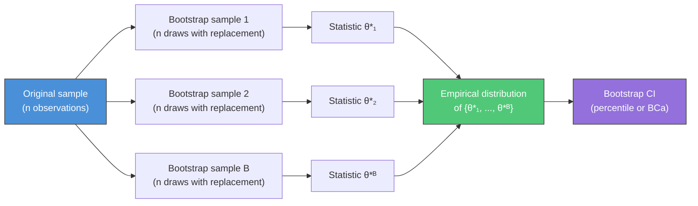
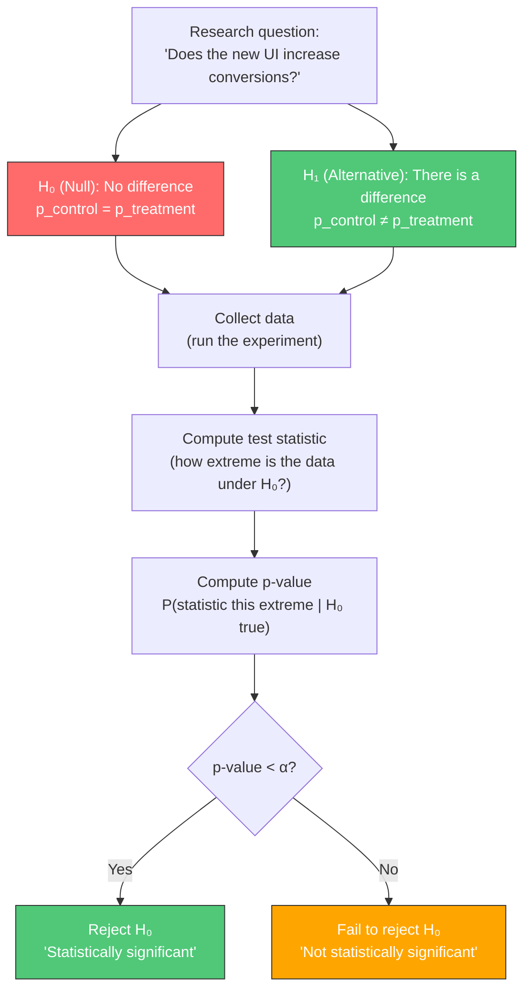
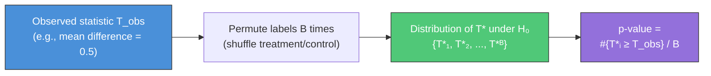
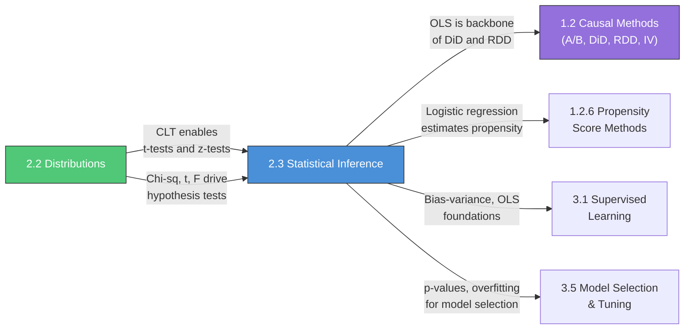

---

> [!IMPORTANT]
> ## 📖 How to Study This File (Read This First)
>
> **Why statistical inference matters**: Distributions (Section 2.2) are the vocabulary. Inference is the *grammar* — how you go from a sample of data to conclusions about the world. Every A/B test you'll design, every causal estimate you'll interpret, every regression coefficient you'll report requires this machinery. At Amazon, Meta, and Cruise, AS candidates are routinely asked to set up hypothesis tests on the fly, explain p-values correctly, design experiments with proper power, and diagnose broken regressions. This is core interview territory.
>
> **The payoff**: After this file, Section 1.2 (Causal Inference: A/B Testing, DiD, RDD) will feel like natural extensions — they are just hypothesis tests with careful identification strategies. OLS regression (here as inference foundations) is the workhorse of DiD and RDD. Bootstrap is how you get standard errors when theory fails. Permutation tests are the basis of Fisher's sharp null in causal inference. This section is the bridge between theory and everything applied.
>
> ---
>
> ### Suggested Study Plan (8–10 hours across 3 sessions)
>
> **Session 1 (~3h): Estimation + Hypothesis Testing Framework**
> 1. Read [2.3.1 Estimation Theory](#231-estimation-theory-h) — pay close attention to the correct CI interpretation
> 2. Read [2.3.2 Hypothesis Testing](#232-hypothesis-testing-c) through the multiple testing section
> 3. After each: close the file and answer the active recall questions at the end of the section
>
> **Session 2 (~3h): Statistical Tests + Regression**
> 1. Read [2.3.3 Common Statistical Tests](#233-common-statistical-tests-h) — focus on t-tests and permutation tests
> 2. Read [2.3.4 Regression Foundations](#234-regression-foundations-h) — derive OLS normal equations on paper
> 3. Work through at least one code example per section
>
> **Session 3 (~2–3h): Diagnostics + Deliverables**
> 1. Read [2.3.5 Regression Diagnostics](#235-regression-diagnostics-h)
> 2. Complete the deliverables: implement permutation test and bootstrap CI from scratch
> 3. Do the [Interview Cheat Sheet](#interview-cheat-sheet) as a recall test
>
> ---
>
> ### Priority Triage (if time is tight)
>
> | Must master before moving on | Can skim now, revisit later |
> |---|---|
> | Confidence interval correct interpretation | Cramer-Rao / Fisher info (in 2.4) |
> | p-value correct interpretation | Post-hoc tests (Tukey HSD) |
> | Type I / II errors, power, MDE | DFBETAS, DFFITS |
> | OLS derivation + assumptions | Durbin-Watson (more time series) |
> | Permutation test from scratch | Kruskal-Wallis |
> | Bootstrap CI from scratch | GLM details beyond Poisson |
> | Regression diagnostics (VIF, residual plots) | |
>
> ---
>
> ### Active Recall Protocol
>
> For each major concept, test yourself:
> - Can I state the correct definition (not just the intuition)?
> - Can I give the most common misconception and why it's wrong?
> - Can I connect it to a real scenario I'd encounter at Amazon/Cruise?
> - Can I implement it from scratch in 10 minutes?

---
# Document Outline
- [Executive Summary](#executive-summary)
- [2.3.1 Estimation Theory](#231-estimation-theory-h)
  - [Point Estimation](#point-estimation)
  - [Confidence Intervals](#confidence-intervals)
  - [Standard Error vs Standard Deviation](#standard-error-vs-standard-deviation)
  - [Bootstrap Methods](#bootstrap-methods)
- [2.3.2 Hypothesis Testing](#232-hypothesis-testing-c)
  - [The Testing Framework](#the-testing-framework)
  - [p-values](#p-values)
  - [Type I and Type II Errors](#type-i-and-type-ii-errors)
  - [Power Analysis](#power-analysis)
  - [Multiple Testing Corrections](#multiple-testing-corrections)
- [2.3.3 Common Statistical Tests](#233-common-statistical-tests-h)
  - [t-tests](#t-tests)
  - [Chi-Square Tests](#chi-square-tests)
  - [ANOVA](#anova)
  - [Non-Parametric Tests](#non-parametric-tests)
  - [Permutation Tests](#permutation-tests)
- [2.3.4 Regression Foundations](#234-regression-foundations-h)
  - [OLS Regression](#ols-regression)
  - [Logistic Regression](#logistic-regression)
  - [Generalized Linear Models](#generalized-linear-models-glms)
- [2.3.5 Regression Diagnostics](#235-regression-diagnostics-h)
  - [Heteroscedasticity](#heteroscedasticity)
  - [Multicollinearity](#multicollinearity)
  - [Autocorrelation](#autocorrelation)
  - [Influential Points](#influential-points)
  - [Residual Analysis](#residual-analysis)
- [Connections Map](#connections-map)
- [Interview Cheat Sheet](#interview-cheat-sheet)
- [Learning Objectives Checklist](#learning-objectives-checklist)

---

# Executive Summary

This guide covers Section 2.3: Statistical Inference — the machinery for drawing conclusions from data. Distributions (Section 2.2) describe populations; inference uses samples to make statements about those populations while quantifying uncertainty. Content is calibrated for senior Applied Scientist interviews: deep on the *why* and common misconceptions, heavy on A/B testing applications (which appear in virtually every AS interview at tech companies), and practical on regression diagnostics.

> **Primary References**:
> - Casella, G. & Berger, R. *Statistical Inference* (2nd ed.). Duxbury, 2002. Chapters 7–10.
> - James, G. et al. *An Introduction to Statistical Learning*. Springer, 2021. Chapter 3 (regression).
> - Goodfellow et al. *Deep Learning*. Chapter 5 (MLE, bias-variance) for cross-references.

### Cross-Reference Map

| This Guide | Connection | Where to Read More |
|---|---|---|
| **2.3.1** Confidence intervals | CIs for A/B test results | Section 1.2.1 (A/B Testing) |
| **2.3.2** Hypothesis testing | Power, MDE for experiment design | Section 1.2.1 (A/B Testing) |
| **2.3.2** Multiple testing | Bonferroni, FDR in multi-metric experiments | Section 1.2.1 |
| **2.3.3** Permutation tests | Fisher's sharp null in causal inference | Section 1.1, 1.2.5 |
| **2.3.4** OLS regression | Foundation for DiD estimator | Section 1.2.2 (DiD) |
| **2.3.4** Logistic regression | Propensity score estimation | Section 1.2.6 (PSM) |
| **2.3.5** Regression diagnostics | Model validity checking | Section 3.1 (ML Supervised) |

---

# 2.3 Statistical Inference

> **Study Time**: 8–10 hours | **Priority**: [H/C] High to Critical | **Goal**: Understand estimation and testing deeply enough to design experiments and diagnose problems on the fly.

---

## 2.3.1 Estimation Theory **[H]**

> The first question of statistics: how do we use a sample to learn about a population?

---

### Point Estimation

**Why learn this**: Every model prediction is a point estimate. Knowing that estimates have bias, variance, and MSE decomposition is why you understand overfitting and regularization — and can explain to a PM why a simpler model might outperform a complex one.

**Used directly in**:
- **Model selection via cross-validation**: CV error is a point estimate of generalization error with its own bias-variance tradeoff — k-fold reduces variance vs single holdout
- **Regularization tuning**: Ridge/Lasso deliberately increase bias to reduce variance; the optimal $\lambda$ minimizes MSE = Bias² + Variance, found via `GridSearchCV`
- **Ensemble methods**: bagging reduces variance (Random Forest), boosting reduces bias (XGBoost) — understanding which component dominates guides your choice

A **point estimator** $\hat{\theta}$ is a function of the data used to estimate a population parameter $\theta$.

#### Properties of Good Estimators

| Property | Definition | Why It Matters |
|---|---|---|
| **Unbiasedness** | $E[\hat{\theta}] = \theta$ | Estimator is right on average |
| **Consistency** | $\hat{\theta} \xrightarrow{p} \theta$ as $n \to \infty$ | Converges to truth with more data |
| **Efficiency** | Minimum variance among unbiased estimators | Lowest uncertainty for given $n$ |
| **Sufficiency** | Captures all information about $\theta$ in the data | No information lost by compression |

> [!IMPORTANT]
> **The Bias-Variance Tradeoff in Estimation**
>
> Mean Squared Error (MSE) decomposes as:
>
> $$\text{MSE}(\hat{\theta}) = \text{Bias}(\hat{\theta})^2 + \text{Var}(\hat{\theta})$$
>
> This is the same bias-variance tradeoff as in ML (Section 3.1.1), just applied to estimators rather than predictors. A biased estimator can have *lower* MSE if it substantially reduces variance — this is the justification for regularized estimators (Ridge, Lasso).

**Common unbiased estimators:**

| Parameter | Estimator | Unbiased? | Note |
|---|---|---|---|
| Mean $\mu$ | $\bar{X} = \frac{1}{n}\sum X_i$ | ✅ Yes | Most important |
| Variance $\sigma^2$ | $s^2 = \frac{1}{n-1}\sum(X_i - \bar{X})^2$ | ✅ Yes | Divide by $n-1$, not $n$ |
| Variance $\sigma^2$ | $\frac{1}{n}\sum(X_i - \bar{X})^2$ | ❌ No | Biased downward |
| Proportion $p$ | $\hat{p} = X/n$ | ✅ Yes | Standard A/B test estimator |

> [!NOTE]
> **Why $n-1$ in sample variance?**
> We estimate the mean $\bar{X}$ first, which "uses up" one degree of freedom. The residuals $(X_i - \bar{X})$ are constrained to sum to zero — so only $n-1$ are free. Dividing by $n-1$ corrects for this: $(n-1)s^2/\sigma^2 \sim \chi^2(n-1)$ exactly.

> [!NOTE]
> **Fundamental ML Connection**
>
> **Bias-Variance in Model Selection (Agenda 3.1):**
> The bias-variance decomposition of MSE is the *theoretical* underpinning of model selection. Simple models (linear regression) have high bias, low variance. Complex models (deep networks) have low bias, high variance. Regularization (L1/L2) deliberately introduces bias to reduce variance — exactly as in biased estimators above.

---

### Confidence Intervals

A **$(1-\alpha)$ confidence interval** is a random interval $[L(X), U(X)]$ such that:

$$P(L(X) \leq \theta \leq U(X)) = 1 - \alpha$$

**Why learn this**: Every A/B test result you'll ever report includes a confidence interval. Getting the interpretation wrong (the most common statistics mistake in industry) undermines your credibility. Knowing Wald vs Wilson CIs means you won't report impossible confidence bounds for small-sample proportions.

**Used directly in**:
- **A/B test result reporting**: every experiment dashboard shows lift ± CI. In code: `sm.stats.proportion_confint(count, nobs, method='wilson')` for proportions
- **Model performance reporting**: "AUC = 0.85 ± 0.02" — the ± comes from bootstrap CI on the test set; always report CIs alongside point metrics
- **Experiment duration estimation**: required $n$ for a desired CI width $w$: $n \geq (2z_{\alpha/2})^2 \hat{p}(1-\hat{p})/w^2$ — this is how you answer "how long to run this test?"

#### The Standard CI Formula

For a sample mean from a Normal (or large-$n$) setting:

$$\bar{X} \pm z_{\alpha/2} \cdot \frac{\sigma}{\sqrt{n}}$$

When $\sigma$ is unknown (almost always), use $s$ and the t-distribution:

$$\bar{X} \pm t_{\alpha/2, n-1} \cdot \frac{s}{\sqrt{n}}$$

| Confidence Level | $\alpha$ | $z_{\alpha/2}$ | Memorize this |
|---|---|---|---|
| 90% | 0.10 | 1.645 | |
| 95% | 0.05 | 1.960 | ✅ Must memorize |
| 99% | 0.01 | 2.576 | |

#### ⚠️ The Most Common Misconception in Statistics

> [!CAUTION]
> **What a 95% CI does NOT mean:**
> - ❌ "There is a 95% probability that $\theta$ is in this interval"
> - ❌ "95% of the data falls in this interval"
>
> **What it ACTUALLY means (frequentist):**
> - ✅ "If we repeated this procedure many times, 95% of the constructed intervals would contain the true $\theta$"
> - ✅ The *procedure* has 95% coverage; any single interval either contains $\theta$ or it doesn't
>
> **The Bayesian alternative** (a *credible interval*) does give a probability statement about $\theta$ — but requires a prior. See Section 2.4.3.
>
> **Why interviewers ask this**: The misconception is nearly universal. Correctly stating the frequentist interpretation signals statistical maturity.

#### CI for Proportions

For an A/B test proportion $\hat{p} = k/n$:

**Wald interval** (standard, works for large $n$):
$$\hat{p} \pm z_{\alpha/2} \sqrt{\frac{\hat{p}(1-\hat{p})}{n}}$$

**Wilson interval** (better for small $n$ or $p$ near 0 or 1):
$$\frac{\hat{p} + \frac{z^2}{2n}}{1 + \frac{z^2}{n}} \pm \frac{z}{1 + \frac{z^2}{n}} \sqrt{\frac{\hat{p}(1-\hat{p})}{n} + \frac{z^2}{4n^2}}$$

> [!TIP]
> **When to use Wilson**: If $n\hat{p} < 10$ or $n(1-\hat{p}) < 10$, the Wald interval can produce nonsensical bounds (negative lower bound for probabilities). Wilson is always valid and is the preferred choice at companies that care about correctness.

```python
from scipy import stats
import numpy as np

def ci_proportion(k, n, alpha=0.05):
    """Wald and Wilson CIs for a proportion."""
    p_hat = k / n
    z = stats.norm.ppf(1 - alpha / 2)

    # Wald
    se_wald = np.sqrt(p_hat * (1 - p_hat) / n)
    wald = (p_hat - z * se_wald, p_hat + z * se_wald)

    # Wilson
    denom = 1 + z**2 / n
    center = (p_hat + z**2 / (2 * n)) / denom
    margin = (z / denom) * np.sqrt(p_hat * (1 - p_hat) / n + z**2 / (4 * n**2))
    wilson = (center - margin, center + margin)

    return {"wald": wald, "wilson": wilson, "p_hat": p_hat}

# Example: 12 conversions out of 100 visitors
result = ci_proportion(12, 100)
print(f"p_hat = {result['p_hat']:.3f}")
print(f"Wald  CI: ({result['wald'][0]:.3f}, {result['wald'][1]:.3f})")
print(f"Wilson CI: ({result['wilson'][0]:.3f}, {result['wilson'][1]:.3f})")
```

> [!NOTE]
> **Fundamental ML Connection**
>
> **A/B Test Reporting (Agenda 1.2.1):**
> Every A/B test result is reported as a point estimate + confidence interval. The CI width is $\sim 2z_{\alpha/2}\sqrt{p(1-p)/n}$ — this is why larger samples give tighter CIs. The minimum sample size needed for a desired CI width $w$ is $n \geq (2z_{\alpha/2})^2 p(1-p)/w^2$.

---

### Standard Error vs Standard Deviation

One of the most confused pairs in statistics:

**Why learn this**: When your PM asks "how confident are we in this metric?" — SD answers the wrong question (how variable are users) and SE answers the right one (how precisely have we estimated the average). Mixing these up is one of the fastest ways to lose credibility in a data review.

**Used directly in**:
- **Error bars on plots**: SD error bars show data spread (good for EDA); SE error bars show estimation uncertainty (good for comparing groups). Using the wrong one misleads your audience
- **Sample size impact**: SE = SD/$\sqrt{n}$ means 4x the data halves your uncertainty — this is the formula behind every "how much data do we need?" conversation

| Concept | Formula | Measures | Decreases with $n$? |
|---|---|---|---|
| **Standard Deviation** (SD) | $s = \sqrt{\frac{1}{n-1}\sum(X_i - \bar{X})^2}$ | Spread of individual observations | No — it's a population property |
| **Standard Error** (SE) | $\text{SE} = s / \sqrt{n}$ | Uncertainty in the *sample mean* | Yes — $\propto 1/\sqrt{n}$ |

> [!TIP]
> **Mental model**: SD tells you how variable individual data points are. SE tells you how precisely you've estimated the mean. With infinite data, SE → 0 (you know the mean exactly), but SD stays the same (individuals are still variable).

**Key standard errors you must know:**

| Estimator | Standard Error |
|---|---|
| Sample mean $\bar{X}$ | $\sigma/\sqrt{n}$ (or $s/\sqrt{n}$) |
| Sample proportion $\hat{p}$ | $\sqrt{p(1-p)/n}$ |
| Difference in proportions $\hat{p}_1 - \hat{p}_2$ | $\sqrt{p_1(1-p_1)/n_1 + p_2(1-p_2)/n_2}$ |
| OLS coefficient $\hat{\beta}$ | $\sqrt{\hat{\sigma}^2 (X^TX)^{-1}}$ (diagonal entries) |

---

### Bootstrap Methods

**The bootstrap idea**: When you don't know (or can't derive) the sampling distribution of a statistic, simulate it by resampling from your own data.

**Why learn this**: Many real business metrics have no closed-form standard error — medians, percentiles, ratios, custom KPIs. Bootstrap is how you get confidence intervals for *any* statistic. At Netflix, bootstrapping is used routinely for metric uncertainty in experiment analysis.

**Used directly in**:
- **CI for any metric**: medians, percentiles, Gini coefficients, custom KPIs — bootstrap gives you CIs when theory can't. Code: `np.percentile(bootstrap_samples, [2.5, 97.5])`
- **Feature importance stability**: `sklearn.ensemble.BaggingClassifier` already uses bootstrap internally; variance of importances across bootstrap samples tells you which features are reliable
- **Model comparison**: bootstrap the test set, compute metric difference for two models each time → CI for the performance gap → statistical test for "is model A really better?"
- **Causal inference SE**: when analytical SEs aren't available for complex causal estimators (matching, CATE), bootstrap is the standard fallback



#### Types of Bootstrap

| Type | Approach | When to Use |
|---|---|---|
| **Non-parametric** | Resample observations with replacement | Default choice; no distributional assumption |
| **Parametric** | Fit a model, simulate from it | When the model is correct and data is scarce |

#### Bootstrap Confidence Intervals

```python
import numpy as np

def bootstrap_ci(data, statistic_fn, n_bootstrap=10000, alpha=0.05, seed=42):
    """
    Non-parametric bootstrap confidence interval.
    statistic_fn: function that takes a 1D array, returns a scalar
    """
    rng = np.random.default_rng(seed)
    n = len(data)

    bootstrap_stats = np.array([
        statistic_fn(rng.choice(data, size=n, replace=True))
        for _ in range(n_bootstrap)
    ])

    # Percentile method (simple)
    lower = np.percentile(bootstrap_stats, 100 * alpha / 2)
    upper = np.percentile(bootstrap_stats, 100 * (1 - alpha / 2))

    return {
        "estimate": statistic_fn(data),
        "ci_lower": lower,
        "ci_upper": upper,
        "bootstrap_std": bootstrap_stats.std()
    }

# Example: bootstrap CI for the median (no closed-form SE exists)
data = np.array([12, 15, 14, 10, 18, 22, 9, 16, 13, 11, 20, 14])
result = bootstrap_ci(data, np.median)
print(f"Median estimate: {result['estimate']:.1f}")
print(f"95% Bootstrap CI: ({result['ci_lower']:.1f}, {result['ci_upper']:.1f})")

# Example: bootstrap CI for a ratio metric (e.g., revenue per order)
revenue = np.array([50, 120, 30, 80, 200, 45, 90, 60, 110, 75])
orders  = np.array([1,    2,  1,  2,   3,  1,  2,  1,   2,  1])
ratio_data = np.column_stack([revenue, orders])

def revenue_per_order(arr):
    return arr[:, 0].sum() / arr[:, 1].sum()

result_ratio = bootstrap_ci(ratio_data, revenue_per_order)
print(f"Revenue/order: {result_ratio['estimate']:.2f}")
print(f"95% Bootstrap CI: ({result_ratio['ci_lower']:.2f}, {result_ratio['ci_upper']:.2f})")
```

#### When Bootstrap Fails

> [!WARNING]
> Bootstrap is not magic. It fails when:
> - **Heavy-tailed distributions**: The empirical distribution poorly approximates the true distribution; extreme quantiles are unstable
> - **Very small $n$** (e.g., $n < 20$): Not enough unique resamples to estimate the tails
> - **Dependent data** (time series): Standard bootstrap breaks i.i.d. assumption — use block bootstrap instead
> - **The statistic is not smooth** (e.g., maximum, minimum): Bootstrap distribution is discrete and biased

> [!NOTE]
> **Fundamental ML Connections**
>
> **1. Model Evaluation Uncertainty (Agenda 3.1.4):**
> When you report a model's AUC or F1, you should report a CI too. Bootstrap is the standard way: resample your test set, recompute the metric, get the distribution. The single reported value is just a point estimate.
>
> **2. Feature Importance Stability:**
> Bootstrap samples are used to assess the stability of feature importances in Random Forests (each tree is already trained on a bootstrap sample). High variance in importances across resamples = unstable feature ranking.

---

## 2.3.2 Hypothesis Testing **[C]**

> The formal framework for making decisions from data while controlling error rates.

---

### The Testing Framework

**Why learn this**: This is the skeleton of every experiment you'll design. Interviewers at Amazon and Meta routinely ask you to walk through setting up a hypothesis test from scratch — defining null/alternative, choosing the test statistic, setting alpha, and interpreting the result.

**Used directly in**:
- **Experiment design documents**: every experiment at a tech company starts with a design doc specifying: H₀, H₁, primary metric, α, power, MDE, and expected duration — this framework is the template
- **Go/no-go decisions**: "Should we ship this feature?" reduces to: did we reject H₀ at our pre-specified α? The framework turns subjective debates into structured decisions
- **Regulatory / safety testing**: in AV safety (Cruise/Waymo), hypothesis tests determine if a new system is "at least as safe as" the baseline — getting the framework wrong has real-world consequences



| Component | Role | Example |
|---|---|---|
| **Null hypothesis $H_0$** | Default belief; what we try to disprove | "The treatment has no effect" |
| **Alternative $H_1$** | What we want to detect | "The treatment increases conversion" |
| **Test statistic** | Summarizes the evidence against $H_0$ | $z = (\hat{p}_T - \hat{p}_C) / \text{SE}$ |
| **Significance level $\alpha$** | Tolerated false-positive rate | Typically 0.05 |
| **p-value** | Evidence against $H_0$ (see below) | 0.03 → reject at $\alpha=0.05$ |

**One-sided vs Two-sided tests:**

| Type | $H_1$ | When to Use | p-value |
|---|---|---|---|
| Two-sided | $\theta \neq \theta_0$ | Default; don't know direction | $2 \times P(T \geq \|t_{obs}\|)$ |
| One-sided (right) | $\theta > \theta_0$ | Strong prior on direction; pre-registered | $P(T \geq t_{obs})$ |
| One-sided (left) | $\theta < \theta_0$ | Same | $P(T \leq t_{obs})$ |

> [!WARNING]
> Only use one-sided tests when the direction was specified *before* seeing the data. Choosing one-sided after seeing the data inflates Type I error — this is p-hacking.

---

### p-values

**Why learn this**: "What does a p-value of 0.03 mean?" is asked in virtually every AS interview. The most common wrong answer ("3% chance the null is true") is an instant red flag. Getting this right signals statistical maturity; getting it wrong can end an interview loop.

**Used directly in**:
- **Reading regression output**: every `model.summary()` in statsmodels has a p-value column — you need to correctly interpret which coefficients are "significant" and which aren't
- **Experiment analysis reports**: "p = 0.03 for the primary metric" — you need to communicate what this means (and doesn't mean) to non-technical stakeholders without misleading them
- **Publication and peer review**: if your work involves causal claims or model comparisons, reviewers will scrutinize your p-values and their interpretation

$$p\text{-value} = P(\text{test statistic this extreme or more} \mid H_0 \text{ is true})$$

#### ⚠️ p-value Misconceptions (Critical Interview Topic)

> [!CAUTION]
> **What p-value does NOT mean:**
> - ❌ P(H₀ is true) — it is NOT the probability the null is true
> - ❌ P(H₁ is true) — it says nothing directly about the alternative
> - ❌ The magnitude of the effect — a tiny effect with huge $n$ can give $p < 0.001$
> - ❌ That the result is practically important — statistical significance ≠ practical significance
>
> **What p-value DOES mean:**
> - ✅ Assuming $H_0$ is true, how often would we see data this extreme or more extreme?
> - ✅ A measure of compatibility between the data and $H_0$
> - ✅ Small p-value → data is surprising under $H_0$ → evidence against $H_0$
>
> **Interview trap**: "The p-value is 0.03. What does this mean?" Wrong answers: "3% chance the null is true." Right answer: "If the null were true, we'd see data this extreme or more extreme only 3% of the time."

---

### Type I and Type II Errors

**Why learn this**: When you ship a new feature based on a false positive (Type I), you waste engineering resources. When you fail to detect a real improvement (Type II), you leave revenue on the table. Understanding this tradeoff is how you justify experiment design decisions to leadership.

**Used directly in**:
- **Setting α for experiments**: safety-critical tests (AV, medical) use α = 0.01; product experiments typically use α = 0.05; high-velocity testing (bandits) trades off differently
- **Cost-benefit analysis of experiments**: Type I cost = wasted engineering effort shipping a null feature; Type II cost = missed revenue from not detecting a real improvement. Quantifying these guides α and power choices
- **Guardrail metrics**: "don't degrade latency" is a one-sided test with low α (you really don't want a false positive here) — different from the primary metric test

|  | $H_0$ True | $H_0$ False |
|---|---|---|
| **Reject $H_0$** | ❌ Type I Error (False Positive) rate = $\alpha$ | ✅ True Positive (Power) rate = $1 - \beta$ |
| **Fail to Reject** | ✅ True Negative rate = $1 - \alpha$ | ❌ Type II Error (False Negative) rate = $\beta$ |

**Intuition**:
- **Type I error** ($\alpha$): Crying wolf — you declare a winner when there's no real effect
- **Type II error** ($\beta$): Missing a real signal — you fail to detect an effect that exists
- **Power** ($1 - \beta$): Your ability to detect real effects

> [!IMPORTANT]
> **The tradeoff**: Reducing $\alpha$ (more conservative) increases $\beta$ for fixed $n$. To reduce *both* simultaneously, you need more data.
>
> | To increase power, you can: | Effect |
> |---|---|
> | Increase $n$ | ↑ Power (most direct lever) |
> | Increase $\alpha$ | ↑ Power but more false positives |
> | Reduce measurement noise | ↑ Power (use CUPED, stratification) |
> | Increase true effect size | ↑ Power (not in your control) |

---

### Power Analysis

**Why learn this**: "How long should we run this A/B test?" is a question you'll answer weekly. Power analysis translates business requirements (MDE) into experiment duration. Get this wrong and you'll either waste weeks running an overpowered test or miss real effects with an underpowered one.

**Used directly in**:
- **Experiment planning**: `from statsmodels.stats.power import TTestIndPower; TTestIndPower().solve_power(effect_size, alpha=0.05, power=0.8)` — standard workflow before launching any test
- **MDE negotiation**: "We can detect a 2% lift with 80% power in 2 weeks, or a 1% lift in 8 weeks — which matters more?" This is a conversation you'll have with PMs regularly
- **Variance reduction justification**: CUPED reduces variance → reduces required $n$ → shorter experiments. You quantify the gain by showing the new power curve

**Power** = $P(\text{reject } H_0 \mid H_1 \text{ is true}) = 1 - \beta$

The four quantities are locked together — knowing three determines the fourth:

$$n, \quad \alpha, \quad \text{power} (1-\beta), \quad \text{effect size } (\delta)$$

**Minimum Detectable Effect (MDE)**: The smallest effect size you can reliably detect given your constraints.

#### Sample Size Formula for A/B Test (Two-Proportion z-test)

$$n = \frac{(z_{\alpha/2} + z_{\beta})^2 \cdot [p_1(1-p_1) + p_2(1-p_2)]}{(p_1 - p_2)^2}$$

For equal variance approximation with $p_0$ baseline and lift $\delta = p_1 - p_0$:

$$n \approx \frac{2(z_{\alpha/2} + z_{\beta})^2 p_0(1-p_0)}{\delta^2}$$

```python
import numpy as np
from scipy import stats

def ab_test_sample_size(p_baseline, mde, alpha=0.05, power=0.80):
    """
    Sample size per arm for a two-proportion z-test.
    p_baseline: current conversion rate
    mde: minimum detectable effect (absolute, e.g. 0.01 for 1pp lift)
    """
    p_treatment = p_baseline + mde
    z_alpha = stats.norm.ppf(1 - alpha / 2)  # two-sided
    z_beta  = stats.norm.ppf(power)

    var_control   = p_baseline  * (1 - p_baseline)
    var_treatment = p_treatment * (1 - p_treatment)

    n = (z_alpha + z_beta)**2 * (var_control + var_treatment) / mde**2
    return int(np.ceil(n))

# Example: baseline CTR = 5%, want to detect 0.5pp lift, 80% power
n = ab_test_sample_size(p_baseline=0.05, mde=0.005)
print(f"Sample size per arm: {n:,}")   # ~30,000

# Power curve: how does power change with n?
mde_values = np.linspace(0.001, 0.02, 50)
n_values = [ab_test_sample_size(0.05, d) for d in mde_values]

# Sanity check: with n=30k, alpha=5%, what's power for 0.5pp MDE?
n_test, p0, delta = 30000, 0.05, 0.005
se = np.sqrt(2 * p0 * (1 - p0) / n_test)
z_stat = delta / se
power_check = 1 - stats.norm.cdf(stats.norm.ppf(0.975) - z_stat)
print(f"Power at n=30k, MDE=0.5pp: {power_check:.2%}")
```

> [!NOTE]
> **Fundamental ML Connections**
>
> **1. Experiment Design (Agenda 1.2.1):**
> Every A/B test at a tech company starts with power analysis. The inputs are: baseline rate, MDE (informed by the minimum business-meaningful effect), $\alpha$ (usually 0.05), and target power (usually 80%). Get one of these wrong and you'll either run the experiment too long or miss real effects.
>
> **2. CUPED / Variance Reduction:**
> Variance reduction techniques (CUPED, stratification) increase power *without* increasing $n$ — equivalent to having a larger effective sample. If pre-experiment covariates explain variance in the outcome, conditioning on them reduces $\text{Var}(\hat{\delta})$, shrinking the required sample size.

---

### Multiple Testing Corrections

Running $m$ tests simultaneously inflates the chance of at least one false positive.

**Why learn this**: Real A/B tests track 10-20 metrics simultaneously. Without correction, you're nearly guaranteed a false positive. Knowing when to use Bonferroni (safety-critical) vs Benjamini-Hochberg (exploratory) is a practical skill you'll use in every experiment review.

**Used directly in**:
- **Multi-metric experiment dashboards**: `from statsmodels.stats.multitest import multipletests; reject, pvals_corrected, _, _ = multipletests(pvals, method='fdr_bh')` — apply BH correction to all metrics at once
- **Feature selection screening**: when testing thousands of features for association with the target, BH controls the false discovery rate — `sklearn.feature_selection.SelectFdr`
- **Genome-wide / large-scale studies**: any analysis with hundreds of simultaneous tests (customer segments, geographic regions, time periods) needs correction or you'll drown in false positives

**Family-wise error rate (FWER)**: $P(\text{at least one false positive}) = 1 - (1-\alpha)^m$

With $m = 20$ tests at $\alpha = 0.05$: FWER $\approx 64\%$ — nearly guaranteed to get a false positive!

#### Correction Methods

| Method | Corrected threshold | Controls | Conservative? |
|---|---|---|---|
| **Bonferroni** | $\alpha / m$ | FWER | Very — assumes independence |
| **Holm-Bonferroni** | Step-down Bonferroni | FWER | Less than Bonferroni |
| **Benjamini-Hochberg (BH)** | See below | FDR | Moderate — assumes independence |
| **Benjamini-Yekutieli** | BH × $\ln(m)$ | FDR | Conservative — any dependence |

**Benjamini-Hochberg procedure** (controls False Discovery Rate):

1. Sort p-values: $p_{(1)} \leq p_{(2)} \leq \ldots \leq p_{(m)}$
2. Find the largest $k$ such that $p_{(k)} \leq \frac{k}{m} \alpha$
3. Reject all $H_{0,(i)}$ for $i \leq k$

```python
import numpy as np
from scipy import stats

def benjamini_hochberg(p_values, alpha=0.05):
    """Returns boolean array of which hypotheses to reject."""
    m = len(p_values)
    sorted_idx = np.argsort(p_values)
    sorted_p = np.array(p_values)[sorted_idx]

    # BH threshold for each rank
    thresholds = (np.arange(1, m + 1) / m) * alpha

    # Find largest k where p(k) <= threshold(k)
    below = sorted_p <= thresholds
    if not below.any():
        return np.zeros(m, dtype=bool)

    k = np.where(below)[0].max()

    # Reject all up to k
    reject = np.zeros(m, dtype=bool)
    reject[sorted_idx[:k + 1]] = True
    return reject

# Example: 10 metrics tested in an A/B experiment
p_values = [0.001, 0.04, 0.03, 0.08, 0.6, 0.2, 0.045, 0.9, 0.02, 0.11]
reject = benjamini_hochberg(p_values, alpha=0.05)
print("Rejected (BH):", [p for p, r in zip(p_values, reject) if r])

# Compare Bonferroni
bonferroni_threshold = 0.05 / len(p_values)  # 0.005
reject_bonf = np.array(p_values) < bonferroni_threshold
print("Rejected (Bonferroni):", [p for p, r in zip(p_values, reject_bonf) if r])
```

> [!TIP]
> **FWER vs FDR — when to use which**:
> - Use **FWER (Bonferroni/Holm)** when any false positive is costly: safety-critical decisions, confirmatory trials, regulatory submissions
> - Use **FDR (Benjamini-Hochberg)** when you're screening many hypotheses and can tolerate some false positives: feature selection, genome-wide association studies, multi-metric A/B testing dashboards

---

## 2.3.3 Common Statistical Tests **[H]**

> Know which test to use when, and the assumptions each requires.

---

### t-tests

All t-tests are based on the t-distribution (Section 2.2.2) and test hypotheses about means.

**Why learn this**: The t-test is the workhorse of A/B testing for continuous metrics (revenue, session duration, engagement time). Knowing the three variants and their assumptions — especially why Welch's is always the safe default — saves you from making invalid statistical claims.

**Used directly in**:
- **A/B test for continuous metrics**: `scipy.stats.ttest_ind(treatment, control, equal_var=False)` — the default analysis for revenue per user, session duration, engagement time
- **Pre/post analysis**: `scipy.stats.ttest_rel(after, before)` — paired t-test for before/after studies when randomization isn't possible
- **Coefficient significance in regression**: every `model.summary()` t-statistic tests $H_0: \beta_j = 0$ — this is how you identify which features matter

#### One-Sample t-test

Tests $H_0: \mu = \mu_0$ against one of $H_1: \mu \neq \mu_0$, $\mu > \mu_0$, or $\mu < \mu_0$.

$$t = \frac{\bar{X} - \mu_0}{s / \sqrt{n}} \sim t(n-1) \text{ under } H_0$$

#### Two-Sample t-test (Independent)

Tests $H_0: \mu_1 = \mu_2$ using independent samples.

**Student's t** (assumes equal variance):
$$t = \frac{\bar{X}_1 - \bar{X}_2}{s_p \sqrt{1/n_1 + 1/n_2}}, \quad s_p^2 = \frac{(n_1-1)s_1^2 + (n_2-1)s_2^2}{n_1+n_2-2}$$

**Welch's t** (does NOT assume equal variance — preferred in practice):
$$t = \frac{\bar{X}_1 - \bar{X}_2}{\sqrt{s_1^2/n_1 + s_2^2/n_2}}, \quad df \approx \frac{(s_1^2/n_1 + s_2^2/n_2)^2}{\frac{(s_1^2/n_1)^2}{n_1-1} + \frac{(s_2^2/n_2)^2}{n_2-1}}$$

#### Paired t-test

Used when observations come in natural pairs (before/after, matched subjects). Compute differences $D_i = X_{i1} - X_{i2}$, then one-sample t-test on $D_i$.

```python
from scipy import stats
import numpy as np

np.random.seed(42)
control   = np.random.normal(loc=10, scale=2, size=100)
treatment = np.random.normal(loc=10.5, scale=2.3, size=100)

# Two-sample t-test (Welch's, which is the default in scipy)
t_stat, p_val = stats.ttest_ind(treatment, control, equal_var=False)
print(f"Welch's t-test: t={t_stat:.3f}, p={p_val:.4f}")

# One-sample t-test
t_stat1, p_val1 = stats.ttest_1samp(control, popmean=10)
print(f"One-sample t-test: t={t_stat1:.3f}, p={p_val1:.4f}")

# Paired t-test (e.g., before/after)
before = np.random.normal(70, 10, 50)
after  = before + np.random.normal(2, 3, 50)  # treatment adds ~2 units
t_paired, p_paired = stats.ttest_rel(after, before)
print(f"Paired t-test: t={t_paired:.3f}, p={p_paired:.4f}")
```

**Assumptions of t-tests:**

| Assumption | Test | Alternative if violated |
|---|---|---|
| Normality of data | Shapiro-Wilk, Q-Q plot | Mann-Whitney U (large n: CLT helps) |
| Independence of obs | Design check | Paired t-test, mixed models |
| Equal variance | Levene's test | Welch's t-test (always safe) |

> [!TIP]
> **In practice, just use Welch's t-test** — it reduces to Student's when variances are equal but is valid when they're not. There's no cost to using the more general version.

---

### Chi-Square Tests

**Why learn this**: "Are device type and conversion rate independent?" "Does the distribution of user segments match our expectation?" — these are chi-square tests. They're also used as a feature selection filter in sklearn, making them directly practical for ML pipelines.

**Used directly in**:
- **Feature selection pipeline**: `sklearn.feature_selection.chi2` as a filter step in `Pipeline` — fast screening of categorical features before model training
- **Sample Ratio Mismatch (SRM) detection**: "Are users actually split 50/50 between treatment and control?" — a chi-squared goodness-of-fit test catches randomization bugs in A/B tests
- **Segment analysis**: "Does conversion rate depend on device type / region / user tier?" — contingency table chi-squared test answers this directly

#### Goodness-of-Fit Test

Tests whether observed frequencies match a hypothesized distribution.

$$\chi^2 = \sum_{i=1}^{k} \frac{(O_i - E_i)^2}{E_i} \sim \chi^2(k-1) \text{ under } H_0$$

where $O_i$ = observed count, $E_i$ = expected count under $H_0$.

**Rule of thumb**: Requires $E_i \geq 5$ for all cells; otherwise combine categories.

#### Test of Independence (Contingency Tables)

Tests whether two categorical variables are independent.

For an $r \times c$ table: same formula but $df = (r-1)(c-1)$, and $E_{ij} = \frac{R_i \cdot C_j}{N}$.

```python
from scipy import stats
import numpy as np

# Test of independence: device type vs conversion (2x2 table)
# Observed: [mobile_convert, mobile_no], [desktop_convert, desktop_no]
observed = np.array([[120, 880], [200, 800]])

chi2, p_val, dof, expected = stats.chi2_contingency(observed)
print(f"Chi-square = {chi2:.3f}, df = {dof}, p = {p_val:.4f}")
print(f"Expected:\n{expected.round(1)}")
```

> [!NOTE]
> **Fundamental ML Connection**
>
> **Feature Selection (Agenda 3.4):**
> Chi-squared test of independence is a classical filter method for selecting categorical features. Features with low p-values (not independent of the target) are retained. `sklearn.feature_selection.chi2` implements this efficiently.

---

### ANOVA

**Why learn this**: When you're comparing more than two variants (e.g., three different recommendation algorithms), you can't just run multiple t-tests — that inflates Type I error. ANOVA tells you if *any* variant is different; then post-hoc tests tell you *which* ones.

**Used directly in**:
- **Multi-variant testing**: `scipy.stats.f_oneway(variant_a, variant_b, variant_c)` — when you have 3+ variants, ANOVA is the first test, followed by Tukey HSD for pairwise comparisons
- **Feature importance in linear models**: the F-statistic from `sklearn.feature_selection.f_classif` or `f_regression` ranks features by their individual explanatory power
- **Hyperparameter comparison**: "Do these 3 learning rate settings produce significantly different validation losses?" — ANOVA answers this before you commit to expensive full training

**Analysis of Variance** tests whether the means of $k > 2$ groups are equal.

$H_0: \mu_1 = \mu_2 = \ldots = \mu_k$ vs $H_1$: at least one mean differs.

$$F = \frac{\text{MS}_{\text{between}}}{\text{MS}_{\text{within}}} = \frac{\sum_{j} n_j(\bar{X}_j - \bar{X})^2 / (k-1)}{\sum_{j}\sum_{i}(X_{ij} - \bar{X}_j)^2 / (N-k)} \sim F(k-1, N-k)$$

**Intuition**: Large $F$ means between-group variance (signal) is large relative to within-group variance (noise).

```python
from scipy import stats

# Compare conversion rates across 3 versions (A, B, C)
group_a = [0.12, 0.09, 0.11, 0.13, 0.10]
group_b = [0.15, 0.17, 0.14, 0.16, 0.18]
group_c = [0.11, 0.10, 0.12, 0.09, 0.11]

f_stat, p_val = stats.f_oneway(group_a, group_b, group_c)
print(f"F = {f_stat:.3f}, p = {p_val:.4f}")
# If significant, use Tukey HSD for pairwise comparisons
```

> [!WARNING]
> **ANOVA tells you *something* is different, not *what*.**
> Follow a significant ANOVA with post-hoc pairwise tests (Tukey HSD, Bonferroni-corrected t-tests) to identify which groups differ. Running many pairwise t-tests without correction inflates Type I error — exactly the multiple testing problem from 2.3.2.

---

### Non-Parametric Tests

When normality assumptions are violated and $n$ is small, non-parametric tests are safer.

**Why learn this**: Not all metrics are Normal. Revenue per user is heavily skewed; satisfaction ratings are ordinal. When a product manager says "this metric isn't Normal, can we still test it?" — knowing non-parametric alternatives means you always have an answer.

**Used directly in**:
- **Revenue per user A/B tests**: revenue is almost always right-skewed with outliers — `scipy.stats.mannwhitneyu(treatment, control)` is a robust alternative to the t-test
- **Ordinal data (ratings, NPS)**: satisfaction scores (1-5 stars) are ordinal, not continuous — Mann-Whitney or Wilcoxon signed-rank are appropriate; t-tests technically aren't
- **Small-sample comparisons**: with $n < 20$ per group and no normality guarantee, non-parametric tests are the only valid option without strong assumptions

| Parametric Test | Non-Parametric Equivalent | When to Switch |
|---|---|---|
| One-sample t-test | Wilcoxon signed-rank | Non-normal, small $n$ |
| Two-sample t-test | Mann-Whitney U | Non-normal, small $n$ |
| Paired t-test | Wilcoxon signed-rank (paired) | Non-normal pairs |
| One-way ANOVA | Kruskal-Wallis | Non-normal groups |

> [!NOTE]
> **Non-parametric does NOT mean assumption-free.** Mann-Whitney U tests whether one distribution *stochastically dominates* another — it doesn't test equal means unless the distributions have the same shape.
>
> For large $n$ (say $n > 50$), the CLT usually makes parametric tests appropriate even for non-normal data. Non-parametric tests are most valuable for small samples.

---

### Permutation Tests

The most powerful and assumption-free way to test hypotheses. The gold standard when distributional assumptions are unclear.

**Core idea**: Under $H_0$ (no effect), all assignments of labels to observations are equally likely. Permute the labels many times, compute the test statistic each time, and see how extreme the observed statistic is.

**Why learn this**: Permutation tests are the gold standard when you can't trust distributional assumptions — which is often. They're used for synthetic control inference (Section 1.2.5), model comparison, and small-sample causal claims. Implementing one from scratch is a common AS interview coding question.

**Used directly in**:
- **Synthetic control inference**: `scipy.stats` doesn't have this built-in, but the permutation approach is how Abadie et al.'s synthetic control method computes p-values — you'll implement this for Section 1.2.5
- **ML model comparison**: `sklearn.model_selection.permutation_test_score(model, X, y)` — exact p-value for "is this model better than chance?"
- **Small-sample causal claims**: with only 10-20 units, parametric tests lack power and assumptions are unverifiable — permutation tests are exact regardless of sample size



```python
import numpy as np
from scipy import stats

def permutation_test(group1, group2, n_permutations=10000, seed=42):
    """
    Two-sample permutation test for difference in means.
    No distributional assumptions.
    """
    rng = np.random.default_rng(seed)
    observed_diff = np.mean(group1) - np.mean(group2)

    combined = np.concatenate([group1, group2])
    n1 = len(group1)

    perm_diffs = np.array([
        np.mean(rng.permutation(combined)[:n1]) - np.mean(rng.permutation(combined)[n1:])
        for _ in range(n_permutations)
    ])

    # Two-sided p-value
    p_value = np.mean(np.abs(perm_diffs) >= np.abs(observed_diff))

    return {
        "observed_diff": observed_diff,
        "p_value": p_value,
        "permutation_dist": perm_diffs
    }

np.random.seed(42)
control   = np.random.normal(10, 2, 30)
treatment = np.random.normal(11, 2.5, 30)  # 1 unit effect

result = permutation_test(treatment, control)
print(f"Observed difference: {result['observed_diff']:.3f}")
print(f"Permutation p-value: {result['p_value']:.4f}")

# Compare to t-test
t_stat, t_pval = stats.ttest_ind(treatment, control, equal_var=False)
print(f"Welch's t-test p-value: {t_pval:.4f}")
```

> [!NOTE]
> **Fundamental ML Connections**
>
> **1. Causal Inference — Fisher's Sharp Null (Agenda 1.1, 1.2.5):**
> In experimental causal inference, Fisher's sharp null asserts that the treatment effect is *exactly zero for every unit*. Permutation tests under this null are exact and assumption-free — they're the gold standard for small-sample causal inference and are used in synthetic control inference.
>
> **2. Model Comparison:**
> Permutation tests can compare ML models: shuffle the true labels, retrain both models, record the performance gap. How often does the shuffled gap exceed the observed gap? This gives an exact p-value for whether model A truly outperforms model B.

---

## 2.3.4 Regression Foundations **[H]**

> The workhorse of applied statistics. Linear and logistic regression underpin DiD, RDD, propensity score methods, and most ML interpretability work.

---

### OLS Regression

**Why learn this**: OLS is the foundation of DiD, RDD, CUPED, and most causal inference estimators. "Derive the OLS estimator on the whiteboard" is one of the most common AS interview questions. Understanding the geometric interpretation (projection) gives you intuition that formulas alone cannot.

**Used directly in**:
- **DiD estimator**: `y ~ Post + Treated + Post:Treated` in `statsmodels.formula.api.ols()` — the interaction coefficient IS the causal effect estimate
- **RDD estimator**: OLS with a cutoff indicator on either side of the threshold — `rdrobust` package in R, manual implementation in Python
- **CUPED variance reduction**: regress outcome on pre-experiment covariate, test on residuals. The $R^2$ of that regression = fraction of variance removed = power gained
- **Lin estimator for A/B tests**: OLS with treatment indicator + demeaned covariates — provably more efficient than simple difference-in-means

**Model**: $y = X\beta + \epsilon$, where $\epsilon \sim \mathcal{N}(0, \sigma^2 I)$

**Estimator**: Minimize sum of squared residuals:

$$\hat{\beta} = \arg\min_\beta \|y - X\beta\|^2$$

**Closed-form solution (Normal Equations)**:

$$\hat{\beta} = (X^T X)^{-1} X^T y$$

> [!TIP]
> **How to derive this on a whiteboard** (common interview ask):
>
> Take the derivative of the loss and set to zero:
> $$\frac{\partial}{\partial \beta} \|y - X\beta\|^2 = -2X^T(y - X\beta) = 0$$
> $$\Rightarrow X^T X \hat{\beta} = X^T y \Rightarrow \hat{\beta} = (X^T X)^{-1} X^T y$$

**Properties of OLS under Gauss-Markov assumptions:**

| Assumption | Statement | What breaks if violated |
|---|---|---|
| **Linearity** | $E[y \mid X] = X\beta$ | Model is misspecified |
| **Independence** | $\epsilon_i$ are independent | SE estimates are wrong (use Newey-West) |
| **Homoscedasticity** | $\text{Var}(\epsilon_i) = \sigma^2$ (constant) | SE estimates are wrong (use robust SE) |
| **No perfect multicollinearity** | $X$ has full column rank | $(X^TX)^{-1}$ doesn't exist |

**Gauss-Markov theorem (BLUE)**: Under the first four assumptions (without normality), OLS is the **B**est **L**inear **U**nbiased **E**stimator — minimum variance among all linear unbiased estimators.

**Geometric interpretation**: $\hat{y} = X\hat{\beta}$ is the *projection* of $y$ onto the column space of $X$. The residuals $\hat{\epsilon} = y - \hat{y}$ are orthogonal to $X$.

```python
import numpy as np
from sklearn.linear_model import LinearRegression
import statsmodels.api as sm

np.random.seed(42)
n = 200
X = np.column_stack([np.ones(n),                    # intercept
                     np.random.normal(0, 1, n),      # feature 1
                     np.random.normal(0, 1, n)])     # feature 2
beta_true = np.array([2.0, 1.5, -0.8])
y = X @ beta_true + np.random.normal(0, 1, n)

# OLS from scratch (Normal equations)
beta_hat = np.linalg.solve(X.T @ X, X.T @ y)
print(f"True beta:      {beta_true}")
print(f"OLS beta (scratch): {beta_hat.round(3)}")

# OLS with statsmodels (gives SEs, p-values, CIs)
model = sm.OLS(y, X).fit()
print(model.summary())
```

> [!NOTE]
> **Fundamental ML Connections**
>
> **1. DiD and RDD Estimators (Agenda 1.2.2, 1.2.3):**
> Difference-in-Differences is an OLS regression with an interaction term:
> $y = \alpha + \beta_1 \text{Post} + \beta_2 \text{Treated} + \beta_3 (\text{Post} \times \text{Treated}) + \epsilon$
> The coefficient $\hat{\beta}_3$ is the DiD estimate. RDD is also OLS, fit separately on each side of the cutoff.
>
> **2. CUPED (Agenda 1.2.1):**
> CUPED (Controlled-experiment Using Pre-Experiment Data) is literally OLS regression of the outcome on a pre-experiment covariate, then testing on residuals. The R² of that regression tells you how much variance was explained — and thus how much power was gained.

---

### Logistic Regression

**Why learn this**: Logistic regression estimates propensity scores for causal inference (PSM, IPW). It's also the simplest interpretable classifier — when a stakeholder needs to understand *why* a customer was flagged, logistic regression's coefficient interpretation (odds ratios) is what you reach for.

**Used directly in**:
- **Propensity score estimation**: `LogisticRegression().fit(X, treatment)` → `model.predict_proba(X)[:, 1]` gives propensity scores for PSM/IPW in causal inference
- **Interpretable classifier baseline**: when stakeholders need to understand predictions (credit scoring, medical diagnosis), logistic regression's odds ratios ($e^{\beta_j}$) are directly interpretable
- **Feature importance via coefficients**: standardize features first, then $|\beta_j|$ ranks feature importance — faster than SHAP for quick feature screening

**Model**: $P(Y=1 \mid X) = \sigma(X\beta) = \frac{1}{1 + e^{-X\beta}}$

**Log-odds (logit) form**: $\log \frac{P(Y=1)}{P(Y=0)} = X\beta$

**Estimation**: MLE (no closed form — use iterative optimization):

$$\hat{\beta} = \arg\max_\beta \sum_{i=1}^n [y_i \log \sigma(x_i^T \beta) + (1-y_i) \log(1 - \sigma(x_i^T \beta))]$$

This is equivalent to minimizing binary cross-entropy loss.

> [!IMPORTANT]
> **Coefficient interpretation**: In logistic regression, $\beta_j$ is the log-odds change per unit increase in $x_j$, *holding other features fixed*. The odds ratio $e^{\beta_j}$ is the multiplicative change in odds. This is NOT a linear change in probability.

**Assumptions**: Unlike OLS, logistic regression does NOT require:
- Normally distributed errors
- Homoscedasticity

It DOES require:
- Independence of observations
- No perfect multicollinearity
- Linear relationship between log-odds and features (not probability!)
- Sufficient sample size per class

> [!NOTE]
> **Fundamental ML Connections**
>
> **Propensity Score Estimation (Agenda 1.2.6):**
> Propensity scores $e(X) = P(T=1 \mid X)$ are almost always estimated via logistic regression. The quality of causal estimates from PSM and IPW depends on how well the propensity model captures the true assignment mechanism. Common extensions: gradient boosted trees (GBM) for propensity in high-dimensional settings.

---

### Generalized Linear Models (GLMs)

GLMs extend linear regression to non-Normal response distributions (exponential family members — see Section 2.2.4).

**Why learn this**: "Your target is count data — why are you using MSE loss?" GLMs give the principled answer: use Poisson regression with a log link. Understanding the GLM framework means you can match the right model to the right data type instead of forcing everything into OLS.

**Used directly in**:
- **Count data modeling**: `sm.GLM(orders, X, family=sm.families.Poisson())` for daily order counts instead of forcing MSE loss — respects the non-negative, discrete nature of counts
- **Insurance/claims modeling**: `sm.GLM(claim_amount, X, family=sm.families.Gamma(link=sm.families.links.Log()))` — standard in actuarial science and anywhere you model positive-valued costs
- **Choosing the right loss function**: GLM framework maps directly to loss functions in ML: Normal → MSE, Bernoulli → log-loss, Poisson → Poisson deviance — this is how you pick the right objective

**Structure**:
1. **Random component**: $Y \sim$ some exponential family distribution
2. **Systematic component**: $\eta = X\beta$ (linear predictor)
3. **Link function** $g$: $g(E[Y]) = \eta = X\beta$

| Response Type | Distribution | Link Function | Model Name |
|---|---|---|---|
| Continuous, unbounded | Normal | Identity: $\mu = X\beta$ | OLS |
| Binary (0/1) | Bernoulli | Logit: $\log(\mu/(1-\mu)) = X\beta$ | Logistic Regression |
| Count ($\geq 0$) | Poisson | Log: $\log(\mu) = X\beta$ | Poisson Regression |
| Count, overdispersed | Negative Binomial | Log: $\log(\mu) = X\beta$ | NB Regression |
| Rate / proportion | Binomial | Logit or probit | Binomial GLM |

```python
import statsmodels.api as sm
import numpy as np

np.random.seed(42)
n = 500
X = sm.add_constant(np.random.normal(0, 1, (n, 2)))

# Poisson regression: count data (e.g., daily orders per store)
lambda_true = np.exp(0.5 + 0.3 * X[:, 1] - 0.2 * X[:, 2])
y_count = np.random.poisson(lambda_true)

poisson_model = sm.GLM(y_count, X, family=sm.families.Poisson()).fit()
print(poisson_model.summary())
```

> [!TIP]
> **When to use Poisson regression**: When predicting counts (orders, clicks, arrivals). The log link ensures predictions are always positive. Check: if var >> mean in residuals, try Negative Binomial instead.

---

## 2.3.5 Regression Diagnostics **[H]**

> The assumptions of regression rarely hold perfectly. Diagnostics tell you what's wrong and what to do about it.

---

### Heteroscedasticity

**Definition**: Variance of errors is not constant — $\text{Var}(\epsilon_i)$ depends on $x_i$.

**Why learn this**: If you fit an OLS model and report p-values without checking for heteroscedasticity, your confidence intervals could be completely wrong — typically too narrow, leading you to declare effects "significant" when they're not. Robust standard errors are a 1-line fix that should be your default.

**Used directly in**:
- **Default to robust SEs**: `model = sm.OLS(y, X).fit(cov_type='HC3')` — this should be your default in every regression. HC3 is recommended for finite samples; HC1 matches Stata's default
- **Weighted Least Squares**: if you know the variance structure (e.g., variance proportional to group size), `sm.WLS(y, X, weights=1/group_sizes)` gives efficient estimates
- **Log-transform decision**: if residual variance grows with fitted values, `np.log(y)` often fixes it — this is the modeling decision heteroscedasticity diagnostics inform

**How to detect**:
- **Visually**: Plot residuals vs fitted values. Fan-shaped pattern → heteroscedasticity
- **Breusch-Pagan test**: Regress squared residuals on $X$; F-test if any coefficient is non-zero
- **White test**: Same but also includes cross-products and squares of $X$

**Consequences**: OLS estimates $\hat{\beta}$ are still unbiased, but standard errors are **wrong** (usually underestimated → inflated t-statistics → too many significant results).

**Fixes**:

| Fix | When to Use |
|---|---|
| **Robust (Huber-White) standard errors** | Always a safe default; doesn't change estimates |
| **WLS (Weighted Least Squares)** | If you know the variance structure |
| **Log-transform the outcome** | If variance scales with level (multiplicative errors) |
| **GLM with appropriate family** | Count or proportion data |

```python
import statsmodels.api as sm
import numpy as np

np.random.seed(42)
n = 300
x = np.random.uniform(1, 10, n)
# Heteroscedastic: variance grows with x
y = 2 + 0.5 * x + np.random.normal(0, 0.5 * x, n)

X = sm.add_constant(x)
model_ols = sm.OLS(y, X).fit()

# Robust standard errors (HC3 is recommended for small samples)
model_robust = sm.OLS(y, X).fit(cov_type='HC3')

print("Standard SE:", model_ols.bse.round(4))
print("Robust SE:  ", model_robust.bse.round(4))

# Breusch-Pagan test
from statsmodels.stats.diagnostic import het_breuschpagan
bp_stat, bp_pval, _, _ = het_breuschpagan(model_ols.resid, model_ols.model.exog)
print(f"Breusch-Pagan p-value: {bp_pval:.4f}")  # Small -> heteroscedastic
```

---

### Multicollinearity

**Definition**: Two or more predictors are highly correlated, making it hard to separate their individual effects.

**Why learn this**: In a real feature set, many variables are correlated (income and education, click rate and session length). Multicollinearity makes individual coefficient estimates meaningless — their signs can flip and their magnitudes are unstable. VIF is how you diagnose this before it misleads your analysis.

**Used directly in**:
- **Pre-regression screening**: compute VIF for all features before fitting; drop or combine any with VIF > 5. Code: `variance_inflation_factor(X.values, i)` for each column
- **Ridge regression justification**: "Why not just use OLS?" — if VIF is high, Ridge ($\lambda > 0$) stabilizes coefficients by shrinking correlated features toward each other
- **Causal coefficient interpretation**: in DiD/RDD regressions, multicollinearity between treatment and covariates makes the causal estimate unstable — always check VIF in causal models

**Consequences**: Coefficient estimates become unstable (high variance), standard errors blow up, and coefficients can have wrong signs.

**Detection**:

| Method | Interpretation |
|---|---|
| **Variance Inflation Factor (VIF)** | $\text{VIF}_j = 1/(1-R^2_j)$ where $R^2_j$ is $R^2$ of regressing $X_j$ on all other $X$s |
| VIF > 5 | Moderate concern |
| VIF > 10 | Serious problem |
| **Condition number** | Ratio of largest to smallest singular value of $X$; > 30 is problematic |

```python
import numpy as np
import pandas as pd
from statsmodels.stats.outliers_influence import variance_inflation_factor

def compute_vif(X_df):
    """Compute VIF for each column in a DataFrame (excluding intercept)."""
    vif_data = pd.DataFrame()
    vif_data["Feature"] = X_df.columns
    vif_data["VIF"] = [variance_inflation_factor(X_df.values, i)
                       for i in range(X_df.shape[1])]
    return vif_data.sort_values("VIF", ascending=False)

# Example: correlated features
np.random.seed(42)
n = 200
x1 = np.random.normal(0, 1, n)
x2 = 0.9 * x1 + 0.1 * np.random.normal(0, 1, n)  # highly correlated with x1
x3 = np.random.normal(0, 1, n)  # independent

X_df = pd.DataFrame({"x1": x1, "x2": x2, "x3": x3})
print(compute_vif(X_df))
# x1 and x2 should have high VIF, x3 should be ~1
```

**Fixes**:
- **Remove one of the correlated features** (simplest)
- **PCA / dimensionality reduction** (Section 3.2.2): project to uncorrelated components
- **Ridge regression (L2 regularization)**: adds $\lambda \|\beta\|^2$ which stabilizes estimates
- **Domain knowledge**: combine correlated features into a meaningful composite

---

### Autocorrelation

**Definition**: Residuals are correlated across observations (common in time series, panel data, clustered data).

**Why learn this**: Any time your data has a time or spatial component (daily metrics, user sessions, store-level data), residuals are likely correlated. Ignoring this makes your standard errors too small, leading to overconfident conclusions. Newey-West SEs are the fix — especially relevant for time series causal inference.

**Used directly in**:
- **Time series regression**: `model.fit(cov_type='HAC', cov_kwds={'maxlags': 4})` — Newey-West SEs should be your default whenever observations have a time ordering
- **Panel data / clustered data**: `model.fit(cov_type='cluster', cov_kwds={'groups': cluster_ids})` — cluster-robust SEs for data grouped by user, store, or region
- **DiD assumption checking**: autocorrelated residuals in a DiD regression invalidate standard inference — always check Durbin-Watson before interpreting causal estimates

**Consequences**: OLS estimates are unbiased but standard errors are **wrong** — usually underestimated.

**Detection**:
- **Durbin-Watson test**: Tests for first-order autocorrelation. $d \approx 2$ → no autocorrelation; $d < 1.5$ → positive autocorrelation
- **ACF plot of residuals**: Significant spikes beyond lag 1 indicate autocorrelation

**Fixes**:
- **Newey-West (HAC) standard errors**: Heteroscedasticity and autocorrelation consistent SEs
- **Clustered standard errors**: For panel/grouped data
- **Time series models** (ARIMA, etc.): Model the error structure explicitly

```python
import statsmodels.api as sm
from statsmodels.stats.stattools import durbin_watson

# After fitting a model, check DW statistic
# model = sm.OLS(y, X).fit()
# dw = durbin_watson(model.resid)
# print(f"Durbin-Watson: {dw:.3f}")  # Should be near 2.0

# Newey-West standard errors
# model_nw = sm.OLS(y, X).fit(cov_type='HAC', cov_kwds={'maxlags': 4})
```

---

### Influential Points

Some observations have outsized influence on the fitted coefficients.

**Why learn this**: A single outlier customer (e.g., a bot, a bulk purchaser, or a data entry error) can shift your entire regression line. Cook's Distance tells you which observations are doing this — so you can investigate rather than blindly trust coefficients driven by anomalies.

**Used directly in**:
- **Data quality auditing**: `influence = model.get_influence(); cooks_d = influence.cooks_distance[0]` — flag the top-10 most influential observations and manually inspect them. Often reveals data entry errors, bots, or edge cases
- **Sensitivity analysis**: re-run your regression without the top influential points — if $\hat{\beta}$ changes substantially, your conclusions depend on a few observations (fragile)
- **Outlier handling decisions**: Cook's D tells you which outliers *matter* for your model (not all outliers are influential). Winsorize or investigate those, leave the rest

| Measure | Detects | Rule of Thumb |
|---|---|---|
| **Leverage** $h_{ii}$ | Extreme in predictor space | $h_{ii} > 2(p+1)/n$ is high leverage |
| **Studentized residual** | Extreme in response space | $\|r_i\| > 2$ is large residual |
| **Cook's Distance** | Combined influence on all coefficients | $D_i > 4/n$ deserves investigation |

```python
import numpy as np
import statsmodels.api as sm
import matplotlib.pyplot as plt

np.random.seed(42)
n = 100
x = np.random.normal(0, 1, n)
y = 2 + 1.5 * x + np.random.normal(0, 1, n)

# Add an outlier with high leverage
x = np.append(x, 8.0)
y = np.append(y, 2.0)  # outlier: far in x, residual near 0 but high leverage

X = sm.add_constant(x)
model = sm.OLS(y, X).fit()

influence = model.get_influence()
cook_d = influence.cooks_distance[0]
leverage = influence.hat_matrix_diag

# Flag influential points
threshold_cooks = 4 / len(x)
influential = np.where(cook_d > threshold_cooks)[0]
print(f"Influential observations (Cook's D > {threshold_cooks:.3f}): {influential}")
```

---

### Residual Analysis

Residual plots are the primary diagnostic tool — they should be checked *every time* you fit a regression.

**Why learn this**: Residual plots are the single most important diagnostic habit in applied statistics. Every regression you fit should be followed by a residual check. Non-random patterns reveal model misspecification, heteroscedasticity, or influential outliers — all of which invalidate your conclusions if ignored.

**Used directly in**:
- **Model specification check**: non-random residual patterns = your model is wrong. Curved pattern → add polynomial/interaction terms. Fan shape → try log-transform or WLS
- **Post-regression workflow**: every regression you run should be followed by: (1) residuals vs fitted, (2) Q-Q plot, (3) scale-location, (4) Cook's D plot. Code: `sm.graphics.plot_regress_exog(model, 'x1')` or the manual 4-plot code in this file
- **Feature engineering signal**: residual analysis reveals what your model is missing — systematic patterns suggest features you haven't included

**The four essential plots**:

| Plot | What to Look For | Problem if Found |
|---|---|---|
| **Residuals vs Fitted** | Random scatter around zero | Fan shape → heteroscedasticity; curve → non-linearity |
| **Normal Q-Q plot** | Points on the diagonal line | Heavy tails → non-Normal errors |
| **Scale-Location** | Horizontal band, random | Upward slope → heteroscedasticity |
| **Residuals vs Leverage** | No points with high Cook's D | High-leverage outliers distorting fit |

```python
import numpy as np
import statsmodels.api as sm
import matplotlib.pyplot as plt

np.random.seed(0)
n = 150
x = np.random.normal(0, 1, n)
y = 2 + 1.5 * x + np.random.normal(0, 1, n)
X = sm.add_constant(x)
model = sm.OLS(y, X).fit()

fig, axes = plt.subplots(2, 2, figsize=(14, 10))
fig.suptitle('Regression Diagnostics', fontsize=14, fontweight='bold')

fitted = model.fittedvalues
residuals = model.resid
influence = model.get_influence()
studentized_resid = influence.resid_studentized_internal
leverage = influence.hat_matrix_diag
cooks_d = influence.cooks_distance[0]

# 1. Residuals vs Fitted
axes[0, 0].scatter(fitted, residuals, alpha=0.6, color='#4a90d9')
axes[0, 0].axhline(0, color='red', linestyle='--')
axes[0, 0].set_xlabel('Fitted values')
axes[0, 0].set_ylabel('Residuals')
axes[0, 0].set_title('Residuals vs Fitted')

# 2. Normal Q-Q plot
sm.qqplot(residuals, line='s', ax=axes[0, 1], alpha=0.6)
axes[0, 1].set_title('Normal Q-Q Plot')

# 3. Scale-Location
axes[1, 0].scatter(fitted, np.sqrt(np.abs(studentized_resid)), alpha=0.6, color='#50c878')
axes[1, 0].set_xlabel('Fitted values')
axes[1, 0].set_ylabel('√|Standardized Residuals|')
axes[1, 0].set_title('Scale-Location')

# 4. Residuals vs Leverage (Cook's distance bubbles)
axes[1, 1].scatter(leverage, studentized_resid, s=cooks_d * 3000,
                   alpha=0.4, color='#ffa500', edgecolors='black')
axes[1, 1].axhline(0, color='red', linestyle='--')
axes[1, 1].set_xlabel('Leverage')
axes[1, 1].set_ylabel('Studentized Residuals')
axes[1, 1].set_title('Residuals vs Leverage\n(bubble size = Cook\'s D)')

plt.tight_layout()
plt.savefig('regression_diagnostics.png', dpi=150, bbox_inches='tight')
plt.show()
```

---

## Connections Map



| This Section | Connects To | How |
|---|---|---|
| CI framework | 1.2.1 A/B Testing | Every A/B result is a CI + hypothesis test |
| Power analysis / MDE | 1.2.1 Experiment design | Sample size planning |
| Permutation tests | 1.1, 1.2.5 Causal inference | Fisher's sharp null |
| OLS regression | 1.2.2 DiD, 1.2.3 RDD | These are OLS with interaction terms |
| Logistic regression | 1.2.6 Propensity scores | PSM / IPW estimation |
| Regression diagnostics | 3.1 ML models | Model validity checks |
| Multiple testing | 1.2.1 Multi-metric A/B | Bonferroni, BH corrections |

---

## Interview Cheat Sheet

### Estimation
| Question | Answer |
|---|---|
| What does a 95% CI mean? | If we repeated this procedure 95% of the time, the interval contains the true parameter. It's a property of the procedure, not the single interval. |
| Why divide by $n-1$ in sample variance? | We used 1 df estimating the mean; $n-1$ corrects for this downward bias |
| When to use bootstrap? | When no closed-form SE exists (medians, ratios, quantiles) or distributional assumptions are questionable |
| Bootstrap fails when? | Heavy tails, very small $n$, dependent data, non-smooth statistics |

### Hypothesis Testing
| Question | Answer |
|---|---|
| What is a p-value? | $P(\text{data this extreme} \mid H_0)$ — NOT $P(H_0)$ |
| What is power? | $P(\text{reject } H_0 \mid H_0 \text{ false})$ = probability of detecting a real effect |
| Four things that determine sample size? | Effect size, $\alpha$, power $(1-\beta)$, and $n$ — knowing three gives the fourth |
| FWER vs FDR? | FWER: no false positives (use Bonferroni); FDR: control proportion of false positives (use BH) — FDR is less conservative |
| When one-sided test? | Only when direction was pre-specified before seeing data |

### Regression
| Question | Answer |
|---|---|
| Derive OLS estimator | Minimize $\|y - X\beta\|^2$, take derivative, set to zero → $\hat{\beta} = (X^TX)^{-1}X^Ty$ |
| What is Gauss-Markov? | OLS is BLUE (Best Linear Unbiased Estimator) under linearity, independence, homoscedasticity, no perfect multicollinearity |
| Heteroscedasticity consequence? | Unbiased estimates but wrong SEs → use robust (HC3) or WLS |
| Multicollinearity consequence? | Unstable coefficients, inflated SEs → use VIF to detect, Ridge to fix |
| What do Cook's Distance outliers tell you? | Observations whose removal would substantially change $\hat{\beta}$ — investigate, don't auto-delete |

---

## Learning Objectives Checklist

### 2.3.1 Estimation Theory
- [ ] State the properties of a good estimator (unbiased, consistent, efficient)
- [ ] Explain bias-variance decomposition of MSE
- [ ] State the correct frequentist interpretation of a CI (no "95% probability")
- [ ] Know when to use Wald vs Wilson CI for proportions
- [ ] Explain SE vs SD: what each measures, when each decreases with $n$
- [ ] Implement non-parametric bootstrap CI from scratch (interview deliverable)
- [ ] State three situations where bootstrap fails

### 2.3.2 Hypothesis Testing
- [ ] State the correct definition of a p-value (and 3 common misconceptions)
- [ ] Draw the Type I / Type II error table from memory
- [ ] Explain what power is and the four factors that determine sample size
- [ ] Compute required sample size for a two-proportion z-test
- [ ] Explain Bonferroni vs Benjamini-Hochberg: what each controls, when to use each
- [ ] Implement Benjamini-Hochberg correction from scratch

### 2.3.3 Common Statistical Tests
- [ ] Know which t-test to use (one-sample / two-sample / paired) and its assumptions
- [ ] Explain Welch's vs Student's t-test and why Welch's is preferred
- [ ] Explain chi-square test of independence and its assumptions
- [ ] Explain ANOVA F-statistic intuitively (between-group vs within-group variance)
- [ ] Implement permutation test from scratch (interview deliverable)
- [ ] Know when non-parametric tests are appropriate

### 2.3.4 Regression Foundations
- [ ] Derive OLS normal equations from first principles (whiteboard deliverable)
- [ ] State the four Gauss-Markov assumptions and what breaks if each is violated
- [ ] Interpret logistic regression coefficients as log-odds (not probabilities)
- [ ] Know the GLM structure (link function, exponential family) and 3 examples

### 2.3.5 Regression Diagnostics
- [ ] Identify heteroscedasticity in a residuals-vs-fitted plot
- [ ] Explain VIF: what it measures, what thresholds matter
- [ ] Know the four essential regression diagnostic plots
- [ ] Know when Newey-West vs robust SEs are appropriate
- [ ] Interpret Cook's Distance
