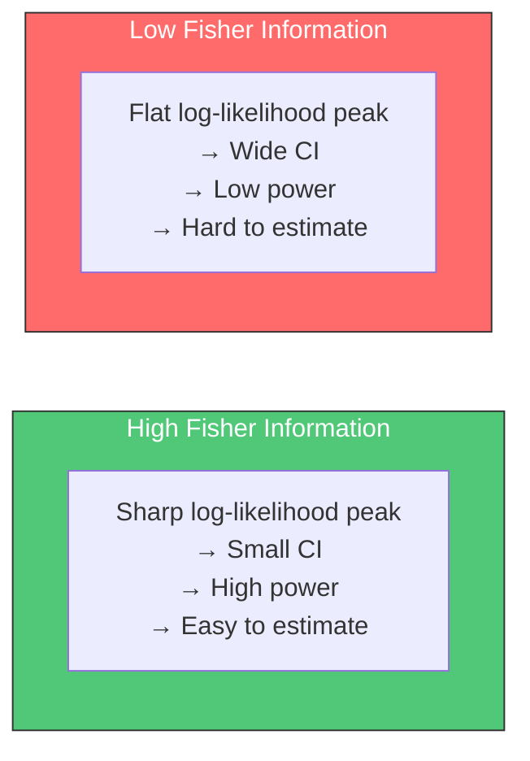
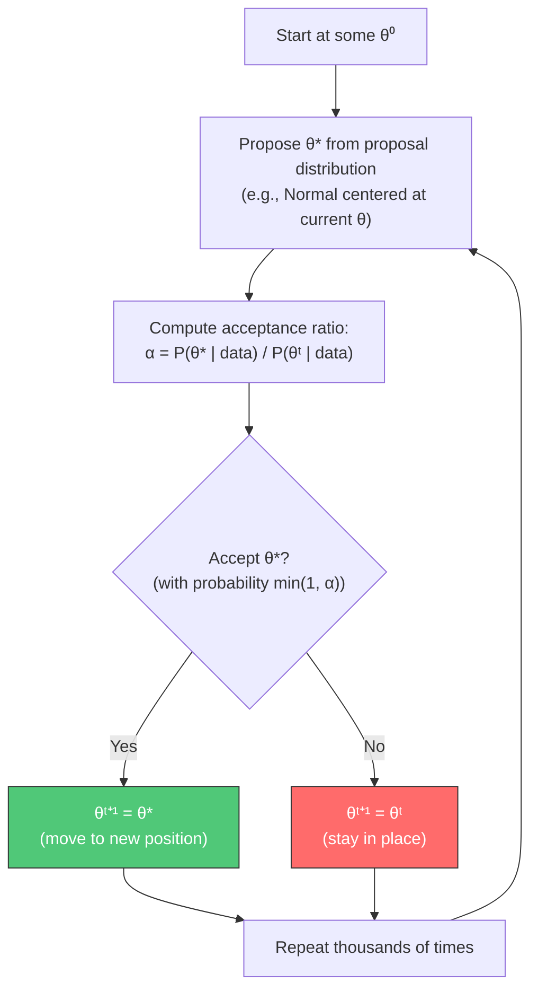
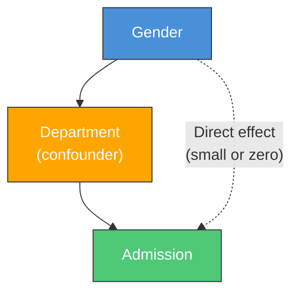
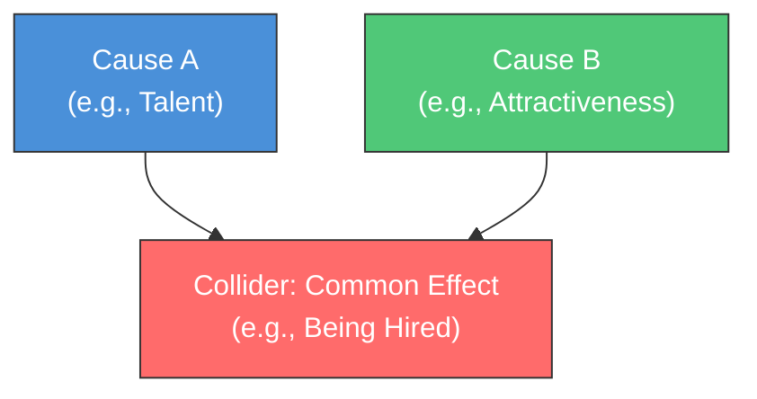
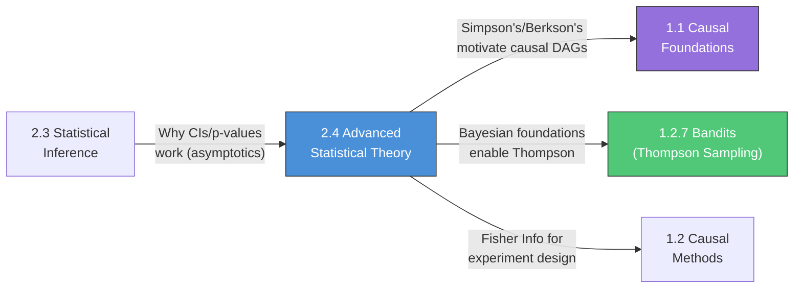

> [!IMPORTANT]
> ## How to Study This File (Read This First)
>
> **Why advanced theory matters**: Sections 2.1–2.3 gave you the tools to *do* statistics. This section explains *why those tools work* — and when they break. Consistency tells you why MLE converges. Fisher Information tells you the best possible precision for any estimator. Bayesian methods give you a principled alternative when frequentist tools feel limiting (fixed-horizon A/B tests, anyone?). And the causal paradoxes (Simpson's, Berkson's) are interview favorites because they test whether you can think critically about data rather than just run code.
>
> **The payoff**: Asymptotic theory is what makes you trust MLE in large samples. Fisher Information directly connects to confidence interval width and optimal experiment design. Bayesian foundations unlock Thompson Sampling, Bayesian A/B testing, and hierarchical models (all of which appear in Section 1.2). Simpson's and Berkson's Paradox are the *reason* causal inference (Section 1) exists — they show why naive data analysis gives wrong answers.
>
> ---
>
> ### Suggested Study Plan (4–5 hours across 2 sessions)
>
> **Session 1 (~2h): Asymptotic Theory + Estimation Theory**
> 1. Read [2.4.1 Asymptotic Theory](#241-asymptotic-theory-m) — focus on the three convergence types and consistency
> 2. Read [2.4.2 Estimation Theory Deep Dive](#242-estimation-theory-deep-dive-l-m) — Fisher Information and Cramer-Rao are the key ideas
> 3. Do the Bernoulli Fisher Information derivation by hand (Section deliverable)
>
> **Session 2 (~2–3h): Bayesian Foundations + Paradoxes**
> 1. Read [2.4.3 Bayesian Foundations](#243-bayesian-foundations-m) — focus on the credible vs confidence interval distinction and MCMC intuition
> 2. Read [2.4.4 Causal & Statistical Connections](#244-causal--statistical-connections-m) — Simpson's is [H] priority, work through the numerical example
> 3. Practice the 2-minute "Bayesian vs Frequentist" pitch (Section deliverable)
>
> ---
>
> ### Priority Triage (if time is tight)
>
> | Must master before moving on | Can skim now, revisit later |
> |---|---|
> | Consistency: what it means, why it matters | Formal convergence mode definitions |
> | Fisher Information: intuition + Bernoulli example | Cramer-Rao proof |
> | Credible vs Confidence intervals | Bayes factors |
> | Simpson's Paradox with numerical example | Gibbs sampling mechanics |
> | Bayesian vs Frequentist: when to use each | Ecological Fallacy details |
>
> ---
>
> ### Active Recall Protocol
>
> For each concept, test yourself:
> - Can I explain this to a PM in one sentence without jargon?
> - Can I give the concrete example where ignoring this leads to a wrong conclusion?
> - Can I connect it to a causal inference method I'll study in Section 1?

---
# Document Outline
- [Executive Summary](#executive-summary)
- [2.4.1 Asymptotic Theory](#241-asymptotic-theory-m)
  - [Modes of Convergence](#modes-of-convergence)
  - [Consistency of Estimators](#consistency-of-estimators)
  - [Asymptotic Normality](#asymptotic-normality)
- [2.4.2 Estimation Theory Deep Dive](#242-estimation-theory-deep-dive-l-m)
  - [Sufficient Statistics](#sufficient-statistics)
  - [Fisher Information](#fisher-information)
  - [Cramer-Rao Lower Bound](#cramer-rao-lower-bound)
- [2.4.3 Bayesian Foundations](#243-bayesian-foundations-m)
  - [Bayesian vs Frequentist](#bayesian-vs-frequentist-philosophy)
  - [Credible vs Confidence Intervals](#credible-intervals-vs-confidence-intervals)
  - [MCMC Intuition](#mcmc-intuition)
  - [Bayes Factors](#bayes-factors-for-model-comparison)
- [2.4.4 Causal & Statistical Connections](#244-causal--statistical-connections-m)
  - [Simpson's Paradox](#simpsons-paradox)
  - [Berkson's Paradox](#berksons-paradox)
  - [Ecological Fallacy](#ecological-fallacy)
- [Connections Map](#connections-map)
- [Interview Cheat Sheet](#interview-cheat-sheet)
- [Learning Objectives Checklist](#learning-objectives-checklist)

---

# Executive Summary

This guide covers Section 2.4: Advanced Statistical Theory — the deeper foundations that separate competent from distinguished candidates. The topics here are rated [M] (Medium) priority overall, but certain elements (Simpson's Paradox, Bayesian vs Frequentist, consistency) appear frequently in senior AS interviews. The emphasis is on intuition and applied reasoning rather than formal proofs: know what Fisher Information is and why it matters, not the measure-theoretic derivation.

> **Primary References**:
> - Casella, G. & Berger, R. *Statistical Inference* (2nd ed.). Chapters 7, 10, 12.
> - Gelman, A. et al. *Bayesian Data Analysis* (3rd ed.). Chapters 1–3 for Bayesian foundations.
> - Pearl, J. *The Book of Why*. Chapters 6–7 for Simpson's Paradox.

### Cross-Reference Map

| This Guide | Connection | Where to Read More |
|---|---|---|
| **2.4.1** Consistency | Why MLE works for large $n$ | Section 2.1.5 (MLE) |
| **2.4.1** Asymptotic normality | Why CIs and p-values work | Section 2.3.1, 2.3.2 |
| **2.4.2** Fisher Information | Optimal experiment design | Section 1.2.1 (A/B Testing) |
| **2.4.3** Bayesian foundations | Thompson Sampling, Bayesian A/B | Section 1.2.7 (Bandits) |
| **2.4.3** MCMC | Stan, PyMC for Bayesian models | Battle Plan Month 2 (Bayesian tooling) |
| **2.4.4** Simpson's Paradox | Why conditioning on confounders matters | Section 1.1 (Causal Foundations) |
| **2.4.4** Berkson's Paradox | Collider bias in causal DAGs | Section 1.1.2 (d-separation) |

---

# 2.4 Advanced Statistical Theory

> **Study Time**: 4–5 hours | **Priority**: [M] Medium | **Goal**: Understand the theoretical foundations deeply enough to reason about when standard methods work, when they fail, and what the alternatives are.

---

## 2.4.1 Asymptotic Theory **[M]**

> What happens when $n \to \infty$? Asymptotic theory tells you which statistical methods you can trust and why.

---

### Modes of Convergence

**Why learn this**: When someone says "MLE is consistent" or "the sample mean converges to the true mean," they're making a precise mathematical claim about a specific *type* of convergence. Confusing these types leads to wrong conclusions about estimator reliability.

**Used directly in**:
- **Justifying MLE in practice**: consistency (convergence in probability) guarantees that MLE gives you the right answer with enough data — this is why you trust `sklearn` and `statsmodels` estimates
- **Understanding CLT statements**: CLT is convergence *in distribution*, which is weaker — the sample mean doesn't become deterministic, it just has a known shape
- **Reading ML theory papers**: PAC learning bounds, generalization guarantees, and convergence proofs all use these modes — you need to parse which claim is being made

There are three main modes of convergence, each with different strength:

| Mode | Notation | Intuition | Strength |
|---|---|---|---|
| **In probability** | $X_n \xrightarrow{p} X$ | $P(\|X_n - X\| > \epsilon) \to 0$ for all $\epsilon > 0$ | Medium |
| **Almost surely** | $X_n \xrightarrow{a.s.} X$ | $P(\lim_{n\to\infty} X_n = X) = 1$ | Strongest |
| **In distribution** | $X_n \xrightarrow{d} X$ | CDFs converge: $F_{X_n}(x) \to F_X(x)$ | Weakest |

**Implications**: Almost surely $\Rightarrow$ In probability $\Rightarrow$ In distribution

> [!TIP]
> **Memorization aid — three analogies**:
>
> **In distribution** (weakest): "The histogram of $X_n$ looks more and more like the target distribution." The *shape* converges, but any individual $X_n$ could still be far off. Example: CLT — the distribution of $\bar{X}_n$ looks Normal, but any single $\bar{X}_n$ could be far from $\mu$.
>
> **In probability**: "The probability of $X_n$ being far from $X$ vanishes." Most individual $X_n$ values get close, but rare events are still possible. Example: Weak LLN — $\bar{X}_n$ is close to $\mu$ with high probability.
>
> **Almost surely** (strongest): "Eventually, $X_n$ stays close to $X$ forever, with probability 1." No backsliding. Example: Strong LLN — $\bar{X}_n$ literally converges to $\mu$.

```python
import numpy as np
import matplotlib.pyplot as plt

np.random.seed(42)
fig, axes = plt.subplots(1, 3, figsize=(18, 5))
fig.suptitle('Modes of Convergence: Visual Intuition', fontsize=14, fontweight='bold')

# --- Convergence in probability (Weak LLN) ---
N = 5000
for run in range(10):
    samples = np.random.exponential(2, N)
    running_mean = np.cumsum(samples) / np.arange(1, N + 1)
    axes[0].plot(running_mean, alpha=0.4, linewidth=0.8)
axes[0].axhline(y=2.0, color='red', linewidth=2, linestyle='--', label='True mean = 2')
axes[0].set_title('Convergence in Probability\n(Weak LLN: sample mean → μ)', fontsize=11)
axes[0].set_xlabel('n')
axes[0].set_ylabel('Running average')
axes[0].legend()
axes[0].set_xlim(0, N)

# --- Convergence in distribution (CLT) ---
from scipy import stats
sample_sizes = [5, 30, 200]
colors = ['#ff6b6b', '#ffa500', '#4a90d9']
for n_size, color in zip(sample_sizes, colors):
    means = [np.random.exponential(2, n_size).mean() for _ in range(5000)]
    axes[1].hist(means, bins=50, density=True, alpha=0.4, color=color, label=f'n={n_size}')
x = np.linspace(0, 5, 200)
axes[1].plot(x, stats.norm.pdf(x, 2, 2/np.sqrt(200)), 'k--', linewidth=2, label='N(2, σ²/200)')
axes[1].set_title('Convergence in Distribution\n(CLT: distribution of X̄ₙ → Normal)', fontsize=11)
axes[1].set_xlabel('Sample mean')
axes[1].legend(fontsize=8)

# --- Almost sure: deviations shrink permanently ---
samples = np.random.exponential(2, N)
running_mean = np.cumsum(samples) / np.arange(1, N + 1)
deviation = np.abs(running_mean - 2.0)
axes[2].semilogy(deviation, color='#4a90d9', alpha=0.6)
axes[2].set_title('Almost Sure Convergence\n(Strong LLN: |X̄ₙ - μ| → 0 permanently)', fontsize=11)
axes[2].set_xlabel('n')
axes[2].set_ylabel('|Running avg - true mean| (log scale)')

plt.tight_layout()
plt.savefig('convergence_modes.png', dpi=150, bbox_inches='tight')
plt.show()
```

---

### Consistency of Estimators

**Why learn this**: Consistency is the minimum bar for a "good" estimator — it means your estimate converges to the truth as $n$ grows. If your estimator isn't consistent, more data doesn't help. This is the theoretical reason you trust MLE, OLS, and sample means.

**Used directly in**:
- **Trusting MLE**: MLE is consistent under regularity conditions — this is why `statsmodels` and `sklearn` estimates get better with more data
- **Model misspecification awareness**: OLS is consistent for $\beta$ *only* if the model is correctly specified (linearity holds). If not, more data converges to the wrong answer — this is why model diagnostics (Section 2.3.5) matter
- **Causal inference validity**: IV estimators (Section 1.2.4) are consistent only if the instrument is valid. "More data" can't fix a bad instrument

**Definition**: An estimator $\hat{\theta}_n$ is **consistent** for $\theta$ if:

$$\hat{\theta}_n \xrightarrow{p} \theta \quad \text{as } n \to \infty$$

**Two ways to verify consistency:**

| Method | Condition | When to Use |
|---|---|---|
| **Direct**: check convergence in probability | $P(\|\hat{\theta}_n - \theta\| > \epsilon) \to 0$ | For simple estimators |
| **MSE approach** | $\text{MSE}(\hat{\theta}_n) = \text{Bias}^2 + \text{Var} \to 0$ | More practical; if both bias and variance vanish, estimator is consistent |

**Common consistent estimators:**

| Estimator | Consistent for | Conditions |
|---|---|---|
| Sample mean $\bar{X}$ | $\mu$ | Finite variance (by LLN) |
| Sample variance $s^2$ | $\sigma^2$ | Finite fourth moment |
| MLE $\hat{\theta}_{MLE}$ | $\theta$ | Regularity conditions (model is correct) |
| OLS $\hat{\beta}$ | $\beta$ | Model correctly specified, no endogeneity |

> [!WARNING]
> **Consistent ≠ Unbiased**. These are independent properties:
>
> | | Unbiased | Biased |
> |---|---|---|
> | **Consistent** | Sample mean $\bar{X}$ for $\mu$ | $\frac{1}{n}\sum(X_i - \bar{X})^2$ for $\sigma^2$ (biased but consistent) |
> | **Inconsistent** | Rare — hard to construct | OLS with endogeneity (biased AND inconsistent) |
>
> The biased variance estimator (dividing by $n$) is consistent because the bias $-\sigma^2/n \to 0$. This is why in large samples, dividing by $n$ or $n-1$ barely matters.

---

### Asymptotic Normality

**Why learn this**: Asymptotic normality is why confidence intervals and hypothesis tests work for large samples. It says that for most reasonable estimators, the sampling distribution becomes Normal as $n$ grows — so you can use z-tables and standard formulas even when the data itself is non-Normal.

**Used directly in**:
- **Large-sample CIs and p-values**: when $n$ is large, $\hat{\theta} \pm z_{\alpha/2} \cdot \text{SE}$ is valid for virtually any well-behaved estimator — this is the standard A/B testing formula
- **MLE inference**: MLE is asymptotically Normal with variance $1/I(\theta)$ — this is how `statsmodels` computes standard errors for logistic regression, Poisson regression, and other GLMs
- **Wald tests**: the test statistic $(\hat{\theta} - \theta_0)/\text{SE} \sim \mathcal{N}(0,1)$ for large $n$ — the most common test in practice

**Statement**: Under regularity conditions, the MLE satisfies:

$$\sqrt{n}(\hat{\theta}_{MLE} - \theta) \xrightarrow{d} \mathcal{N}(0, I(\theta)^{-1})$$

where $I(\theta)$ is the Fisher Information (next section).

**Practical form** (what you actually use):

$$\hat{\theta}_{MLE} \dot\sim \mathcal{N}\left(\theta, \frac{1}{nI(\theta)}\right)$$

This gives:
- **Standard error**: $\text{SE}(\hat{\theta}) \approx 1/\sqrt{nI(\hat{\theta})}$
- **95% CI**: $\hat{\theta} \pm 1.96 / \sqrt{nI(\hat{\theta})}$
- **Wald test**: $z = (\hat{\theta} - \theta_0) \cdot \sqrt{nI(\hat{\theta})}$

> [!NOTE]
> **Why this matters practically**: You never need to derive the exact sampling distribution of the MLE for each model. Asymptotic normality gives you a *universal* formula: estimate Fisher Information → plug in → get SEs, CIs, and p-values. This is exactly what `model.summary()` does in statsmodels for every GLM.

---

## 2.4.2 Estimation Theory Deep Dive **[L-M]**

> The theoretical foundations of optimal estimation. Know the concepts for interview depth; skip formal proofs.

---

### Sufficient Statistics

**Why learn this**: A sufficient statistic compresses all the data's information about a parameter into a single number. If someone gives you only the sufficient statistic (not the raw data), you haven't lost anything for estimation. This is why the sample mean is enough to estimate a Normal mean — you don't need every individual data point.

**Used directly in**:
- **Exponential family (Section 2.2.4)**: the sufficient statistic $T(x)$ in the exponential family form tells you exactly what to compute from data for MLE — e.g., for Poisson, $T(x) = \sum x_i$ (just the total count)
- **Data compression for streaming**: in production, you can maintain sufficient statistics (running sums, counts) instead of storing all raw data — and lose nothing for parameter estimation
- **Understanding MLE**: MLE for exponential family distributions reduces to "match the model's expected sufficient statistic to the observed one" — this is why MLE often has a clean closed form

**Definition**: A statistic $T(X)$ is **sufficient** for parameter $\theta$ if the conditional distribution of $X$ given $T(X)$ does not depend on $\theta$.

**Intuition**: $T(X)$ captures everything the data says about $\theta$. Once you know $T(X)$, looking at the raw data gives you no additional information about $\theta$.

| Distribution | Sufficient Statistic | What It Means |
|---|---|---|
| $\text{Bernoulli}(p)$, $n$ trials | $\sum X_i$ (total successes) | Only the count matters, not which trials succeeded |
| $\mathcal{N}(\mu, \sigma^2)$, $\sigma^2$ known | $\bar{X}$ | The sample mean contains all info about $\mu$ |
| $\mathcal{N}(\mu, \sigma^2)$, both unknown | $(\bar{X}, s^2)$ | Need both mean and variance |
| $\text{Poisson}(\lambda)$, $n$ obs | $\sum X_i$ | Total count is sufficient |
| $\text{Uniform}(0, \theta)$ | $X_{(n)} = \max(X_i)$ | Only the maximum matters! |

> [!TIP]
> **The Uniform example is the interesting one**: for $\text{Uniform}(0, \theta)$, the maximum observation alone determines everything about $\theta$. All the other data points are irrelevant (once you know the max). This surprises people because it's so different from the Normal case.

---

### Fisher Information

**Why learn this**: Fisher Information quantifies how much information a single observation carries about a parameter. High Fisher Information = the parameter is "easy to estimate" (small CIs, high power). Low Fisher Information = the parameter is "hard to estimate" (wide CIs, low power). This directly connects to experiment design: you want to design experiments that maximize Fisher Information.

**Used directly in**:
- **Optimal experiment design**: Fisher Information tells you which experimental conditions give the most precise estimates. For Bernoulli, $I(p) = 1/[p(1-p)]$ is minimized at $p = 0.5$ — meaning a 50% conversion rate is the *hardest* to estimate precisely. This is why A/B tests need the most samples when conversion rates are near 50%
- **MLE standard error computation**: `statsmodels` computes SEs via the observed Fisher Information matrix: $\text{SE}(\hat{\theta}) = \sqrt{[\mathcal{I}(\hat{\theta})]^{-1}}$ — this is what populates the SE column in `model.summary()`
- **Comparing estimators**: the Cramer-Rao bound says no unbiased estimator can have variance smaller than $1/[nI(\theta)]$. If your estimator achieves this, it's "efficient" — the best possible

**Definition**: For a random variable $X$ with density $f(x|\theta)$:

$$I(\theta) = E\left[\left(\frac{\partial}{\partial \theta} \log f(X|\theta)\right)^2\right] = -E\left[\frac{\partial^2}{\partial \theta^2} \log f(X|\theta)\right]$$

**Intuition**: Fisher Information measures the *curvature* of the log-likelihood around the true parameter. Sharp peak (high curvature) = high information = easy to estimate. Flat peak (low curvature) = low information = hard to estimate.



#### Worked Example: Fisher Information for Bernoulli

This is a Section deliverable — practice doing this on paper.

$$X \sim \text{Bernoulli}(p)$$
$$\log f(x|p) = x \log p + (1-x) \log(1-p)$$

**Score function** (first derivative):
$$\frac{\partial}{\partial p} \log f(x|p) = \frac{x}{p} - \frac{1-x}{1-p}$$

**Fisher Information** (negative expected second derivative):
$$\frac{\partial^2}{\partial p^2} \log f(x|p) = -\frac{x}{p^2} - \frac{1-x}{(1-p)^2}$$

$$I(p) = -E\left[-\frac{X}{p^2} - \frac{1-X}{(1-p)^2}\right] = \frac{1}{p} \cdot \frac{1}{1} + \frac{1}{(1-p)} \cdot \frac{1}{1}$$

Wait — let's be careful. $E[X] = p$ and $E[1-X] = 1-p$:

$$I(p) = \frac{E[X]}{p^2} + \frac{E[1-X]}{(1-p)^2} = \frac{p}{p^2} + \frac{1-p}{(1-p)^2} = \frac{1}{p} + \frac{1}{1-p} = \frac{1}{p(1-p)}$$

**Result**: $I(p) = \frac{1}{p(1-p)}$

```python
import numpy as np
import matplotlib.pyplot as plt

p = np.linspace(0.01, 0.99, 200)
fisher_info = 1 / (p * (1 - p))

fig, (ax1, ax2) = plt.subplots(1, 2, figsize=(14, 5))
fig.suptitle('Fisher Information for Bernoulli(p)', fontsize=14, fontweight='bold')

# Fisher Information
ax1.plot(p, fisher_info, color='#4a90d9', linewidth=2.5)
ax1.set_xlabel('p (success probability)')
ax1.set_ylabel('I(p) = 1/[p(1-p)]')
ax1.set_title('Fisher Information')
ax1.axvline(x=0.5, color='red', linestyle='--', alpha=0.6, label='p=0.5 (minimum info)')
ax1.legend()

# Corresponding SE for sample proportion with n=1000
n = 1000
se = np.sqrt(p * (1 - p) / n)
ax2.plot(p, se, color='#50c878', linewidth=2.5)
ax2.set_xlabel('p (success probability)')
ax2.set_ylabel(f'SE(p̂) = √[p(1-p)/{n}]')
ax2.set_title(f'Standard Error of p̂ (n={n})')
ax2.axvline(x=0.5, color='red', linestyle='--', alpha=0.6, label='p=0.5 (maximum SE)')
ax2.legend()

plt.tight_layout()
plt.savefig('fisher_information_bernoulli.png', dpi=150, bbox_inches='tight')
plt.show()
```

> [!IMPORTANT]
> **The punchline**: $I(p)$ is *lowest* at $p = 0.5$ — meaning 50/50 outcomes are hardest to estimate. Conversely, $\text{SE}(\hat{p}) = \sqrt{p(1-p)/n}$ is *highest* at $p = 0.5$. This is why A/B tests for metrics near 50% (like click-through on a balanced test) need more samples than tests for rare events (like 1% conversion).

#### Fisher Information for Common Distributions

| Distribution | $I(\theta)$ | Implication |
|---|---|---|
| Bernoulli$(p)$ | $\frac{1}{p(1-p)}$ | Hardest to estimate near $p = 0.5$ |
| Poisson$(\lambda)$ | $\frac{1}{\lambda}$ | Larger rates are easier to estimate |
| Normal$(\mu, \sigma^2)$ for $\mu$ | $\frac{1}{\sigma^2}$ | More noise = harder to estimate mean |
| Normal$(\mu, \sigma^2)$ for $\sigma^2$ | $\frac{1}{2\sigma^4}$ | Variance of variance |
| Exponential$(\lambda)$ | $\frac{1}{\lambda^2}$ | Higher rate = harder (more data near 0) |

---

### Cramer-Rao Lower Bound

**Why learn this**: The Cramer-Rao bound tells you the *best possible* precision for any unbiased estimator. If your estimator achieves this bound, you know you can't do better. If it doesn't, there might be room for improvement. It's also the theoretical justification for MLE's optimality.

**Used directly in**:
- **Evaluating estimator efficiency**: "Is my custom estimator any good?" — compare its variance to the Cramer-Rao bound. If close, you're near-optimal. If far, a better estimator exists
- **Lower bound on CI width**: the CRLB directly gives the minimum possible CI width for any unbiased procedure: $\text{CI width} \geq 2z_{\alpha/2}/\sqrt{nI(\theta)}$
- **Understanding MLE optimality**: MLE achieves the CRLB asymptotically — this is why MLE is the default choice and why `statsmodels` uses it

**Statement**: For any unbiased estimator $\hat{\theta}$:

$$\text{Var}(\hat{\theta}) \geq \frac{1}{nI(\theta)}$$

**Key consequences:**
- An estimator that achieves equality is called **efficient**
- MLE is asymptotically efficient (achieves the CRLB as $n \to \infty$)
- The bound gets tighter with more data ($\propto 1/n$)

> [!NOTE]
> **Practical interpretation**: With $n$ i.i.d. observations from $\text{Bernoulli}(p)$:
> - CRLB: $\text{Var}(\hat{p}) \geq p(1-p)/n$
> - Sample proportion: $\text{Var}(\hat{p}) = p(1-p)/n$
>
> The sample proportion *achieves* the bound exactly — it's efficient! No other unbiased estimator of $p$ can have smaller variance.

---

## 2.4.3 Bayesian Foundations **[M]**

> A principled alternative to frequentist inference. Increasingly used in industry for A/B testing, personalization, and decision-making under uncertainty.

---

### Bayesian vs Frequentist Philosophy

**Why learn this**: "Are you Bayesian or frequentist?" is a common interview opener. The right answer isn't to pick a side — it's to know when each is appropriate. Companies like Netflix and Spotify use Bayesian A/B testing; Amazon and Meta mostly use frequentist. Understanding both frameworks and their tradeoffs is what makes you versatile.

**Used directly in**:
- **Choosing your A/B testing framework**: Bayesian A/B (Thompson Sampling) allows continuous monitoring without alpha inflation; frequentist (fixed-horizon) has simpler guarantees. You need to justify which to use based on business context
- **Prior information integration**: Bayesian methods let you incorporate historical data (past experiments, domain knowledge) into current analyses — powerful when data is scarce
- **Communicating uncertainty to stakeholders**: "There's an 89% probability the treatment is better" (Bayesian) is more intuitive to PMs than "p = 0.03" (frequentist)

| Aspect | Frequentist | Bayesian |
|---|---|---|
| **Probability means** | Long-run frequency | Degree of belief |
| **Parameters are** | Fixed but unknown | Random variables with distributions |
| **Data is** | Random (varies across experiments) | Fixed (we observed what we observed) |
| **Inference tool** | p-values, CIs | Posterior distributions, credible intervals |
| **Prior information** | Not formally used (enters via design) | Formally encoded as prior distribution |
| **Multiple comparisons** | Need correction (Bonferroni, BH) | Handled naturally via hierarchical models |
| **Sample size** | Must be fixed in advance | Can monitor continuously |
| **Computational cost** | Usually analytical | Often requires MCMC (but getting faster) |

**When to use each:**

| Use Frequentist When | Use Bayesian When |
|---|---|
| Regulatory / confirmatory (need Type I error control) | Exploratory / decision-making |
| Large $n$, simple metrics | Small $n$, need prior information |
| Simple, pre-registered hypothesis | Complex, hierarchical structure |
| Computational efficiency matters | Interpretable uncertainty matters |
| Industry standard at your company | Continuous monitoring needed |

> [!TIP]
> **The pragmatic answer** (good for interviews): "I'm a pragmatist — I use the tool that fits the problem. For pre-registered confirmatory experiments with clear Type I error requirements, frequentist. For decision-making under uncertainty with continuous monitoring, Bayesian. In practice, they often give similar answers for large $n$."

---

### Credible Intervals vs Confidence Intervals

**Why learn this**: This is one of the most subtle and frequently tested distinctions in AS interviews. The difference reveals whether you truly understand the philosophical underpinnings of statistical inference or just memorize procedures.

**Used directly in**:
- **Bayesian A/B test reporting**: "There is a 95% probability the true lift is between 1.2% and 3.4%" — this is a credible interval, and it's what PMs actually want to hear
- **PyMC / Stan output interpretation**: Bayesian modeling tools give you posterior distributions and credible intervals (often called HDI — Highest Density Interval), not p-values
- **Decision-making thresholds**: "What's the probability the effect is positive?" is directly answerable with a posterior distribution — not with a frequentist CI

| | Confidence Interval (Frequentist) | Credible Interval (Bayesian) |
|---|---|---|
| **Statement** | 95% of such intervals contain $\theta$ | 95% probability $\theta$ is in this interval |
| **$\theta$ is** | Fixed (the interval is random) | Random (the interval is fixed given data) |
| **Requires** | Nothing (just data + procedure) | A prior distribution |
| **Interpretation** | Property of the procedure | Property of the parameter |
| **What PMs want** | ❌ (hard to explain) | ✅ (intuitive) |

<details>
<summary><strong>Worked Example: Bayesian A/B Test</strong></summary>

```python
import numpy as np
from scipy import stats

# Observed data
n_control, k_control = 1000, 50     # 50 conversions out of 1000
n_treat, k_treat     = 1000, 65     # 65 conversions out of 1000

# Bayesian: Beta-Binomial conjugacy
# Prior: Beta(1, 1) = Uniform (uninformative)
alpha_prior, beta_prior = 1, 1

# Posterior: Beta(alpha + successes, beta + failures)
post_control = stats.beta(alpha_prior + k_control, beta_prior + n_control - k_control)
post_treat   = stats.beta(alpha_prior + k_treat,   beta_prior + n_treat - k_treat)

# 95% Credible Intervals
ci_control = post_control.interval(0.95)
ci_treat   = post_treat.interval(0.95)

print(f"Control posterior: Beta({alpha_prior + k_control}, {beta_prior + n_control - k_control})")
print(f"  95% Credible Interval: ({ci_control[0]:.4f}, {ci_control[1]:.4f})")
print(f"Treatment posterior: Beta({alpha_prior + k_treat}, {beta_prior + n_treat - k_treat})")
print(f"  95% Credible Interval: ({ci_treat[0]:.4f}, {ci_treat[1]:.4f})")

# P(treatment > control) — the most useful Bayesian quantity
n_samples = 100000
samples_control = post_control.rvs(n_samples)
samples_treat   = post_treat.rvs(n_samples)
prob_treat_wins = np.mean(samples_treat > samples_control)
print(f"\nP(treatment > control) = {prob_treat_wins:.4f}")
# This is what PMs actually want: "What's the chance treatment is better?"

# Expected lift distribution
lift_samples = (samples_treat - samples_control) / samples_control
print(f"Expected relative lift: {np.mean(lift_samples):.2%}")
print(f"95% CI on lift: ({np.percentile(lift_samples, 2.5):.2%}, {np.percentile(lift_samples, 97.5):.2%})")
```

</details>

---

### MCMC Intuition

**Why learn this**: Many Bayesian models have posteriors that can't be computed analytically (no conjugacy). MCMC lets you *sample* from the posterior even when you can't write it down. If you'll use Stan, PyMC, or any Bayesian modeling tool, you need to understand what MCMC is doing under the hood — at least enough to diagnose when it fails.

**Used directly in**:
- **PyMC / Stan modeling**: `pm.sample(1000)` in PyMC runs MCMC (specifically NUTS, a variant of Hamiltonian Monte Carlo). You need to check convergence diagnostics (R-hat, ESS) or your results are meaningless
- **Bayesian causal inference**: Bayesian structural time series (CausalImpact), Bayesian hierarchical models for heterogeneous treatment effects — all use MCMC
- **Diagnosing convergence issues**: trace plots, R-hat > 1.01, low effective sample size — knowing what these mean is essential for any Bayesian analysis

**Core idea**: Generate a sequence of samples $\theta^{(1)}, \theta^{(2)}, \ldots, \theta^{(T)}$ that (after a "burn-in" period) are distributed according to the posterior $P(\theta | \text{data})$.

#### Metropolis-Hastings (Conceptual)



**Intuition**: MCMC is like a random walk through parameter space that spends more time in regions of high posterior probability. After enough steps, the fraction of time spent in each region matches the posterior distribution.

#### Gibbs Sampling (Conceptual)

A special case of Metropolis-Hastings for multivariate problems:
- Instead of proposing all parameters at once, update one parameter at a time
- Each parameter is sampled from its *conditional* posterior (given all others)
- Acceptance probability is always 1 (if you can compute the conditionals)

**When Gibbs is used**: conjugate models (like LDA for topic modeling), hierarchical Bayesian models.

#### MCMC Diagnostics (What to Check)

| Diagnostic | What It Tells You | Healthy Values |
|---|---|---|
| **Trace plot** | Did the chain explore the space? | Looks like "fuzzy caterpillar," no trends |
| **R-hat** ($\hat{R}$) | Do multiple chains agree? | $\hat{R} < 1.01$ |
| **Effective Sample Size (ESS)** | How many independent samples? | ESS > 400 per chain |
| **Divergences** | Did the sampler get stuck? | 0 divergences |

> [!WARNING]
> **If R-hat > 1.01 or ESS is low, your results are unreliable.** Common fixes: increase warm-up, reparameterize the model, use a better prior, or increase `target_accept` in NUTS.

---

### Bayes Factors for Model Comparison

**Why learn this**: Bayes factors are the Bayesian alternative to p-values for comparing models. While not commonly used in industry A/B testing, they appear in research settings and some interview questions about model selection.

**Used directly in**:
- **Bayesian model selection**: "Which model better explains the data?" — Bayes factor compares two models directly, accounting for model complexity
- **Evidence for the null**: unlike p-values (which can only reject $H_0$, never confirm it), Bayes factors can provide evidence *in favor* of $H_0$ — useful when you want to conclude "there is no effect"

**Definition**: The Bayes factor comparing model $M_1$ to $M_0$ is:

$$BF_{10} = \frac{P(\text{data} | M_1)}{P(\text{data} | M_0)} = \frac{\int P(\text{data} | \theta_1, M_1) P(\theta_1 | M_1) d\theta_1}{\int P(\text{data} | \theta_0, M_0) P(\theta_0 | M_0) d\theta_0}$$

**Interpretation scale** (Kass & Raftery, 1995):

| $BF_{10}$ | Evidence for $M_1$ |
|---|---|
| 1–3 | Barely worth mentioning |
| 3–20 | Positive |
| 20–150 | Strong |
| > 150 | Very strong |
| < 1 | Evidence for $M_0$ (null) |

> [!TIP]
> **Key advantage over p-values**: a Bayes factor of 0.1 means the data are 10x more likely under $H_0$ than $H_1$ — genuine evidence that there is *no* effect. A p-value of 0.5, by contrast, only tells you the data is compatible with $H_0$; it doesn't quantify evidence *for* $H_0$.

---

## 2.4.4 Causal & Statistical Connections **[M]**

> These paradoxes are *the reason* causal inference exists. They show that naive statistical analysis — even with perfect data — can give catastrophically wrong conclusions.

---

### Simpson's Paradox

**Why learn this**: Simpson's Paradox is the single most powerful motivator for causal inference. It shows that a trend in every subgroup can *reverse* when groups are combined. If you don't understand this, you will make wrong causal claims from observational data. It's also one of the most commonly asked paradoxes in AS interviews at Amazon, Google, and Meta.

**Used directly in**:
- **Deciding whether to condition on a variable**: Simpson's Paradox shows that conditioning can either reveal or hide the true effect — the right choice depends on the causal DAG (Section 1.1.2), not the statistical association
- **Detecting confounding in observational studies**: when aggregate and subgroup analyses disagree, Simpson's is the likely culprit — and it points to a confounder you need to adjust for
- **Challenging stakeholder conclusions**: "Our overall conversion is down, but it's up in every segment" — this sounds impossible but is exactly Simpson's Paradox. Knowing the explanation makes you the smartest person in the room

#### The Classic Example: UC Berkeley Admissions

In 1973, UC Berkeley's overall admission rate appeared to show gender discrimination against women:

| | Applicants | Admitted | Admit Rate |
|---|---|---|---|
| **Men** | 8,442 | 3,738 | **44.3%** |
| **Women** | 4,321 | 1,494 | **34.6%** |

But when broken down by department:

| Department | Men Applied | Men Admit | Women Applied | Women Admit |
|---|---|---|---|---|
| A | 825 | 62% | 108 | **82%** |
| B | 560 | 63% | 25 | **68%** |
| C | 325 | 37% | 593 | **34%** |
| D | 417 | 33% | 375 | **35%** |
| E | 191 | 28% | 393 | **24%** |
| F | 373 | 6% | 341 | **7%** |

> Women had *higher* admission rates in most departments! The paradox: women disproportionately applied to competitive departments (C, E, F) with low admission rates. **Department choice** was the confounder.



#### Numerical Example (Work Through This)

```python
import numpy as np
import pandas as pd

# Simulated treatment-outcome data with a confounder
np.random.seed(42)

# Confounder: Age group (young vs old)
# Young patients: more likely to get treatment, higher recovery rate
# Old patients: less likely to get treatment, lower recovery rate

data = {
    'Group': ['Young'] * 200 + ['Old'] * 200,
    'Treatment': (['Yes'] * 160 + ['No'] * 40 +   # Young: 80% get treatment
                  ['Yes'] * 40  + ['No'] * 160),    # Old: 20% get treatment
    'Recovered': (
        list(np.random.binomial(1, 0.80, 160)) +  # Young + Treatment: 80% recovery
        list(np.random.binomial(1, 0.85, 40))  +  # Young + No Treatment: 85%!
        list(np.random.binomial(1, 0.40, 40))  +  # Old + Treatment: 40%
        list(np.random.binomial(1, 0.45, 160))    # Old + No Treatment: 45%!
    )
}
df = pd.DataFrame(data)

# Aggregate (Simpson's direction)
agg = df.groupby('Treatment')['Recovered'].mean()
print("=== AGGREGATE (misleading) ===")
print(f"Treatment:   {agg.get('Yes', 0):.1%}")
print(f"No Treatment:{agg.get('No', 0):.1%}")
print("→ Treatment appears BETTER!\n")

# Stratified (true effect)
for group in ['Young', 'Old']:
    sub = df[df['Group'] == group].groupby('Treatment')['Recovered'].mean()
    print(f"=== {group} ===")
    print(f"  Treatment:    {sub.get('Yes', 0):.1%}")
    print(f"  No Treatment: {sub.get('No', 0):.1%}")
    print(f"  → Treatment is WORSE in this subgroup!")

print("\n>>> Simpson's Paradox: Treatment looks good overall,")
print("    but is harmful in EVERY subgroup!")
print(">>> The confounder (age) drives both treatment assignment AND outcome.")
```

> [!CAUTION]
> **The critical question**: "Should I condition on the variable or not?" The answer is NOT always "yes." If the variable is a **confounder** (common cause of treatment and outcome) → condition. If it's a **mediator** (on the causal path) → do NOT condition. If it's a **collider** (common effect) → do NOT condition (see Berkson's below). The **causal DAG** (Section 1.1.2) is what tells you which case you're in.

---

### Berkson's Paradox

**Why learn this**: Berkson's Paradox is collider bias — conditioning on a common *effect* creates a spurious association between its causes. It's subtler than Simpson's and produces the opposite error: it makes unrelated things look related. It shows up everywhere in observational data and selection-based studies.

**Used directly in**:
- **Understanding selection bias**: any time your analysis conditions on a variable that is *caused by* both treatment and outcome, you get Berkson's bias. Example: studying only hospitalized patients creates a spurious negative correlation between diseases
- **Causal DAG reasoning (Section 1.1.2)**: Berkson's is the practical consequence of conditioning on a collider in a DAG — this is tested directly in d-separation questions
- **Talent evaluation paradox**: "Why does it seem like attractive people are less intelligent?" — if you only observe people who are hired (selected for being attractive OR intelligent), you create Berkson's bias

#### The Collider Structure



**Mechanism**: A and B are independent. But once you *condition on C* (e.g., restrict to hired employees), knowing A tells you about B. If someone was hired despite low talent (A is low), they must be attractive (B is high). This creates a spurious negative correlation between A and B *within the conditioned group*.

<details>
<summary><strong>Worked Example: The Hollywood Paradox</strong></summary>

```python
import numpy as np
import pandas as pd

np.random.seed(42)
n = 10000

# Talent and attractiveness are INDEPENDENT
talent = np.random.normal(0, 1, n)
attractiveness = np.random.normal(0, 1, n)

# "Famous" if either talent or attractiveness is high enough
# (selection based on sum → collider)
fame_score = talent + attractiveness + np.random.normal(0, 0.5, n)
famous = fame_score > np.percentile(fame_score, 90)  # Top 10%

# In the full population: no correlation
full_corr = np.corrcoef(talent, attractiveness)[0, 1]
print(f"Correlation in full population: {full_corr:.3f}")  # ≈ 0

# Among famous people: spurious negative correlation!
famous_corr = np.corrcoef(talent[famous], attractiveness[famous])[0, 1]
print(f"Correlation among famous people: {famous_corr:.3f}")  # ≈ -0.4

# This is Berkson's paradox: conditioning on the collider (fame)
# creates a spurious negative association between its causes
```

</details>

> [!IMPORTANT]
> **Simpson's vs Berkson's — know the difference:**
>
> | | Simpson's Paradox | Berkson's Paradox |
> |---|---|---|
> | **Structure** | Confounding (common cause) | Collider (common effect) |
> | **Problem** | Ignoring the confounder reverses the effect | Conditioning on the collider creates a spurious effect |
> | **Fix** | Condition on the confounder | Do NOT condition on the collider |
> | **DAG pattern** | $X \leftarrow Z \rightarrow Y$ | $X \rightarrow Z \leftarrow Y$ |
> | **Common in** | Observational studies without adjustment | Selection-based samples |

---

### Ecological Fallacy

**Why learn this**: The ecological fallacy is the mistake of drawing individual-level conclusions from group-level data. It's a common pitfall in data analysis, especially when working with aggregated metrics.

**Used directly in**:
- **Interpreting aggregated data**: "States with higher ice cream sales have higher crime rates" → concluding that ice cream causes crime. The ecological correlation exists because both are driven by temperature, but individual ice-cream-eaters aren't criminals
- **A/B test segment analysis**: group-level effects may not hold at the individual level — a treatment that helps "young users on average" might hurt specific subgroups within young users
- **Geographic / demographic analysis**: correlations between county-level features (income, education, health outcomes) do NOT imply the same correlations hold for individuals

**Classic example**: In the 1950s, Robinson showed that states with higher literacy rates had higher proportions of immigrants — but *individual* immigrants had lower literacy. The state-level correlation reflected that immigrants settled in states with better schools (more literate native populations).

> [!TIP]
> **The fix**: always check whether your data is aggregated. If it is, be cautious about individual-level claims. Ideally, analyze at the individual level. If you can't, explicitly acknowledge the ecological limitation in your conclusions.

---

## Connections Map



| This Section | Connects To | How |
|---|---|---|
| Consistency, asymptotics | 2.3 (Inference) | Why CIs and p-values work for large $n$ |
| Fisher Information | 1.2.1 (A/B Testing) | Optimal experiment design, SE computation |
| Bayesian foundations | 1.2.7 (Bandits) | Thompson Sampling requires posterior distributions |
| MCMC | Battle Plan Bayesian week | Stan, PyMC for complex models |
| Simpson's Paradox | 1.1 (Causal Foundations) | Motivates DAGs and the backdoor criterion |
| Berkson's Paradox | 1.1.2 (d-separation) | Collider conditioning in DAGs |

---

## Interview Cheat Sheet

### Asymptotic Theory
| Question | Answer |
|---|---|
| What does "consistent" mean? | Estimator converges to the true value as $n \to \infty$. MLE is consistent under regularity conditions. |
| Consistent vs unbiased? | Independent properties. The biased variance estimator ($\div n$) is consistent. OLS with endogeneity is unbiased-looking but inconsistent. |
| Why does MLE work? | Consistent + asymptotically Normal + efficient (achieves Cramer-Rao bound) for large $n$ |

### Estimation Theory
| Question | Answer |
|---|---|
| What is Fisher Information? | Curvature of the log-likelihood; measures how much one observation tells you about $\theta$. Higher = easier to estimate. |
| Fisher Info for Bernoulli? | $1/[p(1-p)]$ — lowest at $p=0.5$ → hardest to estimate → A/B tests need more samples near 50% |
| What is Cramer-Rao? | No unbiased estimator can have variance below $1/[nI(\theta)]$. MLE achieves this asymptotically. |

### Bayesian Foundations
| Question | Answer |
|---|---|
| Bayesian vs Frequentist? | Frequentist: probability = long-run frequency, parameters fixed. Bayesian: probability = belief, parameters have distributions. Use frequentist for confirmatory, Bayesian for decision-making. |
| Credible vs Confidence interval? | Credible: 95% probability $\theta$ is in this interval (requires prior). Confidence: 95% of such intervals contain $\theta$ (frequentist procedure property). |
| What is MCMC? | Random walk through parameter space that samples from the posterior. Check R-hat < 1.01 and ESS > 400. |

### Paradoxes
| Question | Answer |
|---|---|
| Explain Simpson's Paradox | A trend in every subgroup reverses when combined — caused by confounding. Fix: condition on the confounder (if it IS a confounder, not a collider or mediator). |
| Explain Berkson's Paradox | Conditioning on a common effect (collider) creates spurious association between its causes. Fix: don't condition on colliders. |
| How do you know whether to condition? | Draw the causal DAG (Section 1.1.2). Condition on confounders (backdoor path). Don't condition on colliders or mediators. |

---

## Learning Objectives Checklist

### 2.4.1 Asymptotic Theory
- [ ] Name three modes of convergence and their relative strength
- [ ] Define consistency and give two ways to verify it
- [ ] Explain why MLE is "reliable" (consistent + asymptotically Normal + efficient)
- [ ] State the asymptotic distribution of MLE: $\sqrt{n}(\hat{\theta} - \theta) \to \mathcal{N}(0, I(\theta)^{-1})$

### 2.4.2 Estimation Theory Deep Dive
- [ ] Explain sufficient statistics intuitively (compress data without losing info)
- [ ] Derive Fisher Information for Bernoulli (interview deliverable)
- [ ] State the Cramer-Rao Lower Bound and explain what it implies for MLE
- [ ] Know Fisher Information for Normal ($1/\sigma^2$ for $\mu$) and Poisson ($1/\lambda$)

### 2.4.3 Bayesian Foundations
- [ ] Articulate Bayesian vs Frequentist tradeoffs in 2 minutes (interview deliverable)
- [ ] Explain the difference between credible and confidence intervals
- [ ] Describe MCMC at a high level: what it does, when it's needed, what to check
- [ ] Implement a Bayesian A/B test with Beta-Binomial conjugacy
- [ ] Know when to prefer Bayesian over frequentist (and vice versa)

### 2.4.4 Causal & Statistical Connections
- [ ] Explain Simpson's Paradox with a numerical example (interview deliverable)
- [ ] Explain Berkson's Paradox with the collider DAG
- [ ] Distinguish Simpson's (confounder) vs Berkson's (collider): structure, fix
- [ ] Explain the ecological fallacy and when it arises
- [ ] Connect Simpson's to the backdoor criterion and causal DAGs
