---
# Document Outline
- [Executive Summary](#executive-summary)
- [4.1.1 Time Series Components](#411-time-series-components)
  - [The Four Components](#the-four-components)
  - [Decomposition Methods](#decomposition-methods)
  - [STL Decomposition](#stl-decomposition)
- [4.1.2 Stationarity](#412-stationarity)
  - [Spurious Regression Warning](#the-spurious-regression-problem) *(NEW)*
  - [Testing for Stationarity](#testing-for-stationarity)
  - [Achieving Stationarity](#achieving-stationarity)
  - [Over-Differencing](#over-differencing-how-to-detect) *(NEW)*
- [4.1.3 Autocorrelation & White Noise](#413-autocorrelation--white-noise)
  - [Autocovariance vs Autocorrelation](#autocovariance-vs-autocorrelation) *(NEW)*
  - [Lag Operator](#lag-operator-backshift-operator) *(NEW)*
  - [ACF and PACF](#acf-and-pacf)
  - [Significance Bounds](#significance-bounds-in-acfpacf-plots) *(NEW)*
  - [Random Walk](#random-walk-vs-stationary)
- [Connections Map](#connections-map)
- [Interview Cheat Sheet](#interview-cheat-sheet)
- [Learning Objectives Checklist](#learning-objectives-checklist)

# Executive Summary

> [!CAUTION]
> **Mermaid Chart Syntax**: When editing diagrams in this file, you must escape `<` and `>` characters in node labels (use `&lt;` and `&gt;`). Raw brackets will cause rendering failures.

This guide covers Time Series Fundamentals: understanding the four components (trend, seasonality, cycles, noise), decomposition methods (additive vs multiplicative, STL), stationarity (definition, testing, transformations, over-differencing detection), autocorrelation (autocovariance, lag operator notation, ACF/PACF with significance bounds, white noise, random walks, Ljung-Box test). These are foundational concepts that appear in nearly every forecasting interview.
---

# 4.1 Time Series Fundamentals

> **Study Time**: 8 hours | **Priority**: [C] Critical | **Goal**: Master completely, able to teach others

---

## 4.1.1 Time Series Components

### The Four Components

Every time series can be thought of as a combination of four components:

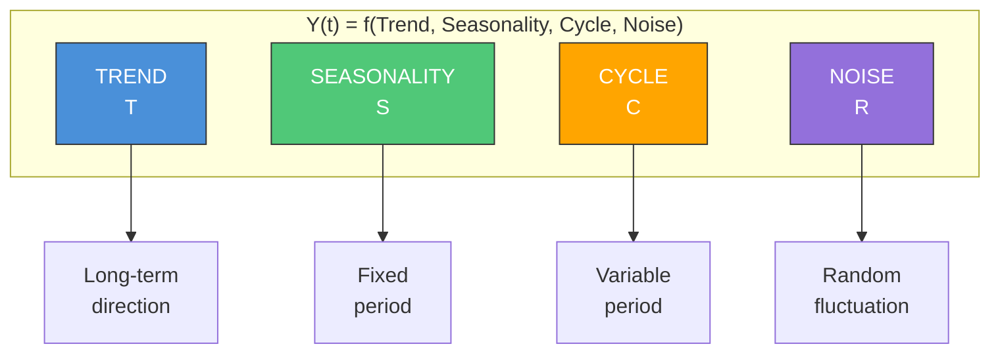

#### Component Comparison Table

| Component | Period | Predictable? | Example |
|-----------|--------|--------------|---------|
| **Trend** | Long-term | Partially | GDP growth over decades |
| **Seasonality** | Fixed (known) | Yes | Holiday sales every December |
| **Cycle** | Variable (unknown) | No | Business cycle recessions |
| **Noise** | None | No | Random daily fluctuations |

#### Interview Priority: Components

| What to Know | Priority | Why |
|--------------|----------|-----|
| Name and define the 4 components | **Must know** | Basic TS vocabulary |
| Seasonality = fixed period, Cycle = variable period | **Must know** | Common trick question |
| Additive vs Multiplicative: when to use each | **Must know** | Decision you'll make in every TS problem |
| Multiplicative when variance scales with level | **Must know** | The key diagnostic rule |
| Log transform converts multiplicative to additive | **Should know** | Practical transformation tip |

---

#### 1. Trend (T)

**Definition**: The long-term direction or movement in the data.

**Characteristics**:
- Persists over long periods
- Can be upward, downward, or flat
- May change direction (changepoints)

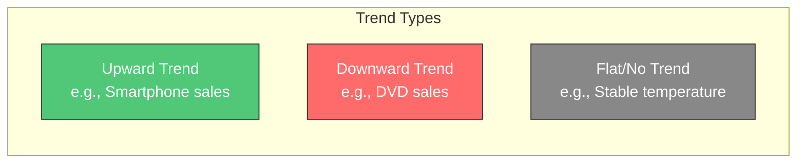

**Examples by Domain**:
| Domain | Trend Example |
|--------|---------------|
| Retail | Increasing smartphone sales over 10 years |
| Climate | Rising global temperatures |
| Economics | Long-term GDP growth |
| Technology | Decreasing cost of computing power |

---

#### 2. Seasonality (S)

**Definition**: Regular, predictable patterns that repeat at **fixed intervals**.

**Key Characteristic**: The period length is KNOWN and CONSTANT.

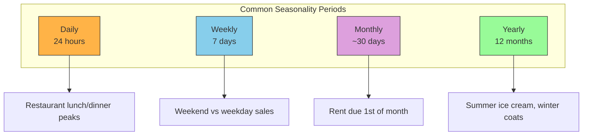

> [!IMPORTANT]
> **Seasonality vs Cycle**: Seasonality has a FIXED period (e.g., always 12 months). Cycles have VARIABLE length (e.g., 3-10 years).

---

#### 3. Cycles (C)

**Definition**: Rises and falls that are NOT of fixed period.

**Characteristics**:
- Variable length (unpredictable when next peak/trough occurs)
- Often longer than a year
- Influenced by external factors (economic conditions, elections)

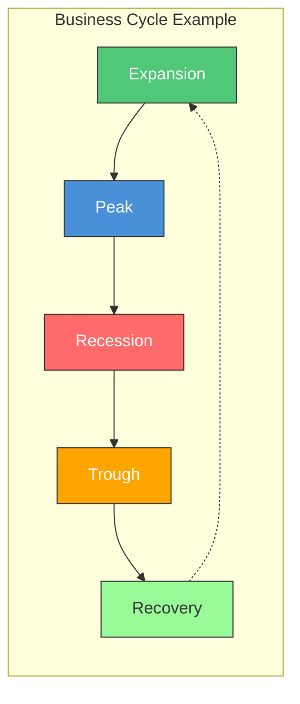

**Examples**:
| Domain | Cycle Example |
|--------|---------------|
| Economics | Business cycles (3-10 years) |
| Real Estate | Housing market booms and busts |
| Fashion | Trend cycles (what's "in" vs "out") |

---

#### 4. Noise / Residual (R)

**Definition**: Random, unpredictable variation after removing trend, seasonality, and cycles.

**Characteristics**:
- No pattern
- Cannot be forecasted
- Ideally: mean = 0, constant variance (homoscedastic)

**What causes noise**:
- Measurement error
- Random external events
- Natural variability

---

### How Components Combine

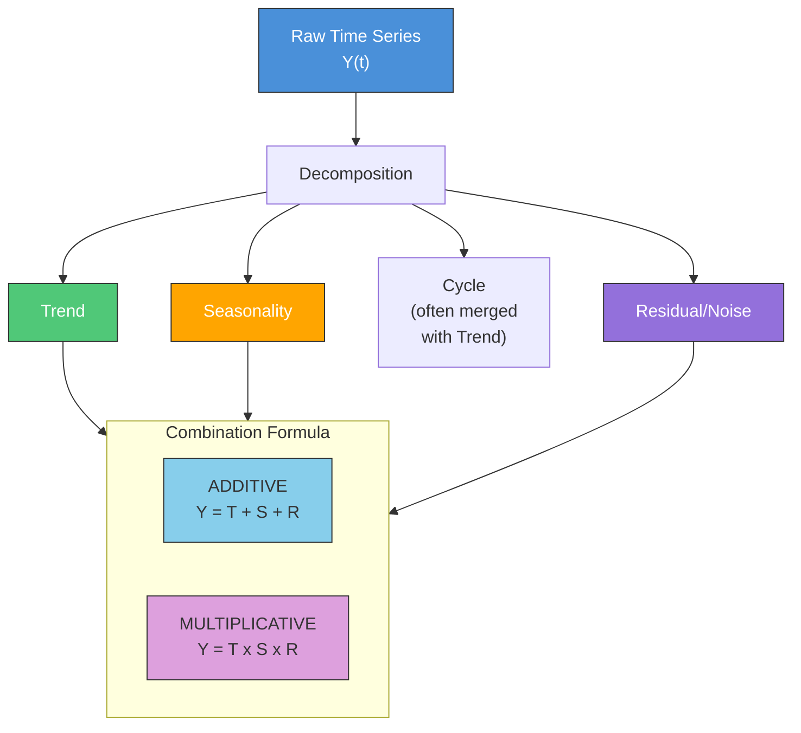

---

### Decomposition Methods

**Purpose**: Separate a time series into its components to understand the underlying patterns.

#### Additive vs Multiplicative Decision

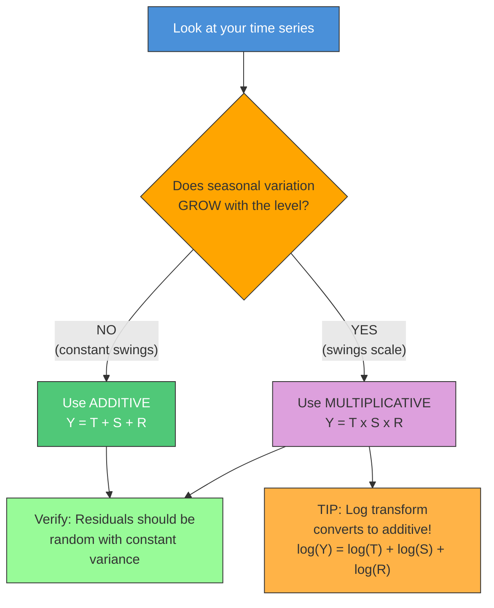

#### Quick Reference

| Aspect | Additive | Multiplicative |
|--------|----------|----------------|
| Formula | Y = T + S + R | Y = T × S × R |
| Seasonal variation | Constant | Scales with level |
| Example | Temperature | Retail sales |
| When to use | Stable baseline | Growing/shrinking baseline |

> [!TIP]
> **Interview Trick**: If unsure, try both and compare residuals. Good residuals should be random (no pattern) and homoscedastic (constant variance).

---

### STL Decomposition

**STL** = **S**easonal and **T**rend decomposition using **L**oess

#### Why STL is Preferred

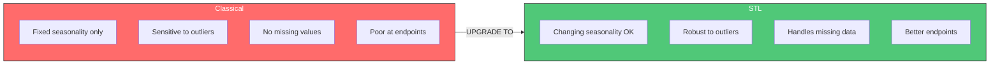

| Feature | Classical | STL |
|---------|-----------|-----|
| Handles outliers | Poorly | Robustly |
| Seasonality | Must be constant | Can change over time |
| Missing values | Cannot handle | Handles gracefully |
| End effects | Problematic | Better handling |

**Python Implementation**:
```python
from statsmodels.tsa.seasonal import STL
import matplotlib.pyplot as plt

# Perform STL decomposition
stl = STL(time_series, period=12)  # period=12 for monthly data with yearly seasonality
result = stl.fit()

# Plot all components
fig = result.plot()
plt.tight_layout()
plt.show()

# Access individual components
trend = result.trend
seasonal = result.seasonal
residual = result.resid
```

> [!NOTE]
> **MSTL for Multiple Seasonalities**: STL handles only ONE seasonal period. For data with multiple seasonalities (e.g., daily + weekly + yearly), use **MSTL** (Multiple STL):
> ```python
> from statsmodels.tsa.seasonal import MSTL
> mstl = MSTL(series, periods=[24, 24*7])  # hourly: daily + weekly
> result = mstl.fit()
> ```

#### Interpreting STL Output

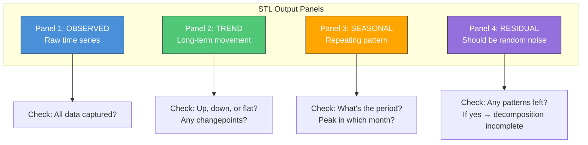

#### Interview Priority: STL vs Classical

| What to Know | Priority | Why |
|--------------|----------|-----|
| STL is more robust than classical | **Must know** | Basic awareness expected in any TS discussion |
| STL uses LOESS, handles outliers/changing seasonality | **Should know** | Shows depth if asked "why STL?" |
| LOESS mechanics (weights, iterative reweighting) | **Nice to have** | Rarely asked in detail; focus time elsewhere |
| Classical uses moving averages (why it fails) | **Should know** | Explains the "why" behind STL's advantages |

> [!TIP]
> **One-liner for interviews**: "STL uses LOESS (local weighted regression) which automatically downweights outliers and allows seasonality to evolve over time, unlike classical decomposition which uses simple moving averages."

#### Deep Dive: Classical vs STL Mechanics (Building Intuition)

<details>
<summary><strong>Click to expand: How Classical Decomposition Works (and Why It Fails)</strong></summary>

##### Step 1: Estimate Trend using Moving Average

Classical uses a **centered moving average** (CMA) of length equal to the seasonal period.

```
For period m=12 (monthly data):
Trend(t) = (Y[t-6] + Y[t-5] + ... + Y[t] + ... + Y[t+5] + Y[t+6]) / 12
```

**Why this fails:**

| Problem | Why It Happens |
|---------|----------------|
| **Outliers** | One huge value in the window affects ALL 12 nearby trend estimates equally (no downweighting) |
| **Endpoints** | Can't compute at first 6 and last 6 points (no data before/after) |
| **Missing values** | Average becomes undefined if any value is missing |

##### Step 2: Estimate Seasonality as Fixed Pattern

Classical computes **one seasonal index per season** (e.g., one value for "January") by averaging all January deviations across years.

```
S_jan = mean(Y_jan_2020 - T_jan_2020, Y_jan_2021 - T_jan_2021, ...)
```

**Why this fails:**
- Assumes January **always** has the same effect every year
- Can't adapt if seasonality is growing, shrinking, or shifting

</details>

<details>
<summary><strong>Click to expand: How STL Fixes These (The LOESS Magic)</strong></summary>

##### What is LOESS?

**LOESS** = **Lo**cally **E**stimated **S**catterplot **S**moothing

Instead of a simple average, LOESS fits a **local weighted regression** at each point:

```
For each point t:
1. Take nearby points
2. Give CLOSER points MORE weight (distance decay)
3. Fit a polynomial (usually linear or quadratic)
4. The fitted value at t = smoothed estimate
```

##### Why LOESS Fixes Classical's Problems

| Problem | Classical Approach | LOESS Approach | Why Better |
|---------|-------------------|----------------|------------|
| **Outliers** | Equal weight to all | Uses **robust weights**: fits once, finds residuals, **downweights** points with large residuals, refits | Outliers get automatically suppressed |
| **Missing values** | Can't compute | Local regression skips missing points, fits on available neighbors | Graceful interpolation |
| **Endpoints** | No data = no estimate | Can extrapolate from nearby local fit | Some estimate > no estimate |
| **Changing seasonality** | One fixed index per season | Runs seasonal smoothing **across years** for each season | January-2025 can differ from January-2020 |

##### Visual Intuition

```
Classical Moving Average:
   [===EQUAL WEIGHTS===]     <-- All points matter equally
         Point t

LOESS with distance weights:
   [  .  .  #  ####  #  .  . ]     <-- Closer = more weight
                 Point t

LOESS with robustness iteration:
   [  .  .  X  ####  #  .  . ]     <-- Outlier X gets downweighted after first pass
                 Point t
```

**Key Insight**: Classical decomposition treats all data points equally -> one bad point ruins everything. STL uses local weighted regression with robustness -> bad points get automatically marginalized, local patterns are captured, and missing data is interpolated.

</details>

---

### Other Modern Decomposition Methods

While **STL** is the modern "workhorse" for most data science problems, other specialized methods exist depending on your domain.

| Method | Best Use Case | Key Strength | Python Implementation |
|--------|---------------|--------------|-----------------------|
| **MSTL** (Multiple Seasonal-Trend decomposition using Loess) | **High-frequency data** (e.g., hourly electricity demand) | Handles **multiple seasonal periods** simultaneously (e.g., daily + weekly patterns) | `statsmodels.tsa.seasonal.MSTL` |
| **X-13ARIMA-SEATS** | **Official Statistics** (census, unemployment) | Uses ARIMA to forecast *before* decomposing, fixing "end-point" issues. Handles calendar effects (leap year vs non-leap year). | `statsmodels.tsa.x13` (requires C binary) |
| **HP Filter** (Hodrick-Prescott) | **Macroeconomics** (GDP cycles) | Specifically designed to remove long-term trends to isolate business cycles. Uses a smoothing parameter $\lambda$. | `statsmodels.tsa.filters.hp_filter` |
| **SSA** (Singular Spectrum Analysis) | **Noisy / Complex Signals** | Non-parametric (SVD-based). Decomposes signal into trend, oscillation pairs, and noise without assuming fixed periods. | `pyts` or custom implementation |

> [!TIP]
> **Interview Answer**: "For most business problems, I start with **STL** because it's robust to outliers and handles changing seasonality. If I have high-frequency data with multiple cycles (like hourly traffic), I use **MSTL**. For economic data where I need to match official reporting standards, I'd use **X-13ARIMA-SEATS**."

### Q: Why not use Prophet for Decomposition?

You **can** (and often do), but it serves a different purpose than STL.

| Feature | STL (LOESS) | Prophet (Regression) |
| :--- | :--- | :--- |
| **Approach** | **Non-parametric** (Smooths the data) | **Parametric** (Fits a model: linear trend + Fourier) |
| **Trend Shape** | **Flexible** (can be any smooth curve) | **Rigid** (Piecewise linear or logistic only) |
| **Seasonality** | **Evolving** (can change shape over time) | **Strictly Periodic** (Fourier series repeats exactly) |
| **Goal** | **Diagnosing** history (EDA) | **Forecasting** future |

**Verdict**: Use **STL** for *Exploratory Data Analysis* to "see" the true underlying components without forcing them into a straight line. Use **Prophet** when you are ready to build a *Predictive Model* and need to explicitly handle holidays or missing data.

---

## 4.1.2 Stationarity

### What is Stationarity?

**Definition**: A time series is **stationary** if its statistical properties do not change over time.

#### Three Conditions for Weak Stationarity

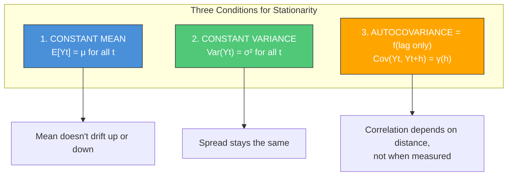

#### Notation Glossary

| Symbol | Name | Definition |
|--------|------|------------|
| **μ** (mu) | Population mean | E[Yₜ] = expected value of the series |
| **σ²** (sigma squared) | Variance | Var(Yₜ) = E[(Yₜ - μ)²] |
| **γ(h)** or **γₕ** (gamma) | Autocovariance at lag h | Cov(Yₜ, Yₜ₊ₕ) = E[(Yₜ - μ)(Yₜ₊ₕ - μ)] |
| **ρ(h)** or **ρₕ** (rho) | Autocorrelation at lag h | γ(h) / γ(0) = normalized autocovariance |
| **h** or **k** | Lag | Number of time steps between observations |
| **E[·]** | Expectation | Average value over all possible outcomes |
| **Cov(·,·)** | Covariance | Measure of how two variables move together |

> [!NOTE]
> **Key insight for condition 3**: γ(h) depends ONLY on the lag h, not on the time t. This means the covariance between observations 5 time units apart is the same whether you measure it at time 10 or time 100.

#### Stationary vs Non-Stationary (Visual Comparison)

| Property | Stationary | Non-Stationary |
|----------|------------|----------------|
| Mean | Constant | Drifts over time |
| Variance | Constant | Changes over time |
| Pattern | Oscillates around fixed level | Trends up/down or explodes |
| Example | White noise | Stock prices, GDP |

### Why Stationarity Matters

> [!IMPORTANT]
> Most classical forecasting methods (ARIMA, Exponential Smoothing) **assume stationarity**.

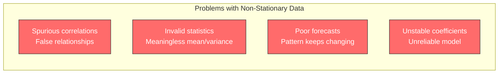

> [!IMPORTANT]
> **The Spurious Regression Problem**
>
> The most concrete reason stationarity matters: two completely unrelated non-stationary series (e.g., global GDP and the number of Nicolas Cage films released per year) will show a high R² and statistically significant coefficients when regressed on each other — purely because both are trending upward.
>
> **Why**: With a stochastic trend, the variance of the series grows without bound. The t-statistics and F-statistics used in regression no longer follow their standard distributions. Standard significance tests break down entirely.
>
> **The fix**: First-difference both series before regressing. If the relationship survives differencing, it's more likely to be real.
>
> **Interview phrasing**: *"Non-stationarity causes spurious regression — I can get R²=0.95 between two completely unrelated trending series. I always test for stationarity before running any regression or fitting ARIMA, and I difference when needed."*

**Connection to later topics**:
- **ARIMA**: The "I" = Integrated = differencing to achieve stationarity
- **Cointegration**: Two non-stationary series that have a stationary relationship
- **Unit root**: A stochastic process feature where shocks have a permanent effect (e.g., Random Walk).

#### Deep Dive: What is a "Unit Root"?

<details>
<summary><strong>Click to expand: Intuition & Math of Unit Roots</strong></summary>

**1. Intuitive Definition**:
A time series has a **unit root** if a shock (random change) has a **permanent effect**. The series has "perfect memory" and does not revert to a mean.

- **Stationary ($\phi < 1$)**: $Y_t = 0.5 Y_{t-1} + \epsilon_t$. If $\epsilon_t$ jumps by 10, the effect decays: 10, 5, 2.5, 1.25... back to 0. (Mean reverting)
- **Unit Root ($\phi = 1$)**: $Y_t = 1.0 Y_{t-1} + \epsilon_t$. If $\epsilon_t$ jumps by 10, $Y_t$ increases by 10 and **stays there forever** (until another shock moves it). This is a **Random Walk**.
- **Explosive ($\phi > 1$)**: $Y_t = 1.1 Y_{t-1} + \epsilon_t$. The shock grows exponentially. (Rare in nature).

**2. Why "Unit Root"? (The Math)**:
Consider the characteristic equation of the process. For an AR(1) process $Y_t = \phi Y_{t-1} + \epsilon_t$, we can write it with the Lag operator $L$:
$(1 - \phi L)Y_t = \epsilon_t$

The "root" is the solution to $(1 - \phi z) = 0$, which is $z = 1/\phi$.
- If $\phi = 1$, then $z = 1$. The root is **on the unit circle** (Unit Root).
- If $|\phi| < 1$, then $|z| > 1$. The root is **outside the unit circle** (Stationary).

**3. Practical Implication**:
If your series has a unit root, standard assumptions (t-stats, R-squared) break down. You **MUST** difference the series ($Y_t - Y_{t-1}$) to make it stationary. This is what the **Integration (I)** in ARIMA stands for.

> [!TIP]
> **Check for Unit Roots**: 
> - If **ADF test** p > 0.05 (failure to reject null), you likely have a unit root.
> - If ACF decays very slowly (linear decay), that's a sign of a unit root.

</details>

---

### Testing for Stationarity

#### ADF vs KPSS Tests

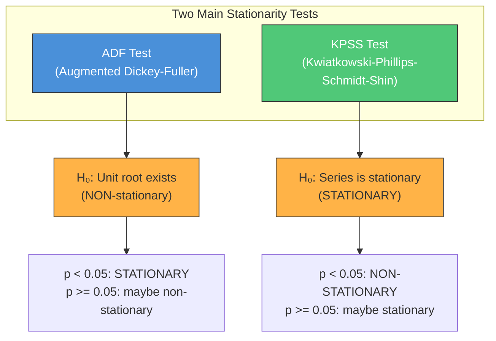

> [!WARNING]
> The null hypotheses are **opposite**! This is a common source of confusion.

> [!WARNING]
> The null hypotheses are **opposite**! This is a common source of confusion.

> [!NOTE]
> **Mathematical Hypotheses (ADF)**:
> - $H_0: \phi = 1$ (Unit Root exists). Process is **non-stationary**.
> - $H_1: \phi < 1$ (Root inside unit circle). Process is **stationary**.
> - It does **NOT** test for $\phi > 1$ (explosive) by default.

<details>
<summary><strong>Click to expand: How ADF Actually Works (The "Error Correction" Intuition)</strong></summary>

The user asked: *"Is the probability of $\phi = 1.0000000$ almost zero?"*
**Answer**: In Frequentist statistics, we don't calculate the probability of the *parameter*. We calculate the probability of the *data* given the parameter is 1.

**The Intuition (Error Correction)**:
The ADF test rewrites the AR(1) equation $y_t = \phi y_{t-1} + \epsilon_t$ into a difference equation:
$\Delta y_t = (\phi - 1)y_{t-1} + \dots$
Let $\gamma = \phi - 1$.
The new equation is: $\Delta y_t = \gamma y_{t-1} + \dots$

- **If $\gamma = 0$ ($\phi = 1$)**: The term $\gamma y_{t-1}$ disappears. The change $\Delta y_t$ does not depend on the previous value $y_{t-1}$. The series has **no memory of where it is**; it just wanders. (Random Walk)
- **If $\gamma < 0$ ($\phi < 1$)**: This is **Error Correction** (Mean Reversion).
    - If $y_{t-1}$ is **positive** (high), $\gamma y_{t-1}$ is **negative**, pulling the series down.
    - If $y_{t-1}$ is **negative** (low), $\gamma y_{t-1}$ is **positive** (since $\gamma$ is negative), pushing the series up.
    - The series is constantly being "corrected" back to zero.

**The Test**:
We check if $\gamma$ is statistically significantly different from zero (statistically negative). If the "pull back" force is strong enough, we reject the Random Walk hypothesis.

</details>

#### Decision Matrix for Test Results

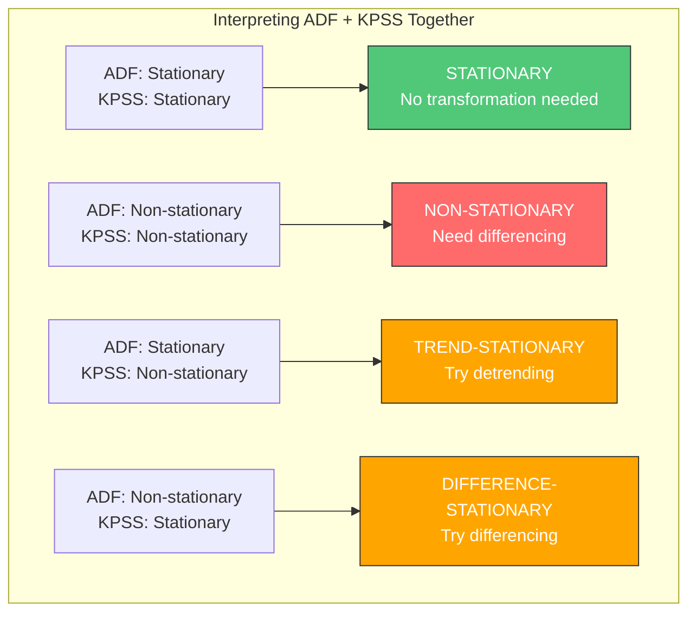

#### Intuition: Why these conclusions?

| Case | Result | Logic "Why" | Action |
|------|--------|-------------|--------|
| **Trend-Stationary** | ADF: Stat<br>KPSS: Non-Stat | **ADF says**: Shocks die out (mean reverting).<br>**KPSS says**: The mean is moving (not constant).<br>**Combined**: It's stable around a *moving* mean (trend). | **Detrend**<br>(Subtract the trend) |
| **Difference-Stationary** | ADF: Non-Stat<br>KPSS: Stat | **ADF says**: Shocks persist (Unit Root/Random Walk).<br>**KPSS says**: It looks stationary (low power / weak trend).<br>**Combined**: The Unit Root is the dominant issue. | **Difference**<br>(Break the memory) |

> [!IMPORTANT]
> **Detrending vs. Differencing**:
> - **Detrending**: Decomposing the series ($Y_t = T_t + S_t + R_t$) and **subtracting** the trend component ($Y_t - T_t$). Use this for **Trend-Stationary** data.
> - **Differencing**: Calculating the change ($Y_t - Y_{t-1}$). This removes *stochastic* trends (random walks). Use this for **Difference-Stationary** data.

#### Python Implementation

```python
from statsmodels.tsa.stattools import adfuller, kpss

def test_stationarity(series, name="Series"):
    """Run both ADF and KPSS tests and interpret results."""
    
    # ADF Test
    adf_result = adfuller(series, autolag='AIC')
    adf_stat, adf_pvalue = adf_result[0], adf_result[1]
    
    # KPSS Test
    kpss_result = kpss(series, regression='c')
    kpss_stat, kpss_pvalue = kpss_result[0], kpss_result[1]
    
    print(f"Results for: {name}")
    print(f"  ADF:  stat={adf_stat:.4f}, p-value={adf_pvalue:.4f}")
    print(f"  KPSS: stat={kpss_stat:.4f}, p-value={kpss_pvalue:.4f}")
    
    # Interpretation
    adf_stationary = adf_pvalue < 0.05
    kpss_stationary = kpss_pvalue >= 0.05
    
    if adf_stationary and kpss_stationary:
        print("  Conclusion: STATIONARY (both tests agree)")
    elif not adf_stationary and not kpss_stationary:
        print("  Conclusion: NON-STATIONARY (both tests agree)")
    else:
        print("  Conclusion: CONFLICTING - may be trend-stationary")
```

---

### Achieving Stationarity

#### Transformation Strategy: "Try, Verify, or Switch"

> [!IMPORTANT]
> **Don't Assume Transformations Work**: Always verify if the transformation actually removed the issue. If standard transformations fail, **switch models** instead of forcing it.

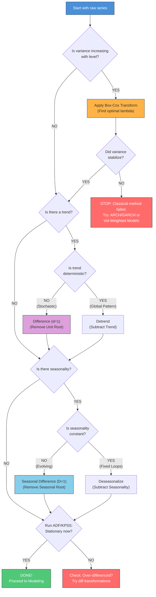

#### Common Transformations & Validation

| Issue | Transformation | Python Code | Validation Check |
|-------|----------------|-------------|------------------|
| **Heteroscedasticity** (Variance) | **Box-Cox** (includes Log if $\lambda=0$) | `scipy.stats.boxcox(series)` | **Levene's Test** or Visual<br>(Is variance constant over time?) |
| **Deterministic Trend** | **Detrend** (Subtract) | `series - decomposition.trend` | Residuals should represent random noise around 0. |
| **Stochastic Trend** (Unit Root) | **Difference** (d=1) | `series.diff(1)` | **ADF Test** + **ACF Plot**<br>(Did linear decay disappear?) |
| **Seasonality** | **Seasonal Difference** (D=1) | `series.diff(m)` | **ACF Plot**<br>(Did seasonal lags vanish?) |

> [!TIP]
> **Box-Cox is versatile**: It finds an optimal $\lambda$ to stabilize variance.
> - $\lambda = 1$: No change
> - $\lambda = 0$: Log transform
> - $\lambda = 0.5$: Square root transform
>
> If Box-Cox fails to fix variance, don't use ARIMA. Use models designed for volatility clustering (ARCH/GARCH) or probabilistic deep learning (DeepAR).

#### Python: Checking Variance Stability

```python
from scipy.stats import boxcox, levene
import numpy as np

def check_variance_stability(series, transformed_series):
    """
    Split series into chunks and check if variance is constant across chunks.
    Levene's test H0: Variances are equal.
    """
    # Split into 3 chunks
    chunks = np.array_split(transformed_series.dropna(), 3)
    stat, p_value = levene(chunks[0], chunks[1], chunks[2])
    
    print(f"Levene's Test p-value: {p_value:.4f}")
    if p_value < 0.05:
        print("WARNING: Variances are still significantly different (Heteroscedasticity).")
        print("Consider ARCH/GARCH models.")
    else:
        print("PASS: Variance looks stable.")
```

#### Over-Differencing: How to Detect

**Problem**: Differencing too many times removes real signal, not just non-stationarity.

**Detection Methods**:

| Sign | What It Looks Like | What It Means |
|------|-------------------|---------------|
| ACF lag-1 strongly negative | ρ₁ < -0.5 | Classic over-differencing signature |
| Variance increased | Var(diff²) > Var(diff¹) | Differencing should reduce variance |
| ACF alternating pattern | +, -, +, -, ... | Induced artificial oscillation |

```python
# Check for over-differencing
import numpy as np

def check_overdifferencing(original, differenced):
    """Compare variance and ACF to detect over-differencing."""
    from statsmodels.tsa.stattools import acf
    
    var_original = np.var(original.dropna())
    var_diff = np.var(differenced.dropna())
    acf_vals = acf(differenced.dropna(), nlags=1)
    
    print(f"Variance ratio (diff/orig): {var_diff/var_original:.3f}")
    print(f"ACF at lag 1: {acf_vals[1]:.3f}")
    
    if acf_vals[1] < -0.5:
        print("WARNING: Likely over-differenced (ACF lag-1 < -0.5)")
```

> [!WARNING]
> **Rule of thumb**: If ACF at lag 1 is more negative than -0.5 after differencing, you've probably over-differenced. Try fewer differences.

#### Interview Priority: Over-Differencing

| What to Know | Priority | Why |
|--------------|----------|-----|
| ACF lag-1 < -0.5 indicates over-differencing | **Should know** | Quick diagnostic rule |
| Over-differencing increases variance | **Should know** | Intuition check |
| Solution: use fewer differences | **Must know** | Practical fix |

#### Interview Priority: Stationarity

| What to Know | Priority | Why |
|--------------|----------|-----|
| Three conditions for stationarity (mean, variance, autocovariance) | **Must know** | Fundamental definition, frequently asked |
| ADF vs KPSS null hypotheses are OPPOSITE | **Must know** | Classic trick question; easy points if you know |
| Interpret p-values: ADF p<0.05 = stationary, KPSS p>0.05 = stationary | **Must know** | You'll use this in every TS problem |
| Order of transformations: log → difference → seasonal diff | **Should know** | Practical workflow question |
| What to do when tests conflict (trend-stationary) | **Should know** | Shows you can handle edge cases |
| Unit root technical definition | **Nice to have** | Rarely asked for AS roles |

> [!TIP]
> **One-liner for interviews**: "I run both ADF and KPSS because their null hypotheses are opposite—ADF tests for a unit root (non-stationarity) while KPSS tests for stationarity. If both agree, I'm confident. If they conflict, the series is likely trend-stationary."

---

## 4.1.3 Autocorrelation & White Noise

> **Study Time**: 3 hours | **Priority**: [H] High | **Goal**: Foundation for ACF/PACF interpretation and model diagnostics

---

### What is Autocorrelation?

**Definition**: Autocorrelation is the correlation of a time series with a lagged copy of itself.

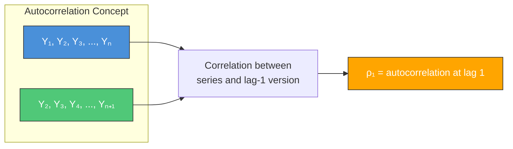

**Formula**:
$$\rho_k = \frac{Cov(Y_t, Y_{t-k})}{Var(Y_t)} = \frac{\gamma_k}{\gamma_0}$$

**Intuition**:
- **High positive autocorrelation**: Today's value is similar to yesterday's (trending, smooth series)
- **Negative autocorrelation**: Today's value tends to be opposite of yesterday's (oscillating)
- **Zero autocorrelation**: Past values don't help predict current values (random)

---

### Autocovariance vs Autocorrelation

**Autocovariance** at lag k:
$$\gamma_k = Cov(Y_t, Y_{t-k}) = E[(Y_t - \mu)(Y_{t-k} - \mu)]$$

**Autocorrelation** = normalized autocovariance:
$$\rho_k = \frac{\gamma_k}{\gamma_0} = \frac{Cov(Y_t, Y_{t-k})}{Var(Y_t)}$$

**Why we use autocorrelation**:
- Autocovariance depends on the units of measurement (hard to interpret)
- Autocorrelation is always between -1 and +1 (easy to interpret)
- ρ₀ = 1 (series is perfectly correlated with itself)

---

### Lag Operator (Backshift Operator)

**Definition**: The **lag operator B** (or **backshift operator L**) shifts a time series back by one period.

$$BY_t = Y_{t-1}$$

**Higher powers**:
$$B^k Y_t = Y_{t-k}$$

**Key Identities for ARIMA**:

| Expression | Meaning | Use Case |
|------------|---------|----------|
| $(1 - B)Y_t$ | $Y_t - Y_{t-1}$ | First difference |
| $(1 - B)^2 Y_t$ | $(Y_t - Y_{t-1}) - (Y_{t-1} - Y_{t-2})$ | Second difference |
| $(1 - B^{12})Y_t$ | $Y_t - Y_{t-12}$ | Seasonal difference (monthly) |

**ARIMA in Lag Notation**:

ARIMA(1,1,1) can be written as:
$$(1 - \phi_1 B)(1 - B)Y_t = (1 + \theta_1 B)\varepsilon_t$$

Where:
- $(1 - \phi_1 B)$ = AR(1) part
- $(1 - B)$ = differencing (I) part  
- $(1 + \theta_1 B)$ = MA(1) part

**Example 2: ARIMA(2,1,1)**
$$(1 - \phi_1 B - \phi_2 B^2)(1 - B)Y_t = (1 + \theta_1 B)\varepsilon_t$$

> [!TIP]
> **Why this matters**: Research papers and statsmodels output use lag operator notation. Recognizing it lets you read model specifications quickly.

#### Interview Priority: Lag Operator

| What to Know | Priority | Why |
|--------------|----------|-----|
| B means "shift back one period" | **Should know** | Basic definition |
| (1-B)Yt = first difference | **Should know** | Most common use |
| Reading ARIMA equations in B notation | **Nice to have** | Useful for papers, less common in interviews |

### White Noise

**Definition**: A series is **white noise** if it has:
1. **Mean = 0** (centered)
2. **Constant variance** (σ² same for all t)
3. **No autocorrelation** (ρₖ = 0 for all k ≠ 0)

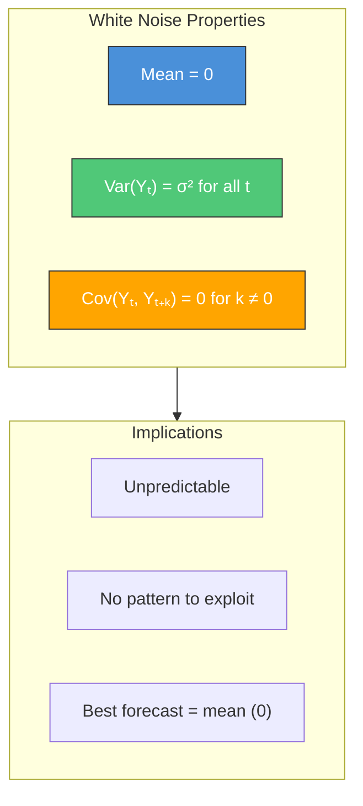

> [!IMPORTANT]
> **Why it matters**: Good model residuals should be white noise. If residuals have autocorrelation, the model is missing a pattern.

---

### ACF and PACF

#### ACF (Autocorrelation Function)

**Definition**: The ACF shows the correlation between Yₜ and Yₜ₋ₖ for all lags k.

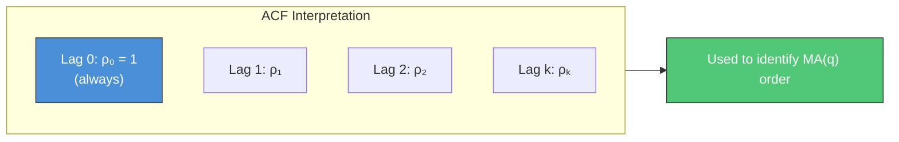

#### Significance Bounds in ACF/PACF Plots

**What are the blue bands?** The shaded region in ACF/PACF plots represents the **95% confidence bounds** for white noise.

**Formula**:
$$\pm \frac{1.96}{\sqrt{n}}$$

where n = number of observations.

**Interpretation**:
- Spikes **inside** the bands: Not significantly different from zero → **Ignore**
- Spikes **outside** the bands: Statistically significant autocorrelation → **Use for model order**

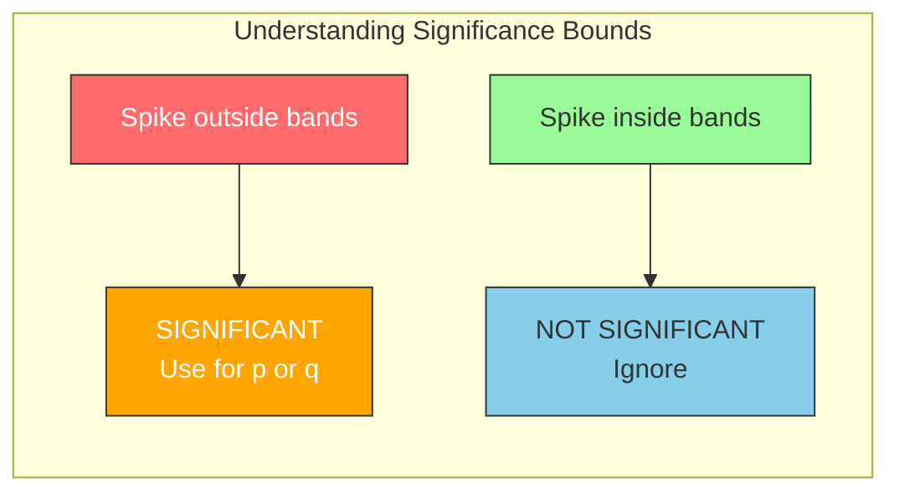

**Example**: For n=100 observations, bounds = ±1.96/10 = ±0.196

> [!WARNING]
> **Assumption**: These bounds assume the series is white noise. They're only valid for **residuals** or **stationary series**. Don't interpret raw non-stationary data this way.

> [!TIP]
> **Type I Error (False Positives)**: The bounds represent a **95% Confidence Interval**. This implies a **5% probability** of observing a spike outside the bounds purely by chance (Type I Error), even if the data is truly White Noise.
> *   **Practical Rule**: If you inspect 20 lags, statistically expect $20 \times 0.05 = 1$ spurious spike. **Ignore** isolated, marginally significant spikes at non-seasonal lags.
>
> **Type II Error (False Negatives)**: The risk of missing a **real** correlation because it falls *inside* the bounds. 
> *   **Unlike Type I (fixed at 5%)**, Type II error ($\beta$) depends on **how strong** the real correlation is.
> *   **Example**: With $N=100$, bounds are $\pm 0.2$.
>     *   If true correlation is **0.1**: It falls inside. You miss it. $\beta$ is high (bad).
>     *   If true correlation is **0.5**: It falls outside. You catch it. $\beta$ is low (good).
> *   **Key takeaway**: You cannot calculate a single "Type II Error rate" without assuming a specific true correlation value.

#### Interview Priority: Significance Bounds

| What to Know | Priority | Why |
|--------------|----------|-----|
| Bounds are ±1.96/√n | **Must know** | Frequently asked what the bands mean |
| Spikes outside = significant | **Must know** | How you read ACF/PACF plots |
| Bounds assume white noise | **Should know** | Shows you understand limitations |
| Expect ~5% false positives (Type I Error) | **Should know** | Prevents over-interpretation of noise |

#### PACF (Partial Autocorrelation Function)

**Definition**: The PACF shows the **direct** correlation between Yₜ and Yₜ₋ₖ, **controlling for** intermediate lags.

**Intuition**: If Y₁ affects Y₂ affects Y₃, then Y₁ and Y₃ are correlated through Y₂. PACF removes this indirect effect.

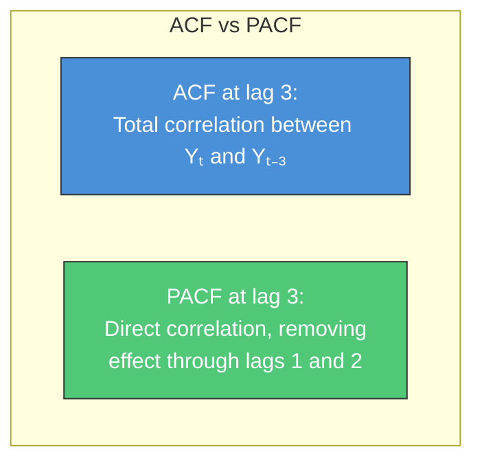

---

### Identifying AR and MA from ACF/PACF

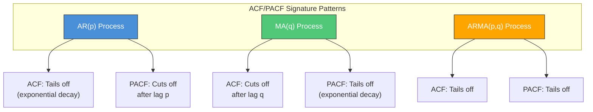

#### Quick Reference Table

| Model | ACF Behavior | PACF Behavior | How to Identify |
|-------|--------------|---------------|-----------------|
| **AR(p)** | Tails off (decays) | Cuts off after lag p | Count significant PACF spikes |
| **MA(q)** | Cuts off after lag q | Tails off (decays) | Count significant ACF spikes |
| **ARMA(p,q)** | Tails off | Tails off | Use AIC/BIC for selection |
| **White Noise** | All near zero | All near zero | No significant spikes |

> [!TIP]
> **"Cuts off"** = drops to insignificant immediately after lag p or q
> **"Tails off"** = decays gradually toward zero


#### Detailed Examples: Typical vs Oscillating Patterns

Use this to visualize what "Tails off" and "Cuts off" actually look like in practice.

| Process | Equation ($Y_t$) | ACF Behavior | PACF Behavior | Visual Intuition |
| :--- | :--- | :--- | :--- | :--- |
| **AR(1) Positive**<br>*(Smooth)* | $Y_t = 0.8 Y_{t-1} + \epsilon_t$ | **Tails off (Positive)**<br>Ex: 1.0, 0.8, 0.64, ... | **Cuts off (Lag 1)**<br>Spike at 1, then 0 | "Momentum"<br>Last value pushes next value same direction. |
| **AR(1) Negative**<br>*(Oscillating)* | $Y_t = -0.8 Y_{t-1} + \epsilon_t$ | **Tails off (Oscillating)**<br>Ex: 1.0, -0.8, 0.64, -0.51... | **Cuts off (Lag 1)**<br>Negative spike at 1, then 0 | "Mean Reversion"<br>High value $\rightarrow$ Low value next. |
| **MA(1) Positive**<br> | $Y_t = \epsilon_t + 0.8 \epsilon_{t-1}$ | **Cuts off (Lag 1)**<br>Positive spike at 1, then 0 | **Tails off (Oscillating)**<br>Decaying alternating waves | "Short Memory"<br>Shock lasts exactly 1 step. |
| **MA(1) Negative**<br> | $Y_t = \epsilon_t - 0.8 \epsilon_{t-1}$ | **Cuts off (Lag 1)**<br>Negative spike at 1, then 0 | **Tails off (Positive)**<br>Smooth exponential decay | "Correction"<br>Shock reverses effect after 1 step. |

> [!NOTE]
> **"Non-Typical" isn't the right word, but "Oscillating" is.**
> *   **Positive Parameters** ($\phi > 0, \theta < 0$): Usually result in smoother, positive decays.
> *   **Negative Parameters** ($\phi < 0, \theta > 0$): Result in alternating positive/negative spikes (oscillation).
> *   **Key for Interviews**: If the ACF bars go **UP-DOWN-UP-DOWN**, the parameter is likely **negative**. If they gradually fade **DOWN-DOWN-DOWN**, the parameter is **positive**.

#### Interview Priority: ACF/PACF


| What to Know | Priority | Why |
|--------------|----------|-----|
| AR(p): PACF cuts off, ACF tails off | **Must know** | Asked in nearly every TS interview |
| MA(q): ACF cuts off, PACF tails off | **Must know** | Asked in nearly every TS interview |
| What "cuts off" vs "tails off" means | **Must know** | Need this to interpret the plots |
| White noise: no significant spikes in either | **Must know** | This is what good residuals look like |
| ARMA(p,q): both tail off, use AIC/BIC | **Should know** | Common follow-up question |
| Random walk ACF decays very slowly | **Should know** | Distinguishes from stationary series |
| Ljung-Box test for residual autocorrelation | **Should know** | Model validation step |
| Mathematical formula for ACF | **Nice to have** | Understanding > memorizing formula |

> [!TIP]
> **Memorization trick**: "**P**ACF for A**R**, **A**CF for M**A**" — the letter that appears in both tells you which plot "cuts off".

---

### Random Walk vs Stationary

#### Random Walk Definition

**Formula**: $Y_t = Y_{t-1} + \varepsilon_t$ where $\varepsilon_t$ is white noise

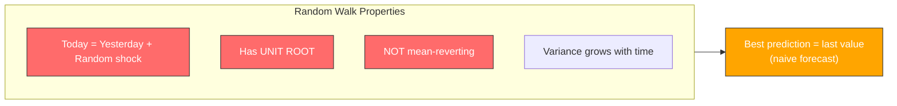

#### Key Distinction

| Property | Stationary Series | Random Walk |
|----------|-------------------|-------------|
| Mean | Constant | Drifts |
| Variance | Constant | Grows with t |
| ACF | Decays quickly | Decays very slowly |
| ADF test | p < 0.05 (reject null) | p > 0.05 (fail to reject) |
| Forecastable? | Yes (patterns repeat) | No (best = last value) |
| Classic example | Temperature deviations | Stock prices |

> [!IMPORTANT]
> **Interview classic**: "Can you forecast stock prices?"
> **Answer**: Stock prices are approximately random walks. The best forecast is today's price (naive forecast). You cannot beat this consistently.

---

### Ljung-Box Test

**Purpose**: Test whether residuals are white noise (no significant autocorrelation).

**Hypotheses**:
- **H₀**: No autocorrelation at any lag (residuals are white noise) ✓ WANT THIS
- **H₁**: Significant autocorrelation exists at some lag ✗ Model issue

**Interpretation**:
- **p > 0.05**: Fail to reject H₀ → Residuals are white noise ✓ Good!
- **p < 0.05**: Reject H₀ → Residuals have autocorrelation ✗ Model needs improvement

```python
from statsmodels.stats.diagnostic import acorr_ljungbox

def check_residuals(residuals, lags=10):
    """Check if residuals are white noise using Ljung-Box test."""
    lb_result = acorr_ljungbox(residuals, lags=lags, return_df=True)
    
    print("Ljung-Box Test Results:")
    print(lb_result)
    
    # Check if any p-value is significant
    if (lb_result['lb_pvalue'] < 0.05).any():
        print("\nWARNING: Significant autocorrelation detected!")
        print("Model may be misspecified - consider adding AR or MA terms.")
    else:
        print("\nGood: Residuals appear to be white noise.")
```

---

### Python Implementation: ACF/PACF Plotting

```python
from statsmodels.graphics.tsaplots import plot_acf, plot_pacf
import matplotlib.pyplot as plt

def plot_acf_pacf(series, lags=20, title=""):
    """Plot ACF and PACF side by side for model identification."""
    fig, axes = plt.subplots(1, 2, figsize=(12, 4))
    
    plot_acf(series, lags=lags, ax=axes[0], title=f'ACF - {title}')
    plot_pacf(series, lags=lags, ax=axes[1], title=f'PACF - {title}')
    
    plt.tight_layout()
    plt.show()

# Example interpretation:
# If PACF cuts off at lag 2 and ACF tails off → AR(2)
# If ACF cuts off at lag 1 and PACF tails off → MA(1)
```

---

### Interview Cheat Sheet: Autocorrelation

| Question | Key Points |
|----------|------------|
| **What is autocorrelation?** | Correlation of series with its lagged self. Measures how past values relate to current. |
| **What is white noise?** | Mean=0, constant variance, zero autocorrelation. The ideal residual pattern. |
| **How do you identify AR(p)?** | PACF cuts off after lag p, ACF tails off gradually. |
| **How do you identify MA(q)?** | ACF cuts off after lag q, PACF tails off gradually. |
| **What is a random walk?** | Yₜ = Yₜ₋₁ + εₜ. Has unit root, not mean-reverting, best forecast = last value. |
| **How do you test if residuals are good?** | Ljung-Box test. Want p > 0.05 (no significant autocorrelation). |
| **Can you forecast stock prices?** | They're random walks. Best forecast is naive (last value). Can't beat consistently. |

### Red Flags to Avoid

| Don't Say | Say Instead |
|-----------|-------------|
| "ACF cuts off for AR" | "PACF cuts off for AR, ACF tails off" |
| "Residuals should be zero" | "Residuals should be WHITE NOISE (zero mean, no autocorrelation)" |
| "Random walk is stationary" | "Random walk is NON-stationary (has unit root)" |
| "Just use more lags" | "Check ACF/PACF pattern to determine appropriate order" |

---

## Connections Map

Understanding how fundamentals connect to other topics:

```mermaid
flowchart TB
    subgraph fundamentals["4.1 FUNDAMENTALS"]
        COMP["4.1.1 Components"]
        STAT["4.1.2 Stationarity"]
    end
    
    subgraph classical["4.2 CLASSICAL METHODS"]
        ARIMA["ARIMA<br/>Needs stationarity"]
        SARIMA["SARIMA<br/>Handles 1 seasonality"]
        ETS["Exponential Smoothing<br/>Handles trend + season"]
    end
    
    subgraph modern["4.3 MODERN METHODS"]
        PROPHET["Prophet<br/>Multiple seasonality"]
        ML["ML Forecasting<br/>Feature engineering"]
    end
    
    subgraph evaluation["4.4 EVALUATION"]
        RES["Residual Analysis<br/>Should be stationary"]
        CV["Cross-Validation"]
    end
    
    COMP --> ARIMA
    COMP --> PROPHET
    STAT --> ARIMA
    STAT --> ML
    
    fundamentals --> evaluation
    
    style COMP fill:#4a90d9,stroke:#333,color:#fff
    style STAT fill:#50c878,stroke:#333,color:#fff
    style ARIMA fill:#ffb347,stroke:#333
    style PROPHET fill:#dda0dd,stroke:#333
```

### Interview Question Connections

```mermaid
flowchart LR
    subgraph questions["Common Interview Questions"]
        Q1["Why do you need<br/>stationarity?"]
        Q2["How do you handle<br/>seasonality?"]
        Q3["Your MAPE is high.<br/>What do you check?"]
    end
    
    Q1 --> A1["ARIMA assumptions<br/>Spurious correlations<br/>Reliable forecasts"]
    Q2 --> A2["Decomposition<br/>SARIMA<br/>Prophet<br/>Fourier features"]
    Q3 --> A3["Decompose residuals<br/>Check for patterns<br/>Missing components"]
    
    style Q1 fill:#ff6b6b,stroke:#333,color:#fff
    style Q2 fill:#ffa500,stroke:#333,color:#fff
    style Q3 fill:#4a90d9,stroke:#333,color:#fff
```

---

## Interview Cheat Sheet

### Quick Answers for Common Questions

| Question | Key Points |
|----------|------------|
| **What are the components of a time series?** | Trend (long-term direction), Seasonality (fixed period), Cycle (variable period), Noise (random) |
| **Additive vs Multiplicative?** | Additive if seasonal swings constant; Multiplicative if they scale with level |
| **What is stationarity?** | Constant mean, constant variance, autocorrelation depends only on lag |
| **Why does stationarity matter?** | Most classical methods assume it; non-stationary → spurious correlations, unreliable forecasts |
| **ADF vs KPSS?** | ADF: H₀ = non-stationary; KPSS: H₀ = stationary. Need p<0.05 for ADF, p≥0.05 for KPSS → stationary |
| **What if tests conflict?** | Likely trend-stationary. Try detrending before differencing. |
| **How to achieve stationarity?** | Log transform (if variance grows), difference (if trend), seasonal difference (if seasonality) |

### Red Flags to Avoid

| Don't Say | Say Instead |
|-----------|-------------|
| "Seasonality repeats every few years" | "Seasonality has a FIXED period; you mean cycles" |
| "I always use multiplicative" | "I check if variance grows with level; if not, additive" |
| "ADF p<0.05 means non-stationary" | "ADF p<0.05 means stationary (reject H₀ of unit root)" |
| "Just difference until it works" | "I test after each transformation to avoid over-differencing" |

### Practice Questions

1. *"A retail chain's Q4 sales are always 30% higher than Q1. Is this trend or seasonality?"*
   - Answer: Seasonality (fixed yearly period)

2. *"Your series has an upward trend and the seasonal peaks are getting taller. What decomposition and transformations?"*
   - Answer: Multiplicative (or log → additive). Log transform first, then difference.

3. *"You differenced once and KPSS still rejects. What now?"*
   - Answer: Check if there's still strong seasonality (seasonal difference), or if you over-differenced (ACF/PACF for signs).

---

## Learning Objectives Checklist

### 4.1.1 Time Series Components
- [ ] Identify trend, seasonality, cycles, noise in a plot
- [ ] Explain additive vs multiplicative with examples
- [ ] Write decomposition formulas
- [ ] Apply STL decomposition in Python
- [ ] Know when multiplicative is preferred

### 4.1.2 Stationarity
- [ ] Define the three conditions for stationarity
- [ ] Explain why stationarity matters
- [ ] Explain spurious regression: why two trending unrelated series can show R²=0.95 *(NEW)*
- [ ] Perform and interpret ADF and KPSS tests
- [ ] Handle conflicting test results
- [ ] Apply log, difference, seasonal difference transformations
- [ ] Know the order of operations for transformations
- [ ] Detect over-differencing: ACF lag-1 < -0.5 rule *(NEW)*
- [ ] Know that over-differencing increases variance *(NEW)*

### 4.1.3 Autocorrelation & White Noise
- [ ] Define autocorrelation and explain its intuition
- [ ] Explain autocovariance vs autocorrelation relationship *(NEW)*
- [ ] Know lag operator notation: BYₜ = Yₜ₋₁ *(NEW)*
- [ ] Convert (1-B)Yₜ to first difference *(NEW)*
- [ ] Define white noise and its three properties
- [ ] Plot and interpret ACF and PACF
- [ ] Know significance bounds formula: ±1.96/√n *(NEW)*
- [ ] Interpret spikes inside vs outside bounds *(NEW)*
- [ ] Identify AR(p) from ACF/PACF: PACF cuts off, ACF tails off
- [ ] Identify MA(q) from ACF/PACF: ACF cuts off, PACF tails off
- [ ] Perform and interpret Ljung-Box test on residuals
- [ ] Explain random walk and why it's not forecastable
- [ ] Answer: "Can you forecast stock prices?"

---


---

## 4.1.4 Evaluation Metrics

Common metrics to compare forecast accuracy.

### MAPE (Mean Absolute Percentage Error)

$$ MAPE = \frac{100\%}{n} \sum_{t=1}^{n} \left| \frac{y_t - \hat{y}_t}{y_t} \right| $$

| Pros | Cons |
| :--- | :--- |
| **Interpretable**: Business stakeholders understand "5% error". | **Undefined** if $y_t = 0$. |
| **Scale-independent**: Compare across different products/scales. | **Asymmetric**: Penalizes over-forecasts more heavily than under-forecasts (for positive data). |
| | **Unstable** for small values ($y_t < 1$). |

> [!TIP]
> **Interview Question**: "Why shouldn't you use MAPE for intermittent demand (lots of zeros)?"
> **Answer**: It's undefined (division by zero) or explodes to infinity. Use **MASE** (Mean Absolute Scaled Error) or **WMAPE** (Weighted MAPE) instead.

### Other Key Metrics

| Metric | Formula | Use Case |
| :--- | :--- | :--- |
| **MAE** (Mean Absolute Error) | $\frac{1}{n}\sum |y_t - \hat{y}_t|$ | Robust to outliers. Good for median forecasting. |
| **RMSE** (Root Mean Sq. Error) | $\sqrt{\frac{1}{n}\sum (y_t - \hat{y}_t)^2}$ | Penalizes large errors heavily (outliers). Good for mean forecasting. |
| **SMAPE** (Symmetric MAPE) | $\frac{100\%}{n} \sum \frac{|y - \hat{y}|}{(|y| + |\hat{y}|)/2}$ | Fixes MAPE's asymmetry and $y=0$ issue (mostly). Bounds error at 200%. |

---

## 4.1.5 Stationarity & ML Forecasting

*Does XGBoost / Random Forest / Neural Nets need stationarity?*

### The Short Answer
**No, but Yes.**
*   **Technically No**: ML models don't have mathematical convergence issues with non-stationary variance (like ARIMA does).
*   **Practically Yes**: Tree-based models (Gradient Boosting, Random Forest) **cannot extrapolate trends**.

### Why Tree Models Fail on Trends
Decision trees split data into "buckets" (e.g., `if value > 50: go left`). The final prediction is the **average** of the training values in that leaf node.
*   **Problem**: If your training data goes from 0 to 100, the *maximum* value the model can ever predict is 100.
*   **Scenario**: If the trend continues to 120, the tree model will flatline at 100.

### Solution: Differencing for ML
To make ML models work on trending data, you usually:
1.  **Stationarize (Difference)**: Transform $Y_t$ into "change from yesterday" ($\Delta Y_t$).
2.  **Forecast Change**: Train ML model to predict $\Delta Y_t$.
3.  **Re-integrate**: Add predicted change to last known value ($Y_{t+1} = Y_t + \widehat{\Delta Y}_t$).

```mermaid
flowchart LR
    RAW["Raw Data (Trending)<br/>0, 10, 20..."] --> FAIL["Tree Model<br/>Capped at max(train)"]
    
    RAW --> DIFF["Difference"]
    DIFF --> STAT["Stationary Data<br/>+10, +10, +10..."]
    STAT --> ML["Tree Model<br/>Predicts +10"]
    ML --> INT["Integrate"]
    INT --> PRED["Forecast: 30, 40...<br/>(Trend Captured!)"]
    
    style FAIL fill:#ff6b6b,stroke:#333,color:#fff
    style PRED fill:#50c878,stroke:#333,color:#fff
```

> [!IMPORTANT]
> **Stationarity vs Distributon Shift**: Even for Neural Nets (which *can* extrapolate trends theoretically), stationarity is preferred because it stabilizes the input distribution. Machine Learning assumes **Train Distribution $\approx$ Test Distribution**. Non-stationarity violates this fundamental ML assumption.

---

*Next: [4.2 Classical Methods - ARIMA & Exponential Smoothing](./02_classical_methods.md)*
