---
# Document Outline
- [Executive Summary](#executive-summary)
- [4.2.1 ARIMA Family](#421-arima-family)
  - [One-Liner & Intuition](#one-liner--intuition)
  - [AR, MA, ARMA Components](#ar-ma-arma-components)
  - [AR/MA Duality: Invertibility and Wold's Theorem](#arma-duality-invertibility--wolds-theorem)
  - [ARIMA: Adding Integration](#arima-adding-integration)
  - [Box-Jenkins Methodology](#box-jenkins-methodology-step-by-step)
  - [ACF/PACF Order Selection](#acfpacf-order-selection-rules)
  - [SARIMA Extension](#sarima-seasonal-arima)
  - [Residual Diagnostics](#residual-diagnostics-checklist)
  - [When ARIMA Fails](#when-arima-fails)
  - [Python Implementation](#python-statsmodels-implementation)
  - [ARIMAX: External Regressors](#arimax-adding-external-regressors-h) *(NEW)*
  - [Auto-ARIMA](#auto-arima-automated-order-selection-m) *(NEW)*
- [4.2.2 Exponential Smoothing](#422-exponential-smoothing)
  - [SES to Holt-Winters Progression](#ses--holt--holt-winters-progression)
  - [ETS Notation Decoder](#ets-notation-decoder)
  - [State-Space Formulation](#state-space-formulation)
  - [When to Prefer Over ARIMA](#when-to-prefer-ets-over-arima)
- [4.2.3 VAR (Vector Autoregression)](#423-vector-autoregression-var-l) *(NEW)*
- [4.2.4 Cointegration & ECM](#424-cointegration-and-error-correction-models-m) *(NEW)*
- [4.2.5 Structural Break Detection](#425-structural-break-detection-m) *(NEW)*
- [ARIMA vs ETS Decision Flowchart](#arima-vs-ets-decision-flowchart)
- [Company-Specific Angles](#company-specific-angles)
- [Code Memorization Priority Guide](#code-memorization-priority-guide) *(NEW)*
- [Interview Cheat Sheet](#interview-cheat-sheet)
- [Self-Test Questions](#self-test-questions)
- [Learning Objectives Checklist](#learning-objectives-checklist)

# Executive Summary

> [!CAUTION]
> **Mermaid Chart Syntax Rules**:
> 1. Use `graph` instead of `flowchart` (more compatible across renderers)
> 2. Avoid `<br/>` HTML tags in node labels (use colons or commas instead)
> 3. Avoid Unicode characters (use `phi_1` not `φ₁`)
> 4. Quote labels with special characters like `>`, `<`, or operators

This guide covers Classical Time Series Methods: ARIMA family (AR, MA, ARMA, ARIMA, SARIMA) with formulas, intuition, and the Box-Jenkins methodology; Exponential Smoothing (SES, Holt, Holt-Winters) with ETS notation; and practical guidance on when to use each. These methods form the baseline for any forecasting problem and are essential interview topics.
---

# 4.2 Classical Methods [H]

> **Study Time**: 6 hours | **Priority**: [H] High | **Goal**: Solid understanding, able to fit, diagnose, and explain trade-offs

---

## 4.2.1 ARIMA Family [H]

### One-Liner & Intuition

> [!TIP]
> **If You Remember ONE Thing**: ARIMA combines past values (AR), past errors (MA), and differencing (I) to model any stationary or difference-stationary series.

**One-Liner (≤15 words)**: *Past values + past errors + differencing = flexible model for stationary time series.*

**Intuition (Everyday Analogy)**: 
Think of predicting tomorrow's mood. 
- **AR (Autoregressive)**: "If I was happy yesterday, I'll probably be happy today" → momentum from past states
- **MA (Moving Average)**: "That surprise yesterday threw me off, but I'm recovering" → shock absorption from past surprises
- **I (Integrated)**: "My baseline mood has been drifting upward lately" → removing the drift to focus on patterns

**Why This Exists**: Real-world data has memory (yesterday matters), gets shocked by events (errors matter), and often drifts (needs differencing). ARIMA captures all three.

---

### AR, MA, ARMA Components

#### AR(p) - Autoregressive

**Definition**: Today's value depends on **p past values**.

**Formula**:
$$Y_t = c + \phi_1 Y_{t-1} + \phi_2 Y_{t-2} + \cdots + \phi_p Y_{t-p} + \varepsilon_t$$

**Plain English**: "Tomorrow = weighted average of recent days + random noise"

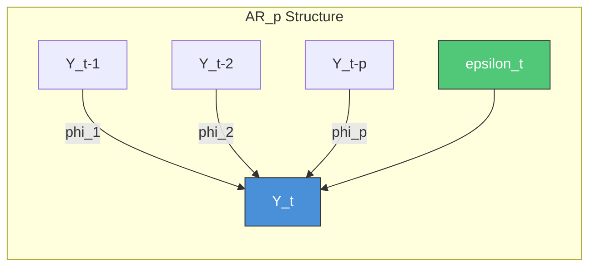

| AR Order | Intuition | Example |
|----------|-----------|---------|
| AR(1) | "Yesterday matters" | Daily temperature |
| AR(2) | "Yesterday + day before matter" | Economic indicators |
| AR(p) | "Last p days matter" | Complex momentum |

**Stationarity Requirement**: $|\phi_1| < 1$ for AR(1). More generally, roots of characteristic polynomial must be outside unit circle.

---

#### MA(q) - Moving Average

**Definition**: Today's value depends on **q past forecast errors**.

**Formula**:
$$Y_t = \mu + \varepsilon_t + \theta_1 \varepsilon_{t-1} + \theta_2 \varepsilon_{t-2} + \cdots + \theta_q \varepsilon_{t-q}$$

**Plain English**: "Tomorrow = mean + today's surprise + lingering effects of past surprises"

> [!WARNING]
> **Common Confusion**: MA in ARIMA is NOT the same as "moving average" (rolling mean). MA(q) models the **error terms**, not the values themselves.

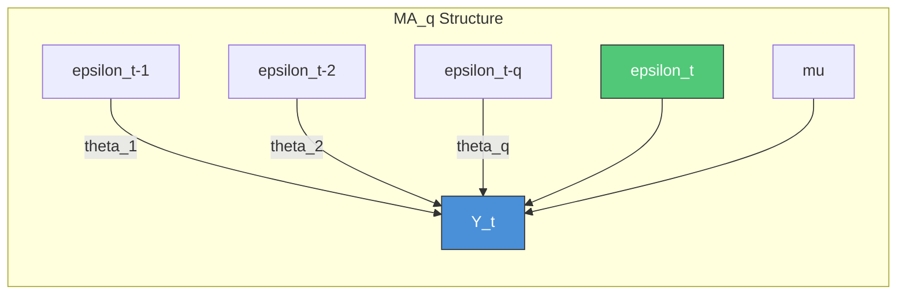

| MA Order | Intuition | Example |
|----------|-----------|---------|
| MA(1) | "Yesterday's surprise lingers" | Short-term shock absorption |
| MA(2) | "Surprises take 2 periods to die out" | Moderate persistence |
| MA(q) | "Shocks persist for q periods" | Long-lasting effects |

---

#### ARMA(p,q) - Combined Model

**Formula**:
$$Y_t = c + \sum_{i=1}^{p} \phi_i Y_{t-i} + \sum_{j=1}^{q} \theta_j \varepsilon_{t-j} + \varepsilon_t$$

**Lag Operator Form (memorize this for interviews)**:
$$\Phi(B) Y_t = \Theta(B) \varepsilon_t$$

where $\Phi(B) = 1 - \phi_1 B - \phi_2 B^2 - \cdots - \phi_p B^p$
and $\Theta(B) = 1 + \theta_1 B + \theta_2 B^2 + \cdots + \theta_q B^q$

> [!NOTE]
> **Why minus on AR, plus on MA?** It's just algebra from moving AR terms to the left side:
>
> Start: $Y_t = \phi_1 Y_{t-1} + \varepsilon_t + \theta_1 \varepsilon_{t-1}$
>
> Move AR terms left: $Y_t - \phi_1 Y_{t-1} = \varepsilon_t + \theta_1 \varepsilon_{t-1}$
>
> Factor with B: $(1 - \phi_1 B) Y_t = (1 + \theta_1 B) \varepsilon_t$
>
> The **minus** appears because AR terms are subtracted to the left side. The MA terms stay on the right and keep their **plus** signs. This is not a separate convention to memorize — it falls out naturally.

**Concrete Example - ARMA(1,1)**:
$$(1 - \phi_1 B) Y_t = (1 + \theta_1 B) \varepsilon_t$$

This expands to: $Y_t = \phi_1 Y_{t-1} + \varepsilon_t + \theta_1 \varepsilon_{t-1}$

**When to Use ARMA**: Stationary data with both gradual decay in ACF AND PACF (neither clearly cuts off).

---

### AR/MA Duality: Invertibility & Wold's Theorem

> [!TIP]
> **If You Remember ONE Thing**: Any stationary AR(p) can be rewritten as MA(infinity), and any invertible MA(q) can be rewritten as AR(infinity). This duality explains why ACF/PACF patterns are mirror images.

#### MA(q) as AR(infinity) — Invertibility

**Idea**: Rearrange the MA equation to express current error in terms of past *values*, then substitute recursively.

**Example: MA(1) to AR(infinity)**

Start with MA(1):
$$Y_t = \mu + \varepsilon_t + \theta_1 \varepsilon_{t-1}$$

Rearrange for $\varepsilon_t$:
$$\varepsilon_t = Y_t - \mu - \theta_1 \varepsilon_{t-1}$$

Substitute recursively (replace $\varepsilon_{t-1}$ with the same expression at $t-1$, etc.):
$$Y_t = \mu(1 + \theta_1 + \theta_1^2 + \cdots) - \theta_1 Y_{t-1} - \theta_1^2 Y_{t-2} - \theta_1^3 Y_{t-3} - \cdots + \varepsilon_t$$

This is an **AR(infinity)** with coefficients $\phi_k = (-\theta_1)^k$.

> [!IMPORTANT]
> **Invertibility Condition**: The series converges only if $|\theta_1| < 1$. More generally, all roots of $\Theta(B) = 0$ must lie outside the unit circle. Without invertibility, MA parameters cannot be uniquely estimated.

#### AR(p) as MA(infinity) — Wold's Theorem

**Idea**: Substitute the AR equation into itself recursively to express $Y_t$ purely in terms of past shocks.

**Example: AR(1) to MA(infinity)**

Start with AR(1):
$$Y_t = c + \phi_1 Y_{t-1} + \varepsilon_t$$

Substitute recursively ($Y_{t-1} = c + \phi_1 Y_{t-2} + \varepsilon_{t-1}$, etc.):
$$Y_t = \frac{c}{1 - \phi_1} + \varepsilon_t + \phi_1 \varepsilon_{t-1} + \phi_1^2 \varepsilon_{t-2} + \phi_1^3 \varepsilon_{t-3} + \cdots$$

This is an **MA(infinity)** with coefficients $\psi_k = \phi_1^k$.

> [!IMPORTANT]
> **Stationarity Condition**: The series converges only if $|\phi_1| < 1$. More generally, all roots of $\Phi(B) = 0$ must lie outside the unit circle. This is guaranteed by **Wold's Decomposition Theorem** for any stationary process.

#### Duality Summary

| Conversion | Condition | Result | Key Use |
|------------|-----------|--------|---------|
| **MA(q) to AR(infinity)** | Invertibility: roots of $\Theta(B)$ outside unit circle | Finite MA becomes infinite AR | Needed for estimating MA parameters |
| **AR(p) to MA(infinity)** | Stationarity: roots of $\Phi(B)$ outside unit circle | Finite AR becomes infinite MA | Wold's Theorem guarantees this |
| **Exact AR(p) = MA(q)** | Only trivial cases | Requires infinite terms in general | Why ARMA is more parsimonious |

#### Why This Duality Explains ACF/PACF Patterns

The duality directly explains the mirror-image behavior in the pattern recognition table:

- **AR(p)** = MA(infinity), so the ACF (which reflects MA structure) **tails off** infinitely, while the PACF **cuts off** at lag p.
- **MA(q)** = AR(infinity), so the PACF (which reflects AR structure) **tails off** infinitely, while the ACF **cuts off** at lag q.

#### Why This Matters (Interview Angle)

1. **Parsimony**: A process needing AR(infinity) may be compactly modeled as MA(1). This is why ARMA exists — combining a few AR and MA terms avoids infinite-order representations.
2. **Invertibility**: Required so MA parameters can be uniquely estimated from data. `statsmodels` enforces this by default with `enforce_invertibility=True`.
3. **Impulse Response**: The MA(infinity) form of an AR model gives you the impulse response function — how a one-time shock propagates through time.

---

### ARIMA: Adding Integration

**ARIMA(p, d, q)** = **A**uto**R**egressive **I**ntegrated **M**oving **A**verage

| Parameter | Meaning | How to Determine |
|-----------|---------|------------------|
| **p** | AR order (# past values) | PACF cuts off at lag p |
| **d** | Differencing order | # of differences to achieve stationarity |
| **q** | MA order (# past errors) | ACF cuts off at lag q |

**Full Formula** (after differencing d times):
$$(1-B)^d Y_t \text{ is modeled as ARMA}(p,q)$$

In expanded form:
$$\Phi(B)(1-B)^d Y_t = \Theta(B) \varepsilon_t$$

**Example: ARIMA(1,1,1)**:
$$(1 - \phi_1 B)(1 - B)Y_t = (1 + \theta_1 B)\varepsilon_t$$

- $(1 - \phi_1 B)$ = AR(1) component
- $(1 - B)$ = first difference (I=1)
- $(1 + \theta_1 B)$ = MA(1) component

#### What Does the Constant `c` Actually Mean?

> [!WARNING]
> **Common Confusion**: The constant in ARIMA changes meaning depending on `d`. This trips up many candidates.

| Differencing `d` | Constant `c` represents | Series behavior |
|-----------------|------------------------|----------------|
| **d=0** (ARMA) | **Mean level**: $\mu = \frac{c}{1 - \phi_1 - \cdots - \phi_p}$ | Fluctuates around level $\mu$ |
| **d=1** | **Drift** (linear trend slope) | Rises/falls ~c units per step |
| **d=1, c=0** | No drift | Random walk forecast (flat from last value) |
| **d=2** | **Quadratic curvature** | Accelerating/decelerating trend |

**Why does this happen?** Differencing strips away the level:

$$Z_t = (1-B)Y_t = Y_t - Y_{t-1}$$

If $Y_t = 100, 102, 105, 103$ then $Z_t = 2, 3, -2$. The baseline "100" is gone. The constant `c` now describes the mean of the *changes*, not the mean of the *values*.

**Where does the level go?** When forecasting, ARIMA reverses the differencing (integrates back), reconstructing the level from the **last observed value**. That's why it's called **I**ntegrated — you cumulative-sum the differenced forecasts to get back to the original scale.

**Example**: ARIMA(1,1,0) with $c=3$, $\phi_1 = 0.5$

- The differenced series $Z_t$ has mean $\mu_Z = \frac{3}{1 - 0.5} = 6$
- This means $Y_t$ rises on average ~6 units per step (linear trend with drift)
- The absolute level of $Y_t$ depends on where the series started, not on $c$

> [!TIP]
> **Interview-ready answer**: "ARIMA does capture level, but how depends on differencing. With d=0, the constant directly determines the mean level. With d=1, differencing strips the level away and the constant becomes a drift term. The absolute level is recovered by integrating forecasts back from the last observed value — that's the 'Integrated' in ARIMA."

---

### Explain to a PM: ARIMA

> **PM-Friendly Version**: 
> 
> "ARIMA is like a smart averaging system that learns from patterns. It says: 'If sales were high yesterday, they'll probably be high today (that's the AR part). If we had an unexpected spike, it takes a few days to settle back (that's the MA part). And if there's an overall upward trend, we account for that separately (that's the I part).'
> 
> The three numbers you see - like ARIMA(1,1,1) - just tell us how far back to look and how to handle the trend. The computer figures out the exact weights automatically."

---

### Box-Jenkins Methodology (Step-by-Step)

The **Box-Jenkins method** is the systematic approach to fitting ARIMA models.

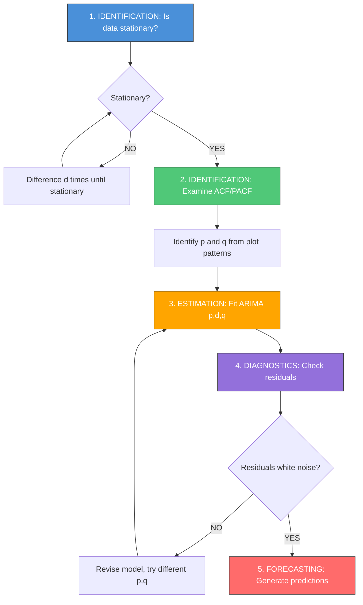

#### Step-by-Step Workflow

| Step | Action | Tools | Output |
|------|--------|-------|--------|
| **1. Test Stationarity** | ADF + KPSS tests | `adfuller()`, `kpss()` | Determine d |
| **2. Difference (if needed)** | Apply $(1-B)^d$ | `series.diff(d)` | Stationary series |
| **3. Examine ACF/PACF** | Plot and interpret | `plot_acf()`, `plot_pacf()` | Candidate p, q |
| **4. Fit Candidate Models** | Try multiple (p,q) | `ARIMA().fit()` | Fitted models |
| **5. Compare with AIC/BIC** | Lower is better | Check `model.aic` | Best model |
| **6. Diagnostic Checks** | Ljung-Box *(LYOONG-Box)*, QQ-plot | `acorr_ljungbox()` | Validation |
| **7. Forecast** | Generate predictions | `model.forecast()` | Final output |

> [!TIP]
> **Mnemonic for Box-Jenkins**: **S.E.D.C.F.** = **S**tationarize → **E**xamine ACF/PACF → **D**ecide p,q → **C**heck residuals → **F**orecast

---

### ACF/PACF Order Selection Rules

> [!TIP]
> **If You Remember ONE Thing**: PACF cuts off → AR(p). ACF cuts off → MA(q). Both tail off → use AIC/BIC.

#### Pattern Recognition Table

| Model | ACF Pattern | PACF Pattern | Memory Aid |
|-------|-------------|--------------|------------|
| **AR(p)** | Tails off (exponential decay) | **Cuts off after lag p** | "**P**ACF for A**R**" |
| **MA(q)** | **Cuts off after lag q** | Tails off (exponential decay) | "**A**CF for M**A**" |
| **ARMA(p,q)** | Tails off | Tails off | Use AIC/BIC |
| **White Noise** | All near zero | All near zero | No model needed |

#### Visual Pattern Guide

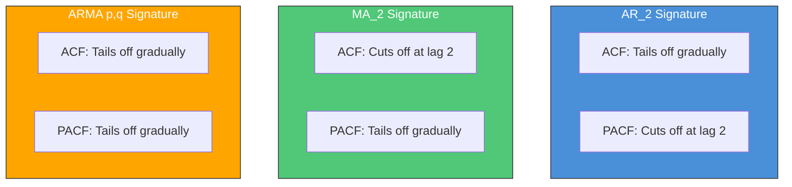

#### Memory Trick: "PACF-AR, ACF-MA"

> "The plot with the SAME first letter as the component tells you the ORDER by cutting off. The OTHER plot tails off."
> - **P**ACF tells you **p** (AR order)
> - **A**CF tells you **q** (MA order... wait, that's not 'A'... think "ACF = MA q")

Better mnemonic: **"PAR cuts, MAQ cuts"**
- **P**ACF → **A**R(p) → Cuts off
- ~~M~~**A**CF → **M**A(**q**) → Cuts off

---

### SARIMA: Seasonal ARIMA

**Notation**: SARIMA(p, d, q)(P, D, Q)m

| Part | Meaning |
|------|---------|
| **(p, d, q)** | Non-seasonal AR, I, MA orders |
| **(P, D, Q)** | Seasonal AR, I, MA orders |
| **m** | Seasonal period (12 for monthly, 4 for quarterly) |

**Full Model Equation**:
$$\Phi_P(B^m) \cdot \phi_p(B) \cdot (1-B^m)^D \cdot (1-B)^d \cdot Y_t = \Theta_Q(B^m) \cdot \theta_q(B) \cdot \varepsilon_t$$

**Breaking Down the Notation**:

| Component | Formula | Effect |
|-----------|---------|--------|
| $\phi_p(B)$ | $(1 - \phi_1 B - ... - \phi_p B^p)$ | Non-seasonal AR |
| $\Phi_P(B^m)$ | $(1 - \Phi_1 B^m - ... - \Phi_P B^{Pm})$ | Seasonal AR |
| $(1-B)^d$ | First difference d times | Non-seasonal trend removal |
| $(1-B^m)^D$ | Seasonal difference D times | Seasonal pattern removal |
| $\theta_q(B)$ | $(1 + \theta_1 B + ... + \theta_q B^q)$ | Non-seasonal MA |
| $\Theta_Q(B^m)$ | $(1 + \Theta_1 B^m + ... + \Theta_Q B^{Qm})$ | Seasonal MA |

**Example: SARIMA(1,1,1)(1,1,1)₁₂** for monthly data

This means:
- Non-seasonal: AR(1), difference once, MA(1)
- Seasonal: SAR(1), seasonal difference once, SMA(1)
- Period: 12 months

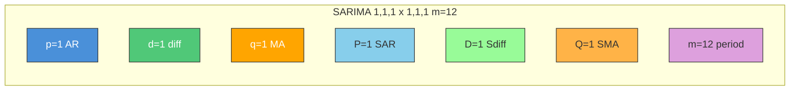

#### Seasonal ACF/PACF Patterns

| What to Look For | Indication |
|------------------|------------|
| Spikes at lags 12, 24, 36... | Strong seasonality at period 12 |
| Slow decay at seasonal lags | Need seasonal differencing (D≥1) |
| Single spike at lag 12 in ACF | SMA(1) - seasonal MA |
| Single spike at lag 12 in PACF | SAR(1) - seasonal AR |

---

### Residual Diagnostics Checklist

> [!IMPORTANT]
> **If You Remember ONE Thing**: Good residuals = white noise. Check: no autocorrelation, constant variance, approximately normal.

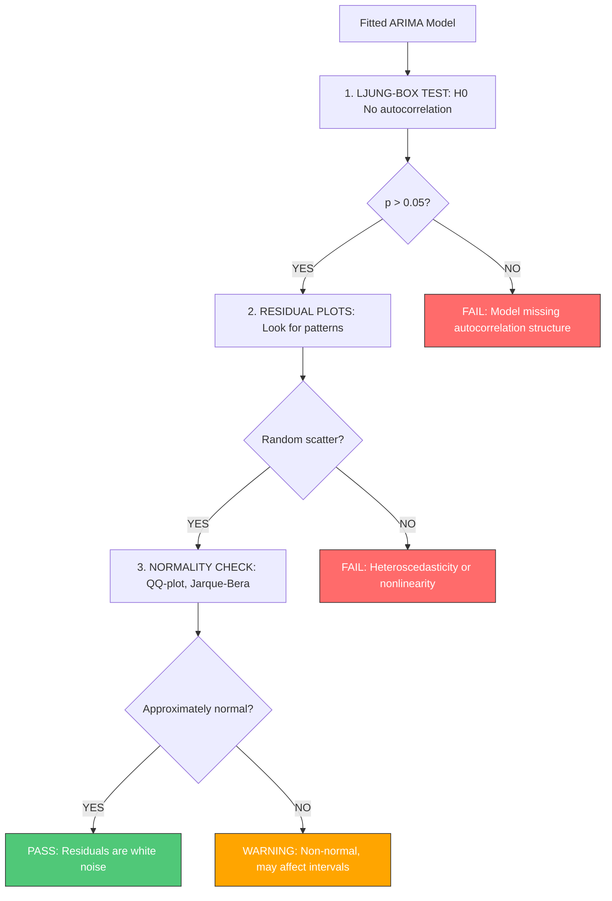

#### The 5-Point Diagnostic Checklist

| Check | What to Look For | If Fails |
|-------|------------------|----------|
| **1. Ljung-Box Test** | p > 0.05 at all tested lags | Add AR/MA terms |
| **2. ACF of Residuals** | All spikes inside bounds | Increase p or q |
| **3. Residual Plot vs Time** | No patterns, constant spread | Try variance transform |
| **4. Histogram** | Roughly bell-shaped | Check for outliers |
| **5. QQ-Plot** | Points on diagonal line | Consider robust methods |

**Python Diagnostic Code**:
```python
from statsmodels.stats.diagnostic import acorr_ljungbox
from statsmodels.graphics.tsaplots import plot_acf
import matplotlib.pyplot as plt
from scipy import stats

def diagnose_residuals(residuals, lags=20):
    """Complete residual diagnostic for ARIMA models."""
    fig, axes = plt.subplots(2, 2, figsize=(12, 8))
    
    # 1. Residual time plot
    axes[0, 0].plot(residuals)
    axes[0, 0].axhline(y=0, color='r', linestyle='--')
    axes[0, 0].set_title('Residuals Over Time')
    
    # 2. ACF of residuals
    plot_acf(residuals, lags=lags, ax=axes[0, 1])
    axes[0, 1].set_title('ACF of Residuals')
    
    # 3. Histogram
    axes[1, 0].hist(residuals, bins=30, density=True, alpha=0.7)
    axes[1, 0].set_title('Residual Distribution')
    
    # 4. QQ-plot
    stats.probplot(residuals, dist="norm", plot=axes[1, 1])
    axes[1, 1].set_title('QQ-Plot')
    
    plt.tight_layout()
    plt.show()
    
    # 5. Ljung-Box test
    lb_result = acorr_ljungbox(residuals, lags=lags, return_df=True)
    print("Ljung-Box Test (want p > 0.05):")
    print(lb_result[['lb_stat', 'lb_pvalue']].tail(5))
    
    if (lb_result['lb_pvalue'] < 0.05).any():
        print("\n[WARNING] Significant autocorrelation detected!")
    else:
        print("\n[PASS] Residuals appear to be white noise.")
```

---

### When ARIMA Fails

> [!WARNING]
> **If You Remember ONE Thing**: ARIMA assumes linear relationships and constant volatility. It fails on nonlinear dynamics, volatility clustering, and structural breaks.

#### ARIMA Limitations & Alternatives

| When ARIMA Fails | Why | Better Alternative |
|------------------|-----|-------------------|
| **Volatility clusters** (e.g., stock returns) | Assumes constant variance | GARCH, EGARCH |
| **Multiple seasonalities** | Only ONE seasonal period | Prophet, TBATS, MSTL+ARIMA |
| **Regime changes** | Assumes stable structure | Markov-Switching models |
| **Long memory** | Limited lag structure | ARFIMA (fractional) |
| **Nonlinear patterns** | Linear combinations only | Neural networks, XGBoost |
| **Many related series** | Fits one series at a time | VAR, Global models |
| **Sparse/intermittent data** | Assumes continuous | Croston's, SBA |

<details>
<summary><strong>[OPTIONAL] Deep Dive: How Markov-Switching Models Actually Work</strong></summary>

**Key Insight**: It is NOT a two-step "predict regime, then run ARIMA" process. It is **simultaneous estimation** — the model jointly estimates regime probabilities and regime-specific parameters via maximum likelihood using the Hamilton filter.

#### Model Structure (MS-AR with 2 Regimes)

$$y_t = \mu_{S_t} + \phi_{1,S_t} y_{t-1} + \cdots + \phi_{p,S_t} y_{t-p} + \sigma_{S_t} \varepsilon_t$$

Where $S_t \in \{1, 2\}$ is the **unobserved** regime governed by a transition matrix:

$$P = \begin{bmatrix} p_{11} & p_{12} \\ p_{21} & p_{22} \end{bmatrix}$$

- $p_{11}$ = probability of staying in regime 1
- $p_{12}$ = probability of switching from regime 1 to regime 2

#### What You Get Out

| Output | Description |
|--------|-------------|
| **Filtered probabilities** | $P(S_t = j \mid y_1, \ldots, y_t)$ — real-time regime estimate |
| **Smoothed probabilities** | $P(S_t = j \mid y_1, \ldots, y_T)$ — retrospective (uses full sample) |
| **Regime-specific coefficients** | Different $\mu$, $\phi$, $\sigma$ per regime |
| **Transition probabilities** | How likely is switching between regimes |

#### Forecasting: Probability-Weighted Blending

The model does not pick one regime — it **blends** forecasts weighted by regime probabilities:

$$\hat{y}_{t+1} = P(S_{t+1}=1 \mid \text{data}) \cdot \hat{y}_{t+1}^{\text{regime 1}} + P(S_{t+1}=2 \mid \text{data}) \cdot \hat{y}_{t+1}^{\text{regime 2}}$$

#### Python Example (`statsmodels`)

```python
import statsmodels.api as sm

# Fit a 2-regime Markov-Switching AR(2)
model = sm.tsa.MarkovAutoregression(
    y, k_regimes=2, order=2, switching_ar=True, switching_variance=True
)
result = model.fit()

# Smoothed regime probabilities
print(result.smoothed_marginal_probabilities)

# Regime-specific parameters
print(result.summary())
```

#### When to Use MS Models vs Plain ARIMA

| Scenario | Use |
|----------|-----|
| Stable, single-behavior series | ARIMA |
| Obvious structural breaks (few, known) | Fit separate ARIMAs on segments |
| **Recurring regime shifts** (expansions/recessions, bull/bear markets) | **Markov-Switching** |
| Regime changes + exogenous drivers of switching | Threshold models (TAR, STAR) |

**Interview Answer**: "Markov-Switching models jointly estimate which regime the process is in and the regime-specific dynamics in a unified likelihood framework. Forecasts are probability-weighted blends across regimes, not a two-step detect-then-model approach."

</details>

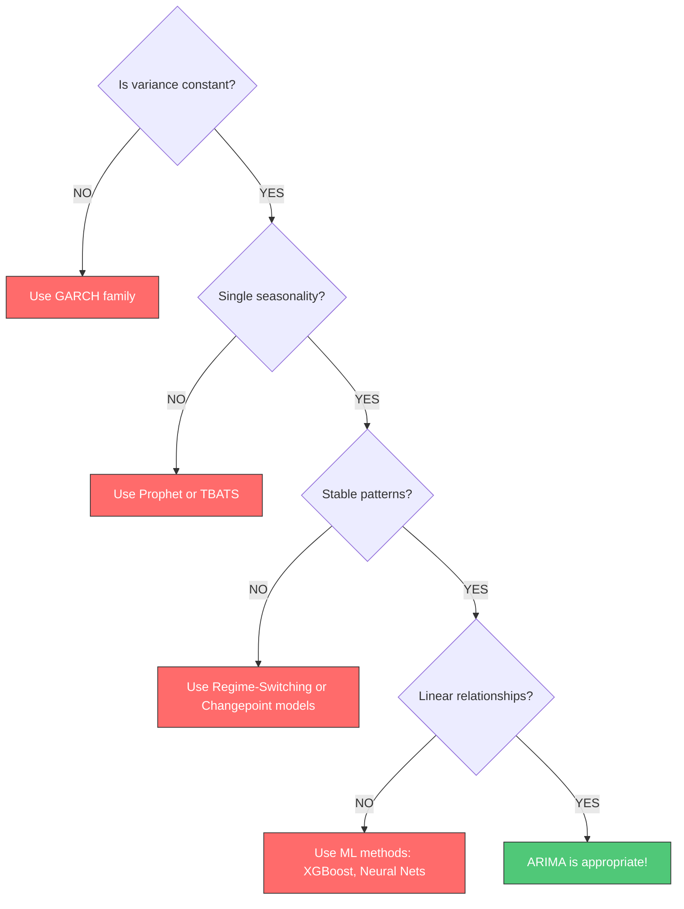

#### Common Candidate Mistakes with ARIMA

| Mistake | Why It's Wrong | Correct Approach |
|---------|----------------|------------------|
| Using ARIMA on non-stationary data | Violates fundamental assumption | Test stationarity first, difference if needed |
| Ignoring seasonal patterns | ARIMA can't handle untreated seasonality | Use SARIMA or decompose first |
| Over-differencing | d>2 rarely needed, creates MA signature | Check ACF lag-1 < -0.5 |
| Fitting without diagnostics | Model may have remaining patterns | Always check Ljung-Box and residual ACF |
| Using ARIMA on 10k+ series | Slow, no cross-learning | Use global models (LightGBM, DeepAR) |

---

### Python: statsmodels Implementation

```python
import pandas as pd
import numpy as np
from statsmodels.tsa.arima.model import ARIMA
from statsmodels.tsa.statespace.sarimax import SARIMAX
from statsmodels.tsa.stattools import adfuller, kpss
from statsmodels.graphics.tsaplots import plot_acf, plot_pacf
import matplotlib.pyplot as plt

# ============================================================
# STEP 1: Load and visualize data
# ============================================================
# Example: monthly airline passengers
# data = pd.read_csv('data.csv', parse_dates=['date'], index_col='date')
# series = data['passengers']

# ============================================================
# STEP 2: Test stationarity
# ============================================================
def check_stationarity(series):
    """Run ADF and KPSS tests to check stationarity."""
    print("=" * 50)
    print("STATIONARITY TESTS")
    print("=" * 50)
    
    # ADF test (H0: unit root exists = non-stationary)
    adf_result = adfuller(series.dropna())
    print(f"ADF Statistic: {adf_result[0]:.4f}")
    print(f"ADF p-value: {adf_result[1]:.4f}")
    print(f"  -> {'STATIONARY' if adf_result[1] < 0.05 else 'NON-STATIONARY'}")
    
    # KPSS test (H0: stationary)
    kpss_result = kpss(series.dropna(), regression='c')
    print(f"\nKPSS Statistic: {kpss_result[0]:.4f}")
    print(f"KPSS p-value: {kpss_result[1]:.4f}")
    print(f"  -> {'STATIONARY' if kpss_result[1] > 0.05 else 'NON-STATIONARY'}")
    
    return adf_result[1] < 0.05 and kpss_result[1] > 0.05

# ============================================================
# STEP 3: Determine differencing order (d)
# ============================================================
def find_differencing_order(series, max_d=2):
    """Find minimum differencing order for stationarity."""
    for d in range(max_d + 1):
        if d == 0:
            test_series = series
        else:
            test_series = series.diff(d).dropna()
        
        adf_pval = adfuller(test_series)[1]
        if adf_pval < 0.05:
            print(f"Differencing order d={d} achieves stationarity (ADF p={adf_pval:.4f})")
            return d
    
    print(f"Warning: Stationarity not achieved with d<={max_d}")
    return max_d

# ============================================================
# STEP 4: Plot ACF/PACF for order selection
# ============================================================
def plot_acf_pacf_for_order(series, lags=24):
    """Plot ACF and PACF to identify p and q."""
    fig, axes = plt.subplots(1, 2, figsize=(14, 4))
    
    plot_acf(series.dropna(), lags=lags, ax=axes[0])
    axes[0].set_title('ACF - Look for MA(q) order\n(ACF cuts off at lag q)')
    
    plot_pacf(series.dropna(), lags=lags, ax=axes[1])
    axes[1].set_title('PACF - Look for AR(p) order\n(PACF cuts off at lag p)')
    
    plt.tight_layout()
    plt.show()

# ============================================================
# STEP 5: Fit ARIMA model
# ============================================================
def fit_arima(series, order=(1, 1, 1)):
    """Fit ARIMA model and return results."""
    model = ARIMA(series, order=order)
    results = model.fit()
    
    print("=" * 50)
    print(f"ARIMA{order} Results")
    print("=" * 50)
    print(f"AIC: {results.aic:.2f}")
    print(f"BIC: {results.bic:.2f}")
    print("\nCoefficients:")
    print(results.params)
    
    return results

# ============================================================
# STEP 6: Fit SARIMA for seasonal data
# ============================================================
def fit_sarima(series, order=(1, 1, 1), seasonal_order=(1, 1, 1, 12)):
    """Fit SARIMA model for seasonal time series."""
    model = SARIMAX(series, 
                    order=order, 
                    seasonal_order=seasonal_order,
                    enforce_stationarity=False,
                    enforce_invertibility=False)
    results = model.fit(disp=False)
    
    print("=" * 50)
    print(f"SARIMA{order}x{seasonal_order} Results")
    print("=" * 50)
    print(f"AIC: {results.aic:.2f}")
    print(f"BIC: {results.bic:.2f}")
    
    return results

# ============================================================
# STEP 7: Model comparison with AIC/BIC
# ============================================================
def compare_models(series, orders_to_try):
    """Compare multiple ARIMA specifications."""
    results_list = []
    
    for order in orders_to_try:
        try:
            model = ARIMA(series, order=order)
            result = model.fit()
            results_list.append({
                'order': order,
                'aic': result.aic,
                'bic': result.bic
            })
        except Exception as e:
            print(f"Order {order} failed: {str(e)[:50]}")
    
    df = pd.DataFrame(results_list).sort_values('aic')
    print("\nModel Comparison (sorted by AIC):")
    print(df.to_string(index=False))
    
    return df

# ============================================================
# STEP 8: Forecast future values
# ============================================================
def forecast_arima(results, steps=12, alpha=0.05):
    """Generate forecasts with confidence intervals."""
    forecast = results.get_forecast(steps=steps)
    mean_forecast = forecast.predicted_mean
    conf_int = forecast.conf_int(alpha=alpha)
    
    print(f"\n{steps}-step ahead forecast:")
    print(mean_forecast)
    
    return mean_forecast, conf_int

# ============================================================
# FULL WORKFLOW EXAMPLE
# ============================================================
"""
# 1. Check stationarity
is_stationary = check_stationarity(series)

# 2. Find differencing order
d = find_differencing_order(series)

# 3. Difference the series
diff_series = series.diff(d).dropna()

# 4. Examine ACF/PACF
plot_acf_pacf_for_order(diff_series)

# 5. Fit and compare models
orders = [(1,d,0), (0,d,1), (1,d,1), (2,d,1), (1,d,2)]
comparison = compare_models(series, orders)

# 6. Fit best model
best_order = comparison.iloc[0]['order']
results = fit_arima(series, order=best_order)

# 7. Diagnose residuals
diagnose_residuals(results.resid)

# 8. Forecast
mean_fc, conf_int = forecast_arima(results, steps=12)
"""
```

---

> [!WARNING]
> **AIC Is Only Valid When `d` Is the Same.** Different `d` means the model is fitted on a different transformed series (first-diff vs second-diff), so the likelihoods are not comparable. This is why `auto_arima` fixes `d` first (via ADF/KPSS tests), then searches over `p` and `q` using AIC.

| Scenario | Use |
|---|---|
| Same `d`, comparing `p` and `q` | **AIC/BIC** — perfectly valid |
| Different `d` values | **Out-of-sample metrics** (RMSE, MAPE) via walk-forward CV on the **original (undifferenced) scale** |

---

### ARIMAX: Adding External Regressors [H]

> [!TIP]
> **If You Remember ONE Thing**: ARIMAX adds external drivers (promotions, price, weather) to ARIMA - critical for demand forecasting where past values alone aren't enough.

**When to Use ARIMAX**:
- Promotions, sales events, holidays with varying effects
- Price changes affecting demand
- Weather-sensitive products
- Competitor actions

**Formula**:
$$Y_t = c + \sum_{i=1}^{p} \phi_i Y_{t-i} + \sum_{j=1}^{q} \theta_j \varepsilon_{t-j} + \sum_{k=1}^{K} \beta_k X_{k,t} + \varepsilon_t$$

Where $X_{k,t}$ are K external regressors at time t.

#### Known vs Unknown Future Regressors

| Regressor Type | Examples | How to Handle |
|----------------|----------|---------------|
| **Known future** | Holidays, planned promotions, calendar features | Use directly in forecast |
| **Unknown future** | Competitor prices, weather | Must forecast separately or use scenarios |

> [!WARNING]
> **Common Mistake**: Using regressors you won't know at forecast time. If you can't know tomorrow's weather, you can't use tomorrow's weather as a regressor (unless you also forecast it).

#### Python: SARIMAX with Exogenous Variables

```python
from statsmodels.tsa.statespace.sarimax import SARIMAX
import pandas as pd

# Example: forecasting with promotion and price regressors
# X_train, X_test are DataFrames with columns ['promotion', 'price']

model = SARIMAX(
    y_train,
    exog=X_train,  # External regressors
    order=(1, 1, 1),
    seasonal_order=(1, 1, 1, 12)
)
results = model.fit(disp=False)

# Forecast requires future values of regressors
forecast = results.get_forecast(
    steps=12,
    exog=X_test  # MUST provide future regressor values
)
print(forecast.predicted_mean)
```

#### Trade-offs: ARIMAX vs ML for Regressors

| Aspect | ARIMAX | ML (XGBoost/LightGBM) |
|--------|--------|----------------------|
| **Interpretability** | High - coefficients are meaningful | Lower - feature importance only |
| **Many regressors** | Can struggle (collinearity) | Handles well |
| **Nonlinear effects** | No (add manually) | Yes (automatic) |
| **Temporal structure** | Built-in through ARIMA | Must engineer lag features |
| **Scale** | One series at a time | Can train globally on many series |

**Interview Answer**: "For a few key regressors with interpretability needs, I'd use ARIMAX. For many regressors or complex interactions, I'd switch to ML-based approaches with proper time series cross-validation."

---

### Auto-ARIMA: Automated Order Selection [M]

> [!TIP]
> **If You Remember ONE Thing**: `pmdarima.auto_arima()` automates Box-Jenkins order selection, but always validate with diagnostics.

**Why Auto-ARIMA Exists**:
- Manual ACF/PACF interpretation is subjective
- Grid searching all (p,d,q) combinations is slow
- Production pipelines need automation

#### Python: pmdarima

```python
import pmdarima as pm

# Automatic ARIMA order selection
model = pm.auto_arima(
    series,
    start_p=0, max_p=3,       # AR bounds
    start_q=0, max_q=3,       # MA bounds
    d=None,                    # Auto-detect differencing
    seasonal=True,             # Enable seasonal component
    m=12,                      # Seasonal period
    start_P=0, max_P=2,       # Seasonal AR bounds
    start_Q=0, max_Q=2,       # Seasonal MA bounds
    D=None,                    # Auto-detect seasonal differencing
    stepwise=True,             # Stepwise search (faster)
    suppress_warnings=True,
    error_action='ignore',
    trace=True                 # Show search progress
)

print(model.summary())
print(f"Best order: {model.order}, Seasonal: {model.seasonal_order}")

# Forecast
forecast = model.predict(n_periods=12)
```

#### Stepwise vs Grid Search

| Approach | Speed | Coverage | Use When |
|----------|-------|----------|----------|
| **Stepwise** (default) | Fast | May miss global optimum | Production, many series |
| **Grid search** (`stepwise=False`) | Slow | Exhaustive | Final model, important series |

#### When to Trust Auto-ARIMA vs Manual

| Trust Auto-ARIMA | Override Manually |
|------------------|-------------------|
| Many series to forecast | Single critical forecast |
| Good residual diagnostics | Residuals show patterns |
| Stable historical patterns | Known structural changes |
| Time pressure | Have domain knowledge about orders |

> [!WARNING]
> **Auto-ARIMA Gotcha**: Always check residuals! Auto-ARIMA minimizes AIC but doesn't guarantee white noise residuals.

```python
# Always validate auto_arima output
from statsmodels.stats.diagnostic import acorr_ljungbox

residuals = model.resid()
lb_test = acorr_ljungbox(residuals, lags=[10, 20], return_df=True)
print("Ljung-Box Test (want p > 0.05):")
print(lb_test)
```

---

## 4.2.2 Exponential Smoothing [M]

### One-Liner & Intuition

> [!TIP]
> **If You Remember ONE Thing**: Exponential smoothing = weighted average where recent observations get exponentially more weight than older ones.

**One-Liner (≤15 words)**: *Weighted average of past values where recent data matters more, decaying exponentially.*

**Intuition (Everyday Analogy)**: 
Think of how you remember things. Yesterday is vivid, last week is fuzzy, last year is a blur. Exponential smoothing works the same way - it "forgets" old data exponentially, giving most weight to recent observations.

**Why This Exists**: Simple, fast, and often surprisingly effective. When you need a quick baseline forecast that captures level, trend, and seasonality without complex model selection.

---

### SES → Holt → Holt-Winters Progression

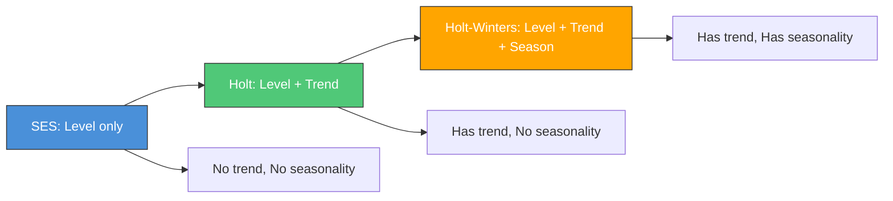

#### Simple Exponential Smoothing (SES)

**When to Use**: No trend, no seasonality (flat data with noise)

**Formula**:
$$\hat{y}_{t+1} = \alpha y_t + (1-\alpha) \hat{y}_t$$

Or equivalently (level form):
$$\ell_t = \alpha y_t + (1-\alpha) \ell_{t-1}$$

**Parameters**:
- $\alpha$ (0 to 1): Smoothing factor
  - High α (→1): More weight on recent data (responsive but noisy)
  - Low α (→0): More weight on history (smooth but slow to adapt)

**Intuition**: "Tomorrow's forecast = α × today's actual + (1-α) × today's forecast"

---

#### Holt's Method (Double Exponential Smoothing)

**When to Use**: Has trend, no seasonality

**Equations**:
$$\ell_t = \alpha y_t + (1-\alpha)(\ell_{t-1} + b_{t-1}) \quad \text{(Level)}$$
$$b_t = \beta (\ell_t - \ell_{t-1}) + (1-\beta) b_{t-1} \quad \text{(Trend)}$$

**In Plain English** (computed in order, no circularity):
- **Level**: New level = blend of (today's actual value) and (yesterday's level + yesterday's trend)
- **Trend**: New trend = blend of (observed slope from $\ell_{t-1}$ to $\ell_t$) and (yesterday's trend)

**Forecast**:
$$\hat{y}_{t+h} = \ell_t + h \cdot b_t$$

**Parameters**:
- α: Level smoothing (0-1)
- β: Trend smoothing (0-1)

**Intuition**: Separately track "where we are" (level) and "where we're going" (trend).

---

#### Holt-Winters (Triple Exponential Smoothing)

**When to Use**: Has trend AND seasonality

**Two Variants**:

| Variant | Formula for Season | When to Use |
|---------|-------------------|-------------|
| **Additive** | $s_t = \gamma(y_t - \ell_t) + (1-\gamma)s_{t-m}$ | Constant seasonal amplitude |
| **Multiplicative** | $s_t = \gamma(y_t / \ell_t) + (1-\gamma)s_{t-m}$ | Seasonal amplitude grows with level |

**Additive Equations**:
$$\ell_t = \alpha(y_t - s_{t-m}) + (1-\alpha)(\ell_{t-1} + b_{t-1})$$
$$b_t = \beta(\ell_t - \ell_{t-1}) + (1-\beta)b_{t-1}$$
$$s_t = \gamma(y_t - \ell_t) + (1-\gamma)s_{t-m}$$

**In Plain English** (computed in order: level -> trend -> season):
- **Level**: Strip out last year's seasonal effect ($y_t - s_{t-m}$), then blend with (yesterday's level + yesterday's trend)
- **Trend**: Same as Holt -- blend of (observed slope) and (previous trend)
- **Season**: Blend of (what's left after removing the level: $y_t - \ell_t$) and (last year's seasonal factor $s_{t-m}$)

**Forecast**:
$$\hat{y}_{t+h} = \ell_t + h \cdot b_t + s_{t+h-m}$$

> Forecast = current level + (steps ahead x trend) + seasonal factor from the same season last cycle

**Parameters**:
- α: Level smoothing
- β: Trend smoothing
- γ: Seasonal smoothing
- m: Seasonal period


---

#### Damped Trends [OPTIONAL]

> [!NOTE]
> **Depth Level**: [OPTIONAL] - Know conceptually. Damped trends frequently win in forecasting competitions.

**Problem with undamped trends**: Standard Holt/Holt-Winters project the trend forever at the same rate. Real-world trends almost always slow down.

**Solution**: Add a damping parameter $\phi$ (0 < $\phi$ < 1) that **shrinks the trend each step**.

**Undamped vs Damped Holt** (only the differences shown):

| | Undamped Holt | Damped Holt |
|---|---|---|
| **Level** | $\ell_t = \alpha y_t + (1-\alpha)(\ell_{t-1} + b_{t-1})$ | $\ell_t = \alpha y_t + (1-\alpha)(\ell_{t-1} + \phi b_{t-1})$ |
| **Trend** | $b_t = \beta(\ell_t - \ell_{t-1}) + (1-\beta)b_{t-1}$ | $b_t = \beta(\ell_t - \ell_{t-1}) + (1-\beta)\phi b_{t-1}$ |
| **Forecast** | $\ell_t + h \cdot b_t$ (linear forever) | $\ell_t + (\phi + \phi^2 + \cdots + \phi^h) b_t$ (flattens) |

**In plain English**: At each future step, the trend contribution is multiplied by phi again, so it compounds downward. With phi = 0.9 and trend = 10: step 1 adds 9, step 2 adds 8.1, step 10 adds 3.5, eventually near zero.

**Additive vs Multiplicative Damping:**

| Aspect | Additive Damped (Ad) | Multiplicative Damped (Md) |
|---|---|---|
| **What fades** | Absolute slope (e.g., +5 units/period) | Growth rate (e.g., +10%/period) |
| **Best for** | Trends in units (sales count) | Trends in percentages (revenue growth) |

**When to use damped trends:**
- Long forecast horizons (>1 seasonal cycle)
- No strong reason to believe the trend persists indefinitely
- When in doubt -- damped trends are a safer default

> [!TIP]
> **Interview tip**: "I default to damped trends in production for two reasons. First, the M3 and M4 forecasting competitions consistently showed damped models outperform undamped ones for horizons beyond one seasonal cycle. Second, the business cost of undamped extrapolation is concrete: an undamped upward trend that continues for two years produces excess inventory and wrong capacity plans; an undamped downward trend triggers premature cost-cutting. The damped model hedges this by having the trend gradually converge to zero — it's the more conservative and empirically validated choice."

---

### Explain to a PM: Exponential Smoothing

> **PM-Friendly Version**:
> 
> "Exponential smoothing is like averaging, but smarter. Instead of treating all past data equally, it gives more weight to recent data. Think of it like your memory - yesterday is crystal clear, last week is fuzzy, last month is just a vague impression.
> 
> We have three versions:
> - **Simple**: Just tracks the current level (good for stable data)
> - **Holt**: Tracks level + where it's heading (good for trends)
> - **Holt-Winters**: Tracks level + trend + seasonal patterns (good for monthly sales)
> 
> It's fast to compute and often works surprisingly well as a first baseline."

---

### ETS Notation Decoder

**ETS = Error, Trend, Seasonal**

Each component can be: **N**one, **A**dditive, **M**ultiplicative, or **A**dditive-**d**amped

| Letter | Error (E) | Trend (T) | Seasonal (S) |
|--------|-----------|-----------|--------------|
| **N** | - | No trend | No seasonality |
| **A** | Additive | Additive (linear) | Additive |
| **M** | Multiplicative | Multiplicative (exponential) | Multiplicative |
| **Ad** | - | Additive damped | - |
| **Md** | - | Multiplicative damped | - |

#### Common ETS Models

| ETS Code | Common Name | Use Case |
|----------|-------------|----------|
| **ETS(A,N,N)** | SES | No trend, no seasonality |
| **ETS(A,A,N)** | Holt (additive trend) | Linear trend, no seasonality |
| **ETS(A,Ad,N)** | Damped Holt | Trend that levels off |
| **ETS(A,A,A)** | Holt-Winters additive | Linear trend + additive season |
| **ETS(A,A,M)** | Holt-Winters multiplicative | Linear trend + multiplicative season |
| **ETS(M,A,M)** | Multiplicative HW | Very common for retail sales |

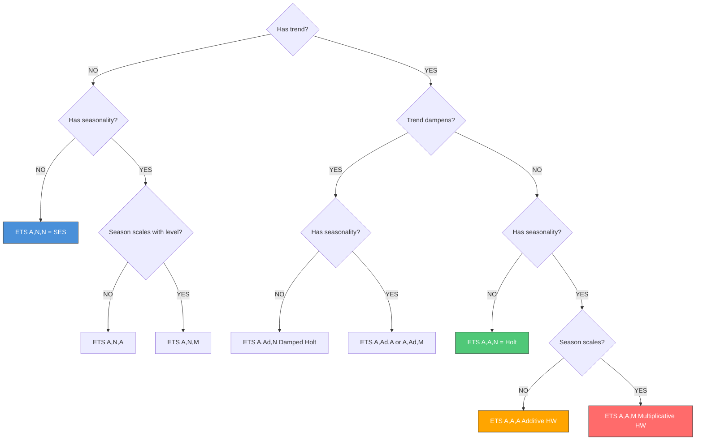

---

### State-Space Formulation

> [!NOTE]
> **Depth Level**: This is [M] Medium priority - understand conceptually for sophisticated discussions.

ETS models can be written in state-space form, which enables:
- Maximum likelihood estimation
- Proper prediction intervals
- Model comparison via likelihood

**General Form**:
$$y_t = h(x_{t-1}) + k(x_{t-1})\varepsilon_t \quad \text{(Observation equation)}$$
$$x_t = f(x_{t-1}) + g(x_{t-1})\varepsilon_t \quad \text{(State equation)}$$

Where:
- $x_t$ = state vector (level, trend, seasonal components)
- $\varepsilon_t$ = error term
- $h, k, f, g$ = functions defining the specific ETS model

**Why It Matters**:
1. **Unified framework**: All exponential smoothing methods are special cases
2. **Automatic selection**: Can let software choose best ETS variant via AIC
3. **Proper uncertainty**: State-space gives principled prediction intervals

**Python Implementation**:
```python
from statsmodels.tsa.holtwinters import ExponentialSmoothing
from statsmodels.tsa.exponential_smoothing.ets import ETSModel

# Holt-Winters
hw_model = ExponentialSmoothing(
    series,
    trend='add',           # 'add', 'mul', or None
    seasonal='mul',        # 'add', 'mul', or None  
    seasonal_periods=12,
    damped_trend=False
).fit()

# ETS with automatic optimization
ets_model = ETSModel(
    series,
    error='add',           # 'add' or 'mul'
    trend='add',           # 'add', 'mul', or None
    seasonal='mul',        # 'add', 'mul', or None
    seasonal_periods=12,
    damped_trend=False
).fit()

print(f"AIC: {ets_model.aic:.2f}")
forecast = ets_model.forecast(steps=12)
```

---

### When to Prefer ETS Over ARIMA

| Choose ETS When | Choose ARIMA When |
|-----------------|-------------------|
| Quick baseline needed | Complex autocorrelation structure |
| Interpretable components wanted | External regressors needed (ARIMAX) |
| Multiplicative relationships | Non-seasonal differencing sufficient |
| Automatic model selection via AIC | Need lag-specific control |
| Damped trends expected | Long memory patterns |

#### Trade-offs Table

| Aspect | ETS | ARIMA |
|--------|-----|-------|
| **Interpretability** | High (level, trend, season clear) | Medium (coefficients less intuitive) |
| **Flexibility** | Lower | Higher (any p,d,q combination) |
| **Exogenous variables** | No | Yes (ARIMAX) |
| **Computation speed** | Fast | Moderate |
| **Multiple seasonalities** | No (use TBATS) | No (use Prophet) |
| **Automated selection** | Good | Requires expertise |

---

## 4.2.3 Vector Autoregression (VAR) [L]

> [!NOTE]
> **Depth Level**: This is [L] Low priority - familiarity only. Know it exists and when it's appropriate.

### One-Liner & Intuition

**One-Liner (≤15 words)**: *Multivariate ARIMA where each series depends on lagged values of ALL series.*

**Intuition (Everyday Analogy)**: 
Think of a household budget. Your spending today depends on last month's spending AND last month's income. Meanwhile, your income might depend on previous savings decisions. Everything affects everything else with lags. VAR captures these cross-dependencies.

**When to Use VAR**:
- Multiple related time series (price & demand, supply & inventory)
- You care about cross-series dynamics and interactions
- Need to understand how shocks propagate across series

### Formula

For a VAR(1) with two series:

$$\begin{bmatrix} Y_{1,t} \\ Y_{2,t} \end{bmatrix} = \begin{bmatrix} c_1 \\ c_2 \end{bmatrix} + \begin{bmatrix} \phi_{11} & \phi_{12} \\ \phi_{21} & \phi_{22} \end{bmatrix} \begin{bmatrix} Y_{1,t-1} \\ Y_{2,t-1} \end{bmatrix} + \begin{bmatrix} \varepsilon_{1,t} \\ \varepsilon_{2,t} \end{bmatrix}$$

**Key insight**: $\phi_{12}$ captures how series 2's past affects series 1's present (and vice versa).

### Key Concepts

| Concept | What It Does | Example |
|---------|-------------|---------|
| **Impulse Response** | Shows how a shock to one series propagates to others over time | "Price increase → demand drop → inventory buildup" |
| **Granger Causality** *(GRAYN-jer)* | Tests if one series helps predict another (temporal, not causal!) | "Does advertising Granger-cause sales?" |
| **Variance Decomposition** | How much of series A's variance is explained by shocks to series B | "60% of demand variance comes from price shocks" |

> [!WARNING]
> **Interview Gotcha**: Granger causality tests temporal precedence, NOT true causation. A series Granger-causes another if it improves predictions, but this could still be confounding.

<details>
<summary><strong>Granger Causality: Direction of Influence? [OPTIONAL]</strong> (click to expand)</summary>

**Does VAR prove causal direction?** No. VAR gives you **temporal lead-lag relationships**, not causation.

| What VAR/Granger tells you | What it does NOT tell you |
|---|---|
| X's past improves prediction of Y | Whether X actually *causes* Y |
| Which series moves first (temporal ordering) | Whether a hidden variable Z drives both |
| Magnitude of dynamic influence (impulse response) | True causal mechanism |

**Does Granger causality require VAR?** No. It's just an F-test comparing two regressions:
1. Y on its own lags (restricted)
2. Y on its own lags + X's lags (unrestricted)
3. If X's lags are jointly significant, X Granger-causes Y

```python
# Standalone Granger test (no VAR needed)
from statsmodels.tsa.stattools import grangercausalitytests
grangercausalitytests(data[['Y', 'X']], maxlag=4)
```

VAR is simply a convenient framework that tests both directions and adds impulse response / variance decomposition on top.

**Interview answer**: "Granger causality identifies temporal precedence -- useful for forecasting and leading indicators, but not causal claims. For causal direction, I'd need an identification strategy like an instrument or natural experiment."

</details>
### Python: VAR with statsmodels

```python
from statsmodels.tsa.api import VAR
import pandas as pd

# data: DataFrame with columns ['price', 'demand', 'inventory']
model = VAR(data)

# Select lag order using information criteria
lag_order = model.select_order(maxlags=12)
print(lag_order.summary())

# Fit VAR with selected order
results = model.fit(lag_order.aic)

# Impulse response analysis
irf = results.irf(periods=12)
irf.plot(orth=True)  # Orthogonalized impulse responses

# Granger causality test
granger_test = results.test_causality('demand', 'price', kind='f')
print(f"Price Granger-causes Demand: p={granger_test.pvalue:.4f}")

# Forecast
forecast = results.forecast(data.values[-results.k_ar:], steps=12)
```

### Granger Causality: The Key Gotcha

> [!IMPORTANT]
> **Granger causality ≠ true causality.** This is one of the most common interview gotchas for economics/supply chain AS roles. An interviewer may ask: *"You found that price Granger-causes demand. What does that mean?"*

**What Granger Causality tests**: Whether past values of series X help predict series Y, *beyond* what past values of Y alone can predict.

**Hypotheses**:
- **H₀**: X does NOT Granger-cause Y (past X adds no predictive power)
- **H₁**: X Granger-causes Y (past X improves forecasts of Y)
- **p < 0.05**: Reject H₀ → X Granger-causes Y (in the statistical sense)

**Why it is NOT true causation**:

| Scenario | What you see | What's actually happening |
|----------|--------------|--------------------------|
| Common cause | Advertising Granger-causes sales AND inventory | Both driven by quarterly planning cycles |
| Reverse causation | Price Granger-causes demand | Low demand already happened → prices were cut in response |
| Spurious | Ice cream sales Granger-cause drowning rates | Both driven by hot weather (common confounder) |

**The correct interview answer**:
> *"Granger causality means past price values help predict future demand — it's a temporal precedence test. It does NOT mean price causes demand in the causal sense. Confounders (e.g., a seasonal promotion that affects both) or reverse causation could explain it. To establish true causal effect of price on demand, I'd need an instrument, a randomized price test, or a quasi-experimental design."*

**Practical use**: Despite the name, Granger causality IS useful for:
- Feature selection in ML pipelines (does X carry predictive signal for Y?)
- Lead-lag relationship discovery (which series leads and which follows?)
- Sanity checks on VAR model structure (should these series even be modeled jointly?)

### When VAR Fails

| Limitation | Why | Alternative |
|------------|-----|-------------|
| **Many series** | Curse of dimensionality (parameters grow as n²) | Use regularized VAR or ML |
| **High-frequency** | Computational burden | Reduce to key series |
| **Nonlinear dynamics** | Linear model only | Neural approaches |
| **Mixed frequencies** | Requires same frequency | MIDAS or alignment |

### Interview Context

**Q: "When would you use VAR instead of separate ARIMA models?"**

**A**: "When I care about cross-series dynamics - how one series affects another. For example, modeling price and demand together because price changes affect future demand, which might then affect future pricing decisions. VAR captures these feedback loops that independent ARIMA models would miss."

---

## 4.2.4 Cointegration and Error Correction Models [M]

> [!NOTE]
> **Depth Level**: [M] Medium priority. For economics and supply chain AS roles, "how do you model two non-stationary series that move together?" is a real interview question.

### One-Liner & Intuition

**One-Liner**: *Two non-stationary series are cointegrated if they share a long-run equilibrium — they can drift apart short-term but always return.*

**Intuition (Everyday Analogy)**:
Think of a drunk person walking their dog on a leash. Each is walking a random path (non-stationary), but the leash keeps them from drifting too far apart. Individually, neither path is predictable. Together, they are cointegrated — the distance between them is stationary.

**Supply chain example**: Raw material prices and finished goods prices. Both drift over time (non-stationary), but the spread between them is bounded by the margin floor (production cost constraint). If the spread gets too wide, market forces correct it.

---

### What Cointegration Means

| Question | Answer |
|----------|--------|
| **What is it?** | Two I(1) series whose linear combination is I(0) — stationary |
| **Why does it matter?** | Regressing one non-stationary series on another gives spurious results UNLESS they are cointegrated |
| **The formula** | If $Y_t$ and $X_t$ are both I(1) but $Y_t - \beta X_t = u_t$ is I(0), they are cointegrated |
| **What $u_t$ is** | The "error correction" term — how far they are from equilibrium right now |

---

### Testing for Cointegration

**Step 1: Engle-Granger (two-step)**
1. Regress $Y_t$ on $X_t$ (OLS)
2. Test residuals for stationarity with ADF
3. If residuals are stationary → series are cointegrated

**Step 2: Johansen Test (for more than 2 series)**
- Tests how many cointegrating relationships exist among k series
- Returns "trace statistic" and "max eigenvalue statistic"
- Used before fitting VECM

```python
from statsmodels.tsa.stattools import coint
from statsmodels.tsa.vector_ar.vecm import coint_johansen

# Engle-Granger: test if two series are cointegrated
score, pvalue, _ = coint(price_series, demand_series)
print(f"Cointegration p-value: {pvalue:.4f}")
# p < 0.05 → cointegrated (use ECM, not VAR on levels)

# Johansen: test cointegration rank for multiple series
result = coint_johansen(data_matrix, det_order=0, k_ar_diff=1)
print(result.lr1)   # Trace statistics
print(result.cvt)   # Critical values
```

---

### Error Correction Model (ECM / VECM)

If series are cointegrated, the **correct** model is an Error Correction Model, NOT a plain VAR on levels.

**The ECM adds a correction term**:
$$\Delta Y_t = \alpha_0 + \alpha_1 \Delta X_{t-1} + \lambda (Y_{t-1} - \beta X_{t-1}) + \varepsilon_t$$

Where:
- $\Delta Y_t$ = change in Y (short-run dynamics)
- $\lambda (Y_{t-1} - \beta X_{t-1})$ = **error correction term** (how much of last period's deviation from equilibrium is corrected this period)
- $\lambda$ should be negative (0 to -1): if $Y$ was too high last period, $\Delta Y$ is pulled down

**Intuition**: The model says "change in Y this period = short-run dynamics + correction of how far we drifted from equilibrium last period."

```python
from statsmodels.tsa.vector_ar.vecm import VECM

# Fit VECM (Vector Error Correction Model)
vecm = VECM(data, k_ar_diff=2, coint_rank=1)  # coint_rank from Johansen test
result = vecm.fit()
print(result.summary())

# Forecast
forecast = result.predict(steps=12)
```

---

### Decision Tree: VAR vs VECM vs Separate ARIMA

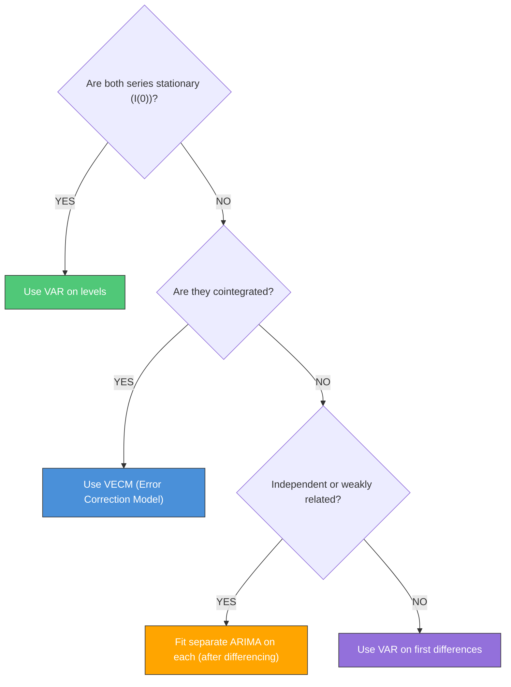

**Interview Answer**: *"Before modeling two non-stationary series together, I test for cointegration with Johansen or Engle-Granger. If cointegrated, I use VECM which explicitly models the long-run equilibrium relationship. If not cointegrated, I difference both series and use VAR on the differences. Using VAR on non-stationary, non-cointegrated series produces spurious inference."*

---

## 4.2.5 Structural Break Detection [M]

> [!NOTE]
> **Depth Level**: [M] Medium priority, but the practical question — *"How do you handle COVID-19 era data in your training set?"* — is essentially guaranteed in supply chain AS interviews.

### One-Liner

**One-Liner**: *A structural break is a sudden, permanent change in the data-generating process — trends, variance, or seasonal patterns shift in a way the model wasn't trained for.*

### Why This Matters in Supply Chain

COVID-19 created a once-in-a-century stress test for demand forecasting. Models trained on 2015–2019 data had learned demand patterns that simply no longer existed in 2020–2022. Every supply chain team faced this question: *include or exclude the COVID period in future training data?*

---

### Detecting Structural Breaks

#### Method 1: Visual Inspection (First Pass, Always)

Plot the series and look for: sudden level shifts, trend reversals, variance changes, or seasonality changes. Often the fastest diagnostic for a senior candidate — *"I look at the data first."*

#### Method 2: Chow Test (Single Known Breakpoint)

Tests whether the coefficients of a regression model are the same before and after a known date.

**H₀**: No structural break at the candidate date
**H₁**: Model parameters differ before and after

```python
import numpy as np
import statsmodels.api as sm
from scipy import stats

def chow_test(y, X, breakpoint_idx):
    """
    Chow test for structural break at a known breakpoint.
    H0: No structural break. p < 0.05 → break detected.
    """
    n = len(y)
    k = X.shape[1]  # Number of regressors

    # Full model
    model_full = sm.OLS(y, X).fit()
    rss_full = model_full.ssr

    # Sub-models
    model_1 = sm.OLS(y[:breakpoint_idx], X[:breakpoint_idx]).fit()
    model_2 = sm.OLS(y[breakpoint_idx:], X[breakpoint_idx:]).fit()
    rss_restricted = model_1.ssr + model_2.ssr

    # Chow F-statistic
    f_stat = ((rss_full - rss_restricted) / k) / (rss_restricted / (n - 2 * k))
    p_value = 1 - stats.f.cdf(f_stat, k, n - 2 * k)

    print(f"Chow F-statistic: {f_stat:.4f}, p-value: {p_value:.4f}")
    return f_stat, p_value
```

#### Method 3: CUSUM Test (Unknown Breakpoint, Continuous Monitoring)

Cumulative sum of recursive residuals. If the CUSUM drifts outside the 95% confidence band → structural instability.

```python
from statsmodels.stats.diagnostic import breaks_cusumolsresid

# CUSUM test for structural stability
cusum_result = breaks_cusumolsresid(model.resid)
print(f"CUSUM test p-value: {cusum_result[1]:.4f}")
# p < 0.05 → evidence of structural break
```

#### Method 4: Bai-Perron (Multiple Unknown Breakpoints)

The state-of-the-art for detecting multiple breaks without specifying their dates. Computationally intensive but fully automated.

```python
# Using ruptures library (pip install ruptures)
import ruptures as rpt

# Detect up to 3 breakpoints in the series
algo = rpt.Pelt(model="rbf").fit(series.values)
breakpoints = algo.predict(pen=10)  # pen controls sensitivity
print(f"Detected breakpoints at indices: {breakpoints}")
```

---

### The Three Production Strategies for Structural Breaks

| Strategy | When to Use | Trade-off |
|----------|-------------|-----------|
| **Truncate pre-break data** | Break is permanent, old data is misleading | Lose historical sample size; good for post-COVID models |
| **Regime indicator variable** | Break is identifiable with a dummy variable | ARIMAX with a `covid_period=1` column; interpretable but assumes break is clean |
| **Separate models per regime** | Patterns are fundamentally different across regimes | Best accuracy per period, but requires knowing when regime changes |

> [!TIP]
> **The COVID interview answer**: *"I'd first test for a structural break around March 2020 using CUSUM or Chow test. If confirmed, I have three options: (1) truncate training data to post-April 2020 if I believe old patterns are irrelevant; (2) add a COVID indicator variable in ARIMAX to absorb the level shift; or (3) fit separate models for pre- and post-COVID periods. I'd compare all three on a 2021–2022 holdout set. For most supply chain series, truncating to post-COVID + recent data wins because the old demand patterns are simply gone."*

---

### Changepoints vs Structural Breaks

| Concept | What It Is | Where It Appears |
|---------|-----------|-----------------|
| **Structural break** | Statistical test for regime change; formal hypothesis test | Classical econometrics; Chow, CUSUM |
| **Changepoint** | Prophet's automatic detection of trend bends; more flexible | Prophet `changepoint_prior_scale` |
| **Regime switching** | Probabilistic model of latent state transitions (Markov) | Markov-Switching AR model |

For interview purposes: mention Chow test for known breaks, Bai-Perron / CUSUM for unknown breaks, and Prophet changepoints for automated trend detection.

---

## ARIMA vs ETS Decision Flowchart

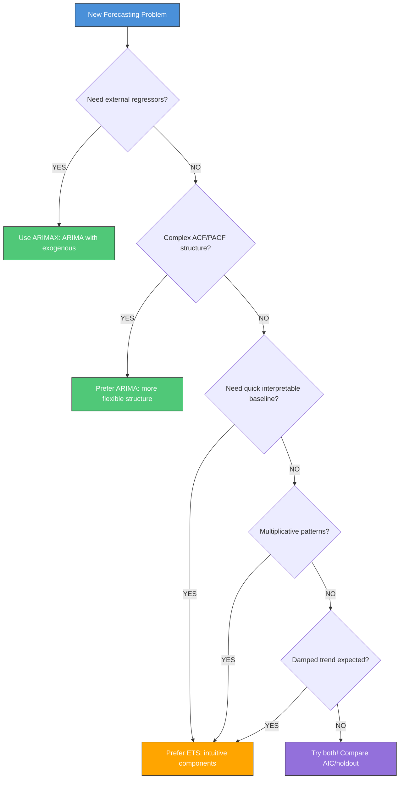

> [!TIP]
> **Interview Pro Tip**: If asked "ARIMA or ETS?", the best answer is "I'd try both and compare with cross-validation." This shows you understand that model selection should be empirical, not dogmatic.

---

## Company-Specific Angles

### Amazon: Scale & Automation

**Context**: Amazon forecasts demand for 400M+ products across multiple fulfillment centers.

| What Amazon Cares About | How to Frame Your Answer |
|------------------------|-------------------------|
| **Scale** | "ARIMA doesn't scale to millions of series. I'd use ARIMA for prototyping at category level, then switch to global models (DeepAR, LightGBM) for production." |
| **Automation** | "For automated pipelines, ETS with auto-selection is more robust than ARIMA which can fail to converge." |
| **Cold start** | "Classical methods need history. For new products, I'd use attribute-based models or similar-product matching." |
| **Hierarchical** | "Individual SKU ARIMA forecasts won't add up to category forecasts. Need reconciliation." |

<details>
<summary><strong>Why Don't Forecasts Add Up? (Hierarchical Reconciliation) [OPTIONAL]</strong> (click to expand)</summary>

**The problem**: If you fit separate models to each SKU *and* to the category total, the SKU forecasts won't sum to the category forecast. They're **incoherent** -- different models produce different views of the same reality.

**Example**: Three SKU ARIMA forecasts sum to 330 units, but the category-level ARIMA says 310. The warehouse and shelf-stocking teams now have conflicting numbers.

**Three reconciliation approaches**:

| Approach | Method | Trade-off |
|---|---|---|
| **Bottom-up** | Forecast SKUs, sum up | Good SKU detail, noisy at top |
| **Top-down** | Forecast category, split by historical proportions | Smooth totals, loses SKU patterns |
| **Optimal (MinT)** | Forecast all levels, mathematically adjust to be coherent | Best accuracy, more complex |

**Why Amazon cares**: 6+ hierarchy levels (Company > BU > Category > Subcategory > Brand > SKU > FC). Every level has stakeholders needing coherent numbers.

</details>

**Sample Question**: *"We need to forecast 100k SKUs daily. Would you use ARIMA?"*

**Strong Answer**: "ARIMA at that scale would be computationally expensive and require extensive automation for order selection. I'd use ARIMA/ETS for detailed analysis of key SKUs and aggregated categories, but for the full 100k, I'd recommend a global model like LightGBM or DeepAR that can cross-learn patterns across products and handle automation better."

---

### Meta: Experimentation & Uncertainty

**Context**: Meta's forecasting spans ads revenue, user engagement, and experiment analysis.

| What Meta Cares About | How to Frame Your Answer |
|----------------------|-------------------------|
| **Experiment design** | "Forecasting baseline metrics helps calculate experiment power and detectable effect sizes." |
| **Uncertainty quantification** | "ARIMA's assumption of Gaussian errors affects prediction intervals. For skewed metrics, I'd use bootstrap or conformal prediction." |
| **Counterfactuals** | "Time series forecasting serves as a synthetic control baseline for causal inference." |
| **Real-time** | "For real-time alerting, ETS updates faster than refitting ARIMA." |

<details>
<summary><strong>What Does "Forecasting for Experiment Design" Mean? [OPTIONAL]</strong> (click to expand)</summary>

Before an A/B test you need a **power calculation**: "How many users/days to detect a 2% lift?" This requires the **baseline value** and **variance** of your metric during the experiment period.

Forecasting helps because last month's average is misleading if the metric has trends or seasonality. A forecast gives you the **expected baseline and variance for the actual experiment window**, making your power calculation and minimum detectable effect (MDE) accurate.

</details>

<details>
<summary><strong>What's Wrong with Gaussian Prediction Intervals? [OPTIONAL]</strong> (click to expand)</summary>

ARIMA prediction intervals assume errors are **symmetric (bell-shaped)**. But many metrics are **skewed** (e.g., revenue: most users spend $0, a few spend $1000). Gaussian intervals will be too narrow on one side, too wide on the other.

| Alternative | How it works |
|---|---|
| **Bootstrap** | Resample historical forecast errors to build intervals from the *actual* error distribution |
| **Conformal prediction** | Calibrate intervals on a holdout set so they achieve guaranteed coverage (e.g., 90% of actuals fall inside) |

Neither assumes any error shape -- they learn it from data.

</details>

<details>
<summary><strong>How Is a Forecast a "Counterfactual"? [OPTIONAL]</strong> (click to expand)</summary>

When you can't A/B test (e.g., policy change affects all users in a country), you need a **counterfactual**: "What *would* have happened without the change?"

1. Fit a model on **pre-treatment** data
2. **Forecast** through the treatment period -- this is your "no-intervention" baseline
3. **Gap** between actual and forecast = estimated treatment effect

This is exactly how **synthetic control** (Section 1.2.5 in your causal inference plan) works. The forecast IS the counterfactual world where the change never happened.

</details>

**Sample Question**: *"How would you use time series methods to support A/B testing?"*

**Strong Answer**: "I'd use time series forecasting in three ways: (1) Pre-experiment, to forecast baseline variance and calculate required sample size; (2) During experiment, to detect anomalies that might contaminate results; (3) Post-experiment, as a quasi-experimental control when randomization isn't possible - essentially using the forecast as a synthetic counterfactual."

---

### Netflix: Cold-Start & Personalization

**Context**: Netflix forecasts viewing for content acquisition and personalization.

| What Netflix Cares About | How to Frame Your Answer |
|-------------------------|-------------------------|
| **New content cold start** | "New shows have no viewing history. I'd use content attributes and viewing patterns from similar shows." |
| **Decay patterns** | "Content views typically spike then decay. Traditional ARIMA may not capture these specific dynamics." |
| **Hierarchical** | "Forecasting at show, genre, and platform level requires reconciliation." |
| **Personalization** | "Global forecasts inform acquisition; user-specific forecasts inform recommendations." |

**Sample Question**: *"How would you forecast viewership for a show launching next month?"*

**Strong Answer**: "This is a cold-start problem. I'd approach it in layers: (1) Classify the new show into an archetype using attributes (genre, cast, budget, target demographic) via cluster analysis or nearest-neighbor matching against existing content; (2) Extract the typical viewing trajectory from that cluster (spike height, decay rate, plateau level); (3) Build an attribute-based model to predict initial viewership volume; (4) After launch, blend actual data with the cluster-based forecast, transitioning to direct forecasting as data accumulates."

<details>
<summary><strong>What Are Attribute-Based Models? [OPTIONAL]</strong> (click to expand)</summary>

**Core idea**: Predict demand from product *attributes* (category, price, brand) instead of *sales history* -- solving the cold-start problem where no history exists.

**How it works**: Train a standard regression model (XGBoost, linear regression) on existing products where:
- **Features** = product attributes known at launch (category, price, brand, launch month)
- **Target** = demand metric (first-month sales, weekly average)

The model learns patterns like: "Wireless headphones at $30-50 from known brands launched in Q4 sell ~500 units/month."

**Transition strategy** (warm-up period):
- **Week 0**: 100% attribute-based forecast
- **Weeks 1-4**: Blend with emerging actual sales (70/30 -> 50/50 -> 30/70)
- **Week 4+**: Switch to direct forecasting (ETS, ARIMA, ML on own history)

**Interview answer**: "For new products, I'd use an attribute-based model trained on similar existing products. As real sales data comes in, I'd gradually transition to direct forecasting methods."

</details>

---

## Code Memorization Priority Guide

> [!TIP]
> **One Sentence to Remember Everything**: "ADF for stationarity → PACF/ACF for orders → Fit with ARIMA → Ljung-Box residuals → Forecast"

### Tier 1: Must Know Cold (5 items)

| # | What to Memorize | Memory Hook |
|---|------------------|-------------|
| 1 | `adfuller()` → p < 0.05 means stationary | "ADF rejects unit root" |
| 2 | PACF cuts off → AR(p), ACF cuts off → MA(q) | "PAR, MAQ" |
| 3 | `ARIMA(series, order=(p,d,q))` | "p=past values, d=differencing, q=past errors" |
| 4 | `acorr_ljungbox()` → want p > 0.05 | "Ljung-Box loves large p-values" |
| 5 | Lower AIC = better model | "AIC = Aiming for Improvement via Comparison" |

### Tier 2: Should Know (5 items)

| # | What to Know | When Asked |
|---|--------------|------------|
| 6 | SARIMA adds `seasonal_order=(P,D,Q,m)` | "What about seasonality?" |
| 7 | `exog=` parameter for external regressors | "What if I have promotions?" |
| 8 | `results.get_forecast(steps=12)` | "How do you forecast?" |
| 9 | ETS = Error, Trend, Seasonal | "ARIMA vs ETS?" |
| 10 | `auto_arima()` from pmdarima | "How would you automate?" |

### What Interviewers ACTUALLY Ask (90% Verbal)

> **"How do you check if a series is stationary?"**  
> → "ADF test. p < 0.05 means reject unit root, so it's stationary."

> **"How do you pick the ARIMA orders?"**  
> → "ACF/PACF plots. PACF cuts off tells me AR order, ACF cuts off tells me MA order."

> **"How do you know if your model is good?"**  
> → "Ljung-Box test on residuals. I want p > 0.05 meaning no autocorrelation left."

---

## Interview Cheat Sheet

### 10 Most Common ARIMA/ETS Interview Questions

| # | Question | Key Answer Points |
|---|----------|-------------------|
| 1 | **Walk me through fitting an ARIMA model** | Box-Jenkins: stationarity → ACF/PACF → fit → diagnose → forecast |
| 2 | **What does ARIMA(1,1,1) mean?** | AR(1), difference once, MA(1). Past value + differencing + past error |
| 3 | **How do you choose p and q?** | PACF cuts off → p. ACF cuts off → q. Both tail → AIC/BIC |
| 4 | **What's the difference between AR and MA?** | AR = past values. MA = past errors (not rolling average!) |
| 5 | **How do you know if your ARIMA model is good?** | Residuals are white noise: Ljung-Box p>0.05, no ACF spikes |
| 6 | **When would you use ETS instead of ARIMA?** | Quick baseline, multiplicative patterns, damped trends, interpretability |
| 7 | **What does the "I" in ARIMA mean?** | Integrated = differencing. Removes stochastic trends (unit roots) |
| 8 | **How do you handle seasonality in ARIMA?** | Use SARIMA(p,d,q)(P,D,Q)m with seasonal terms |
| 9 | **What are the assumptions of ARIMA?** | Stationarity (after differencing), linear relationships, constant variance |
| 10 | **Can ARIMA forecast stock prices?** | No - stock prices are random walks. Best forecast = last value |

### Red Flags Table (What NOT to Say)

| Don't Say | Why It's Wrong | Say Instead |
|-----------|----------------|-------------|
| "MA means moving average (rolling mean)" | MA(q) models errors, not values | "MA models the impact of past forecast errors" |
| "I use ARIMA for everything" | No model is universal | "I choose between ARIMA, ETS, and ML based on data characteristics" |
| "Higher p and q is always better" | Overfitting risk, parsimony matters | "I use AIC/BIC to balance fit and complexity" |
| "ARIMA handles multiple seasonalities" | SARIMA only handles ONE | "For multiple seasonalities, I'd use Prophet or TBATS" |
| "I just use auto.arima" | Shows lack of understanding | "Auto-selection is useful, but I validate with diagnostics and domain knowledge" |

### Impressive Points (Senior-Level Thinking)

| Topic | What to Say | Why It Impresses |
|-------|-------------|------------------|
| **Model limitations** | "ARIMA assumes constant variance. For volatility clustering, I'd use GARCH." | Shows awareness of when tools fail |
| **Scale considerations** | "At 100k+ series, I'd use global models instead of per-series ARIMA." | Shows production experience |
| **Ensemble thinking** | "I often combine ARIMA and ETS forecasts - simple averaging often beats either alone." | References M-competition findings |
| **Causal awareness** | "ARIMA gives correlational forecasts. For causal questions, I'd need different methods." | Distinguishes forecasting from causal inference |
| **Uncertainty** | "Point forecasts are incomplete. I always provide prediction intervals and discuss their assumptions." | Shows statistical maturity |

---

## Whiteboard Exercise Prompts

### Exercise 1: Order Identification
*"I'm going to sketch an ACF and PACF. Tell me what ARIMA order you'd try."*

**Practice Scenarios**:
- ACF: gradual decay. PACF: spike at lag 1, then cuts off → **AR(1)**
- ACF: spike at lag 2, cuts off. PACF: gradual decay → **MA(2)**
- Both: gradual decay → **ARMA, use AIC/BIC**

### Exercise 2: Diagnostic Interpretation
*"Your ARIMA(1,1,1) residuals show a significant spike at lag 12 in the ACF. What does this mean?"*

**Expected Answer**: "There's remaining seasonal autocorrelation. The model is missing the seasonal component. I'd switch to SARIMA with P=1 or Q=1 at lag 12."

### Exercise 3: Model Selection
*"You have monthly sales data with clear trend and Dec/Jan spikes. Walk me through your modeling approach."*

**Expected Answer**: 
1. Visualize and decompose (STL) to confirm trend + yearly seasonality
2. Check if seasonal amplitude is constant (additive) or growing (multiplicative)
3. Test stationarity (ADF/KPSS)
4. Try both SARIMA(1,1,1)(1,1,1)₁₂ and ETS(A,A,M)
5. Compare with time series CV (walk-forward validation)
6. Select based on MAPE/RMSE on holdout

---

## Self-Test Questions

### Conceptual Questions

<details>
<summary><strong>Q1: What's the difference between AR(2) and MA(2)?</strong></summary>

**Answer**: 
- **AR(2)**: Today depends on the last 2 **values**: $Y_t = c + \phi_1 Y_{t-1} + \phi_2 Y_{t-2} + \varepsilon_t$
- **MA(2)**: Today depends on the last 2 **errors**: $Y_t = \mu + \varepsilon_t + \theta_1 \varepsilon_{t-1} + \theta_2 \varepsilon_{t-2}$

AR has "memory" of actual values; MA has "memory" of shocks/surprises.

</details>

<details>
<summary><strong>Q2: Why do we need stationarity for ARIMA?</strong></summary>

**Answer**: 
ARIMA learns fixed coefficients (φ, θ) that relate past to future. If the underlying process is changing (non-stationary), those coefficients would need to change too. Differencing removes the changing part (trend), leaving stationary residuals that can be modeled with fixed coefficients.

</details>

<details>
<summary><strong>Q3: When would SARIMA fail even with seasonal differencing?</strong></summary>

**Answer**: 
- **Multiple seasonalities**: SARIMA handles ONE period. Daily data with weekly AND yearly patterns needs Prophet/TBATS.
- **Evolving seasonality**: If December's pattern changes over years, SARIMA's fixed seasonal coefficient won't adapt.
- **Very long periods**: SARIMA(p,d,q)(P,D,Q)₃₆₅ for daily data with yearly seasonality has too many parameters.

</details>

<details>
<summary><strong>Q4: What's the intuition behind damped trend in ETS?</strong></summary>

**Answer**: 
Damped trend assumes the trend will flatten over time rather than continue forever. If you forecast "sales growing 5% forever," eventually you predict infinite sales. Damping multiplies the trend by φ < 1 each period, so it asymptotes. Usually more realistic for long-horizon forecasts.

</details>

### Practical Questions

<details>
<summary><strong>Q5: Your ARIMA model has AIC=500 and BIC=520. A simpler model has AIC=505, BIC=510. Which do you choose?</strong></summary>

**Answer**: 
It depends on the goal:
- **AIC** prefers the complex model (500 < 505) - better for prediction
- **BIC** prefers the simpler model (510 < 520) - better for model selection/parsimony

If purpose is forecasting: use AIC → complex model
If purpose is understanding: use BIC → simpler model

In practice, I'd also check out-of-sample performance via cross-validation.

</details>

<details>
<summary><strong>Q6: Residual ACF shows spikes at lags 7 and 14. What's happening?</strong></summary>

**Answer**: 
This suggests weekly seasonality that wasn't captured. Options:
1. If data is daily, use SARIMA(p,d,q)(P,D,Q)₇
2. Check if I accidentally used SARIMA(...)₁₂ when period should be 7
3. Add Fourier terms for weekly seasonality if using ML approach

</details>

<details>
<summary><strong>Q7: You fit ETS(A,A,M) but the multiplicative seasonal factors are all close to 1.0. What does this mean?</strong></summary>

**Answer**: 
Multiplicative seasonality means the seasonal effect is a multiplier (e.g., 1.2 = 20% higher). If all factors ≈ 1.0, there's essentially no seasonality, or it should be additive rather than multiplicative. I'd refit with ETS(A,A,N) or ETS(A,A,A) and compare AIC.

</details>

---

## Learning Objectives Checklist

### 4.2.1 ARIMA Family [H]

- [ ] Explain AR(p) in plain English with formula
- [ ] Explain MA(q) in plain English with formula (distinguish from rolling average)
- [ ] Write ARIMA(p,d,q) equation using lag operator notation
- [ ] Apply Box-Jenkins methodology step-by-step
- [ ] Use ACF/PACF to identify candidate p and q values
- [ ] Remember: PACF cuts off → AR(p), ACF cuts off → MA(q)
- [ ] Explain SARIMA notation (p,d,q)(P,D,Q)m
- [ ] Identify seasonal patterns in ACF/PACF (spikes at seasonal lags)
- [ ] Complete 5-point residual diagnostic checklist
- [ ] Perform Ljung-Box test (want p > 0.05)
- [ ] Know when ARIMA fails (volatility clustering, multiple seasonality, nonlinearity)
- [ ] Fit ARIMA in Python using statsmodels
- [ ] Compare models using AIC/BIC
- [ ] Generate forecasts with prediction intervals
- [ ] **[NEW]** Explain ARIMAX: adding external regressors with exog parameter
- [ ] **[NEW]** Know the distinction: known vs unknown future regressors
- [ ] **[NEW]** Use pmdarima.auto_arima() for automated order selection
- [ ] **[NEW]** Know when to trust auto-selection vs manual Box-Jenkins

### 4.2.2 Exponential Smoothing [M]

- [ ] Explain SES with formula and intuition
- [ ] Describe progression: SES → Holt → Holt-Winters
- [ ] Know when each variant is appropriate
- [ ] Decode ETS(E,T,S) notation
- [ ] Identify common ETS models (ANN, AAN, AAA, MAM)
- [ ] Explain damped trend concept and when to use it
- [ ] Know state-space formulation exists (conceptually)
- [ ] Fit ETS in Python using statsmodels
- [ ] Compare ETS vs ARIMA: know trade-offs

### 4.2.3 Vector Autoregression (VAR) [L]

- [ ] **[NEW]** Explain VAR: multivariate ARIMA with cross-series dependencies
- [ ] **[NEW]** Know when to use: related series that interact (price & demand)
- [ ] **[NEW]** Understand impulse response concept: shock propagation
- [ ] **[NEW]** Know Granger causality: temporal precedence ≠ true causation

### General

- [ ] Answer: "When would you choose ARIMA vs ETS?"
- [ ] Answer: "Walk me through fitting a model to new data"
- [ ] Handle company-specific angles (scale, experimentation, cold-start)

---

*Previous: [4.1 Fundamentals - Components, Stationarity, Autocorrelation](./01_fundamentals.md)*

*Next: [4.3 Modern Methods - Prophet, ML-Based, Neural Forecasters](./03_modern_methods.md)*
