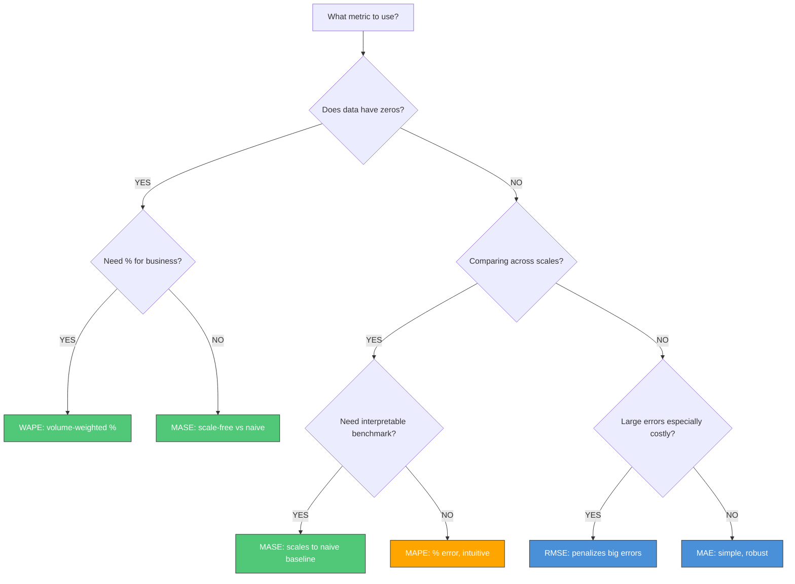
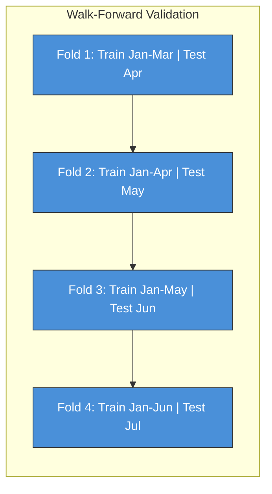
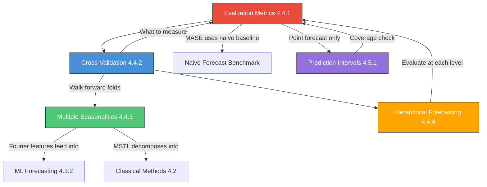

---
# Document Outline
- [Executive Summary](#executive-summary)
- [4.4.1 Evaluation Metrics](#441-evaluation-metrics-c)
  - [The Core Metrics](#the-core-metrics)
  - [Metric Formulas](#metric-formulas)
  - [MAPE's Three Problems](#mapes-three-problems)
  - [WAPE and MASE](#wape-and-mase-the-better-alternatives)
  - [Metric Selection Guide](#metric-selection-guide)
  - [Explain to a PM](#explain-to-a-pm-evaluation-metrics)
  - [Python Implementation](#python-implementation-metrics)
- [4.4.2 Cross-Validation for Time Series](#442-cross-validation-for-time-series-h)
  - [Why Standard CV Fails](#why-standard-k-fold-cv-fails)
  - [Walk-Forward Validation](#walk-forward-validation)
  - [Expanding vs Sliding Window](#expanding-vs-sliding-window)
  - [Multi-Step Horizons in CV](#multi-step-horizons-in-cv)
  - [Python Implementation](#python-implementation-cv)
- [4.4.3 Multiple Seasonalities](#443-multiple-seasonalities-m)
  - [The Problem](#the-problem)
  - [SARIMA's Limitation](#sarimas-limitation)
  - [The Four Approaches](#the-four-approaches)
  - [Python Implementation](#python-implementation-multiple-seasonalities)
- [4.4.4 Hierarchical Forecasting](#444-hierarchical-forecasting-m)
  - [What It Is](#what-it-is)
  - [Three Reconciliation Approaches](#three-reconciliation-approaches)
  - [Optimal Reconciliation](#optimal-reconciliation)
  - [Temporal Reconciliation](#temporal-reconciliation)
  - [When to Use Each](#when-to-use-each)
- [4.5 Uncertainty Quantification](#45-uncertainty-quantification-m)
  - [4.5.1 Prediction Intervals](#451-prediction-intervals-m)
  - [The Four Methods](#the-four-methods)
  - [Conformal Prediction](#conformal-prediction-the-distribution-free-guarantee)
  - [CRPS: The Metric for Probabilistic Forecasts](#crps-the-metric-for-probabilistic-forecasts)
  - [GARCH: Forecasting Volatility](#garch-forecasting-volatility-awareness-level)
  - [Python Implementation](#python-implementation-prediction-intervals)
- [Connections Map](#connections-map)
- [Company-Specific Angles](#company-specific-angles)
- [Code Memorization Priority Guide](#code-memorization-priority-guide)
- [Interview Cheat Sheet](#interview-cheat-sheet)
- [Self-Test Questions](#self-test-questions)
- [Learning Objectives Checklist](#learning-objectives-checklist)

# Executive Summary

> [!CAUTION]
> **Mermaid Chart Syntax Rules**:
> 1. Use `graph` instead of `flowchart` (more compatible across renderers)
> 2. Avoid `<br/>` HTML tags in node labels (use colons or commas instead)
> 3. Avoid Unicode characters (use `phi_1` not `φ₁`)
> 4. Quote labels with special characters like `>`, `<`, or operators

This guide covers the practical side of time series forecasting — the parts that determine whether a model succeeds in a real business environment. While examples draw primarily from demand forecasting, the methods are domain-agnostic and apply equally to energy load, traffic flow, ad revenue, and any other forecasting context. **Evaluation Metrics** is a Critical topic: knowing which metric to use (and why MAPE fails silently) is a common interview trap. **Cross-Validation** is where most candidates make a critical error — using standard k-fold on time series data. **Multiple Seasonalities** and **Hierarchical Forecasting** (including temporal reconciliation) complete the production toolkit, followed by **Prediction Intervals** and **CRPS** (the standard metric for probabilistic forecasts) which elevate a point forecast into a decision-support tool. **GARCH** provides awareness of volatility modeling for domains with time-varying variance. The through-line: production forecasting is more than building models — it's about measuring them correctly.

---

# 4.4 Practical Considerations [H]

> **Study Time**: 8 hours | **Priority**: [H] High (4.4.1 is Critical) | **Goal**: Know the full evaluation and validation toolkit; avoid the common pitfalls that cost interviews

---

## 4.4.1 Evaluation Metrics [C]

### One-Liner & Intuition

> [!TIP]
> **If You Remember ONE Thing**: MAPE is the default metric everyone uses, and it is silently broken in three ways. Know the alternatives — WAPE for business aggregations, MASE for scale-free comparisons — and be ready to defend your metric choice as a deliberate decision.

**One-Liner (≤15 words)**: *Choosing the wrong metric can make a bad model look good — and cost the business.*

**Intuition (Everyday Analogy)**:
Imagine measuring the quality of weather forecasts. If you only count the percentage error, a forecast that said "50% chance of rain" when there was a 5% chance (900% relative error) looks horrible, while getting a December sales spike slightly wrong (10% relative error) looks fine. But the business doesn't care equally about all errors — it depends on the cost of being wrong. That's exactly what metric selection is about: aligning the mathematical objective with the business consequence.

---

### The Core Metrics

| Metric | Full Name | Formula Type | Scale-Dependent? |
|--------|-----------|-------------|-----------------|
| **MAE** | Mean Absolute Error | Absolute | Yes |
| **RMSE** | Root Mean Squared Error | Squared | Yes |
| **MAPE** | Mean Absolute Percentage Error | Relative % | No |
| **SMAPE** | Symmetric MAPE | Relative % | No |
| **MASE** | Mean Absolute Scaled Error | Scaled | No |
| **WAPE** | Weighted Absolute Percentage Error | Pooled % | No |

---

### Metric Formulas

#### MAE — Mean Absolute Error

$$\text{MAE} = \frac{1}{n} \sum_{t=1}^{n} |y_t - \hat{y}_t|$$

**Interpretation**: On average, your forecast is off by MAE units.

**Properties**:
- Same units as the target (easy to explain to stakeholders)
- All errors weighted equally (no penalty for large errors)
- Robust to outliers (unlike RMSE)
- Not scale-free (can't compare MAE=10 on product A vs MAE=10 on product B if they have different volumes)

**When to use**: Default regression metric when errors are equally costly and outliers exist.

---

#### RMSE — Root Mean Squared Error

$$\text{RMSE} = \sqrt{\frac{1}{n} \sum_{t=1}^{n} (y_t - \hat{y}_t)^2}$$

**Interpretation**: The "penalized" average error — larger errors count more due to squaring.

**Properties**:
- Same units as target
- Penalizes large errors heavily (if you want to avoid rare but catastrophic misses)
- Sensitive to outliers — a single huge outlier can dominate
- Always ≥ MAE

**When to use**: When large errors are especially costly (e.g., stockout events in supply chain). Avoid when outliers are present in the data.

---

#### MAPE — Mean Absolute Percentage Error

$$\text{MAPE} = \frac{1}{n} \sum_{t=1}^{n} \left| \frac{y_t - \hat{y}_t}{y_t} \right| \times 100$$

**Interpretation**: On average, your forecast is off by X% of the actual value.

**Properties**:
- Scale-free: compare 12% MAPE on SKU A vs SKU B meaningfully
- Intuitive for business stakeholders ("12% error")
- **Three critical failure modes** — see below

**When to use**: Only when data has no zeros and the cost of errors scales with volume.

---

#### SMAPE — Symmetric MAPE

$$\text{SMAPE} = \frac{2}{n} \sum_{t=1}^{n} \frac{|y_t - \hat{y}_t|}{|y_t| + |\hat{y}_t|} \times 100$$

**Why "Symmetric"**: MAPE has asymmetry — over-forecasting (predicting 200 when actual is 100) gives 100% error; under-forecasting (predicting 0 when actual is 100) gives 100% error too, but the direction matters differently. SMAPE normalizes by the average of actual and forecast.

> [!WARNING]
> SMAPE still has problems: when both $y_t$ and $\hat{y}_t$ are near zero, the denominator approaches zero and SMAPE blows up. It's an improvement over MAPE but not a complete solution.

---

### MAPE's Three Problems

> [!IMPORTANT]
> This is one of the most common interview questions: *"What are the problems with MAPE?"*

#### Problem 1: Undefined at Zero

When $y_t = 0$, MAPE divides by zero. This happens constantly in:
- Retail (a product with no sales for a week)
- Intermittent demand (spare parts, B2B orders)
- New product launches

```python
# MAPE silently produces NaN or inf for zero actuals
actuals   = [100, 0, 50, 200]   # One zero
forecasts = [110, 5, 45, 190]

mape = np.mean(np.abs((np.array(actuals) - np.array(forecasts)) / np.array(actuals)))
# Result: inf (because division by zero at index 1)
```

#### Problem 2: Asymmetry (Over-forecast Penalty)

MAPE penalizes **over-forecasting** more heavily than **under-forecasting** for the *same absolute error*. Because MAPE divides by the actual value, over-forecasting (when actuals are lower) means dividing by a smaller number.

```text
Same absolute error of 50 units:
Actual = 100, Forecast = 150 (Over-forecast)  →  |100-150|/100 = 50.0% MAPE
Actual = 150, Forecast = 100 (Under-forecast) →  |150-100|/150 = 33.3% MAPE
```

Even though both forecasts missed by exactly 50 units, the over-forecast gets a much higher penalty. Furthermore, under-forecasting has a maximum penalty of 100% (if you forecast 0), while over-forecasting penalties are unbounded (can be 500%, 1000%, etc.).

**Consequence**: Models trained to minimize MAPE will systematically learn to **under-forecast** to "play it safe" and avoid these massive, unbounded penalties.

#### Problem 3: Ignores Volume (Business Impact)

MAPE treats all SKUs equally, but business impact scales with volume:

| SKU | Actual | Forecast | MAPE | Revenue Impact |
|-----|--------|----------|------|----------------|
| Widget A | 1,000 | 900 | 10% | -$10,000 |
| Widget B | 10 | 9 | 10% | -$10 |

Both have 10% MAPE, but Widget A's miss matters 1,000x more. A report that shows "average MAPE = 10%" treats these identically.

> [!TIP]
> **Interviewer Trap**: "Our MAPE is 12% but the business team is unhappy. Why?"
>
> **Strong Answer**: "MAPE averages across all items equally. A 12% MAPE might be driven by tiny low-volume SKUs where 12% is 1 unit. The high-volume products driving 90% of revenue could have 30% MAPE. I'd use WAPE — which weights each item's error by its actual volume — to get the business-relevant picture. I'd also segment the MAPE report by volume tier."

#### Historical Patches for MAPE (And Why They Fail)

Historically, practitioners tried to "patch" MAPE's flaws rather than abandon it:
- **To fix zeros (Problem 1)**: People add a tiny epsilon (`|Actual - Forecast| / (Actual + 0.001)`). **Why it's bad**: A 5-unit forecast when actual is 0 becomes an absurd 500,000% error, destroying the average.
- **To fix asymmetry (Problem 2)**: The industry created **SMAPE** (dividing by the average of actual and forecast). **Why it's bad**: It caps the error at 200%, but if both actual and forecast are exactly 0, it still divides by zero.

The modern solution for production forecasting is to discard MAPE entirely and use **WAPE** or **MASE** instead.

---

### WAPE and MASE — The Better Alternatives

#### WAPE — Weighted Absolute Percentage Error

$$\text{WAPE} = \frac{\sum_{t=1}^{n} |y_t - \hat{y}_t|}{\sum_{t=1}^{n} y_t} \times 100 = \frac{\text{Total MAE}}{\text{Total Actual}} \times 100$$

**Intuition**: Instead of averaging percentage errors, WAPE computes the total absolute error as a percentage of total actual volume. High-volume periods automatically get more weight.

**This is the same as**: `MAE / mean(actuals)` expressed as a percentage. Also equivalent to MAE normalized by the mean level — making it volume-aware.

**Advantages over MAPE**:
- Undefined at zero? No — numerator handles zeros gracefully (zero actual + non-zero forecast contributes to numerator but not denominator)
- Volume-aware: high-demand periods dominate the metric, matching business priority
- Easily explainable: "We were off by X% of our total volume"

```python
def wape(actuals, forecasts):
    """Weighted Absolute Percentage Error."""
    actuals = np.array(actuals)
    forecasts = np.array(forecasts)
    return np.sum(np.abs(actuals - forecasts)) / np.sum(actuals) * 100

# Example: MAPE vs WAPE comparison
actuals   = [1000, 10, 1000, 10]
forecasts = [1100, 9,  900, 11]

# MAPE: equally weights all four
# Large items: 10%, 10% error. Small items: 10%, 10% error → avg = 10%
print(f"MAPE: {mape(actuals, forecasts):.1f}%")   # 10%

# WAPE: volume-weighted
# Dominated by the 1000-unit items
print(f"WAPE: {wape(actuals, forecasts):.1f}%")   # 10% here (same, because all 10%)

# But with skewed errors:
actuals2   = [1000, 10, 1000, 10]
forecasts2 = [1100, 5,  900,  5]  # Small items are 50% off, big items 10% off
print(f"MAPE: {mape(actuals2, forecasts2):.1f}%")  # Dominated by 50% small items
print(f"WAPE: {wape(actuals2, forecasts2):.1f}%")  # Dominated by 10% big items
```

**What about different SKU prices? (Revenue WAPE)**

Standard WAPE (Unit WAPE) weights by volume. If you sell Apples ($1) and TVs ($1000), a miss of 5 TVs will be drowned out by massive Apple volumes, even though the TVs cost the business 1000x more per unit.

To align the metric with the P&L, multiply both the error and the actuals by the unit price before summing. This is called **Revenue-Weighted WAPE** or **Value WAPE**:

$$\text{Revenue WAPE} = \frac{\sum (\text{Price} \times |y_t - \hat{y}_t|)}{\sum (\text{Price} \times y_t)}$$

---

#### MASE — Mean Absolute Scaled Error

$$\text{MASE} = \frac{\text{MAE}}{\text{MAE}_{\text{naive}}}$$

Where the **naive baseline** is the seasonal naive forecast: $\hat{y}_{t} = y_{t-m}$ (last season's value), and:

$$\text{MAE}_{\text{naive}} = \frac{1}{n-m} \sum_{t=m+1}^{n} |y_t - y_{t-m}|$$

**Interpretation**:
- **MASE < 1**: Your model beats the naive baseline.
- **MASE = 1**: Your model is as good as predicting "same as last year."
- **MASE > 1**: Your model is worse than the naive baseline — you'd be better off using last year's values!

**Advantages**:
- Scale-free: compare across products with different units
- Defined even when actuals are zero
- Evaluates relative to a meaningful benchmark (not just "how far off was I" but "how much better than doing nothing")

> [!NOTE]
> MASE was proposed by Hyndman & Koehler (2006) specifically to fix MAPE's problems. The M4 forecasting competition used MASE and OWA (Overall Weighted Average of MASE and SMAPE) as primary metrics. Knowing this scores points in senior interviews.

```python
def mase(actuals, forecasts, seasonality=1):
    """
    Mean Absolute Scaled Error.
    seasonality: m in the naive seasonal baseline (1 for non-seasonal, 7 for weekly)
    """
    actuals   = np.array(actuals)
    forecasts = np.array(forecasts)

    # Naive baseline MAE (seasonal naive)
    naive_errors = np.abs(actuals[seasonality:] - actuals[:-seasonality])
    naive_mae = np.mean(naive_errors)

    # Model MAE
    model_mae = np.mean(np.abs(actuals - forecasts))

    return model_mae / naive_mae
```

---

### Metric Selection Guide

| Metric | Use When | Avoid When |
|--------|----------|------------|
| **MAE** | All errors equally costly, stakeholder-facing, outliers present | Comparing across different-scale series |
| **RMSE** | Large errors especially costly (stockouts, capacity failures) | Outliers present, comparing across scales |
| **MAPE** | Quick business readout, no zeros, errors scale with volume | Data has zeros, comparing different volume items |
| **SMAPE** | M4/M5 competition benchmarks, slight improvement over MAPE | Zeros, need business interpretation |
| **MASE** | Scale-free comparison, intermittent demand, benchmark vs naive | Non-technical audiences (not intuitive) |
| **WAPE** | Business-level aggregation, hierarchical reporting, mixed volumes | Per-item accuracy (not granular enough) |



#### Why not *just* use WAPE and MASE everywhere?

If WAPE and MASE are the best metrics for reporting, why do MAE and RMSE still exist?

1. **Training the Model (Loss Functions)**: WAPE and MASE are global metrics (they sum across all items or time steps), making them highly complex to use in gradient descent. You train machine learning models (LightGBM, NNs) using **MAE (L1 loss)** or **RMSE (L2 loss)** because they are mathematically smooth and easy to optimize at the point level.
2. **Preventing Catastrophes**: RMSE squares the error. If a massive miss costs lives (ICU beds) or millions of dollars (supply chain stockouts), training with RMSE forces the model to fiercely avoid large errors.
3. **Diagnosing the "Long Tail"**: WAPE is a volume-weighted aggregate. If your model predicts your #1 top-selling item perfectly but is 1,000% wrong on every single low-volume item, your WAPE will still look amazing (because the high volume hides the errors). You need item-level metrics (like MAE per item) to diagnose if the model is actually performing well across the catalog or just memorizing top sellers.

---

### Explain to a PM: Evaluation Metrics

> **PM-Friendly Version**:
>
> "There are several ways to measure how accurate a forecast is, and choosing the wrong one can mislead us about model quality.
>
> The most common mistake is using MAPE — which reports 'on average, we were X% off.' The problem is that a 20% miss on a $1 item and a 20% miss on a $10,000 item look identical in MAPE, even though the second one matters 10,000 times more.
>
> For our business dashboards, I'd recommend WAPE — which weights errors by volume, so high-selling products have more influence on the metric. A WAPE of 12% means: 'If you add up all our errors, they're 12% of our total actual sales.' That's the number the business actually cares about.
>
> For comparing models against each other (including against doing nothing), I use MASE — which tells us whether our model is better than simply predicting 'same as last year.' If MASE > 1, we shouldn't be using the model at all."

---

### Python Implementation: Metrics

```python
import numpy as np
from sklearn.metrics import mean_absolute_error, mean_squared_error

# ============================================================
# CORE METRIC IMPLEMENTATIONS
# ============================================================

def mape(actuals, forecasts, epsilon=1e-10):
    """
    Mean Absolute Percentage Error.
    epsilon: small constant to avoid division by zero (not ideal — prefer WAPE when zeros exist)
    """
    actuals   = np.array(actuals, dtype=float)
    forecasts = np.array(forecasts, dtype=float)
    return np.mean(np.abs((actuals - forecasts) / (actuals + epsilon))) * 100


def smape(actuals, forecasts):
    """Symmetric MAPE — improves MAPE's asymmetry but still breaks near zero."""
    actuals   = np.array(actuals, dtype=float)
    forecasts = np.array(forecasts, dtype=float)
    return np.mean(2 * np.abs(actuals - forecasts) / (np.abs(actuals) + np.abs(forecasts) + 1e-10)) * 100


def wape(actuals, forecasts):
    """
    Weighted Absolute Percentage Error.
    = sum(|actual - forecast|) / sum(actual) * 100
    Robust to zeros. Volume-weighted. Business-aligned.
    """
    actuals   = np.array(actuals, dtype=float)
    forecasts = np.array(forecasts, dtype=float)
    return np.sum(np.abs(actuals - forecasts)) / np.sum(actuals) * 100


def mase(actuals, forecasts, seasonality=1):
    """
    Mean Absolute Scaled Error.
    seasonality: m (1=non-seasonal, 7=weekly, 12=monthly, 52=yearly-weekly)
    MASE < 1 = beats naive. MASE > 1 = worse than naive.
    """
    actuals   = np.array(actuals, dtype=float)
    forecasts = np.array(forecasts, dtype=float)

    # Seasonal naive baseline
    naive_mae = np.mean(np.abs(actuals[seasonality:] - actuals[:-seasonality]))
    model_mae = np.mean(np.abs(actuals - forecasts))

    return model_mae / naive_mae


def evaluate_forecast(actuals, forecasts, seasonality=1, label="Model"):
    """
    Full evaluation suite — compute all metrics at once.
    """
    actuals   = np.array(actuals, dtype=float)
    forecasts = np.array(forecasts, dtype=float)

    metrics = {
        'MAE':   mean_absolute_error(actuals, forecasts),
        'RMSE':  np.sqrt(mean_squared_error(actuals, forecasts)),
        'MAPE':  mape(actuals, forecasts),
        'SMAPE': smape(actuals, forecasts),
        'WAPE':  wape(actuals, forecasts),
        'MASE':  mase(actuals, forecasts, seasonality),
    }

    print(f"\n=== {label} ===")
    for name, value in metrics.items():
        unit = "%" if name in ["MAPE", "SMAPE", "WAPE"] else ""
        print(f"  {name:6s}: {value:.3f}{unit}")

    return metrics


# ============================================================
# BIAS ANALYSIS — Are we systematically over/under-forecasting?
# ============================================================

def forecast_bias(actuals, forecasts):
    """
    Mean Forecast Bias (MFB).
    Positive = over-forecast. Negative = under-forecast.
    """
    actuals   = np.array(actuals, dtype=float)
    forecasts = np.array(forecasts, dtype=float)
    bias = np.mean(forecasts - actuals)
    pct_bias = bias / np.mean(actuals) * 100
    print(f"Bias: {bias:.2f} units ({pct_bias:.1f}%)")
    return bias, pct_bias


# ============================================================
# USAGE
# ============================================================
"""
import pandas as pd

# Evaluate multiple models
results = []
for model_name, preds in [("ARIMA", arima_preds), ("Prophet", prophet_preds), ("LightGBM", lgbm_preds)]:
    metrics = evaluate_forecast(y_test, preds, seasonality=7, label=model_name)
    results.append({'model': model_name, **metrics})

# Summary table
summary_df = pd.DataFrame(results).set_index('model')
print(summary_df.round(3))
"""
```

---

## 4.4.2 Cross-Validation for Time Series [H]

### One-Liner & Intuition

> [!TIP]
> **If You Remember ONE Thing**: Standard k-fold CV uses future data to predict the past — a fundamental violation of the time ordering constraint. Always use walk-forward (time-ordered) validation for time series.

**One-Liner**: *Time series CV must respect the arrow of time — always train on past, test on future.*

**Intuition (Everyday Analogy)**:
Imagine studying for an exam by looking at last year's papers — that's legitimate practice (training). But imagine "testing" yourself by checking answers from a book written after the exam was designed. That's what random k-fold does in time series: it mixes up chronological order and lets the model "know the future" when predicting the past. The validation score looks great, but the model fails when deployed.

---

### Why Standard k-Fold CV Fails

In standard k-fold CV for classification/regression:
1. Data is randomly shuffled
2. Each fold uses a random 20% for testing, 80% for training
3. Training data may include observations **after** the test observations in time

This means the model is trained on future data and tested on past data — a form of **look-ahead bias**:

```
Standard k-fold (WRONG for time series):
Fold 1: Train = {Jan, Mar, May, Nov}, Test = {Feb}  ← trains on May/Nov, tests on Feb
Fold 2: Train = {Feb, Apr, Jun, Oct}, Test = {Mar}  ← trains on Jun/Oct, tests on Mar

The model "sees the future" during training.
```

**Consequence**: Validation metrics are optimistic. The model appears to perform well but fails in production because it relied on temporal patterns it won't have access to in real deployment.

---

### Walk-Forward Validation

Also called **time series split**, **rolling origin**, or **expanding window** validation.

```
Walk-Forward Validation (CORRECT):

                                        TEST
                                        ----
Fold 1: [Train Jan-Mar         ]        [Apr]
Fold 2: [Train Jan-Apr          ]       [May]
Fold 3: [Train Jan-May           ]      [Jun]
Fold 4: [Train Jan-Jun            ]     [Jul]
Fold 5: [Train Jan-Jul             ]    [Aug]
```

**Key properties**:
- Training window always ends **before** the test window starts
- Time ordering is preserved
- Multiple test windows are used (unlike a single train/test split)
- Each fold simulates the real deployment scenario: "given everything up to now, predict the next period"



---

### Expanding vs Sliding Window

There are two variants of walk-forward validation, with different trade-offs:

| Aspect | Expanding Window | Sliding Window |
|--------|-----------------|----------------|
| **Training data** | Grows with each fold | Fixed size, moves forward |
| **History used** | All past data | Recent N months only |
| **Best when** | Long history is relevant, older data still informative | Concept drift: older data hurts |
| **Risk** | Older patterns may not reflect current behavior | Less training data per fold |
| **Typical use** | Stable series, financial data | Retail with promotions, non-stationary series |

```
EXPANDING WINDOW:
Fold 1: [Train Jan-Mar     ] → Test Apr
Fold 2: [Train Jan-Apr      ] → Test May    ← gets bigger
Fold 3: [Train Jan-May       ] → Test Jun   ← keeps growing

SLIDING WINDOW (window size = 3 months):
Fold 1: [Train Jan-Mar] → Test Apr
Fold 2: [Train Feb-Apr] → Test May    ← old Jan dropped
Fold 3: [Train Mar-May] → Test Jun    ← old Feb dropped
```

> [!NOTE]
> In practice, start with **expanding window** as the default. Switch to sliding window if you suspect concept drift — e.g., customer behavior changed significantly due to a promotion, COVID, or market shift.

---

### Multi-Step Horizons in CV

When forecasting multiple steps ahead (e.g., a 7-day horizon), validation becomes more nuanced:

**Option A: One-step-ahead only**
- Train on Jan-Apr, predict May 1 only
- Easy to implement but doesn't test horizon performance

**Option B: Full horizon validation**
- Train on Jan-Apr, predict all of May 1–7
- Evaluate each horizon separately: h=1, h=2, ..., h=7
- Reveals how accuracy degrades with horizon

```python
# Example: Horizon-specific MAPE
horizon_errors = {}
for h in range(1, 8):
    errors_at_horizon = []
    for fold in cv_folds:
        actual = fold['test'][h-1]      # h-step-ahead actual
        forecast = fold['forecast'][h-1]  # h-step-ahead forecast
        errors_at_horizon.append(abs(actual - forecast) / actual)
    horizon_errors[h] = np.mean(errors_at_horizon) * 100

# Plot: accuracy degrades with forecast horizon
```

> [!IMPORTANT]
> Always report metrics **by horizon** in an interview or design review. "Our model has 12% MAPE" is ambiguous. "Our model has 8% MAPE at h=1 and 18% MAPE at h=7" is much more useful for business planning decisions.

---

### Python Implementation: CV

```python
import numpy as np
import pandas as pd
from sklearn.model_selection import TimeSeriesSplit

# ============================================================
# METHOD 1: sklearn TimeSeriesSplit (Expanding Window)
# ============================================================

tscv = TimeSeriesSplit(n_splits=5)

for fold_num, (train_idx, test_idx) in enumerate(tscv.split(X)):
    X_train, X_test = X.iloc[train_idx], X.iloc[test_idx]
    y_train, y_test = y.iloc[train_idx], y.iloc[test_idx]

    model.fit(X_train, y_train)
    preds = model.predict(X_test)

    fold_mape = mape(y_test.values, preds)
    print(f"Fold {fold_num+1}: MAPE = {fold_mape:.2f}%  (test: {X_test.index[0].date()} to {X_test.index[-1].date()})")


# ============================================================
# METHOD 2: Custom Walk-Forward Validation with Horizon
# ============================================================

def walk_forward_cv(
    df,
    date_col,
    target_col,
    feature_cols,
    model_fn,
    n_splits=5,
    test_horizon=30,
    min_train_days=90,
    window_type='expanding'   # 'expanding' or 'sliding'
):
    """
    Walk-forward cross-validation for time series.

    Parameters
    ----------
    df           : DataFrame with date_col sorted ascending
    model_fn     : callable that takes (X_train, y_train) and returns a fitted model
    test_horizon : number of periods in each test fold
    min_train_days: minimum training days before first fold
    window_type  : 'expanding' (all history) or 'sliding' (fixed window)
    """
    df = df.sort_values(date_col).reset_index(drop=True)
    n = len(df)

    results = []

    # Generate fold cutoffs
    start_test = min_train_days
    fold_starts = range(start_test, n - test_horizon, test_horizon)
    fold_list = list(fold_starts)[-n_splits:]  # Last n_splits folds

    for fold_num, test_start_idx in enumerate(fold_list):
        test_end_idx = test_start_idx + test_horizon

        # Define training window
        if window_type == 'expanding':
            train_start_idx = 0
        else:  # sliding: fixed window of 2 * test_horizon before test
            train_start_idx = max(0, test_start_idx - min_train_days)

        train_df = df.iloc[train_start_idx:test_start_idx]
        test_df  = df.iloc[test_start_idx:test_end_idx]

        X_train = train_df[feature_cols]
        y_train = train_df[target_col]
        X_test  = test_df[feature_cols]
        y_test  = test_df[target_col]

        # Train and predict
        model = model_fn(X_train, y_train)
        preds = model.predict(X_test)

        # Evaluate
        fold_result = {
            'fold': fold_num + 1,
            'train_start': train_df[date_col].min(),
            'train_end':   train_df[date_col].max(),
            'test_start':  test_df[date_col].min(),
            'test_end':    test_df[date_col].max(),
            'n_train':     len(train_df),
            'MAE':    mean_absolute_error(y_test, preds),
            'MAPE':   mape(y_test.values, preds),
            'WAPE':   wape(y_test.values, preds),
            'MASE':   mase(y_test.values, preds, seasonality=7),
        }
        results.append(fold_result)

        print(f"Fold {fold_num+1}: {fold_result['test_start'].date()} to {fold_result['test_end'].date()} | "
              f"MAPE={fold_result['MAPE']:.1f}% | WAPE={fold_result['WAPE']:.1f}%")

    results_df = pd.DataFrame(results)

    print("\n=== Cross-Validation Summary ===")
    for metric in ['MAE', 'MAPE', 'WAPE', 'MASE']:
        vals = results_df[metric]
        print(f"  {metric:4s}: mean={vals.mean():.3f}, std={vals.std():.3f}, "
              f"min={vals.min():.3f}, max={vals.max():.3f}")

    return results_df


# ============================================================
# PROPHET: Built-in CV
# ============================================================
"""
from prophet.diagnostics import cross_validation, performance_metrics

# Prophet's built-in walk-forward CV
df_cv = cross_validation(
    model,
    initial='730 days',   # Minimum training period
    period='180 days',    # Spacing between cutoffs
    horizon='90 days',    # Forecast horizon per fold
    parallel='processes'  # Parallelise across folds
)

df_performance = performance_metrics(df_cv, metrics=['mse', 'rmse', 'mae', 'mape', 'coverage'])
print(df_performance.head())
"""
```

---

## 4.4.3 Multiple Seasonalities [M]

### One-Liner & Intuition

> [!TIP]
> **If You Remember ONE Thing**: SARIMA handles only ONE seasonal period. For data with daily + weekly + yearly patterns, use MSTL, Prophet, or Fourier features.

**One-Liner**: *When data has layered rhythms — daily, weekly, yearly — you need a model that can separate each layer.*

**Intuition (Everyday Analogy)**:
Think of hourly electricity consumption. There are three clocks ticking simultaneously:
- An **hourly/daily** clock: consumption peaks at 8am and 6pm, drops overnight
- A **weekly** clock: weekends have lower commercial usage than weekdays
- A **yearly** clock: winter heating and summer cooling create annual peaks

A model that only knows about one season will try to squeeze all three patterns into one, getting all of them slightly wrong. You need a model that can decompose all three simultaneously.

---

### The Problem

Standard SARIMA notation: `SARIMA(p, d, q)(P, D, Q)[m]`

The `m` is **one seasonal period**. You have to pick: daily seasonality OR weekly OR yearly. You can't have all three in one model.

**Real-world frequencies where multiple seasonalities arise**:

| Data Frequency | Seasonality 1 | Seasonality 2 | Seasonality 3 |
|---------------|---------------|---------------|---------------|
| **Hourly** | Daily (24) | Weekly (168) | Yearly (8,760) |
| **Daily** | Weekly (7) | Monthly (~30) | Yearly (365) |
| **Weekly** | Monthly (~4.3) | Quarterly (13) | Yearly (52) |
| **Daily retail** | Day-of-week (7) | Holiday cycle | Yearly (365) |

---

### SARIMA's Limitation

```
SARIMA(1,1,1)(1,1,1)[7]   ← handles weekly only
SARIMA(1,1,1)(1,1,1)[365] ← handles yearly only

But NOT BOTH simultaneously.
```

Workaround attempts:
- Run two sequential SARIMA models (complex, residuals may still have seasonality)
- High-order seasonal models become computationally intractable (SARIMA[365] has 365 seasonal lags)

---

### The Four Approaches

#### Approach 1: MSTL (Multiple Seasonal Trend Decomposition using LOESS)

STL extended to handle multiple seasonal periods. Decomposes the series iteratively — first removing one seasonal component, then fitting STL to the residuals for each additional period.

```python
from statsmodels.tsa.seasonal import MSTL
import matplotlib.pyplot as plt

# Hourly data with daily (24) and weekly (168) seasonality
mstl = MSTL(ts, periods=[24, 168])
result = mstl.fit()

# Access components
trend     = result.trend
seasonal_daily  = result.seasonal['seasonal_24']
seasonal_weekly = result.seasonal['seasonal_168']
residual  = result.resid

result.plot()
plt.tight_layout()
plt.show()
```

**When to use MSTL**:
- Exploratory analysis: understand how each seasonal component looks
- Preprocessing: decompose, then feed residuals to ARIMA or ML model
- Forecasting: combine MSTL decomposition with ETS for each component

---

#### Approach 2: Prophet (Automatic Fourier-Based Multiple Seasonality)

Prophet represents each seasonal component as a Fourier series internally:

$$s(t) = \sum_{n=1}^{N} \left[ a_n \cos\left(\frac{2\pi n t}{P}\right) + b_n \sin\left(\frac{2\pi n t}{P}\right) \right]$$

You can add multiple seasonal components explicitly:

```python
from prophet import Prophet

# Prophet handles multiple seasonalities automatically
# Just set the right freq and it picks up weekly + yearly
m = Prophet(
    yearly_seasonality=True,
    weekly_seasonality=True,
    daily_seasonality=False  # Only for sub-daily data
)

# Add custom seasonality (e.g., monthly for retail)
m.add_seasonality(
    name='monthly',
    period=30.5,
    fourier_order=5   # Higher = more flexible, but risk of overfitting
)

m.fit(df)
```

**When to use Prophet**: Business data (sales, revenue) where domain knowledge about holidays, promotions, and seasonal structure can be specified declaratively.

---

#### Approach 3: TBATS (Trigonometric Box-Cox ARMA Trend Seasonal)

TBATS = Trigonometric seasonality + Box-Cox transformation + ARMA errors + Trend + Seasonal components. A statistical model that can handle multiple non-integer seasonal periods.

**Advantages**: Handles non-integer periods (e.g., 365.25 for leap years, 4.33 for weeks-per-month).

**Disadvantages**: Computationally slow, hard to interpret, limited Python support.

```python
from tbats import TBATS

# Auto-detects seasonal periods
estimator = TBATS(seasonal_periods=[7, 365.25])
model = estimator.fit(ts)
forecast = model.forecast(steps=30)
```

**When to use TBATS**: When you have non-integer seasonality (e.g., weekly within yearly), or as a benchmark. Rarely the first choice in production.

---

#### Approach 4: Fourier Features in ML Models

The most flexible and scalable approach: manually encode multiple seasonal patterns as sin/cos features and pass them to any ML model.

```python
import numpy as np
import pandas as pd

def add_multiple_seasonality_features(df, date_col):
    """
    Add Fourier features for multiple seasonal periods.
    Works with ANY model (LightGBM, XGBoost, Ridge, etc.)
    """
    df = df.copy()
    t = (df[date_col] - df[date_col].min()).dt.total_seconds() / 3600  # hours since start

    # Weekly seasonality (168 hours)
    for k in range(1, 4):  # 3 Fourier pairs
        df[f'sin_weekly_{k}'] = np.sin(2 * np.pi * k * t / 168)
        df[f'cos_weekly_{k}'] = np.cos(2 * np.pi * k * t / 168)

    # Daily seasonality (24 hours)
    for k in range(1, 4):
        df[f'sin_daily_{k}'] = np.sin(2 * np.pi * k * t / 24)
        df[f'cos_daily_{k}'] = np.cos(2 * np.pi * k * t / 24)

    # Yearly seasonality (8,760 hours)
    for k in range(1, 6):  # 5 Fourier pairs for yearly (more flexible)
        df[f'sin_yearly_{k}'] = np.sin(2 * np.pi * k * t / 8760)
        df[f'cos_yearly_{k}'] = np.cos(2 * np.pi * k * t / 8760)

    return df
```

**When to use Fourier + ML**: When you're already using LightGBM/XGBoost and want to add seasonal structure without switching models. The most production-friendly approach at scale.

---

### Python Implementation: Multiple Seasonalities

```python
# ============================================================
# COMPARISON: Which approach for which scenario?
# ============================================================

"""
Scenario 1: Hourly electricity data (daily + weekly seasonality)
  → MSTL for decomposition/visualization
  → Fourier features + LightGBM for production forecasting

Scenario 2: Daily retail sales (weekly + yearly)
  → Prophet with add_seasonality() for moderate scale
  → Fourier features + LightGBM for large-scale deployment

Scenario 3: Weekly sales (quarterly + yearly, non-integer)
  → TBATS as baseline (handles non-integer periods)
  → Prophet or Fourier + ML for production

Scenario 4: Need to explain seasonality to stakeholders
  → MSTL decomposition (visualize each component separately)
"""

# Quick MSTL visualization (useful for EDA, not forecasting)
from statsmodels.tsa.seasonal import MSTL

def plot_multiple_seasonality(ts, periods, title="Multiple Seasonality Decomposition"):
    """Visualize multiple seasonal components with MSTL."""
    result = MSTL(ts, periods=periods).fit()
    result.plot()
    import matplotlib.pyplot as plt
    plt.suptitle(title)
    plt.tight_layout()
    return result
```

---

## 4.4.4 Hierarchical Forecasting [M]

### What It Is

> [!TIP]
> **If You Remember ONE Thing**: Hierarchical forecasting produces forecasts at every level of an organizational hierarchy (product → category → brand → total). The challenge is that independent forecasts at each level won't sum up to the same total — they need **reconciliation**.

**Hierarchy Example (Retail)**:

```
Total Company Revenue
├── Region A
│   ├── Store A1
│   │   ├── Category Electronics
│   │   │   ├── SKU: Phone A
│   │   │   └── SKU: Phone B
│   │   └── Category Clothing
│   └── Store A2
└── Region B
    └── Store B1
```

**The Problem**: If Store A1 forecasts $100K, Store A2 forecasts $150K, and Region A independently forecasts $280K, these are **incoherent** — the sum of stores ($250K) doesn't equal the region forecast ($280K). Which one do you use for inventory planning?

**Reconciliation** = adjusting all forecasts so they are coherent (bottom-level forecasts sum to top-level forecasts).

---

### Three Reconciliation Approaches

#### 1. Top-Down

**Method**: Forecast at the top level first. Disaggregate down using historical proportions.

```
Step 1: Forecast Total Company = $1,000K
Step 2: Region A historically = 40% of total → Region A forecast = $400K
Step 3: Store A1 historically = 60% of Region A → Store A1 = $240K
Step 4: SKU Phone A = 30% of Store A1 Electronics → $72K
```

**Advantages**:
- **Simplicity & low cost**: One model to build, monitor, and retrain — minimal MLOps burden
- **Good aggregate accuracy**: The top-level series is smooth (noise averages out), making it easy to model
- **Macro trend capture**: Macroeconomic shifts, company-wide promotions, or market trends are directly visible at the aggregate level
- **Organizational alignment**: Finance and executive teams think in aggregates (budgets, revenue targets), so top-down forecasts match their planning language

**Disadvantages**:
- **Bias amplification downward**: Any bias in the top-level forecast gets propagated and magnified as you disaggregate through multiple levels
- **Static proportions can't adapt**: Historical ratios used for disaggregation are backward-looking — they cannot reflect product launches, discontinuations, or competitive shifts (e.g., Phone A was 30% of Electronics historically but was discontinued last month; the model still allocates 30% to it)
- **Invisible bottom-level drivers**: Local promotions, store-specific events, or regional weather patterns that affect individual items are completely lost — the top-level model never sees these causal signals
- **Cold-start failure**: A newly launched product has zero historical proportion, so it receives zero allocation

**When to use**: High-level capacity planning, budget allocation, when top-level accuracy is the primary concern, or when the team lacks infrastructure to maintain many models.

---

#### 2. Bottom-Up

**Method**: Forecast each bottom-level series independently. Aggregate up by summing.

```
Step 1: Forecast each SKU individually (1,000 SKUs)
Step 2: Sum SKUs within category → category forecast
Step 3: Sum categories within store → store forecast
Step 4: Sum stores within region → region forecast
Step 5: Sum regions → company total
```

**Advantages**:
- **Causal signal preservation**: Each model can incorporate item-specific drivers (promotions, pricing changes, local events) that are invisible at the aggregate level
- **Granular accuracy**: Operational decisions (inventory replenishment, warehouse allocation) happen at the SKU level — bottom-up directly optimizes for the level that matters
- **Cold-start friendly**: New products get their own model immediately, even with limited history
- **Organizational trust**: Operations and supply chain teams can inspect, override, and adjust individual item forecasts — this transparency builds buy-in

**Disadvantages**:
- **MLOps burden**: Maintaining 1,000+ models means 1,000+ retraining jobs, drift monitors, and failure alerts — significant engineering overhead
- **Data quality exposure**: Bottom-level data is often messy — stockouts recorded as zero demand (but true demand was not zero), returns, data entry errors, and category reclassifications all directly corrupt individual models
- **Stockout bias**: If an item was out of stock for 2 weeks, actual sales = 0 but true demand ≠ 0. Bottom-up models trained on this uncorrected data will systematically underpredict, creating a vicious cycle (low forecast → less stock ordered → more stockouts → even lower forecast)
- **Intermittent demand**: Many SKUs sell 0, 0, 1, 0, 3, 0 units/day — standard models (ARIMA, ETS) perform poorly on this sparsity; specialized methods (Croston's, TSB) are needed
- **Noisy aggregates**: Summing many noisy bottom-level forecasts can produce aggregate forecasts that are worse than directly forecasting the aggregate

> [!NOTE]
> **"Don't errors cancel out when aggregating?"** In theory, yes — if individual forecasts are unbiased and independent, positive and negative errors cancel and the aggregate error shrinks (Law of Large Numbers). In practice this breaks down when: (1) there are **few** bottom-level series (cancellation is incomplete), (2) errors are **correlated** (e.g., a snowstorm affects all SKUs in a store simultaneously, so all forecasts are wrong in the same direction), or (3) bottom-level series are **sparse/intermittent**, which creates enormous relative variance even if unbiased. In these cases, directly forecasting the smoother aggregate (Top-Down) can outperform summing noisy bottom-level forecasts.

**When to use**: Operational planning (inventory ordering is per-SKU), when item-level accuracy is critical, or when bottom-level causal drivers (promotions, pricing) are important.

---

#### 3. Middle-Out

**Method**: Forecast at a middle level (e.g., store level). Aggregate up to get higher levels, disaggregate down for lower levels.

```
Step 1: Forecast at store level (manageable number of models)
Step 2: Sum stores → regions → company (aggregation up)
Step 3: Allocate store forecast to SKUs using proportions (disaggregation down)
```

**When to use**: When the middle level is the most natural planning unit. Common in retail (store managers plan at store level), manufacturing (production planning by product family).

---

### Modern Approaches

The three classic approaches (Top-Down, Bottom-Up, Middle-Out) each commit to a single level. Modern methods instead leverage **information across all levels simultaneously**.

---

#### 4. Learned Proportions (Sequential Fitting)

**Idea**: Instead of using static historical ratios for Top-Down disaggregation, **train a model to predict the proportions** dynamically based on current features.

```
Step 1: Train a model at the top level → Total forecast = $1,000K
Step 2: Train a SECOND model that predicts proportions:
        "Given current season, promotions, trends —
         what share should each child node receive?"
Step 3: Proportions are now dynamic, not static
```

The proportion model can learn patterns like:
- *In Q4, Electronics proportion jumps from 30% to 45% (holiday demand)*
- *After a product launch, new SKU share ramps from 0% to 15% over 8 weeks*

This solves the "stale proportions" problem of classic Top-Down while retaining its simplicity (Athanasopoulos et al., 2009: "Top-Down with Forecast Proportions").

**When to use**: When product mix shifts frequently but you want to keep the simplicity of a top-down workflow.

---

#### 5. Optimal Reconciliation (MinT)

Modern statistical approach (Wickramasuriya et al., 2019): **MinT (Minimum Trace)** reconciliation.

Instead of choosing top-down or bottom-up, MinT:
1. Generates base forecasts at **all levels** independently
2. Applies a weighted adjustment to make them **coherent** (bottom sums equal top)
3. The weights minimize the total variance of reconciled forecasts

```python
# Using the hierarchicalforecast library
from hierarchicalforecast.reconciliation import BottomUp, MinTrace

# Base forecasts from your models (any method)
base_forecasts = {
    'total':    arima_total_forecast,
    'region_A': arima_region_a_forecast,
    'sku_001':  lgbm_sku001_forecast,
    # ... all levels
}

# MinT reconciliation
reconciler = MinTrace(method='mint_shrink')
reconciled = reconciler.reconcile(
    S=summing_matrix,   # Hierarchy structure matrix
    P=base_forecasts
)
```

**When to use**: When accuracy matters at every level simultaneously. The current academic state-of-the-art.

<details>
<summary><strong>Deep Dive: How MinT Works (Worked Example)</strong></summary>

**Setup — A tiny hierarchy:**

```
Total Company
├── Region A
│   ├── Store A1
│   └── Store A2
└── Region B
    └── Store B1
```

Coherence rule: A1 + A2 = Region A, B1 = Region B, Region A + Region B = Total.

**Step 1: Generate base forecasts independently** (one model per node):

| Node | Base Forecast |
|:-----|:-------------|
| Total | $500K |
| Region A | $320K |
| Region B | $200K |
| Store A1 | $150K |
| Store A2 | $140K |
| Store B1 | $190K |

These are **incoherent**: A1 + A2 = $290K but Region A says $320K. Region A + Region B = $520K but Total says $500K.

**Step 2: Encode the hierarchy as a summing matrix $S$:**

```
         Store A1  Store A2  Store B1
Total  [    1         1         1    ]   ← sum of all
Reg A  [    1         1         0    ]   ← sum of A stores
Reg B  [    0         0         1    ]   ← just B1
A1     [    1         0         0    ]   ← identity
A2     [    0         1         0    ]   ← identity
B1     [    0         0         1    ]   ← identity
```

This says: "if I knew the true bottom-level values, here's how to compute every level."

**Step 3: MinT finds optimal weights using the reconciliation formula:**

$$\tilde{y} = S \cdot P \cdot \hat{y}$$

Where:
- $\tilde{y}$ = the final **reconciled** (coherent) forecasts
- $S$ = the **summing matrix** (the hierarchy structure defined in Step 2)
- $P$ = an optimized **weight matrix** (the "MinT" part) 
- $\hat{y}$ = the initial **base forecasts** (the incoherent ones from Step 1: $[500, 320, 200, 150, 140, 190]$)

MinT calculates $P$ to **minimize the total forecast error variance**. It derives $P$ from the **covariance matrix of historical base forecast errors**:

- If Store A1's model historically has low error → high weight (trusted more)
- If Region A's model historically has high error → low weight (trusted less)
- If errors are correlated across nodes → weights account for that too

**Result after reconciliation:**

| Node | Base | Reconciled | What Happened |
|:-----|:-----|:-----------|:--------------|
| Total | $500K | **$487K** | Pulled down (bottom evidence says lower) |
| Region A | $320K | **$297K** | Pulled toward stores ($290K), not $320K |
| Region B | $200K | **$190K** | Pulled toward Store B1's estimate |
| Store A1 | $150K | **$148K** | Barely changed (historically accurate) |
| Store A2 | $140K | **$149K** | Pulled up slightly |
| Store B1 | $190K | **$190K** | Unchanged |

Now: $148K + $149K = $297K$ ✓, $297K + $190K = $487K$ ✓. Everything sums correctly.

**One-sentence intuition**: MinT is a smart referee — everyone gives their best guess, and the referee adjusts all guesses simultaneously so they agree, trusting each voice proportionally to how accurate it has been in the past.

</details>

---

#### 6. Global Model + Post-Hoc Reconciliation (Production Standard)

**Idea**: Train **one** ML model (e.g., LightGBM) on all items simultaneously, using hierarchy information as features. Then reconcile predictions as a post-processing step.

```python
# One LightGBM model trained on ALL 30,490 SKUs at once
features = [
    # Item-level drivers
    'price', 'promotion_flag', 'lag_7', 'lag_28',
    # Store-level context (hierarchy features)
    'store_id', 'store_size', 'store_region',
    # Category-level context
    'category_id', 'department_id',
    # Company-level aggregates as features
    'total_company_rolling_mean_28d',
    'category_rolling_mean_7d',
    # Time features
    'day_of_week', 'month', 'is_holiday'
]

model = lgb.LGBMRegressor(n_estimators=1000)
model.fit(df_all_skus[features], df_all_skus['target'])

# Step 2: Generate SKU-level predictions, aggregate up, then reconcile with MinT
```

**Why this works**: The model learns cross-level patterns — e.g., *"when company-wide rolling mean trends up AND this store is in Region A AND the category is Electronics, increase the forecast."* A single global model captures signals that isolated per-SKU models would miss (especially for sparse/new items that benefit from borrowing strength across similar items).

**This is the dominant approach in industry** — it is what top M5 competition solutions used: a global LightGBM model with hierarchy-aware features, followed by optional MinT reconciliation.

**When to use**: Production systems at scale. The pragmatic choice when you need both granular accuracy and coherent aggregates.

---

#### 7. End-to-End Hierarchical Loss & Alternative Joint Models (Research Frontier)

**Approach A: Multi-Objective Loss (Deep Learning)**
Instead of reconciling after the fact, bake coherence directly into the **loss function** during training:

$$\mathcal{L} = \underbrace{\sum_{\text{SKU}} \text{Loss}_{\text{SKU}}}_{\text{bottom-level accuracy}} + \lambda_1 \underbrace{\sum_{\text{store}} \text{Loss}_{\text{store}}}_{\text{store-level accuracy}} + \lambda_2 \underbrace{\sum_{\text{region}} \text{Loss}_{\text{region}}}_{\text{region-level accuracy}} + \lambda_3 \underbrace{\text{Loss}_{\text{total}}}_{\text{company accuracy}}$$

The model simultaneously minimizes errors at every hierarchy level. This is natural with **deep learning** frameworks (PyTorch, TensorFlow) using models like Temporal Fusion Transformer.

> [!WARNING]
> **Does this guarantee coherence?** No! This is a "soft constraint." The loss function heavily penalizes the network if the sums don't match, pushing the model *toward* coherence, but it won't be mathematically perfect down to the last decimal. To get a *hard* mathematical guarantee within a neural network, you have to use a projection layer (like a differentiable MinT layer) at the very end of the network.

**Approach B: Tree-Based Hierarchical Constraints (Non-DL)**
While out-of-the-box LightGBM/XGBoost can't do multi-objective loss easily, you can write a **Custom Objective Function**. The custom gradient and hessian calculate the error not just for the current leaf row, but pass penalties down/up the tree structure during the split-finding process to encourage coherence. It's mathematically intense to implement but achieves end-to-end tree learning.

**Approach C: Probabilistic Copulas (Joint Distribution Modeling)**
Instead of minimizing point-forecast errors across levels, **Copula-based models** learn the full joint probability distribution of the entire hierarchy.
- It asks: *"What is the distribution of Store A's sales, Store B's sales, AND the correlation (copula) between them?"*
- **Why it's different**: It naturally produces coherent **prediction intervals**, not just coherent point forecasts. If Store A spikes, the copula naturally updates the probability of Store B spiking depending on their learned correlation.

**Approach D: Top-Down Network Architecture (Strict Structural Coherence)**
Instead of relying on loss penalties or post-hoc reconciliation, you explicitly architect the neural network to output the top-level forecast first, and then output a set of **softmax proportions** (which mathematically must sum to 1.0) for the lower levels.
- The bottom level is simply: `Base_Forecast * Softmax_Share`
- Because the network outputs shares that sum to 1.0, the bottom levels **guarantee coherence** by definition.
- Backpropagation flows through the share calculation, allowing the network to natively learn the complex interactions between the aggregate behavior and the granular behavior.

**When to use end-to-end approaches**: When you have the engineering bandwidth (custom DL losses, custom XGBoost C++ objectives, or copula math) and the post-hoc MinT step is either too slow or mathematically insufficient for your probabilistic needs.

---

### When to Use Each

| Approach | Complexity | Use When | Avoid When |
|:---------|:-----------|:---------|:-----------|
| **Top-Down** (static proportions) | Low | Budget planning, executive dashboards, small team | Changing product mix, need granular accuracy |
| **Bottom-Up** | Medium | Inventory ordering, SKU-level accuracy critical | Sparse/noisy SKUs, massive MLOps burden |
| **Middle-Out** | Medium | Natural planning level exists (store, region) | Flat hierarchy, unclear middle level |
| **Learned Proportions** | Medium | Product mix shifts frequently | No clear hierarchy, complex interactions |
| **MinT / Optimal** | Medium-High | All levels equally important, academic rigor | Small team, interpretability needed |
| **Global Model + Reconciliation** | Medium-High | Production at scale (M5-style), many SKUs | Very small datasets, no ML infrastructure |
| **End-to-End Hierarchical Loss** | High | Deep learning pipelines, full control of loss | Tree-based models, small team, interpretability |

> [!NOTE]
> **Interview framing**: When asked about hierarchical forecasting, a strong senior-level answer progresses through: (1) the coherence problem, (2) classic three approaches with practical trade-offs (MLOps burden, stockout bias, cold-start), (3) modern approaches — MinT for statistical reconciliation, global models for production scale, (4) which level drives the business decision and how that influences the choice.

**Bonus-point topics** (advanced, mention if prompted):

- **Grouped / cross-classified hierarchies**: When the hierarchy isn't a clean tree — e.g., products grouped by *Category* AND by *Region* create a crossed structure requiring reconciliation across both groupings
- **Ensemble reconciliation**: Average the reconciled outputs of multiple methods (Top-Down, Bottom-Up, MinT) — often more robust than any single reconciliation approach

### Temporal Reconciliation

Hierarchy doesn't just run across entities (products, stores). It also runs across **time granularities** — and daily forecasts don't automatically sum to weekly, which don't automatically sum to monthly.

**The Problem**: Your daily demand model predicts 142 units this week (sum of daily forecasts). Your weekly model predicts 160. Your monthly model predicts 620 for the month. These are **temporally incoherent** — the same signal produces contradictory forecasts at different resolutions.

**Why it happens**: Different time granularities reveal different patterns:
- **Daily**: Captures day-of-week effects and short-term spikes (but high noise)
- **Weekly**: Captures weekly trends (but loses day-of-week information)
- **Monthly**: Best for trends and annual seasonality (but loses all sub-monthly dynamics)

Each model optimizes for its own resolution, producing forecasts that don't sum consistently.

**Cross-Temporal Reconciliation**:

The same MinT framework used for cross-sectional hierarchies applies — just replace "SKU → Category → Company" with "Daily → Weekly → Monthly":

$$\text{Summing constraint}: \quad y_{\text{week}} = \sum_{d=1}^{7} y_{d}$$

```python
# Practical approach: use hierarchicalforecast with temporal aggregation
# Step 1: Generate base forecasts at each temporal grain
daily_forecasts = daily_model.predict(horizon=30)     # 30 daily values
weekly_forecasts = weekly_model.predict(horizon=4)     # 4 weekly values
monthly_forecasts = monthly_model.predict(horizon=1)   # 1 monthly value

# Step 2: Build temporal summing matrix (days sum to weeks, weeks to month)
# Step 3: Apply MinT reconciliation across temporal levels
# Result: coherent forecasts where daily sums = weekly and weekly sums = monthly
```

**When temporal reconciliation matters**:

| Use Case | Why Coherence Matters |
|----------|----------------------|
| **Budget planning** | Annual budget must equal sum of quarterly budgets, which must equal sum of monthly |
| **Energy grid** | Hourly dispatch plans must align with daily capacity commitments and weekly fuel procurement |
| **Transportation** | Daily vehicle scheduling must align with weekly fleet procurement and monthly route planning |
| **Demand planning** | Daily replenishment orders must align with weekly capacity and monthly supplier contracts |

> [!TIP]
> **Interview answer**: "Cross-temporal reconciliation ensures that your daily operational forecast sums to your weekly tactical forecast, which sums to your monthly strategic forecast. I use the same MinT framework: generate base forecasts at each granularity, then reconcile using a temporal summing matrix. This is especially important when different stakeholders consume forecasts at different time scales — operations looks at daily, managers at weekly, executives at monthly — and they all need to see a consistent picture."

---

# 4.5 Uncertainty Quantification [M]

> **Study Time**: 2 hours | **Priority**: [M] Medium | **Goal**: Understand why intervals matter and know 2+ ways to generate them

---

## 4.5.1 Prediction Intervals [M]

### Why Point Forecasts Are Insufficient

A point forecast of "we expect to sell 500 units next week" gives a false sense of precision. The business question is really: "How many units should we stock?" That requires knowing the uncertainty:
- If the 90th percentile is 520 units, stock 520 (small buffer needed)
- If the 90th percentile is 800 units, stock 800 (high uncertainty, large buffer)

**Prediction intervals** provide a range: "We are 90% confident sales will be between 420 and 580 units."

> [!IMPORTANT]
> A **95% prediction interval** should contain the actual value 95% of the time, on average. This is called **coverage**. Many prediction intervals in practice have poor coverage — they're too narrow (overconfident) because they only model one source of uncertainty.

---

### The Six Sources of Uncertainty

Standard prediction intervals typically only calculate **Aleatoric Uncertainty** (the natural, irreducible noise in the data). They assume the model is perfect, the features are perfectly known, the training labels are correct, and the future will look identically like the past. Because they ignore the other five sources of doubt, real-world "95% intervals" often only cover 70-80% of actual future values.

To achieve rigorous coverage, you must understand all six sources of forecasting error:

1. **Aleatoric (Data) Uncertainty**:
   - *What it is*: Irreducible noise in the system. Even if you have the perfect model with perfect features, demand fluctuates randomly.
   - *How to account for it*: This is what standard prediction intervals (parametric ARIMA bounds, basic quantile regression) already naturally measure.

2. **Epistemic (Parameter) Uncertainty**:
   - *What it is*: Uncertainty from having limited training data. The model learned that the `price_elasticity` coefficient is -0.4, but based on small sample sizes, it might actually be -0.6. Standard ML models output single "best guess" weights and don't reflect this lack of confidence.
   - *How to account for it*: **Bayesian Forecasting** (learns a distribution of weights rather than point estimates), **Bootstrapping / Ensembling** (train the same model 20 times on random subsets, measure the variance between predictions).

3. **Structural (Model) Uncertainty**:
   - *What it is*: Uncertainty from choosing the wrong model architecture. You assume the data generating process is an ARIMA(1,1,1), but it might actually be non-linear. Your ARIMA interval assumes ARIMA is 100% the correct model choice.
   - *How to account for it*: **Forecast Ensembles**. Combining structurally different models (e.g., ARIMA + LightGBM + DeepAR) and aggregating their probability distributions produces a wider, more realistic interval.

4. **Feature/Covariate Uncertainty (Uncertain Inputs at Inference Time)**:
   - *What it is*: Uncertainty in the **X** (input features) **at prediction time**. In cross-sectional ML predicting the present, you *know* the feature values (e.g., pixel intensities). In time series forecasting using external regressors (ARIMAX, LightGBM), you must plug in a *forecast* of the feature (e.g., next week's weather). You compound the uncertainty of the weather forecast on top of your sales model, silently propagating feature errors into the prediction.
   - *How to account for it*: **Scenario Simulation / Monte Carlo**. Run the forecasting model dozens of times by sampling from the historical error distribution of your covariates (e.g., simulate 100 weather paths based on known meteorological forecast error margins). Or use models that natively accept feature distributions rather than point estimates (e.g., DeepAR, TFT with stochastic covariates).

5. **Measurement / Data Quality Uncertainty (Corrupted Labels at Training Time)**:
   - *What it is*: Uncertainty in the **y** (target labels) **during training**. Your model treats historical labels as ground truth, but they are often wrong. Stockouts are recorded as zero sales (but true demand was much higher), sensor readings drift, revenue gets revised weeks after initial logging, and missing values are forward-filled creating fake low-volatility patterns. Because the model *learned from corrupted data*, the coefficients/weights it produces are systematically biased — no amount of fixing future feature uncertainty will help.
   - *How to account for it*: **Censored demand models** (replace raw sales with estimated unconstrained demand — e.g., if inventory hit zero on day 5, impute what sales would have been using substitution patterns or Bayesian censored regression). **Label noise modeling** (Bayesian frameworks that model observation noise separately from process noise). **Data quality pipelines** (upstream anomaly detection on labels before training — flag flat-line periods, sudden zeros, or retroactive revisions).

> [!NOTE]
> **Feature vs. Measurement Uncertainty**: These are often confused. Feature uncertainty = uncertain **inputs (X)** at **inference** time ("I don't know next week's weather"). Measurement uncertainty = corrupted **labels (y)** at **training** time ("Last month's sales data says 0 because we were out of stock, but true demand was 50"). Both corrupt the forecast, but through completely different mechanisms and requiring different fixes.

6. **Non-Stationarity (Concept Drift / Structural Breaks)**:
   - *What it is*: The future fundamentally changes from the past (a pandemic begins, a competitor enters the market, interest rates spike). Standard models generate intervals based strictly on the variance observed in the training set. If the training period was stable, the interval will be extremely tight, completely missing the possibility of a regime change. This causes catastrophic coverage failures when the test set enters a higher-volatility regime.
   - *How to account for it*: **Conformal Prediction** (post-hoc calibration that guarantees coverage under minimal assumptions — the single most powerful defense against miscalibrated intervals). **Rolling Volatility Models (GARCH)** (explicitly forecast the variance alongside the mean, widening intervals during turbulence). **Regime-switching models** (e.g., Markov-switching ARIMA that can detect and adapt to structural breaks).

---

### Methods for Generating Prediction Intervals

Once you understand *why* your forecast is uncertain, you need a mathematical method to draw the actual bounds (e.g., the 10th and 90th percentiles) around your point forecast. Here are the methods used in practice, ranging from classic statistics to modern deep learning.

#### Method 1: Parametric (ARIMA/ETS)

**The Concept:** The model assumes that the errors (residuals) perfectly follow a known statistical curve — almost always a Normal (Gaussian) distribution. It calculates the variance of the historical errors and uses standard multipliers (e.g., $\pm 1.96 \times \sigma$ for 95%) to draw the bounds.

```python
from statsmodels.tsa.arima.model import ARIMA

model = ARIMA(train, order=(1, 1, 1)).fit()
forecast = model.get_forecast(steps=30)
conf_int = forecast.conf_int(alpha=0.05)  # 95% interval

# conf_int columns: ['lower y', 'upper y']
print(conf_int.head())
```

**Why it's used:** It's mathematically simple, computationally free, and built into every standard library. 
**The Catch:** Almost no real-world retail or IoT data is perfectly Normal. Demand data is often skewed (you can't sell negative items, but you can have massive positive demand spikes). Because Parametric methods assume a symmetric bell curve, they drastically understate uncertainty for fat-tailed distributions, leading to poor coverage in production.

---

#### Method 2: Bootstrapping / Residual Resampling (Distribution-Free)

**Note:** This is **residual bootstrapping**, not classical bootstrapping (which re-trains the model on resampled data subsets) — classical bootstrapping breaks for time series because randomly resampling observations destroys the temporal ordering the model relies on.

**The Concept:** Instead of assuming the errors look like a Normal curve, we look at the *actual* historical errors the model made on the training set. We randomly pull an error from that historical bucket, add it to our future forecast, and write down the result. We repeat this process hundreds of times to simulate many possible "future realities." The 10th and 90th percentiles of those simulations become our interval.

**Why it's better than Parametric:** It is "distribution-free." If your historical errors were highly skewed with massive positive spikes, the bootstrap will naturally copy those spikes into the future simulations, resulting in realistic, asymmetric intervals. 

```python
def bootstrap_prediction_interval(model, X_test, residuals, n_bootstrap=500, alpha=0.1):
    """
    Bootstrap prediction intervals by resampling residuals.
    alpha=0.1 gives 90% interval (P5 to P95).
    """
    point_forecast = model.predict(X_test)

    simulated_forecasts = []
    for _ in range(n_bootstrap):
        # Reach into the bucket of historical errors and randomly pull one for each test point
        sampled_residuals = np.random.choice(residuals, size=len(X_test), replace=True)
        # Create a simulated reality
        simulated_forecasts.append(point_forecast + sampled_residuals)

    simulated_forecasts = np.array(simulated_forecasts)

    # Find the 5th and 95th percentiles of our simulated actuals
    lower = np.percentile(simulated_forecasts, alpha/2 * 100, axis=0)
    upper = np.percentile(simulated_forecasts, (1 - alpha/2) * 100, axis=0)

    return lower, upper
```

**The Catch:** Basic bootstrapping assumes the errors are independent and identical over time (i.i.d.). If your variance is changing (e.g., winters are vastly more volatile than summers), pulling a summer residual to simulate a winter forecast will produce an interval that is dangerously narrow.

---

#### Method 3: Quantile Regression (The Industry Standard for ML)

**The Concept:** Standard machine learning (like XGBoost or LightGBM) minimizes Mean Squared Error (MSE), which naturally produces a forecast of the **mean**. But what if we changed the math so the model is penalized differently?
Quantile Regression uses the **Pinball Loss** function. If we set $\alpha = 0.90$, the pinball loss heavily penalizes the model for under-forecasting, forcing the model to aim high. It learns to draw a line where exactly 90% of the actuals fall below it and 10% fall above it.

To get an 80% prediction interval, we don't calculate errors after the fact; we literally train three separate models from scratch:
1. `Model_P10`: Trained to find the 10th percentile (the lower bound).
2. `Model_P50`: Trained to find the median (the point forecast).
3. `Model_P90`: Trained to find the 90th percentile (the upper bound).

**Why it's used:** This is the dominant method for tree-based forecasting in industry. It handles non-linear relationships, requires no Gaussian assumptions, and the intervals can organically widen or narrow depending on the features (e.g., the interval naturally gets wider on promo days, because the model learns that promos increase variance).

```python
import lightgbm as lgb

def train_quantile_models(X_train, y_train, quantiles=[0.1, 0.5, 0.9]):
    """Train one LightGBM model per quantile."""
    models = {}
    for q in quantiles:
        model = lgb.LGBMRegressor(
            objective='quantile', # <--- The magic parameter
            alpha=q,              # <--- Which percentile to target
            n_estimators=500
        )
        model.fit(X_train, y_train)
        models[q] = model
    return models

# Usage
models = train_quantile_models(X_train, y_train)
lower_bound  = models[0.1].predict(X_test)
point_pred   = models[0.5].predict(X_test)
upper_bound  = models[0.9].predict(X_test)
```

**The Catch:** You have to train $K$ separate models for $K$ bounds, which increases computational overhead. Furthermore, because the models are independent, they occasionally suffer from **quantile crossing** (the P10 model awkwardly predicts a higher number than the P50 model for a specific day).

---

#### Method 4: Bayesian Methods (BSTS / DeepAR)

**The Concept:** Instead of finding a single "best" weight for a feature, Bayesian models learn a *probability distribution* for every weight. 

For example, a standard model says: "The effect of a holiday is exactly +50 units."
A Bayesian model says: "I've only seen 3 holidays in my training data. The effect is mostly likely +50, but it could be anywhere from +20 to +80."

Because the model acknowledges its own parameter uncertainty (Epistemic uncertainty), the final output is a full probability distribution of future outcomes.
- **Classic:** Bayesian Structural Time Series (BSTS) explicitly models trends and seasonalities with prior distributions.
- **Deep Learning:** Amazon's DeepAR uses an RNN to output the parameter components (mean and standard deviation) of a distribution (like a Negative Binomial curve) at every time step, rather than outputting a single number.

**Why it's used:** Unmatched elegance and statistical rigor, especially when dealing with limited data or intermittent (zero-heavy) demand. 

---

#### Method 5: Monte Carlo Dropout (Deep Learning Hack)

**The Concept:** "Dropout" is a technique used during neural network training where random neurons are turned off to prevent overfitting. Normally, when you deploy the model to production (inference time), you turn Dropout *off* so the network uses all its brainpower. 
*(Proposed by Yarin Gal & Zoubin Ghahramani, 2016)*: What if you leave Dropout *on* during inference?
If you push the same input through the network 100 times with different random neurons disabled, you will get 100 slightly different forecasts. This effectively turns a single Neural Network into an ensemble of hundreds of smaller networks. The spread of those 100 forecasts becomes your prediction interval.

**Why it's used:** It allows you to extract Epistemic (model uncertainty) bounds from a standard deep learning model (like an LSTM or Transformer) for free, without having to re-architect it as a complex Bayesian network.

---

#### Method 6: Conformal Prediction — The Distribution-Free Guarantee

> [!TIP]
> **If You Remember ONE Thing about Conformal Prediction**: It's a post-hoc calibration mask that you put *over* any existing model. It **guarantees** coverage (a 90% PI actually covers 90% of test values) under minimal assumptions.

**The Concept:** Standard intervals are often wrong because they assume the error follows a specific shape (like a Bell Curve). Conformal prediction makes no assumptions about the shape of the error. 

Instead of looking at training errors (which models usually artificially memorize), it looks at the errors the model makes on a pristine **calibration set** (a chunk of data the model has never seen). If the model tends to miss by $\pm 50$ units on the calibration set 90% of the time, Conformal Prediction simply says: *"Take the raw forecast for tomorrow, and draw a band of $\pm 50$ units around it."*

**Why it's used:** It is the current state-of-the-art for guaranteeing that business-critical intervals (like Safety Stock bounds) are actually statistically valid, no matter how weird the underlying data distribution is.

**Algorithm (Split Conformal Prediction)**:
1. Split historical data into a **Training Set** and a **Calibration Set** (e.g., 80/20).
2. Train your base model (LightGBM, DeepAR, etc.) on the Training Set.
3. Have the model predict on the Calibration Set. Calculate the absolute errors: $r_i = |y_i - \hat{y}_i|$.
4. Find the 90th percentile of those calibration errors. Call it $\hat{q}$.
5. For any future test point, the interval is your point forecast $\pm \hat{q}$.

```python
def split_conformal_intervals(X_train, y_train, X_test, base_model, alpha=0.1):
    """
    Split Conformal Prediction Intervals.
    Guaranteed coverage >= (1-alpha) under exchangeability.
    """
    # 1. Split training into train + calibration
    split_idx = int(len(X_train) * 0.8)
    X_proper, y_proper = X_train[:split_idx], y_train[:split_idx]
    X_calib, y_calib   = X_train[split_idx:], y_train[split_idx:]

    # 2. Fit on proper training set
    base_model.fit(X_proper, y_proper)

    # 3. Calibration residuals
    calib_preds = base_model.predict(X_calib)
    residuals   = np.abs(y_calib - calib_preds)

    # 4. Find the correct calibration quantile (with small finite-sample correction)
    n_calib = len(residuals)
    level   = np.ceil((1 - alpha) * (n_calib + 1)) / n_calib
    q_hat   = np.quantile(residuals, min(level, 1.0))

    # 5. Apply the band to test predictions
    test_preds = base_model.predict(X_test)
    lower = test_preds - q_hat
    upper = test_preds + q_hat

    return lower, upper, q_hat
```

**Asymmetric Variant — Using Signed Residuals:**

The standard version above uses `np.abs()`, which forces symmetric bands. But if the model systematically over- or under-predicts, or if demand spikes upward more than downward, you can track **signed residuals** to get naturally asymmetric intervals:

```python
def asymmetric_conformal_intervals(X_train, y_train, X_test, base_model, alpha=0.1):
    """
    Asymmetric Conformal Prediction using signed residuals.
    Tracks over- and under-prediction separately on the calibration set.
    """
    split_idx = int(len(X_train) * 0.8)
    X_proper, y_proper = X_train[:split_idx], y_train[:split_idx]
    X_calib, y_calib   = X_train[split_idx:], y_train[split_idx:]

    base_model.fit(X_proper, y_proper)
    calib_preds = base_model.predict(X_calib)

    # Signed residuals: positive = model under-predicted, negative = over-predicted
    signed_residuals = y_calib - calib_preds

    n_calib = len(signed_residuals)
    level   = np.ceil((1 - alpha) * (n_calib + 1)) / n_calib

    # Separate quantiles for upper and lower bounds
    q_upper = np.quantile(signed_residuals, min(level, 1.0))   # How far above can actuals be?
    q_lower = np.quantile(signed_residuals, max(1 - level, 0)) # How far below can actuals be?

    test_preds = base_model.predict(X_test)
    upper = test_preds + q_upper  # Wider if model tends to under-predict
    lower = test_preds + q_lower  # Tighter if model rarely over-predicts

    return lower, upper, (q_lower, q_upper)

# Example: if model under-predicts spikes, q_upper=80, q_lower=-30
# → Band is [forecast - 30, forecast + 80] — naturally asymmetric!
```

> [!NOTE]
> Standard conformal prediction gives **symmetric intervals** (same width everywhere). For asymmetric distributions (where demand spikes massively upward but never downward), use either: (1) the **signed residuals variant** above (simplest), or (2) **Conformalized Quantile Regression (CQR)**, which trains a Quantile Regression model first, and then uses Conformal Prediction simply to stretch or shrink the bounds to guarantee exactly 90% coverage.

---

### Method Comparison Summary

| Method | Uncertainty Type | Symmetric? | Base Model Req? | Gaussian Assumption? | Coverage Guarantee? | Computational Cost | The Vibe |
|--------|-----------------|------------|-----------------|---------------------|--------------------|----|----| 
| **1. Parametric (ARIMA)** | Aleatoric only | Yes (always) | Analytical Models | Yes | No (usually fails) | None | "Classic but overly optimistic" |
| **2. Bootstrap** | Aleatoric + partial Epistemic | No (empirical) | Any model | No | No | High | "Brute-force simulation" |
| **3. Quantile Regression** | Aleatoric (conditional) | No (by design) | Tree-based / DL | No | No (but usually good) | High (train N models) | "The Industry Workhorse" |
| **4. Bayesian Methods** | Aleatoric + Epistemic | No (posterior-shaped) | Probabilistic (BSTS, DeepAR) | Varies (Custom priors) | No | Very High | "Statistically beautiful" |
| **5. Monte Carlo Dropout** | Epistemic (approx. Bayesian) | No (empirical) | Deep Learning only | No | No | Medium | "The clever DL hack" |
| **6. Conformal Prediction** | Agnostic (total coverage) | Yes (standard) / No (CQR) | Any model | No | **Yes** | Low | "The post-hoc safety net" |

---

### Python Implementation: Prediction Intervals

```python
# ============================================================
# COMPLETE UNCERTAINTY WORKFLOW
# ============================================================

import numpy as np
import matplotlib.pyplot as plt

def evaluate_interval_quality(actuals, lower, upper, alpha=0.1):
    """
    Evaluate prediction interval quality.

    Coverage: fraction of actuals inside interval (should be ~= 1-alpha)
    Width:    average interval width (smaller = more informative)
    """
    actuals = np.array(actuals)
    lower   = np.array(lower)
    upper   = np.array(upper)

    coverage = np.mean((actuals >= lower) & (actuals <= upper))
    avg_width = np.mean(upper - lower)

    target_coverage = 1 - alpha

    print(f"Target coverage:   {target_coverage:.0%}")
    print(f"Empirical coverage: {coverage:.1%}  {'✓ OK' if abs(coverage - target_coverage) < 0.05 else '✗ MISCALIBRATED'}")
    print(f"Average width:     {avg_width:.2f}")

    # Check for systematic over/under-coverage
    if coverage < target_coverage - 0.05:
        print("WARNING: Interval is too NARROW (overconfident)")
    elif coverage > target_coverage + 0.05:
        print("INFO: Interval is too WIDE (conservative but safe for inventory)")

    return {'coverage': coverage, 'width': avg_width}


def plot_forecast_with_intervals(dates, actuals, point_forecast, lower, upper,
                                  title="Forecast with Prediction Intervals"):
    """Visualize forecast intervals."""
    fig, ax = plt.subplots(figsize=(14, 6))

    # Actuals
    ax.plot(dates[:len(actuals)], actuals, 'k-', label='Actual', linewidth=2)

    # Forecast
    forecast_dates = dates[len(actuals):]
    ax.plot(forecast_dates, point_forecast, 'b-', label='Forecast', linewidth=2)

    # Confidence band
    ax.fill_between(forecast_dates, lower, upper,
                    alpha=0.3, color='blue', label='80% Prediction Interval')

    ax.axvline(x=dates[len(actuals)-1], color='gray', linestyle='--', alpha=0.7)
    ax.set_title(title)
    ax.legend()
    ax.grid(True, alpha=0.3)
    plt.tight_layout()
    return fig
```

---

### CRPS: The Metric for Probabilistic Forecasts

> [!IMPORTANT]
> **Why CRPS matters**: Sections 4.4.1 covered point-forecast metrics (MAE, MASE, WAPE) and 4.5.1 covered coverage checks for prediction intervals. But when you output a **full predictive distribution** — from Bayesian models, quantile regression, or ensemble forecasts — how do you score the entire distribution in a single number? That's what **CRPS** does.

**One-Liner**: *CRPS = "MAE for distributions." It measures how well your entire predictive distribution matches the actual outcome.*

#### Definition & Deep Intuition

$$\text{CRPS}(F, y) = \int_{-\infty}^{\infty} \left[ F(x) - \mathbf{1}(x \geq y) \right]^2 dx$$

Where:
- $F(x)$ = your predicted CDF (cumulative distribution function)
- $y$ = actual observed value
- $\mathbf{1}(x \geq y)$ = step function that jumps from 0 to 1 at the actual value

---

#### Building the Intuition: What Are the Two Curves?

The formula compares **two CDFs** and integrates the squared gap between them:

**Curve 1: Your predicted CDF $F(x)$** — what you *think* will happen. This is a smooth S-shaped curve that rises from 0 to 1. At any point $x$, $F(x)$ = "the probability you predicted that the outcome would be $\leq x$."

**Curve 2: The "perfect" CDF $\mathbf{1}(x \geq y)$** — what *actually* happened. Reality is a single number $y$. If you knew $y$ in advance, your CDF would be a step function: 0 for all $x < y$, then jumping instantly to 1 at $x = y$. This is the CDF of "perfect certainty."

**CRPS = the area between these two curves (squared)**. The closer your predicted CDF hugs the perfect step function, the lower your CRPS — meaning your distribution was both *accurate* (centered near $y$) and *sharp* (concentrated, not spread out).

> [!NOTE]
> **The key mental image**: Picture your smooth predicted CDF overlaid on the sharp step function at the actual value. The purple-shaded gap between them *is* the CRPS. A tight, well-centered prediction makes a thin sliver. A wide or misplaced prediction makes a fat gap.

---

#### Math Deep Dive: The Two-Region Decomposition

The integral naturally splits at $x = y$ into **two regions**, each with a clean interpretation:

$$\text{CRPS} = \underbrace{\int_{-\infty}^{y} F(x)^2 \, dx}_{\text{Left region}} + \underbrace{\int_{y}^{\infty} [1 - F(x)]^2 \, dx}_{\text{Right region}}$$

**Why the split works:**

- **Left region** ($x < y$): Here the step function $\mathbf{1}(x \geq y) = 0$, so the integrand simplifies to $[F(x) - 0]^2 = F(x)^2$. This penalizes **probability mass placed below the actual**. If your CDF already has significant cumulative probability at values well below $y$, it means you predicted too much mass in the low range — you were "spreading probability in places you shouldn't have."

- **Right region** ($x \geq y$): Here $\mathbf{1}(x \geq y) = 1$, so the integrand becomes $[F(x) - 1]^2 = [1 - F(x)]^2$. This penalizes **missing probability mass above the actual**. If $1 - F(x)$ is large for $x > y$, it means your CDF hasn't yet accumulated enough probability by the time you pass $y$ — your distribution extends too far to the right.

**The insight**: CRPS simultaneously penalizes over-spread on BOTH sides. A wide distribution gets punished in both regions — the left region has too much mass accumulating early, and the right region has too much mass still remaining late. A perfectly sharp step function at $y$ would give CRPS = 0.

---

#### Proof: CRPS = MAE for Point Forecasts

This is the property that makes CRPS a natural generalization. Here's why:

**Setup**: A point (deterministic) forecast at value $p$ has a step-function CDF:

$$F_{\text{point}}(x) = \begin{cases} 0 & \text{if } x < p \\ 1 & \text{if } x \geq p \end{cases}$$

**Case: $p < y$ (under-forecast)**:

The two step functions are offset by $|y - p|$. Between $p$ and $y$, the predicted CDF = 1 but the perfect CDF = 0, creating a rectangular gap:

$$\text{CRPS} = \int_{p}^{y} [1 - 0]^2 \, dx = y - p = |y - p|$$

Everywhere else, both CDFs are equal (both 0 below $p$, both 1 above $y$), contributing zero to the integral.

**Case: $p > y$ (over-forecast)**:

Now between $y$ and $p$, the perfect CDF = 1 but the predicted CDF = 0:

$$\text{CRPS} = \int_{y}^{p} [0 - 1]^2 \, dx = p - y = |y - p|$$

**Result**: In both cases, $\text{CRPS} = |y - p| = \text{MAE}$.

> [!TIP]
> **Why this matters for interviews**: "CRPS reduces to MAE when the forecast is deterministic. So MAE is actually a special case of CRPS — it's CRPS applied to a point mass. When I switch from a point forecast to a probabilistic forecast, CRPS is the natural extension of the same loss function."

---

#### Visual Reference

The four panels below show: (1) the two curves and their gap, (2) three scenarios with different CRPS values, (3) the proof that CRPS = MAE for point forecasts, (4) the left/right decomposition with numeric values.


**Reading the panels:**

| Panel | What It Shows | Key Takeaway |
|-------|--------------|-------------|
| **1 (top-left)** | Blue = your predicted CDF, Red = perfect step function at actual. Purple = the gap (CRPS) | CRPS is literally the area between these two curves |
| **2 (top-right)** | Three forecasts scored: tight+correct (CRPS=1.9), wide+correct (5.8), tight+wrong (15.5) | Being wrong is far worse than being wide; but among correct predictions, tighter is better |
| **3 (bottom-left)** | Point forecast at 140, actual at 150 — gap is a rectangle of area 10 = MAE | CRPS = MAE when the forecast is deterministic |
| **4 (bottom-right)** | Left region (red) = penalty for mass below actual; Right region (blue) = penalty for mass above | CRPS decomposes into two interpretable components |

#### Key Properties

| Property | Implication |
|----------|------------|
| **Generalizes MAE** | For a deterministic (point) forecast, CRPS = MAE |
| **Proper scoring rule** | The CRPS is minimized only when the predicted distribution equals the true distribution (no gaming possible) |
| **Same units as the target** | CRPS in "units sold" or "degrees" — directly interpretable |
| **Penalizes both** | Penalizes both miscalibration (wrong coverage) AND sharpness (too-wide intervals) — unlike coverage alone |

#### CRPS vs Other Probabilistic Metrics

| Metric | What It Evaluates | Limitation |
|--------|------------------|-----------|
| **Coverage** | Does 90% PI contain 90% of actuals? | Doesn't reward tighter intervals |
| **Interval Width** | How wide is the PI? | Doesn't check if actuals are inside |
| **CRPS** | Full distributional quality | Requires full distribution or quantile samples |
| **Log Score** | Density-based (needs probability at y) | Sensitive to outliers; can be −∞ |

#### Practical Computation with Quantile Forecasts

In practice, you rarely have a closed-form distribution. You have quantile forecasts (P10, P25, P50, P75, P90). CRPS can be approximated using quantile samples:

```python
import numpy as np

def crps_from_quantiles(quantile_forecasts, quantile_levels, actual):
    """
    Approximate CRPS from quantile forecasts using the quantile pinball loss.
    
    Parameters
    ----------
    quantile_forecasts : array of predicted quantile values
    quantile_levels    : array of quantile levels (e.g., [0.1, 0.25, 0.5, 0.75, 0.9])
    actual             : observed value
    
    Returns
    -------
    float : CRPS approximation
    """
    quantile_forecasts = np.array(quantile_forecasts)
    quantile_levels = np.array(quantile_levels)
    
    # Pinball (quantile) loss for each quantile level
    errors = actual - quantile_forecasts
    pinball_losses = np.where(
        errors >= 0,
        quantile_levels * errors,
        (quantile_levels - 1) * errors
    )
    
    # Average pinball loss approximates CRPS
    return 2 * np.mean(pinball_losses)


def crps_from_samples(forecast_samples, actual):
    """
    CRPS from ensemble/MCMC samples.
    Uses the decomposition: CRPS = E|X - y| - 0.5 * E|X - X'|
    
    Parameters
    ----------
    forecast_samples : array of samples from the predictive distribution
    actual           : observed value
    
    Returns
    -------
    float : CRPS value
    """
    samples = np.array(forecast_samples)
    
    # Term 1: Mean absolute error between samples and actual
    mae_term = np.mean(np.abs(samples - actual))
    
    # Term 2: Mean absolute difference between sample pairs
    # Efficient: use sorted samples
    sorted_samples = np.sort(samples)
    n = len(sorted_samples)
    diff_term = 0
    for i in range(n):
        diff_term += (2 * i - n) * sorted_samples[i]
    diff_term = diff_term / (n * n)
    
    return mae_term - diff_term


# Example: Compare two models
actual = 150
# Model A: Confident and correct — tight distribution near actual
model_a_quantiles = [120, 135, 148, 160, 175]
# Model B: Uncertain and slightly off — wide distribution
model_b_quantiles = [80, 110, 140, 180, 220]
quantile_levels = [0.1, 0.25, 0.5, 0.75, 0.9]

crps_a = crps_from_quantiles(model_a_quantiles, quantile_levels, actual)
crps_b = crps_from_quantiles(model_b_quantiles, quantile_levels, actual)

print(f"CRPS Model A: {crps_a:.2f}  (tight, well-centered)")
print(f"CRPS Model B: {crps_b:.2f}  (wide, less informative)")
print(f"Model A is {'better' if crps_a < crps_b else 'worse'} (lower CRPS = better)")
```

> [!TIP]
> **Interview answer**: "For point forecasts I use MASE or WAPE. For probabilistic forecasts, I use CRPS — it's the natural generalization of MAE to distributions. It rewards both accuracy (being centered near the actual) and sharpness (having tight intervals). Coverage alone can be gamed by making intervals infinitely wide."

> [!NOTE]
> **Where CRPS appears in practice**: M5 Uncertainty competition used a variant of CRPS (Scaled Pinball Loss) as its primary metric. Weather forecasting uses CRPS as the standard evaluation metric. Any Bayesian forecasting framework (BSTS, DeepAR) should be evaluated with CRPS rather than just point metrics.

---

### GARCH: Forecasting Volatility (Awareness Level)

> [!TIP]
> **If You Remember ONE Thing**: Standard forecasting models predict the **mean** (expected value). GARCH predicts the **variance** — how much uncertainty will fluctuate over time. When the question is "How risky is tomorrow?" rather than "What's the best guess?", you need GARCH.

**One-Liner**: *GARCH = "Forecast the variance, not just the mean." Variance clusters: volatile periods follow volatile periods.*

#### Why It Exists

Many time series exhibit **volatility clustering** — periods of high variance alternate with periods of low variance:
- Financial returns: calm markets → sudden turbulence → calm again
- Energy prices: stable periods → price spikes during heat waves or supply disruptions
- Network traffic: steady baseline → bursty activity during events

Standard models (ARIMA, ETS, LightGBM) assume constant variance. They produce prediction intervals that are **the same width regardless of whether we're in a calm or volatile period**. GARCH models produce adaptive intervals: wider during volatile periods, narrower during calm periods.

#### The Model

**GARCH(1,1)** — the workhorse:

$$\sigma_t^2 = \omega + \alpha \cdot \varepsilon_{t-1}^2 + \beta \cdot \sigma_{t-1}^2$$

Where:
- $\sigma_t^2$ = predicted variance at time $t$
- $\varepsilon_{t-1}^2$ = squared residual from the previous period (recent shock)
- $\sigma_{t-1}^2$ = previous period's variance (persistence)
- $\omega$ = baseline variance
- $\alpha$ = "reaction" to recent shocks
- $\beta$ = "memory" of past variance

**High $\alpha$**: Variance reacts strongly to recent shocks (jumpy).  
**High $\beta$**: Variance is persistent (volatile periods last longer).  
**$\alpha + \beta < 1$**: Required for stationarity (variance mean-reverts).

#### When to Consider GARCH

| Scenario | What to Do |
|----------|-----------|
| Financial return forecasting | **Use GARCH** — volatility forecasting is the primary goal for VaR/risk management |
| Energy price forecasting | **Use GARCH** — price spikes create volatility clustering |
| Prediction intervals seem constant but should vary | **Add GARCH** — most forecasters ignore time-varying variance |
| Demand forecasting with stable variance | **Skip GARCH** — quantile regression is simpler and more flexible |

**"Use" vs "Add" — two different roles:**

- **Use GARCH** = GARCH *is* your model. The variance forecast is the deliverable (e.g., VaR in finance). The mean model is secondary (often just `mean='Zero'` or `mean='AR'`).
- **Add GARCH** = You already have a model forecasting the mean (ARIMA, LightGBM, etc.). You fit GARCH on that model's **residuals** to make prediction intervals time-varying. Your mean model is unchanged — GARCH just improves the intervals.

#### Quick Python Reference

**"Use GARCH"** — GARCH is the primary model (finance-style):

```python
from arch import arch_model

# GARCH models both the mean and variance of the return series
model = arch_model(returns, mean='AR', lags=1, vol='GARCH', p=1, q=1)
result = model.fit(disp='off')

# Output: variance forecast (this IS the deliverable for risk management)
forecast = result.forecast(horizon=5)
variance_forecast = forecast.variance.iloc[-1]
```

**"Add GARCH"** — GARCH improves an existing model's intervals:

```python
import numpy as np
from arch import arch_model

# Step 1: Your existing model already forecasts the mean
residuals = y_train - your_model.predict(X_train)

# Step 2: Fit GARCH on RESIDUALS only (mean='Zero' — mean is already handled)
garch = arch_model(residuals, mean='Zero', vol='GARCH', p=1, q=1)
garch_fit = garch.fit(disp='off')

# Step 3: GARCH tells you how wide the interval should be RIGHT NOW
sigma = np.sqrt(garch_fit.forecast(horizon=1).variance.iloc[-1].values[0])

# Step 4: Combine — existing point forecast + adaptive GARCH intervals
point_forecast = your_model.predict(X_test)[0]
pi_upper = point_forecast + 1.96 * sigma   # Wider during volatile periods
pi_lower = point_forecast - 1.96 * sigma   # Narrower during calm periods
```

> [!NOTE]
> **Connection to your existing materials**: GARCH is a specialized tool for the "Non-Stationarity" source of uncertainty identified in Section 4.5. While quantile regression and conformal prediction handle heteroscedastic intervals post-hoc, GARCH models the variance process itself — providing a theoretical foundation for why intervals should widen or narrow over time.

---

## Connections Map



**Key dependency**: You need good metrics (4.4.1) before you can run cross-validation (4.4.2). Cross-validation reveals that your SARIMA can't handle multiple seasonalities (4.4.3). Hierarchical forecasting (4.4.4) requires reconciled evaluation at each level. Prediction intervals (4.5.1) extend point forecasts into decision tools.

---

## Company-Specific Angles

### Amazon: Metrics at Scale & Inventory Decisions

**Context**: Amazon uses forecast accuracy to drive inventory replenishment decisions for 400M+ products.

| What Amazon Cares About | How to Frame Your Answer |
|------------------------|--------------------------|
| **Metric alignment with cost** | "MAPE treats all errors equally. At Amazon's scale, a 10% error on a $5 item is irrelevant; a 10% error on a $5,000 appliance is a major inventory cost. I'd use WAPE weighted by unit cost, or track error by value tier separately." |
| **Hierarchical forecasting** | "Amazon needs coherent forecasts at country, region, fulfillment center, and SKU level. Bottom-up works at SKU level; reconciliation ensures the supply chain plan is consistent up the hierarchy." |
| **Quantile forecasts for ordering** | "Amazon doesn't just want P50. They want P90 for safety stock decisions and P10 for minimum order quantities. Quantile regression or conformal prediction intervals are essential here." |
| **Bias detection** | "Systematic over-forecasting leads to excess inventory and write-offs. Under-forecasting leads to stockouts. We'd track bias (mean error) separately from accuracy (MAE) and alert when bias exceeds a threshold." |

**Sample Question**: *"How would you evaluate a demand forecasting model for inventory planning?"*

**Strong Answer**: "I'd use three metrics together: (1) WAPE at the aggregate level to capture business-relevant accuracy, weighted by unit cost or revenue contribution. (2) MASE at the SKU level to check whether we beat the naive seasonal baseline — if not, we're adding zero value. (3) Quantile coverage to check our 80% PI actually contains 80% of actuals — miscalibrated intervals lead to wrong safety stock decisions. I'd also compute signed bias to detect systematic over/under-forecasting, and segment all metrics by product tier (high/medium/low velocity) since the same model may perform very differently across tiers."

---

### Meta / Google: Experimentation & Anomaly Detection

**Context**: Meta and Google forecast key metrics (DAU, revenue, latency) to power A/B testing and anomaly alerting.

| What Meta Cares About | How to Frame Your Answer |
|----------------------|--------------------------|
| **Prediction intervals for anomaly detection** | "An anomaly is when the actual falls outside the forecast interval. I'd use conformal prediction to guarantee coverage — Gaussian assumptions break for engagement metrics that are often skewed." |
| **Multiple seasonalities** | "Social media metrics have daily (morning / evening peaks), weekly (less engagement on weekends), and yearly (holiday usage patterns) seasonality simultaneously. I'd use Fourier features for all three, which LightGBM handles seamlessly." |
| **Counterfactual evaluation** | "In A/B testing, the control forecast is what 'would have happened without treatment.' Tight prediction intervals on the control group are necessary to detect significant treatment effects. Walk-forward CV helps calibrate these intervals." |

**Sample Question**: *"How would you detect that a metric is experiencing an anomaly right now?"*

**Strong Answer**: "I'd maintain a rolling forecast with conformal prediction intervals. At each new data point, check if the actual falls outside the 95% PI. Flag it if it does. The key design choice is the base model: LightGBM with Fourier features handles the multi-seasonality of platform metrics better than ARIMA, and conformal calibration ensures the alert rate is controlled. I'd also use a test like Ljung-Box on the recent residuals — autocorrelated residuals indicate a structural shift the model hasn't captured."

---

### Retail / CPG (Amazon, Walmart, Target): Hierarchy + Multiple Seasonalities

| What Retail Cares About | How to Frame Your Answer |
|------------------------|--------------------------|
| **Hierarchical consistency** | "Buyers plan at the category level; store managers at the store level; supply chain at the DC level. I'd use MinT reconciliation so all three teams work from consistent numbers that sum up correctly." |
| **Holiday seasonality** | "Retail data has weekly, monthly, and yearly seasonality — plus point seasonality for holidays (Black Friday creates a huge yearly spike). Prophet with custom holiday features handles this naturally; Fourier features handle it in any ML model." |
| **CV at the right granularity** | "Never use item-level MAPE averaged to report to the business. A high-velocity SKU with 5% MAPE matters far more than a low-velocity SKU with 50% MAPE. Report WAPE at category or total level. Run CV at item level for model selection." |

---

### Energy / Utilities: Load Forecasting & Grid Management

**Context**: Energy companies forecast electricity demand (load) at grid, regional, and customer levels to balance generation with consumption.

| What Energy Cares About | How to Frame Your Answer |
|------------------------|--------------------------| 
| **Multiple seasonalities at fine granularity** | "Electricity load has daily (morning ramp, evening peak), weekly (lower weekends), and yearly (summer cooling, winter heating) patterns — all at hourly resolution. I'd use MSTL for decomposition and Fourier features in LightGBM for forecasting." |
| **GARCH for price forecasting** | "Energy prices exhibit extreme volatility clustering — stable for weeks, then spike 10x during heat waves or supply disruptions. GARCH captures this time-varying variance, which is critical for risk management and hedging." |
| **Temporal reconciliation** | "Hourly forecasts for real-time dispatch must align with daily load commitments, weekly fuel procurement, and monthly capacity planning. Cross-temporal reconciliation ensures consistency across stakeholders." |
| **Prediction intervals for grid reliability** | "Under-forecasting load means brownouts or blackouts (catastrophic). Over-forecasting means idle generation. I'd target the 99th percentile for capacity planning and use conformal prediction to guarantee coverage." |

**Sample Question**: *"How would you forecast electricity demand for a utility company?"*

**Strong Answer**: "First, I'd separate the problem by planning horizon: real-time dispatch (hourly, next 24h), day-ahead market bidding (hourly, next 48h), and seasonal capacity planning (monthly, next 12mo). For short-term, LightGBM with Fourier features for multi-seasonality, temperature as an external regressor (known from weather forecasts), and conformal prediction intervals targeting 99% coverage. For seasonal, simpler models suffice but I'd add GARCH to capture price volatility. Temporal reconciliation ensures hourly dispatch sums to daily and monthly plans."

---

### Transportation / Logistics: Traffic & Ridership Forecasting

**Context**: Transportation agencies and ride-hailing platforms forecast traffic volumes, ridership, and travel times for scheduling, capacity, and congestion management.

| What Transportation Cares About | How to Frame Your Answer |
|--------------------------------|--------------------------| 
| **Spatial-temporal patterns** | "Traffic and transit have both spatial (corridor-level, station-level) and temporal (time-of-day, day-of-week, seasonal) patterns. I'd treat the spatial dimension as a hierarchical structure — station → line → region — and reconcile with MinT." |
| **Event-driven forecasting** | "Major events (sports games, concerts, conferences) cause localized ridership spikes that are predictable with external regressors. I'd use binary event flags, event capacity, and distance-to-event as features." |
| **Change point detection** | "Infrastructure changes (new highway opening, new transit line, construction closure) create permanent structural shifts. I'd use PELT to detect these and retrain on only post-change data." |
| **Intermittent / sparse signals** | "Many road segments or transit stops have very low volumes — zero vehicles in many hourly windows. Standard methods predict a mean that never actually occurs. I'd use Tweedie regression or temporal aggregation to weekly." |

**Sample Question**: *"How would you forecast ridership for a transit agency planning next quarter's schedule?"*

**Strong Answer**: "I'd forecast at the route-day level with LightGBM, using calendar features (day-of-week, holidays, school calendar), weather forecasts, and event flags. For sparse routes, I'd aggregate to weekly and use Tweedie loss. For the hierarchy (route → line → system), I'd use MinT reconciliation to ensure route-level forecasts sum to the system total the finance team uses for budget planning. I'd report WAPE at the system level and MASE at the route level to verify we beat seasonal naive."

---

## Code Memorization Priority Guide

> [!TIP]
> **One Sentence to Remember Everything**: "Metrics: `wape = sum(|err|)/sum(actual)`, `mase = mae/naive_mae`. CV: `TimeSeriesSplit(n_splits=5)`, always sort by date first. Intervals: `LGBMRegressor(objective='quantile', alpha=0.9)` for the 90th percentile."

### Tier 1: Must Know Cold (5 items)

| # | What to Memorize | Memory Hook |
|---|-----------------|-------------|
| 1 | `wape = sum(abs(a-f)) / sum(a) * 100` | Total error / total actual |
| 2 | MAPE's three failures: zeros, asymmetry, volume-blindness | "ZAV: Zero, Asymmetric, Volume" |
| 3 | `TimeSeriesSplit(n_splits=5)` for walk-forward CV | Time goes one direction only |
| 4 | `LGBMRegressor(objective='quantile', alpha=0.9)` for P90 | Three models for P10/P50/P90 |
| 5 | MASE < 1 = beats naive. MASE > 1 = worse than naive | 1 is the benchmark |

### Tier 2: Should Be Able to Explain (5 items)

| # | What to Know | One-Liner |
|---|-------------|-----------|
| 1 | Expanding vs sliding window trade-off | Expanding = all history; Sliding = recent only |
| 2 | Conformal prediction guarantee | Coverage guaranteed; only needs exchangeability |
| 3 | Why SARIMA can't handle multiple seasonalities | `[m]` parameter = ONE period only |
| 4 | Bottom-up vs top-down trade-off | Bottom-up: granular accuracy; Top-down: aggregate simplicity |
| 5 | MinT reconciliation | Optimal weights that minimize total variance |

### Tier 3: Reference During Discussion (3 items)

| # | What to Recall | When It Comes Up |
|---|---------------|-----------------|
| 1 | MSTL for decomposition, Fourier for ML | Multiple seasonalities question |
| 2 | `mase(seasonality=7)` for weekly data | Metric selection discussion |
| 3 | Coverage check: `mean((y >= lower) & (y <= upper))` | Evaluating interval quality |

---

## Interview Cheat Sheet

### 12 Most Common Practical Considerations Questions

| # | Question | Key Answer Points |
|---|----------|-------------------|
| 1 | **What's wrong with MAPE?** | Three failures: undefined at zero, asymmetric penalty, volume-blind; use WAPE instead for business |
| 2 | **MAPE is 12% but business is unhappy. Why?** | Low-volume SKUs dominate; check WAPE at revenue tier; 12% avg hides 30% on high-volume items |
| 3 | **Why can't you use k-fold CV for time series?** | Future leaks into training; walk-forward validation preserves time ordering |
| 4 | **Expanding vs sliding window?** | Expanding = use all history; Sliding = fixed window for concept drift scenarios |
| 5 | **What is MASE?** | MAE / naive MAE; MASE<1 beats naive; scale-free comparison across series |
| 6 | **Your data has daily, weekly, and yearly seasonality. What can handle this?** | MSTL, Prophet (add_seasonality), TBATS, Fourier features; NOT SARIMA (one period only) |
| 7 | **What is hierarchical forecasting?** | Forecasting at every hierarchy level; coherence problem; top-down/bottom-up/middle-out + optimal reconciliation |
| 8 | **How do you generate prediction intervals for LightGBM?** | Quantile regression: train 3 models (P10, P50, P90) with `objective='quantile'` |
| 9 | **What is conformal prediction?** | Post-hoc calibration; guaranteed coverage; works on any base model; uses calibration residuals |
| 10 | **What does "coverage" mean for prediction intervals?** | Fraction of actuals inside interval; 90% PI should have 90% empirical coverage |
| 11 | **How do you report metrics for a hierarchical forecast?** | WAPE at aggregate level; MASE per item; segment by volume tier; check coherence |
| 12 | **How do you validate with a multi-step horizon?** | Walk-forward CV with full horizon; report MAPE/WAPE per horizon h=1,...,H to see accuracy decay |

### Red Flags Table (What NOT to Say)

| Don't Say | Why It's Wrong | Say Instead |
|-----------|----------------|-------------|
| "MAPE is the standard metric" | Broken for zeros, asymmetric, volume-blind | "WAPE for business aggregations, MASE for model comparison" |
| "I used k-fold cross-validation" | Future leaks into training for time series | "Walk-forward validation with time-ordered splits" |
| "Our 12% MAPE is good" | Ignores which SKUs drive the error | "MAPE needs to be segmented by volume; I'd report WAPE" |
| "SARIMA handles multiple seasonalities" | SARIMA has ONE seasonal period [m] | "For multiple seasonalities, MSTL, Prophet, or Fourier features" |
| "We just sum up the SKU forecasts" | May produce incoherent hierarchy | "Bottom-up aggregation is one approach; MinT reconciliation is better" |
| "The 90% interval contains 90% of actuals" | Not automatically true unless calibrated | "I check empirical coverage and calibrate with conformal prediction if needed" |

### Impressive Points (Senior-Level Thinking)

| Topic | What to Say | Why It Impresses |
|-------|-------------|-----------------|
| **WAPE vs MAPE** | "For retail, I always report WAPE — it's the same math as MAE/mean(actuals), but it naturally weights large-volume periods. It's what the supply chain team actually uses to measure business impact." | Shows business alignment |
| **Conformal Prediction** | "For safety stock decisions, we need intervals that are actually 90% accurate. Conformal prediction is the only method that guarantees this with finite samples under exchangeability." | Shows theoretical depth |
| **M4 Competition insight** | "The M4 competition found that combining forecasts from multiple methods consistently outperformed any individual model — and MASE was the primary metric. The winner was a hybrid exponential smoothing + neural net." | References empirical evidence |
| **Hierarchy coherence** | "I always check that SKU forecasts sum to category forecasts. Incoherent forecasts break supply chain planning — the inventory team and the category manager end up working from different numbers." | Shows production experience |
| **Horizon-specific reporting** | "I always report accuracy by forecast horizon — MAPE at h=1 is always better than h=7. Business decisions (short-term replenishment vs. long-term capacity) need horizon-aware metrics." | Shows operational sophistication |
| **Feature Uncertainty** | "When using exogenous ML models, evaluating the interval assumes the features are perfectly known. Since future features (like weather or macro events) are also forecasts, I run Monte Carlo simulations on the covariates to propagate feature uncertainty into a realistic final prediction interval." | Shows advanced systems thinking |

---

## Self-Test Questions

### Conceptual Questions

<details>
<summary><strong>Q1: Your MAPE is 12% but the VP of Supply Chain is unhappy. What went wrong and how do you fix the reporting?</strong></summary>

**Answer**:
MAPE equally weights all SKUs regardless of volume. A likely scenario:
- Top 10 high-velocity SKUs (80% of revenue): 25% MAPE — driving real stockouts and lost sales
- Bottom 90% low-velocity SKUs: 8% MAPE — small items nobody cares about, pulling the average down

The MAPE of 12% is hiding a 25% error on the products that matter.

**Fix**:
1. Switch to **WAPE** for business reporting: `sum(|error|) / sum(actual)`. Now high-volume products dominate.
2. Segment MAPE report by volume tier: Tier A (top 20% of SKUs by revenue), Tier B, Tier C.
3. Report business impact in units and dollars, not just percentages.
4. Add **bias check**: are we systematically under-forecasting the top SKUs?

</details>

<details>
<summary><strong>Q2: Explain why using k-fold cross-validation on time series data produces optimistic results.</strong></summary>

**Answer**:
In k-fold CV, the data is randomly shuffled before splitting into folds. For a time series where observations are collected in chronological order, this means:
- A "test" observation from January may have training data from March, June, and December
- The model has access to future information when predicting the past
- This is **look-ahead bias** — the model learns patterns it won't have access to in production

**Consequence**: Training error appears much lower than it will be in deployment. The model learns that "here is what comes before AND after this point," which is far more informative than "here is what came before this point."

**Correct approach**: Walk-forward (time-series split) validation:
- Sort by date first (critical!)
- Train always precedes test chronologically
- Multiple test windows simulate production deployment

</details>

<details>
<summary><strong>Q3: Your hourly electricity data has daily, weekly, and yearly seasonality. Walk through how you'd handle this with LightGBM.</strong></summary>

**Answer**:
LightGBM doesn't natively understand time — it just sees feature vectors. The key is encoding seasonality as features:

**Step 1: Fourier Features for each seasonal period**
```python
t = hours_since_start
# Daily (24h): 3 Fourier pairs
sin_daily_1, cos_daily_1 = sin(2π·1·t/24), cos(2π·1·t/24)
sin_daily_2, cos_daily_2 = sin(2π·2·t/24), cos(2π·2·t/24)

# Weekly (168h): 3 Fourier pairs
sin_weekly_1, cos_weekly_1 = sin(2π·1·t/168), cos(...)

# Yearly (8760h): 5 Fourier pairs (more flexible for complex annual pattern)
```

**Step 2: Lag features** (hour_1, hour_24, hour_168, hour_8760 → same hour yesterday, last week, last year)

**Step 3: Calendar features** (hour_of_day, day_of_week, month, is_weekend, is_holiday)

**Step 4: Walk-forward CV** to evaluate, making sure each fold is a full week (preserves weekly pattern in evaluation)

**Why not SARIMA?** SARIMA(p,d,q)(P,D,Q)[m] has one seasonal period. You could pick m=24 OR m=168 but not both. TBATS can handle non-integer periods but is slow. The Fourier + LightGBM approach is faster, scalable, and can incorporate external regressors (temperature, pricing).

</details>

<details>
<summary><strong>Q4: You build a 90% prediction interval for LightGBM. The empirical coverage is only 73%. What happened and how do you fix it?</strong></summary>

**Answer**:
**What happened**: The quantile regression model is underfitting the tails. At `alpha=0.9`, the model should have 10% of actuals above the upper bound — but with 73% coverage, 27% of actuals fall outside the interval. The model is overconfident.

**Possible causes**:
1. **Training set didn't represent test distribution** — concept drift, the test period has higher variance (e.g., promotion period)
2. **Quantile model underfit** — too few trees, too small n_estimators
3. **Distribution shift** — training residuals are from stable periods, test residuals are from volatile periods

**Fix options**:
1. **Conformal prediction calibration**: After training, compute calibration residuals on a held-out set. Find the 90th percentile of `|actual - P90_pred|`. Add this to the upper bound for test. This guarantees coverage under exchangeability.
2. **Separate quantile models by period type** (e.g., promotional vs non-promotional periods)
3. **Increase tree depth/estimators** in quantile models — they may need more capacity to model the tails
4. **Evaluate coverage by horizon** — coverage at h=1 may be fine, but degrades at h=7

</details>

<details>
<summary><strong>Q5: A retailer asks: "We forecast 1,000 SKUs and report category-level and total company accuracy to the CEO. What approach do you recommend?"</strong></summary>

**Answer**:
This is a hierarchical forecasting scenario. I'd recommend:

**At SKU level**: Individual LGBM models (or global LGBM with series_id), evaluated with MASE per SKU. This tells us if each item beats the naive baseline.

**At category level**: Report WAPE (volume-weighted). Don't average SKU-level MAPE — it's dominated by low-volume items.

**At company total level**: WAPE of total revenue — this is the number for the CEO.

**Coherence**: Ensure SKU forecasts sum to category, which sum to company total. Use bottom-up aggregation as the default; if SKU noise accumulates badly, switch to MinT reconciliation which optimally adjusts all levels simultaneously.

**Red flag**: If category WAPE is great (5%) but SKU MASE is >1 on 30% of items, something is wrong — the aggregation is hiding individual product failures.

</details>

---

## Learning Objectives Checklist

### 4.4.1 Evaluation Metrics [C]

| # | Objective | Check |
|---|-----------|-------|
| 1 | Calculate by hand: MAE, RMSE, MAPE, SMAPE | [ ] |
| 2 | Write the WAPE formula: `sum(|a-f|) / sum(a) × 100` | [ ] |
| 3 | Write the MASE formula: `MAE / naive_MAE` and interpret MASE < 1 vs MASE > 1 | [ ] |
| 4 | State MAPE's three failure modes: zeros, asymmetry, volume-blindness | [ ] |
| 5 | Explain why WAPE is better for business aggregations | [ ] |
| 6 | Given a scenario, choose and justify the correct metric | [ ] |
| 7 | Diagnose: "MAPE is 12% but stakeholders are unhappy — what went wrong?" | [ ] |

**Completion Test**:
> *"Your MAPE is 12% but the business is unhappy. What went wrong?"*

**You're ready to move on when**: You can choose and justify metrics for any business context, including when each metric is appropriate and what its limitations are.

---

### 4.4.2 Cross-Validation for Time Series [H]

| # | Objective | Check |
|---|-----------|-------|
| 1 | Explain why k-fold CV is wrong for time series (look-ahead bias) | [ ] |
| 2 | Implement walk-forward validation with `TimeSeriesSplit` | [ ] |
| 3 | Explain expanding vs sliding window trade-offs | [ ] |
| 4 | Handle multi-step horizons in CV (report per-horizon accuracy) | [ ] |
| 5 | Explain why you must sort by date before any time series split | [ ] |

**Completion Test**:
> *"How would you cross-validate a time series model?"*

**You're ready to move on when**: You can implement correct CV and explain why standard CV fails.

---

### 4.4.3 Multiple Seasonalities [M]

| # | Objective | Check |
|---|-----------|-------|
| 1 | Give examples: daily + weekly + yearly patterns | [ ] |
| 2 | Explain why SARIMA handles only ONE seasonal period | [ ] |
| 3 | Know the four approaches: MSTL, Prophet, TBATS, Fourier features | [ ] |
| 4 | Explain MSTL: STL extended for multiple seasonal periods | [ ] |
| 5 | Explain Fourier terms: sin/cos pairs at different frequencies | [ ] |
| 6 | Know Prophet handles multiple seasonalities via `add_seasonality()` | [ ] |

**Completion Test**:
> *"Your data has daily, weekly, and yearly patterns. What can handle this?"*

**You're ready to move on when**: You can list viable approaches (MSTL, Prophet, TBATS, Fourier + ML) and explain why SARIMA can't.

---

### 4.4.4 Hierarchical Forecasting [M]

| # | Objective | Check |
|---|-----------|-------|
| 1 | Explain the coherence problem: why independent forecasts don't sum up | [ ] |
| 2 | Describe top-down, bottom-up, and middle-out with trade-offs | [ ] |
| 3 | Explain optimal reconciliation (MinT) at a conceptual level | [ ] |
| 4 | Recommend an approach for a given business scenario | [ ] |

**Completion Test**:
> *"You forecast 1,000 stores and need company-level totals. What approaches exist?"*

**You're ready to move on when**: You can describe all three approaches and their trade-offs, and mention reconciliation as a best practice.

---

### 4.5.1 Prediction Intervals [M]

| # | Objective | Check |
|---|-----------|-------|
| 1 | Explain why point forecasts are insufficient for business decisions | [ ] |
| 2 | Explain the concept of coverage: "90% PI contains 90% of actuals" | [ ] |
| 3 | Generate quantile regression intervals in LightGBM (objective='quantile') | [ ] |
| 4 | Explain conformal prediction: what it guarantees and why it's different | [ ] |
| 5 | Check interval calibration: empirical coverage vs target coverage | [ ] |

**Completion Test**:
> *"How would you generate prediction intervals for XGBoost?"*

**You're ready to move on when**: You can explain 2+ methods, implement quantile regression, and explain what conformal prediction guarantees.
