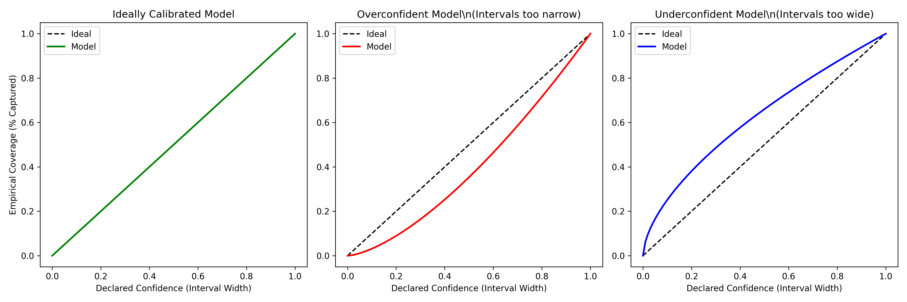
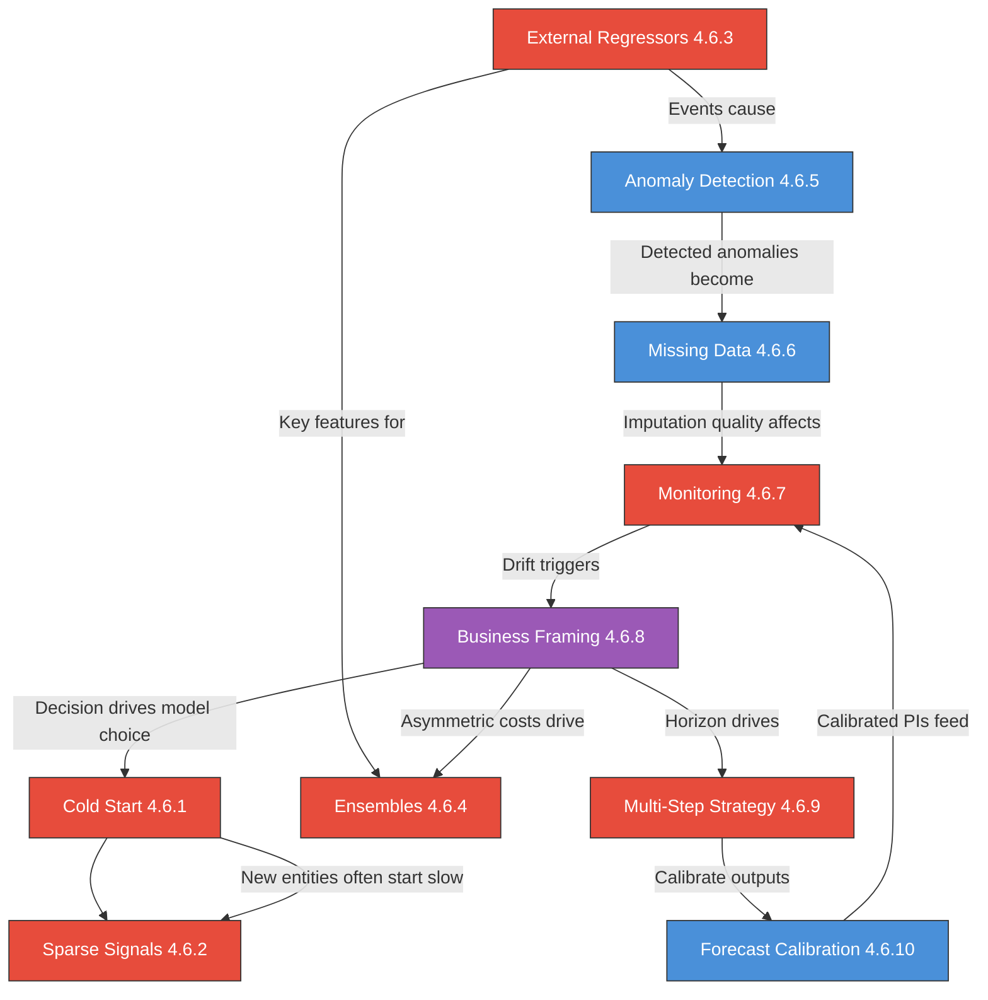

---
# Document Outline
- [Executive Summary](#executive-summary)
- [4.6.1 Cold Start / New Entity Forecasting](#461-cold-start--new-entity-forecasting-h)
  - [Strategies](#cold-start-strategies)
  - [Warm-Up Period](#warm-up-period-when-to-switch-to-direct-forecasting)
  - [Python Implementation](#python-implementation-cold-start)
- [4.6.2 Intermittent / Sparse Signals](#462-intermittent--sparse-signals-h)
  - [Why Standard Methods Fail](#why-standard-methods-fail)
  - [Croston's Method](#crostons-method)
  - [SBA Correction](#sba-syntetos-boylan-approximation)
  - [Python Implementation](#python-implementation-intermittent)
  - [Beyond Croston's: Count Data Models](#beyond-crostons-count-data-models)
  - [Models with Native Sparsity Handling](#models-with-native-sparsity-handling)
- [4.6.3 External Regressors](#463-external-regressors-h)
  - [Known vs Unknown Future Regressors](#known-vs-unknown-future-regressors)
  - [Implementation Approaches](#implementation-approaches)
  - [Python Implementation](#python-implementation-regressors)
- [4.6.4 Forecast Ensembles & Combinations](#464-forecast-ensembles--combinations-h)
- [4.6.5 Anomaly Detection in Time Series](#465-anomaly-detection-in-time-series-m)
  - [Types of Anomalies](#types-of-anomalies)
  - [Detection Methods](#detection-methods)
  - [Handling Strategies](#handling-strategies)
  - [Change Point Detection](#change-point-detection-anomalies-vs-structural-shifts)
- [4.6.6 Missing Data in Time Series](#466-missing-data-in-time-series-m)
  - [Types of Missingness](#types-of-missingness)
  - [Imputation Methods](#imputation-methods)
- [4.6.7 Model Monitoring & Retraining](#467-model-monitoring--retraining-h)
  - [Concept Drift vs Data Drift](#concept-drift-vs-data-drift)
  - [Monitoring Metrics](#what-to-monitor)
  - [Retraining Strategies](#retraining-strategies)
  - [Python Implementation](#python-implementation-monitoring)
- [4.6.8 Business Framing for Forecasting](#468-business-framing-for-forecasting-c)
  - [The Discovery Framework](#the-discovery-framework)
  - [Forecast Value Added (FVA)](#forecast-value-added-fva)
  - [Asymmetric Costs](#asymmetric-costs-the-hidden-objective)
  - [Stakeholder Communication](#presenting-to-stakeholders)
- [4.6.9 Multi-Step Forecasting Strategy](#469-multi-step-forecasting-strategy-h)
  - [The Three Strategies](#the-three-strategies)
  - [Decision Guide](#decision-guide)
  - [Python Implementation](#python-implementation-multi-step)
- [4.6.10 Forecast Calibration](#4610-forecast-calibration-m)
  - [Calibration Diagnostics](#calibration-diagnostics)
  - [Post-Hoc Recalibration](#post-hoc-recalibration)
- [Connections Map](#connections-map)
- [Interview Cheat Sheet](#interview-cheat-sheet)
- [Self-Test Questions](#self-test-questions)
- [Learning Objectives Checklist](#learning-objectives-checklist)

# Executive Summary

> [!CAUTION]
> **Mermaid Chart Syntax Rules**:
> 1. Use `graph` instead of `flowchart` (more compatible across renderers)
> 2. Avoid `<br/>` HTML tags in node labels (use colons or commas instead)
> 3. Avoid Unicode characters (use `phi_1` not `phi_1`)
> 4. Quote labels with special characters like `>`, `<`, or operators

This chapter covers the AS-critical forecasting topics that are frequently asked in Applied Scientist interviews but are typically missing from standard time series curricula. These apply across domains — demand planning, ad revenue forecasting, traffic prediction, energy load management, and more. **Business Framing** (4.6.8) is the Critical-priority anchor: every forecasting interview starts with "tell me about a problem you've solved." **Cold Start** and **External Regressors** are domain-specific skills that differentiate a practitioner who has deployed real forecasting systems. **Multi-Step Strategy** (4.6.9) and **Forecast Calibration** (4.6.10) are general-purpose concepts that affect every forecasting pipeline. **Model Monitoring** shows production thinking. **Anomaly Detection** and **Missing Data** are the data quality gatekeepers that determine whether your model survives contact with the real world. Examples throughout draw from three domains: **retail/supply chain** (demand, inventory), **tech platforms** (ad revenue, DAU/MAU, API traffic), and **transportation** (ridership, travel time, traffic flow).

---

# 4.6 AS-Critical Topics [H]

> **Study Time**: ~18 hours | **Priority**: [H] High (4.6.8 is Critical) | **Goal**: Master the practical, domain-specific forecasting skills that distinguish AS candidates — illustrated across supply chain, tech platform, and transportation domains

---

## 4.6.1 Cold Start / New Entity Forecasting [H]

### One-Liner & Intuition

> [!TIP]
> **If You Remember ONE Thing**: Cold start = no history. Use **similar entity matching** (find analogs with history) or **attribute-based models** (predict from entity features). The key trade-off: more-similar analogs give a better match but a smaller sample.

**One-Liner (15 words)**: *No history? Borrow from similar entities, or predict from attributes.*

**Intuition (Everyday Analogy)**:
Imagine a ride-sharing company launching in a new city. Zero trip data. But you know: it's a metro area with 2M population, high public transit usage, and a university district. You'd look at how similar cities performed in their first months — same population tier, similar transit presence, similar demographics. That's cold-start forecasting: using **what you know about the entity** to borrow patterns from **entities you've already observed**.

---

### Cold Start Strategies

#### Strategy 1: Similar Entity Matching (Analog Method)

Find existing entities with the most similar attributes and use their historical patterns as a proxy.

**Domain examples:**

| Domain | New Entity | Analog Attributes | Borrowed Pattern |
|--------|-----------|-------------------|------------------|
| **Retail** | New SKU "Organic Oat Milk, 32oz" | Category (alt-milk), price tier, size | First-90-days demand curve from similar products |
| **Ad Tech** | New ad campaign for a fintech client | Vertical, budget tier, target audience, ad format | CTR and conversion ramp from similar past campaigns |
| **Transportation** | New bus route in a suburb | Route length, stop density, population served, nearby transit | First-quarter ridership from similar launched routes |

**Similarity measures:**
- **Category/type match**: Same entity type (highest weight)
- **Scale/size tier**: Similar magnitude (within +/- 20%)
- **Seasonality group**: Entities with similar seasonal patterns
- **Launch timing**: Entities launched in the same season/quarter
- **Geographic/segment match**: Same region, market, or user segment

**The similarity-sample trade-off:**

| Strictness | Analogs Found | Match Quality | Forecast Reliability |
|------------|---------------|---------------|---------------------|
| Very strict (exact category + all attributes) | 2-3 entities | Excellent | Low (too small sample) |
| Moderate (same type + key attributes) | 10-30 entities | Good | **Best balance** |
| Loose (same broad class) | 100+ entities | Poor | Low (too diverse) |

> [!NOTE]
> **Interview insight**: "The key trade-off is similarity vs sample size. Very strict matching gives 2-3 perfect analogs but high variance. I'd use moderate matching — same subcategory and key attributes — giving 10-30 analogs, then weight them by similarity score."

---

#### Strategy 2: Attribute-Based Models (Meta-Learning)

Train a model where the **features are entity attributes** and the **target is the forecast quantity** (e.g., first-week metric value, ramp-up rate).

```python
# Training data: historical products with their attributes and first-month sales
features = ['category', 'price', 'brand_tier', 'package_size',
            'launch_month', 'num_competing_products', 'marketing_spend']
target   = 'first_month_units'

# Train on all historical product launches
model = lgb.LGBMRegressor()
model.fit(historical_launches[features], historical_launches[target])

# Predict for new product
new_product = {'category': 'alt_milk', 'price': 5.99, 'brand_tier': 'premium', ...}
predicted_first_month = model.predict(pd.DataFrame([new_product]))
```

**Advantages over analog matching:**
- Handles combinations of attributes never seen together (generalizes)
- Quantifies which attributes matter (feature importance: "price tier explains 35% of launch demand")
- Scales to thousands of attributes automatically

---

#### Strategy 3: Category/Cohort Average (Simplest Baseline)

Use the average historical curve of all entities in the same category. Fast, simple, and surprisingly hard to beat for very new categories.

---

#### Strategy 4: Bayesian Prior + Early Signal

Start with a prior (e.g., category average) and update rapidly as the first signals of real data arrive.

```
Day 0:  Prior = category average (e.g., 1000 daily rides for new transit route)
Day 7:  First week actual = 1400 rides/day --> posterior shifts up
Day 14: Second week actual = 1550 rides/day --> posterior shifts further
Day 30: Enough data --> transition to direct time-series forecasting
```

This naturally solves the **warm-up period** question.

---

### Warm-Up Period: When to Switch to Direct Forecasting

At some point, the new entity accumulates enough history to forecast directly. The key question: **how much data is enough?**

| Model Type | Minimum History Needed | Why |
|------------|----------------------|-----|
| Naive (last period) | 1-2 periods | Just needs one observation |
| Moving average | 4-8 periods | Needs enough to smooth noise |
| ARIMA | 2-3 seasonal cycles | Needs to observe seasonal patterns |
| LightGBM with lags | 2x longest lag feature | E.g., if using lag_28, need 56+ days |
| Prophet | 2 full seasonal cycles | Typically 2+ years for yearly seasonality |

**Practical approach**: Run both the cold-start model AND the direct model in parallel once data starts accumulating. Switch when the direct model's walk-forward CV error is consistently lower.

---

### Python Implementation: Cold Start

```python
import numpy as np
import pandas as pd
from sklearn.metrics.pairwise import cosine_similarity

def find_analogs(new_product_attrs, historical_products, attr_cols, top_k=10):
    """
    Find the most similar historical products for cold-start forecasting.

    Parameters
    ----------
    new_product_attrs  : dict of {attribute: value} for the new product
    historical_products: DataFrame with product attributes + demand history
    attr_cols          : list of attribute columns to use for similarity
    top_k              : number of analogs to return
    """
    # One-hot encode categorical features for similarity
    all_products = pd.concat([
        pd.DataFrame([new_product_attrs]),
        historical_products[attr_cols]
    ])
    encoded = pd.get_dummies(all_products, columns=attr_cols)

    # Cosine similarity between new product (row 0) and all historical
    sim_scores = cosine_similarity(encoded.iloc[:1], encoded.iloc[1:])[0]

    # Get top-k most similar
    top_indices = np.argsort(sim_scores)[-top_k:][::-1]
    analogs = historical_products.iloc[top_indices].copy()
    analogs['similarity_score'] = sim_scores[top_indices]

    return analogs


def cold_start_forecast(analogs, demand_col='first_month_units', weight_col='similarity_score'):
    """Weighted average demand of analog products."""
    weights = analogs[weight_col] / analogs[weight_col].sum()
    forecast = (analogs[demand_col] * weights).sum()
    return forecast
```

---

## 4.6.2 Intermittent / Sparse Signals [H]

### One-Liner & Intuition

> [!TIP]
> **If You Remember ONE Thing**: Intermittent signals = many zeros with sporadic bursts. Standard models (ARIMA, ETS) assume continuous observations and fail. **Croston's method** separates the problem into two parts: "how often do events occur?" and "how large are events when they do?"

**One-Liner**: *Mostly zeros + rare spikes. Model the timing and the size separately.*

**Intuition (Everyday Analogy)**:
Think about how often your car breaks down. You can't predict "tomorrow my car will break down" — most days nothing happens. But you CAN estimate: "Breakdowns happen roughly every 6 months" (timing model) and "When they happen, repairs cost about $500" (size model). Multiply: expected monthly cost = $500 / 6 = $83/month. That's Croston's insight applied to any sparse signal.

---

### Why Standard Methods Fail

Standard forecasting methods (ARIMA, ETS) assume demand is a continuous signal. When demand is mostly zero:

```
Actual demand:  0, 0, 0, 5, 0, 0, 0, 0, 3, 0, 0, 0, 0, 0, 8, 0, 0, ...

ARIMA forecast: 1.2, 1.1, 1.0, 1.0, 1.1, ...  ← always predicts ~1 (mean)
Reality:        demand is EITHER 0 OR 3-8, never ~1
```

**Problems:**
- Mean-based forecasts predict values that **never actually occur** (~1 unit when reality is 0 or 5+)
- MAPE is undefined (divides by zero on zero-demand periods)
- Moving averages are dominated by zeros, chronically under-predicting actual demand events
- Confidence intervals are meaningless (symmetric around the mean, but demand can't be negative)

**Where you see intermittent / sparse signals:**

| Domain | Example | Pattern |
|--------|---------|--------|
| **Supply chain** | Spare parts, slow-moving SKUs, B2B orders | Large infrequent purchase orders |
| **Ad tech** | Rare conversion events (e.g., high-value purchases from ads) | Many impressions, few conversions |
| **Transportation** | Incidents on a specific road segment, bridge openings | Long quiet periods, sudden events |
| **Cybersecurity** | Intrusion alerts, DDoS attacks | Overwhelmingly normal traffic with rare attacks |
| **Healthcare** | ER visits for rare conditions, equipment failures | Sporadic, unpredictable arrivals |

---

### Croston's Method

**Core idea**: Decompose the problem into two separate sub-models:

1. **Demand size model**: "When demand DOES occur, how large is it?" — Apply exponential smoothing only to the non-zero demand values.
2. **Demand interval model**: "How many periods between demand events?" — Apply exponential smoothing to the inter-arrival times.

$$\hat{d} = \frac{\hat{z}}{\hat{p}}$$

Where:
- $\hat{z}$ = smoothed average demand size (when demand > 0) 
- $\hat{p}$ = smoothed average inter-demand interval (periods between non-zero demands)
- $\hat{d}$ = estimated demand per period

**Update rules** (only when demand occurs at time $t$):

$$\hat{z}_t = \alpha \cdot z_t + (1-\alpha) \cdot \hat{z}_{t-1}$$
$$\hat{p}_t = \alpha \cdot p_t + (1-\alpha) \cdot \hat{p}_{t-1}$$

Where $\alpha$ is the smoothing parameter (typically 0.05-0.2 for slow-moving items).

---

### SBA (Syntetos-Boylan Approximation)

Croston's method has a known **positive bias** — it systematically over-forecasts. SBA corrects this:

$$\hat{d}_{SBA} = \left(1 - \frac{\alpha}{2}\right) \cdot \frac{\hat{z}}{\hat{p}}$$

The correction factor $(1 - \alpha/2)$ removes the bias. SBA is the recommended default over basic Croston's.

---

### Alternative: Temporal Aggregation

Instead of specialized methods, aggregate the data to a coarser time granularity where demand becomes less intermittent:

```
Daily:    0, 0, 0, 5, 0, 0, 0, 0, 3, 0, 0, 0, 0, 0, 8  → 73% zeros
Weekly:   5, 3, 8                                         → 0% zeros!
```

At weekly level, standard methods (ARIMA, ETS) work fine. Then disaggregate back if needed.

**Trade-off**: Aggregation smooths the signal but loses information about demand timing within the week.

---

### Python Implementation: Intermittent

```python
import numpy as np

def crostons_method(demand, alpha=0.1, variant='sba'):
    """
    Croston's method for intermittent demand forecasting.
    
    Parameters
    ----------
    demand  : array-like, demand values (including zeros)
    alpha   : smoothing parameter (0.05-0.2 typical for slow-movers)
    variant : 'classic' for original Croston, 'sba' for Syntetos-Boylan (recommended)
    
    Returns
    -------
    float : forecast demand per period
    """
    demand = np.array(demand, dtype=float)
    
    # Initialize with first non-zero demand
    non_zero_idx = np.where(demand > 0)[0]
    if len(non_zero_idx) < 2:
        return np.mean(demand)  # Not enough data for Croston's
    
    # Initial estimates
    z_hat = demand[non_zero_idx[0]]   # Demand size estimate
    p_hat = non_zero_idx[1] - non_zero_idx[0]  # Inter-arrival estimate
    
    periods_since_last = 0
    
    for t in range(non_zero_idx[0] + 1, len(demand)):
        periods_since_last += 1
        
        if demand[t] > 0:
            # Update size estimate (only on demand events)
            z_hat = alpha * demand[t] + (1 - alpha) * z_hat
            # Update interval estimate
            p_hat = alpha * periods_since_last + (1 - alpha) * p_hat
            periods_since_last = 0
    
    # Forecast
    if variant == 'sba':
        forecast = (1 - alpha / 2) * z_hat / p_hat
    else:
        forecast = z_hat / p_hat
    
    return forecast


def classify_demand_pattern(demand, adi_threshold=1.32, cv2_threshold=0.49):
    """
    Classify demand pattern using Syntetos-Boylan classification.
    
    Returns one of: 'smooth', 'erratic', 'intermittent', 'lumpy'
    """
    demand = np.array(demand, dtype=float)
    non_zero = demand[demand > 0]
    
    if len(non_zero) < 2:
        return 'intermittent'
    
    # ADI: Average Demand Interval (periods between non-zero demands)
    non_zero_idx = np.where(demand > 0)[0]
    intervals = np.diff(non_zero_idx)
    adi = np.mean(intervals)
    
    # CV^2: Squared Coefficient of Variation of non-zero demands
    cv2 = (np.std(non_zero) / np.mean(non_zero)) ** 2
    
    if adi < adi_threshold and cv2 < cv2_threshold:
        return 'smooth'      # → Use standard methods (ETS, ARIMA)
    elif adi < adi_threshold and cv2 >= cv2_threshold:
        return 'erratic'     # → Use standard methods with care
    elif adi >= adi_threshold and cv2 < cv2_threshold:
        return 'intermittent' # → Use Croston's / SBA
    else:
        return 'lumpy'       # → Hardest case: Croston's + aggregation

# Usage
demand = [0, 0, 0, 5, 0, 0, 0, 0, 3, 0, 0, 0, 0, 0, 8, 0, 0, 0, 2, 0]
pattern = classify_demand_pattern(demand)
print(f"Demand pattern: {pattern}")
print(f"SBA forecast: {crostons_method(demand, variant='sba'):.2f} units/period")
```

---

### Beyond Croston's: Count Data Models

Croston's method is designed specifically for intermittent demand (separating timing from size). But a broader class of models exists for **any count-valued** or sparse target — applicable across domains.

> [!NOTE]
> **When to go beyond Croston's**: Croston's assumes exponential smoothing and flat demand. If your sparse signal has trends, seasonality, or external regressors, count data regression models are more flexible.

#### Poisson Regression

The simplest count model. Target $y$ follows a Poisson distribution with rate $\lambda$:

$$y \sim \text{Poisson}(\lambda), \quad \log(\lambda) = \mathbf{x}^T \boldsymbol{\beta}$$

- **When to use**: Count targets (arrivals, incidents, transactions) with mean approximately equal to variance
- **Limitation**: Assumes mean = variance. Real count data is usually **over-dispersed** (variance > mean)

#### Negative Binomial Regression

Relaxes the Poisson's mean=variance constraint:

$$y \sim \text{NegBin}(\mu, \alpha), \quad \text{Var}(y) = \mu + \alpha \mu^2$$

- **When to use**: Over-dispersed counts — the default in practice
- **Examples**: Hospital ER visits per day, insurance claims per month, security incidents per week

#### Zero-Inflated Models

When your data has **more zeros than a standard count distribution predicts** — the zeros come from two processes:

1. **Structural zeros**: The event *cannot* occur (a road segment under construction has zero traffic not because traffic is low, but because it's physically blocked)
2. **Sampling zeros**: The event *could* occur but didn't this period (low-traffic road had zero vehicles this hour by chance)

$$P(y=0) = \pi + (1-\pi) \cdot P_{\text{count}}(0)$$
$$P(y=k) = (1-\pi) \cdot P_{\text{count}}(k), \quad k > 0$$

Where $\pi$ = probability of structural zero, $P_{\text{count}}$ = Poisson or NegBin.

#### Tweedie Distribution

A flexible distribution that naturally handles the **zero-spike + continuous-positive** pattern:

- **Power parameter $p$**: Controls the shape
  - $p = 1$: Poisson (counts)
  - $1 < p < 2$: Compound Poisson-Gamma — **the sweet spot for sparse forecasting** (exact zeros + continuous positive values)
  - $p = 2$: Gamma (strictly positive)

**Why it matters**: LightGBM supports Tweedie natively (`objective='tweedie'`), making it the easiest path to handle sparse targets in an ML pipeline:

```python
import lightgbm as lgb

# Tweedie regression for sparse/count targets
model = lgb.LGBMRegressor(
    objective='tweedie',
    tweedie_variance_power=1.5,  # Between 1 and 2
    n_estimators=500,
    learning_rate=0.05
)
model.fit(X_train, y_train)

# Predictions are the expected rate (can be fractional)
preds = model.predict(X_test)
```

#### When to Use Which

| Data Pattern | Best Model | Why |
|-------------|-----------|-----|
| Intermittent, no regressors, no trend | **Croston's / SBA** | Simple, purpose-built |
| Counts with regressors and seasonality | **Negative Binomial regression** | Handles over-dispersion + covariates |
| Excess zeros from two processes | **Zero-Inflated Poisson/NB** | Separates structural vs sampling zeros |
| Sparse target in ML pipeline (LightGBM) | **Tweedie objective** | Native support, easy to implement |
| Continuous positive with zero-spike | **Tweedie ($1 < p < 2$)** | Natural distribution for this pattern |

> [!TIP]
> **Interview framing**: "For intermittent demand with no features, I'd use Croston's SBA. But if I need to incorporate seasonality, promotions, or other regressors, I'd use LightGBM with a Tweedie objective — it naturally handles the zero-inflated structure. For strictly count data with structural zeros, I'd consider a zero-inflated negative binomial model."

---

### Models with Native Sparsity Handling

Beyond choosing the right distribution, certain machine learning architectures are structurally and computationally designed to handle sparse inputs and targets out-of-the-box:

| Model Architecture | How It Handles Sparsity (Mechanism) | Why It Works |
|--------------------|-------------------------------------|--------------|
| **Gradient Boosted Trees** (XGBoost, LightGBM) | **Sparsity-aware split finding.** The algorithm only evaluates splits on non-zero values; zeros (or missing data) are efficiently routed to a learned "default direction." | Computationally extremely fast on sparse data. It allows the trees to isolate feature combinations that strictly separate zero vs. non-zero events without being overwhelmed by computing zero-value splits. |
| **Global Probabilistic DL** (DeepAR, MQ-CNN) | **Cross-learning + Complex Emission Distributions.** Learns shared representations across thousands of items simultaneously rather than fitting one model per item. | Local models fail on sparse data due to lack of signal. Global models pool data to find patterns. Furthermore, the output layer can directly emit parameters for a **Zero-Inflated Negative Binomial (ZINB)** distribution. |
| **Dual-Head Neural Networks** (Neural Croston's) | **Multi-task loss functions.** The network splits into two heads: a classification head for event probability, and a regression head for event size. | Mimics Croston's logic natively but allows non-linear feature interactions. The regression head loss is "masked" so it only penalizes errors on days where an event actually occurred. |
| **Temporal Fusion Transformers** (TFT) | **Static covariates + Gating mechanisms.** Relies heavily on static metadata to group sparse items, and gates out irrelevant temporal noise. | Can learn that for highly intermittent series, historical lags are uninformative (and thus gated out), while static metadata (category) and known future events (promotions) drive the forecast flag. |

---

## 4.6.3 External Regressors [H]

### One-Liner & Intuition

> [!TIP]
> **If You Remember ONE Thing**: External regressors improve forecasts when they are **causal** (promotions cause demand spikes) AND when you **know their future values**. The biggest pitfall: using regressors whose future values are themselves uncertain (tomorrow's weather is a forecast, not a fact).

**One-Liner**: *Bring outside information in — but only if you'll have it at prediction time.*

**Intuition (Everyday Analogy)**:
Predicting how busy a transit station will be tonight. Pure time series: "Friday evenings are usually busy." With regressors: "It's Friday + there's a concert at the nearby arena + it's raining + a major road is under construction." Each external factor adds signal. But you must know them **before** making the forecast. "How many people will check social media about delays" is unknowable in advance — using it as a feature means your model needs a crystal ball.

---

### Known vs Unknown Future Regressors

This is the **most important distinction** for external regressors in time series:

| Type | Retail Examples | Ad Tech Examples | Transportation Examples | How to Handle |
|------|----------------|-----------------|------------------------|---------------|
| **Known future** | Holidays, promotions, planned price changes | Campaign schedules, budget caps, ad format changes | Planned road closures, event calendars, schedule changes | Use directly as features |
| **Forecastable future** | Weather (7-day), macro indicators | Competitor ad spend (estimated), platform algorithm changes | Weather, fuel prices, school schedules | Use forecast + propagate uncertainty |
| **Unknown future** | Competitor promotions (unannounced), viral posts | Viral content shifts, regulatory actions | Accidents, natural disasters, viral social posts | Cannot use as forward-looking features |

> [!WARNING]
> **The #1 regressor mistake**: Using a feature that is available in the training set but NOT available at prediction time. Example: using "actual weather" as a feature when training (known retrospectively) but needing "forecast weather" at inference time. The model trains on perfect data and sees noisy forecasts in production — performance degrades silently.

---

### The Causality Question

Not all correlated regressors are useful:

```
Correlation vs Causation for regressors:

Useful (causal):     Planned road closure --> traffic rerouting (closure CAUSES rerouting)
Useful (leading):    Event ticket sales --> transit ridership (tickets PRECEDE the event)
Dangerous (lagging): Revenue reports --> ad spend (reports come AFTER spend decisions)
Useless (spurious):  Ice cream sales --> drowning deaths (both caused by summer)
```

**Interview framing**: "Before adding a regressor, I check two things: (1) Is it available at prediction time? (2) Is the relationship plausibly causal or at least leading? A correlated feature with no causal mechanism may break when the correlation structure shifts."

---

### Implementation Approaches

#### In ARIMAX (ARIMA with Exogenous Variables)

```python
from statsmodels.tsa.arima.model import ARIMA

# ARIMAX: ARIMA + external regressors
model = ARIMA(
    endog=train_y,           # Target: demand
    exog=train_X[['promo_flag', 'price', 'holiday']],  # Regressors
    order=(1, 1, 1)
)
result = model.fit()

# Forecast: MUST provide future values of regressors
future_exog = test_X[['promo_flag', 'price', 'holiday']]  # Known future values
forecast = result.forecast(steps=30, exog=future_exog)
```

#### In Prophet

```python
from prophet import Prophet

m = Prophet()
m.add_regressor('promo_flag')
m.add_regressor('price', standardize=True)
m.add_regressor('temperature')

m.fit(train_df)  # df must have columns: ds, y, promo_flag, price, temperature

# Future dataframe must include future regressor values
future = m.make_future_dataframe(periods=30)
future['promo_flag'] = planned_promos       # Known
future['price'] = planned_prices            # Known
future['temperature'] = weather_forecast    # Forecastable (uncertain!)
forecast = m.predict(future)
```

#### In LightGBM (Most Flexible)

```python
import lightgbm as lgb

# Features include both lag features AND external regressors
feature_cols = [
    # Time-series features
    'lag_7', 'lag_14', 'lag_28', 'rolling_mean_7', 'rolling_std_7',
    'day_of_week', 'month', 'is_weekend',
    # External regressors
    'promo_flag', 'promo_type', 'discount_pct',
    'price', 'competitor_price_ratio',
    'temperature', 'precipitation',
    'is_holiday', 'holiday_proximity',  # Days until/since nearest holiday
]

model = lgb.LGBMRegressor(n_estimators=1000)
model.fit(train_df[feature_cols], train_df['demand'])

# Feature importance reveals which regressors matter
importance = pd.Series(
    model.feature_importances_, index=feature_cols
).sort_values(ascending=False)
print(importance.head(10))
```

> [!NOTE]
> **Regressor encoding tips (domain-specific):**
> - **Retail promotions**: Type (BOGO, 20%-off), discount depth, duration, days-since-last-promo (fatigue), is-first-promo
> - **Ad campaigns**: Creative format, bid strategy, audience size, competitive auction density, budget utilization rate
> - **Transportation events**: Event capacity, distance-to-station, event type (sports/concert/conference), overlapping events count

---

## 4.6.4 Forecast Ensembles & Combinations [H]

> [!IMPORTANT]
> **This topic is fully covered in [ensembling_methods.md](file:///c:/Users/mmbka/OneDrive/AS_DS_prep/technical-study-and-projects/plan/time-series/ensembling_methods.md), Section 5: Forecast-Specific Ensembling.**
>
> That section covers: simple averaging, weighted averaging, forecast stacking with walk-forward CV, the diversity requirement, M-competition findings, when NOT to ensemble, interview cheat sheet, and learning objectives checklist.

**Quick reference (study this in ensembling_methods.md):**
- Simple averaging of 3 diverse models (ARIMA + Prophet + LightGBM) is a top-50 M4 solution
- Stacking requires walk-forward CV for the meta-learner (never random k-fold)
- Diversity matters more than model count — 3 structurally different models beat 10 similar ones
- When NOT to ensemble: latency constraints, interpretability needs, MLOps limits

---

## 4.6.5 Anomaly Detection in Time Series [M]

### One-Liner & Intuition

> [!TIP]
> **If You Remember ONE Thing**: Anomalies are observations that deviate significantly from the expected pattern. Detect them BEFORE training (data quality) and AFTER deploying (monitoring). The action depends on the cause: remove if data error, impute if one-off event, keep if real but rare.

**One-Liner**: *Find the observations that don't belong — then decide: remove, impute, or keep.*

---

### Types of Anomalies

| Type | Description | Retail Example | Platform / Transport Example |
|------|-------------|----------------|-----------------------------|
| **Point anomaly** | Single observation far from expected | 10x normal sales (data entry error) | Sudden 5x spike in API latency (infra glitch); 3x ridership on a random Tuesday |
| **Contextual anomaly** | Normal value in wrong context | 500 units on Christmas would be normal in Dec, anomalous in July | Heavy weekend traffic on a business-district sensor |
| **Collective anomaly** | A sequence anomalous as a group | 2 weeks of zero sales (store closure) | 3 days of flat-line ad impressions (tracking pixel broken); a week of zero toll transactions (sensor offline) |

---

### Detection Methods

Textbooks and standard industry practice typically divide time series anomaly detection into three or four distinct architectural approaches, moving from simple to complex. As you noted, the core mechanism behind the advanced methods essentially boils down to checking if points fall outside an expected **Prediction Interval (PI)**.

#### 1. Naïve Statistical Thresholds (Direct on Data)

Applying statistical boundaries directly to the raw time series or a rolling average.
* **How it works**: Flags any point > 3 standard deviations from the mean (Z-score) or outside the Q1/Q3 boundaries (IQR).
* **The Problem**: It flags peak seasonality as "anomalies" because it doesn't understand seasonal patterns. Rarely used in practice unless the data has strictly no trend or seasonality.

#### 2. Decomposition-Based Methods (The Textbook Standard)

This is the standard approach for univariate time series (popularized by Twitter's `AnomalyDetection` S-H-ESD algorithm).
* **How it works**: Decompose the series into Trend, Seasonality, and Remainder using methods like STL.
* **Detection logic**: Apply statistical tests **only to the Remainder** component. Because trend and seasonality are removed, the remainder should be roughly stationary. You can safely use robust metrics like IQR (vital for non-normal errors) to flag the anomalies.

```python
from statsmodels.tsa.seasonal import STL
import numpy as np

def detect_anomalies_stl_iqr(ts, period=7, multiplier=3.0):
    """Textbook approach: STL decomposition + IQR on the remainder."""
    # 1. Decompose to remove trend & seasonality
    result = STL(ts, period=period, robust=True).fit()
    remainder = result.resid
    
    # 2. Apply robust IQR test to the remainder
    q1, q3 = np.percentile(remainder, [25, 75])
    iqr = q3 - q1
    lower_bound = q1 - (multiplier * iqr)
    upper_bound = q3 + (multiplier * iqr)
    
    anomaly_mask = (remainder < lower_bound) | (remainder > upper_bound)
    return anomaly_mask, result
```

#### 3. Model Prediction Intervals (The Forecasting Approach)

Instead of generically decomposing the series, leverage your actual forecasting model (ARIMA, Prophet, LightGBM) to define what is "normal".
* **How it works**: Generate forecasts with Prediction Intervals (e.g., 99% PI). If the actual observation falls outside the PI, it's flagged as an anomaly.
* **The Unified View**: As you accurately noted, this unifies the concept. Whether the model assumes normal errors (parametric PI using standard deviations) or uses quantile regression (non-parametric PI for skewed data), the logic is the same: the model draws an uncertainty envelope, and anything escaping it is anomalous.

#### 4. Unsupervised Machine Learning (Multivariate)

Modern curricula often include algorithms designed for high-dimensional or complex non-linear anomaly detection.
* **How it works**: Using algorithms like **Isolation Forests** or **Autoencoders**.
* **When to use**: Best when tracking multiple interacting time series simultaneously, where an anomaly might not be an extreme value in one series, but a strange *combination* of values across several.

---

### Handling Strategies

| Action | When to Apply | Implementation & Rationale |
|--------|--------------|----------------------------|
| **Remove (Nullify)** | Data entry error, sensor glitch (The data is literally false) | Replace with `NaN`. **Why not impute?** Imputing injects artificial data and false confidence (artificially lowering variance). If your model supports missing values natively (Prophet, LightGBM, DeepAR), it's better to let the model know "we have zero information here" rather than feeding it forged data. |
| **Impute (Replace)** | Model requires complete data, OR a real but one-off event (e.g., warehouse fire) | Replace with a synthetic value (e.g., seasonal interpolation). **Why impute?** Required if your model (like standard ARIMA or basic NNs) crashes on `NaN` (because standard matrix multiplications require defined numerical values; a single `NaN` input propagates through the network, turning all downstream activations and gradients into `NaN`). Alternatively, used to actively "smooth over" a real anomalous event so the model doesn't learn it as a repeating pattern. |
| **Keep** | Real demand event the model should learn (e.g., viral social media post) | Leave in training data; possibly add an event flag feature |
| **Flag** | Uncertain cause; let domain expert decide | Add `is_anomaly` column for human review |

> [!NOTE]
> **Interview framing**: "I separate detection from action. Detection is statistical (residuals beyond 3 sigma from STL decomposition). Action depends on root cause: if it's a data error, I impute with seasonal interpolation. If it's a real event (Black Friday, viral tweet, transit service disruption), I keep it and add an event feature so the model learns the pattern."

---

### Change Point Detection: Anomalies vs Structural Shifts

> [!IMPORTANT]
> **The critical distinction**: An anomaly is a **temporary** deviation — the series returns to normal. A change point is a **permanent** structural shift — the series has a new normal. Treating change points as anomalies leads to over-imputation; treating anomalies as change points leads to unnecessary retraining.

| Concept | Duration | Action | Example |
|---------|----------|--------|---------|
| **Anomaly** | Temporary (1-few points) | Remove/impute/keep + flag | Flash sale spike, sensor glitch, server outage |
| **Change point** | Permanent (new regime) | Retrain model, update baseline | New competitor enters market, policy change, infrastructure upgrade, pandemic onset |

#### Why It Matters for Forecasting

1. **Stationarity checks** (4.1.2): A change point means the series is non-stationary *even after differencing* — the parameters themselves have changed
2. **Retraining triggers** (4.6.7): The most important retraining trigger is a detected change point — not just accumulated error
3. **Training window selection**: After a change point, older data may be harmful, not helpful — use only post-changepoint data

#### Method 1: PELT (Pruned Exact Linear Time)

The standard offline method for detecting multiple change points in mean and/or variance.

```python
import ruptures as rpt
import numpy as np

def detect_changepoints_pelt(signal, penalty=10, model='rbf'):
    """
    Detect change points using PELT algorithm.
    
    Parameters
    ----------
    signal  : array-like, time series values
    penalty : controls sensitivity (higher = fewer changepoints)
    model   : cost function ('l2' for mean shifts, 'rbf' for general changes)
    
    Returns
    -------
    list : indices of detected change points
    """
    signal = np.array(signal)
    
    algo = rpt.Pelt(model=model, min_size=14).fit(signal)
    changepoints = algo.predict(pen=penalty)
    
    # Last element is always len(signal), remove it
    return changepoints[:-1]


# Example usage
np.random.seed(42)
# Simulate: 100 points at mean=50, then 100 at mean=70, then 100 at mean=55
signal = np.concatenate([
    np.random.normal(50, 5, 100),
    np.random.normal(70, 5, 100),
    np.random.normal(55, 8, 100)  # Also variance changed
])

cps = detect_changepoints_pelt(signal, penalty=10)
print(f"Detected change points at indices: {cps}")
# Expected: approximately [100, 200]
```

#### Method 2: BOCPD (Bayesian Online Change Point Detection)

For **real-time** monitoring — detects change points as data arrives, without needing the full series:

- **Key idea**: At each new data point, compute the probability that a change point just occurred vs the current regime continues
- **Output**: A "run length" probability distribution — the probability of being $r$ steps into the current regime
- **Advantage**: Online (streaming-compatible); probabilistic (gives confidence in change detection)
- **Library**: `bayesian_changepoint_detection` Python package, or implement from Adams & MacKay (2007)

#### Method 3: CUSUM (Cumulative Sum Control Chart)

The classic quality-control approach for sequential shift detection:

$$S_t = \max(0, S_{t-1} + (x_t - \mu_0) - k)$$

- Flags a change when $S_t > h$ (threshold)
- $\mu_0$ = baseline mean, $k$ = allowance (tolerance for noise), $h$ = decision threshold
- **Advantage**: Simple, interpretable, widely used in manufacturing/operations monitoring
- **Limitation**: Designed for mean shifts only; requires pre-specifying the baseline mean

#### Practical Guidance

| Scenario | Method | Why |
|----------|--------|-----|
| Offline analysis of historical data | **PELT** | Finds all change points optimally in O(n) |
| Real-time monitoring / alerting | **BOCPD** or **CUSUM** | Online, no look-ahead required |
| Simple mean-shift detection | **CUSUM** | Simplest to implement and explain |
| Unknown change type (mean, variance, or both) | **PELT with `model='rbf'`** | General-purpose cost function |

> [!TIP]
> **Interview framing**: "I distinguish anomalies from structural change points. For anomalies, I use STL decomposition + IQR on residuals. For change points, I use PELT (offline) or CUSUM (online). When I detect a change point, my first action is to evaluate whether the model should be retrained on only the post-change data — old data that comes from a different regime can actually hurt forecast accuracy."

> [!NOTE]
> **Connection to model monitoring (4.6.7)**: Change point detection is the most principled way to decide *when* to retrain. Instead of arbitrary schedules (weekly/monthly) or simple error thresholds, a detected change point signals that the data-generating process itself has shifted — the strongest possible retraining signal.

---

## 4.6.6 Missing Data in Time Series [M]

### One-Liner & Intuition

> [!TIP]
> **If You Remember ONE Thing**: Missing data in time series is harder than in tabular data because **order matters**. Forward-fill is the safest default, but imputed values should never be treated as "real" for model training — always flag them.

**One-Liner**: *Fill the gaps without creating fake patterns — and always flag what you filled.*

---

### Types of Missingness

| Type | Pattern | Examples Across Domains | Risk |
|------|---------|------------------------|------|
| **Random (MCAR)** | Scattered, no pattern | Sensor drops a reading; API timeout loses a data point | Low — most imputation works |
| **Systematic** | Predictable gaps | No data on weekends (store closed); no transit data during overnight hours | Medium — structural gap, NOT missing activity |
| **Burst** | Consecutive block missing | System outage for 3 days; ad tracking pixel broken for a week | High — interpolation unreliable across long gaps |
| **Censored** | Value exists but isn't observed | Stockout: demand > 0 but sales = 0; sensor saturation (max reading hit); rate-limited API returns 0 instead of true count | **Critical** — creates systematic bias |

> [!WARNING]
> **Censored data is NOT missing data** — it's the most dangerous form of data corruption in forecasting. It occurs when the TRUE value exists but the measurement system can't capture it:
> - **Retail**: Product out of stock → true demand > 0 but recorded sales = 0
> - **Transportation**: Traffic sensor saturates at 2000 vehicles/hr → actual flow could be 2500 but reads as 2000
> - **Ad tech**: Rate-limited impression counter returns 0 during traffic spikes → actual impressions > 0
>
> Training on censored values teaches the model to systematically under-predict. This requires **uncensored estimation**, not simple imputation.

---

### Imputation Methods

#### Method 1: Forward Fill (Last Observation Carried Forward)

```python
# Safest for short gaps in relatively stable series
df['demand'] = df['demand'].ffill()
```

**When to use**: Short gaps (1-2 periods), stable series. **Risk**: Creates artificial flat patches that reduce apparent variance.

#### Method 2: Linear Interpolation

```python
# Smooth transition across gaps
df['demand'] = df['demand'].interpolate(method='linear')
```

**When to use**: Short-medium gaps, trending data. **Risk**: Can't capture seasonality within the gap.

#### Method 3: Seasonal Interpolation

```python
def seasonal_impute(series, period=7):
    """
    Fill missing values using same day from previous and next cycle.
    
    For weekly seasonality (period=7): missing Monday is filled with
    average of last Monday and next Monday.
    """
    result = series.copy()
    missing_idx = result[result.isna()].index
    
    for idx in missing_idx:
        # Look back and forward by one seasonal period
        back = idx - period
        forward = idx + period
        
        values = []
        if back >= 0 and not np.isnan(result.iloc[back]):
            values.append(result.iloc[back])
        if forward < len(result) and not np.isnan(result.iloc[forward]):
            values.append(result.iloc[forward])
        
        if values:
            result.iloc[idx] = np.mean(values)
    
    return result
```

**When to use**: Data with clear seasonality and medium-length gaps.

#### Method 4: Model-Based Imputation

Fit a model on non-missing data, predict the missing values. Best for complex patterns.

---

### Best Practices

1. **Always add an `is_imputed` flag column** — imputed values have lower information content and should optionally be down-weighted during training
2. **Report the missingness rate** — if > 20% of data is missing, question whether the series is usable at all
3. **Don't impute targets for training** — imputed values create circular reasoning (model learns its own imputed signal)
4. **Check for missingness-value correlation** — if data is missing specifically during high-activity periods (stockouts in retail, sensor saturation in transportation, rate-limiting in ad tech), simple imputation will systematically under-estimate the true values

---

## 4.6.7 Model Monitoring & Retraining [H]

### One-Liner & Intuition

> [!TIP]
> **If You Remember ONE Thing**: A model that was accurate last month may be wrong today. Monitor **forecast error over time** and **retrain when error exceeds a threshold** — not on a fixed schedule, but when the data tells you the world has changed.

**One-Liner**: *Models decay. Monitor error over time, detect drift, retrain before it costs the business.*

**Intuition (Everyday Analogy)**:
Your GPS learns your commute pattern: "Leave at 7:30, arrive by 8:15." Then a new highway opens. The GPS keeps routing you the old way, gradually getting worse. You don't need to re-learn your commute every day (wasteful), but you DO need to notice when the old route is consistently wrong and update. That's monitoring + triggered retraining.

---

### Concept Drift vs Data Drift

| Type | What Changes | Example | Detection |
|------|-------------|---------|-----------|
| **Data drift** (covariate shift) | Distribution of inputs (X) changes | Customer demographics shift; new product categories appear | Monitor feature distributions (PSI, KL divergence) |
| **Concept drift** | Relationship between X and Y changes | Same promotions now produce smaller demand lifts (post-COVID behavior change) | Monitor prediction error over time |
| **Label drift** | Distribution of target (Y) changes | Average demand shifts up across all products (inflation, population growth) | Monitor target distribution statistics |

> [!IMPORTANT]
> **For forecasting, concept drift is the most dangerous** because your features remain stable but the model's learned relationships are wrong. A model that learned "20% discount = 30% demand lift" before COVID may find that post-COVID, "20% discount = only 10% demand lift" — the input looks the same but the output is wrong.

---

### What to Monitor

#### 1. Forecast Error Over Time (The Primary Signal)

Track MASE, WAPE, or MAE on a rolling basis. If error increases persistently, the model is drifting.

```python
import pandas as pd
import numpy as np

def rolling_forecast_error(actuals, forecasts, dates, window=28):
    """
    Compute rolling MAE over time to detect drift.
    
    A sustained increase in rolling MAE signals model degradation.
    """
    df = pd.DataFrame({
        'date': dates,
        'actual': actuals,
        'forecast': forecasts,
        'abs_error': np.abs(np.array(actuals) - np.array(forecasts))
    })
    df['rolling_mae'] = df['abs_error'].rolling(window=window).mean()
    return df
```

#### 2. Forecast Bias (Systematic Over/Under-Prediction)

```python
def rolling_bias(actuals, forecasts, dates, window=28):
    """
    Rolling mean signed error. Positive = over-forecasting.
    
    Alert if bias crosses a threshold (e.g., > 5% of mean demand).
    """
    df = pd.DataFrame({
        'date': dates,
        'signed_error': np.array(forecasts) - np.array(actuals)
    })
    df['rolling_bias'] = df['signed_error'].rolling(window=window).mean()
    df['bias_pct'] = df['rolling_bias'] / np.mean(actuals) * 100
    return df
```

#### 3. Feature Distribution Shift (PSI)

Population Stability Index (PSI) measures how much a feature's distribution has shifted from the training distribution:

```python
def psi(expected, actual, bins=10):
    """
    Population Stability Index.
    PSI < 0.1: no significant shift
    PSI 0.1-0.25: moderate shift (investigate)
    PSI > 0.25: significant shift (retrain)
    """
    expected_pcts, bin_edges = np.histogram(expected, bins=bins)
    actual_pcts, _ = np.histogram(actual, bins=bin_edges)
    
    # Normalize to proportions
    expected_pcts = expected_pcts / len(expected) + 1e-6
    actual_pcts = actual_pcts / len(actual) + 1e-6
    
    psi_value = np.sum((actual_pcts - expected_pcts) * np.log(actual_pcts / expected_pcts))
    return psi_value
```

---

### Retraining Strategies

| Strategy | How It Works | Pros | Cons |
|----------|-------------|------|------|
| **Scheduled** (e.g., weekly) | Retrain every N days regardless of performance | Simple, predictable MLOps pipeline | May waste compute if model is fine, or miss drift between retrains |
| **Triggered** (error-based) | Retrain when rolling error exceeds a threshold | Efficient, adapts to actual drift | Requires monitoring infrastructure, may lag if alert threshold is too high |
| **Expanding window** | Retrain on ALL historical data | Maximum data utilization | Old patterns may not represent current behavior |
| **Sliding window** | Retrain on recent N months only | Adapts to recent behavior, drops stale data | Less data per retrain, may miss long-term patterns |
| **Hybrid** | Scheduled retrain + triggered emergency retrain | Best of both worlds | Most complex to implement |

> [!NOTE]
> **The retraining trade-off**: Retrain too often → noise (model chases random fluctuations). Retrain too rarely → drift (model misses genuine behavioral changes). **Start with weekly scheduled retrains and a triggered alert at 2x baseline MAE for emergency retrains.**

---

### Production Monitoring Pipeline

```python
def should_retrain(rolling_mae, baseline_mae, bias_pct,
                   mae_threshold=1.5, bias_threshold=5.0):
    """
    Decision function: should we trigger an emergency retrain?
    
    Parameters
    ----------
    rolling_mae   : current 28-day rolling MAE
    baseline_mae  : MAE when model was last trained (on validation set)
    bias_pct      : rolling bias as % of mean demand
    mae_threshold : retrain if rolling_mae > baseline * threshold
    bias_threshold: retrain if abs(bias_pct) > threshold
    """
    reasons = []
    
    if rolling_mae > baseline_mae * mae_threshold:
        reasons.append(f"MAE degraded: {rolling_mae:.1f} vs baseline {baseline_mae:.1f} "
                      f"({rolling_mae/baseline_mae:.1f}x)")
    
    if abs(bias_pct) > bias_threshold:
        direction = "over" if bias_pct > 0 else "under"
        reasons.append(f"Systematic {direction}-forecasting: {bias_pct:.1f}% bias")
    
    if reasons:
        print("RETRAIN TRIGGERED:")
        for r in reasons:
            print(f"  - {r}")
        return True
    
    return False
```

---

## 4.6.8 Business Framing for Forecasting [C]

### One-Liner & Intuition

> [!TIP]
> **If You Remember ONE Thing**: Every forecasting interview starts with "tell me about a forecasting problem." The answer is NOT about the model — it's about the **business decision** the forecast supports. Start with: what decision, what horizon, what granularity, what's the cost of being wrong.

**One-Liner**: *The forecast exists to support a decision. Start with the decision, not the model.*

**Intuition (Everyday Analogy)**:
A doctor doesn't order every possible blood test. They ask: "What symptoms do you have? What decisions will these results inform?" The test choice depends on the decision. Similarly: a weekly inventory replenishment decision needs a 1-week-ahead, SKU-level forecast. A transit agency planning next quarter's schedule needs a monthly, route-level forecast. An ad platform optimizing bid strategy needs an hourly, campaign-level forecast. The same forecasting toolkit, wildly different models, granularities, and metrics.

---

### The Discovery Framework

> [!IMPORTANT]
> **Before touching any data**, answer these 5 questions. This is how senior AS candidates demonstrate problem formulation skills.

#### Question 1: What Decision Does This Forecast Support?

| Domain | Decision | Forecast Need |
|--------|----------|---------------|
| **Supply Chain** | Inventory replenishment | SKU-level, short-horizon (1-4 weeks), biased toward over-prediction (stockout cost > holding cost) |
| **Supply Chain** | Capacity planning (warehouses, staffing) | Aggregate-level, medium-horizon (1-6 months), point + PI |
| **Ad Tech** | Campaign budget allocation | Campaign-level, medium-horizon (1-4 weeks), must include ROAS uncertainty |
| **Ad Tech** | Real-time bidding optimization | Impression-level, very short (minutes-hours), must balance spend rate vs conversion |
| **Transportation** | Schedule/route planning | Route-level, medium-horizon (1-3 months), must capture peak vs off-peak |
| **Transportation** | Congestion management / tolling | Segment-level, short-horizon (hours-days), must be directionally correct during peaks |
| **Platform** | Infrastructure capacity (servers, CDN) | Service-level, short-horizon (hours-days), biased toward over-prediction (downtime cost >> idle cost) |

#### Question 2: What Forecast Horizon?

The horizon is determined by the **decision lead time** — how far in advance the decision-maker needs to act:

| Domain | Decision | Lead Time | Required Horizon |
|--------|----------|-----------|-----------------|
| Supply Chain | Store restock | 2-3 days | 7 days (buffer) |
| Supply Chain | Factory capacity | 6-12 months | 12-18 months |
| Ad Tech | Campaign budget reallocation | 1-3 days | 7-14 days |
| Ad Tech | Quarterly planning | 1-2 months | 3-6 months |
| Transportation | Daily staffing / vehicle dispatch | 12-24 hours | 1-3 days |
| Transportation | Schedule revision / infrastructure | 3-6 months | 6-12 months |

#### Question 3: What Granularity?

| Level Pattern | Supply Chain | Ad Tech | Transportation |
|---------------|-------------|---------|----------------|
| **Finest (high noise)** | SKU-store-day | Campaign-adset-hour | Segment-direction-hour |
| **Standard** | SKU-week | Campaign-day | Route-day |
| **Tactical** | Category-region-week | Channel-week | Corridor-week |
| **Strategic** | Company-month | Platform-quarter | Network-month |

#### Question 4: What Metric Aligns with Business Impact?

Connect the metric to the actual cost function:
- **Availability-critical** (stockouts, server downtime, transit delays): use RMSE or quantile loss biased toward over-prediction
- **Cost-averse** (ad overspend, excess inventory, over-staffing): use MAE or quantile loss biased toward under-prediction
- **Volume-weighted accuracy**: use WAPE when high-volume entities drive the business
- **Relative to baseline**: use MASE to prove you're adding value vs doing nothing

#### Question 5: What Are the Asymmetric Costs?

Almost no business has symmetric error costs. Asking this question in an interview is a strong senior-level signal.

---

### Asymmetric Costs: The Hidden Objective

In nearly every forecasting context, **under-forecasting and over-forecasting have different costs**. The model's loss function should reflect this.

**What is the "Optimal Quantile"?**
Derived from the classic Newsvendor model in operations research, the optimal quantile (or critical ratio) is the exact statistical percentile your forecast should target to minimize total business financial losses.

Instead of forecasting the "average" (the 50th percentile), you mathematically shift your prediction higher or lower depending on which error costs more:
- If **under-forecasting** is worse (e.g., lost sales > inventory holding cost), your optimal quantile is **> 50%**. You intentionally over-predict to build a safety buffer.
- If **over-forecasting** is worse (e.g., wasted food > lost margin), your optimal quantile is **< 50%**. You intentionally under-predict to avoid waste.

**Multi-domain asymmetric cost examples:**

| Domain | Over-Forecast Cost | Under-Forecast Cost | Which Is Worse? | Optimal Quantile |
|--------|-------------------|--------------------|-----------------|-----------------|
| **Inventory** | Holding cost ($0.50/unit/day) | Stockout + customer loss ($5/unit) | Under-forecast 10x worse | ~91st percentile |
| **Ad spend** | Wasted budget on low-ROI slots ($0.10/impression) | Missed high-value impressions ($2/miss) | Under-forecast ~20x worse | ~95th percentile |
| **Transit capacity** | Empty seats (fuel cost, $0.50/seat-mile) | Overcrowding, rider loss ($3/denied rider) | Under-forecast ~6x worse | ~86th percentile |
| **Server capacity** | Idle servers ($0.05/hr/server) | Downtime revenue loss ($1000/min) | Under-forecast catastrophically worse | ~99th percentile |
| **Energy grid** | Wasted generation ($20/MWh) | Brownout/blackout (regulatory fines + damage) | Under-forecast catastrophically worse | ~99th percentile |

```
General formula:
  Optimal quantile = under_cost / (under_cost + over_cost)
  
  Inventory: 5.0 / (5.0 + 0.5) = 0.91 --> forecast the 91st percentile
  Ad spend:  2.0 / (2.0 + 0.1) = 0.95 --> forecast the 95th percentile
  Transit:   3.0 / (3.0 + 0.5) = 0.86 --> forecast the 86th percentile
```

**How to implement:**

```python
import numpy as np

def asymmetric_loss(actuals, forecasts, over_cost=0.5, under_cost=5.0):
    """
    Asymmetric loss where under-forecasting costs more than over-forecasting.
    
    Parameters
    ----------
    over_cost  : cost per unit of over-forecasting
    under_cost : cost per unit of under-forecasting
    """
    errors = np.array(actuals) - np.array(forecasts)
    costs = np.where(
        errors > 0,  # Under-forecast (actual > forecast)
        errors * under_cost,
        -errors * over_cost  # Over-forecast (forecast > actual)
    )
    return np.mean(costs)

# With this loss, the optimal forecast is NOT the mean -- it's a higher quantile
# optimal_quantile = under_cost / (under_cost + over_cost)
```

> [!NOTE]
> **The quantile connection**: When under-forecasting is K times more expensive than over-forecasting, the optimal point forecast is the K/(K+1) quantile. This is why quantile regression (Section 4.5.1) matters across ALL forecasting domains — symmetric loss almost never reflects business reality.

---

### Forecast Value Added (FVA)

FVA measures whether each step in your forecasting process actually improves accuracy. It prevents teams from maintaining complex pipelines that add no value.

**The FVA ladder:**

| Step | Model/Process | WAPE | FVA (vs previous) |
|------|--------------|------|--------------------|
| 0 | Naive (last year's actuals) | 28% | — (baseline) |
| 1 | Seasonal ARIMA | 22% | +6% (justified) |
| 2 | LightGBM with features | 18% | +4% (justified) |
| 3 | Ensemble (ARIMA + LightGBM) | 17% | +1% (marginal — worth the complexity?) |
| 4 | Human override (planners) | 19% | **-2% (NEGATIVE FVA)** |

> [!WARNING]
> **Step 4 is shockingly common**: Demand planners often override model forecasts based on gut feeling, and on average, their overrides make forecasts **worse**. FVA analysis reveals this objectively. Many organizations find that removing human overrides improves accuracy by 2-5%.

**When to apply FVA:**
- Justifying model complexity to stakeholders: "Each model upgrade earned its place"
- Auditing human overrides: "Are planner adjustments adding value?"
- Deciding whether to ensemble: "Does the extra model reduce error enough to justify MLOps cost?"

```python
def fva_analysis(actuals, forecasts_by_stage, stage_names):
    """
    Compute Forecast Value Added at each stage of the pipeline.
    
    Parameters
    ----------
    forecasts_by_stage : list of np.arrays, one per pipeline stage
    stage_names        : list of stage labels
    """
    actuals = np.array(actuals)
    results = []
    
    for i, (preds, name) in enumerate(zip(forecasts_by_stage, stage_names)):
        preds = np.array(preds)
        wape = np.sum(np.abs(actuals - preds)) / np.sum(actuals) * 100
        
        if i == 0:
            fva = 0.0
        else:
            prev_wape = results[i-1]['wape']
            fva = prev_wape - wape  # Positive = improvement
        
        results.append({'stage': name, 'wape': wape, 'fva': fva})
        
        status = "BASELINE" if i == 0 else ("JUSTIFIED" if fva > 0 else "NEGATIVE FVA")
        print(f"  Stage {i}: {name:25s} | WAPE={wape:5.1f}% | FVA={fva:+5.1f}% | {status}")
    
    return pd.DataFrame(results)
```

---

### Presenting to Stakeholders

**The 3-slide framework** for presenting a forecasting project:

| Slide | Content | Audience Cares About |
|-------|---------|---------------------|
| **Slide 1: The Problem** | "We need to forecast X for Y decision. Current approach has Z% error, costing $W (in lost revenue / wasted spend / service delays)." | Business impact, why this matters |
| **Slide 2: The Solution** | "Our model reduces error from Z% to Q%, validated via walk-forward CV on 12 months of data. Key driver: incorporating [domain-relevant features] (SHAP feature importance)." | Credibility, methodology soundness |
| **Slide 3: The Ask** | "To deploy this, we need: (1) weekly retraining pipeline, (2) feature integration, (3) monitoring dashboard. Expected ROI: $X saved/quarter." | What's needed next, expected return |

**Interview story template:**

> "At [company], we needed to forecast [what] at [granularity] for [decision]. The existing approach was [baseline] with [X%] error. I built [model] incorporating [key features]. Using walk-forward cross-validation, we improved [metric] from [X%] to [Y%]. The key insight was [domain-specific finding]. We quantified uncertainty using [intervals] for [downstream decisions]."

---

## 4.6.9 Multi-Step Forecasting Strategy [H]

### One-Liner & Intuition

> [!TIP]
> **If You Remember ONE Thing**: When forecasting multiple steps ahead, you have three strategies: **recursive** (re-feed predictions), **direct** (separate model per horizon), and **multi-output** (one model, all horizons at once). The choice depends on your horizon length and tolerance for error accumulation.

**One-Liner**: *One step at a time, one model per step, or all steps at once — pick your poison.*

**Intuition (Everyday Analogy)**:
Planning a road trip from Seattle to Miami. **Recursive**: Decide only the next turn, execute it, then plan the next turn from your new position. Simple, but small navigation errors compound — by mile 500 you're in the wrong state. **Direct**: Pre-plan the route for each checkpoint independently (Day 1: Nashville, Day 2: Atlanta, Day 3: Miami). No error accumulation, but you need 3 separate plans. **Multi-output**: One comprehensive plan that optimizes all checkpoints jointly. Most expensive to create, but captures dependencies between days.

---

### The Three Strategies

#### Strategy 1: Recursive (Iterative / Autoregressive)

Train a single model that predicts 1-step-ahead. To get H steps, feed predictions back as inputs.

```
Step 1: y_hat[t+1] = model(y[t], y[t-1], ...)       <-- uses real data
Step 2: y_hat[t+2] = model(y_hat[t+1], y[t], ...)    <-- uses prediction!
Step 3: y_hat[t+3] = model(y_hat[t+2], y_hat[t+1], ...) <-- cascading predictions
...
Step H: errors compound at each step
```

| Pros | Cons |
|------|------|
| Only 1 model to train and maintain | **Error accumulation**: prediction errors feed into subsequent predictions |
| Uses all available lag features naturally | Increasingly unreliable at longer horizons |
| Fast to train | Cannot use horizon-specific features (e.g., "known promotion in 3 weeks") |

**When to use**: Short horizons (1-7 steps), when lag features dominate, when deployment simplicity matters.

#### Strategy 2: Direct (Independent Models)

Train H separate models, one for each forecast horizon.

```
Model_1: y_hat[t+1] = f1(y[t], y[t-1], x[t], ...)
Model_2: y_hat[t+2] = f2(y[t], y[t-1], x[t], ...)
...
Model_H: y_hat[t+H] = fH(y[t], y[t-1], x[t], ...)

Each model only uses ACTUAL observations as inputs -- no predictions fed back.
```

| Pros | Cons |
|------|------|
| **No error accumulation** — each horizon is independent | H models to train, tune, and maintain |
| Can use horizon-specific features | Each model has fewer training examples (if using walk-forward CV) |
| Can adapt loss function per horizon | Forecasts may not be coherent across horizons (y_hat[t+2] < y_hat[t+1]) |

**When to use**: Longer horizons (7+ steps), when horizon-specific regressors exist, when you can afford H models.

#### Strategy 3: Multi-Output (Joint Prediction)

Train one model that outputs all H forecast horizons simultaneously.

```
Model: [y_hat[t+1], y_hat[t+2], ..., y_hat[t+H]] = f(y[t], y[t-1], x[t], ...)

One model, H outputs. Captures cross-horizon dependencies.
```

| Pros | Cons |
|------|------|
| Captures dependencies between horizons | More complex architecture |
| One model to maintain | Requires multi-output capable models (neural nets, multi-output regressors) |
| Forecasts are naturally coherent | Harder to tune and interpret |

**When to use**: Neural forecasting (DeepAR, NHITS), when cross-horizon consistency matters.

---

### Decision Guide

| Situation | Best Strategy | Why |
|-----------|--------------|-----|
| Daily ridership forecast, 3 days ahead | Recursive | Short horizon, error accumulation is manageable |
| Ad campaign revenue, next 30 days | Direct | Long horizon, known-future budget features differ by day |
| Weekly demand, 12 weeks ahead | Direct or Multi-Output | Too long for recursive; direct avoids compounding |
| Server load, next 24 hours | Recursive | Short horizon, lag-dominated, single model simplicity |
| Quarterly revenue by month | Direct | 3 separate targets, each with different regressor sets |

---

### Python Implementation: Multi-Step

```python
import numpy as np
import lightgbm as lgb
from sklearn.base import clone

def recursive_forecast(model, last_known_values, n_steps, feature_builder):
    """
    Recursive multi-step forecast using a 1-step model.

    Parameters
    ----------
    model              : trained 1-step-ahead model
    last_known_values   : array of the most recent actual observations
    n_steps            : number of steps to forecast
    feature_builder    : function that builds features from a values array
    """
    history = list(last_known_values)
    forecasts = []

    for step in range(n_steps):
        features = feature_builder(history)
        y_hat = model.predict([features])[0]
        forecasts.append(y_hat)
        history.append(y_hat)  # Feed prediction back as input

    return np.array(forecasts)


def direct_forecast(train_X, train_y_series, horizons, model_template):
    """
    Direct multi-step: train one model per horizon.

    Parameters
    ----------
    train_X       : feature matrix (same for all horizons)
    train_y_series: full target time series (used to create shifted targets)
    horizons      : list of forecast horizons [1, 2, 3, ..., H]
    model_template: unfitted model to clone for each horizon
    """
    models = {}
    for h in horizons:
        # Shift target by h steps to create horizon-specific target
        y_h = train_y_series.shift(-h).dropna()
        X_h = train_X.iloc[:len(y_h)]

        model_h = clone(model_template)
        model_h.fit(X_h, y_h)
        models[h] = model_h

    return models  # models[h].predict(X) gives h-step-ahead forecast
```

> [!NOTE]
> **Interview tip**: "The recursive vs direct trade-off mirrors the bias-variance trade-off. Recursive has lower variance (one well-trained model) but higher bias at long horizons (compounding errors). Direct has lower bias (each horizon optimized independently) but higher variance (less data per model). For horizons under 7 steps, recursive usually wins. Beyond that, direct."

---

## 4.6.10 Prediction Interval Calibration [M]

> [!WARNING]
> **Disambiguation: The 3 Types of "Calibration" in ML**
> "Calibration" is an overloaded term. Expect interviewers to test if you know which one you are using:
> 1. **Prediction Interval Calibration (This Section)**: Applies to **continuous/regression targets**. Do your prediction intervals match the empirical error rate? (e.g., "If I predict demand will be between 100 and 150 units with 80% confidence, does the actual demand fall in that range 80% of the time?"). **Objective**: Reliable uncertainty bounds for continuous variables.
> 2. **Population/Sample Calibration**: Applies to **training data**. Does your training data distribution match the real-world population? (e.g., fixing selection bias by applying inverse probability weights). **Objective**: Generalization to the true population.
> 3. **Probability Calibration (Classification)**: Applies to **categorical targets**. Do your classification scores represent true frequencies? (e.g., "If my model says 100 different pictures have an 80% chance of being a cat, are exactly 80 of them actually cats?"). **Objective**: Ensuring a classifier's `predict_proba()` outputs true probabilities, not just rankings.

### One-Liner & Intuition

> [!TIP]
> **If You Remember ONE Thing**: In forecasting, we evaluate the reliability of uncertainty estimates using **Prediction Interval Calibration**. If your 80% prediction interval only captures 60% of observations, the model is overconfident. This is checked with **coverage plots** and **PIT histograms**.

**One-Liner**: *If you claim an 80% prediction interval, it had better capture the true value 80% of the time.*

**Intuition (Everyday Analogy)**:
A weather app gives a temperature range: "High of 75, Low of 65." If it says it is 80% confident the temperature will stay in that range, and you track it over 100 days, the temperature should stay inside the predicted range on roughly 80 of those days. If it only stays within the range 60 times, the app's intervals are **too narrow (overconfident)**. If it stays within the range 95 times, the app's intervals are **too wide (underconfident)**. Prediction Interval Calibration means the stated uncertainty bounds match reality.

---

### Why Prediction Interval Calibration Matters (Beyond Accuracy)

A model can have excellent point forecast accuracy but terrible prediction intervals:

```
Model A: MAE = 5.2, but 90% PI captures only 70% of actuals --> OVERCONFIDENT INTERVALS
Model B: MAE = 5.8, but 90% PI captures 89% of actuals --> WELL-CALIBRATED INTERVALS

For downstream decisions (safety stock, capacity, staffing), Model B is more trustworthy
despite having worse point accuracy.
```

**Domain impact of poorly calibrated intervals:**

| Domain | Overconfident (intervals too narrow) | Underconfident (intervals too wide) |
|--------|--------------------------------------|-------------------------------------|
| **Inventory** | Frequent stockouts (safety stock too low) | Excess inventory costs |
| **Ad tech** | Budget overruns (didn't plan for variance) | Over-reserved budget sits idle |
| **Transportation** | Overcrowded vehicles (capacity mismatch) | Over-staffing, idle vehicles |

---

### Interval Calibration Diagnostics

#### 1. Coverage Check (Simplest)

For each nominal coverage level (50%, 80%, 90%, 95%), compute what fraction of actuals fell inside the prediction interval.

```python
import numpy as np

def coverage_check(actuals, lower_bounds, upper_bounds, nominal_levels=None):
    """
    Check if prediction intervals achieve their stated coverage.

    Returns dict of {nominal_level: actual_coverage}.
    """
    actuals = np.array(actuals)
    within = (actuals >= np.array(lower_bounds)) & (actuals <= np.array(upper_bounds))
    actual_coverage = np.mean(within)
    return actual_coverage


def multi_level_coverage(actuals, quantile_forecasts, levels=[0.5, 0.8, 0.9, 0.95]):
    """
    Check calibration at multiple PI levels.

    Parameters
    ----------
    quantile_forecasts : dict of {quantile: forecast_array}
                         e.g., {0.025: [...], 0.05: [...], 0.25: [...], 0.75: [...], ...}
    """
    results = {}
    for level in levels:
        alpha = (1 - level) / 2
        lower_q, upper_q = alpha, 1 - alpha
        lower = quantile_forecasts[lower_q]
        upper = quantile_forecasts[upper_q]
        actual_cov = coverage_check(actuals, lower, upper)
        results[level] = {
            'nominal': level,
            'actual': actual_cov,
            'gap': actual_cov - level,
            'status': 'OK' if abs(actual_cov - level) < 0.05 else
                      'OVERCONFIDENT' if actual_cov < level else 'UNDERCONFIDENT'
        }
        print(f"  {level*100:.0f}% PI: actual coverage = {actual_cov*100:.1f}% "
              f"({'OK' if abs(actual_cov - level) < 0.05 else 'MISCALIBRATED'})")
    return results
```

#### 2. Reliability Diagram (Calibration Plot)

Plot nominal coverage (x-axis) vs actual coverage (y-axis). A perfectly calibrated model follows the diagonal.



#### 3. PIT Histogram (Probability Integral Transform)

If the forecasted distribution is well-calibrated, the PIT values (where actuals fall in the predicted CDF) should be Uniform(0,1). A U-shaped histogram = overconfident. An inverted-U = underconfident.

```python
def pit_histogram(actuals, predicted_cdfs, n_bins=10):
    """
    Compute PIT values for calibration assessment.

    Parameters
    ----------
    predicted_cdfs : list of callables, one per observation
                     Each callable takes a value and returns the CDF probability.
    """
    pit_values = [cdf(actual) for actual, cdf in zip(actuals, predicted_cdfs)]
    # If well-calibrated, pit_values should be ~ Uniform(0, 1)
    # Histogram them and check for uniformity
    return np.array(pit_values)
```

---

### Post-Hoc Recalibration

When a model is miscalibrated, you can fix it without retraining:

#### Isotonic Regression (Most Common)

Fit a monotonic function that maps predicted quantiles to calibrated quantiles using held-out data.

```python
from sklearn.isotonic import IsotonicRegression

def recalibrate_intervals(val_actuals, val_lower, val_upper, test_lower, test_upper):
    """
    Use validation set to learn a recalibration mapping,
    then apply it to test set intervals.
    """
    # Compute empirical coverage at each point in validation set
    val_within = ((val_actuals >= val_lower) & (val_actuals <= val_upper)).astype(float)

    # Width of interval as proxy for "how confident the model is"
    val_widths = val_upper - val_lower
    test_widths = test_upper - test_lower

    # Fit isotonic regression: width --> actual probability of coverage
    iso = IsotonicRegression(out_of_bounds='clip')
    iso.fit(val_widths, val_within)

    # Apply to test set to get calibrated coverage estimates
    calibrated_coverage = iso.predict(test_widths)
    return calibrated_coverage
```

> [!NOTE]
> **Interview tip**: "Calibration is orthogonal to accuracy. A model can be perfectly calibrated but have high MAE, or have low MAE but terrible calibration. For any decision that uses prediction intervals (safety stock, capacity planning, risk budgeting), calibration matters more than point accuracy. I always check coverage at multiple levels (50%, 80%, 90%, 95%) and use a reliability diagram."

---

## Connections Map



**Red** = [H] High priority. **Blue** = [M] Medium. **Purple** = [C] Critical.

---

## Domain-Specific Angles

### Amazon: Supply Chain Forecasting

| What Amazon Cares About | How to Frame Your Answer |
|------------------------|--------------------------| 
| **Cold start at scale** | "Amazon launches thousands of new products monthly. I'd use an attribute-based model trained on historical launches, with cosine similarity for analog selection. For Prime Day new launches, I'd add a promotional lift multiplier from similar past events." |
| **Intermittent demand** | "Long-tail SKUs (60%+ of catalog) have intermittent demand. I'd classify using Syntetos-Boylan, apply SBA for intermittent items, and aggregate to weekly for lumpy items." |
| **Asymmetric costs** | "Amazon prioritizes availability. Under-forecasting cost (stockout + customer defection) is 5-10x over-forecasting cost (holding). I'd optimize for the 90th percentile, not the mean." |

### Meta / Google: Platform Metrics

| What They Care About | How to Frame Your Answer |
|---------------------|--------------------------| 
| **External regressors** | "Platform engagement depends on external events (elections, sports, holidays). I'd encode known future events as regressors and validate they improve forecast accuracy using walk-forward CV." |
| **Anomaly detection** | "Anomaly detection on DAU/revenue metrics: STL decomposition to remove seasonality, then flag residuals beyond 3 sigma. Conformal prediction intervals provide coverage guarantees." |
| **Multi-step ad revenue** | "Ad revenue forecasts at daily and quarterly horizons use different strategies. Short-term (daily bidding) uses recursive with LGBM. Quarterly planning uses direct multi-output for each month ahead, avoiding error accumulation." |

### Transportation / Mobility (e.g., Jacobs, transit agencies, ride-sharing)

| What They Care About | How to Frame Your Answer |
|---------------------|--------------------------| 
| **Cold start for new routes** | "New transit routes have zero ridership history. I'd use analog matching on route attributes (length, stop density, population served, nearby transit) and Bayesian updating as first weeks of data arrive." |
| **External regressors** | "Ridership depends on weather, events, school schedules, and road construction. These are known-future or forecastable-future regressors. I'd validate each with walk-forward CV and use feature importance to prioritize." |
| **Censored data** | "Traffic sensors saturate at capacity. A loop detector reading 2000 veh/hr may reflect true demand of 2500. I'd flag saturated readings and use uncensored estimation (e.g., upstream sensors, speed-flow relationships) before training." |
| **Multi-step for planning** | "Daily dispatch uses recursive 1-3 day forecasts. Quarterly schedule revisions use direct multi-step models to avoid error accumulation over longer horizons." |

---

## Interview Cheat Sheet — All 4.6 Topics

| # | Question | Key Answer Points | Red Flag if You Say |
|---|----------|-------------------|-------------------|
| 1 | **How do you forecast for a new entity (product, route, campaign)?** | Analog matching + attribute model + Bayesian warm-up | "Wait for 6 months of data" |
| 2 | **How do you handle a time series with lots of zeros?** | Croston's SBA + Syntetos-Boylan classification + temporal aggregation | "Use ARIMA anyway" / "Remove zeros" |
| 3 | **How do you incorporate external factors?** | Known-future regressors + rich encoding + causal check + availability at inference time | "Add a binary flag" |
| 4 | **How would you improve your forecast?** | Ensemble 3 diverse models (cite M4 competition) | "Tune hyperparameters more" |
| 5 | **What do you do about outliers?** | Detect with STL residuals, decide: remove, impute, or keep based on root cause | "Remove all outliers automatically" |
| 6 | **How do you handle missing data?** | Forward-fill for short gaps, seasonal impute for longer, flag all, detect censoring | "Drop incomplete rows" |
| 7 | **How do you know when to retrain?** | Rolling MAE + bias monitoring + PSI; triggered retrain at 1.5x baseline MAE | "Retrain every day" / "Never retrain" |
| 8 | **Tell me about a forecasting problem** | Start with DECISION, then horizon, granularity, metric, asymmetric cost | Start with "I used ARIMA..." |
| 9 | **Recursive vs direct multi-step forecasting?** | Recursive: fast, error accumulates. Direct: independent, harder to train. Choice depends on horizon length | "Always use recursive" |
| 10 | **How do you know your prediction intervals are good?** | Calibration plots, coverage checks, PIT histograms | "I just use 2 standard deviations" |

---

## Self-Test Questions

<details>
<summary><strong>Q1: You're launching 50 new SKUs next month. No history. How do you forecast?</strong></summary>

**Strong Answer**: "Three-pronged approach: (1) Find analogous products using cosine similarity on attributes (category, price tier, brand segment) — use their first-90-days demand curve weighted by similarity. (2) Train an attribute-based LightGBM model on historical launches to predict first-month units from product features. (3) Once we have 2-4 weeks of real data, blend in direct forecasts using a Bayesian prior starting from the analog prediction and updating with actuals. Switch fully to direct forecasting when walk-forward CV shows the direct model outperforms the analog."
</details>

<details>
<summary><strong>Q2: A spare parts SKU has 4 non-zero demand events in the last 60 days. How do you forecast?</strong></summary>

**Strong Answer**: "First, classify: ADI = 60/4 = 15 (> 1.32 threshold), so this is intermittent or lumpy. Check CV^2 of non-zero demands to distinguish. Apply Croston's SBA with alpha=0.1 (slow smoothing for sparse data). Also try temporal aggregation to monthly — at monthly level, demand may be regular enough for ETS. For safety stock, I'd use a bootstrap on inter-arrival times rather than assuming normality."
</details>

<details>
<summary><strong>Q3: Your model's forecast accuracy drops from 18% WAPE to 25% WAPE over 6 weeks. What do you do?</strong></summary>

**Strong Answer**: "This is a monitoring/drift scenario. Step 1: Check if it's data drift (PSI on key features) or concept drift (same features, different relationship). Step 2: Segment the error increase — is it all entities or a specific segment? Step 3: Check for external events (competitor action, policy change, seasonality shift). Step 4: If concept drift confirmed, retrain on recent data (sliding window). Step 5: add the root-cause event as a feature if identifiable."
</details>

<details>
<summary><strong>Q4: Your stakeholder says 'we need a better forecast.' How do you respond?</strong></summary>

**Strong Answer**: "I'd start with 5 questions: (1) What decision does this forecast support? (2) What horizon and granularity do you need? (3) How do you evaluate 'better' — what metric? (4) What's the cost of over-forecasting vs under-forecasting? (5) Is there a baseline we're comparing against? Then I'd run an FVA analysis on the current pipeline to identify where accuracy is lost. Only after understanding the decision context would I discuss models."
</details>

<details>
<summary><strong>Q5: You notice your training data has many zeros during stockout periods. How does this affect your forecast?</strong></summary>

**Strong Answer**: "Those zeros are censored demand, not true zeros. The real demand during stockouts was positive but unobserved. Training on these zeros systematically biases the model downward, creating a vicious cycle: under-forecast, stockout (more zeros), under-forecast further. I'd (1) flag stockout periods using inventory data, (2) estimate unconstrained demand (e.g., using demand from non-stockout periods with similar features), (3) replace censored zeros with estimated demand, (4) add an `is_stockout` feature so the model can learn stockout patterns."
</details>

<details>
<summary><strong>Q6 (Ad Tech): Your ad revenue forecast needs to cover the next 7 days at campaign level and next quarter at platform level. How do you approach this?</strong></summary>

**Strong Answer**: "These are two fundamentally different forecasting problems. For 7-day campaign-level: I'd use a recursive approach with LightGBM (lag features, campaign attributes, budget utilization rate) because the short horizon keeps error accumulation manageable. For quarterly platform-level: I'd use a direct multi-output model that predicts each month independently to avoid compounding error. I'd also reconcile the two — campaign-level forecasts should sum to the platform aggregate."
</details>

<details>
<summary><strong>Q7 (Transportation): You need to forecast ridership for a transit system after a major schedule change. What's your approach?</strong></summary>

**Strong Answer**: "A schedule change is a structural break — pre-change data has limited value for the new regime. I'd: (1) Treat modified routes as partial cold-starts, using analog matching against historically similar route changes (e.g., frequency increases on comparable corridors). (2) Incorporate the schedule change as an external regressor with an interaction term (route x change_type). (3) Use a Bayesian approach starting from a prior (pre-change ridership adjusted by the expected elasticity of ridership to service frequency, typically 0.3-0.5) and rapidly update with post-change actuals. (4) For the first 2-4 weeks, rely more on the prior; switch to direct forecasting once walk-forward CV stabilizes."
</details>

---

## Learning Objectives Checklist

### 4.6.1 Cold Start / New Entity Forecasting [H]

| # | Objective | Check |
|---|-----------|-------|
| 1 | Explain the cold-start problem and why it matters across domains (products, routes, campaigns) | [ ] |
| 2 | Know analog/similarity matching: find similar entities, borrow their historical patterns | [ ] |
| 3 | Know attribute-based models: predict from entity features using ML | [ ] |
| 4 | Know the similarity-sample trade-off: strict matching = few analogs, loose = poor fit | [ ] |
| 5 | Explain the warm-up period: when to transition from cold-start to direct forecasting | [ ] |

### 4.6.2 Intermittent / Sparse Signals [H]

| # | Objective | Check |
|---|-----------|-------|
| 1 | Explain why ARIMA/ETS fail on intermittent signals (predict values that never occur) | [ ] |
| 2 | Know Croston's method: separate size and interval models | [ ] |
| 3 | Know SBA correction: removes upward bias from classic Croston's | [ ] |
| 4 | Know Syntetos-Boylan classification: smooth, erratic, intermittent, lumpy | [ ] |
| 5 | Know temporal aggregation as an alternative approach | [ ] |

### 4.6.3 External Regressors [H]

| # | Objective | Check |
|---|-----------|-------|
| 1 | Distinguish known-future, forecastable-future, and unknown-future regressors | [ ] |
| 2 | Explain the #1 pitfall: using features unavailable at prediction time | [ ] |
| 3 | Know how to add regressors in ARIMAX, Prophet, and LightGBM | [ ] |
| 4 | Know domain-specific regressor encoding (promotions, events, campaigns) | [ ] |
| 5 | Explain why causal/leading regressors are preferred over merely correlated ones | [ ] |

### 4.6.4 Forecast Ensembles & Combinations [H]

*See [ensembling_methods.md](file:///c:/Users/mmbka/OneDrive/AS_DS_prep/technical-study-and-projects/plan/time-series/ensembling_methods.md), Section 5 for learning objectives.*

### 4.6.5 Anomaly Detection in Time Series [M]

| # | Objective | Check |
|---|-----------|-------|
| 1 | Distinguish point, contextual, and collective anomalies with multi-domain examples | [ ] |
| 2 | Know z-score, IQR, and STL-based detection methods | [ ] |
| 3 | Explain the detect-then-decide framework (remove, impute, keep, or flag) | [ ] |

### 4.6.6 Missing Data in Time Series [M]

| # | Objective | Check |
|---|-----------|-------|
| 1 | Distinguish MCAR, systematic, burst, and censored missingness | [ ] |
| 2 | Know imputation methods: forward-fill, interpolation, seasonal imputation | [ ] |
| 3 | Explain why censored data is NOT missing data across domains (stockouts, sensor saturation, rate limiting) | [ ] |
| 4 | Know best practices: flag imputed values, check missingness rate, don't impute targets | [ ] |

### 4.6.7 Model Monitoring & Retraining [H]

| # | Objective | Check |
|---|-----------|-------|
| 1 | Distinguish data drift, concept drift, and label drift | [ ] |
| 2 | Know what to monitor: rolling MAE, rolling bias, PSI on features | [ ] |
| 3 | Know retraining strategies: scheduled, triggered, expanding vs sliding window | [ ] |
| 4 | Implement a should_retrain decision function with error and bias thresholds | [ ] |

### 4.6.8 Business Framing for Forecasting [C]

| # | Objective | Check |
|---|-----------|-------|
| 1 | Start any forecast discussion with the 5 business questions across any domain | [ ] |
| 2 | Explain asymmetric costs and their connection to quantile forecasting (with multi-domain examples) | [ ] |
| 3 | Compute and interpret Forecast Value Added (FVA) at each pipeline stage | [ ] |
| 4 | Present a forecasting project using the 3-slide framework | [ ] |
| 5 | Use the interview story template to structure past experience narratives | [ ] |

### 4.6.9 Multi-Step Forecasting Strategy [H]

| # | Objective | Check |
|---|-----------|-------|
| 1 | Explain recursive vs direct vs multi-output strategies with trade-offs | [ ] |
| 2 | Know when each strategy is appropriate based on horizon and use case | [ ] |
| 3 | Understand error accumulation in recursive and how to mitigate it | [ ] |
| 4 | Implement recursive and direct strategies in code | [ ] |

### 4.6.10 Forecast Calibration [M]

| # | Objective | Check |
|---|-----------|-------|
| 1 | Define calibration and explain why it differs from accuracy | [ ] |
| 2 | Read and interpret a reliability diagram (calibration plot) | [ ] |
| 3 | Know PIT histograms for distributional calibration | [ ] |
| 4 | Know isotonic regression as a post-hoc recalibration method | [ ] |

