---
# Document Outline
- [Executive Summary](#executive-summary)
- [4.3.1 Prophet](#431-prophet-h)
  - [One-Liner & Intuition](#one-liner--intuition)
  - [Model Decomposition](#model-decomposition-yt--gt--st--ht--t)
  - [Trend: g(t)](#trend-gt--piecewise-linear--logistic-growth)
  - [Seasonality: s(t)](#seasonality-st--fourier-series)
  - [Holiday Effects: h(t)](#holiday-effects-ht--event-indicators)
  - [Changepoint Detection](#changepoint-detection)
  - [Key Parameters & Tuning](#key-parameters--tuning-guide)
  - [When to Use Prophet](#when-to-use-prophet)
  - [Explain to a PM](#explain-to-a-pm-prophet)
  - [Python Implementation](#python-implementation)
  - [When Prophet Fails](#when-prophet-fails)
- [4.3.2 ML-Based Forecasting](#432-ml-based-forecasting-h)
  - [One-Liner & Intuition](#one-liner--intuition-1)
  - [Converting Time Series to Supervised Learning](#converting-time-series-to-supervised-learning)
  - [Feature Engineering](#feature-engineering)
  - [Data Leakage: The Cardinal Sin](#data-leakage-the-cardinal-sin)
  - [Multi-Step Forecasting Strategies](#multi-step-forecasting-strategies)
  - [Walk-Forward Validation](#walk-forward-validation)
  - [Global vs Local Models](#global-vs-local-models)
  - [LightGBM/XGBoost Pipeline](#lightgbmxgboost-pipeline)
  - [Explain to a PM](#explain-to-a-pm-ml-forecasting)
  - [When ML Fails](#when-ml-fails)
- [4.3.3 Neural Forecasters](#433-neural-forecasters-l)
  - [N-BEATS](#n-beats)
  - [Temporal Fusion Transformer (TFT)](#temporal-fusion-transformer-tft)
  - [DeepAR (Amazon)](#deepar-amazon)
  - [Foundation Models: Chronos & TimesFM](#foundation-models-chronos--timesfm)
  - [When to Use Neural Networks](#when-to-use-neural-networks)
- [Method Selection Flowchart](#method-selection-flowchart-classical-vs-prophet-vs-ml-vs-dl)
- [Company-Specific Angles](#company-specific-angles)
- [Code Memorization Priority Guide](#code-memorization-priority-guide)
- [Interview Cheat Sheet](#interview-cheat-sheet)
- [Self-Test Questions](#self-test-questions)
- [Learning Objectives Checklist](#learning-objectives-checklist)

# Executive Summary

> [!CAUTION]
> **Mermaid Chart Syntax Rules**:
> 1. Use `graph` instead of `flowchart` (more compatible across renderers)
> 2. Avoid `<br/>` HTML tags in node labels (use colons or commas instead)
> 3. Avoid Unicode characters (use `phi_1` not `φ₁`)
> 4. Quote labels with special characters like `>`, `<`, or operators

This guide covers Modern Time Series Methods: Prophet (Facebook's additive decomposition model), ML-Based Forecasting (LightGBM/XGBoost with time series feature engineering), and Neural Forecasters (N-BEATS, TFT, DeepAR, Foundation Models). The critical skill gap versus classical methods is understanding **feature engineering for supervised learning** and the **Global vs Local** model paradigm shift.

---

# 4.3 Modern Methods [H]

> **Study Time**: 9 hours | **Priority**: [H] High | **Goal**: Strong competence — can build pipelines, tune, and justify trade-offs

---

## 4.3.1 Prophet [H]

### One-Liner & Intuition

> [!TIP]
> **If You Remember ONE Thing**: Prophet decomposes time series into trend + seasonality + holidays, each fit separately — making it robust and interpretable without requiring stationarity or ACF/PACF expertise.

**One-Liner (≤15 words)**: *Additive decomposition model: trend + seasonality + holidays — robust, interpretable, no stationarity required.*

**Intuition (Everyday Analogy)**:
Think of modeling your energy bill. There's:
- A **long-term trend** (your city growing, or you adding an EV charger)
- **Seasonal patterns** (hot summers → AC spikes, cold winters → heating)
- **Holiday effects** (Super Bowl party → usage spike, vacation → drop)
- **Random noise** (everything else)

Prophet fits each component separately and adds them up. Unlike ARIMA, you don't need to worry about stationarity — Prophet handles trends and seasonality as first-class features.

**Why This Exists**: ARIMA requires manual ACF/PACF interpretation and stationarity transformations. Analysts often have domain knowledge about holidays, promotions, and trend changes that ARIMA can't easily incorporate. Prophet was built to let domain experts specify this knowledge directly.

---

### Model Decomposition: y(t) = g(t) + s(t) + h(t) + ε(t)

$$y(t) = g(t) + s(t) + h(t) + \varepsilon(t)$$

| Component | Symbol | What It Captures | Type |
|-----------|--------|-----------------|------|
| **Trend** | $g(t)$ | Long-run increase/decrease | Piecewise linear or logistic |
| **Seasonality** | $s(t)$ | Recurring patterns (weekly, yearly) | Fourier series |
| **Holidays** | $h(t)$ | Known one-off events | Indicator variables |
| **Error** | $\varepsilon(t)$ | Unexplained noise | i.i.d. normal |

**Additive vs Multiplicative**:

| Mode | Formula | Use When |
|------|---------|----------|
| **Additive** (default) | $y = g + s + h + \varepsilon$ | Seasonal amplitude is **constant** regardless of level |
| **Multiplicative** | $y = g \cdot (1 + s) \cdot (1 + h) + \varepsilon$ | Seasonal amplitude **grows with the trend** |

> [!NOTE]
> Set `seasonality_mode='multiplicative'` when your time series shows larger seasonal swings at higher values (common in retail revenue).

> [!WARNING]
> **Common mistake**: Writing the multiplicative formula as $g \cdot (1 + s + h)$. The correct form multiplies each component separately: $g \cdot (1 + s) \cdot (1 + h)$. In Prophet's implementation, seasonality and holidays become **proportional effects on the trend** (e.g., $s = 0.2$ means "20% above trend"), which is why they appear as $(1 + s)$ multipliers.

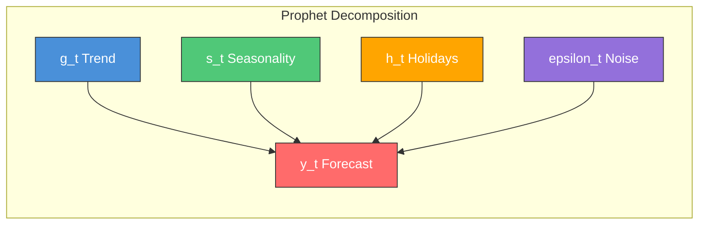

---

### Trend: g(t) — Piecewise Linear & Logistic Growth

Prophet supports three trend models:

#### 1. Piecewise Linear (default)

$$g(t) = (k + \mathbf{a}(t)^T \boldsymbol{\delta}) t + (m + \mathbf{a}(t)^T \boldsymbol{\gamma})$$

**Plain English**: The trend is a straight line, but the slope is allowed to **change** at certain points (changepoints). Between changepoints, it's linear.

- $k$: initial slope (growth rate)
- $\boldsymbol{\delta}$: vector of **additive** slope *changes* at each changepoint.
  - $\delta = 0$: No change in slope (trend continues as is).
  - $\delta > 0$: Growth accelerates.
  - $\delta < 0$: Growth slows down (or reverses).
  - *Note*: It is added ($k + \delta$), not multiplied ($k \times \delta$), hence 0 is the neutral value.
- $m$: initial intercept (offset)
- $\mathbf{a}(t)$: indicator vector (0 or 1) for which changepoints have occurred by time $t$
- $\boldsymbol{\gamma}$: vector of **intercept adjustments** to ensure the segments connect (continuity). Specifically, $\gamma_j = -s_j \delta_j$ where $s_j$ is the changepoint time.

<details>
<summary><strong>Deep Dive: Why do we need $\gamma$? (The Continuity Condition)</strong></summary>

You might ask: *"If we just change the slope at time $s$, shouldn't the line naturally continue?"*

**Answer**: Only if you write the equation recursively (relative to the changepoint). Prophet writes it **globally** (relative to $t=0$).

1. **Recursive (Natural)**:
   For $t > s$: $y(t) = y(s) + (k+\delta)(t - s)$
   This is automatically continuous.

2. **Global (Prophet's Way)**:
   Prophet uses absolute time $t$. If we just changed the slope without adjusting the intercept:
   For $t > s$: $y(t) = (k+\delta)t + m$
   
   At the changepoint $t=s$:
   - Left side (old line): $ks + m$
   - Right side (new line): $(k+\delta)s + m = ks + \delta s + m$
   
   **Gap**: There is a jump of $\delta s$!
   
   **Fix**: We must add an intercept adjustment $\gamma = -s\delta$ to cancel this out.
   Right side becomes: $(k+\delta)t + (m - s\delta)$.
   At $t=s$: $(k+\delta)s + m - s\delta = ks + \delta s + m - s\delta = ks + m$.
   
   **Result**: Continuity achieved. This allows Prophet to solve for everything as a single vectorized linear equation $\mathbf{A}\theta = y$.
</details>

#### 2. Logistic Growth

$$g(t) = \frac{L(t)}{1 + \exp(-k(t - m))}$$

**Intuition (The S-Curve)**:
This is the classic sigmoid function used in biology (population growth) and marketing (product adoption). It starts slow, accelerates exponentially, and then slows down as it approaches a saturation point (the "cap").

**Components**:
- **$L(t)$ (Carrying Capacity)**: The maximum possible value (the "ceiling"). This can change over time (hence $L(t)$), allowing you to model a growing total addressable market.
- **$k$ (Growth Rate)**: How steep the curve is. Larger $k$ = faster adoption (steeper S).
- **$m$ (Offset / Midpoint)**: Shifts the curve left or right. Specifically, the time when the value reaches $L(t)/2$.

> [!NOTE]
> **Is Logistic Growth Piecewise?**
> **YES**. Just like the linear trend, Prophet allows the growth rate $k$ to change at changepoints.
> - The rate becomes $k + \mathbf{a}(t)^T \boldsymbol{\delta}$ (base rate + changes).
> - The offset $m$ also becomes a vector $m(t)$ to ensure the S-curves connect continuously.
> - So "Logistic Growth" in Prophet is actually **Piecewise Logistic Growth**.

**Use when**: Growth has a natural **ceiling**. Examples: total addressable market, platform adoption (cannot exceed total population), or server capacity limits.

**Requires**: Set `cap` (maximum value) and optionally `floor` in your DataFrame.

```python
df['cap'] = 1000000   # Ceiling: max possible users
df['floor'] = 0       # Floor: can't go below zero
model = Prophet(growth='logistic')
```

#### 3. Flat

No trend at all. Use when you've already detrended or know the series is stationary.

#### Trend Summary Table

| Trend Type | `growth=` | Use When | Requires |
|------------|-----------|----------|----------|
| **Linear** (default) | `'linear'` | General upward/downward trend | Nothing |
| **Logistic** | `'logistic'` | Growth toward saturation | `cap` column in df |
| **Flat** | `'flat'` | No trend | Nothing |

---

### Seasonality: s(t) — Fourier Series

Prophet models seasonality using **Fourier series** — sums of sine and cosine waves at different frequencies:

$$s(t) = \sum_{n=1}^{N} \left[ a_n \cos\left(\frac{2\pi n t}{P}\right) + b_n \sin\left(\frac{2\pi n t}{P}\right) \right]$$

Where:
- $P$ = period (e.g., 365.25 for yearly, 7 for weekly)
- $N$ = Fourier order (number of terms, controls flexibility)
- $a_n, b_n$ = learned coefficients

**Default seasonalities**:

| Seasonality | Period | Default Order | Fourier Terms |
|-------------|--------|--------------|--------------|
| **Yearly** | 365.25 days | 10 | 20 (10 sin + 10 cos) |
| **Weekly** | 7 days | 3 | 6 (3 sin + 3 cos) |
| **Daily** | 1 day | 4 | 8 (sub-daily data only) |

> [!TIP]
> **Higher Fourier order = more flexible seasonality** (can fit complex shapes) but also more overfitting risk. For quarterly seasonality, add it manually: `model.add_seasonality(name='quarterly', period=91.25, fourier_order=8)`

**Why Fourier terms?** They can represent any periodic pattern without needing categorical dummy variables (which would add 365 parameters for yearly). 10 Fourier terms give a smooth approximation with only 20 parameters.

---

### Holiday Effects: h(t) — Event Indicators

Holidays are modeled as indicator variables with a prior on their effect size:

$$h(t) = \sum_{i} \kappa_i \cdot \mathbf{1}[t \in \text{window}_i]$$

**Window**: Each holiday can have a `lower_window` and `upper_window` to capture effects before/after (e.g., Black Friday demand builds days before).

```python
import pandas as pd
from prophet import Prophet

# Define holidays DataFrame
holidays = pd.DataFrame({
    'holiday': ['black_friday', 'black_friday', 'christmas', 'christmas'],
    'ds': pd.to_datetime(['2023-11-24', '2024-11-29', '2023-12-25', '2024-12-25']),
    'lower_window': [-3, -3, -2, -2],   # 3 days before
    'upper_window': [1, 1, 1, 1]        # 1 day after
})

model = Prophet(holidays=holidays)
```

> [!WARNING]
> **Common Mistake**: Forgetting to include holidays for the **forecast period**. If you're forecasting 12 months ahead, your holidays DataFrame must contain those future holiday dates.

---

### Changepoint Detection

Prophet automatically detects where the trend changes direction or rate.

**How it works**:
1. By default, places **25 potential changepoints** (`n_changepoints=25`) in the **first 80%** of training data
2. Puts a **sparse prior** (Laplace with `changepoint_prior_scale=0.05`) on changepoint magnitudes
3. Most changepoints get zero effect; a few get non-zero slopes

#### Q: How does it decide which changepoints to keep?

It uses **Regularization** (specifically, a Laplace prior).

- **Placement**: The 25 candidate changepoints are placed on a **uniform grid** (equally spaced) across the first 80% of the history. They are NOT random.
- **Sparse Prior**: The model assumes that *most* of these candidates are false alarms (slope change $\delta \approx 0$). This is the "Laplace prior" — a probability distribution peaked sharply at zero.
  - **Connection to ML**: This is mathematically equivalent to **L1 Regularization (Lasso)**. It forces coefficients to be *exactly* zero, creating a sparse solution.
  - **Why not L2 (Ridge)?**: L2 regularization (Gaussian prior) would make all changepoints small but non-zero ("smearing" the trend change across all points), which is not what we want for detecting abrupt changes.
- **Selection**: During fitting, the model only assigns a non-zero $\delta$ if the data provides strong evidence that the trend actually changed. If the evidence is weak, the prior crushes $\delta$ to zero.

**Result**: You start with 25 potential changes, but might end up with only 3 or 4 significant ones. The `changepoint_prior_scale` controls how "forgiving" this process is (higher = more changes kept).

#### Q: Does Prophet use Likelihood to calculate coefficients?
**YES, but with a Twist (MAP Estimation)**.

Prophet uses the **Stan** probabilistic programming language under the hood. By default, it uses **MAP (Maximum A Posteriori)** estimation, not simple Maximum Likelihood.
- **Goal**: Find the parameters $\theta$ that maximize $P(\text{Data} | \theta) \times P(\theta)$.
  - $P(\text{Data} | \theta)$ is the **Likelihood** (assuming normal errors).
  - $P(\theta)$ is the **Prior** (e.g., Laplace for changepoints, Normal for seasonality).
  
This means it balances "fitting the data" (Likelihood) with "keeping the model simple" (Prior/Regularization).

> [!NOTE]
> You *can* ask Prophet to do full Bayesian sampling with MCMC (`mcmc_samples=1000`), which samples from the full posterior distribution. This gives better uncertainty intervals but is much slower.

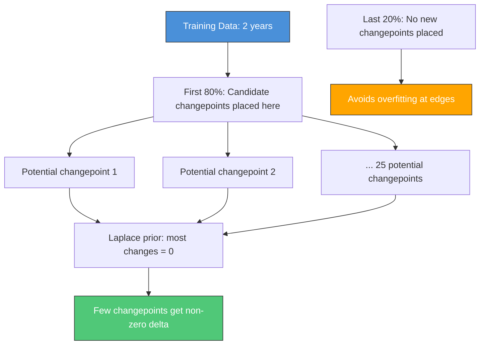

**Why only the first 80%?** The last 20% of training data is left changepoint-free to prevent the model from fitting noise near the edge (where small fluctuations could be mistakenly flagged as trend changes).

**Tuning changepoint sensitivity**:

| `changepoint_prior_scale` | Effect | Use When |
|--------------------------|--------|----------|
| **0.001** | Very rigid trend | Stable trend, don't overfit |
| **0.05** (default) | Balanced | Most cases |
| **0.50** | Very flexible trend | Rapid trend changes, more historical data |

---

### Key Parameters & Tuning Guide

| Parameter | Default | Effect | Increase When | Decrease When |
|-----------|---------|--------|--------------|--------------|
| `changepoint_prior_scale` | 0.05 | Trend flexibility | Trend changes often | Trend is smooth/stable |
| `seasonality_prior_scale` | 10 | Seasonality strength | Strong seasonal patterns | Weak seasonality |
| `holidays_prior_scale` | 10 | Holiday effect size | Large holiday swings | Small holiday impact |
| `n_changepoints` | 25 | # candidate changepoints | Many structural breaks | Smooth trend |
| `seasonality_mode` | 'additive' | Seasonal amplitude grows? | Amplitude scales with level | Constant amplitude |
| `yearly_seasonality` | 'auto' | Yearly pattern | — | Set `False` if < 2 years data |
| `weekly_seasonality` | 'auto' | Weekly pattern | — | Set `False` if no weekly pattern |

> [!TIP]
> **Tuning Strategy**: Start with defaults. Check components plot (`model.plot_components(forecast)`). If trend looks wrong, adjust `changepoint_prior_scale`. If seasonality looks off, adjust `seasonality_prior_scale`.

---

### When to Use Prophet

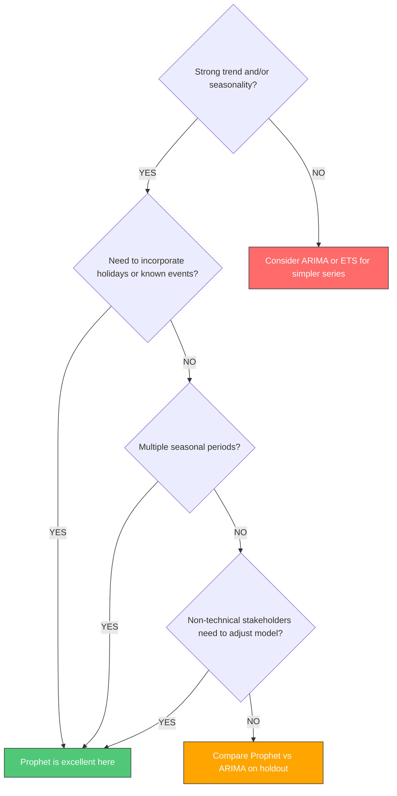

**Prophet strengths**:
- Multiple seasonalities (daily, weekly, yearly) simultaneously
- Easy holiday incorporation
- Interpretable components
- Handles missing data gracefully
- No stationarity requirements
- Non-technical tuning (business users can adjust changepoints visually)

#### Prophet vs. Classical Methods

| Feature | Prophet | ARIMA / ETS |
| :--- | :--- | :--- |
| **Trend** | Piecewise linear/logistic (deterministic) | Stochastic (integrated) or exponential smoothing |
| **Seasonality** | Fourier series (flexible, multi-period) | Fixed period (e.g., 12 for monthly), single cycle |
| **External Regressors** | `add_regressor` (linear component) | ARIMAX (transfer function) |
| **Stationarity** | Not required (handles trend explicitly) | **Required** (must differencing/transform) |
| **Parameter Tuning** | Intuitive (changepoint scale, holidays) | Technical (p, d, q, AIC/BIC) |
| **Missing Data** | Handles automatically | Requires imputation |

---

### Explain to a PM: Prophet

> **PM-Friendly Version**:
>
> "Prophet is a forecasting model developed by Meta that breaks your data into three building blocks: the overall trend (is sales growing or declining long-term?), seasonal patterns (do sales always spike in December?), and special events (Super Bowl, product launch, competitor sale).
>
> The model learns each piece separately, then adds them together for the forecast. The nice part is you can directly tell it about holidays and events — like 'Black Friday always increases sales by 30%' — and it incorporates that knowledge. You can even draw where you expect the trend to bend, which is great for scenarios like 'we're entering a new market starting Q3.'"

---

### Python Implementation

```python
import pandas as pd
from prophet import Prophet
from prophet.diagnostics import cross_validation, performance_metrics
from prophet.plot import plot_cross_validation_metric
import matplotlib.pyplot as plt

# ============================================================
# STEP 1: Prepare data (must have 'ds' and 'y' columns)
# ============================================================
# df = pd.read_csv('data.csv')
# df = df.rename(columns={'date': 'ds', 'sales': 'y'})
# df['ds'] = pd.to_datetime(df['ds'])

# ============================================================
# STEP 2: Define holidays
# ============================================================
holidays = pd.DataFrame({
    'holiday': ['christmas', 'christmas', 'black_friday', 'black_friday'],
    'ds': pd.to_datetime([
        '2022-12-25', '2023-12-25',
        '2022-11-25', '2023-11-24'
    ]),
    'lower_window': [-2, -2, -3, -3],
    'upper_window': [1, 1, 1, 1]
})

# ============================================================
# STEP 3: Fit model
# ============================================================
model = Prophet(
    changepoint_prior_scale=0.05,      # Trend flexibility
    seasonality_prior_scale=10,        # Seasonality strength
    holidays_prior_scale=10,           # Holiday effect size
    seasonality_mode='multiplicative', # Seasonal amplitude scales with level
    holidays=holidays,
    yearly_seasonality=True,
    weekly_seasonality=True,
    daily_seasonality=False
)

# Add custom quarterly seasonality
model.add_seasonality(
    name='quarterly',
    period=91.25,
    fourier_order=8
)

# Add external regressor (must be known in the future!)
# 1. Add feature to dataframe (training and future)
# df['promo'] = [1 if d in promo_dates else 0 for d in df['ds']]
# 2. Register regressor before fitting
# model.add_regressor('promo')

model.fit(df)

# ============================================================
# STEP 4: Create future dataframe and forecast
# ============================================================
future = model.make_future_dataframe(periods=365)  # 1 year ahead
# If using cap/floor (logistic growth):
# future['cap'] = 1000000
# future['floor'] = 0

forecast = model.predict(future)

# Key columns in forecast:
# - yhat: point forecast
# - yhat_lower, yhat_upper: 80% uncertainty interval (default)
print(forecast[['ds', 'yhat', 'yhat_lower', 'yhat_upper']].tail(10))

# ============================================================
# STEP 5: Visualize
# ============================================================
fig1 = model.plot(forecast)                    # Forecast + uncertainty
fig2 = model.plot_components(forecast)         # Trend, seasonality, holidays separately
plt.show()

# ============================================================
# STEP 6: Cross-validation
# ============================================================
# initial: training period
# period: gap between cutoffs
# horizon: forecast horizon to evaluate
df_cv = cross_validation(
    model,
    initial='730 days',   # 2 years of training
    period='90 days',     # New cutoff every 3 months
    horizon='180 days'    # Evaluate 6 months ahead
)

df_perf = performance_metrics(df_cv)
print(df_perf[['horizon', 'mape', 'rmse']].head(10))

# Plot MAPE across horizons
plot_cross_validation_metric(df_cv, metric='mape')
plt.show()
```

---

### When Prophet Fails

| When Prophet Fails | Why | Better Alternative |
|-------------------|-----|-------------------|
| **< 2 seasonal cycles** | Can't learn seasonality | ARIMA, ETS |
| **Sub-hourly data** | Not designed for high-frequency | ML-based, ARIMA |
| **No clear seasonality/trend** | Adds complexity without benefit | ETS(A,N,N), ARIMA |
| **Complex cross-series patterns** | One series at a time | Global ML, DeepAR |
| **Many series at scale** | Slow (Python loops), refits per series | Global LightGBM, Nixtla StatsForecast |
| **Very short series** | Too few points to fit components | Croston's, category averages |
| **External regressors change trend shape** | Limited regressor handling vs ARIMAX | ARIMAX, ML models |

> [!WARNING]
> **Prophet's Confidence Intervals are Often Too Narrow**: Prophet's uncertainty comes from parameter uncertainty only, not from model misspecification. In practice, actual errors are often larger. Always validate with cross-validation rather than trusting the shaded bands.

---

## 4.3.2 ML-Based Forecasting [H]

### Deep Dive: Under the Hood of LightGBM
*User Question: "It’s a black box. Why is it magical for tabular data?"*

#### 1. The "What": Gradient Boosting (The Golf Analogy)
LightGBM isn't one model; it's a team of 1,000 "weak" learners (shallow decision trees).
- **Tree 1**: Predicts the average sales. (Error is huge).
- **Tree 2**: Doesn't predict sales; it predicts the **error** (residual) of Tree 1.
- **Tree 3**: Predicts the remaining error of (Tree 1 + Tree 2).

**Analogy**: You are putting a golf ball.
1.  **Shot 1**: You hit it towards the hole. It stops 20 yards short.
2.  **Shot 2**: You don't go back to the tee. You aim for the *remaining 20 yards*. You overshoot by 3 yards.
3.  **Shot 3**: You tap it back 3 yards.
**Final Result**: Sum of all shots = Ball in hole.

#### 2. The "Why": Trees vs. Neural Networks on Tabular Data
Why does a 1980s concept (trees) beat Deep Learning on spreadsheets?
-   **Decision Boundaries**: Tabular data has sharp cliffs ("If Age < 18, then Child"). Trees cut square decision boundaries perfectly. Neural networks try to fit smooth curves to these sharp cliffs, which is inefficient.
-   **Scale Invariance**: Trees don't care if Feature A is `0.001` (learning rate) and Feature B is `1,000,000` (Sales). They just sort and split (`Sales > 500k`). Neural networks require strict normalization (0-1 scaling) to work.
-   **Interactions**: `If Weekend AND Sunny` is a natural branch in a tree. A linear model needs manual feature engineering (`Weekend * Sunny`) to see this.

#### 3. The "Magic": LightGBM Specifics
LightGBM (Light Gradient Boosting Machine) is "Light" because it uses tricks to be 10x faster than traditional boosting:

| Feature | Concept | Benefit |
| :--- | :--- | :--- |
| **GOSS (Gradient-based One-Side Sampling)** | "Ignore the easy students." LightGBM keeps data points with large errors (high gradients) and downsamples points it essentially already knows. | drastic speedup w/o accuracy loss. |
| **EFB (Exclusive Feature Bundling)** | "Combine compatible columns." It bundles mutually exclusive sparse features (like One-Hot encoded columns that are rarely non-zero at the same time) into a single feature. | Reduces dimensionality. |
| **Leaf-wise Growth (Best-First)** | Most trees grow level-by-level (balanced). LightGBM grows the *single leaf* that reduces error the most. | Deeper, more accurate trees (risk: can overfit small data). |
| **Histogram-based** | Instead of sorting 1M rows to find a split (slow), it buckets values into 255 bins. | $O(N)$ complexity $\to$ $O(\text{bins})$. |

<details>
<summary><strong>🎓 Beginner's Guide: LightGBM Terminology Explained Simply</strong> (Click to Expand)</summary>

If the table above feels like alphabet soup, here is the plain-English translation:

#### 1. Leaf-wise Growth (The "Gold Mining" Strategy)
*   **Traditional Trees (Level-wise)**: They are cautious. They explore every branch at depth 1, then every branch at depth 2, keeping the tree balanced. It's like checking every room on the first floor before going to the second floor.
*   **LightGBM (Leaf-wise)**: It's greedy. If it finds a path that reduces error a lot, it keeps digging deeper *only on that path*, ignoring the others. It's like finding a vein of gold and digging straight down, ignoring the rest of the field.
    *   *Result*: Faster and more accurate, but can "dig too deep" (overfit) if you don't stop it (using `max_depth`).

#### 2. Histogram-based Splitting (The "Bucket" Strategy)
*   **Traditional**: To find the best split for "Income", it sorts all 1,000,000 employees by income to find the perfect cut point (e.g., $50,001 vs $50,002). This is slow.
*   **LightGBM**: It puts everyone into 255 buckets (e.g., "0-20k", "20k-40k", etc.). It only checks splits at the bucket edges.
    *   *Result*: 1,000x faster sorting. And surprisingly, it acts as regularization (prevents overfitting to specific noise values).

#### 3. GOSS (Gradient-based One-Side Sampling)
*   **Problem**: You have 1 million rows. Training on all of them is slow.
*   **Idea**: "Let's ignore the rows the model already understands perfectly."
*   **Analogy**: A teacher correcting a class. She spends 90% of her time with the 5 students who failed the test (high error/gradient) and only quickly checks a random sample of the A-students to make sure they're still doing well.
    *   *Result*: Training on a fraction of the data while focusing on the "hard" problems.

#### 4. EFB (Exclusive Feature Bundling)
*   **Problem**: You have sparse data (lots of zeros). For example, `City_NewYork`, `City_London`, `City_Tokyo` are rarely "1" at the same time.
*   **Idea**: Bundle them into one column.
*   **Analogy**: You have 3 shifts of workers (Morning, Afternoon, Night). Instead of 3 columns, you just combine them into one `Shift` column because they never overlap. **Crucially, the model gives them different implementation ranges (Morning=0-10, Afternoon=11-20), so it can still tell them apart perfectly.**
    *   *Result*: Fewer columns to process = faster speed without losing information.

</details>


#### 4. Robustness: Why it works on "Dirty" Data
- **Missing Values**: LightGBM doesn't need imputation. It learns the best direction (left or right) for `NaN` values during training.
- **Outliers**: Trees split on *rank*, not value. A value of 1,000,000 is just "greater than split threshold", same as 100. It doesn't skew the curve like in regression (unless it's the target variable, where you need MAE loss).

---

### One-Liner & Intuition

> [!TIP]
> **If You Remember ONE Thing**: Convert time series into a tabular supervised learning problem by engineering lag and rolling features — then any ML model (LightGBM, XGBoost) works.

**One-Liner (≤15 words)**: *Turn time series into tabular features (lags, rolling stats, dates) — then any ML model applies.*

**Intuition (Everyday Analogy)**:
Imagine you're a detective trying to predict tomorrow's sales. You gather evidence:
- "What were sales **7, 14, 28 days ago**?" (lag features)
- "What's the **average** over the last month?" (rolling mean)
- "Is it a **Monday**? Is it **December**?" (date features)
- "Is there a **promotion** this week?" (external regressor)

Then you train a detective (LightGBM) to connect this evidence to tomorrow's outcome. The model learns patterns like "Mondays in December with a promotion are always high."

**The Key Insight**: Once you have the feature matrix, it's just a standard regression problem. The time series structure is encoded entirely in the features.

---

### Converting Time Series to Supervised Learning

The fundamental transformation:

```
BEFORE (Time Series):
    date        y
    2024-01-01  100
    2024-01-02  110
    2024-01-03  105
    2024-01-04  120
    ...

AFTER (Supervised):
    date        lag_1  lag_2  lag_7  roll_mean_7  day_of_week  month   y (target)
    2024-01-08  120    105    110    108.6        1 (Mon)      1       115
    2024-01-09  115    120    105    111.0        2 (Tue)      1       118
    ...
```

**Rules**:
3. **Respect the Horizon Check**: When predicting $y_{t+h}$ (where $t$ is "now"), you only know data up to $y_t$. You CANNOT use $y_{t+1}, \dots, y_{t+h-1}$ as features.
   - Example: Forecasting 7 days ahead ($h=7$). Target is $y_{t+7}$. Your most recent feature is $y_t$.
   - **Pandas Rule**: Features must be `shift(h)` or larger relative to the target column. `shift(1)` is only valid for 1-step forecasts.

#### Example: Predicting Daily Stock Price for Next Month (Horizon $h=30$)

**Scenario**: Today is Day $T$. You want to predict the price on Day $T+30$.

**Option A: Direct Forecast ($h=30$)**
You train a model to predict 30 days ahead directly.
- **Allowed Lags**: Must be $\ge 30$.
- **Lags to use**:
  - `lag_30` ($y_T$): The price today. (Most important feature!)
  - `lag_31` ($y_{T-1}$): Yesterday's price.
  - `lag_37` ($y_{T-7}$): Price one week ago (relative to today).
  - `lag_60` ($y_{T-30}$): Price one month ago (relative to today).
- **Why?**: You don't know the prices for days $T+1 \dots T+29$ yet.

**Option B: Recursive Forecast ($h=1$)**
You train a model to predict 1 day ahead, then loop 30 times.
- **Allowed Lags**: $\ge 1$.
- **Lags to use**:
  - `lag_1` ($y_T$): The price today.
  - `lag_2` ($y_{T-1}$): Yesterday's price.
  - `lag_8` ($y_{T-7}$): Price one week ago.
- **Why?**: In step 1, `lag_1` is real data. In step 2, `lag_1` is your *prediction* from step 1. Errors accumulate quickly!

> [!TIP]
> **Stock Market Reality Check**: For stocks, `lag_1` (yesterday's price) is usually the only strong predictor (Martingale property). Forecasting 30 days out is rarely better than a random walk. For other domains (retail demand), seasonal lags like `lag_365` are critical.

---

### Feature Engineering

#### Lag Features

Directly capture the "memory" of the series:

$$\text{lag}_k = y_{t-k}$$

```python
import pandas as pd

def create_lag_features(df, target_col, lags):
    """Create lag features. Must shift by 1 minimum to avoid leakage."""
    for lag in lags:
        df[f'lag_{lag}'] = df[target_col].shift(lag)
    return df

# Example: forecast 1-step ahead (target = y_{t+1})
# Use lags of y_t, y_{t-1}, ..., y_{t-6} (7 lags)
df = create_lag_features(df, 'sales', lags=[1, 2, 3, 7, 14, 21, 28])
```

**Which lags to use?** Look at PACF. Strong PACF at lag k → include lag_k.
For weekly data: always try 1, 2, 4, 8 (1w, 2w, 1m, 2m).
For daily data: 1, 7, 14, 28, 365.

> [!NOTE]
> **Forecast horizon determines minimum lag**: If you're forecasting **h steps ahead**, all lag features must be shifted by at least h. For h=7 (1-week ahead forecast), `lag_1` through `lag_6` are unavailable — minimum usable lag is 7.

#### Rolling Statistics

Capture recent trend, volatility, and range:

```python
def create_rolling_features(df, target_col, windows):
    """
    CRITICAL: Always .shift(1) BEFORE .rolling() to prevent leakage.
    shift(1) ensures we only use past data, not the current observation.
    """
    shifted = df[target_col].shift(1)  # <-- shift first!
    for window in windows:
        df[f'roll_mean_{window}'] = shifted.rolling(window).mean()
        df[f'roll_std_{window}'] = shifted.rolling(window).std()
        df[f'roll_min_{window}'] = shifted.rolling(window).min()
        df[f'roll_max_{window}'] = shifted.rolling(window).max()
        df[f'roll_median_{window}'] = shifted.rolling(window).median()
    return df

df = create_rolling_features(df, 'sales', windows=[7, 14, 28, 90])
```

| Feature | Captures | Example |
|---------|---------|---------|
| `roll_mean_7` | Short-term level | Smoothed recent sales |
| `roll_std_7` | Short-term volatility | Is demand stable or noisy? |
| `roll_mean_28` | Medium-term trend | Monthly baseline |
| `roll_max_7 / roll_mean_7` | Relative spike | How far above trend is the peak? |

#### Date/Calendar Features

Capture cyclical and seasonal patterns deterministically:

```python
def create_date_features(df, date_col):
    """Extract calendar features from datetime column."""
    df['day_of_week'] = df[date_col].dt.dayofweek       # 0=Mon, 6=Sun
    df['day_of_month'] = df[date_col].dt.day
    df['week_of_year'] = df[date_col].dt.isocalendar().week.astype(int)
    df['month'] = df[date_col].dt.month
    df['quarter'] = df[date_col].dt.quarter
    df['year'] = df[date_col].dt.year
    df['is_weekend'] = (df['day_of_week'] >= 5).astype(int)
    df['is_month_start'] = df[date_col].dt.is_month_start.astype(int)
    df['is_month_end'] = df[date_col].dt.is_month_end.astype(int)
    return df
```

> [!WARNING]
> **Tree models don't know that month=12 is "near" month=1**. They treat these as independent categories. Use Fourier features (below) or cyclical encoding for continuous circular patterns.

#### Fourier Features (Cyclical Encoding)

Better than raw month/weekday for capturing **smooth cyclical patterns**:

$$\text{sin\_k} = \sin\left(\frac{2\pi k \cdot t}{P}\right), \quad \text{cos\_k} = \cos\left(\frac{2\pi k \cdot t}{P}\right)$$

```python
import numpy as np

def create_fourier_features(df, date_col, period, n_terms):
    """
    Create Fourier features for cyclical seasonality.
    period: seasonal cycle length (e.g., 365 for yearly, 7 for weekly)
    n_terms: number of sine-cosine pairs
    """
    t = (df[date_col] - df[date_col].min()).dt.days
    for k in range(1, n_terms + 1):
        df[f'sin_{period}_{k}'] = np.sin(2 * np.pi * k * t / period)
        df[f'cos_{period}_{k}'] = np.cos(2 * np.pi * k * t / period)
    return df

# Weekly seasonality with 3 Fourier pairs (same as Prophet default)
df = create_fourier_features(df, 'date', period=7, n_terms=3)
# Yearly seasonality with 5 Fourier pairs
df = create_fourier_features(df, 'date', period=365.25, n_terms=5)
```

**Feature Engineering Summary**:

| Feature Type | # Features | Captures | Effort |
|-------------|-----------|---------|--------|
| Lags (7-10 lags) | 7-10 | Autocorrelation, momentum | Low |
| Rolling stats (4 windows × 5 stats) | 20 | Level, volatility, trend | Low |
| Date features | 8-10 | Deterministic seasonality | Low |
| Fourier features (2 periods × 5 terms) | 20 | Smooth cyclical patterns | Medium |
| External regressors | Varies | Promotions, price, weather | Medium-High |

---

### Data Leakage: The Cardinal Sin

> [!IMPORTANT]
> **If You Remember ONE Thing**: Never use information from the future in your features. In time series, this is easy to do accidentally with rolling windows.

#### The Three Ways to Introduce Leakage

**1. Rolling features computed without shifting:**
```python
# WRONG: roll_mean_7 at time t includes y_t itself
df['roll_mean_7'] = df['sales'].rolling(7).mean()

# CORRECT: shift first, so roll_mean_7 at time t only uses t-1 through t-7
df['roll_mean_7'] = df['sales'].shift(1).rolling(7).mean()
```

**2. Random train-test split:**
```python
# WRONG: future data leaks into training set
from sklearn.model_selection import train_test_split
X_train, X_test, y_train, y_test = train_test_split(X, y, test_size=0.2)  # DON'T DO THIS

# CORRECT: time-ordered split
cutoff = int(len(df) * 0.8)
train = df[:cutoff]
test = df[cutoff:]
```

**3. Target encoding without time-awareness:**
```python
# WRONG: future y leaks into category mean
df['category_mean'] = df.groupby('category')['y'].transform('mean')

# CORRECT: expanding mean using only past data
df['category_mean'] = df.groupby('category')['y'].transform(
    lambda x: x.shift(1).expanding().mean()
)
```

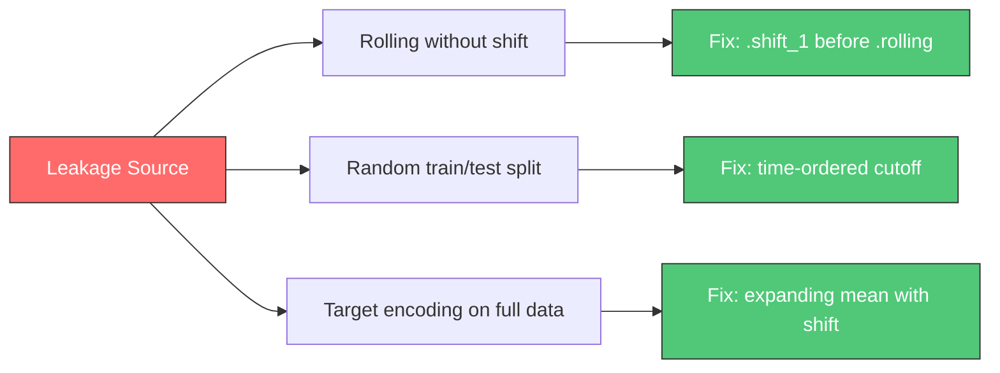

---

### Multi-Step Forecasting Strategies

When you need to forecast more than one step ahead (h > 1):

| Strategy | How It Works | Pros | Cons |
|---------|-------------|------|------|
| **Recursive** | Train 1-step model, feed predictions back as features | One model, simple | Errors compound over horizon |
| **Direct** | Train H separate models (one per horizon) | No error accumulation | H times more training cost |
| **MIMO** | One model predicts all H steps simultaneously | No error accumulation, fast | Complex feature alignment |

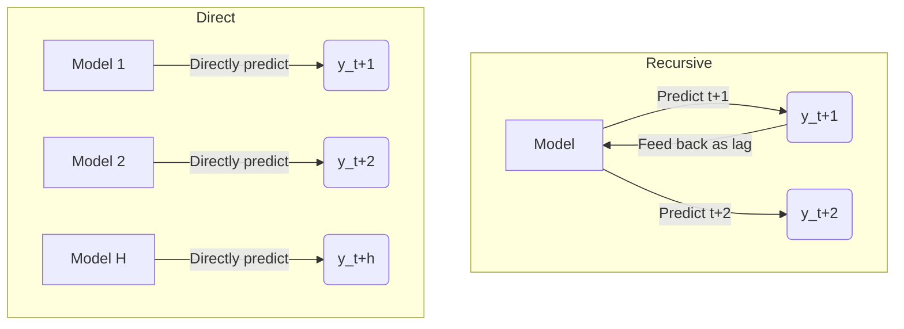

#### Recursive (Most Common)

```python
def recursive_forecast(model, X_seed, horizon, lag_cols):
    """
    Predict h steps ahead by iteratively feeding predictions back.
    X_seed: feature row for the last known time step
    """
    predictions = []
    X_current = X_seed.copy()

    for h in range(horizon):
        pred = model.predict(X_current)[0]
        predictions.append(pred)

        # Shift lag features: lag_1 gets current pred, lag_2 gets old lag_1, etc.
        for i in range(len(lag_cols) - 1, 0, -1):
            X_current[lag_cols[i]] = X_current[lag_cols[i-1]]
        X_current[lag_cols[0]] = pred  # lag_1 = this prediction

    return predictions
```

#### Direct (Cleanest for Evaluation)

```python
def build_direct_models(df, target, horizons, model_class, model_params):
    """Train one model per forecast horizon."""
    models = {}
    for h in horizons:
        df[f'target_h{h}'] = df[target].shift(-h)  # Future target
        y = df[f'target_h{h}'].dropna()
        X = df.drop(columns=[target, f'target_h{h}']).loc[y.index]
        models[h] = model_class(**model_params).fit(X, y)
    return models
```

> [!TIP]
> **Interview answer**: "For short horizons (1-3 steps), recursive is fine. For longer horizons, direct avoids error accumulation but requires more compute. For very long horizons, I'd consider sequence models (TFT, DeepAR) that predict the entire horizon jointly."

---

### Walk-Forward Validation

The only correct way to validate time series models.

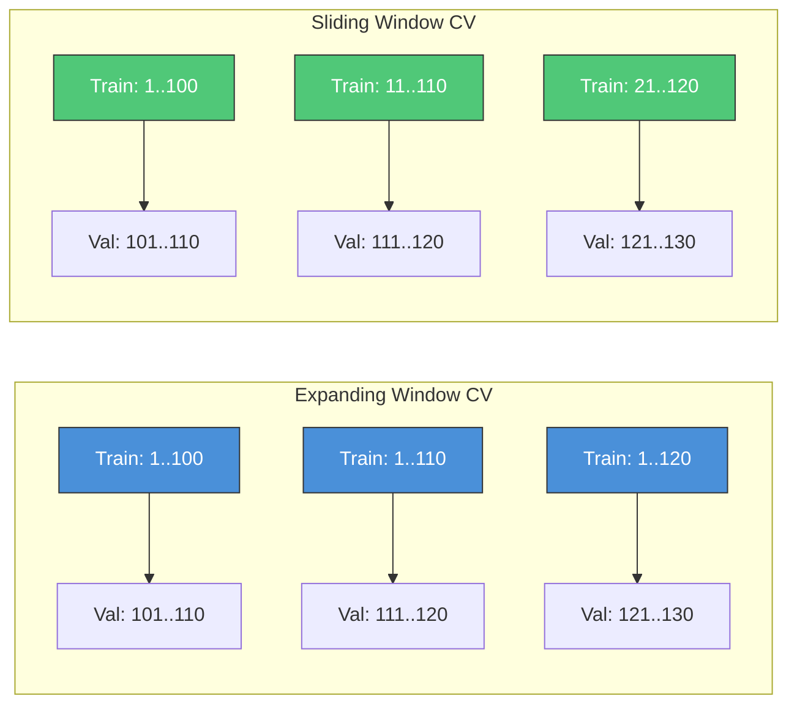

| Approach | Expanding Window | Sliding Window |
|----------|-----------------|----------------|
| **Training set grows** | Yes | No (fixed size) |
| **Simulates production** | Less realistic (older model sees less) | More realistic |
| **Use when** | Stationary patterns, all history useful | Non-stationary, older data less relevant |
| **Default choice** | ✓ | When concept drift is high |

```python
import numpy as np
from sklearn.metrics import mean_absolute_error

def walk_forward_validation(df, target_col, feature_cols, model,
                            initial_train_size, step_size, horizon):
    """
    Expanding window walk-forward cross-validation.
    Returns list of (actual, predicted) arrays for each window.
    """
    results = []
    n = len(df)

    for cutoff in range(initial_train_size, n - horizon, step_size):
        # Train on everything up to cutoff
        X_train = df[feature_cols].iloc[:cutoff]
        y_train = df[target_col].iloc[:cutoff]

        # Predict next `horizon` steps
        X_test = df[feature_cols].iloc[cutoff:cutoff + horizon]
        y_test = df[target_col].iloc[cutoff:cutoff + horizon]

        model.fit(X_train, y_train)
        y_pred = model.predict(X_test)

        mae = mean_absolute_error(y_test, y_pred)
        results.append({'cutoff': cutoff, 'mae': mae,
                        'actual': y_test.values, 'predicted': y_pred})

    avg_mae = np.mean([r['mae'] for r in results])
    print(f"Walk-Forward MAE: {avg_mae:.4f} (over {len(results)} windows)")
    return results
```

> [!NOTE]
> **Computation Cost**: Expanding window requires **refitting the model from scratch** for every window. If you have a large dataset and many windows, this is computationally expensive. For lighter validation, use a **sliding window** (fixed size training set) or fewer cutoffs.

---

### Global vs Local Models

This is one of the most important conceptual shifts in modern forecasting.

> [!TIP]
> **If You Remember ONE Thing**: A **global** model trains on ALL series simultaneously (learns patterns across series). A **local** model trains one model PER series. Global often wins when you have many related series.

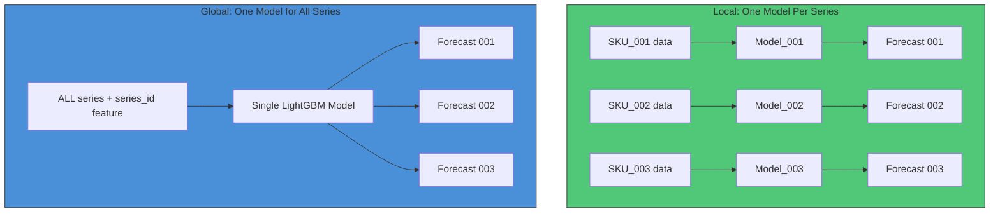

| Aspect | Local Model | Global Model |
|--------|------------|-------------|
| **Cross-learning** | None (each series isolated) | Yes (patterns transfer across series) |
| **Cold start** | Fails (no history) | Works (similar series provide context) |
| **Rare patterns** | Well-captured (dedicated model) | May average out |
| **Compute** | O(N × train_time) | O(1 × train_time) — fast |
| **Data per series** | Needs enough history | Can work with short series |
| **When it wins** | Few unique series with lots of data | Many related series (retail, supply chain) |

**Global model implementation** — the key is adding `series_id` as a feature:

```python
import pandas as pd
import lightgbm as lgb
from sklearn.preprocessing import LabelEncoder

# Combine all series into one DataFrame
all_series = pd.concat([
    series_001.assign(series_id='SKU_001'),
    series_002.assign(series_id='SKU_002'),
    # ... all N series
])

# Encode series_id (LightGBM can handle categorical natively)
all_series['series_id'] = all_series['series_id'].astype('category')

# Feature engineering on combined dataset
all_series = create_lag_features(all_series.groupby('series_id'), 'sales', lags=[1,7,14,28])
all_series = create_date_features(all_series, 'date')

# Train ONE global model
feature_cols = ['lag_1', 'lag_7', 'roll_mean_7', 'day_of_week', 'month', 'series_id']
X = all_series[feature_cols].dropna()
y = all_series.loc[X.index, 'sales']

model = lgb.LGBMRegressor(n_estimators=500, learning_rate=0.05)
model.fit(X, y, categorical_feature=['series_id'])
```

> [!NOTE]
> **M5 Competition insight**: The top solutions were dominated by global LightGBM models trained on all 30,000 Walmart products simultaneously. The 1st place used an ensemble of LightGBM models, and practically all top-50 solutions used LightGBM. The global model's cross-series learning dramatically outperformed local ARIMA/ETS models.

---

### LightGBM/XGBoost Pipeline

Complete end-to-end example:

```python
import pandas as pd
import numpy as np
import lightgbm as lgb
from sklearn.metrics import mean_absolute_error
import matplotlib.pyplot as plt

# ============================================================
# COMPLETE ML FORECASTING PIPELINE
# ============================================================

def build_feature_matrix(df, target_col='sales', date_col='date',
                          lags=[1,2,3,7,14,21,28],
                          windows=[7, 14, 28]):
    """Build complete feature matrix. Handles lag and rolling features correctly."""
    df = df.sort_values(date_col).copy()

    # 1. Lag features
    for lag in lags:
        df[f'lag_{lag}'] = df[target_col].shift(lag)

    # 2. Rolling features (shift FIRST to prevent leakage)
    shifted = df[target_col].shift(1)
    for w in windows:
        df[f'roll_mean_{w}'] = shifted.rolling(w).mean()
        df[f'roll_std_{w}'] = shifted.rolling(w).std()
        df[f'roll_min_{w}'] = shifted.rolling(w).min()
        df[f'roll_max_{w}'] = shifted.rolling(w).max()

    # 3. Date features
    df['day_of_week'] = df[date_col].dt.dayofweek
    df['month'] = df[date_col].dt.month
    df['day_of_month'] = df[date_col].dt.day
    df['week_of_year'] = df[date_col].dt.isocalendar().week.astype(int)
    df['quarter'] = df[date_col].dt.quarter
    df['is_weekend'] = (df['day_of_week'] >= 5).astype(int)

    # 4. Fourier features for yearly seasonality
    t = (df[date_col] - df[date_col].min()).dt.days
    for k in range(1, 4):
        df[f'sin_365_{k}'] = np.sin(2 * np.pi * k * t / 365.25)
        df[f'cos_365_{k}'] = np.cos(2 * np.pi * k * t / 365.25)

    return df.dropna()  # Drop rows with NaN from lags/rolling


def time_series_split(df, date_col, test_months=3):
    """Simple time-ordered train/test split."""
    cutoff = df[date_col].max() - pd.DateOffset(months=test_months)
    train = df[df[date_col] <= cutoff]
    test = df[df[date_col] > cutoff]
    return train, test


def train_lightgbm(X_train, y_train, X_val=None, y_val=None):
    """Train LightGBM with early stopping."""
    params = {
        'objective': 'regression',
        'metric': 'mae',
        'n_estimators': 1000,
        'learning_rate': 0.05,
        'num_leaves': 31,
        'feature_fraction': 0.8,
        'bagging_fraction': 0.8,
        'bagging_freq': 5,
        'verbose': -1
    }

    model = lgb.LGBMRegressor(**params)

    callbacks = []
    eval_set = None
    if X_val is not None:
        callbacks = [lgb.early_stopping(50, verbose=False),
                     lgb.log_evaluation(-1)]
        eval_set = [(X_val, y_val)]

    model.fit(X_train, y_train,
              eval_set=eval_set,
              callbacks=callbacks if callbacks else None)

    return model


# ============================================================
# USAGE EXAMPLE
# ============================================================
"""
# 1. Build features
df_features = build_feature_matrix(df, target_col='sales', date_col='date')

# 2. Split
feature_cols = [c for c in df_features.columns if c not in ['sales', 'date']]
train_df, test_df = time_series_split(df_features, 'date', test_months=3)

X_train = train_df[feature_cols]
y_train = train_df['sales']
X_test = test_df[feature_cols]
y_test = test_df['sales']

# 3. Train
model = train_lightgbm(X_train, y_train, X_test, y_test)

# 4. Evaluate
preds = model.predict(X_test)
mae = mean_absolute_error(y_test, preds)
mape = np.mean(np.abs((y_test - preds) / y_test)) * 100
print(f"MAE: {mae:.2f}, MAPE: {mape:.2f}%")

# 5. Feature importance
lgb.plot_importance(model, max_num_features=20)
plt.tight_layout()
plt.show()
"""
```

---

### Explain to a PM: ML Forecasting

> **PM-Friendly Version**:
>
> "Instead of using a specialized time series model, we can translate the forecasting problem into a regular prediction problem that any ML model can solve. We do this by creating 'memory features' — like 'what were sales exactly one week ago, two weeks ago, last month?' Then we add context features: 'Is it a Monday? Is it December? Was there a promotion last week?'
>
> We then train a machine learning model (like the same type that powers recommendation engines) on thousands of historical examples of these features predicting next week's sales. The advantage is that this model can easily incorporate promotions, weather, and any other driver we can measure — something traditional models struggle with."

---

### When ML Fails

| When ML Fails | Why | Better Alternative |
|--------------|-----|-------------------|
| **Very short series** (< 50 points) | Not enough data to learn features | ARIMA, ETS, Prophet |
| **Extrapolating beyond training range** | Trees can't extrapolate | Parametric models (Holt, ARIMA) |
| **Sudden structural breaks** | No historical patterns to learn from | Changepoint models, expert adjustment |
| **Need calibrated uncertainty** | LGBM doesn't give intervals natively | Quantile regression, conformal prediction |
| **Highly interpretable coefficients needed** | Feature importance ≠ causal coefficients | ARIMAX |
| **Production latency constraints** | Feature computation pipeline overhead | ARIMA, ETS for real-time |

---

### Deep Dive: XGBoost vs. LightGBM (The Heavyweight Rivalry)

You will often see XGBoost used interchangeably with LightGBM. They are siblings in the gradient boosting family, but they have distinct personalities.

#### 1. The Core Difference: How They Grow Trees
*   **XGBoost (Level-wise)**: Conservative. It builds the tree one full layer at a time. It won't move to depth 3 until **all** nodes at depth 2 are finished.
    *   *Analogy*: Building a skyscraper floor by floor. You don't build the 3rd floor of the east wing until the 2nd floor of the west wing is done.
    *   *Pro*: Very stable, less likely to overfit on small data.
*   **LightGBM (Leaf-wise)**: Aggressive. It finds the single leaf with the highest error and splits it, potentially creating a very lopsided (deep) tree.
    *   *Analogy*: Building a mine shaft. You dig as deep as necessary in the gold vein, ignoring the empty dirt 50 feet away.
    *   *Pro*: Much faster, often higher accuracy on large data.

#### 2. Handling Missing Values
*   **XGBoost**: learns a default direction (left/right) for NaNs, similar to LightGBM.
*   **Key Distinction**: XGBoost handles sparse matrices (lots of zeros) very efficiently but historically required more memory than LightGBM (though recent versions have closed this gap).

#### 3. When to Use Which?

| Scenario | Winner | Why? |
| :--- | :--- | :--- |
| **Speed / Large Data (>1M rows)** | **LightGBM** | Histogram-based training is significantly faster. |
| **Accuracy (Kaggle/Competition)** | **Tie / Ensemble** | Winners usually blend both. They make different errors, so averaging them boosts score. |
| **Small Data (<10k rows)** | **XGBoost / CatBoost** | LightGBM's aggressive value-mining can overfit small datasets. XGBoost is "safer" by default. |
| **Categorical Features** | **CatBoost / LightGBM** | CatBoost is king here (native handling without One-Hot). LightGBM is good. XGBoost requires numeric encoding. |

> [!TIP]
> **Practical Advice**: Start with LightGBM for speed. If you need to squeeze out the last 0.1% of accuracy, train an XGBoost model and average the predictions of both: `final_pred = 0.5*lgbm_pred + 0.5*xgb_pred`.


#### 4. CatBoost: The Category King
You might see CatBoost ("Categorical Boosting") mentioned as the third player.
*   **The Superpower**: It handles categorical variables (`City`, `Product_ID`) natively. You don't need to do One-Hot Encoding or Label Encoding yourself.
*   **How it differs**:
    *   **Symmetric Trees**: It builds "balanced" trees (unlike LightGBM's lopsided ones), which makes it very stable and less prone to overfitting.
    *   **Target Encoding**: It uses a smart "ordered" target encoding under the hood to turn categories into numbers without data leakage.
*   **When to use**: If you have a dataset with **MANY** categorical columns (e.g., retail data with Hierarchy, Dept, Category, Brand), CatBoost often works best "out of the box" with zero tuning.

> [!TIP]
> **Pro Tip**: CatBoost is often slower to train than LightGBM but faster to predict. It's a favorite for production systems where inference latency matters.

> [!WARNING]
> **Tree Models Cannot Extrapolate**: A LightGBM model trained on sales between 0–1000 units will be bounded by the training range if demand explodes. Always check for out-of-range predictions and combine with parametric models for robustness.

---

## 4.3.3 Neural Forecasters [L]

> [!NOTE]
> **Depth Level**: [L] Low priority — familiarity only. Know what exists, when to consider it, and when NOT to use it. You don't need to implement these.

### One-Liner & Intuition

**One-Liner (≤15 words)**: *Neural networks for time series — powerful for large-scale and complex patterns, overkill for most cases.*

---

### N-BEATS (Neural Basis Expansion Analysis)

*(Neural Basis Expansion Analysis for Interpretable Time Series)*

<details>
<summary><strong>🧠 Deep Learning Refresher: The "Standard" Neural Network</strong> (Click to Expand)</summary>

If you haven't looked at NNs in a while, here is the 30-second recap:

1.  **The Neuron**: A simple mathematical function: $y = \text{activation}(w \cdot x + b)$.
    -   It takes inputs ($x$), multiplies them by weights ($w$), adds a bias ($b$), and passes the result through a non-linear function (like ReLU: `max(0, x)`).
2.  **The Layer**: A stack of neurons.
    -   Input Layer: Receives raw features (e.g., $t-1, t-2, \dots$).
    -   Hidden Layers: Combine features to find patterns (e.g., "if $t-1$ is high AND $t-7$ is low...").
    -   Output Layer: The final prediction.
3.  **Deep Neural Network (DNN)**: A network with *many* hidden layers.
    -   **Power**: Can approximate *any* function (given enough data/neurons).
    -   **Trap**: They are "lazy". They will memorize the training data.

**Why "Standard" DNNs Struggle with Time Series**:
*   **Stationarity Assumption**: Standard NNs assume the *distribution* of inputs is constant.
    -   *Example*: Train on 2010 data (Sales $\approx$ 100). Test on 2020 data (Sales $\approx$ 500).
    -   *Result*: The NN has never seen "500" before. It fails catastrophically because the improved trend changed the distribution.
*   **No Sequential Awareness**: A standard Dense layer treats `lag_1` and `lag_7` as just two independent numbers. It doesn't inherently understand that `lag_1` happened *after* `lag_7`.
*   **Black Box to the Extreme**: If a DNN predicts a spike, you have zero way of knowing if it's due to a trend, a seasonal pattern, or random noise.

**Enter N-BEATS**: It solves these by forcing the network to decompose the signal into interpretable parts (Trend/Seasonality) *inside* the architecture.
</details>

**One-Liner**: *A pure deep learning architecture that stacks fully connected layers (no RNN/CNN) to peel off trend and seasonality layer-by-layer like an onion.*

#### Why is it different? (N-BEATS vs. Typical NN/DNN)

Most Deep Learning for time series uses **Recurrent (RNN/LSTM)** or **Convolutional (CNN)** layers to capture sequence dependencies.
- **RNNs/LSTMs**: Process step-by-step (slow), struggle with long memory (vanishing gradient).
- **Transformers**: Computationally heavy ($O(N^2)$), often overkill for univariate series.
- **N-BEATS**: Uses **standard Fully Connected (Dense) layers** in a unique **Residual Stacking** architecture. It is faster to train and explicitly designed to be **interpretable**.

#### The Architecture: Blocks & Stacks

N-BEATS is organized hierarchically. It's like a corporate team:
1.  **The Block (The Worker)**: The smallest unit. It solves a tiny part of the problem.
    -   It takes the current residual, predicts a little bit of the signal (forecast), and subtracts what it explained from the input (backcast).
2.  **The Stack (The Department)**: A manager grouping several Blocks together.
    -   All blocks in a "Trend Stack" are forced to look for trends.
    -   All blocks in a "Seasonality Stack" are forced to look for cycles.
3.  **The Model (The Company)**: The sequence of Stacks.
    -   Input $\to$ Trend Stack $\to$ Seasonality Stack $\to$ Residual.

>**The "Double Residual" Trick**:
> Each block subtracts its backcast from the input. The *next* block only sees what the previous block couldn't explain. This "peeling the onion" structure allows training very deep networks.

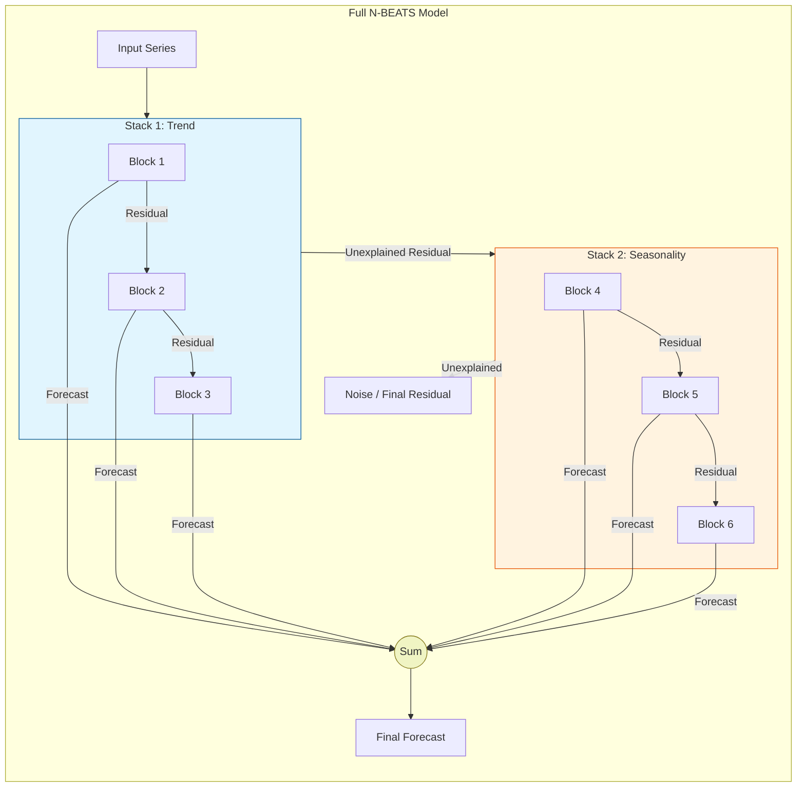

> [!WARNING]
> **Don't Confuse "Backcast" with "Backpropagation"**
> *   **Backcast** is a **forward-pass output**: The model predicts what happened in the past to subtract it from the input.
> *   **Backpropagation** is the **training algorithm**: N-BEATS is a standard neural network (just a very deep one). It is trained end-to-end using standard Backpropagation and Gradient Descent to learn the weights (Theta).

**What each Stack learns (Basis Functions):**

| Stack Type | Basis Function Constraints | What it Learns |
| :--- | :--- | :--- |
| **Trend Stack** | Polynomials (Monotonic, $t^p$) | Slowly varying trend |
| **Seasonality Stack** | Fourier Series (Sin/Cos) | Cyclic patterns |
| **Generic Stack** | Unconstrained (ReLU) | Remaining non-linear interactions |

### Deep Dive: Inside the Block (The Mathematics)

You asked: *"What happens inside the block? And what makes a stack Trend vs. Seasonal?"*

The answer lies in the **Basis Function ($g$)**.

#### 1. Inside the Block: producing $\theta$ (Theta)
Every block starts the same way, regardless of type:
1.  **Input**: Takes the history window `x` (e.g., 28 days of sales).
2.  **FC Stack**: Passes `x` through 4 standard Fully Connected layers with ReLU activation.
3.  **Output**: It doesn't output the forecast directly. It outputs **Expansion Coefficients ($\theta$)**.
    -   Think of $\theta$ as the "DNA" or "Recipe" for the curve.

#### 2. The Basis Function ($g$): The Constraint
This is where the magic happens. The block uses $\theta$ to construct the curve using a specific mathematical formula called a **Basis Function**.

$$ \text{Forecast} = \sum_{i} \theta_i \cdot g_i(t) $$

The **Stack Type** is determined by *which formula* we use for $g(t)$:

| Stack | The Basis Function ($g(t)$) | What $\theta$ controls |
| :--- | :--- | :--- |
| **Trend** | **Polynomials** ($1, t, t^2, t^3$) | $\theta_0$=Intercept, $\theta_1$=Slope, $\theta_2$=Curve |
| **Seasonality** | **Sine & Cosine** ($\sin(2\pi ft), \cos(2\pi ft)$) | $\theta$=Amplitude & Phase of the wave |
| **Generic** | **Identity** (No constraint) | $\theta$=The raw forecast values themselves |

#### 3. Zoomed In: The "Backcast" Connection

You asked: *"Where is the backcast arrow in the main chart?"*
In the high-level chart, it's hidden inside the "Residual" arrow. Here is the explicit view of what happens between two blocks:

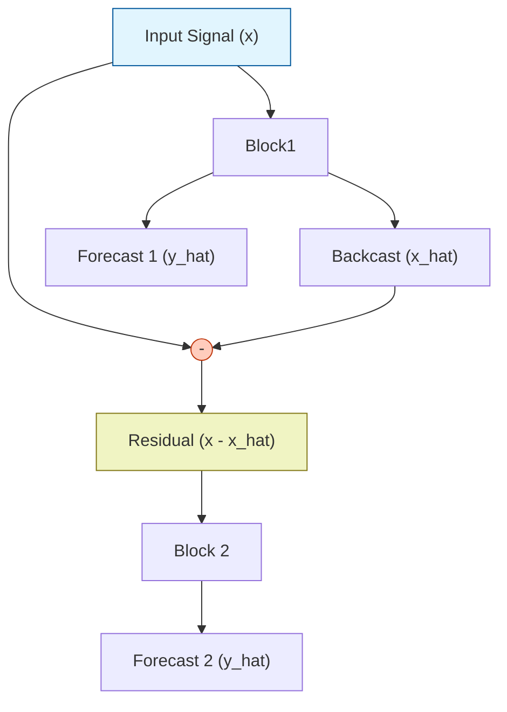

*   **Block 1** tries to reconstruct the input (Backcast).
*   **Subtraction**: We remove that reconstruction from the original signal.
*   **Result**: The **Residual** (what Block 1 failed to explain) becomes the **Input** for Block 2.

#### 4. The Loss Function: One Ring to Rule Them All?

You asked: *"Does each stack have its own loss function?"*

**NO.** There is typically only **ONE Global Loss Function** applied to the Final Forecast.

$$ \mathcal{L} = \text{MSE}(y_{true}, \hat{y}_{final}) $$

*   **Wait, how do the individual blocks learn?**
    *   Magic of Backpropagation!
    *   Since $\hat{y}_{final} = \hat{y}_{block1} + \hat{y}_{block2} + \dots$
    *   The gradient of the error flows back to *every single block* simultaneously.
    *   If Trend Block 1 does a bad job, it hurts the final sum, so the gradient updates Trend Block 1 to do better.
    *   **Self-Organization**: The model automatically figures out which block should explain which part of the signal to minimize the total error.

#### FAQ: How does it avoid confusion? (Trend vs Seasonality)

You asked: *"How does the Trend stack not accidentally learn Seasonality?"*

**The Answer: Mathematical Inability ("The Straightjacket").**

*   The **Trend Stack** is forced to use **Polynomials** of small degree (e.g., $t^2$ or $t^3$).
    *   Ask yourself: Can you draw a wiggly sine wave using only $t^2$?
    *   No. A parabola goes up or down. It *cannot* wiggle up and down 50 times like a seasonal pattern. It physically lacks the capacity.
    *   Therefore, the Trend stack *ignores* the seasonality because it **cannot represent it**.

*   The **Seasonality Stack** is forced to use **Periodic Functions** (Sine/Cosine).
    *   Ask yourself: Can a Sine wave go up forever like a trend?
    *   No. It must come back down. It cannot represent a long-term upward trend.
    *   Therefore, the Seasonality stack *ignores* the trend.


    *   No. It must come back down. It cannot represent a long-term upward trend.
    *   Therefore, the Seasonality stack *ignores* the trend.

#### 5. What happens to the Final Unexplained Residual?

You asked: *"What does N-BEATS do with the final unexplained residual?"*

**It throws it away.**

*   The Final Residual (after the last block) is the "trash".
*   It represents the part of the signal that **no stack could explain**.
*   Ideally, this should be pure **White Noise** (randomness).
*   **Diagnostic Value**: If the final residual still has a pattern (e.g., a trend), it means your model is "underfitting" (you need more stacks or blocks).

This ensures a clean separation of concerns without valid external supervision.

> [!CAUTION]
> **Critical Requirement: Input Window Size**
> You are 100% correct. If your input window is **shorter** than the seasonal cycle (e.g., input=30 days but seasonality=365 days), the model will see the "seasonal upswing" as a "trend".
> *   **Rule of Thumb**: Input window should be **2x to 3x** the seasonal period.
> *   To capture yearly seasonality, you need at least 2 years of history in the input window so the model can see the pattern repeat.

#### Advanced: Are there other Stack Types?

Yes! The N-BEATS architecture is flexible. Since it's just a matter of choosing a basis function $g(t)$, researchers have proposed other types:

1.  **Exogenous Stack (N-BEATSx)**:
    -   **Context**: The original N-BEATS was univariate (didn't use external variables like price/weather).
    -   **The Stack**: N-BEATSx adds an "Exogenous Block" which takes external features $E$ + history $x$. It projects them onto a basis function relevant to the exogenous driver (e.g., if you know a promotion is coming, it learns the "promotion shape").

2.  **Experimental Stacks**:
    -   Technically, you can use *any* mathematical function as a basis.
    -   **Wavelets**: Good for multi-scale analysis (short-term noise vs long-term trends).
    -   **B-Splines**: Good for smooth, flexible curves that are more local than polynomials.
    -   *Note*: These are rarely used in production contexts (Standard Trend/Seasonal covers 99% of business cases), but they exist in research.

**Example: The Trend Stack**
*   The FC layers look at the history and think: *"This looks like a straight line going up."*
*   They output $\theta = [0, 1, 0]$ (meaning: 0 intercept, 1 slope, 0 curve).
*   The Basis Function receives this and draws a straight line: $y = 0 + 1 \cdot t + 0 \cdot t^2$.

**Example: The Seasonality Stack**
*   The FC layers look at the residuals and think: *"This looks like a yearly cycle."*
*   They output $\theta$ corresponding to a 365-day period wave.
*   The Basis Function draws that specific sine wave.

#### Why N-BEATS is Suitable for Time Series

1.  **Handles Non-Stationarity**: By peeling off the trend in the first few blocks (via residual connections), the later blocks naturally operate on stationary residuals. It doesn't require differencing the data beforehand.
2.  **Interpretable Decompostion**: Unlike a black-box LSTM, you can sum the outputs of all Trend blocks to plot "The Trend", and all Seasonality blocks to plot "The Seasonality". This builds trust with stakeholders.
3.  **Global Learning**: It is a Global Model. Trained on thousands of series at once (e.g., M4 dataset), it learns shared patterns (like "weekend dip") that apply across all series, solving the cold-start problem.
4.  **No Feature Engineering**: It requires minimal feature engineering (just the history window), unlike LightGBM which needs extensive lag/rolling feature creation.

**When to Use**:
-   High-frequency data (hourly/daily) with complex seasonality.
-   Large-scale forecasting (1,000s of series).
-   When you need Deep Learning accuracy but also need to explain *why* the forecast is high (e.g., "It's mostly driven by the seasonal component").

---

### Temporal Fusion Transformer (TFT) [H]

*(The heavy hitter for complex, heterogeneous data)*

**One-Liner**: *A Transformer-based model designed explicitly to handle different types of inputs (static, known future, past-only) with interpretability built-in.*

#### 1. The Context: Transformers & Attention
You asked: *"Explain Transformers first."*

Originally built for NLP (Translation), Transformers replaced RNNs because they handle long-term memory better using **Attention**.
*   **RNN/LSTM**: Reads a sentence word-by-word (sequential). Forgets the beginning by the time it reaches the end.
*   **Attention**: Allows the model to look at **all time steps at once**.
    *   Query: "What am I trying to predict?" (Target at $t+1$)
    *   Key/Value: "What history is relevant?" (Pattern at $t-100$)
    *   Result: It can "attend" to a specific event 365 days ago without needing to remember the 364 days in between.

#### 2. Why TFT? (The "Heterogeneous Data" Problem)
Standard Transformers (like GPT) treat all inputs as a single stream of tokens. But Time Series data is **Heterogeneous** (different types):
1.  **Static Covariates**: Things that *never* change (Store Location, Brand).
2.  **Past-Observed Inputs**: Things you only know *historically* (Sales, Website Traffic).
3.  **Future-Known Inputs**: Things you know *in the future* (Holidays, Day of Week, Promotion Schedule).

**Why DNNs/Vanilla Transformers Fail here**:
*   A standard DNN mixes these all into one "soup". It doesn't know that "Store ID" is static while "Sales" is dynamic.
*   It often ignores static features because they are "boring" (constant values), even though they are critical for cold-start forecasting.

**TFT Succeeds because**: It has specific architectural "lanes" for each data type.

#### 3. The Architecture: Deep Dive

TFT is a beast. It combines the best of all worlds:
*   **LSTM layers**: To capture local context (what happened yesterday).
*   **Attention heads**: To capture long-term context (what happened last year).
*   **GRN (Gated Residual Networks)**: To skip noisy/irrelevant features.

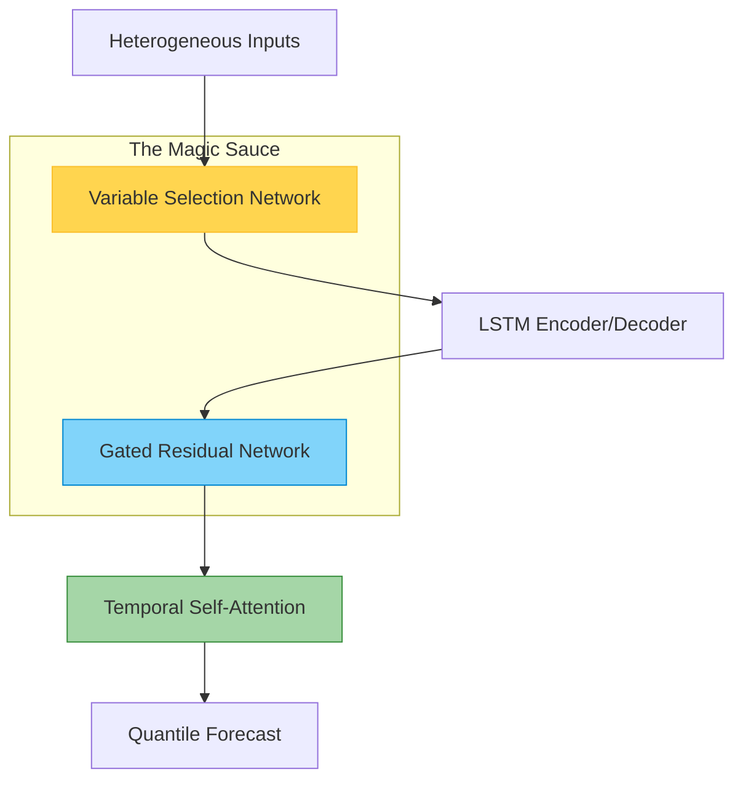

**Key Components Explained**:

**A. Variable Selection Network (VSN)**
*   **Problem**: You have 100 features, but only 3 matter. A normal NN includes noise from all 100.
*   **Solution**: TFT learns a "weight" for every feature ($\nu_j$). It explicitly selects which variables to focus on and suppresses the noise.
*   **Benefit**: You get **Feature Importance** out of the box.

> [!TIP]
> **FAQ: Why not just use L1 Regularization (Lasso)?**
> You asked: *"Wouldn't L1 regularization do the same thing?"*
>
> **L1 is Global & Static**: It kills a feature for *everyone, forever*.
> *   Example: L1 says "Temperature helps predict Ice Cream sales" $\to$ It keeps Temperature for *all* products, even Toilet Paper.
>
> **VSN is Context-Aware**: It selects features *per instance*.
> *   "For Ice Cream, I will use Temperature."
> *   "For Toilet Paper, I will ignore Temperature and use Price."
> *   This "instance-wise" selection is much more powerful than a single global decision.

**B. Gated Residual Network (GRN)**
*   **Problem**: Sometimes the relationship is simple (linear), sometimes complex (non-linear). Using a deep NN for a simple problem leads to overfitting.
*   **Solution**: The GRN uses "Gates" (GLU). It can choose to apply a complex non-linear transformation OR just skip it (act like a linear mode).
*   **Benefit**: Stability. It adapts its complexity to the data.

**C. Static Covariate Encoders**
*   **Problem**: How do we use "Store ID"?
*   **Solution**: TFT uses static features to **initialize the context** of the LSTMs and Attention layers.
*   **Benefit**: This allows it to condition the entire forecast on "This is a Luxury Store" vs "This is a Discount Store".

#### 4. Comparison: TFT vs N-BEATS vs DNN

| Feature | N-BEATS | TFT | Standard DNN (LSTM/MLP) |
| :--- | :--- | :--- | :--- |
| **Best For** | **Univariate Signal Processing**. If your data is mostly just "Sales History", N-BEATS wins. | **Complex Multi-variate**. If you have static features, future promos, and past weather, TFT wins. | Simple baselines or when latency is #1 concern. |
| **Data Types** | Ignores types (treats everything as history). | **Explicitly handles** Static, Past, Future-Known. | Treats everything as a flat vector. |
| **Interpretability** | **Signal Decomposition** (Trend vs Seasonality). | **Feature Importance** (Which variable mattered?) and **Attention** (Which time step mattered?). | **Black Box** (SHAP required). |
| **Speed** | ⚡ **Fast**. (FC layers are cheap). | 🐢 **Slow**. (Attention + LSTMs + Gating is heavy). | Medium. |
| **Probabilistic?** | Usually Point Forecast (can be adapted). | **Yes**, natively outputs Quantiles (P10, P50, P90). | No (requires custom loss). |

**Summary**:
*   Use **N-BEATS** when you have lots of series but few external regressors (e.g., M4 competition).
*   Use **TFT** when you have rich metadata (retail with promotions, pricing, holidays, store attributes).

#### 5. Deep Dive: What is a Quantile Forecast?

You asked: *"What is meant by quantile forecast?"*

Most models (like standard Linear Regression) predict the **Mean** (the average expected value).
A **Quantile Model** predicts a specific **Probability Threshold**.

*   **P50 (Median)**: "There is a 50% chance the true value is below this line." (This is your main forecast).
*   **P90 (Upper Bound)**: "There is a 90% chance the true value is below this." (Optimistic scenario).
*   **P10 (Lower Bound)**: "There is a 10% chance the true value is below this." (Pessimistic scenario).

**Why do we care?**
Business decisions usually depend on the **Tail Risk**, not the average.
*   **Inventory**: You don't stock the *average* demand (exhaust stock 50% of the time). You stock the **P90** demand (exhaust stock only 10% of the time).
*   **Staffing**: You staff for the **P90** call volume so customers don't wait.

**How does the model learn this? (Pinball Loss)**
It uses a tilted loss function called **Pinball Loss**.
*   To learn P90, the model is penalized **9x more** for under-predicting (true value > forecast) than for over-predicting.
*   This forces the model to push its prediction up high enough to cover 90% of the cases.

---

### DeepAR (Amazon) [H]

**One-Liner**: *A probabilistic RNN (LSTM/GRU) that learns a global model from many time series to handle scale, cold-starts, and uncertainty.*

**The Core Idea**:
*   Instead of predicting a single number ($\hat{y}$), DeepAR predicts the **parameters of a probability distribution** (e.g., $\mu, \sigma$ for Gaussian).
*   **Training**: Maximizes the Likelihood of the true data given these parameters.
*   **Inference**: Generates Monte Carlo samples from the predicted distribution to create prediction intervals.

#### 1. DeepAR vs. TFT: The Evolution

You asked: *"DeepAR has many similarities to TFT, correct?"*

**YES. They are siblings.**
*   Both come from similar research lineages (Amazon AWS Labs).
*   Both are **Global Models**: They learn patterns across thousands of time series at once.
*   Both are **Probabilistic**: They give you uncertainty intervals, not just point forecasts.
*   Both handle **Cold Starts**: They can predict for a new product by using learned patterns from similar existing products.

**The Difference: "Evolution"**
Think of **TFT** as **DeepAR++** (DeepAR with Superpowers).

| Feature | DeepAR (2017) | TFT (2019) |
| :--- | :--- | :--- |
| **Core Engine** | **RNN Only** (LSTM/GRU). Sequential processing. | **LSTM + Attention**. Sequential + Long-term lookback. |
| **Feature Handling** | Concatenates everything into one vector. (Static features are just repeated at every step). | **Specific Lanes**. Static features initialize state; Dynamic features go through variable selection. |
| **Interpretability** | **Black Box**. Hard to know why it predicted X. | **White Box**. Tells you *which variables* mattered and *which time steps* were important. |
| **Output** | Monte Carlo Samples (Simulations). | Direct Quantiles (P10, P50, P90). |

#### 2. When to use DeepAR instead of TFT?
*   **Speed**: DeepAR is lighter and faster to train than TFT.
*   **Simplicity**: If you don't need the intense interpretability of TFT, DeepAR is a fantastic, robust baseline.
*   **Count Data**: DeepAR excels at "Negative Binomial" likelihoods for intermittent demand (lots of zeros).

---

### Foundation Models: Chronos & TimesFM

**What they are**: Large pre-trained models for **zero-shot time series forecasting** — no training on your specific data needed.

| Model | Organization | Approach | Zero-Shot? |
|-------|-------------|---------|------------|
| **Chronos** | Amazon | Tokenizes values → T5 transformer | Yes |
| **TimesFM** | Google | Patch-based, pre-trained on 100B time points | Yes |
| **Moirai** | Salesforce | Universal forecasting, any frequency | Yes |
| **Lag-Llama** | Open-source | Decoder-only LLM for time series | Yes |

**Core idea**: Just as LLMs pre-trained on text can answer new questions without fine-tuning, these models pre-trained on massive time series corpora can forecast new series without training.

> [!NOTE]
> **Chronos v2 Update**: Amazon has released updated versions (Chronos-Bolt). Always check the official [AutoGluon-Chronos](https://github.com/autogluon/chronos) documentation for the latest API, as signatures (`predict` vs `generate`) may evolve.

```python
# Chronos usage (zero-shot)
from chronos import ChronosPipeline
import torch

pipeline = ChronosPipeline.from_pretrained(
    "amazon/chronos-t5-small",  # or 'large' for better accuracy
    device_map="cpu",
    torch_dtype=torch.bfloat16,
)

# context: past observations as a tensor
context = torch.tensor(df['sales'].values[-100:])  # last 100 points

forecast = pipeline.predict(
    context=context,
    prediction_length=12,   # 12 steps ahead
    num_samples=20          # for uncertainty quantification
)
# forecast shape: (20 samples, 12 steps)
```

**Zero-shot vs Fine-tuned**:
| Scenario | Use Zero-Shot | Fine-tune |
|---------|--------------|----------|
| Quick baseline, minimal setup | ✓ | |
| < 1 year of data | ✓ | |
| Standard patterns (retail, energy) | ✓ | |
| Highly specialized domain | | ✓ |
| Accuracy is critical | | ✓ |

---

### When to Use Neural Networks

> [!TIP]
> **Interview answer**: "I'd consider neural forecasters when I have 10,000+ series, complex cross-series patterns, or need probabilistic forecasts at scale.
>
> However, I specifically look at 3 dimensions:
> 1.  **Number of Features**:
>     *   **Few Features (Target + Lag)**: N-BEATS or ARIMA.
>     *   **Many Features (Static + Future)**: TFT (VSN handles noise) or LightGBM (requires feature engineering).
> 2.  **Length of History (Temporal)**:
>     *   **Short (< 2 seasonal cycles)**: Avoid Transformers/LSTMs (they need long context). Use LightGBM or simple statistical models.
>     *   **Long (> 3 years)**: Transformers shine here as they can attend to patterns years ago.
> 3.  **Time Resolution**:
>     *   **High Frequency (Minute/Hour)**: Neural Networks excel (can model complex intraday patterns).
    *   **Low Frequency (Month/Quarter)**: Not enough data points. Stick to ARIMA or ETS."

#### Scenario: Single Series with Many External Regressors?
You asked: *"What if I have just one series, but it's complicated with many external features?"*
(e.g., predicting total country GDP using 50 economic indicators)

*   **Avoid Deep Learning (TFT/N-BEATS)**: These models are "data hungry". Learning complex weights (VSN/GRN) from a single history usually leads to massive overfitting.
*   **Use LightGBM/XGBoost**: Tree-based models are excellent at finding non-linear interactions between features even with smaller data.
*   **Use Prophet/ARIMAX**: Good if relationships are mostly linear/additive.

> [!WARNING]
> **Important: The Achilles Heel of Trees (Trends & Horizon)**
> You correctly noted: *"LightGBM needs stationary data / short horizons."*
>
> 1.  **Trees Cannot Extrapolate Trends**:
>     *   A Decision Tree predicts the **average** of the training data in a leaf node. It cannot predict a value *higher* than the highest value it saw in training.
>     *   **Solution**: You MUST **de-trend** your data (e.g., predict `diff(sales)` or `log(sales)`) or add a "Linear Trend" feature so the tree essentially fits the residuals.
>
> 2.  **Recursive Errors**:
>     *   For long horizons (e.g., 30 days), LightGBM is typically used **recursively** (predict t+1, use that as input for t+2...).
>     *   Errors accumulate like compound interest.
>     *   **Solution**: For very long horizons, use a **Direct Strategy** (train 30 separate models, one for each step) or switch to a sequence model like **TFT/DeepAR** which predicts the whole path at once.

#### Which other models suffer from this?
You asked: *"What other models fail to extrapolate trends?"*

Basically, any **Local Learner** or **Bounded Activation** model:
1.  **Random Forests / XGBoost / CatBoost**: All tree ensembles suffer from the exact same "cannot predict outside training range" issue.
2.  **K-Nearest Neighbors (KNN)**: It just averages past examples. If your trend goes up, the "nearest neighbors" are always below the current point. It will flatline.
3.  **Support Vector Machines (SVR)**: Especially with RBF kernels, they default to the mean (0) far away from the training data.
4.  **Standard Neural Networks (tanh/sigmoid)**: These activation functions saturate (squash output between -1 and 1). They cannot predict a value of 1000 if they've only seen 1. (ReLU helps, but is unstable).

**The Fix**: Always **De-trend** your data before feeding it into these models!

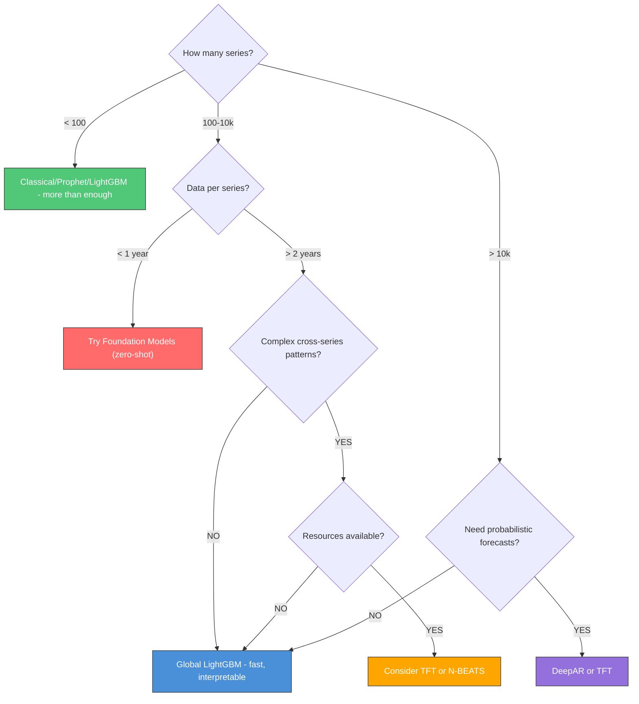

**Quick Reference: When NOT to Use Neural Networks**:

| Situation | Why Not | Use Instead |
|-----------|---------|------------|
| Small dataset (< 1k points per series) | Overfits badly | ARIMA, ETS, Prophet |
| Need fast iteration/debugging | Training slow, hard to inspect | LightGBM |
| Interpretability required | Black box, hard to explain | LightGBM + SHAP, ARIMAX |
| Limited compute/infrastructure | GPU needed for real gains | LightGBM on CPU |
| Single series forecasting | No cross-learning benefit | Prophet, ARIMA |

---

---

## 4.3.4 Practical Alternatives: Linear Baselines & Hybrids

> [!IMPORTANT]
> **Always Start Simple**. Before training a complex LightGBM model, fit a **Linear Regression** (or Ridge/Lasso). It takes seconds, provides a strong baseline, and is often deployed for its interpretability.

### 1. Linear Models (Ridge, Lasso)
While trees (LightGBM/XGBoost) are the gold standard for tabular data, **regularized linear models** (Ridge/Lasso) have unique strengths in time series:

*   **Extrapolation**: Unlike trees, linear models **CAN extrapolate trends**.
    *   *Scenario*: Sales have been growing by 10% every month for 3 years.
    *   **Tree Model**: Will predict a flat line (the maximum value seen in training) for next year. Fails to capture the continued growth.
    *   **Linear Model**: Will project the upward trend line into the future.
*   **Noise Robustness**: With high regularization (Lasso), they effectively ignore noise and select only the strongest signals.
*   **Implementation**: Use the **exact same feature matrix** (lags, rolling means) you built for LightGBM.

### 2. The "Hybrid" Strategy (Best of Both Worlds)
A powerful, common industry pattern is to combine them:

$$ \text{Forecast} = \text{LinearModel}(\text{Trend}) + \text{TreeModel}(\text{Residuals}) $$

1.  **Step 1**: Train a simple Linear Regression on `time_index` or trend components. This captures the long-term direction (extrapolation).
2.  **Step 2**: Calculate residuals: `Residuals = Actual - LinearPred`.
3.  **Step 3**: Train a LightGBM/XGBoost model to predict these **Residuals** using all other features (lags, seasonality, external regressors).
4.  **Final Prediction**: Add them up.

**Why Use Hybrids?**
*   **Extrapolation**: The linear part handles the long-term trend (going up/down beyond history).
*   **Non-Linearity**: The tree part handles complex seasonality and interactions that linear models miss.

---

## 4.3.5 Uncertainty Quantification

> [!TIP]
> **If You Remember ONE Thing**: Point forecasts are rarely enough for business decisions. You need **Prediction Intervals** (e.g., "sales will be between 100 and 150 with 90% confidence").

### Methods for Reliable Intervals

| Family | Method | Reliability | How It Works |
| :--- | :--- | :--- | :--- |
| **Classical (ARIMA/ETS)** | **Parametric** (Normal) | ⚠️ Medium | Assumes residuals are normally distributed. `get_forecast().conf_int()`. Good if data is clean, bad if fat-tailed. |
| **Prophet** | **Simulation** (Monte Carlo) | ⚠️ Low-Medium | Samples trend changes (and optionally seasonality). **Often too narrow** because it ignores structural misspecification. |
| **ML (LightGBM/XGB)** | **Quantile Regression** | ✅ High | Train 3 separate models: one for P10 (lower), P50 (median), P90 (upper). Objective: Pinball Loss. |
| **Deep Learning** | **Probabilistic Head** | ✅ High | Model predicts distribution parameters (e.g., $\mu, \sigma$ for Gaussian, or Negative Binomial params) per step. |
| **Any Model** | **Conformal Prediction** | ✅✅ Highest | Post-hoc calibration. "I want 90% coverage." It calculates residuals on a calibration set and adjusts the interval to guarantee that coverage (assuming exchangeability). |

### Code: Quantile Regression in LightGBM

The industry standard for ML uncertainty:

```python
# Train 3 models
models = {}
for alpha in [0.1, 0.5, 0.9]:
    model = LGBMRegressor(objective='quantile', alpha=alpha)
    model.fit(X_train, y_train)
    models[alpha] = model

# Predict
lower = models[0.1].predict(X_test)
median = models[0.5].predict(X_test)
upper = models[0.9].predict(X_test)

# Interpretation: "We are 80% confident the value is between {lower} and {upper}"
```

---

---

## 4.3.6 Scenario Deep Dive: 1000s of Series (Low-Feature Mode)

> **Scenario**: "I have 1,000+ time series (e.g., product sales). I have **only historical data** (no weather, no promos, no external features). I need a good forecast fast."

This is a classic industrial problem. Maintaining 1,000 separate ARIMA models is a nightmare. Here are the three modern strategies to solve it:

### Strategy 1: The "Global" LightGBM (The Workhorse)
Train **ONE** single LightGBM model on all 1,000 series simultaneously.

*   **Why it works**: The model learns shared patterns (e.g., "sales generally drop on weekends") across all series, which a single-series ARIMA can't do.
*   **Critical Requirement**: **Scale/Normalize Target**.
    *   Series A sells 10,000 units. Series B sells 10 units.
    *   If you don't scale, the model effectively ignores Series B because its errors are tiny.
    *   **Solution**: Divide each series by its mean (or max) during training. Predict `y / mean_y`. At inference, multiply back by `mean_y`.
*   **Feature Engineering (Lag-Heavy)**:
    Since you have no external features, you must rely entirely on history:
    1.  **Lags**: `lag_1`, `lag_7`, `lag_14`, `lag_28`, `lag_365`.
    2.  **Rolling Statistics**: `rolling_mean_7`, `rolling_std_7`, `rolling_mean_28`.
    3.  **Calendar Features**: `day_of_week`, `month`, `is_weekend` (extracted from date).
    4.  **Series ID**: Optional. You can One-Hot or Label Encode the `product_id` to let the model learn specific intercepts for each series.

### Strategy 2: Deep Learning Types (N-BEATS / TFT)
This is the **ideal use case** for Neural Forecasters.
*   **Why**: They are designed to learn "embeddings" for each series ID and shared temporal patterns across thousands of series.
*   **N-BEATS**: Purely looks at past history to predict future. No external regressors needed. Very strong performance on this exact "M4 Competition" style data.
*   **DeepAR**: Good if you need probability distributions (uncertainty) for every single product.

### Strategy 3: Zero-Shot Foundation Models (Chronos / TimesFM)
The "Lazy" (but effective) Solution.
*   **Approach**: Pass your 1,000 historical arrays to a pre-trained model like Chronos.
*   **Pros**: Zero training time. Handles "only lag data" natively (that's all it sees).
*   **Cons**: Inference can be slow/expensive for 1,000s of series compared to a simple LightGBM.

### Summary Recommendation
| Metric | Winner | Advice |
| :--- | :--- | :--- |
| **Accuracy** | **Ensemble** | Average of Global LightGBM + N-BEATS. |
| **Speed** | **Global LightGBM** | Fastest to train and predict. Best for "good enough" at scale. |
| **Simplicity** | **Chronos** | No feature engineering, no training. Just predict. |

---

## Method Selection Flowchart: Classical vs Prophet vs ML vs DL

```mermaid
graph TD
    START["New Forecasting Problem"]

    START --> Q0{"How many series?"}
    Q0 --> |"1 series"| Q1{"Clear trend/seasonality?"}
    Q0 --> |"Many series"| Q6{"Need cross-series learning?"}

    Q1 --> |YES| Q2{"Need holidays or known events?"}
    Q1 --> |NO| ETS["ETS or ARIMA"]

    Q2 --> |YES| PROPHET["Prophet"]
    Q2 --> |NO| Q3{"External regressors available?"}

    Q3 --> |YES| Q4{"Need coefficient interpretation?"}
    Q3 --> |NO| Q5{"Multiple seasonalities?"}

    Q4 --> |YES| ARIMAX["ARIMAX"]
    Q4 --> |NO| ML1["LightGBM with features"]

    Q5 --> |YES| PROPHET
    Q5 --> |NO| CLASSICAL["ARIMA or ETS"]

    Q6 --> |YES| Q7{"Probabilistic forecasts needed?"}
    Q6 --> |NO| Q8{"Enough data per series?"}

    Q7 --> |YES| DEEPAR["DeepAR or TFT"]
    Q7 --> |NO| LGBM_GLOBAL["Global LightGBM"]

    Q8 --> |YES| LGBM_GLOBAL
    Q8 --> |NO| FOUNDATION["Chronos/TimesFM zero-shot"]

    style PROPHET fill:#50c878,stroke:#333,color:#fff
    style LGBM_GLOBAL fill:#4a90d9,stroke:#333,color:#fff
    style DEEPAR fill:#9370db,stroke:#333,color:#fff
    style ARIMAX fill:#ffa500,stroke:#333,color:#fff
    style CLASSICAL fill:#87ceeb,stroke:#333
    style ETS fill:#87ceeb,stroke:#333
    style FOUNDATION fill:#ff6b6b,stroke:#333,color:#fff
```

| Method | Best For | Avoid When |
|--------|---------|-----------|
| **ARIMA/ETS** | Single series, short history, interpretability | External regressors, multiple seasonalities |
| **Prophet** | Business data with holidays/events, multiple seasonalities, non-technical tuning | High-frequency, no seasonality, scale |
| **LightGBM (local)** | External regressors, feature-rich, single/few series | No feature engineering resources, very short series |
| **LightGBM (global)** | Many related series, cold start, scale | Highly unique per-series patterns |
| **DeepAR/TFT** | 10k+ series, probabilistic forecasts, complex covariates | Small data, fast iteration, interpretability |
| **Foundation Models** | Zero-shot baseline, little data, exploration | Production accuracy-critical applications |

> [!TIP]
> **Interview Pro Tip**: Always start with a simple baseline (ETS or naive), then compare Prophet and LightGBM, then consider DL only if the simpler models are insufficient and you have the data/compute. The answer to "which model would you use?" is almost always "I'd compare multiple approaches with cross-validation."

---

## Company-Specific Angles

### Amazon: Scale, Global Models & DeepAR

**Context**: Amazon forecasts demand for 400M+ products across fulfillment centers worldwide.

| What Amazon Cares About | How to Frame Your Answer |
|------------------------|--------------------------|
| **Scale (millions of SKUs)** | "Prophet fits one model per series — doesn't scale to Amazon's catalog. I'd use global LightGBM or DeepAR which train once on all series." |
| **DeepAR context** | "Amazon developed DeepAR specifically for this — probabilistic, global, handles varying scales. At interview, knowing this signals familiarity with their stack." |
| **Cold start** | "Global models solve cold start: new products inherit patterns from similar existing products via the series_id embedding." |
| **M5 competition** | "Global LightGBM won M5 (Walmart demand forecasting at scale). The key was feature engineering + global training, not complex models." |

**Sample Question**: *"How would you improve a Prophet model that's forecasting demand for 50,000 products?"*

**Strong Answer**: "Prophet trains one model per series and is slow at 50,000 series. I'd migrate to a global LightGBM approach — one model trained on all series with a series_id feature and rich lag/rolling features. This gives: (1) cross-series learning where trending new SKUs borrow patterns from similar established ones, (2) 100x faster training, (3) easy incorporation of promotions, pricing, and seasonal features as columns. I'd validate with walk-forward CV and compare MAPE across hierarchical levels."

---

### Meta: Experimentation & Real-Time

**Context**: Meta forecasts ad revenue, user engagement, and resource utilization.

| What Meta Cares About | How to Frame Your Answer |
|----------------------|--------------------------|
| **Real-time inference** | "For real-time alerting, pre-computed lag features + LightGBM inference is microseconds. Prophet requires refitting for new points — too slow." |
| **Uncertainty quantification** | "For A/B test power analysis, I need calibrated uncertainty. LightGBM quantile regression or DeepAR gives distribution forecasts." |
| **Experiment baselines** | "Prophet is excellent for synthetic control — fit on pre-treatment, forecast during treatment period as counterfactual." |
| **Anomaly detection** | "Model residuals from any forecaster can be used for anomaly detection. Spikes in residuals signal unusual events." |

**Sample Question**: *"How would you detect anomalies in a key business metric in real-time?"*

**Strong Answer**: "I'd maintain a sliding-window LightGBM model that produces predictions every hour with prediction intervals. An anomaly is when the actual falls outside the interval. For robustness, I'd use conformal prediction intervals (guaranteed coverage) rather than Gaussian assumptions, since business metrics are often skewed. The feature set would include recent lags, rolling stats, and calendar features — no future information needed."

---

### Netflix: Content Demand & Cold Start

**Context**: Netflix forecasts viewing hours for content acquisition decisions.

| What Netflix Cares About | How to Frame Your Answer |
|-------------------------|--------------------------|
| **Content lifecycle patterns** | "New shows follow a spike-then-decay pattern. I'd model this explicitly: a log-linear decay curve fitted to the first 2 weeks, then transition to ARIMA/ETS as history accumulates." |
| **Attribute-based cold start** | "For a new show launching next month, I'd use content attributes (genre, budget tier, similar shows) to predict the initial spike via regression on the attribute features of historical launches." |
| **Global model for many shows** | "With 1000+ active titles, global LightGBM with title embeddings or category features can learn from the portfolio. New titles get predictions immediately via their attribute profile." |
| **Uncertainty matters** | "Content acquisition decisions need P10/P50/P90 forecasts. I'd use quantile regression or DeepAR's distributional output." |

---

## Code Memorization Priority Guide

> [!TIP]
> **One Sentence to Remember Everything**: "Prophet: `fit(df)` + `make_future_dataframe()` + `predict()`. LightGBM: lag features with `.shift()` + time-ordered split + `LGBMRegressor().fit()`."

### Tier 1: Must Know Cold (5 items)

| # | What to Memorize | Memory Hook |
|---|------------------|-------------|
| 1 | Prophet columns: must be named `ds` and `y` | "ds = date series, y = your outcome" |
| 2 | `changepoint_prior_scale` controls trend flexibility | "Higher → wiggly trend, lower → rigid" |
| 3 | Always `.shift(1)` before `.rolling()` for lag features | "Shift before roll = no leakage" |
| 4 | Walk-forward validation: time-ordered split, never random | "Time flows forward, so must your splits" |
| 5 | Global LightGBM: add `series_id` as categorical feature | "One model, series_id tells it which series" |

### Tier 2: Should Know (5 items)

| # | What to Know | When Asked |
|---|--------------|------------|
| 6 | `seasonality_mode='multiplicative'` for growing seasonal swings | "Seasonal amplitude scales with level" |
| 7 | `model.add_seasonality(name, period, fourier_order)` | "Custom seasonality in Prophet" |
| 8 | Direct vs recursive multi-step forecasting | "How do you forecast 7 days ahead?" |
| 9 | DeepAR = probabilistic, RNN-based, global model | "Amazon's production forecaster" |
| 10 | Foundation models (Chronos) = zero-shot baseline | "Quick baseline with no training" |

### What Interviewers ACTUALLY Ask (90% Verbal)

> **"How would you incorporate promotions into your forecast?"**
> → "Two options: ARIMAX adds promotions as regressors with interpretable coefficients; LightGBM adds a `promotion_flag` feature. Key constraint: you need to know future promotion dates at forecast time."

> **"Why can't you use k-fold cross-validation for time series?"**
> → "It would let future data leak into training. If fold 5 trains on weeks 1-52 shuffled, it learns from future patterns. Walk-forward validation respects time order."

> **"When would you use Prophet over LightGBM?"**
> → "Prophet when domain experts need to adjust the model, when holidays are the main driver, or when you have a single series with clear trend and seasonality. LightGBM when you have rich external features, many series, or need to scale to millions of products."

---

## Interview Cheat Sheet

### 10 Most Common Modern Methods Interview Questions

| # | Question | Key Answer Points |
|---|----------|-------------------|
| 1 | **What is Prophet and when would you use it?** | Additive model g(t)+s(t)+h(t), handles multiple seasonalities and holidays, no stationarity needed, one series at a time |
| 2 | **How do you convert time series to a supervised learning problem?** | Create lag features + rolling stats + date features, time-ordered train/test split |
| 3 | **What is data leakage in time series and how do you prevent it?** | Using future info in features; fix: .shift(1) before rolling, no random splits |
| 4 | **Recursive vs direct multi-step forecasting?** | Recursive: one model, errors compound. Direct: H models, cleaner but expensive |
| 5 | **What is a global model?** | One model trained on ALL series; learns cross-series patterns; wins at scale |
| 6 | **When would you choose LightGBM over Prophet?** | External regressors, many series, need feature importance, scaling requirements |
| 7 | **What does changepoint_prior_scale control?** | Flexibility of trend — higher = more changepoints, lower = smoother trend |
| 8 | **What is DeepAR?** | Amazon's probabilistic RNN-based global forecasting model |
| 9 | **What are Foundation Models for time series?** | Pre-trained zero-shot forecasters (Chronos, TimesFM), no training needed |
| 10 | **How do you validate a time series ML model?** | Walk-forward cross-validation, expanding or sliding window, time-ordered always |

### Red Flags Table (What NOT to Say)

| Don't Say | Why It's Wrong | Say Instead |
|-----------|----------------|-------------|
| "I'd use random train/test split" | Future leaks into training set | "Walk-forward validation with time-ordered cutoff" |
| "Prophet works for any time series" | Fails on high-frequency, short series, scale | "Prophet excels at business data with trends, seasonality, holidays" |
| "I compute rolling means directly on the target" | Leakage: includes current period | "I shift first, then roll: `.shift(1).rolling(7).mean()`" |
| "Neural nets always outperform LightGBM" | Wrong: LightGBM won M5 over DL | "On tabular time series, LightGBM often wins over DL at smaller scale" |
| "Global models lose individual series patterns" | Partly wrong: you add series_id | "Global models add series_id as a feature, preserving per-series identity" |

### Impressive Points (Senior-Level Thinking)

| Topic | What to Say | Why It Impresses |
|-------|-------------|-----------------|
| **M5 Competition** | "The top M5 solutions were dominated by global LightGBM with lag features — not neural networks. Cross-series learning was the key." | Shows empirical awareness |
| **Chronos/TimesFM** | "Foundation models for time series are now viable zero-shot baselines, especially when data is limited." | Shows cutting-edge awareness |
| **Feature engineering discipline** | "The `.shift(1)` before `.rolling()` is the most common production bug I watch for in code reviews." | Shows production experience |
| **Model selection** | "I start with a naive baseline, then ETS/ARIMA, then Prophet, then LightGBM. DL only if simpler methods fall short." | Shows systematic thinking |
| **Global vs local** | "I default to global models for supply chain — M5 proved it. The only exception is highly unique series with long histories." | References real evidence |

---

## Self-Test Questions

### Conceptual Questions

<details>
<summary><strong>Q1: What's the difference between Prophet's trend model and ARIMA's differencing?</strong></summary>

**Answer**:
- **ARIMA differencing**: Removes trend by subtracting consecutive values (assumes unit root/stochastic trend). Residuals should be white noise.
- **Prophet trend**: Models trend explicitly as a piecewise linear or logistic function (assumes deterministic trend). The trend is a component, not something to remove.

In practice: If trend is **stochastic** (random walk), ARIMA differencing is appropriate. If trend is **deterministic** (a predictable growth curve), Prophet's explicit trend model is better.

</details>

<details>
<summary><strong>Q2: A colleague builds a 7-day rolling mean feature but forgets to shift first. How does this cause leakage?</strong></summary>

**Answer**:
Without `.shift(1)`, `roll_mean_7` at time $t$ includes values from $t-6$ through $t$ — including $t$ itself (the current value of the target). Since the target $y_t$ is included in its own feature, the model trivially learns to output the current value and appears to have near-zero training error. In production, where $y_t$ is unknown at prediction time, the model fails.

**Fix**: `df['roll_mean_7'] = df['target'].shift(1).rolling(7).mean()`

</details>

<details>
<summary><strong>Q3: Why does a global LightGBM model outperform local ARIMA on the M5 Walmart dataset?</strong></summary>

**Answer**:
Three key reasons:
1. **Cross-series learning**: Similar products (same category, same store) share demand patterns. Global model learns these shared patterns; local ARIMA models them in isolation.
2. **Feature richness**: LightGBM can incorporate price, promotions, store-level features, and product attributes. ARIMA uses only past values.
3. **Data efficiency**: Products with short history benefit from patterns learned from similar products with long history. Local ARIMA has nothing to borrow from.

The global model doesn't ignore per-series differences — it handles them via the series_id feature and product attributes.

</details>

<details>
<summary><strong>Q4: When would you choose direct multi-step over recursive forecasting?</strong></summary>

**Answer**:
**Direct** when:
- Forecast horizon is long (7+ steps) — error accumulation in recursive becomes significant
- Model is highly nonlinear (errors compound worse)
- Computational cost is acceptable (training H models)
- Per-horizon accuracy matters (different patterns at h=1 vs h=7)

**Recursive** when:
- Short horizon (1-3 steps)
- Simplicity is important (one model to maintain)
- Computational cost is a concern

In practice: Direct for 7-day weekly forecasting (train 7 models), recursive for 1-3 day ahead with LightGBM.

</details>

### Practical Questions

<details>
<summary><strong>Q5: Your Prophet model shows a strong upward trend that seems unrealistic for a 2-year forecast. What do you do?</strong></summary>

**Answer**:
Two approaches:
1. **Logistic growth**: Set `growth='logistic'` and define a `cap` (carrying capacity). Forces the trend to saturate at a realistic ceiling.
2. **Reduce changepoint_prior_scale**: A lower value (e.g., 0.01) makes the trend more rigid, preventing over-extrapolation from recent data.

Also check: Is the strong trend due to a recent COVID/seasonal artifact in training data? If so, consider truncating the training set or adding changepoints manually.

**Interview-ready**: "I'd switch to logistic growth with a domain-informed capacity, then validate the 2-year forecast against bottom-up estimates from the business team."

</details>

<details>
<summary><strong>Q6: You have 500 time series, each with 1 year of daily data. Which approach would you use?</strong></summary>

**Answer**:
This sits in the middle — too many for individual attention, not enough data per series for DL.

**Recommended**: Global LightGBM.
- 500 series × 365 days = 182,500 training rows — plenty for LightGBM
- Features: lag_1, lag_7, lag_14, roll_mean_7/28, date features, series_id
- 1 year gives at least 1 full seasonal cycle for feature learning

**Alternatively**: Nixtla's StatsForecast library for fast per-series ETS/ARIMA, then compare.

**Avoid**: Prophet (1 year may be insufficient for yearly seasonality detection). Deep learning (1 year too short per series for TFT/DeepAR without pre-training).

</details>

<details>
<summary><strong>Q7: Your LightGBM forecaster is great in-sample but has 40% MAPE on the test set. What do you investigate?</strong></summary>

**Answer**:
Classic overfitting. Investigate:
1. **Leakage check**: Are any rolling features computed without shift? Does any feature inadvertently include the target?
2. **Feature importance**: Are lag features driving predictions? If lag_1 dominates and accuracy drops at h=7, you may have used wrong lags for your horizon.
3. **Train/test split**: Is the test set in a different distribution? (Holiday period, seasonality shift, external shock like COVID)
4. **Feature count vs data**: Reduce `num_leaves`, increase `min_child_samples`, add regularization.
5. **Walk-forward CV**: Check if this 40% is consistent across multiple test windows or just one unlucky period.

</details>

---

## Learning Objectives Checklist

### 4.3.1 Prophet [H]

- [ ] Write Prophet model equation: y(t) = g(t) + s(t) + h(t) + ε(t)
- [ ] Explain each component: g(trend), s(seasonality), h(holidays)
- [ ] Know three trend models: linear, logistic growth, flat
- [ ] Explain Fourier series for seasonality (conceptually, not the math)
- [ ] Know default seasonalities: weekly (order=3), yearly (order=10)
- [ ] Add custom seasonality with `model.add_seasonality()`
- [ ] Know `changepoint_prior_scale`: higher → more flexible trend
- [ ] Know `seasonality_mode='multiplicative'` for growing seasonal swings
- [ ] Add custom holidays with `lower_window` and `upper_window`
- [ ] Explain how changepoints work: 25 candidates in first 80%, sparse prior
- [ ] Perform cross-validation with `prophet.diagnostics.cross_validation()`
- [ ] Know limitations: needs 2+ cycles, slow at scale, intervals often too narrow
- [ ] Know when Prophet fails vs alternatives

### 4.3.2 ML-Based Forecasting [H]

- [ ] Explain the transformation: time series → supervised tabular problem
- [ ] Create lag features with `.shift(k)` without leakage
- [ ] Create rolling features with `.shift(1).rolling(w)` — shift FIRST
- [ ] Create date/calendar features from datetime index
- [ ] Create Fourier features for smooth cyclical encoding
- [ ] Explain data leakage: 3 ways it happens, 3 ways to fix it
- [ ] Explain why random train/test split is WRONG for time series
- [ ] Implement walk-forward validation (expanding window)
- [ ] Compare expanding vs sliding window trade-offs
- [ ] Explain recursive vs direct multi-step forecasting
- [ ] Explain global vs local models: definition, trade-offs, when each wins
- [ ] Implement global LightGBM with series_id as categorical feature
- [ ] Know trees cannot extrapolate beyond training range
- [ ] Know M5 competition finding: global LightGBM won

### 4.3.3 Neural Forecasters [L]

- [ ] Know N-BEATS: "Fully connected, interpretable trend/seasonality stacks, no feature engineering"
- [ ] Know TFT: "Transformer-based, handles static/known-future/observed inputs, quantile forecasts"
- [ ] Know DeepAR: "Amazon's probabilistic RNN global model, outputs distribution not point"
- [ ] Know Foundation Models: Chronos (Amazon), TimesFM (Google) — zero-shot forecasting
- [ ] Explain global vs local for neural: DL models are inherently global
- [ ] Know when to consider DL: 10k+ series, complex cross-series patterns, probabilistic needed
- [ ] Know when NOT to use DL: small data, interpretability, fast iteration, single series

### General

- [ ] Answer: "When would you use Prophet vs LightGBM?"
- [ ] Answer: "Walk me through building an ML forecasting pipeline"
- [ ] Answer: "How do you avoid data leakage in time series?"
- [ ] Answer: "What is a global model and when does it win?"
- [ ] Handle company-specific angles (Amazon scale, Meta experimentation, Netflix cold-start)

---

*Previous: [4.2 Classical Methods — ARIMA, ETS, VAR](./02_classical_methods.md)*

*Next: [4.4 Practical Considerations — Metrics, CV, Hierarchical Forecasting](./04_practical_considerations.md)*
